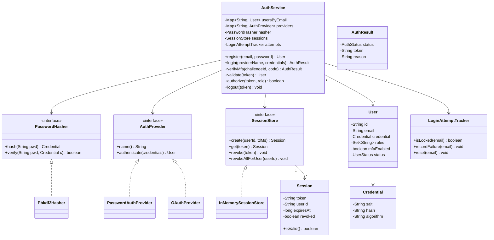

An authentication service question is really a security-decisions question wearing an OOP costume: the class diagram is almost incidental, and what interviewers actually listen for is whether you store passwords safely, make sessions genuinely revocable, and treat "MFA required" as a normal outcome rather than an exception.

## Requirements

### Functional

- `register(email, password)` rejects duplicate emails and weak passwords; passwords are stored as salt plus a slow hash, never reversible plaintext.
- `login(providerName, credentials)` returns a session token with an expiry; login methods are pluggable — password today, OAuth providers later, with no change to the flow.
- If MFA is enabled for the user, login returns a pending challenge instead of a token; a valid TOTP code completes it.
- `validate(token)` returns the user, or fails if the token is expired or revoked.
- `logout(token)` revokes one session; `logoutAll(userId)` revokes every session for that user.
- The account locks for N minutes after K consecutive failed logins.
- Password reset uses a single-use, time-bound token.
- `authorize(token, role)` performs a basic role check.

### Non-functional and assumptions

- Opaque, server-side session tokens rather than JWTs — simpler to revoke instantly, at the cost of a store lookup per request.
- Real OAuth handshakes with providers, a distributed session store, device fingerprinting/risk scoring, and email/SMS delivery mechanics are all out of scope.
- Single process, in-memory storage for the interview; nothing should prevent swapping the session store for Redis later without touching the flow.
- Multiple concurrent sessions per user are allowed and must be individually revocable.

### Clarifying questions to ask

> [!TIP]
> Ask "session tokens or JWTs?" before designing anything else — it decides whether `validate` is a store lookup (revocable instantly) or a signature check (stateless, but revocation needs a second mechanism). Stating the trade-off out loud, even if the interviewer picks for you, signals you understand the cost either way.

- Which login methods are in scope now, and is the design expected to add more without touching the core flow?
- Is MFA mandatory, optional per user, or not in scope at all?
- What should happen after repeated failed logins — a lockout, a CAPTCHA, or both?
- Is password reset in scope, and does it need to invalidate existing sessions on success?
- Can a user hold multiple active sessions across devices, and must each be independently revocable?

## Core objects

| Class | Responsibility | Key fields/methods |
|---|---|---|
| `AuthService` | Orchestrator — register, login, validate, logout | `register`, `login`, `verifyMfa`, `validate`, `authorize` |
| `User` | Identity, credential, roles, MFA state | `credential`, `roles`, `mfaEnabled`, `status` |
| `Credential` | Salt, hash and the algorithm used to produce it | `salt`, `hash`, `algorithm` |
| `PasswordHasher` | Strategy — the hashing algorithm | `hash(password)`, `verify(password, credential)` |
| `AuthProvider` | Strategy — a login method | `name`, `authenticate(credentials) -> User` |
| `SessionStore` | Repository — token lifecycle | `create`, `get`, `revoke`, `revokeAllForUser` |
| `LoginAttemptTracker` | Brute-force lockout bookkeeping | `isLocked(email)`, `recordFailure(email)` |
| `AuthResult` | Result object for login outcomes | `status` (SUCCESS/MFA_REQUIRED/FAILURE), `token`, `reason` |

## Class design



## Key design decisions

### 1. Login methods behind a Strategy, not a branch on provider name

`AuthProvider` abstracts "how do I turn these credentials into a `User`?"; `AuthService.login` just looks up `providers.get(providerName)` and calls it. Pattern: **Strategy**.

> [!KEY]
> Rejected alternative: an `if/else` chain in `login` — `if (providerName.equals("password")) {...} else if (providerName.equals("google")) {...}`. Adding SAML or a second OAuth provider would mean editing and redeploying the core login method every time.

### 2. Hash algorithm behind a Strategy, with the algorithm name stored per credential

`PasswordHasher.hash`/`verify` isolate the KDF from everything else, and `Credential.algorithm` records which one produced a given hash. In the Java ecosystem this Strategy is exactly Spring Security's `PasswordEncoder` (`BCryptPasswordEncoder`, `Argon2PasswordEncoder`), which you would reach for in production instead of hand-rolling one. Recording the algorithm is what makes migrating to a stronger one possible without a mass password reset: re-hash transparently on next successful login. Rejected alternative: calling a specific hash function directly wherever passwords are checked — indistinguishable hashes with no record of which algorithm made them, so migrating means either breaking every existing credential or maintaining brittle parallel code paths forever.

### 3. Session lifecycle behind a Repository interface

`SessionStore` hides "where sessions live" behind `create`/`get`/`revoke`/`revokeAllForUser`. Swapping the in-memory implementation for a Redis-backed one (TTL on the key, natural expiry) is a constructor change, not a rewrite. Rejected alternative: session state as fields directly inside `AuthService` — couples the orchestrator's business logic to a specific storage choice, and makes horizontal scaling (multiple auth servers) impossible without a rewrite.

### 4. Login outcome is a Result object, not an exception

`AuthResult` carries `SUCCESS`, `MFA_REQUIRED`, or `FAILURE` explicitly. Rejected alternative: throwing an exception the moment MFA is required — `MFA_REQUIRED` is an expected, common outcome of a correct password, not an error. Modeling it as an exception conflates "something went wrong" with "here's the next step," and makes the two-step login flow (password, then TOTP) awkward for callers to express.

## Implementation

```java
public interface PasswordHasher {
    Credential hash(String password);
    boolean verify(String password, Credential credential);
}

// A hand-rolled PBKDF2 hasher; in production prefer Spring Security's
// PasswordEncoder (BCryptPasswordEncoder / Argon2PasswordEncoder).
public class Pbkdf2Hasher implements PasswordHasher {
    private static final int ITERATIONS = 100_000;
    private static final int KEY_LENGTH = 256; // bits
    private static final SecureRandom RANDOM = new SecureRandom();

    @Override
    public Credential hash(String password) {
        byte[] salt = new byte[16];
        RANDOM.nextBytes(salt);
        byte[] hash = derive(password, salt);
        return new Credential(
            Base64.getEncoder().encodeToString(salt),
            Base64.getEncoder().encodeToString(hash),
            "PBKDF2-" + ITERATIONS);
    }

    @Override
    public boolean verify(String password, Credential credential) {
        byte[] salt = Base64.getDecoder().decode(credential.salt());
        byte[] actual = derive(password, salt);
        // Constant-time comparison — a plain equals leaks timing information about the hash.
        return MessageDigest.isEqual(actual, Base64.getDecoder().decode(credential.hash()));
    }

    private static byte[] derive(String password, byte[] salt) {
        try {
            KeySpec spec = new PBEKeySpec(password.toCharArray(), salt, ITERATIONS, KEY_LENGTH);
            SecretKeyFactory factory = SecretKeyFactory.getInstance("PBKDF2WithHmacSHA256");
            return factory.generateSecret(spec).getEncoded();
        } catch (GeneralSecurityException e) {
            throw new IllegalStateException("PBKDF2 not available", e);
        }
    }
}
```

```java
public class PasswordAuthProvider implements AuthProvider {
    private static final Credential DUMMY = new Credential("ZHVtbXk=", "ZHVtbXk=", "PBKDF2-100000");
    private final Map<String, User> users;
    private final PasswordHasher hasher;

    public PasswordAuthProvider(Map<String, User> users, PasswordHasher hasher) {
        this.users = users;
        this.hasher = hasher;
    }

    @Override
    public String name() {
        return "password";
    }

    @Override
    public User authenticate(Map<String, String> credentials) {
        String email = credentials.get("email");
        User user = users.get(email);
        if (user == null) {
            hasher.verify(credentials.get("password"), DUMMY); // burn equal time, no enumeration
            return null;
        }
        return hasher.verify(credentials.get("password"), user.getCredential()) ? user : null;
    }
}
```

```java
public class AuthService {
    private static final long SESSION_TTL_MS = 30 * 60 * 1000L;

    public AuthResult login(String providerName, Map<String, String> credentials) {
        String email = credentials.get("email");
        if (attempts.isLocked(email)) return AuthResult.failure("Account temporarily locked");

        User user = providers.get(providerName).authenticate(credentials);
        if (user == null) {
            attempts.recordFailure(email);
            return AuthResult.failure("Invalid credentials");
        }

        attempts.reset(email);
        if (user.isMfaEnabled()) return AuthResult.mfaRequired(createChallenge(user.getId()));

        return AuthResult.success(sessions.create(user.getId(), SESSION_TTL_MS).getToken());
    }
}
```

## Concurrency and thread safety

Three pieces of shared state need distinct protection strategies, not one blanket lock:

- **Sessions.** `SessionStore` is backed by a `ConcurrentHashMap<String, Session>` — `create`/`revoke` are single-key operations that don't need coordination across tokens.
- **Login attempt counters.** `LoginAttemptTracker` mutates a per-email counter; two concurrent failed logins for the *same* email must not lose an increment. A `ConcurrentHashMap<String, State>` with the increment done under a short per-email lock (or an `AtomicInteger` on the counter, computed lockout timestamp written last) keeps this correct without a global lock across all emails.
- **MFA challenges.** A challenge must be consumable exactly once — two concurrent `verifyMfa` calls with the same `challengeId` (a replayed request, or an attacker guessing) must not both succeed. `challenges.remove(challengeId)` needs to be paired with the validity check as a single atomic claim (e.g. `ConcurrentHashMap.remove` first, which atomically returns the removed value, then validate that value), the same "claim, then inspect the claimed copy" pattern used for one-time tokens elsewhere.

> [!DANGER]
> Checking `isLocked` and then, in a separate step, recording a failure is not atomic across two concurrent requests for the same account — both can read "not locked yet," both proceed, and the account ends up under-protected for one extra guess. This is a minor risk compared to the two callouts below, but worth naming if asked to harden it further.

> [!WARNING]
> The unknown-email path in `PasswordAuthProvider.authenticate` still calls `hasher.verify` against a dummy credential before returning `null`. Skipping that call for unknown emails is a common shortcut that makes the response time measurably faster for "email not found," which is exactly the timing side-channel that lets an attacker enumerate valid accounts.

## Extending the design

| New requirement | Where it plugs in | Why the design allows it |
|---|---|---|
| Add Google/GitHub login | New `AuthProvider` implementing OAuth code exchange, then user lookup/creation by verified email | `login` only knows the `AuthProvider` interface, never a specific provider |
| Migrate to a stronger hash algorithm | On successful login, if `Credential.algorithm` is outdated, re-hash the plaintext (available only at that moment) and save | Algorithm is already recorded per credential, not assumed globally |
| Scale sessions across multiple servers | Swap `InMemorySessionStore` for a Redis-backed `SessionStore`, TTL on the key | Callers only depend on the interface, not the storage mechanism |
| Stop distributed brute force across many accounts/IPs | A second limiter keyed by IP/subnet, plus a CAPTCHA past a global threshold | Per-account lockout already exists as an isolated component to sit alongside |
| Short-lived access token + long-lived refresh token | `SessionStore` grows a second TTL tier; `validate` checks the short-lived token first | Session creation is already centralized in one method, easy to extend with a second token type |

## Cheat sheet

- Slow KDF (PBKDF2/bcrypt/argon2) with a unique random salt per user — never a fast hash like SHA-256 alone.
- `MessageDigest.isEqual` for hash comparison, and a dummy verify for unknown emails — both close timing side channels.
- Generic "Invalid credentials" message regardless of which part was wrong — don't help an attacker enumerate accounts.
- Sessions are opaque and server-side specifically because they're instantly revocable, unlike a stateless JWT.
- Revoke every session on password change — an attacker with an old session shouldn't survive a reset.
- `MFA_REQUIRED` is a normal `AuthResult` outcome, not an exception — model login as a small state machine, not a single pass/fail call.- Lockout uses a time window, not a permanent ban — it blunts credential stuffing without a permanent DoS on the real user.

## Common mistakes

| Mistake | Fix |
|---|---|
| Fast hash (MD5/SHA-256 alone) for passwords | Slow KDF — PBKDF2, bcrypt, or argon2, with real iteration counts |
| Reusing one salt, or no salt at all | A unique random salt generated per user, per hash |
| Plain `==` to compare password hashes | `MessageDigest.isEqual` (constant-time) |
| Returning "no such user" vs "wrong password" as different messages | One generic "Invalid credentials" message for both |
| Skipping hash verification for unknown emails | Verify against a dummy credential to equalize response time |
| Leaving other sessions alive after a password reset | `revokeAllForUser` on every successful password change |
| `java.util.Random` for session tokens | Cryptographically secure random bytes via `SecureRandom` |

## Summary

An authentication service is judged less on its class diagram than on a checklist of security decisions stated out loud: a slow, salted hash with fixed-time comparison; generic error messages and a dummy-verify path that together prevent account enumeration; opaque, instantly-revocable sessions; and a lockout with a time window rather than a permanent ban. Strategy interfaces for the hash algorithm, the login provider, and the session store are what let all of that harden or scale later — new providers, algorithm migrations, and a distributed session store — without ever touching the core `login`/`validate` flow.

## Top Interview Questions

### Q1. Why use a slow KDF like PBKDF2 or bcrypt instead of a fast hash like SHA-256 for storing passwords?

A fast hash function is designed to be computed as quickly as possible, which is exactly the wrong property for password storage: if a database of hashes leaks, an attacker with GPUs can try billions of SHA-256 guesses per second against it. A slow KDF (PBKDF2 with 100k+ iterations, bcrypt, or argon2) is deliberately expensive to compute — tunable to take, say, 100ms per attempt — which turns an offline brute-force attack from "hours" into "years," even against a leaked database, without meaningfully slowing down the one legitimate login attempt per user.

### Q2. Why store a unique random salt per user rather than one global salt for the whole system?

A shared salt (or no salt) means two users with the same password get the same hash, immediately visible to anyone who has the database, and a single precomputed rainbow table can attack every account at once. A unique salt per user forces an attacker to brute-force each hash independently — there's no shared precomputation to amortize across accounts — and it also means cross-referencing a leaked hash against a different service's leaked hash of the same password fails, since salts differ.

### Q3. Why return the same generic "Invalid credentials" message whether the email doesn't exist or the password is wrong?

Because distinguishing the two ("no such account" vs "wrong password") tells an attacker which emails are registered, turning your login endpoint into an account-enumeration tool they can run against a list of millions of addresses. A single generic message removes that signal entirely — but it isn't sufficient on its own if a bad implementation still takes measurably less time to reject unknown emails, since a timing difference is just as much of a signal as an explicit message. That's why the design also runs a dummy hash verification for unknown emails, to equalize response time.

### Q4. Walk through the login flow when a user has MFA enabled.

`login` authenticates the primary factor first (password or OAuth) via the resolved `AuthProvider`; if that fails, it records a failure and returns `AuthResult.failure` exactly as it would without MFA. If the primary factor succeeds, `AuthService` checks `user.isMfaEnabled()`; if true, it does **not** issue a session yet — it creates a short-lived challenge (a random id mapped to the user id, expiring in a few minutes) and returns `AuthResult.mfaRequired(challengeId)`. The caller then submits the TOTP code via `verifyMfa(challengeId, code)`, which validates the code, deletes the challenge (single-use), and only then creates and returns the session token — MFA is a second gate before a session is minted, not an afterthought layered on top of one.

### Q5. Why model the outcome of `login` as a Result object (`AuthResult`) instead of throwing exceptions?

Because "MFA required" and "invalid credentials" are both entirely expected, normal outcomes of calling `login` — they are not exceptional circumstances, they are two of the three things this method is explicitly documented to return. Using exceptions for expected control flow is slower (exception handling has real overhead), awkward for callers who now need try/catch just to branch on a routine outcome, and conflates genuine errors (a database being unreachable) with expected business outcomes. A small result type with an explicit status makes every call site's branching visible and typed.

### Q6. How would you design account lockout so it blunts credential stuffing without letting an attacker lock out a legitimate user?

Track failures per account with a counter and a lockout timestamp: after K consecutive failures, lock the account for N minutes rather than permanently, and reset the counter on any successful login. This bounds the damage of both attacks (a brute-force attempt gets throttled hard) and a griefing attack (an attacker deliberately failing logins to lock out a real user), since the lock is time-bound and self-healing. For a more advanced system, layer a second dimension — IP or device-based rate limiting — so an attacker spreading guesses across many different accounts from one source is still caught even though no single account crosses its own threshold.

### Q7. What is the trade-off between opaque server-side sessions and stateless JWTs, and how would you decide?

Opaque sessions require a store lookup on every request but are instantly revocable — logout, password change, or an admin action takes effect immediately. JWTs (signed and verified with a library like JJWT or java-jwt) need no lookup (the signature itself is the proof) and scale trivially across stateless servers, but cannot be revoked before their embedded expiry without adding a second mechanism (a blocklist, which reintroduces the lookup you were trying to avoid). A common middle ground: a short-lived JWT access token (5-15 minutes) for most requests, backed by a longer-lived, revocable refresh token used to mint new access tokens — you get most of the statelessness benefit with a bounded window of "can't immediately revoke."

### Q8. How would you migrate existing users to a stronger hashing algorithm without forcing a mass password reset?

Because `Credential.algorithm` is recorded alongside every hash, you can check it at the one moment you actually have the plaintext password available — a successful login. If the stored algorithm is outdated, re-hash the just-verified plaintext with the new algorithm and persist the updated `Credential` before returning the session. Users migrate transparently over time as they log in normally; anyone who never logs in again simply stays on the old algorithm until/unless a forced reset policy is layered on top, which is a reasonable and explicit trade-off to name.

### Q9. Why revoke every active session when a user changes or resets their password?

Because a password change is very often a direct response to a compromise — if an attacker already has an active session (say, from having stolen the old password earlier), simply changing the password does nothing to eject them if their existing session token remains valid. Calling `revokeAllForUser` as part of both password change and password reset closes that gap: every session, on every device, is invalidated, and each legitimate device has to log in again with the new password, which is the correct and expected friction for a security-sensitive action.

### Q10. How would you scale this design to run across multiple authentication server instances?

The `PasswordHasher` and `AuthProvider` interfaces need no change at all — hashing and authenticating credentials are stateless per-request operations. `SessionStore` and `LoginAttemptTracker`, however, both hold state that must be shared across instances: swap `InMemorySessionStore` for a Redis-backed implementation using the token as the key with a native TTL, and move the lockout counters to Redis as well (an in-memory counter per server would let an attacker spread guesses across servers and never trip any single instance's threshold). Both changes are constructor-level swaps behind existing interfaces, not rewrites of `AuthService`.

### Q11. What security property does `MessageDigest.isEqual` protect against, and why is a normal `==` comparison unsafe here?

A normal byte-array or string equality check typically short-circuits on the first differing byte, so the time it takes to return false is proportional to how many leading bytes matched. An attacker who can make many login attempts and measure response time precisely enough could use that timing difference to recover a hash byte by byte, which is a genuine (if narrow) side channel. `MessageDigest.isEqual` always compares the full length regardless of where a mismatch occurs, so the comparison takes constant time regardless of how close the guess was, eliminating that timing signal entirely.

### Q12. How would you design the password reset flow securely end to end?

Generate a single-use token — 32 random bytes, cryptographically random via `SecureRandom` — store only its hash (not the raw token) alongside the user id and a short expiry (15 minutes is typical), and email the raw token to the user's registered address. `requestPasswordReset(email)` returns the same generic response whether or not the email exists, to avoid account enumeration exactly as login does. On `resetPassword(token, newPassword)`, hash the incoming token, look it up, check expiry, then set a fresh `Credential` via `PasswordHasher.hash` and immediately call `revokeAllForUser` — a working reset flow that doesn't also invalidate old sessions leaves a stolen-then-reset account still accessible via the attacker's existing session.
