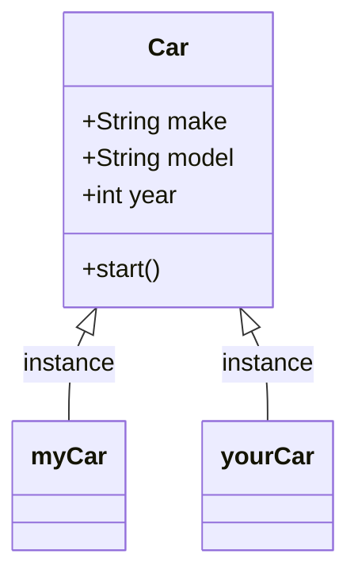
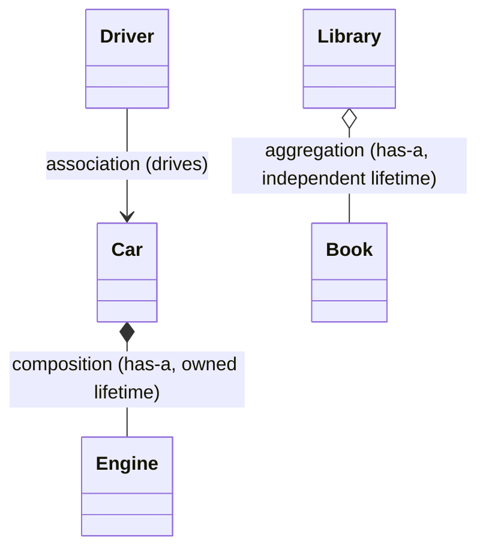
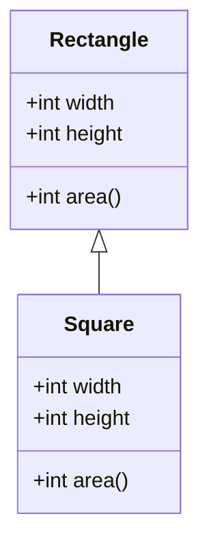

Every LLD round starts by probing whether you actually understand objects or just know the vocabulary. The four pillars are table stakes — what separates a senior answer is naming the trade-off, spotting the Liskov trap, and knowing exactly when composition beats inheritance.

## Classes and objects

A **class** is a blueprint — it defines the attributes and methods that every instance built from it will share, but it occupies no memory on its own. An **object** is a concrete instance of that blueprint, created at runtime with the `new` keyword, holding its own independent state in memory. Many objects can come from one class, each with a different state but identical behaviour.




> [!KEY]
> Think **classes → objects → applications**: you design the blueprint once, instantiate it as many times as the runtime needs, and build the system out of how those instances collaborate. A constructor's only job is initializing that per-instance state — it runs exactly once, at creation, and (aside from static members) every other member operates on the state it set up.

## Encapsulation

Encapsulation bundles data and the behaviour that operates on it into one unit, and restricts direct access to that data from outside. The interview definition: *"hiding internal state and forcing all interaction through a controlled interface."* It is achieved with access modifiers, not just getters and setters — a public getter that returns a mutable list is not encapsulated at all.

```java
class BankAccount {
    private BigDecimal balance = BigDecimal.ZERO;
    public BigDecimal getBalance() { return balance; }

    public void deposit(BigDecimal amount) {
        if (amount.signum() <= 0) throw new IllegalArgumentException("Deposit must be positive");
        balance = balance.add(amount);
    }
}
```

> [!WARNING]
> Returning a private `List<T>` field directly from a getter leaks a mutable reference — the caller can mutate internal state without going through your validation. Return a defensive copy, an unmodifiable view (`Collections.unmodifiableList`), or an immutable `List.copyOf(...)`.

## Abstraction

Abstraction hides *implementation* detail and exposes only the essential *behaviour* a caller needs — it answers "what can I do with this?" not "how does it do it?". In Java this is modelled with `interface` and `abstract class`.

```java
interface PaymentGateway {
    boolean charge(BigDecimal amount, String customerId);
}
// Caller depends only on this contract, never on Stripe/Razorpay specifics.
```

The interview definition to say out loud: *"abstraction is a design-time decision about what to expose; it lets callers program against a contract instead of a concrete class."*

## Inheritance

Inheritance models an **is-a** relationship: a derived class reuses and extends a base class's members.

```java
class Vehicle {
    private final int year;
    Vehicle(int year) { this.year = year; }
    public int getYear() { return year; }
    public void start() { System.out.println("Vehicle starting"); }
}
class Car extends Vehicle {
    Car(int year) { super(year); }
    @Override
    public void start() { System.out.println("Car engine starting"); }
}
```

Inheritance is the **tightest** coupling relationship in OOP — the derived class depends on the base class's implementation details, not just its contract, and changes to the base ripple into every subclass (the "fragile base class" problem). Use it only when the relationship is a genuine is-a **and** every subclass can honestly satisfy every promise the base class makes.

## Polymorphism

Polymorphism means the same call site produces different behaviour depending on the actual object involved. There are two flavours, and interviewers expect you to name both immediately.

| Aspect | Overloading (compile-time) | Overriding (runtime) | Hiding (fields / `static`) |
|---|---|---|---|
| Binding | Resolved at compile time by signature | Resolved at runtime by actual object type | Resolved at compile time by static (declared) type |
| Requires | Same name, different parameters | Same signature in a subclass | A field or `static` method re-declared in the subclass |
| Polymorphic? | No — it's just name reuse | Yes — true dynamic dispatch | No — breaks polymorphism silently |
| Common bug | None significant | Typo in signature (guard with `@Override`) | Reading a field/`static` via a base reference gives the base version unexpectedly |

```java
class Animal {
    String sound = "...";
    public void speak() { System.out.println(sound); }
}
class Dog extends Animal {
    Dog() { sound = "Woof"; }
}
class Cat extends Animal {
    String sound = "Meow"; // hides Animal.sound, resolved by the declared type
    @Override
    public void speak() { System.out.println(sound); } // instance methods always override
}

Animal a = new Cat();
System.out.println(a.sound); // prints "..." — field access bound to the compile-time type
a.speak();                   // prints "Meow" — the method is dynamically dispatched
```

> [!KEY]
> Overloading is resolved by the **compiler** using parameter types; overriding is resolved by the **JVM** using the object's actual runtime type via the method table (vtable). In Java every non-`final`, non-`static`, non-`private` method is dynamically dispatched, so there is no method "hiding" — only fields and `static` methods bind to the declared type. If you can't explain *why* `a.sound` prints the base value while `a.speak()` prints the override, you don't yet understand dynamic dispatch.

## Abstraction vs Encapsulation — the classic mix-up

These two get confused constantly because both involve "hiding" something. The distinction interviewers listen for is **what** is hidden and **why**.

| | Abstraction | Encapsulation |
|---|---|---|
| Hides | Implementation complexity | Internal state / data |
| Operates at | Design level (what to expose) | Code level (access control) |
| Mechanism | Interfaces, abstract classes | `private`/`protected` fields, accessors |
| Goal | Reduce cognitive load for the caller | Prevent invalid state / accidental mutation |
| Analogy | A car's steering wheel hides engine mechanics | The engine bay being locked/sealed |

> [!TIP]
> A senior answer: *"Abstraction is about the interface you design; encapsulation is about the access you enforce. You can have encapsulation without abstraction — a class with private fields and no interface — but you can't have good abstraction without some encapsulation behind it."*

## Association, Aggregation, Composition

These three describe how objects relate to each other, in increasing order of ownership strength.



| Relationship | Strength | Lifetime | UML notation | Example |
|---|---|---|---|---|
| Association | Weakest — "uses" | Independent objects, no ownership | Plain line | `Driver` drives a `Car` |
| Aggregation | Has-a, whole-part | Part can outlive the whole | Hollow diamond | `Library` has `Book`s that survive if the library closes |
| Composition | Has-a, strong ownership | Part dies with the whole | Filled diamond | `Car` owns its `Engine`; delete the car, the engine goes too |

```java
class Engine { }
class Car {
    private final Engine engine = new Engine(); // composition: Car creates and owns Engine's lifetime
}
class Library {
    private final List<Book> books; // aggregation: books passed in, outlive the library
    Library(List<Book> books) { this.books = books; }
}
```

## Coupling and Cohesion

**Coupling** measures how much one module knows about / depends on another. **Cohesion** measures how focused a single module's responsibilities are. The interview goal is always **low coupling, high cohesion** — modules that do one thing well and interact through narrow, stable contracts.

| | Low (bad) | High (good) |
|---|---|---|
| Cohesion | A `UserManager` that also sends emails, logs, and formats reports | A `UserRepository` that only persists users |
| Coupling | Class `A` reaches into `B`'s internals or concrete type | Class `A` depends only on an interface `B` |

High cohesion tends to *reduce* coupling naturally — small, focused classes have fewer reasons to reach into each other.

## The Square-Rectangle Problem (LSP)

The textbook example of inheritance modelling a *mathematical* is-a relationship that breaks a *behavioural* one.



```java
class Rectangle {
    protected int width;
    protected int height;
    public void setWidth(int width) { this.width = width; }
    public void setHeight(int height) { this.height = height; }
    public int area() { return width * height; }
}
class Square extends Rectangle {
    @Override
    public void setWidth(int width) { this.width = this.height = width; }
    @Override
    public void setHeight(int height) { this.width = this.height = height; }
}

void resize(Rectangle r) {
    r.setWidth(5);
    r.setHeight(10);
    assert r.area() == 50; // fails for Square — silently sets both to 10
}
```

> [!DANGER]
> A `Square` is a `Rectangle` mathematically, but setting `Width` independently of `Height` is a promise the base class makes that `Square` cannot keep. This is a real Liskov Substitution Principle violation, not a contrived one — it's the go-to example because it shows is-a in language doesn't guarantee is-a in behaviour.

## Law of Demeter

Also called the "principle of least knowledge": a method should only talk to its immediate collaborators, not reach through them to grab objects several hops away.

```java
// Violates Demeter — reaches through three objects
var zip = order.getCustomer().getAddress().getZipCode();

// Respects Demeter — Order exposes the one thing callers need
var zip = order.getCustomerZipCode();
```

Method chains on the *same* fluent object (`stream.filter(...).sorted(...)`) are fine — Demeter is about crossing object boundaries, not chaining calls on one API.

## Cheat sheet

- **Encapsulation** hides state; **abstraction** hides implementation complexity behind a contract.
- **Overloading** = compile-time, same class, different signature. **Overriding** = runtime, same signature, needs inheritance, `@Override` guards typos. **Hiding** (fields / `static` methods) is resolved by the declared type and breaks polymorphism silently.
- Association = uses, Aggregation = has-a (independent lifetime), Composition = has-a (owned lifetime).
- Prefer **high cohesion, low coupling** — it is the single sentence that unifies SRP, the LSP, and composition-over-inheritance.
- The square/rectangle example proves is-a in English ≠ is-a in behaviour.
- Law of Demeter: talk to friends, not friends-of-friends.
- Inheritance couples on implementation; interfaces couple on contract only — prefer the latter unless the hierarchy is genuinely stable.

## Common mistakes

| Mistake | Fix |
|---|---|
| Calling getters/setters "encapsulation" by itself | Encapsulation is the access control + invariant protection, not the existence of properties |
| Using `new` (hiding) instead of `override` and not noticing | Always add `@Override`; the compiler then rejects a subclass method that doesn't actually override anything |
| Modelling every has-a relationship as inheritance | Ask "is it truly substitutable?" before inheriting; default to composition |
| Confusing aggregation and composition in a diagram | Ask "does the part's lifetime depend on the whole?" — if yes, composition |
| Returning mutable internal collections from a getter | Return `List.copyOf(...)` or `Collections.unmodifiableList(...)` (or a defensive copy) |
| Treating LSP as "subclass must not throw" | It's about preserving preconditions/postconditions and invariants, throwing is one symptom |

## Summary

The four pillars are the vocabulary, not the whole test — interviewers want to see you apply them to catch real problems: a silent bug from assuming a shadowed field is polymorphic, a broken invariant from a square extending a rectangle, or a bloated class with low cohesion. Ground every answer in "what changes together" and "what needs to be substitutable", and prefer narrow contracts (interfaces, composition) over deep hierarchies unless the is-a relationship is truly stable and behavioural.

## Top Interview Questions

### Q1. What are the four pillars of OOP and why do they matter?

Encapsulation (bundling data with behaviour and restricting access), abstraction (exposing essential behaviour via a contract, hiding implementation), inheritance (reusing and extending behaviour through an is-a relationship), and polymorphism (one call site, many behaviours). They matter because together they let you build systems where callers depend on stable contracts instead of concrete details, so a change in one implementation doesn't ripple through the whole codebase. In interviews, naming them is the easy part — the signal is explaining how they interact, e.g. how abstraction enables polymorphism, and where inheritance overreaches into fragile coupling.

### Q2. What is the difference between compile-time and runtime polymorphism?

Compile-time polymorphism (method overloading) is resolved by the compiler purely from the method signature — name plus parameter types/count — before the program ever runs. Runtime polymorphism (method overriding) is resolved by the JVM at call time using the object's actual type via the method table (vtable); in Java every non-`final`, non-`static`, non-`private` method is dynamically dispatched by default, so you just declare the same signature in the subclass (and add `@Override` so the compiler catches mistakes). The practical consequence: overloading gives you readability and convenience; overriding gives you true dynamic dispatch, which is what makes patterns like Strategy and Template Method possible.

### Q3. What is the difference between method overriding and field/static hiding in Java?

Overriding an instance method participates in dynamic dispatch — calling through a base reference still invokes the derived implementation, because in Java every non-`final`/`static`/`private` method is dynamically dispatched. Java has no way to *hide* an instance method: a same-signature method in a subclass *always* overrides. Hiding only happens with **fields** and **static methods**, which are bound to the compile-time (declared) type. So `Animal a = new Cat(); a.sound` reads `Animal`'s field even though the object is a `Cat`, while `a.speak()` runs `Cat`'s override — a classic trap when people assume fields are polymorphic. Always use `@Override` so the compiler rejects an accidental signature mismatch that would otherwise become a silent overload.

### Q4. Explain the difference between abstraction and encapsulation with an example.

Abstraction is a design-level decision about *what* to expose — a `PaymentGateway` interface hides whether charging goes through Stripe or Razorpay, so callers only see `charge(amount)`. Encapsulation is a code-level mechanism for *access control* — a `BankAccount` class makes `balance` private and only lets it change through `deposit`/`withdraw`, protecting invariants like "balance never goes negative". You can encapsulate without abstracting (a `final` class with private fields and no interface), but strong abstraction is hard to achieve without encapsulation behind it, because a leaky implementation defeats the purpose of hiding it.

### Q5. What is the difference between association, aggregation, and composition?

All three describe one class referencing another, differing in ownership strength. Association is the weakest — two objects interact but neither owns the other's lifetime (a `Driver` and a `Car`). Aggregation is a has-a relationship where the part can exist independently of the whole (a `Library` has `Book`s, but the books exist before and after the library does). Composition is strong ownership — the part's lifetime is bound to the whole (a `Car` owns its `Engine`; destroy the car, the engine goes with it). In UML, these are drawn as a plain line, a hollow diamond, and a filled diamond respectively, and the question almost always leads to "which one would you use for X" as a follow-up.

### Q6. What is the Liskov Substitution Principle, and why does square-extends-rectangle violate it?

LSP says subtypes must be substitutable for their base type without altering the correctness of the program — a caller using the base type's contract shouldn't be able to detect it's actually holding a subtype. Concretely, subtypes must not strengthen preconditions or weaken postconditions/invariants the base guarantees. `Square extends Rectangle` violates this because `Rectangle` implicitly promises that setting `width` and `height` are independent operations; `Square` breaks that invariant by forcing them to stay equal, so code that calls `setWidth(5); setHeight(10);` and asserts `area() == 50` silently fails for a `Square`. The fix is to not model it as inheritance at all — use a common `Shape` abstraction with independent `Rectangle` and `Square` implementations, or make both immutable.

### Q7. What is coupling and cohesion, and how do you identify a class with low cohesion?

Coupling is the degree of interdependency between modules; cohesion is how focused a single module's responsibilities are. Low cohesion shows up as a class with unrelated methods that don't share the same data or purpose — e.g. a `UserManager` that validates users, sends welcome emails, and generates PDF reports. The tell in code review: methods that use disjoint subsets of the class's fields, a class name that needs "and" to describe it, or a change request that only touches a third of the class's methods every time. The fix is usually to split by responsibility (often mirroring SRP) and let the split classes collaborate through narrow interfaces, which also reduces coupling as a side effect.

### Q8. When is inheritance the right choice, and when should you reach for composition instead?

Inheritance is appropriate when there's a genuine, stable is-a relationship where every subclass can honestly fulfill the base class's full contract — think `Shape` with a fixed `Area()` contract, or a framework's template method pattern where you extend one abstract hook. Composition is preferable whenever behaviour varies independently of "type" (a `Duck` that can `Fly` or not depending on configuration, not species), when you need to change behaviour at runtime, or when the hierarchy would need multiple inheritance to express reality (a `FlyingSwimmingRobot`). The rule of thumb interviewers want to hear: "favour composition by default; reach for inheritance only when the relationship is truly is-a and the base class contract is stable."

### Q9. What is the Law of Demeter and why does violating it matter in practice?

The Law of Demeter (principle of least knowledge) says a method should only invoke methods on itself, its parameters, objects it creates, or its direct fields — not on objects returned by those, i.e. avoid chains like `a.getB().getC().getD()`. Violating it tightly couples the calling code to the entire object graph's shape: if `Customer` ever restructures how it stores `Address`, every caller that wrote `order.getCustomer().getAddress().getZipCode()` breaks. The fix is to add a small delegating method (`order.getCustomerZipCode()`) on the object that already has direct access, which also usually improves encapsulation since the intermediate objects' internals stop leaking outward.

### Q10. In a production codebase, how would you refactor a `God class` that violates several OOP principles at once?

I'd start by cataloguing responsibilities — list every distinct reason the class changes, which usually reveals an SRP violation. I'd extract each responsibility into its own class behind an interface (e.g. pull `sendEmail` into a `NotificationSender`), wiring the original class to depend on the abstraction via constructor injection rather than instantiating concretes directly — that's DIP in action and makes the class testable in isolation. Where I see deep inheritance used to share code rather than model true is-a relationships, I'd flatten it and use composition with strategy objects instead. I'd do this incrementally behind the existing public API/tests so behaviour never breaks mid-refactor, and I'd validate each extraction with unit tests before touching the next responsibility.
