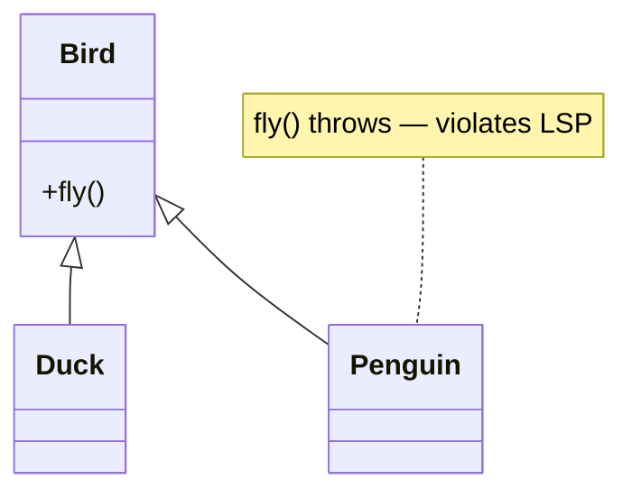
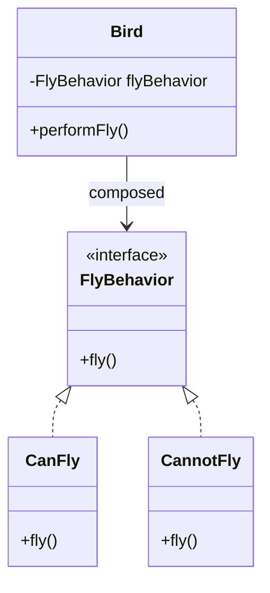

"Prefer composition over inheritance" is the single most quoted design rule in LLD interviews, and also the most shallowly answered. A senior response explains *why* hierarchies break, shows the refactor, and still names the narrow cases where inheritance is correct.

## Why deep inheritance hierarchies break

Three failure modes show up repeatedly once a hierarchy grows past two levels.

- **Fragile base class problem** — a change to a base class (even a seemingly safe one, like adding a call inside an existing method) can silently break every subclass that overrides related behaviour, because subclasses depend on the base's *implementation*, not just its contract.
- **Rigid taxonomy** — real-world categories don't stay clean. Modelling `Penguin extends Bird` works until you need `fly()`, and now every bird either fakes flight or the taxonomy has to be redesigned.
- **Combinatorial explosion** — if behaviour varies along two independent axes (say, "can fly" × "can swim"), subclassing needs one class per *combination*: `FlyingSwimmingBird`, `FlyingOnlyBird`, `SwimmingOnlyBird`, `NeitherBird`. Add a third axis and the class count multiplies again.

> [!KEY]
> Inheritance couples a subclass to the base class's *implementation*. Composition couples an object only to a *contract* (an interface). Contracts change far less often than implementations, so composition is structurally more stable over the life of a codebase.

## The classic duck/bird example

The textbook illustration of the taxonomy problem: modelling flight as an inherited method.

```java
// BEFORE — inheritance forces every subclass into one shape
class Bird {
    public void fly() { System.out.println("Flying"); }
}
class Duck extends Bird { }        // fine, ducks fly
class Penguin extends Bird {
    @Override
    public void fly() { throw new UnsupportedOperationException(); } // LSP violation
}
```

`Penguin` is forced to override `fly()` just to break the promise the base class made. Any code that treats a `List<Bird>` polymorphically and calls `fly()` on each one can now blow up at runtime for a perfectly valid `Bird`.



## Refactoring to strategy composition

Pull the varying behaviour out into its own interface and *compose* it into the bird, instead of inheriting it.

```java
// AFTER — flight behaviour is composed, not inherited
interface FlyBehavior {
    void fly();
}
class CanFly implements FlyBehavior {
    public void fly() { System.out.println("Flying"); }
}
class CannotFly implements FlyBehavior {
    public void fly() { System.out.println("Cannot fly"); }
}

class Bird {
    private final FlyBehavior flyBehavior;
    public Bird(FlyBehavior flyBehavior) { this.flyBehavior = flyBehavior; }
    public void performFly() { flyBehavior.fly(); }
}

var duck = new Bird(new CanFly());
var penguin = new Bird(new CannotFly());
```



Now `Penguin` never exists as a class that lies about its capabilities — it's just a `Bird` composed with `CannotFly`. Adding a "swims" axis means composing a `SwimBehavior` the same way, with **no** multiplication of classes — this is the Strategy pattern applied to solve exactly the combinatorial-explosion problem.

## Delegation

Delegation is the mechanism composition uses to reuse behaviour: instead of inheriting a method, an object holds a reference to a collaborator and forwards the call to it.

```java
class Car {
    private final Engine engine = new Engine();
    public void start() { engine.start(); } // delegates, doesn't inherit Engine's API
}
```

The difference from inheritance: `Car` exposes only `start()`, not the entire `Engine` surface area, and `Engine` can be swapped (electric vs combustion) without touching `Car`'s public contract.

## Mixins via interfaces plus composition

Java has no native mixins, but you get the same effect with default interface methods or composed helper objects, letting a class pick up several independent capabilities without a rigid single-parent hierarchy.

```java
interface Loggable {
    default void log(String msg) { System.out.println("[LOG] " + msg); } // default interface method
}
interface Auditable {
    default void audit(String action) { System.out.println("[AUDIT] " + action); }
}
class OrderService implements Loggable, Auditable {
    public void place() {
        log("Placing order");
        audit("OrderPlaced");
    }
}
```

`OrderService` picks up two independent capabilities without any base class — each capability is a separate axis, exactly like composing `FlyBehavior` and `SwimBehavior`.

## Naming every relationship between two classes

Before you can decide has-a versus is-a, you need the full vocabulary — inheritance and composition are only two of six relationship types that show up between classes during design, and interviewers notice when a candidate calls everything "it uses it."

| Relationship | Meaning | Example |
|---|---|---|
| Association | A knows/works with B; both are independent | `Teacher` works with `Student` |
| Aggregation | A has B; B can exist independently | `Department` has externally-created `Staff` |
| Composition | A owns B and controls its lifetime | `Classroom` creates and owns its `Desk`s |
| Dependency | A temporarily uses B (a parameter, a return value) | A method receives `Payment` as an argument |
| Realization | A implements interface B | `EmailNotifier` implements `Notifier` |
| Inheritance | A is a B | `GraduateStudent` derives from `Student` |

```java
var student = new Student("Ava");
Student graduateStudent = new GraduateStudent("Liam"); // inheritance

teacher.teach(student);                                 // association
department.addTeacher(teacher);                         // aggregation — teacher outlives the department
var classroom = new Classroom(20);                      // composition — 20 desks created and owned internally

Notifier notifier = new EmailNotifier();                // realization
enrollmentService.enroll(student, notifier);            // dependency — notifier is only a parameter here
```

Finding these relationships during design starts with finding the entities: list the nouns in the requirements, then for each one ask whether it needs its own state and behaviour (a class) or whether it's just an attribute of something else (a field). Only once the entities are settled does it make sense to draw the arrows between them.

> [!TIP]
> For any has-a pair you find, one question resolves aggregation versus composition immediately: *"if the container is destroyed right now, does the contained object still make sense on its own?"* If yes, it's aggregation; if the part has no independent reason to exist, it's composition.

## Has-a vs is-a: the decision table

| Question | Answer points to |
|---|---|
| Does every subclass satisfy 100% of the base contract, always? | is-a → inheritance may be fine |
| Does behaviour need to change at runtime? | has-a → composition |
| Would you need a new subclass per combination of features? | has-a → composition (Strategy) |
| Is the relationship "a kind of" or "makes use of"? | "kind of" → inheritance; "makes use of" → composition |
| Do you need to substitute mocks/fakes easily in tests? | has-a → composition (inject an interface) |
| Is the base class stable and unlikely to change its implementation? | is-a → inheritance is lower risk |

> [!TIP]
> Say this in the room: *"I'll ask whether every subtype can honor the full base contract without exceptions or no-ops. If yes and the hierarchy is shallow and stable, inheritance is fine. If behaviour varies independently or needs to change at runtime, I'll compose it instead."*

## When inheritance is still the right call

Composition-over-inheritance is a default, not an absolute. Inheritance remains the correct tool in a few specific shapes:

- **Template Method pattern** — a base class defines a fixed algorithm skeleton and subclasses only override specific steps (e.g. `DataImporter.importData()` calls `readSource()`, `validate()`, `save()` where subclasses implement the hooks). Here the base class's *structure* is exactly what you want to reuse.
- **Framework extension points** — a Servlet's `HttpServlet`, Spring's `AbstractController`, or Swing's `AbstractAction`. You are extending a framework contract that is deliberately designed to be a stable base for subclassing.
- **True substitutability** — closed, well-understood type hierarchies where LSP genuinely holds, e.g. `Exception` subclasses, or shape hierarchies where every operation truly applies uniformly.

```java
abstract class DataImporter {
    public final void importData() { // template method — fixed skeleton
        String raw = readSource();
        if (!validate(raw)) throw new IllegalStateException("invalid data");
        save(raw);
    }
    protected abstract String readSource();
    protected abstract boolean validate(String data);
    protected abstract void save(String data);
}
```

> [!WARNING]
> Template Method still couples subclasses to the base's algorithm shape — if the skeleton ever needs to change order, every subclass is affected. It's a narrower, more disciplined use of inheritance than a general taxonomy, which is why it survives the "prefer composition" rule.

## The rule interviewers want to hear

> [!NOTE]
> Not "never use inheritance" — that's the naive version and loses points for dogmatism. The senior version: *"Default to composition because it couples on contract, not implementation, and scales better when behaviour varies. Use inheritance only for a genuinely stable is-a relationship where LSP holds — template methods and framework hook points are the common legitimate cases."*

## Cheat sheet

- Inheritance couples to **implementation**; composition couples to **contract** — contracts change less.
- Three inheritance failure modes: fragile base class, rigid taxonomy, combinatorial explosion.
- Duck/bird problem: don't inherit a capability that not every subtype can honestly provide — compose it as a `Strategy` instead.
- Delegation = forwarding a call to a held collaborator; it's the mechanism composition uses for reuse.
- Mixins in Java: default interface methods let a class gain independent capabilities without a common base class.
- Six class relationships, weakest to strongest: dependency, association, aggregation, composition, realization, inheritance — know which arrow each one is before deciding has-a vs is-a.
- Aggregation vs composition test: "does the part still make sense if the whole is destroyed right now?" Yes → aggregation, no → composition.
- Decision test: "can every subtype satisfy 100% of the base contract, unconditionally?" If no, compose.
- Inheritance is still correct for Template Method, framework extension points, and genuinely closed/stable hierarchies.
- The rule to say out loud: favour composition by default, use inheritance only where is-a is true and the contract is stable.

## Common mistakes

| Mistake | Fix |
|---|---|
| Inheriting to reuse a utility method | Extract the method into a helper/service and compose it in, don't inherit for code reuse alone |
| Overriding a method to throw / no-op | That subtype shouldn't be in the hierarchy — model the capability as an optional composed strategy |
| Adding a new subclass for every feature combination | Split the varying axes into separate composed interfaces (Strategy) |
| Treating "prefer composition" as "inheritance is always wrong" | Recognize Template Method and framework hooks as legitimate inheritance use cases |
| Deep hierarchies (4+ levels) for organizational convenience | Flatten to one level of abstraction plus composed behaviour |
| Forgetting that composition still needs good interface design | A leaky or overly broad interface reintroduces coupling even without inheritance |
| Calling every relationship "association" because it's the simplest line | Ask whether the reference is temporary (dependency), independent (association/aggregation), or owned (composition) before drawing it |
| Adding a method to a class because "it might be useful" | Only add a method that serves a requirement already on the table — speculative surface area is still coupling |

## Summary

Deep inheritance hierarchies break because they couple subclasses to base-class implementation details and force every subtype into one rigid shape, which shows up as fragile base classes, rigid taxonomies, and combinatorial explosion when behaviour varies along more than one axis. The fix is to extract the varying behaviour into an interface and compose it in — the Strategy pattern — which is exactly how the duck/bird problem gets solved cleanly. Inheritance still earns its place for Template Method, framework extension points, and hierarchies where LSP genuinely holds; the interview-winning line is "favour composition by default, use inheritance only for a stable, honest is-a relationship."

## Top Interview Questions

### Q1. Why do people say "favour composition over inheritance"? What specifically breaks with deep hierarchies?

Deep inheritance couples subclasses to the base class's *implementation*, not just its contract, so a change to the base — even one that looks safe — can silently break subclass behaviour (the fragile base class problem). It also forces every subtype into one taxonomy: real-world categories rarely stay clean, so you end up with subclasses that override a method just to throw or no-op (the duck/bird problem). Finally, if behaviour varies along more than one independent axis, subclassing needs one class per *combination* of axes, causing combinatorial class explosion. Composition avoids all three because it couples on a narrow interface that changes far less often than an implementation.

### Q2. Walk through the duck/bird example and how you'd refactor it.

A naive `Bird` base class with a `fly()` method forces `Penguin extends Bird` to override `fly()` and throw, because penguins can't fly — that's a Liskov Substitution Principle violation, since code that calls `fly()` polymorphically on any `Bird` can now crash for a valid bird. The fix is to extract flight into a `FlyBehavior` interface with `CanFly`/`CannotFly` implementations, and have `Bird` hold one via composition (constructor injection), delegating `performFly()` to it. This is the Strategy pattern: `Penguin` is simply `new Bird(new CannotFly())`, no subclass or exception needed, and adding a swim axis composes a `SwimBehavior` the same way without multiplying classes.

### Q3. What is the fragile base class problem, and how does composition avoid it?

It's when a change to a base class breaks subclasses in ways the base class author didn't anticipate — for example, a base method starts calling another overridable method internally, and a subclass that overrode that inner method now gets invoked at an unexpected time, or in an unexpected order, breaking its invariants. This happens because subclasses are bound to the base's *implementation details* across an inheritance boundary that the compiler can't fully protect. Composition avoids it because a composed object only depends on the collaborator's public interface — as long as that interface's contract doesn't change, the internal implementation of the collaborator can change freely without breaking the composing class.

### Q4. What is delegation, and how does it differ from inheritance for code reuse?

Delegation is when an object reuses another object's behaviour by holding a reference to it and forwarding calls, rather than extending it — `car.start()` calls `engine.start()` instead of `Car` inheriting from `Engine`. The key difference from inheritance: delegation only exposes the methods the composing class chooses to forward, keeping the public surface narrow, whereas inheritance exposes (and commits to) the entire base class API, including protected members and any accidentally-inherited behaviour. Delegation also allows the collaborator to be swapped at runtime (a different `Engine` implementation) without changing `Car`'s type, which inheritance cannot do since the base type is fixed at compile time.

### Q5. Does Java support mixins? How do you approximate them?

Java has no first-class mixin construct, but default interface methods (Java 8+) get close: an interface can provide a default implementation, and any class implementing it picks up that behaviour without inheriting from a base class, so a class can compose several independent capabilities (`Loggable`, `Auditable`) side by side. This avoids the single-inheritance limitation — a class can only extend one base class but can implement many interfaces — and keeps each capability as an independent, testable axis. The trade-off: default interface methods can't hold instance state directly, so for stateful cross-cutting behaviour, plain composition (a held collaborator object) is usually cleaner than trying to force a mixin shape.

### Q6. Give me a decision rule for choosing has-a versus is-a in a design.

Ask: can every subtype satisfy 100% of the base type's contract, unconditionally, forever? If any subtype needs to override a method to throw, no-op, or change semantics, that's a sign the relationship isn't truly is-a — use has-a (composition) instead. Also ask whether the behaviour needs to vary at runtime (composition allows swapping a strategy object; inheritance's type is fixed at construction) and whether you'd need a new subclass per combination of independent features (a strong signal to split into composed strategies). If the hierarchy is shallow, the base is stable, and substitutability genuinely holds in both directions, inheritance is a reasonable, low-risk choice.

### Q7. When is inheritance still the correct choice? Give concrete examples.

Three legitimate cases: the Template Method pattern, where a base class fixes an algorithm's skeleton and subclasses only override specific steps (a `DataImporter.importData()` that calls abstract `readSource`/`validate`/`save` hooks) — here you deliberately want to reuse the base's *structure*. Framework extension points, like inheriting from a Servlet's `HttpServlet` or Spring's `AbstractController`, where the framework is explicitly designed as a stable base for extension. And genuinely closed, stable type hierarchies where LSP holds in both directions, such as the built-in `Exception` hierarchy. In all three, the base class's implementation is intentionally meant to be depended on, which is the opposite of the fragile-base-class scenario.

### Q8. How would you refactor an existing deep inheritance hierarchy in a production codebase without a big-bang rewrite?

I'd start by identifying which methods each subclass overrides purely to change behaviour versus which represent genuine structural extension — the former are candidates for extraction into strategy interfaces. I'd introduce the new interface (e.g. `FlyBehavior`) alongside the existing hierarchy, have the base class accept it via constructor injection with a default that preserves current behaviour, and migrate one subclass at a time behind existing tests, verifying behaviour is unchanged after each step. Once every subclass is migrated to compose the strategy instead of overriding, I'd collapse the now-redundant subclasses into simple factory calls that compose the base type with the right strategy, and delete the empty subclasses last.

### Q9. What's the risk of using composition badly — can it also create coupling problems?

Yes — composition only pays off if the composed interface is well-designed. If the interface is too broad (a "fat" interface exposing implementation-specific methods), the composing class is still tightly coupled to the collaborator's shape, just without the syntax of inheritance. Composition can also hide dependencies if overused without dependency injection — a class that `new`s up five collaborators internally is just as hard to test and change as a rigid subclass. The fix is the same discipline as always: keep composed interfaces narrow (Interface Segregation Principle) and inject collaborators rather than constructing them internally, so the composing class depends only on abstractions it actually needs.

### Q10. How does composition over inheritance relate to the Open/Closed Principle?

They reinforce each other. OCP says a class should be open for extension but closed for modification — you should be able to add new behaviour without editing existing, tested code. With inheritance-heavy designs, adding a new behaviour combination often means editing a base class or adding yet another subclass into an already deep tree, risking the fragile base class problem. With composition, adding new behaviour means writing a new implementation of an existing interface (a new `FlyBehavior`) and wiring it in — the composing class (`Bird`) never changes. This is why Strategy, Decorator, and similar composition-based patterns are frequently cited as the practical mechanism for achieving OCP.

### Q11. How do you systematically identify the entities and relationships in a design before deciding has-a versus is-a?

Start from the requirements as text and pull out the nouns — each noun is a candidate class. For each candidate, ask whether it needs its own state and behaviour (a real entity, like `Order`) or whether it's just an attribute of something else (a `String status` field, not a class). Once you have your entities, go pair by pair and classify the relationship: is one only passed as a parameter (dependency), does it merely collaborate without ownership (association), does one hold the other but the held object can outlive it (aggregation), does one own and construct the other (composition), does one implement a contract (realization), or is one a specialised version of another (inheritance)? I resolve aggregation versus composition specifically by asking whether the part still makes sense if the whole is deleted right now — that single question removes most of the ambiguity in a live design discussion.
