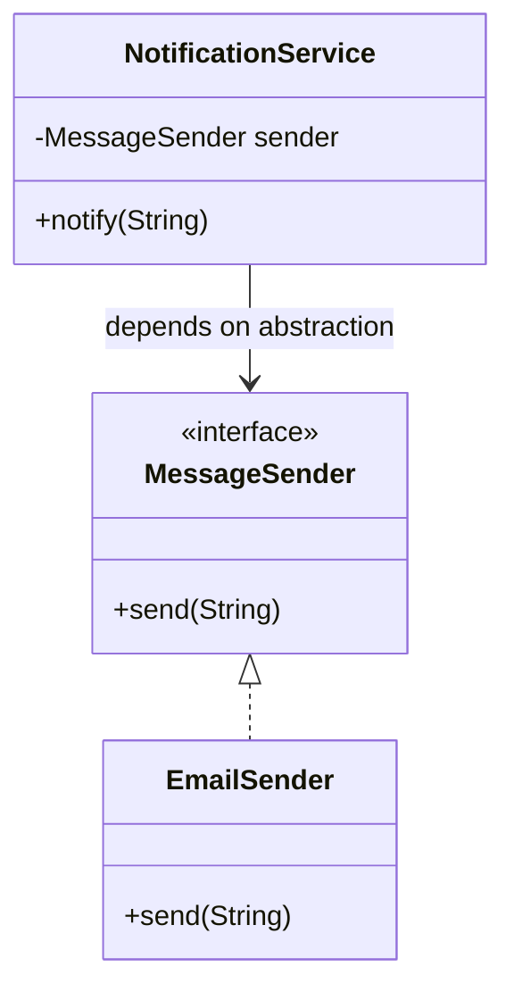

SOLID is asked in nearly every LLD round, usually as "tell me about a time you applied one" rather than "define SRP". The principles are simple to recite and easy to misstate — the interview signal is in the subtleties: SRP is about *reasons to change*, not "one method", and DIP is not the same thing as dependency injection.

## Single Responsibility Principle

A class should have **one reason to change** — not "one method" or "does one thing", which is a common oversimplification. "Reason to change" means one axis of responsibility owned by one stakeholder or concern.

```java
// BAD — three reasons to change: business rules, persistence, notification
class Order {
    public void calculateTotal() { /* pricing logic */ }
    public void saveToDatabase() { /* SQL */ }
    public void sendConfirmationEmail() { /* SMTP */ }
}
```

```java
// GOOD — each class changes for exactly one reason
class Order {
    public BigDecimal calculateTotal() { /* pricing logic */ return BigDecimal.ZERO; }
}
class OrderRepository {
    public void save(Order order) { /* SQL */ }
}
class OrderNotifier {
    public void sendConfirmation(Order order) { /* SMTP */ }
}
```

**Smell:** a class name that needs "and" to describe (`OrderManagerAndNotifier`), or a code review where every unrelated feature touches the same file. **Real system:** a `UserController` that validates input, applies business rules, *and* writes audit logs is the single most common SRP violation in real backends.

> [!WARNING]
> SRP is not "a class should have one method." A class can have ten methods and still have a single responsibility if they all serve one cohesive purpose (e.g. `StringBuilder`). The test is: *"who asks for a change, and how many different stakeholders would touch this file?"*

## Open/Closed Principle

Software entities should be **open for extension, closed for modification** — you add new behaviour by adding new code, not editing tested code. This is achieved through abstraction: define an interface, and let new behaviour arrive as new implementations.

```java
// BAD — every new payment type means editing this method
class PaymentProcessor {
    public void pay(String type, BigDecimal amount) {
        if (type.equals("UPI")) { /* ... */ }
        else if (type.equals("Card")) { /* ... */ }
        // adding "Wallet" means modifying this method again
    }
}
```

```java
// GOOD — new payment types are new classes, PaymentProcessor never changes
interface PaymentMethod {
    void pay(BigDecimal amount);
}
class UpiPayment implements PaymentMethod {
    public void pay(BigDecimal amount) { System.out.println("UPI: " + amount); }
}
class WalletPayment implements PaymentMethod { // added later — zero edits elsewhere
    public void pay(BigDecimal amount) { System.out.println("Wallet: " + amount); }
}
class PaymentProcessor {
    public void process(PaymentMethod method, BigDecimal amount) { method.pay(amount); }
}
```

**Smell:** a `switch`/`if-else` chain on a type string or enum that grows every sprint. **How DI enables it:** dependency injection is the delivery mechanism — `PaymentProcessor` receives a `PaymentMethod` through its constructor rather than constructing it, so the *set* of available payment types can grow without `PaymentProcessor` ever being recompiled or redeployed.

## Liskov Substitution Principle

Subtypes must be substitutable for their base type **without altering program correctness** — formally, a subtype must not strengthen preconditions, and must not weaken postconditions or invariants the base type guarantees.

```java
// BAD — Penguin strengthens nothing, but breaks the postcondition "fly() succeeds"
class Bird {
    public void fly() { System.out.println("Flying"); }
}
class Penguin extends Bird {
    @Override
    public void fly() { throw new UnsupportedOperationException(); } // breaks caller's expectation
}
```

```java
// GOOD — split the contract so only birds that can fly promise to
interface Flyable {
    void fly();
}
class Bird { }
class Sparrow extends Bird implements Flyable {
    public void fly() { System.out.println("Flying"); }
}
class Penguin extends Bird { } // simply doesn't implement Flyable — no broken promise
```

**Smell:** an overridden method that throws `UnsupportedOperationException`, returns a sentinel/no-op, or requires callers to type-check (`if (bird instanceof Penguin) skip`) before calling a base method. **Real system:** a `ReadOnlyRepository implements Repository` that throws on `save()` is an LSP violation hiding behind an interface — ISP (splitting read/write interfaces) is usually the actual fix.

## Interface Segregation Principle

Clients should not be forced to depend on methods they don't use — prefer several small, focused interfaces over one large one.

```java
// BAD — fat interface forces every worker to implement manage()
interface Worker {
    void code();
    void manage();
}
class Developer implements Worker {
    public void code() { }
    public void manage() { throw new UnsupportedOperationException(); } // forced, unused
}
```

```java
// GOOD — segregated interfaces, implement only what applies
interface Coder {
    void code();
}
interface Manager {
    void manage();
}
class Developer implements Coder {
    public void code() { }
}
class TechLead implements Coder, Manager {
    public void code() { }
    public void manage() { }
}
```

**Smell:** an implementation with several methods throwing `UnsupportedOperationException`, or an interface whose consumers each use a different 20% of it. **Real system:** `AutoCloseable` being separate from other interfaces is ISP in the JDK — not every type needs closing, so it's not bolted onto `Object`.

## Dependency Inversion Principle

High-level modules should not depend on low-level modules — both should depend on abstractions. Abstractions should not depend on details; details should depend on abstractions.

```java
// BAD — high-level NotificationService depends directly on a low-level concrete class
class EmailSender {
    public void send(String msg) { /* SMTP */ }
}
class NotificationService {
    private final EmailSender sender = new EmailSender(); // concrete dependency, hard to test/swap
    public void notify(String msg) { sender.send(msg); }
}
```

```java
// GOOD — both depend on MessageSender
interface MessageSender {
    void send(String msg);
}
class EmailSender implements MessageSender {
    public void send(String msg) { /* SMTP */ }
}
class NotificationService {
    private final MessageSender sender;
    public NotificationService(MessageSender sender) { this.sender = sender; } // injected
    public void notify(String msg) { sender.send(msg); }
}
```



> [!DANGER]
> **DIP, Dependency Injection, and a DI container are three different things.** DIP is the *design principle* (depend on abstractions). Dependency Injection is the *technique* that satisfies it (pass dependencies in via constructor/setter instead of `new`-ing them up internally). A DI/IoC container (e.g. Spring's `ApplicationContext` or Google Guice) is an optional *tool* that automates wiring those injections at scale. You can follow DIP and do DI by hand with no container at all — plenty of well-designed small codebases do exactly that.

## SOLID at a glance

| Principle | One-line rule | Violation smell | Typical refactor |
|---|---|---|---|
| SRP | One reason to change per class | Class name needs "and"; unrelated features share a file | Split by responsibility into cohesive classes |
| OCP | Open for extension, closed for modification | Growing `if/switch` on a type discriminator | Extract an interface; add new types as new classes |
| LSP | Subtypes must honour the base contract fully | Override throws / no-ops; caller type-checks before calling | Split the contract so only true implementers promise it |
| ISP | Don't force clients to depend on unused methods | `UnsupportedOperationException` in an implementation | Split into small, role-specific interfaces |
| DIP | Depend on abstractions, not concretions | `new ConcreteClass()` inside a high-level class | Inject an interface via constructor |

## How they compound in real systems

These principles aren't independent — violating one often causes another. A fat interface (ISP violation) tends to produce LSP violations, because implementers throw on the methods they can't honestly support. A God class (SRP violation) is usually also tightly coupled (DIP violation) because it directly instantiates everything it needs instead of receiving abstractions. Recognising this chain is a strong interview signal: instead of listing five separate rules, show that fixing SRP and DIP together (extract responsibility + inject the abstraction) is usually how a real refactor plays out.

> [!TIP]
> When asked "which SOLID principle does this code violate", check SRP and ISP first — they're the most common in practice — and be ready to say a single change ("split the interface") often resolves an LSP smell too.

## Dependency injection: three ways to wire it in

Dependency injection is the technique, not the principle — and it comes in three shapes. Constructor injection is the default: the dependency is required, immutable for the object's lifetime, and impossible to forget to supply.

```java
class FileManager {
    private final DocumentReader reader;
    public FileManager(DocumentReader reader) { this.reader = reader; } // required, set once
    public void readFile() { reader.read(); }
}
```

Setter injection makes a dependency optional or swappable after construction — useful for circular dependencies or optional collaborators, but it leaves a window where the object exists with `reader` still `null`.

```java
class FileManager {
    private DocumentReader reader;
    public void setReader(DocumentReader reader) { this.reader = reader; } // optional, can change later
    public void readFile() { reader.read(); }
}
```

Interface injection — the dependency itself defines the method a container calls to supply it — is rare in modern Java, largely superseded by constructor injection plus a DI container's built-in lifetime management.

| Style | When to reach for it | Trade-off |
|---|---|---|
| Constructor | Default choice — dependency is mandatory | Cannot construct the object in an invalid state |
| Setter | Dependency is optional, or needed to break a circular reference | Object can exist without it being set yet |
| Interface | Framework/container needs to inject after construction, by contract | Rare in Java; adds an interface just for wiring |

## Beyond SOLID: the general-purpose principles

SOLID governs class-level structure, but three simpler, language-agnostic principles guard against different failure modes and come up just as often in review.

- **KISS (Keep It Simple)** — start with the simplest design that satisfies today's requirement; reach for a pattern or an abstraction only once a concrete need for it appears, not in anticipation of one.
- **DRY (Don't Repeat Yourself)** — extract duplicated logic into one shared place so a fix or a rule change happens once. The trade-off interviewers want named: over-applying DRY to code that merely *looks* similar but represents unrelated concerns creates false coupling — two call sites now break together even though they had no business sharing logic.
- **YAGNI (You Aren't Gonna Need It)** — design so extension is *possible* (an interface seam, a clean boundary) but don't build the extension itself until a real requirement demands it. This is SOLID's OCP and YAGNI in tension by design: OCP says make future extension cheap, YAGNI says don't pre-build it.
- **Separation of Concerns** — different parts of the system own different responsibilities and don't reach into each other's internals; this is SRP generalised up from the class level to modules, layers, and services.

> [!NOTE]
> A pointed but defensible opinion for a senior interview: SOLID was formalised for class-heavy OOP languages like Java and C++. Modern codebases increasingly favour composition over deep class hierarchies and small functions over ceremonial interfaces for simple cases — the *intent* behind SOLID (low coupling, single responsibility, depend on abstractions) still holds, but the mechanism doesn't always have to be a `class`/`interface` pair.

## Cheat sheet

- SRP = one **reason to change**, not one method — ask "who asks for changes here?"
- OCP = add behaviour via new classes behind an abstraction; DI is what lets the new classes get wired in without touching existing code.
- LSP = subtypes must not strengthen preconditions or weaken postconditions/invariants — "doesn't throw" is a symptom, not the definition.
- ISP = small, role-specific interfaces; an `UnsupportedOperationException` in an implementation is the tell.
- DIP = depend on abstractions; Dependency Injection is the technique; a DI container is an optional automation tool — the three are not synonyms.
- A fat interface (ISP violation) commonly causes an LSP violation downstream.
- A God class (SRP violation) is usually also a DIP violation — it `new`s up its own dependencies.
- SOLID is a set of smells to recognise in review, not a checklist to apply blindly everywhere — over-applying OCP/DIP to code that never changes adds needless indirection.
- Constructor injection is the default DI style; setter injection is for optional/circular dependencies; interface injection is rare in modern Java.
- KISS, DRY, and YAGNI pull against each other in practice — the discipline is applying each only where its failure mode is actually present.

## Common mistakes

| Mistake | Fix |
|---|---|
| Defining SRP as "one method per class" | Reframe as "one reason to change", one axis of responsibility |
| Treating DIP and dependency injection as the same term | DIP is the principle; DI is the technique; a container is a tool — keep them distinct in your answer |
| Adding an interface for every class "to follow OCP" | Only abstract where variation is expected; needless interfaces add indirection without benefit |
| Believing LSP just means "no exceptions in overrides" | It's about preconditions, postconditions and invariants — exceptions are one symptom among several |
| Building one big `Repository` with every possible method | Segregate into `ReadRepository`/`WriteRepository` or similar per ISP |
| Applying SOLID uniformly to throwaway or rarely-changed code | Reserve the ceremony for code that changes often or has multiple implementers |
| Extracting a shared helper for code that only looks similar today | Confirm the logic represents the same rule/concern before applying DRY — otherwise it's false coupling |
| Using setter injection for a dependency the class can't function without | Make required dependencies constructor parameters so an invalid object can't be constructed |

## Summary

SOLID is five lenses for spotting the same underlying disease: classes that know too much about each other's implementation and change for too many reasons. SRP and ISP keep responsibilities and contracts narrow; OCP and DIP keep new behaviour arriving as new code behind abstractions instead of edits to old code; LSP keeps those abstractions honest so substitution never surprises a caller. Beyond the five, KISS, DRY, and YAGNI guard the same codebase against a different disease — needless complexity, needless duplication, and needless speculative flexibility — and Separation of Concerns is SRP's idea applied above the class level. The strongest interview answers connect the principles — showing that a God class is usually also tightly coupled, and that a fat interface usually produces an LSP violation — rather than reciting definitions in isolation.

## Top Interview Questions

### Q1. What does "one reason to change" actually mean for the Single Responsibility Principle?

It means a class should be answerable to exactly one actor or concern — if a change to business rules, a change to how data is persisted, and a change to how users are notified would all require editing the same class, that class has three reasons to change and violates SRP. This is stricter than "does one thing", because a class can have several methods and still have one responsibility as long as they all serve the same cohesive purpose (like `List<T>`'s many methods, all about managing an ordered collection). The practical test: list the different stakeholders or requirements that could trigger a change to this class; if the list has more than one unrelated item, split it.

### Q2. How does the Open/Closed Principle actually get implemented, and what role does dependency injection play?

OCP is implemented by coding against an abstraction (an interface or abstract class) so that new behaviour arrives as a brand-new class implementing that abstraction, rather than as an edit to an existing method's `if/switch` chain. Dependency injection is the mechanism that makes this useful in practice: the high-level class (e.g. `PaymentProcessor`) receives the abstraction (`PaymentMethod`) through its constructor instead of constructing concrete types itself, so when a new payment type is added, `PaymentProcessor` doesn't need to change, recompile, or even know the new type exists — only the composition root (or DI container registration) changes. Without DI, OCP-via-interfaces would still require editing a factory or a `new` call somewhere, partially reintroducing the modification you were trying to avoid.

### Q3. Explain the Liskov Substitution Principle using preconditions and postconditions, not just "subclasses shouldn't break things".

Formally, a subtype must not strengthen the preconditions the base type requires (it can't demand *more* from callers than the base did) and must not weaken the postconditions or invariants the base type guarantees (it can't deliver *less* than the base promised). For example, if `Bird.fly()` promises "the bird ends up airborne", a `Penguin` override that throws weakens that postcondition to "sometimes fails" — a caller relying on the base contract is broken. Preconditions matter too: if a base `save(User u)` accepts any non-null user, and an override additionally requires `u.getEmail() != null`, that's a strengthened precondition — code written against the base type that worked before now fails for a subtype it should have been substitutable with.

### Q4. What's the difference between the Dependency Inversion Principle, dependency injection, and an IoC container?

They're three distinct layers people conflate constantly. DIP is a *design principle*: high-level modules and low-level modules should both depend on abstractions, not on each other directly. Dependency Injection is a *technique* for satisfying DIP: instead of a class constructing its own dependencies with `new`, the dependencies are passed in — via constructor, setter, or method — typically as interfaces. An IoC (Inversion of Control) container, like Spring's `ApplicationContext` or Google Guice, is an *optional tool* that automates resolving and injecting those dependencies at application startup, especially useful once you have dozens of services with overlapping lifetimes. You can have DIP without DI (a class could depend on an abstraction but still `new` up its own instance internally, which technically doesn't satisfy DIP), and you can have DI without any container at all — manual constructor wiring in `main` is still dependency injection.

### Q5. Give an example of an Interface Segregation Principle violation you might see in a real backend, and how you'd fix it.

A common one is a single `Repository<T>` interface with `get`, `getAll`, `add`, `update`, `delete`, `bulkImport`, and `archive` — a reporting service that only ever reads data is now forced to depend on an interface exposing five write operations it will never call, and any mock or fake built for testing needs to implement all of them. The fix is to split into role-specific interfaces — `ReadRepository<T>` with just `get`/`getAll`, and `WriteRepository<T>` with the mutating operations — so a read-only consumer depends only on `ReadRepository<T>`. This also prevents a subtler bug: a read-only implementation forced to implement the fat interface would otherwise have to throw on `delete()`, which is simultaneously an ISP and an LSP violation.

### Q6. How would you detect an Open/Closed Principle violation during a code review?

The strongest signal is a `switch` statement or `if-else` chain that branches on a type discriminator (a string, an enum, a `getClass()` check) and that you can predict will grow — every time a new payment method, notification channel, or discount type is added, someone has to reopen and edit that same method. I'd also look at commit history: if the same method has been edited in five different unrelated PRs for five different features, that's empirical evidence of an OCP violation. The fix is to introduce an interface for the varying part and inject implementations, so future features add a class instead of a diff to shared code — reducing both merge conflicts and regression risk in unrelated features.

### Q7. Why is SOLID sometimes criticized, and when would you deliberately not apply it?

The main criticism is over-application: introducing an interface, a factory, and dependency injection for a class that has exactly one implementation and will likely never need a second one adds indirection with no payback, making the code harder to navigate for no flexibility gained. SOLID principles are heuristics for managing *change* — if a piece of code is stable, rarely touched, and unlikely to need multiple implementations (a small internal utility, a one-off script, a prototype), the cost of applying OCP/DIP ceremony can outweigh the benefit. The senior answer is to apply SOLID where change is expected or already happening — a growing `if/else` chain, a class already touched by unrelated features — rather than as a blanket rule for every class in the codebase.

### Q8. You inherit a class that violates several SOLID principles at once. How do you prioritize the refactor?

I'd start with SRP, because it's usually the root cause that makes other violations visible — splitting responsibilities into separate classes naturally surfaces where DIP is being violated (each new class reveals a `new ConcreteClass()` that should be injected) and where ISP applies (each new class needs only a subset of any shared interface). I'd extract one responsibility at a time behind an interface, inject it into the original class, and run existing tests after each extraction to confirm behaviour is unchanged before moving to the next. I'd defer OCP-style extensibility (adding interfaces for future variation) until there's a concrete second implementation on the horizon, to avoid speculative abstraction — YAGNI still applies even while doing a SOLID cleanup.

### Q9. What's a real LSP violation you'd expect to find in a production codebase, beyond the classic square/rectangle example?

A very common one: a `ReadOnlyUserRepository implements UserRepository` where `UserRepository` declares both read and write methods, and the read-only implementation throws `UnsupportedOperationException` on `save()`/`delete()`. Any code that receives a `UserRepository` and calls `save()` polymorphically — perfectly valid given the interface — can now crash at runtime depending on which concrete instance was injected, which is exactly the substitutability guarantee LSP requires. The fix is almost always an ISP fix in disguise: split `UserRepository` into `UserReader` and `UserWriter`, so `ReadOnlyUserRepository` only implements `UserReader` and the broken promise simply can't be made — the type system rules it out instead of a runtime exception catching it.

### Q10. How does violating ISP tend to cause LSP violations downstream? Walk through the mechanism.

A fat interface bundles methods that not every implementer can honestly support — for example, a `Worker` interface with both `code()` and `manage()` forces a `Developer` class to implement `manage()` even though developers in this org don't manage anyone. Since the class must implement the interface to compile, the only options are a no-op or throwing `UnsupportedOperationException`, and either one breaks LSP: a caller holding a `Worker` reference and calling `manage()` reasonably expects it to do something meaningful, but for a `Developer` instance it silently does nothing or blows up. The fix addresses both principles simultaneously — splitting `Worker` into `Coder` and `Manager` (ISP) means `Developer` only implements `Coder`, so there's no broken contract left to violate (LSP is restored as a side effect, not a separate fix).

### Q11. How do KISS, DRY, and YAGNI relate to each other, and where do they actually conflict?

All three fight complexity, but from different angles: KISS says don't design something more elaborate than the current requirement needs, DRY says don't repeat the same logic in two places, and YAGNI says don't build for a future requirement that hasn't arrived. They conflict when applying DRY too early creates complexity KISS would reject — extracting a shared abstraction for two pieces of code that merely look alike today, before you actually know they represent the same rule, adds an indirection layer (a base class, a generic helper) that YAGNI would say you don't need yet either. The practical resolution: tolerate a small amount of duplication until a third occurrence proves the pattern is real, then deduplicate — this is sometimes called the "rule of three", and it's a defensible answer to "isn't DRY just always better?"

### Q12. What's the practical difference between constructor injection and setter injection, and when would you choose setter injection?

Constructor injection makes a dependency a required argument to build the object at all — you cannot end up with an instance in an invalid, half-wired state, and the dependency can be stored in a `final` field since it never needs to change. Setter injection instead exposes a setter method to assign the dependency after construction, which is useful specifically when the dependency is genuinely optional (a logger that defaults to a no-op implementation), or when two objects need to reference each other and one has to be constructed before the other's dependency can be set (breaking a circular constructor dependency). The trade-off is real: an object built via setter injection can exist, momentarily or permanently, with a `null` dependency, so any code path that runs before the setter is called needs to handle that possibility — which is exactly the class of bug constructor injection eliminates by design.
