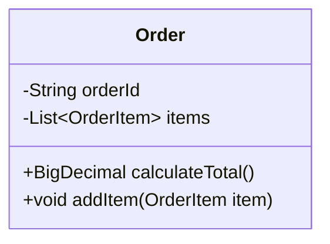
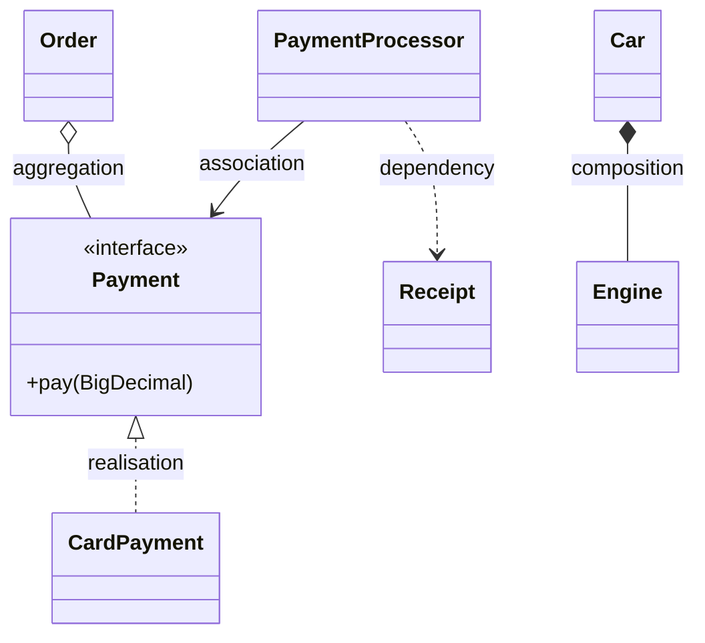
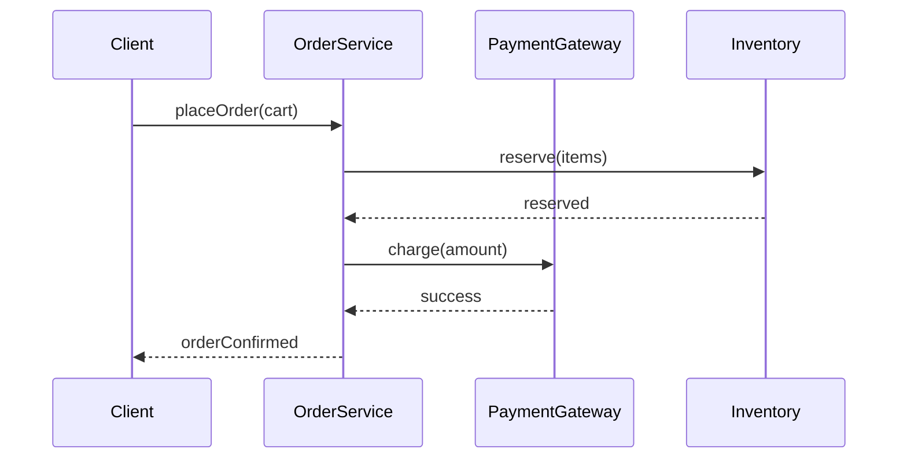
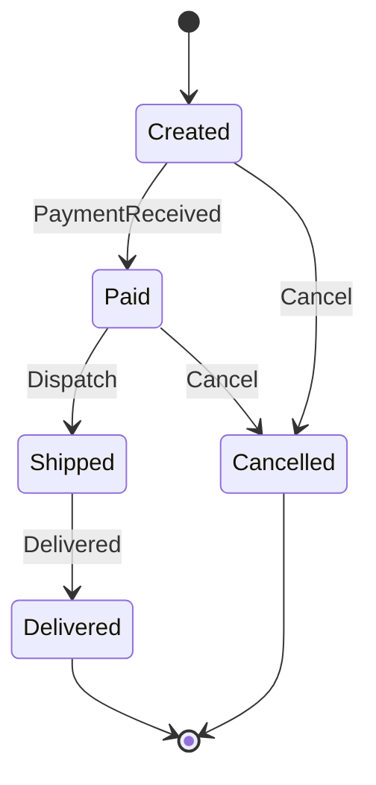

You will never be asked to reproduce full UML from a textbook in an interview — you'll be asked to sketch a class diagram on a whiteboard or in a shared doc while you talk. The skill being tested is picking the *right* small diagram fast and using the correct arrowhead, not academic completeness.

## The UML diagram family

UML splits into **structural** diagrams (what exists) and **behavioural** diagrams (what happens). You'll use two of these routinely in an LLD round and the rest only when asked; recognising all of them by sight is still worth having.

| Diagram | Category | Shows | Example |
|---|---|---|---|
| Class | Structural | Classes, attributes, methods, relationships | {height=120px} |
| Object | Structural | A snapshot of actual instances and their links at one moment | {height=120px} |
| Component / Deployment | Structural | How modules or services are packaged and deployed | — rarely hand-drawn in an LLD round |
| Use Case | Behavioural | Actors and the goals they achieve with the system | {height=120px} |
| Sequence | Behavioural | Messages between objects, in time order | {height=120px} |
| Activity | Behavioural | Workflow steps, branches, and parallel paths | {height=120px} |
| State | Behavioural | An entity's lifecycle and legal transitions | {height=120px} |

> [!KEY]
> You need class diagrams cold, sequence diagrams for "walk me through the flow", and state diagrams whenever an entity has real lifecycle rules — those three cover the overwhelming majority of an LLD round. Component, deployment, and object diagrams matter more for system design than for a single class model.

## Class diagrams: notation

A class box has three compartments: name, attributes, methods. Visibility is marked with a prefix symbol, and an abstract class's name is written in *italics* to distinguish it from a concrete one at a glance.

| Symbol | Visibility |
|---|---|
| `+` | public |
| `-` | private |
| `#` | protected |
| `~` | package/internal |

Attributes are written `visibility name : Type` and methods `visibility name(params) : ReturnType`; Mermaid's shorthand (`+BigDecimal calculateTotal()`) is accepted in every interview setting — nobody expects textbook-strict syntax on a whiteboard.

## Class diagram relationships: the arrow reference

This table is the single most tested piece of UML trivia — mixing these up is an instant tell that you learned UML from a summary, not from using it.

| Relationship | Meaning | Arrow | Mermaid syntax |
|---|---|---|---|
| Association | "uses" — general link, no ownership | Plain line | `A --> B` |
| Aggregation | Has-a, part can outlive whole | Line with hollow diamond at the whole | `A o-- B` |
| Composition | Has-a, part's lifetime bound to whole | Line with filled diamond at the whole | `A *-- B` |
| Inheritance / Generalisation | Is-a | Line with hollow triangle arrowhead, pointing to parent | `A <|-- B` |
| Realisation / Implementation | Implements an interface | Dashed line with hollow triangle arrowhead | `A <|.. B` |
| Dependency | "uses temporarily" (e.g. a method parameter) | Dashed line with open arrowhead | `A ..> B` |

> [!KEY]
> The four arrowheads that matter most in an interview: **hollow triangle = is-a** (inheritance, solid line, or realisation with a dashed line if it's an interface), **filled diamond = strong has-a** (composition), **hollow diamond = weak has-a** (aggregation). Get the diamond direction right — the diamond sits at the *whole*, not the *part*.

Two more notation details finish off the class diagram vocabulary: **multiplicity** is a number or range (`1`, `0..1`, `0..*`, `1..*`) written at each end of a relationship line, showing how many instances relate to how many — an `Order` to `OrderItem` line would read `1` on the `Order` end and `1..*` on the `OrderItem` end. And an **abstract class** is written with its name in *italics* rather than a special shape, the same convention shown in the notation image above.

## Sequence diagrams: interaction over time

Sequence diagrams show messages exchanged between objects **in order**, with a vertical lifeline per object. Use them to explain a flow like "what happens when a user places an order", which is a very common LLD follow-up after the class diagram.

A lifeline (the dotted vertical line under each object) shows how long an object exists in the interaction, and an activation bar (a thin rectangle on that lifeline) marks the span during which the object is actively processing a call — draw one whenever you want to show that a method is still running while it waits on a nested call.

Solid arrows (`->>`) are calls; dashed arrows (`-->>`) are returns. Sequence diagrams answer "what talks to what, in what order" — they're the right diagram when the interviewer asks "walk me through what happens when...", where a class diagram alone can't show ordering. A second worked example, showing the same shape applied to a different flow:

## State diagrams: lifecycle

State diagrams model the states an entity can be in and the transitions between them — the right tool whenever an object has a lifecycle with rules about what can follow what (order status, a connection, a workflow step).

This single diagram usually pre-empts several interview questions at once: "can an order be cancelled after shipping?" (no, per the diagram — the arrow doesn't exist), and "what pattern would you use to implement this?" (the State pattern, one class per state, each knowing its legal transitions).

## Use case diagrams

A use case diagram is a high-level, black-box view of the system: it answers "who does what with the system", not how the system does it internally, which is why it's the diagram you reach for **before** class design starts, during requirements gathering.

| Component | Purpose | Notation |
|---|---|---|
| Actor | A user or external system interacting with the system | Stick figure outside the boundary |
| Use case | A function the system provides | Oval inside the boundary |
| System boundary | Defines the scope of the system under design | Rectangle enclosing the use cases |
| Include | One use case always reuses another's behaviour | Dashed arrow labelled `<<include>>` |
| Extend | One use case optionally adds behaviour to another | Dashed arrow labelled `<<extend>>` |

`<<include>>` is mandatory reuse — "Checkout" always includes "Validate Payment". `<<extend>>` is optional, conditional behaviour — "Checkout" might extend to "Apply Coupon" only if the customer entered one. Mixing these up is a common tell: include is "always happens as part of", extend is "sometimes happens on top of".

> [!TIP]
> An interview shortcut: a use case diagram is just a bullet list of "actor → goal" pairs in disguise — say the list out loud ("a Customer can browse, checkout, and track an order; an Admin can manage inventory") rather than drawing ovals and stick figures, unless the interviewer specifically wants requirements-gathering practice.

## Activity diagrams

An activity diagram models a workflow's control flow — steps, decisions, and parallel paths — closer to a flowchart than to a class or object model. It's the right tool for describing a multi-step business process such as an approval or fulfilment workflow.

| Component | Purpose |
|---|---|
| Initial / final node | Filled circle marking where the workflow starts / ends |
| Activity | A rounded rectangle representing one task or action |
| Decision / merge | A diamond that branches the flow or recombines it |
| Fork / join | A thick bar that splits into concurrent flows or waits for them to recombine |
| Swimlane | A lane grouping activities by the actor or role responsible for them |
| Guard condition | A `[condition]` in square brackets that must hold for a transition to fire |

| Sequence diagram | Activity diagram |
|---|---|
| Shows interactions between objects over time | Shows the flow of control or data through a process |
| Focuses on the order of messages and calls | Focuses on steps, branches, and parallel paths |
| Depicts a single use case or scenario | Depicts an overall business process or workflow |

## Object diagrams — briefly

An object diagram is a snapshot of actual **instances** and the links between them at one moment in time, rather than the general blueprint a class diagram shows.

It's useful for illustrating a specific, concrete edge case that's hard to describe in the abstract — "here's what the graph looks like after these three orders" — but it's rarely worth drawing in a time-boxed interview; a class diagram plus a sentence describing the scenario usually communicates the same thing faster.

## How much UML to draw in 45 minutes

| Time budget | What to draw | What to skip |
|---|---|---|
| First 5–10 min | A rough class diagram: 4–8 boxes, key relationships only | Full attribute lists, every getter/setter |
| Mid-round (on request) | One sequence diagram for the core flow | Multiple sequence diagrams for every edge case |
| If lifecycle matters | One state diagram for the entity with the most rules | State diagrams for entities with only 2 trivial states |
| Rarely needed | Use case / activity / object diagrams | Full UML compliance (stereotypes, multiplicities on every line, notes) |

> [!TIP]
> Draw class diagrams **incrementally** as you talk, not all at once before speaking. Say "I'll start with `Order` and `OrderItem`" while drawing two boxes, then add `PaymentStrategy` when you get to payment. This mirrors how you'd actually design and reads as thinking, not reciting a memorised diagram.

> [!WARNING]
> Do not spend interview time getting arrow syntax pixel-perfect. Interviewers care that you know composition means "dies with the parent" and can say so — whether your diamond is slightly misplaced on a whiteboard matters far less than in a checked mermaid file.

## Common notation mistakes

- Drawing every relationship as a plain association line, including inheritance — losing the is-a signal entirely.
- Confusing aggregation and composition, or drawing the diamond at the *part* instead of the *whole*.
- Using a solid line with a triangle for interface realisation instead of a **dashed** line — realisation must be dashed to distinguish it from class inheritance.
- Overloading a class diagram with every method and field, burying the two or three relationships that actually matter for the discussion.
- Drawing a sequence diagram with no return messages, leaving the interviewer unsure whether a call is synchronous or fire-and-forget.
- Treating a state diagram like a flowchart and adding decision diamonds — state diagrams model **states and triggers**, not branching logic.
- Mixing up `<<include>>` and `<<extend>>` on a use case diagram — include is mandatory reuse, extend is optional behaviour.

## Cheat sheet

- Visibility: `+` public, `-` private, `#` protected, `~` internal/package; an abstract class name is written in *italics*.
- Hollow triangle = inheritance (solid line) or realisation (dashed line); filled diamond = composition; hollow diamond = aggregation; plain line = association; dashed open arrow = dependency.
- Diamond always sits at the **whole**, arrow always points to the **parent/interface**.
- Multiplicity (`1`, `0..1`, `0..*`, `1..*`) at each end of a line tells you whether a field should be a single reference or a collection.
- Class diagram = structure. Sequence diagram = order of messages over time. State diagram = lifecycle and legal transitions. Object diagram = a snapshot of live instances.
- Use case `<<include>>` = always happens; `<<extend>>` = sometimes happens on top.
- Use case / activity / object diagrams are for scoping and workflows — rarely drawn in the coding/LLD portion itself.
- In 45 minutes: one incremental class diagram, one sequence diagram if asked "walk me through the flow", one state diagram only if the entity has real lifecycle rules.
- Don't chase pixel-perfect notation — the interviewer is grading whether you know what each relationship *means*.

## Common mistakes

| Mistake | Fix |
|---|---|
| Using a solid triangle for interface implementation | Realisation must be a **dashed** line with a hollow triangle |
| Drawing the diamond on the child instead of the parent | Diamond (hollow or filled) always attaches to the **whole/container** |
| One giant class diagram with every field and method | Show only the attributes/methods relevant to the discussion |
| Skipping return arrows in a sequence diagram | Use dashed arrows (`-->>`) to show responses, clarifying sync flow |
| Treating state diagrams as decision flowcharts | Model states and named transitions/triggers, not if/else branches |
| Drawing full UML for a 45-minute round | Time-box diagrams: rough class diagram first, others only if asked |
| Using `<<extend>>` for behaviour that always happens | That's `<<include>>` — extend is strictly optional/conditional |

## Summary

UML in an interview is a communication shortcut, not a certification exam — you need the class diagram arrow vocabulary (association, aggregation, composition, inheritance, realisation, dependency) cold, a sequence diagram for "walk me through the flow" questions, and a state diagram whenever an entity has real lifecycle rules. Use case diagrams frame requirements before you design classes, activity diagrams describe branching workflows, and object diagrams capture a concrete snapshot when the abstract picture alone is confusing. Draw incrementally, keep boxes to what matters for the conversation, and get the diamond and triangle semantics exactly right — that single detail is what separates candidates who've internalised OOP relationships from those reciting a summary.

## Top Interview Questions

### Q1. What's the difference between the arrows for aggregation, composition, and association in a class diagram?

Association is a plain line meaning one class generally uses or knows about another, with no ownership implied (a `Driver` associated with a `Car`). Aggregation adds a hollow diamond at the "whole" end, meaning has-a with independent lifetimes — a `Library` aggregates `Book`s that exist before and after the library does. Composition adds a filled diamond at the "whole" end, meaning has-a with bound lifetimes — a `Car` is composed of an `Engine`, and destroying the car destroys the engine. The diamond always sits next to the container/whole class, never the part, and getting that direction backwards is a very common — and very noticeable — mistake.

### Q2. How do you distinguish inheritance from interface realisation in UML?

Both use a hollow (unfilled) triangle arrowhead pointing to the parent/interface, but the line style differs: inheritance (generalisation) between two classes uses a **solid** line, while realisation (a class implementing an interface) uses a **dashed** line. In Mermaid syntax this is `A <|-- B` for inheritance versus `A <|.. B` for realisation. The distinction matters because it tells a reader immediately whether they're looking at a concrete is-a relationship with inherited implementation, or a class merely promising to fulfil a contract with no shared implementation at all.

### Q3. When would you draw a sequence diagram instead of a class diagram in an interview?

A class diagram shows static structure — what classes exist and how they relate — but says nothing about the order operations happen in. A sequence diagram is the right tool the moment the interviewer asks "walk me through what happens when a user does X", because it shows the exact order of calls between objects and who calls whom, including whether a call is synchronous (solid arrow) or a return (dashed arrow). For example, after presenting an `Order`/`Payment`/`Inventory` class diagram, a natural follow-up is "what happens when checkout is called" — that's answered with a sequence diagram showing `Client → OrderService → Inventory → PaymentGateway` in order, not by adding more boxes to the class diagram.

### Q4. What is a state diagram used for, and how is it different from an activity diagram?

A state diagram models the discrete states an entity can be in and the named transitions/triggers that move it between them — for example an `Order` moving from `Created` to `Paid` to `Shipped`, with `Cancel` transitions only valid from certain states. An activity diagram instead models a workflow's control flow — the step-by-step process including decisions, parallel forks, and joins — closer to a flowchart than to an entity's lifecycle. The practical difference in an interview: reach for a state diagram when asked "what states can this entity be in and what's illegal" (e.g. can a shipped order be cancelled?), and reach for an activity diagram when asked to describe a multi-step business process with branching logic.

### Q5. How much UML should you actually draw in a 45-minute LLD interview?

Very little relative to what a textbook shows. Start with a rough class diagram — 4 to 8 boxes with just the key attributes, methods, and relationships that matter to the discussion — built incrementally as you talk through the design, not memorised and dumped all at once. Add a sequence diagram only if asked to walk through a specific flow, and a state diagram only if the entity under discussion has non-trivial lifecycle rules worth calling out. Full attribute lists, multiplicities on every association, and use case/activity diagrams are rarely worth the time; the interviewer is grading whether your model captures the right relationships and handles the requirements, not whether the diagram is textbook-complete.

### Q6. What does a dependency arrow (dashed, open arrowhead) mean, and how is it different from an association?

A dependency means one class uses another only **temporarily** — typically as a method parameter, a local variable, or a return type — without holding a persistent reference to it as a field. An association means the relationship is **structural**: one class holds a reference to the other as a field, for the lifetime of the object. For example, `PaymentProcessor` might have a dependency on `Receipt` (it creates and returns one from a method) without ever storing a `Receipt` reference as a field, whereas `PaymentProcessor` might have an association to `Payment` if it holds one as an injected field. The distinction matters because dependencies represent looser, more transient coupling than associations.

### Q7. A candidate draws every relationship in their class diagram as a plain line. What's wrong with that, and what would you ask them to fix?

Collapsing every relationship to a plain association line loses all the semantic information UML relationships are meant to convey — you can no longer tell an is-a relationship (inheritance) from a temporary usage (dependency) from a strong ownership relationship (composition), which matters because those imply very different runtime behaviour (e.g. whether deleting one object should cascade-delete another). I'd ask them to identify, for each line, whether the target object's lifetime depends on the source (composition), whether it's independent (aggregation or plain association), or whether one class is a specialised version of another (inheritance), and redraw the arrowheads accordingly. This usually surfaces design issues too — realising two "associated" classes are actually in an owns/owned relationship often changes how you'd write the constructor and disposal logic.

### Q8. How would you use a state diagram to justify choosing the State design pattern during an interview?

I'd draw the entity's lifecycle first — for an `Order`, states like `Created`, `Paid`, `Shipped`, `Delivered`, `Cancelled` with only specific transitions legal from each state (e.g. `Cancel` is legal from `Created` and `Paid` but not from `Shipped`). Once that diagram exists, the implementation question answers itself: encoding all those transition rules as `if/switch` statements scattered across the codebase becomes an unmaintainable and error-prone mess as states grow, which is precisely the smell the State pattern targets — each state becomes its own class implementing an `OrderState` interface, knowing only its own legal transitions, and the `Order` delegates behaviour to its current state object. The diagram is the evidence for the pattern choice, not just decoration.

### Q9. What's the correct way to show multiplicity (cardinality) on a class diagram, and when does it matter in an interview?

Multiplicity is written as a number or range at each end of an association line — `1`, `0..1`, `0..*`, `1..*` — describing how many instances of one class relate to how many of another; for example, an `Order` to `OrderItem` association would be `1` on the `Order` side and `1..*` on the `OrderItem` side, showing one order has at least one item. It matters most when the cardinality drives a real implementation decision — a `0..1` versus `1..*` changes whether a field is a nullable reference or a collection, and a `many-to-many` (`*` to `*`) usually signals you need a join/association class. In a time-boxed interview, only annotate multiplicity on the one or two relationships where the number actually changes the data structure you'd choose; skip it on every line to avoid cluttering the diagram.

### Q10. Why is the direction of the arrowhead on an inheritance relationship important to get right?

The hollow triangle always points from the child/subclass **to** the parent/superclass, regardless of which class was drawn first or which is visually "on top" — reversing it (pointing from parent to child) would misrepresent an is-a relationship as its opposite, implying the parent depends on or extends the child. This matters in an interview because the arrow direction is exactly how a reviewer can tell, at a glance and without reading any text, which class is the abstraction and which is the specific implementation — getting it backwards signals either a slip or a genuine misunderstanding of which way the "is-a" relationship flows, and interviewers do notice it on a shared whiteboard.

### Q11. What's the difference between `<<include>>` and `<<extend>>` on a use case diagram?

Both are dashed arrows between two use cases, but they express opposite relationships. `<<include>>` means the base use case **always** invokes the included one as part of its normal flow — "Checkout" always includes "Validate Payment", because you can't complete a checkout without validating payment. `<<extend>>` means the extending use case **optionally** adds behaviour on top of the base, only under some condition — "Checkout" might extend to "Apply Coupon Code" only if the customer happened to enter one. A quick way to keep them straight: include describes a dependency that's mandatory and unconditional, extend describes an insertion point that's optional and conditional; mixing them up in a diagram misrepresents which behaviour is guaranteed to run.

### Q12. When would you draw an object diagram instead of a class diagram, and why is it rarely worth it in a live interview?

An object diagram shows a snapshot of actual instances and the concrete links between them at one specific moment, rather than the general blueprint a class diagram shows — useful when you need to illustrate a particular, hard-to-describe state (for example, showing exactly how three specific `Order` objects reference a shared `Discount` instance after a promotion is applied). In a time-boxed interview it's rarely the best use of your remaining minutes, because a class diagram plus one or two spoken sentences describing the scenario ("imagine three orders, two of which share this discount") usually conveys the same information faster than drawing a second, more specific diagram. It's worth reaching for only when the interviewer explicitly probes a tricky aliasing or shared-reference edge case that's genuinely confusing in the abstract.
