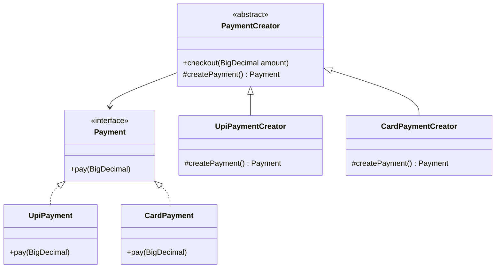
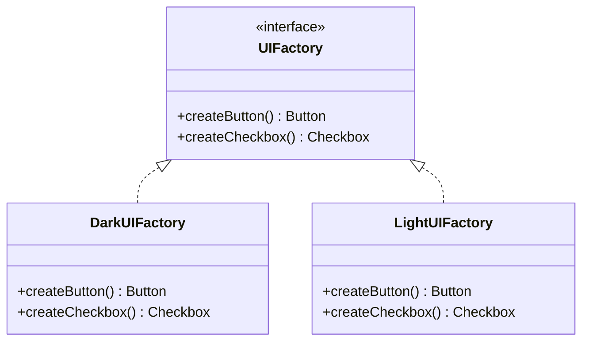
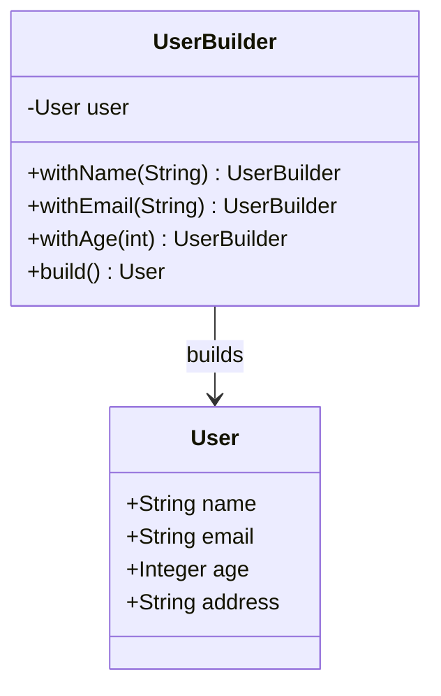
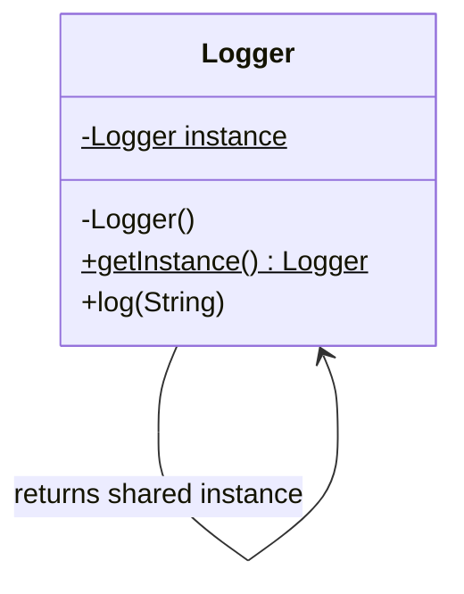

Creational patterns exist to answer one question: "how does this object get built, and does the caller need to know?" Interviewers use them to check whether you reach for the *right* amount of ceremony — a simple factory when that's enough, a builder when a constructor would be unreadable, and a healthy suspicion of singleton.

## Factory Method

**Problem:** a class needs to create an object, but the exact type to create should be decided by a subclass or a configuration value, not hardcoded.



```java
interface Payment {
    void pay(BigDecimal amount);
}
class UpiPayment implements Payment {
    public void pay(BigDecimal amount) { System.out.println("UPI paid " + amount); }
}
class CardPayment implements Payment {
    public void pay(BigDecimal amount) { System.out.println("Card paid " + amount); }
}
abstract class PaymentCreator {
    public final void checkout(BigDecimal amount) {
        Payment payment = createPayment();
        payment.pay(amount);
    }
    protected abstract Payment createPayment();
}
class UpiPaymentCreator extends PaymentCreator {
    protected Payment createPayment() { return new UpiPayment(); }
}
class CardPaymentCreator extends PaymentCreator {
    protected Payment createPayment() { return new CardPayment(); }
}
```

**Real-world use:** framework base classes that call a protected creation hook, `Calendar.getInstance()` and `NumberFormat.getInstance()`-style factory methods in spirit, JDBC driver/connection selection based on a config-driven URL, notification channel selection. **When not to use it:** if there's only ever one concrete type and no plausible second one on the roadmap — a factory around a single implementation is needless indirection.

## Abstract Factory

**Problem:** you need to create **families of related objects** that must stay consistent with each other — e.g. a UI toolkit where buttons and checkboxes must all match one visual theme.



```java
interface Button { void render(); }
interface Checkbox { void render(); }

interface UIFactory {
    Button createButton();
    Checkbox createCheckbox();
}
class DarkButton implements Button { public void render() { System.out.println("Dark button"); } }
class DarkCheckbox implements Checkbox { public void render() { System.out.println("Dark checkbox"); } }
class DarkUIFactory implements UIFactory {
    public Button createButton() { return new DarkButton(); }
    public Checkbox createCheckbox() { return new DarkCheckbox(); }
}
// LightUIFactory mirrors this, producing LightButton/LightCheckbox — never mixed
```

**Real-world use:** cross-platform UI toolkits, JAXP's `DocumentBuilderFactory`/`TransformerFactory`, database-access layers that must produce a matched `Connection`/`Statement`/`PreparedStatement` set. **When not to use it:** when there's only one product to create (that's just Factory Method) or the "families" never actually need to vary together — added complexity for a guarantee nobody needs.

> [!KEY]
> **Factory Method vs Abstract Factory vs a simple factory, clarified:** a *simple factory* is one static method with a switch — not a GoF pattern, just a convenience. *Factory Method* defines a creation method that subclasses override to decide **one** product's type. *Abstract Factory* is a factory of factories — an interface that creates **multiple related products** that must be consistent with each other. If you only ever need one object, use Factory Method (or a simple factory); reach for Abstract Factory only when object *families* must be swapped together.

## Builder

**Problem:** an object has many optional parameters, and a telescoping constructor (`new User(name, email, null, null, true, false, null, ...)`) becomes unreadable and error-prone.



```java
class User {
    private String name;
    private String email;
    private Integer age;
    void setName(String name) { this.name = name; }
    void setEmail(String email) { this.email = email; }
    void setAge(Integer age) { this.age = age; }
}
class UserBuilder {
    private final User user = new User();
    public UserBuilder withName(String name) { user.setName(name); return this; }
    public UserBuilder withEmail(String email) { user.setEmail(email); return this; }
    public UserBuilder withAge(int age) { user.setAge(age); return this; }
    public User build() { return user; }
}
// Usage — reads like configuration, not a parameter-position guessing game
var user = new UserBuilder().withName("Asha").withEmail("a@x.com").withAge(29).build();
```

**Real-world use:** `StringBuilder`, `Stream.Builder`, and `HttpRequest.newBuilder()` (java.net.http) configuration, SQL/JPA query builders, and Lombok `@Builder`-generated fixtures with many optional fields. **When not to use it:** an object with two or three required fields and no optional ones — a normal constructor or a `record` is clearer and a builder is ceremony without payoff.

## Prototype

**Problem:** creating a new object is expensive (a deep object graph, an expensive computed state) but you already have a similar object you could clone and tweak instead.

```java
interface Prototype<T> {
    T copy();
}
class ReportTemplate implements Prototype<ReportTemplate> {
    String header;
    List<String> sections = new ArrayList<>();

    ReportTemplate() { }
    // copy constructor — preferred over Cloneable, which is widely considered broken
    ReportTemplate(ReportTemplate other) {
        this.header = other.header;
        this.sections = new ArrayList<>(other.sections); // deep-copy the mutable list
    }
    public ReportTemplate copy() { return new ReportTemplate(this); }
}
// Usage
var base = new ReportTemplate();
base.header = "Q1 Report";
base.sections.addAll(List.of("Summary", "Details"));
var q2Template = base.copy();
q2Template.header = "Q2 Report"; // starts from a pre-populated copy, not from scratch
```

**Real-world use:** cloning a fully-configured object graph (a game entity with attached components, a pre-built document template) instead of re-running expensive setup logic. **When not to use it:** when construction is cheap — cloning adds the risk of shallow-copy bugs (forgetting to deep-copy a mutable field) for no real performance win.

> [!WARNING]
> The most common Prototype bug is a **shallow copy** of a mutable reference field — copying `ReportTemplate` without copying the `sections` list means both the original and the copy share the same underlying `List<String>`, so mutating one mutates the other. Always deep-copy mutable collections and nested objects explicitly. This is exactly why copy constructors (or `record` copies) are preferred over `Cloneable`, whose default `Object.clone()` is a shallow copy.

## Singleton

**Problem:** exactly one instance of a class must exist and be globally reachable — a configuration store, a logging sink, a connection pool.



Three ways to implement it thread-safely in Java, in increasing order of control:

```java
// 1. Initialization-on-demand holder — lazy, thread-safe, no locking
class Logger {
    private Logger() { }
    private static class Holder {
        static final Logger INSTANCE = new Logger();
    }
    public static Logger getInstance() { return Holder.INSTANCE; }
    public void log(String msg) { System.out.println(msg); }
}

// 2. Enum singleton — simplest, safe against serialization and reflection (Effective Java's pick)
enum ConfigStore {
    INSTANCE;
    // fields and methods live here
}

// 3. Double-checked locking — manual control, needs a volatile field and extra init logic
class ConnectionPool {
    private static volatile ConnectionPool instance;
    private ConnectionPool() { }
    public static ConnectionPool getInstance() {
        if (instance == null) {
            synchronized (ConnectionPool.class) {
                if (instance == null) instance = new ConnectionPool();
            }
        }
        return instance;
    }
}
```

| Approach | Laziness | Thread safety mechanism | When to use |
|---|---|---|---|
| Holder idiom | Lazy | JVM class-initialisation lock loads `Holder` once, on first use | Default choice — lazy and lock-free |
| Enum singleton | Eager (at enum load) | JVM guarantees enum constants are constructed once | Simplest correct option; immune to serialization/reflection attacks |
| Double-checked locking | Lazy | Manual `synchronized` + `volatile` | Legacy codebases, or extra control needed over initialisation timing |

> [!DANGER]
> **Singleton is often an anti-pattern in testable code.** It introduces hidden global state — any class that reaches for `Logger.getInstance()` has an invisible dependency that doesn't show up in its constructor signature, making it impossible to substitute a fake in a unit test without resorting to static-state hacks. The modern fix: register the "singleton" behaviour as a **Spring singleton-scoped bean** (Spring's default scope) and inject it via an interface (e.g. `Logger`), so callers depend on an abstraction they can mock, while the container still guarantees exactly one instance.

**Real-world use:** a holder-idiom-backed configuration cache, `Runtime.getRuntime()`, a metrics registry. **When not to use it:** any time testability matters and the "one instance" requirement can instead be satisfied by registering a service as a singleton-scoped bean in a DI container like Spring.

## Factory Method vs Builder

Both show up around "construction", but they answer different questions: Factory Method decides **which concrete implementation** should exist, while Builder decides **how one complex object** should be assembled clearly.

| | Factory Method | Builder |
|---|---|---|
| Main question | "Which product do I create?" | "How do I construct this product?" |
| Output | One implementation behind an abstraction | One object assembled in readable steps |
| Typical trigger | Runtime input, config, or subclass decides the type | Many optional fields, staged validation, or a telescoping constructor |

## When to reach for each

| Pattern | Reach for it when | Don't use it when |
|---|---|---|
| Factory Method | One product type, decided by input/config | Only one implementation will ever exist |
| Abstract Factory | Families of related objects must stay consistent | Only one product family, or products never vary together |
| Builder | Many optional parameters, or step-by-step assembly | Object has 2–3 required fields, a constructor is clear |
| Prototype | Cloning is cheaper than reconstruction, deep object graphs | Construction is already cheap and simple |
| Singleton | Genuinely one shared, stateless-ish resource, testability handled via DI | You'd otherwise reach for a global and skip DI entirely |

## Cheat sheet

- Factory Method = one product, decided dynamically. Abstract Factory = a **family** of products that must match.
- A "simple factory" (one static method with a switch) isn't a GoF pattern — it's a convenience, and that's fine to say out loud.
- Builder wins over a telescoping constructor once you have 4+ optional parameters or need fluent, readable construction.
- Prototype's classic bug is a shallow copy — always deep-copy mutable fields in `copy()` (and prefer a copy constructor over `Cloneable`).
- Thread-safe singleton, easiest to hardest: enum singleton → initialization-on-demand holder → double-checked locking with `volatile`.
- Singleton's real danger isn't concurrency bugs, it's **hidden global state that breaks unit testing** — prefer DI-container-scoped singletons behind an interface.
- Ask "does this need to vary independently, or is it a family that must move together?" to pick between Factory Method and Abstract Factory.

## Common mistakes

| Mistake | Fix |
|---|---|
| Calling any static factory method "the Factory pattern" | Distinguish simple factory (convenience) from Factory Method (overridable in a subclass) from Abstract Factory (families) |
| Using a public mutable static field as a "singleton" | Use an enum singleton or the initialization-on-demand holder idiom with a private constructor |
| Forgetting `volatile` in double-checked locking | Without it, a partially-constructed instance can be observed by another thread due to reordering |
| Shallow-copying in `copy()` | Deep-copy every mutable reference field explicitly |
| Building a fluent `Builder` for a 2-field DTO | Use a normal constructor or a `record` — builder adds no value there |
| Injecting `Singleton.getInstance()` directly into business logic | Depend on an interface, register the concrete type as a singleton-scoped bean in the DI container |

## Summary

Creational patterns are about controlling *how* and *when* objects come into being so that callers don't have to know construction details. Factory Method and Abstract Factory move that decision behind an interface — one product versus a matched family. Builder tames constructors that have grown too many optional parameters. Prototype trades construction cost for a clone, at the risk of shallow-copy bugs. Singleton guarantees one instance but, done as a raw static accessor, quietly breaks testability — the senior move is to get the "one instance" guarantee from your DI container instead of a hand-rolled static field.

## Top Interview Questions

### Q1. What's the difference between a simple factory, Factory Method, and Abstract Factory?

A simple factory is just a static method with a switch statement that returns different concrete types — convenient, but not a formal GoF pattern since there's no polymorphism in the creation logic itself. Factory Method is a proper pattern: a class declares a method (often abstract) whose job is to create **one** product, and subclasses override it to decide which concrete type gets created — the creation logic itself is polymorphic. Abstract Factory goes a level further: it's an interface for creating **families of related products** that must remain consistent with each other, like a `DarkUIFactory` producing a matched dark button and dark checkbox together, so you never accidentally mix a light button with a dark checkbox.

### Q2. When would you use Builder instead of a constructor with optional parameters or named arguments?

Java has no named or optional constructor parameters, so a type with many optional fields either grows overloaded constructors or a single telescoping constructor — and once you need multi-step construction, validation that spans several steps, or immutability with many combinations of parameters, a constructor with eight parameters is unreadable and error-prone at the call site (easy to swap two same-typed arguments by position). Builder fixes this with a fluent, self-documenting call chain (`.withName(...).withEmail(...).build()`), and can enforce invariants at `build()` time (e.g. throwing if a required field was never set) that a constructor alone can't express as cleanly across many optional combinations. I'd reach for it once a type has 4 or more optional parameters or the construction genuinely happens in logical steps.

### Q3. Give three thread-safe ways to implement Singleton in Java, and explain the trade-offs.

The enum singleton is the simplest and safest — a single-element enum is constructed once by the JVM, is thread-safe by construction, and is immune to serialization and reflection attacks, which is why *Effective Java* recommends it as the default. The initialization-on-demand holder idiom gives you lazy initialization without any locking: the nested `Holder` class isn't loaded until `getInstance()` is first called, and the JVM's class-initialisation lock guarantees the instance is built exactly once. Double-checked locking is the manual approach — check for null, `synchronized`, check again inside the lock before constructing — and it *requires* the field to be `volatile`, otherwise instruction reordering can expose a partially-constructed object to another thread; it's more error-prone to write correctly and mostly superseded by the holder idiom or an enum today.

### Q4. Why do many people consider Singleton an anti-pattern, especially in testable code?

The core problem isn't concurrency — it's that a singleton introduces **invisible global state**: any class that calls `Logger.getInstance()` internally has a hidden dependency that doesn't appear in its constructor, so you can't see what it depends on just by reading its signature, and you can't substitute a test double for it without hacks like reflection or static-state resets between tests. It also silently couples unrelated parts of a system through shared mutable state, and makes parallel test execution risky if the singleton holds mutable state that leaks between tests. The fix isn't to abandon "one shared instance" as a requirement — it's to get that guarantee from a DI container (e.g. Spring) by registering the type as a singleton-scoped bean behind an interface, so consumers depend on an injectable abstraction instead of a static accessor.

### Q5. What's the classic bug in a naive Prototype implementation, and how do you avoid it?

The classic bug is a **shallow copy**: if the copy is implemented with a default member-wise copy (or by copying reference fields directly without cloning them), any mutable reference field — a `List<T>`, a nested object, a map — ends up shared between the original and the copy. Mutating the copy's list then silently mutates the original's list too, since they point at the same underlying object, producing bugs that are hard to trace because the two "independent" objects are secretly entangled. The fix is to explicitly deep-copy every mutable field inside the copy constructor / `copy()` — construct a new `List<T>` from the old one's contents, recursively copy nested objects that are themselves mutable — and to write a test that mutates a copy and asserts the original is unaffected.

### Q6. When would Abstract Factory be overkill, and what would you use instead?

Abstract Factory is overkill when there's only one "family" of products in practice — for example, if your application only ever targets one UI theme or one database provider and there's no near-term plan to support a second, the extra layer of a `UIFactory` interface plus per-family concrete factories adds indirection with no real flexibility payoff. In that case a plain Factory Method (or even direct construction via dependency injection of the concrete types) is simpler and equally correct. The signal to actually reach for Abstract Factory is when you can name at least two families today (dark/light theme, MySQL/Postgres) and the products within each family genuinely need to stay consistent with each other — if there's no consistency constraint across products, you likely just need several independent Factory Methods, not one Abstract Factory.

### Q7. How would you refactor a codebase that uses a public static mutable singleton for configuration, in a way that's safe for a large team to adopt incrementally?

I'd first introduce an interface (`AppConfig`) matching the singleton's public surface, and make the existing static class implement it internally while keeping the static accessor working, so nothing breaks immediately. Next I'd register that implementation with the DI container as a singleton-scoped bean and start injecting `AppConfig` into new and refactored classes via their constructors, while legacy code still reaches `ConfigStore.getInstance()` directly during the transition. Once call sites are migrated, I'd delete the static accessor entirely, leaving only the DI-registered singleton — at that point every consumer is unit-testable via a mock `AppConfig`, and the "exactly one instance" guarantee is enforced by the container's lifetime management instead of a hand-rolled static field, which also makes it trivial to have per-test-isolated instances in test runs.

### Q8. What real JDK or framework examples map to each creational pattern?

`Calendar.getInstance()`, `NumberFormat.getInstance()`, and `ThreadLocalRandom.current()` are Factory Methods in spirit — they hand back an implementation chosen by locale or context without the caller naming a concrete type; SLF4J's `LoggerFactory.getLogger(...)` is the same idea. `javax.xml.parsers.DocumentBuilderFactory` and `TransformerFactory` in JAXP are textbook Abstract Factories — each creates a matched family of parser/transformer objects for a configured implementation. `StringBuilder`, `Stream.Builder`, and `HttpRequest.newBuilder()`, along with Lombok's `@Builder`, echo the Builder pattern's step-by-step, chained construction. `Object.clone()`/`Cloneable` is the raw mechanism behind Prototype (though it's shallow by default and widely considered broken, so copy constructors or `record` copies are preferred). And `Runtime.getRuntime()`, enum singletons, and Spring's default singleton-scoped `@Bean`s are the modern, testable stand-ins for a hand-rolled Singleton.

### Q9. A junior engineer asks why not just use `new SomeClass()` everywhere instead of a Factory. What do you tell them?

I'd say: for a class with exactly one implementation and no expected variation, they're right — a Factory would be needless indirection, and `new` is perfectly fine. The moment that changes is when the *caller* shouldn't need to know or care which concrete type gets created — because it depends on runtime configuration, user input, or an interface with multiple implementations — that's when a Factory pays for itself, because the calling code depends only on the abstraction (`Payment`) and stays unchanged when a new concrete type (`WalletPayment`) is added later. I'd frame it as "don't introduce a Factory speculatively; introduce it the moment you have — or can clearly foresee — more than one concrete type behind the same contract," which keeps the codebase simple until complexity is actually needed (YAGNI applied correctly).

### Q10. How would you decide, in a design interview, whether a requirement calls for Builder versus Abstract Factory versus Prototype?

I'd map the requirement to the shape of the problem: if the pain point is "this object has too many optional parameters and construction is confusing", that's Builder — it's about *assembling one object* step-by-step. If the pain point is "I need to create several related objects that must be consistent with each other, and that consistency requirement changes by context (theme, provider, region)", that's Abstract Factory — it's about *creating families*. If the pain point is "constructing this object from scratch is expensive, but I frequently need near-copies of an existing one with minor tweaks", that's Prototype — it's about *cloning versus rebuilding*. In an interview I'd say this classification out loud before writing code, since naming the actual pain point the pattern solves is what proves you're choosing it deliberately rather than pattern-matching keywords.
