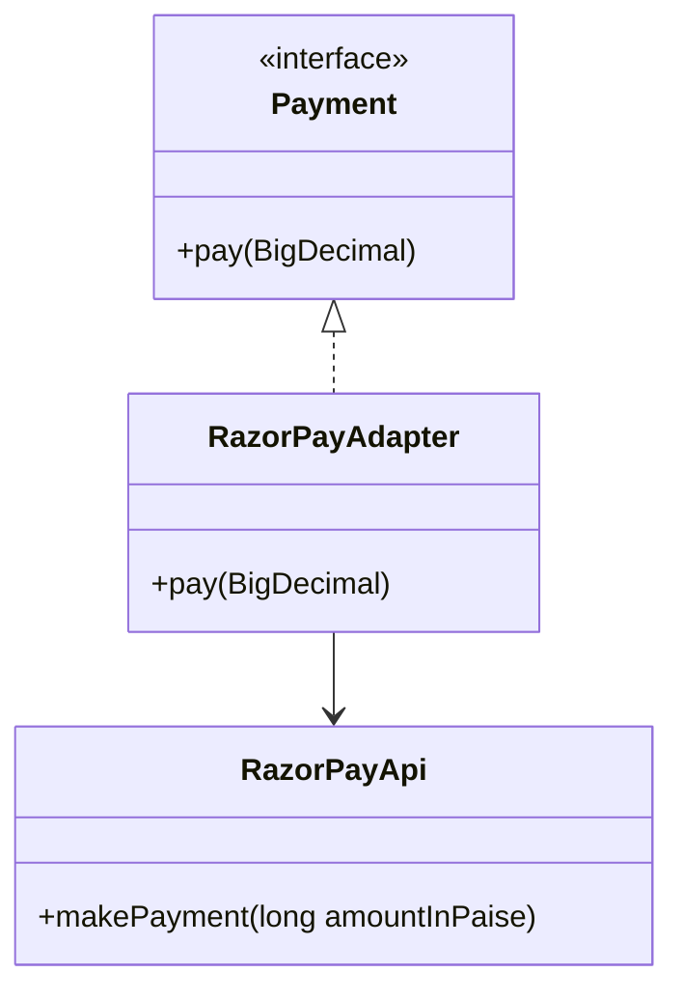
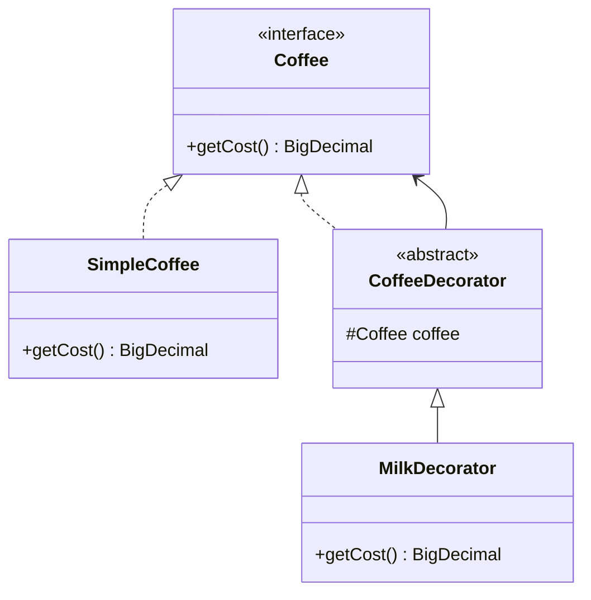
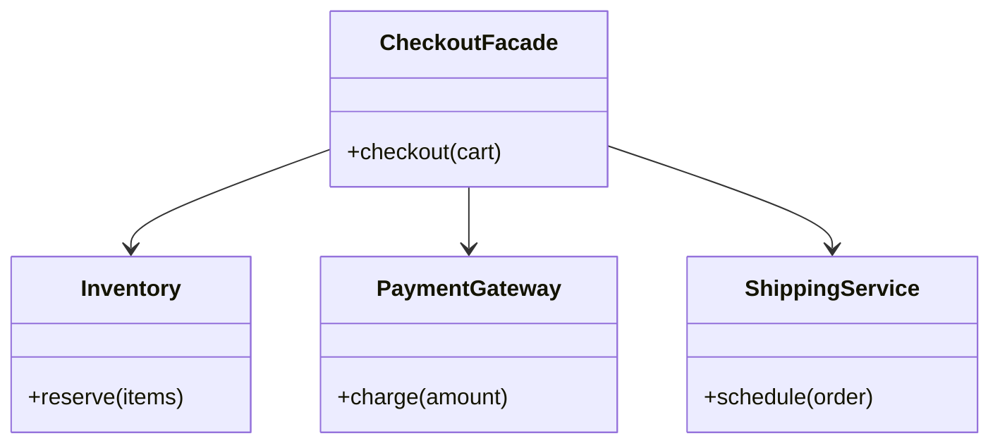
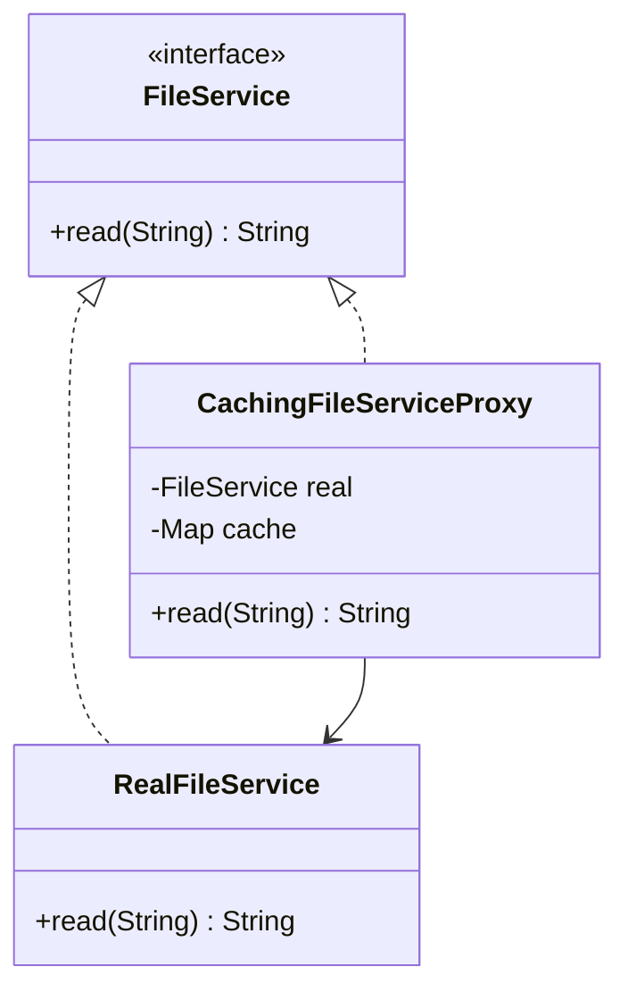
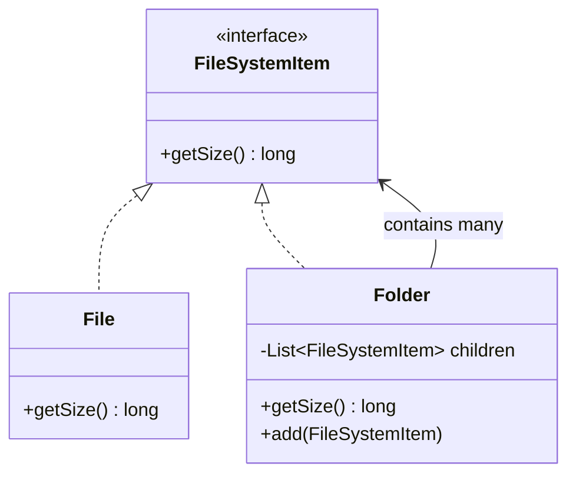

Structural patterns are about composing classes and objects into larger structures without making that structure fragile. Adapter, Decorator and Proxy look nearly identical on paper — same shape, one wrapped object behind one interface — so the interview test is whether you can state the *intent* difference, not just draw the diagram.

## Adapter

**Problem:** you have an existing class with an incompatible interface (often third-party or legacy) and need it to work where a different interface is expected, without modifying its source.



```java
interface Payment {
    void pay(BigDecimal amount);
}
class RazorPayApi { // third-party, cannot change its signature
    public void makePayment(long amountInPaise) { System.out.println("Paid " + amountInPaise); }
}
class RazorPayAdapter implements Payment {
    private final RazorPayApi api;
    public RazorPayAdapter(RazorPayApi api) { this.api = api; }
    public void pay(BigDecimal amount) {
        long paise = amount.movePointRight(2).longValueExact();
        api.makePayment(paise); // translates rupees to the provider's minor-unit API
    }
}
```

**Real-world example:** wrapping a legacy SOAP client or an older SDK behind your application's modern `Payment`/`NotificationSender` interface so the rest of the codebase never sees the legacy shape. **JDK example:** `InputStreamReader` adapts a byte-oriented `InputStream` into a character-oriented `Reader`; `Arrays.asList(array)` adapts an array into a `List`, and `Collections.list(Enumeration)` adapts a legacy `Enumeration` into a `List`.

## Decorator

**Problem:** you need to add optional, combinable behaviour to an object at runtime without subclassing for every combination of features.



```java
interface Coffee { BigDecimal getCost(); }
class SimpleCoffee implements Coffee { public BigDecimal getCost() { return BigDecimal.valueOf(100); } }
abstract class CoffeeDecorator implements Coffee {
    protected final Coffee coffee;
    protected CoffeeDecorator(Coffee coffee) { this.coffee = coffee; }
    public abstract BigDecimal getCost();
}
class MilkDecorator extends CoffeeDecorator {
    public MilkDecorator(Coffee coffee) { super(coffee); }
    @Override
    public BigDecimal getCost() { return coffee.getCost().add(BigDecimal.valueOf(20)); } // adds behaviour, same interface
}
// Coffee coffee = new MilkDecorator(new SugarDecorator(new SimpleCoffee()));
```

**Real-world example:** Servlet `Filter` chains — each filter wraps the next via the `FilterChain`, adding auth, logging, or compression before forwarding the request, all implementing the same `Filter` contract. **JDK example:** `java.io` stream wrapping — `BufferedInputStream` wraps a `FileInputStream`, which could itself be wrapped in a `GZIPInputStream`, each adding behaviour while remaining an `InputStream`; `Collections.unmodifiableList` is a decorator that adds immutability to any `List`.

## Facade

**Problem:** a subsystem has many interacting classes with a complex protocol between them, and most callers only need a simple, high-level operation.



```java
class CheckoutFacade {
    private final Inventory inventory = new Inventory();
    private final PaymentGateway payment = new PaymentGateway();
    private final ShippingService shipping = new ShippingService();

    public void checkout(Cart cart) { // one call replaces coordinating three subsystems
        inventory.reserve(cart.getItems());
        payment.charge(cart.getTotal());
        shipping.schedule(cart);
    }
}
```

**Real-world example:** a `CheckoutFacade` in an e-commerce backend that hides inventory reservation, payment charging, and shipping scheduling behind one `checkout()` call. **JDK example:** `java.net.http.HttpClient` is a facade over the much lower-level socket, connection-pool, and DNS machinery most callers never touch; Spring's `JdbcTemplate` is a facade over raw JDBC `Connection`/`Statement`/`ResultSet` handling.

## Proxy

**Problem:** you need to control access to an object — adding lazy loading, caching, access control, or logging — without the client knowing it isn't talking to the real thing directly.



```java
interface FileService { String read(String path); }
class RealFileService implements FileService {
    public String read(String path) {
        try { return Files.readString(Path.of(path)); } // expensive disk I/O
        catch (IOException e) { throw new UncheckedIOException(e); }
    }
}
class CachingFileServiceProxy implements FileService {
    private final FileService real;
    private final Map<String, String> cache = new HashMap<>();
    public CachingFileServiceProxy(FileService real) { this.real = real; }
    public String read(String path) {
        return cache.computeIfAbsent(path, real::read); // caller never knows caching happened
    }
}
```

**Real-world example:** a caching proxy in front of a slow file or network read, an authorization proxy that checks permissions before delegating to the real service, or Hibernate's lazy-loading proxies that defer fetching an association until it's first accessed. **JDK example:** `java.lang.reflect.Proxy` generates proxy classes at runtime, and Hibernate lazy-loading proxies and Spring AOP proxies are textbook runtime Proxies.

## Composite

**Problem:** you need to treat a single object and a group of objects **uniformly** — typically for a tree structure where a leaf and a branch should support the same operations.



```java
interface FileSystemItem { long getSize(); }
class File implements FileSystemItem {
    private final long size;
    public File(long size) { this.size = size; }
    public long getSize() { return size; }
}
class Folder implements FileSystemItem {
    private final List<FileSystemItem> children = new ArrayList<>();
    public void add(FileSystemItem item) { children.add(item); }
    public long getSize() {
        return children.stream().mapToLong(FileSystemItem::getSize).sum(); // recurses uniformly over leaves and branches
    }
}
```

**Real-world example:** file systems (files and folders), and UI component trees (a `JPanel` containing `JButton`s and nested `JPanel`s), where the caller calls `render()`/`getSize()` without caring whether it's a leaf or a container. **JDK example:** Swing's component tree — a `JPanel` is itself a `Component` (via `Container`) holding more `Component`s.

## Bridge

**Problem:** an abstraction and its implementation are both likely to vary independently, and inheritance alone would force a combinatorial explosion of subclasses (as seen with the duck/bird problem).

```java
interface Renderer { // the "implementation" side
    void renderCircle(double radius);
}
class VectorRenderer implements Renderer {
    public void renderCircle(double radius) { System.out.println("Vector circle r=" + radius); }
}
class RasterRenderer implements Renderer {
    public void renderCircle(double radius) { System.out.println("Raster circle r=" + radius); }
}
abstract class Shape { // the "abstraction" side
    protected final Renderer renderer;
    protected Shape(Renderer renderer) { this.renderer = renderer; }
    public abstract void draw();
}
class Circle extends Shape {
    private final double radius;
    public Circle(Renderer renderer, double radius) { super(renderer); this.radius = radius; }
    @Override
    public void draw() { renderer.renderCircle(radius); } // shape delegates to renderer
}
```

**Real-world example:** decoupling a `Shape` hierarchy (`Circle`, `Square`) from a `Renderer` hierarchy (`VectorRenderer`, `RasterRenderer`) so either can be extended independently — 2 shapes × 2 renderers stays 4 classes total, not 4 combined subclasses. Bridge is Strategy's structural cousin: both compose an interface instead of inheriting, but Bridge is framed around splitting an abstraction from its implementation hierarchy up front, while Strategy is framed around swapping one algorithm at a time.

## Flyweight

**Problem:** you need to create a very large number of similar objects, and the memory cost of storing duplicate data in each one is too high.

```java
class CharacterStyle { // the shared, immutable "intrinsic" state
    private final String font;
    private final int size;
    public CharacterStyle(String font, int size) { this.font = font; this.size = size; }
    public String getFont() { return font; }
    public int getSize() { return size; }
}
class CharacterStyleFactory {
    private final Map<String, CharacterStyle> styles = new HashMap<>();
    public CharacterStyle get(String font, int size) {
        // reused across every character with the same font+size
        return styles.computeIfAbsent(font + "-" + size, k -> new CharacterStyle(font, size));
    }
}
// Each on-screen character stores only its position + a shared CharacterStyle reference,
// instead of duplicating font/size data per character.
```

**Real-world example:** a text editor or document renderer storing millions of characters, where font/size/color is shared (interned) across characters rather than duplicated per character. **JDK example:** `String.intern()`'s string pool and `Integer.valueOf`'s cache (for values −128..127) are built-in Flyweights — identical values share one underlying object instead of allocating duplicates.

## Adapter vs Decorator vs Proxy

These three share the exact same structural shape — a class implementing an interface while wrapping another object that implements the same or a related interface — which is precisely why interviewers ask you to tell them apart. The difference is entirely about **intent**.

| | Adapter | Decorator | Proxy |
|---|---|---|---|
| Changes the interface? | Yes — converts one interface to another the client expects | No — implements the exact same interface as what it wraps | No — implements the exact same interface as the real subject |
| Adds behaviour? | No — only translates calls | Yes — adds new behaviour before/after delegating | Sometimes — but for **access control**, not new features |
| Client awareness | Client knows it's adapting a different, incompatible type | Client doesn't need to know decoration happened | Client typically doesn't know it isn't talking to the real object |
| Typical use | Legacy/third-party integration | Stacking optional features (logging, compression, retry) | Lazy loading, caching, authorization, remote proxies |
| Cardinality | Usually wraps exactly one incompatible object | Designed to be **stacked** — many decorators, one object | Usually a 1:1 stand-in for one real subject |

> [!KEY]
> Say it this way in the room: *"Adapter changes the interface to make two incompatible things talk. Decorator keeps the interface identical and adds behaviour, and is meant to be stacked. Proxy also keeps the interface identical, but its purpose is controlling access to the real object — caching, lazy-loading, or permission checks — not adding new functionality."*

> [!TIP]
> A quick gut-check question to ask yourself mid-interview: "does the wrapped call arrive at the real object completely unmodified, just gated?" — if yes, it's a Proxy. "Is the point that the caller can layer several of these on top of each other?" — if yes, it's a Decorator. "Is the whole reason this class exists that the two interfaces don't match?" — if yes, it's an Adapter.

### Decorator vs inheritance

Inheritance is fine when the variation is small and fixed, but it breaks down once features must be combined independently or turned on and off at runtime.

| | Decorator | Inheritance |
|---|---|---|
| When behaviour is chosen | Runtime | Usually compile time |
| Composition style | Wraps another object | Extends a base class |
| Feature combinations | Easy to stack (`Logging` + `Retry` + `Caching`) | Subclass count grows combinatorially |
| Good fit | Optional cross-cutting behaviour | Small, stable variation with few combinations |

## Cheat sheet

- Adapter: **converts** an incompatible interface to the one the client expects; one wrapper, no new behaviour.
- Decorator: **adds behaviour**, same interface, designed to be **stacked** (many decorators around one component).
- Facade: **simplifies** a complex subsystem behind one high-level entry point; doesn't hide behind the subsystem's own interface, it's a new, simpler one.
- Proxy: **controls access** (lazy load, cache, authorize) behind the *same* interface as the real object; the client shouldn't need to know.
- Composite: treat a **leaf and a branch uniformly** through one shared interface — the classic tree-structure pattern.
- Bridge: split an **abstraction and its implementation** into two independent hierarchies to avoid combinatorial subclass explosion.
- Flyweight: **share immutable intrinsic state** across many objects to cut memory use; only extrinsic (per-instance) state stays unique.
- Servlet `Filter` chain = Decorator. Hibernate/JDK dynamic proxies = Proxy. `InputStreamReader` = Adapter. `HttpClient`/`JdbcTemplate` = Facade. `String.intern()`/`Integer.valueOf` cache = Flyweight.

## Common mistakes

| Mistake | Fix |
|---|---|
| Calling any wrapper class "a Decorator" | Check intent — if it changes the interface, it's Adapter; if it's about access control, it's Proxy |
| Using Facade to mean "hide everything, forever" | Facade simplifies the common path; the subsystem's full API should still be reachable when needed |
| Building a Composite without a shared interface for leaf and branch | Both `File` and `Folder` must implement the same `FileSystemItem` contract |
| Reaching for Bridge when Strategy would do | Use Bridge when *two* hierarchies vary independently; Strategy is enough for one varying algorithm |
| Ignoring extrinsic vs intrinsic state in Flyweight | Only intrinsic (shared, immutable) state belongs in the flyweight object; per-instance state stays outside it |
| Adding caching logic directly inside the real service class | Extract it into a Proxy so the real class stays focused on its one job (SRP) |

## Summary

Structural patterns compose objects into larger, more flexible shapes without hard-wiring the composition into inheritance. Adapter translates an incompatible interface, Decorator stacks optional behaviour on an unchanged interface, Facade flattens a complex subsystem into a simple entry point, and Proxy stands in for a real object to control access. Composite unifies leaf-and-branch tree structures, Bridge decouples two hierarchies that vary independently, and Flyweight shares immutable state to cut memory. The interview-winning move is naming *intent*, not shape — Adapter/Decorator/Proxy are structurally identical, and only the reason you're wrapping the object tells you which one you're actually looking at.

## Top Interview Questions

### Q1. Adapter, Decorator and Proxy all wrap another object behind an interface. How do you tell them apart?

They differ by **intent**, not structure. Adapter exists because two interfaces don't match — its whole job is translation, converting calls from the interface the client expects to the interface the wrapped object actually has, with no new behaviour added. Decorator keeps the interface identical to what it wraps and exists to **add behaviour** — logging, compression, retries — and is explicitly designed so you can stack several of them on one object. Proxy also keeps the interface identical, but its purpose is **controlling access** to the real object — lazy loading it, caching its results, or checking permissions — the client typically shouldn't even know it isn't talking to the real thing. In an interview, I'd ask myself: does this change the interface (Adapter)? Is it meant to be stacked for extra features (Decorator)? Or is it gatekeeping access to the real object (Proxy)?

### Q2. How does the Servlet `Filter` chain map to the Decorator pattern?

Each `Filter` in the pipeline implements the same `doFilter(request, response, chain)` contract and holds the next filter via the `FilterChain`, adding behaviour (auth checks, request logging, GZIP compression) before or after calling `chain.doFilter(...)` to forward to the next filter in the chain — that's exactly the Decorator shape: same interface, stacked wrappers, each adding one concern. This is powerful because filters can be composed in any order and reused across different servlets and URL patterns via web.xml or `@WebFilter` registration, without ever subclassing the servlet itself for each combination of concerns — which is precisely the combinatorial-explosion problem Decorator is meant to solve.

### Q3. What's the difference between Facade and Adapter — don't they both "wrap" something?

They solve different problems. Adapter's job is **interface translation** for **one** object whose interface doesn't match what the client expects — it doesn't reduce complexity, it just makes an incompatible shape fit. Facade's job is **simplification** — it sits in front of **multiple** classes/subsystems with a complex internal protocol between them, and exposes one easy high-level method that coordinates all of them internally. A useful test: if you removed the wrapper, would the client still be able to call the underlying object directly with a bit more code (that's Facade — the subsystem's classes are still usable on their own), or would the client be completely unable to use the underlying object because the interface genuinely doesn't match (that's Adapter)?

### Q4. Give a concrete example of when you'd use a Proxy for lazy loading, and how it stays transparent to the caller.

Hibernate's lazy-loading proxies are the standard example: when a `Blog` entity has a `posts` collection mapped as lazy, Hibernate hands back a proxy/`PersistentBag` that intercepts access to the collection and triggers a database query the first time it's touched, then caches the result. The caller writes `blog.getPosts()` exactly as if it were a plain in-memory collection — there's no `if (proxy)` branching, no special API — because the proxy implements/extends the exact same public surface as the real entity. This transparency is the point of Proxy: the client's code doesn't change at all whether it's handed the real object or a proxy standing in for it.

### Q5. How does Composite let you treat a single object and a collection of objects the same way? Walk through a file system example.

Both `File` and `Folder` implement the same interface, say `FileSystemItem` with a `getSize()` method. `File.getSize()` returns its own stored size directly — the leaf case. `Folder.getSize()` holds a list of child `FileSystemItem`s (which can themselves be files or more folders) and implements `getSize()` by summing `getSize()` recursively over all its children. Because both classes share the same interface, calling code never needs to check "is this a file or a folder" — it just calls `getSize()` polymorphically on the root and the whole tree's total size falls out of the recursion, regardless of how deeply nested the folder structure is. This uniform treatment of leaves and composites is exactly what makes tree-shaped domains (file systems, UI component trees, org charts) a natural fit for Composite.

### Q6. When would you use Bridge instead of just adding more subclasses?

Bridge is the right call when you have **two dimensions of variation** that would otherwise multiply into a combinatorial explosion of subclasses — for example, shapes (`Circle`, `Square`) that each need to support multiple rendering strategies (`VectorRenderer`, `RasterRenderer`). Modelling this with pure inheritance would need one subclass per combination (`VectorCircle`, `RasterCircle`, `VectorSquare`, `RasterSquare` — 4 classes for 2×2, growing multiplicatively as either dimension grows). Bridge splits it into two independent hierarchies — `Shape` holds a reference to a `Renderer` it delegates rendering to — so adding a third shape or a third renderer only adds one class, not a new row and column of combinations. It's structurally similar to Strategy; the distinguishing framing is that Bridge is specifically about decoupling an **abstraction hierarchy** from an **implementation hierarchy** that both need to grow independently.

### Q7. What problem does Flyweight solve, and what's the difference between intrinsic and extrinsic state?

Flyweight solves a memory problem: when you need to instantiate a very large number of similar objects, storing duplicate copies of shared data in every instance wastes significant memory — millions of on-screen text characters each storing their own copy of font/size/color data, for example. Intrinsic state is the data that's shared and immutable across many objects (the font/size/color definition), and it lives inside the single shared flyweight object, created once and reused via a factory that caches instances by their intrinsic-state key. Extrinsic state is the data unique to each individual usage (a character's position on screen, or the specific character glyph) — it's passed in from outside at the point of use rather than stored in the flyweight, keeping the shared object immutable and safe to reuse across contexts.

### Q8. A teammate wants to add a caching layer directly inside a `FileService` class. Why might a Proxy be a better design choice?

Adding caching logic directly inside `FileService` violates the Single Responsibility Principle — the class now has two reasons to change (how files are read, and how caching works), and every test of file-reading logic now also has to account for caching behaviour, making the class harder to test in isolation. A `CachingFileServiceProxy implements FileService` that wraps the real `FileService` keeps both concerns separate and independently testable: you can unit test `RealFileService` without any caching concerns, and separately test the proxy's caching logic with a fake `FileService`. It's also more flexible in production — you can compose or remove the caching proxy at the DI registration level without touching `RealFileService`'s code at all, and you could layer a second proxy (say, an authorization check) on top without either proxy knowing about the other.

### Q9. How would you use Decorator to add cross-cutting concerns like logging and retry to a service, and what's the risk of overusing it?

I'd define the retry and logging decorators against the same interface as the underlying service (`PaymentGateway`), each holding a reference to the next `PaymentGateway` in the chain and adding its concern before/after delegating — `new LoggingPaymentGateway(new RetryPaymentGateway(new RealPaymentGateway()))` — so any combination and ordering of these concerns can be composed at the registration point without modifying the real service or each other. The risk of overusing Decorator is losing track of behaviour: with five or six stacked decorators, it becomes hard to reason about the exact order of operations and to debug where in the chain something failed, especially if the decorators aren't named clearly or their order matters in a non-obvious way. In practice, I'd keep decorator chains short (2–4), name them by concern, and consider a small pipeline/middleware abstraction with explicit ordering once the chain grows past that.

### Q10. Name a real JDK type for each of Adapter, Decorator, Facade and Proxy, and justify the classification.

`InputStreamReader` is an Adapter — it wraps a byte-oriented `InputStream` and exposes a character-oriented `Reader` API (`read(char[])`), translating one interface shape into a fundamentally different one the caller wants. `BufferedInputStream` wrapping a `FileInputStream` is a Decorator — both are `InputStream`s, and `BufferedInputStream` adds buffering behaviour transparently while preserving the exact same `InputStream` contract, and can itself be wrapped by another `InputStream` decorator like `GZIPInputStream`. `java.net.http.HttpClient` is a Facade — it hides the far more complex machinery of connection pooling, socket handling, and DNS resolution behind a simple `send`/`sendAsync` surface most callers never need to look past. JDK dynamic proxies created by `java.lang.reflect.Proxy` (and Hibernate's lazy-loading proxy subclasses of your entity types) are a Proxy — they intercept method/navigation access to add access control or defer a database query, transparently standing in for the real object.
