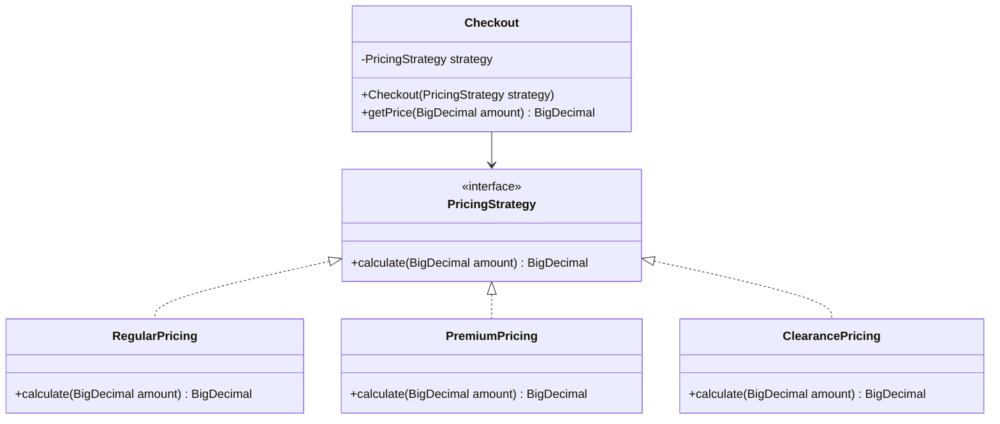
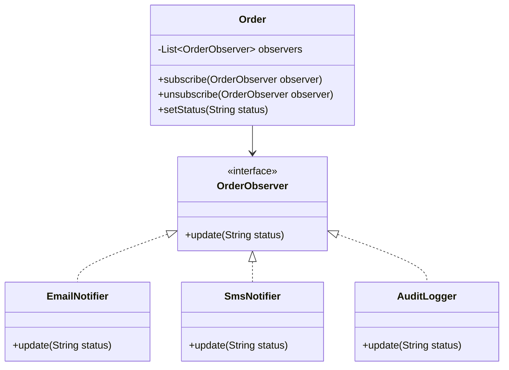
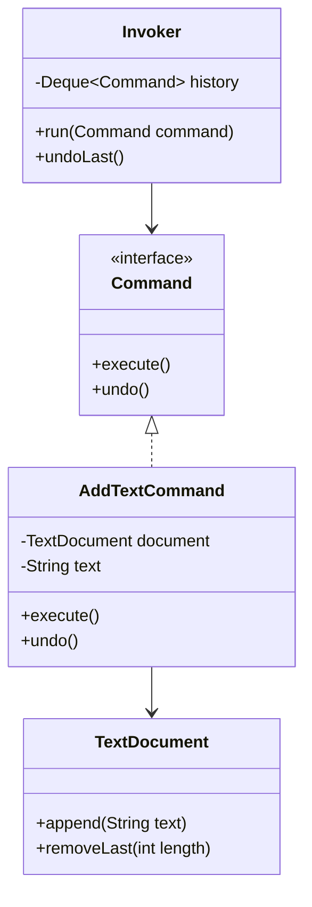
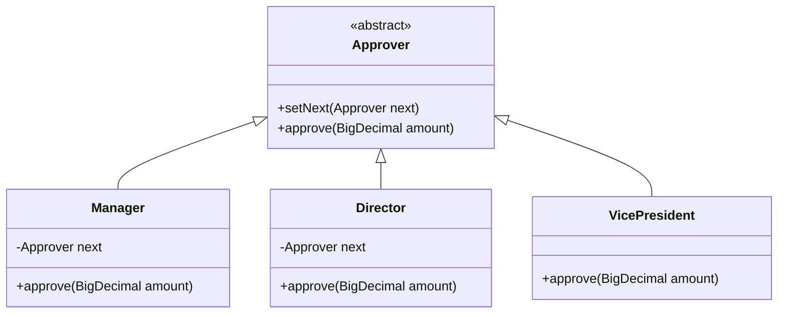

Behavioural patterns are about **who does what and when** — they distribute responsibility for a task across objects instead of hard-coding it into one giant method. This page covers the four you will actually write in an interview: Strategy (swap an algorithm), Observer (notify many listeners), Command (turn a request into an object), and Chain of Responsibility (pass a request along a pipeline until someone handles it).

## Strategy Pattern

**Problem:** a class needs one of several interchangeable algorithms — pricing rules, payment methods, compression formats — and today that logic lives in a growing `if/else` or `switch` inside the class itself. Every new variant means editing code that already works, which violates the Open/Closed Principle and risks regressions in unrelated branches.

Strategy pulls the algorithm out into its own interface. The context class holds a reference to that interface and delegates to it; it never knows which concrete implementation it is running.



```java
public interface PricingStrategy {
    BigDecimal calculate(BigDecimal amount);
}

public class PremiumPricing implements PricingStrategy {
    public BigDecimal calculate(BigDecimal amount) {
        return amount.multiply(BigDecimal.valueOf(0.9)); // 10% loyalty discount
    }
}

public class Checkout {
    private final PricingStrategy strategy;
    public Checkout(PricingStrategy strategy) { this.strategy = strategy; }
    public BigDecimal getPrice(BigDecimal amount) { return strategy.calculate(amount); }
}

// The strategy is injected, so it can be swapped without touching Checkout
var checkout = new Checkout(new PremiumPricing());
BigDecimal price = checkout.getPrice(BigDecimal.valueOf(100)); // 90
```

**Real-world usage:** payment gateways (`CardPayment`, `UpiPayment`, `WalletPayment` behind `PaymentStrategy`), file compression (`ZipStrategy` vs `GzipStrategy`), tax calculators that vary by region, `Comparator<T>` implementations passed into `Collections.sort`/`List.sort`, and `ThreadPoolExecutor`'s pluggable `RejectedExecutionHandler`. Anywhere you see "the algorithm varies but the caller shouldn't care which one", reach for Strategy.

> [!KEY]
> Strategy is **composition over inheritance**: instead of subclassing `Checkout` for every pricing rule, you inject the behaviour. The client (or a factory) decides which strategy to use.

### Strategy vs State

Both patterns look identical in UML — a context holding an interface reference — which is why interviewers ask you to tell them apart.

| | Strategy | State |
|---|---|---|
| Who picks the implementation | The client, explicitly | The object itself, based on its current state |
| Does the object change over time | No — one algorithm per call | Yes — transitions between states drive behaviour |
| Awareness of alternatives | Client knows all strategies | Context often doesn't know all states exist |
| Typical trigger phrase | "Which algorithm should run?" | "Behaviour depends on what happened before" |
| Example | Pricing rule chosen at checkout | Order: `New → Paid → Shipped → Delivered` |

State is covered in depth in Part 2 — the short version is: if the object needs to **transition itself** through a sequence and a giant `switch (status)` is spreading across every method, that's State, not Strategy.

## Observer Pattern

**Problem:** one object's state change needs to trigger side effects in several unrelated places — send an email, update a dashboard, log an audit entry — without that object knowing anything about email, dashboards or logging. Hard-wiring those calls creates a class that keeps growing new dependencies every time a new consumer is added.

Observer creates a one-to-many subscription: a subject keeps a list of observers and notifies all of them when something changes, without knowing what any observer actually does.



```java
public interface OrderObserver {
    void update(String status);
}

public class Order {
    private final List<OrderObserver> observers = new ArrayList<>();
    public void subscribe(OrderObserver observer) { observers.add(observer); }
    public void unsubscribe(OrderObserver observer) { observers.remove(observer); }

    public void setStatus(String status) {
        for (OrderObserver observer : observers)
            observer.update(status); // subject has no idea what each observer does
    }
}
```

**Real-world usage:** domain events (`OrderPlaced`, `PaymentFailed`) fanning out to handlers, `java.beans.PropertyChangeListener`/`PropertyChangeSupport` binding a UI to a model, Spring's `ApplicationEvent`/`@EventListener`, reactive streams (`java.util.concurrent.Flow`, Project Reactor, RxJava), and pub-sub message brokers at a larger scale (Kafka topics are Observer distributed across processes).

> [!WARNING]
> The classic bug: a long-lived subject (say, a static registry or a cache) holds a **strong reference** to every listener. If a short-lived object (a UI component, a request-scoped service) registers and never removes itself, the subject keeps it alive forever — a **memory leak** the garbage collector cannot fix, because a strong reference from subject to listener is real and reachable. In Java, prefer an explicit `removeListener` call (ideally in a cleanup/`close()` method), a `WeakReference`-based listener list (or `WeakHashMap`), or a `CopyOnWriteArrayList` with disciplined deregistration to guarantee cleanup.

## Command Pattern

**Problem:** you need to treat a request as a first-class object — queue it, log it, retry it, undo it, or hand it to something that has no idea what the request actually does. If the request is just a method call, none of that is possible; you can only invoke it immediately and once.

Command wraps a request (receiver + parameters + action) behind a single `execute()` method. The invoker holds and triggers commands without knowing what they do; storing executed commands on a stack gives you undo for free.



```java
public interface Command {
    void execute();
    void undo();
}

public class AddTextCommand implements Command {
    private final TextDocument document;
    private final String text;
    public AddTextCommand(TextDocument document, String text) {
        this.document = document;
        this.text = text;
    }
    public void execute() { document.append(text); }
    public void undo() { document.removeLast(text.length()); }
}

public class Invoker {
    private final Deque<Command> history = new ArrayDeque<>();
    public void run(Command command) {
        command.execute();
        history.push(command); // remembering commands is what makes undo possible
    }
    public void undoLast() {
        if (!history.isEmpty()) history.pop().undo();
    }
}
```

> [!TIP]
> Mention this trade-off out loud: Command gives you undo/redo, but only if every command's side effects are **reversible or re-derivable**. For an action like "send email", `undo()` can't literally un-send it — you model it as a compensating action instead. Naming that limitation reads as senior.

**Real-world usage:** undo/redo stacks in editors, GUI button click handlers bound to command objects, `Runnable`/`Callable` tasks submitted to an `ExecutorService`, job queues (a `Command` serialised onto a message queue and executed by a worker), macro recording (replaying a list of commands), and Swing's `Action`.

## Chain of Responsibility Pattern

**Problem:** a request might need to pass through several potential handlers, but the sender shouldn't need to know which one will actually process it, how many there are, or in what order — and that list changes over time (new middleware, new approval tiers).

Each handler gets a chance to process the request; if it can't (or after doing partial work), it forwards to the next handler in the chain.



```java
public abstract class Approver {
    protected Approver next;
    public void setNext(Approver next) { this.next = next; }
    public abstract void approve(BigDecimal amount);
}

public class Manager extends Approver {
    @Override
    public void approve(BigDecimal amount) {
        if (amount.compareTo(BigDecimal.valueOf(1000)) <= 0) System.out.println("Manager approved");
        else if (next != null) next.approve(amount); // pass along; next is null-checked, not assumed
    }
}

public class Director extends Approver {
    @Override
    public void approve(BigDecimal amount) {
        if (amount.compareTo(BigDecimal.valueOf(10_000)) <= 0) System.out.println("Director approved");
        else if (next != null) next.approve(amount);
    }
}
```

> [!DANGER]
> If no handler in the chain matches and there is no terminal handler, the request silently falls off the end and nothing happens — a bug that looks like "it just does nothing" in production. Always give the chain a final handler that either handles everything or throws/logs explicitly; never let `next` be `null` at the end without a default case.

Chain order is part of the behaviour, not an implementation detail — put validation after mutation or authorization after the sensitive action and the same request now means something different.

**Real-world usage:** the Servlet `FilterChain` (each `Filter` calling `chain.doFilter(...)`), the Spring Security filter chain, approval workflows (manager → director → VP), validation pipelines, and `java.util.logging` handlers that each decide whether to act or delegate onward.

## Choosing among the four

| Pattern | Solves | Number of handlers/listeners | Trigger phrase |
|---|---|---|---|
| Strategy | Swappable algorithm for one call | Exactly one, chosen explicitly | "Which algorithm should run?" |
| Observer | Broadcast a change to many | Many, all notified | "Tell everyone when this changes" |
| Command | Turn a request into an object | One receiver, decoupled from sender | "Queue it, log it, undo it" |
| Chain of Responsibility | Route a request through candidates | One (or a few) out of many, sequentially | "Pass it on until someone handles it" |

## Cheat sheet

- **Strategy** = client chooses the algorithm; **State** = object transitions itself and behaviour follows.
- Strategy follows Open/Closed: add a new strategy class, never edit the context.
- Observer decouples subject from observer — the subject never knows what an observer does with the notification.
- Always provide an unsubscribe path for Observer; a leaked subscription is a leaked object.
- Command turns "do this now" into an object you can queue, log, retry or undo.
- Undo via Command requires either a reversible action or a compensating action — say which one applies.
- Chain of Responsibility decouples sender from receiver; handlers can be added, removed or reordered without touching the client.
- The Servlet/Spring Security `FilterChain` is Chain of Responsibility; `PropertyChangeListener`/Spring `ApplicationEvent`/reactive `Flow.Publisher` is Observer.
- All four patterns exist to avoid one thing: a giant `if/switch` that keeps growing every time a requirement changes.

## Common mistakes

| Mistake | Fix |
|---|---|
| Confusing Strategy and State because the UML looks identical | Ask "does the object drive its own transitions?" — if yes, it's State |
| Subject holding strong references to observers forever | Provide `removeListener` (in a `close()`/cleanup path), or use `WeakReference`s |
| Command objects that also need three constructor arguments for context they don't own | Pass only the receiver and parameters the command needs — keep it thin |
| Chain of Responsibility with no terminal/default handler | Add an explicit last handler or throw on falling off the chain |
| Using Strategy when there is really only ever one implementation | Don't introduce the interface until a second variant is likely |
| Observer notifying in a random or unspecified order when order matters | Document ordering, or use a priority list if consumers depend on sequence |

## Summary

Strategy, Observer, Command and Chain of Responsibility all exist to stop behaviour from being hard-coded into one class's `if/switch` statements. Strategy swaps an algorithm the client picks; Observer broadcasts a change to everyone subscribed; Command turns a request into a reusable, undoable, queueable object; and Chain of Responsibility routes a request through a sequence of candidate handlers. Recognise them by their trigger phrase, know the memory-leak risk that comes with Observer, and be ready to name the real JDK or Spring feature that already implements each one.

## Top Interview Questions

### Q1. What problem does the Strategy pattern solve, and how do you recognise the need for it?

Strategy solves the problem of a class needing one of several interchangeable algorithms without hard-coding all of them into `if/else` or `switch` branches inside itself. You recognise the need when you see a method that branches on a "type" or "mode" flag to decide *how* to do something — calculate a price, sort a list, compress a file — and that branch keeps growing every time a new variant is added. The fix is to extract each branch into a class implementing a shared interface, and have the context hold a reference to that interface, injected by the caller or a factory. This satisfies the Open/Closed Principle: new algorithms are new classes, not edits to existing ones.

### Q2. How do you tell Strategy and State apart when the class diagrams look identical?

Both have a context class holding a reference to an interface with multiple implementations, so the static structure is the same. The difference is behavioural: in Strategy, the **client** picks which implementation to use, per call, and the object doesn't change over time. In State, the **object itself** transitions between states as a result of its own operations — a `NewState` calls `order.setState(new PaidState())` internally. Ask "does something outside decide which implementation runs, or does the object drive itself through a sequence over time?" If it's the latter, it's State, and you'd expect a state machine diagram, not just a strategy swap, to describe it.

### Q3. What is the Observer pattern, and where have you seen it in a real codebase?

Observer defines a one-to-many dependency: a subject keeps a list of observers and calls a shared `update()` method on all of them when its state changes, without knowing what any observer does with that notification. I've seen it as a Swing `ActionListener` (a button click with multiple listeners), `PropertyChangeListener`/`PropertyChangeSupport` driving data binding, Spring's `ApplicationEvent`/`@EventListener` fanning `OrderPlaced` out to an email handler and an audit logger, and at a larger scale, a message broker topic where multiple consumers subscribe to the same event stream. The common thread is decoupling: the publisher never references concrete consumer types.

### Q4. What is the memory-leak risk with the Observer pattern, and how do you avoid it in Java?

If a long-lived subject holds references to observers in a list and an observer registers but is never explicitly removed, the subject keeps that observer reachable forever, even after the code that created it thinks it's done. Garbage collection can't help — the reference is real and reachable. This shows up as UI components or scoped services silently piling up in memory. The fix is to always pair `addListener` with `removeListener`, ideally in a `close()`/cleanup method, or use a `WeakReference`-based listener list (or a `WeakHashMap`) so the subject doesn't pin dead listeners, or explicit lifetime scoping in a DI container (Spring) so subscribers are cleaned up with their scope.

### Q5. When would you use the Command pattern instead of just calling a method directly?

Use Command when the *request itself* needs to be a first-class object: you need to queue it for later execution, log it for audit, retry it on failure, pass it to something generic that doesn't know what it does, or support undo/redo. A direct method call can only be invoked immediately, once, by a caller who knows exactly what it does. Wrapping the call in a `Command` object with an `execute()` (and often `undo()`) method lets an invoker store, replay or reverse it without any knowledge of the receiver. Typical examples: GUI button-to-action bindings, `Runnable`/`Callable` background jobs submitted to an `ExecutorService`, and text editor undo stacks.

### Q6. How does the Command pattern implement undo, and what's a limitation of that approach?

Each executed command is pushed onto a history stack as it runs; `undoLast()` pops the most recent command and calls its `undo()` method, which reverses exactly the side effect `execute()` performed — for example, appending text is undone by removing the same number of characters. The limitation is that not every action is reversible: sending an email or charging a card can't be literally undone. For those, `undo()` has to perform a *compensating* action (a refund, a cancellation notice) rather than a true reversal, and you have to design the command to capture enough state upfront (amount charged, message ID) to make that compensation possible.

### Q7. What is Chain of Responsibility and how is it different from Observer?

Chain of Responsibility passes a request along a sequence of handler objects; each handler decides whether to fully or partially process the request or forward it to the next handler, and the sender doesn't know which handler (if any) will ultimately act. Observer, by contrast, notifies **every** subscribed observer of an event — it's a broadcast, not a routing decision. In Chain of Responsibility, typically one handler (or a small subset) ends up acting, and the chain can short-circuit once a handler fully handles the request; in Observer, all observers run, usually independently of each other's outcome. Approval workflows and middleware pipelines are Chain of Responsibility; event notification fan-out is Observer.

### Q8. Where does the Servlet/Spring filter chain use Chain of Responsibility, and what would you watch out for when building your own chain?

The Servlet filter chain (and Spring Security's filter chain) is a textbook Chain of Responsibility: each `Filter` receives the request, response, and a `FilterChain`, and decides whether to short-circuit (write a response and return) or call `chain.doFilter(...)` to forward to the next component. Building your own chain, the main risks are: forgetting a terminal handler, so a request that nothing matches silently does nothing; getting the chain order wrong when handlers have implicit ordering dependencies (authentication before authorization, logging around everything); and letting handlers mutate shared state in ways that make behaviour depend on call order in a way that's hard to reason about or test in isolation.

### Q9. Your team's pricing logic is a 200-line switch statement on customer tier that's grown unreadable. How would you refactor it, and what would you say to justify Strategy over just splitting the switch into smaller methods?

I'd extract each tier's calculation into a class implementing `PricingStrategy` with a single `calculate(BigDecimal amount)` method, and have the checkout class take a `PricingStrategy` via constructor injection, resolved by a small factory or a map keyed on tier. Splitting the switch into smaller private methods only makes the *reading* easier — every new tier still means editing the same file and risking a regression in an unrelated branch, and you can't unit test one tier's pricing rule in isolation without invoking the whole switch. Strategy makes each rule an independently testable, independently deployable unit, and satisfies Open/Closed: adding "enterprise tier" pricing is a new file, not a diff to existing, working code.

### Q10. In production, you notice a Java Swing desktop application's memory grows steadily every time the user navigates between screens. How would you investigate and what pattern-related cause would you suspect?

I'd take a heap snapshot before and after several navigation cycles and diff retained object counts — if view/panel instances from screens the user has "left" are still alive, I'd suspect an Observer leak: a long-lived object (often a singleton service or a static listener registry) that the view registered with via `addListener`/`addPropertyChangeListener` without a matching `removeListener` on disposal. Each navigation creates a new view that registers again, and none of the old ones are ever collected because the singleton still references them through its listener list. The fix is ensuring every subscribing view removes its listeners in its cleanup path, or switching to a weak-reference-based listener mechanism (`WeakReference`/`WeakHashMap`) designed for this.

### Q11. How would you design a task queue where workers pick up and execute jobs submitted by different parts of the system, and which patterns apply?

I'd model each submitted unit of work as a `Command` object (or a plain `Runnable`/`Callable`) — `execute()`/`call()` runs the job, and it carries whatever parameters/receiver reference it needs, serialisable if jobs cross a process boundary onto a real queue (e.g. a message broker). A generic `Worker`/invoker (or an `ExecutorService`) dequeues commands and calls `execute()` without knowing what kind of job it is, which is exactly the decoupling Command provides. If jobs need to be validated or routed to different handlers based on type before execution (e.g. "billing jobs go through fraud check then execute"), I'd layer Chain of Responsibility on top of that: each stage decides whether to act, transform, or forward the command onward.

### Q12. Can you combine Strategy and Chain of Responsibility in the same design? Give a concrete example.

Yes — they solve different problems and often sit together. Take a payment processing pipeline: Chain of Responsibility handles the *sequence of validation and enrichment steps* a transaction passes through (fraud check → currency conversion → fee calculation → settlement), where each handler decides whether to proceed or reject. Inside the fee calculation handler, Strategy picks *which fee algorithm* to apply based on the merchant's plan (`FlatFeeStrategy`, `PercentageFeeStrategy`, `TieredFeeStrategy`). The chain governs "what sequence of steps does this request go through", while the strategy inside one of those steps governs "which algorithm computes this step's result" — they're orthogonal concerns operating at different levels of the same pipeline.
