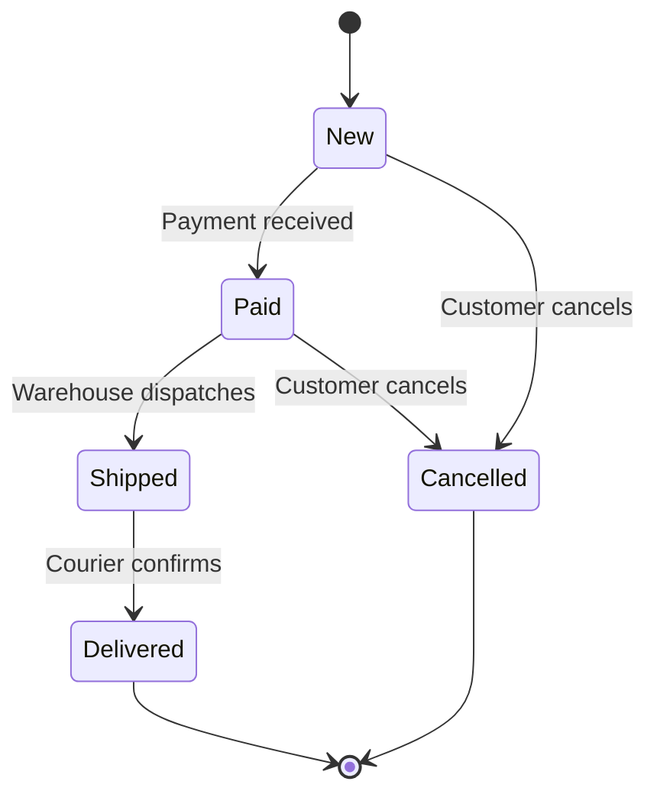
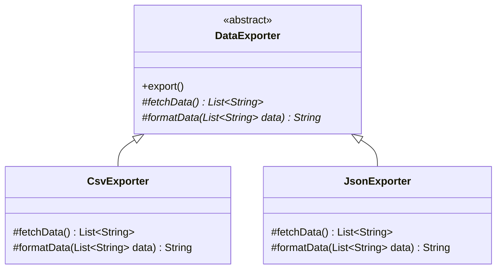
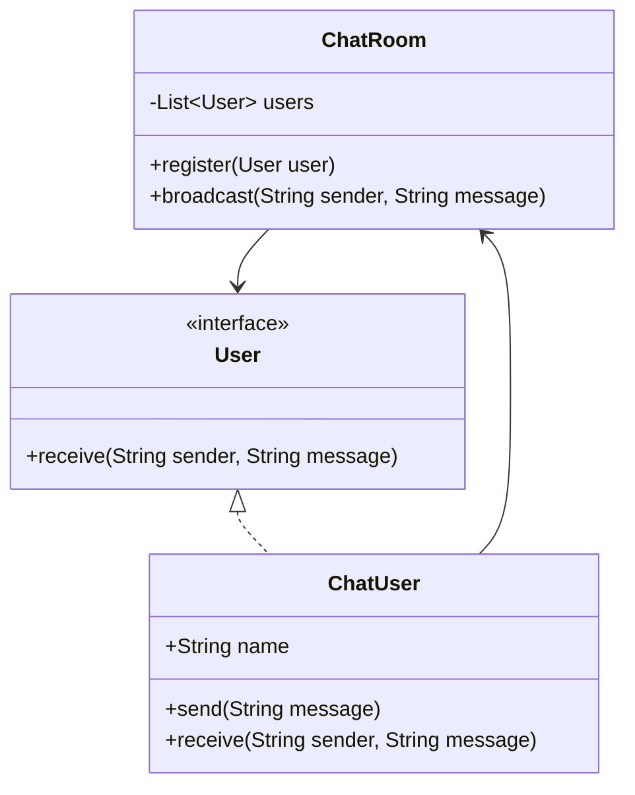

Part 1 covered Strategy, Observer, Command and Chain of Responsibility. This page finishes the behavioural family: State (an object that transitions through a lifecycle), Template Method (a fixed algorithm skeleton with pluggable steps), Iterator (uniform traversal), Mediator (centralised coordination between objects), Memento (snapshot and restore), and a brief look at Visitor and Interpreter, which show up far less often but are worth recognising by name.

## State Pattern

**Problem:** an object's allowed behaviour depends entirely on what phase of its lifecycle it's in — an order can be shipped only if it's paid, a vending machine can dispense only after payment — and that logic is currently a `switch (status)` block duplicated across every method that touches the object. Every new status means editing several methods, and it's easy to miss one.

State gives each phase its own class implementing a shared interface; the object holds a reference to its *current* state object and delegates behaviour to it. Transitions happen by swapping which state object is currently held — often the state itself decides the next state.



```java
public interface OrderState {
    void process(Order order);
}

public class NewState implements OrderState {
    public void process(Order order) {
        System.out.println("Payment captured");
        order.setState(new PaidState()); // the state decides the next state
    }
}

public class PaidState implements OrderState {
    public void process(Order order) {
        System.out.println("Order shipped");
        order.setState(new ShippedState());
    }
}

public class ShippedState implements OrderState {
    public void process(Order order) {
        System.out.println("Order delivered");
        order.setState(new DeliveredState());
    }
}

public class DeliveredState implements OrderState {
    public void process(Order order) { System.out.println("Already delivered, nothing to do"); }
}

public class Order {
    private OrderState state = new NewState();
    public void setState(OrderState state) { this.state = state; }
    public void process() { state.process(this); }
}
```

Compare this to the alternative every candidate reaches for first:

```java
// Before: every method repeats the same switch, and it's easy to forget a branch
public void process() {
    switch (status) {
        case "New" -> status = "Paid";
        case "Paid" -> status = "Shipped";
        case "Shipped" -> System.out.println("Already shipped");
    }
}
```

The `switch` version puts all lifecycle knowledge in one method that keeps growing; the State version puts each phase's rules in its own class, so adding "Refunded" is a new file, not an edit to `process`, `cancel`, `ship` and every other method that happened to check `status`.

> [!KEY]
> State removes a giant `switch` by giving each branch its own class. The tell in an interview: "the object's behaviour changes as a direct result of what happened to it before" — that's a lifecycle, and lifecycles want State.

A useful mental model: State is an object-oriented finite state machine — each state owns the rules for the current phase and the legal transition to the next one.

**Real-world usage:** order/shipment lifecycles, vending machines (`Idle → CoinInserted → Dispensing`), traffic lights, TCP connection states, media players (`Playing → Paused → Stopped`), and workflow/document approval states.

### Template Method vs Strategy

Template Method fixes the *overall algorithm* in a base class and lets subclasses override specific steps; Strategy lets you swap the *entire algorithm* via composition.



```java
public abstract class DataExporter {
    // The skeleton is fixed: fetch, then format, then write. Subclasses fill in the steps.
    public final void export() {
        List<String> data = fetchData();
        String formatted = formatData(data);
        System.out.println(formatted);
    }
    protected abstract List<String> fetchData();
    protected abstract String formatData(List<String> data);
}

public class CsvExporter extends DataExporter {
    protected List<String> fetchData() { return List.of("a", "b"); }
    protected String formatData(List<String> data) { return String.join(",", data); }
}
```

| | Template Method | Strategy |
|---|---|---|
| Mechanism | Inheritance — override protected steps | Composition — inject an interface |
| Who controls the overall flow | The base class | The client, via what it injects |
| Flexibility | Fixed skeleton, varying steps | Entire algorithm swappable, even at runtime |
| Risk | Deep inheritance hierarchies, fragile base class | Extra interface + wiring for a single-use case |
| Example | Export pipeline: fetch → format → write | Pricing rule chosen at checkout |

> [!TIP]
> If asked "why not just use Strategy everywhere", the answer is: Template Method is the right call when most of the algorithm really is shared and only one or two steps vary — inheritance communicates "this is a variant of the same process". Strategy is right when the whole algorithm is genuinely interchangeable and you want to compose it at runtime, possibly changing it per call.

## Iterator Pattern

**Problem:** code that consumes a collection shouldn't need to know whether it's backed by an array, a linked list, or a tree — and it definitely shouldn't need its own traversal logic duplicated everywhere a collection is consumed.

Iterator provides a uniform interface (`hasNext()`/`next()`) for walking any collection without exposing its internal structure. In Java, this is built in: `Iterable<T>`/`Iterator<T>` and the enhanced `for` loop are the language's native Iterator implementation.

```java
public class OrderHistory implements Iterable<Order> {
    private final List<Order> orders = new ArrayList<>();
    public void add(Order order) { orders.add(order); }

    // returns an iterator over orders, newest first — internal storage stays hidden
    public Iterator<Order> iterator() {
        return orders.stream()
                     .sorted(Comparator.comparing(Order::getPlacedAt).reversed())
                     .iterator();
    }
}

// Consumer never knows the internal storage is a List<Order>
for (Order order : orderHistory) System.out.println(order.getId());
```

**Real-world usage:** every enhanced `for` loop in Java, Stream pipelines' lazy evaluation, JDBC `ResultSet` cursors, the fail-fast iterators that throw `ConcurrentModificationException` when a collection is structurally modified mid-traversal, and paginated API clients that hide "fetch next page" behind `hasNext()`/`next()`.

## Mediator Pattern

**Problem:** a set of objects need to coordinate — a chat room's participants, a set of UI widgets that enable/disable each other — but wiring every object directly to every other object creates an `O(n²)` web of references that's impossible to change safely.

Mediator introduces a single object that all participants talk to instead of each other; participants only know the mediator, not their peers.



```java
public class ChatRoom {
    private final List<ChatUser> users = new ArrayList<>();
    public void register(ChatUser user) { users.add(user); }

    public void broadcast(String sender, String message) {
        for (ChatUser user : users)
            if (!user.getName().equals(sender))
                user.receive(sender, message); // users never reference each other directly
    }
}

public class ChatUser {
    private final String name;
    private final ChatRoom room;
    public ChatUser(String name, ChatRoom room) {
        this.name = name;
        this.room = room;
        room.register(this);
    }
    public String getName() { return name; }
    public void send(String message) { room.broadcast(name, message); }
    public void receive(String sender, String message) {
        System.out.println(name + " got from " + sender + ": " + message);
    }
}
```

**Real-world usage:** chat rooms and multiplayer game lobbies, UI dialogs where enabling one control needs to disable/update others (a mediator dialog controller instead of controls wired directly to each other), and air traffic control as the textbook analogy — planes talk to the tower, never to each other directly.

> [!WARNING]
> The mediator itself can become a god object that knows too much about everyone it coordinates. Keep it focused on *coordination logic only* — routing, sequencing, enabling/disabling — and push actual business logic back into the participants.

## Memento Pattern

**Problem:** you need to save an object's internal state and restore it later (undo, checkpoints, rollback) without breaking encapsulation — the object holding the history shouldn't need access to private fields it has no business touching directly.

The object being saved creates an opaque snapshot (the memento) of its own state; a separate caretaker stores mementos but cannot read or modify their contents.

```java
public class Editor {
    private String content = "";
    public void type(String text) { content += text; }
    public Memento save() { return new Memento(content); }
    public void restore(Memento memento) { content = memento.content; }
    public String getContent() { return content; }

    // opaque snapshot — only Editor can read or construct it
    public static final class Memento {
        private final String content;
        private Memento(String content) { this.content = content; }
    }
}

public class History {
    private final Deque<Editor.Memento> snapshots = new ArrayDeque<>();
    public void push(Editor.Memento memento) { snapshots.push(memento); }
    public Editor.Memento pop() { return snapshots.pop(); } // caretaker never inspects the contents
}
```

**Real-world usage:** undo stacks in editors (often paired with Command, which triggers the save/restore), game checkpoints/save files, and database/transaction snapshots used for rollback. Memento answers "how do I capture state" while Command answers "how do I capture the action that caused the change" — many undo systems use both together.

## Visitor and Interpreter (briefly)

**Visitor** lets you add a new *operation* across a family of related classes without modifying those classes — each element accepts a visitor and calls back the visitor method matching its own type (`void accept(Visitor v) { v.visitInvoice(this); }`). It's the go-to answer for "add a new report/export format over an existing class hierarchy without touching those classes", at the cost of having to update every visitor whenever a new element type is added — it inverts the usual extensibility trade-off of Strategy/Decorator.

**Interpreter** models a simple grammar as a class hierarchy where each class knows how to evaluate itself — useful for small rule engines, search query parsers, or expression evaluators. It's rarely worth building by hand for anything beyond a toy grammar; in production you'd usually reach for a parser library or a regex/rules engine instead, but naming the pattern shows you recognise "this is basically an AST being walked."

## Comparison table

| Pattern | Core idea | Structural change | Real JDK example |
|---|---|---|---|
| State | Behaviour follows internal lifecycle | Object swaps its current state reference | Order/shipment status machine |
| Template Method | Fixed skeleton, pluggable steps | Inheritance, override protected methods | `InputStream` subclasses, `AbstractList`, Spring `JdbcTemplate` |
| Iterator | Uniform traversal, hidden internals | Implements `Iterable<T>`/`Iterator<T>` | enhanced `for`, Streams |
| Mediator | Centralised coordination | Participants reference only the mediator | Chat room, UI dialog controller |
| Memento | Snapshot and restore state | Opaque state object plus a caretaker | Editor undo, DB rollback |
| Visitor | Add operations without touching elements | Double dispatch via `accept`/`visit` | AST/expression tree evaluators |

## Cheat sheet

- State removes a giant `switch (status)` by giving each lifecycle phase its own class that can trigger the next transition.
- Template Method fixes the algorithm shape in a base class; only the varying steps are overridden — inheritance, not composition.
- Template Method vs Strategy: inheritance with a fixed skeleton vs composition with a fully swappable algorithm.
- Iterator is built into Java as `Iterable<T>`/the enhanced `for` loop; you rarely hand-roll it, though implementing `Iterator<T>` for a custom traversal is straightforward.
- Mediator turns an `O(n²)` web of direct references into a hub-and-spoke: everyone talks to one coordinator.
- Watch for the mediator becoming a god object — keep it to coordination, not business logic.
- Memento preserves encapsulation: only the originator can read/construct its own memento; the caretaker just stores it.
- Memento (snapshot) and Command (action + undo) are often used together for a full undo system.
- Visitor adds new operations without touching element classes, but adding a new element type means touching every visitor.
- Interpreter models a grammar as a walkable class tree — recognise it, but reach for a parser library in real production code.

## Common mistakes

| Mistake | Fix |
|---|---|
| Modelling a lifecycle as a `switch` instead of State | Extract each phase into a class implementing a shared interface |
| Confusing Template Method with Strategy | Ask "is this inheritance with fixed structure, or composition with a swappable whole" |
| Letting a Mediator absorb business logic from every participant | Keep the mediator to routing/coordination only |
| Caretaker reading or mutating a Memento's internal fields | Make the memento's state accessible only to its originator (a private constructor on a nested class) |
| Reaching for Visitor when elements change often but operations don't | Prefer polymorphism/Strategy instead — Visitor inverts that trade-off |
| Hand-writing an Interpreter for anything beyond a tiny grammar | Use an existing parser/rules engine library |

## Summary

State, Template Method, Iterator, Mediator and Memento each remove a different kind of tangled logic: State replaces a lifecycle `switch`, Template Method shares an algorithm's shape while varying its steps, Iterator hides collection internals behind a uniform walk, Mediator replaces an `O(n²)` web of references with a single coordinator, and Memento captures and restores state without breaking encapsulation. Visitor and Interpreter are rarer but worth naming when a hierarchy needs new operations or a small grammar needs evaluating. Together with Part 1's four patterns, this covers essentially every behavioural pattern an interviewer will expect you to recognise on sight.

## Top Interview Questions

### Q1. What problem does the State pattern solve, and what's the tell that you need it?

State solves the problem of an object's behaviour depending entirely on its current lifecycle phase, where that logic would otherwise live as a `switch` on a status field duplicated across many methods. The tell is a class where several methods each start with "if status is X, do this; if Y, do that" and adding a new status means touching every one of those methods, with high risk of missing a spot. The fix is giving each status its own class implementing a shared interface, held by the context as its "current state", with transitions performed by swapping which state object the context is delegating to — often the state class itself decides and sets the next state after acting.

### Q2. How does the State pattern remove a large switch statement, concretely?

Instead of one method with a `switch (status)` block that both checks the current status and encodes what happens next, each status becomes a class implementing a common interface, e.g. `OrderState.process(Order order)`. The context (`Order`) holds a reference to its current `OrderState` and simply calls `state.process(this)`, delegating entirely. Each state class contains only the logic relevant to that one phase, including calling `order.setState(new NextState())` to transition. Adding a new status is now a new class, with zero changes to existing state classes or the context's dispatch code — compare that to adding a new `case` to a switch that already spans several unrelated methods.

### Q3. What's the difference between Template Method and Strategy?

Both let you vary part of an algorithm, but the mechanism and flexibility differ. Template Method uses **inheritance**: a base class defines a fixed algorithm skeleton (e.g. fetch, then format, then write) and marks specific steps as abstract for subclasses to override; the overall sequence is locked in the base class. Strategy uses **composition**: the entire algorithm is behind one interface, injected into the context, and can be swapped completely, even at runtime, without any inheritance relationship. Use Template Method when most of the process is genuinely shared and only a couple of steps vary; use Strategy when the whole algorithm needs to be interchangeable.

### Q4. Why is Iterator mostly invisible in modern Java code?

Because the language builds it in: `Iterable<T>` and `Iterator<T>` are the Iterator pattern, and the enhanced `for` loop is syntactic sugar over calling `iterator()`, then `hasNext()`/`next()` in a loop. You rarely hand-write an `Iterator` unless you're exposing a custom traversal order over your own data structure. Streams are layered on top: their intermediate operators (`filter`, `map`) are lazy and don't do any work until a terminal operation pulls elements through. The collection framework's iterators are also **fail-fast** — they throw `ConcurrentModificationException` if the backing collection is structurally modified during iteration — which is worth naming as a real-world consequence of how the pattern is implemented. Recognising all this shows you know the pattern isn't just academic: it's the reason the enhanced `for` loop works on arrays, lists, maps and custom collections identically.

### Q5. What is the Mediator pattern, and why is it useful for something like a chat room?

Mediator introduces a single coordinating object that all participants communicate through, instead of participants referencing each other directly. In a chat room, if every user held a direct reference to every other user to send messages, adding or removing a user would require updating every other user's reference list — an `O(n²)` web that gets unmanageable fast. With a `ChatRoom` mediator, each `ChatUser` only knows the room; sending a message calls `room.broadcast(...)`, and the room decides who receives it. Users can join or leave by registering/unregistering with the room alone, and the room can add features like message history or moderation without touching any user class.

### Q6. What's a risk of the Mediator pattern, and how do you avoid it?

The mediator can absorb more and more responsibility over time until it becomes a god object that knows the business logic of everything it coordinates — validation rules, formatting, side effects — leaving participants as thin, anemic shells. This defeats the point, since you've just moved the tangle from an `O(n²)` web into one enormous class. The fix is discipline about scope: the mediator should own *coordination* — who talks to whom, in what order, whether an action is currently allowed — while the actual business behaviour stays in the participant classes. If the mediator's method bodies start reading like domain logic rather than routing logic, that's the signal to push it back out.

### Q7. Explain the Memento pattern and how it preserves encapsulation.

Memento lets an object save a snapshot of its own internal state and restore it later, without exposing that state to whoever is storing the snapshots. The object being saved (the originator) creates the memento itself, so only it knows the memento's internal shape; a separate caretaker (e.g. a history stack) stores mementos opaquely — it can push and pop them but cannot read or modify their contents, typically enforced with a private constructor on a nested class so only the originator can construct or unpack one. This is different from just exposing a public getter/setter for all fields, which would let any caller inspect or corrupt internal state directly.

### Q8. How do Memento and Command work together to implement undo?

Command captures *what action was performed* — an object with an `execute()` (and often `undo()`) method — which works well when the action's effect can be reversed by an inverse operation (e.g. "add text" undone by "remove the same length of text"). Memento captures *what the state was* before or after an action, as an opaque snapshot, which works well when the state is complex enough that computing an inverse operation is impractical (e.g. a whole document). A common real design uses Command to know *when* to save/restore and *what triggered* the change, while Memento provides the actual before/after snapshot that gets restored — giving you both a clean undo history and full-fidelity state recovery.

### Q9. When would you reach for the Visitor pattern, and what's its trade-off?

Visitor is for adding a **new operation** across a family of related classes (an object structure like an AST, a document model, or a set of shape types) without modifying those classes — each element implements `accept(Visitor visitor)`, which calls back the matching `visit` method on the visitor for that element's concrete type (double dispatch). This is the right call when the set of element types is stable but you keep needing new operations (export to PDF, export to HTML, compute totals). The trade-off is the reverse of Strategy: adding a *new element type* means updating every existing visitor implementation, whereas adding a new *operation* means writing one new visitor class and touching nothing else.

### Q10. Your team keeps writing switch statements for "if the shipment is Pending do X, if InTransit do Y, if Delivered do Z" across five different service classes. How would you fix this, and how would you verify the fix actually helped?

I'd introduce a `ShipmentState` interface with the operations that vary by status (e.g. `advance(Shipment shipment)`, `canCancel()`), implement one class per status, and have `Shipment` hold its current state object, delegating to it instead of branching internally. I'd verify the fix by checking that adding a new status (say, "ReturnedToSender") requires writing exactly one new class and zero edits to the five existing service classes or the existing state classes — if it still requires touching old code, the extraction missed a branch. I'd also add unit tests per state class in isolation, which is now possible without spinning up the whole shipment object and every other status's logic.

### Q11. How would you design an undo/redo feature for a drawing application with many shape types (circles, rectangles, lines)?

I'd combine Command and Memento: every user action (draw, move, resize, delete a shape) is wrapped in a `Command` with `execute()`/`undo()`, pushed onto a history stack when executed, giving me undo/redo ordering and the ability to log or replay actions. For actions where computing a clean inverse is hard — a freehand drag that changes many properties at once — the command's `undo()` restores a `ShapeMemento` snapshot taken before the action rather than trying to compute an inverse transform. If I later need to add a "flip horizontally" operation across all shape types without touching each shape class, I'd add it via Visitor rather than adding a new method to every shape class.

### Q12. A UI dialog has 15 controls that need to enable/disable each other based on selections (classic "wizard" screen). What pattern would you apply and why not just wire the controls to each other directly?

I'd apply Mediator: introduce a `DialogController` that all 15 controls report changes to and take enable/disable instructions from, instead of each control holding references to the others it affects. Wiring controls directly to each other creates up to 15×14 potential relationships, and any change to one control's behaviour risks breaking assumptions in several others that reference it — a maintenance and testing nightmare, and nearly impossible to unit test one control's rule in isolation. With a mediator, each control only needs to know the controller; the controller centralises "if X is selected, enable Y and disable Z", which is both readable in one place and independently testable without instantiating the whole UI.
