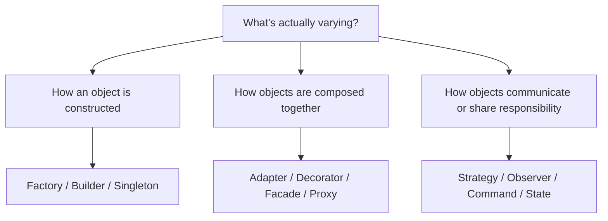
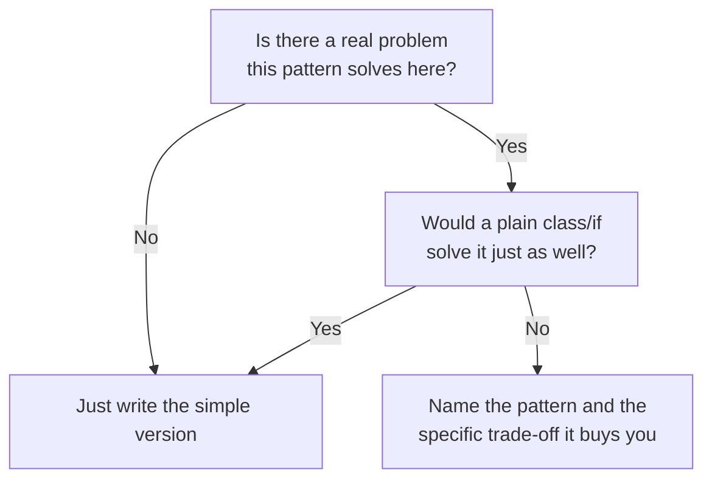

You will not have time to reason a pattern up from first principles in the middle of a round — you need instant recall of what each pattern is *for*, then a sharp sentence justifying it. This page is a dense reference: all 23 Gang-of-Four patterns with a one-line intent, a real JDK/production example, and a "use when" trigger, followed by a symptom-to-pattern lookup you can scan under pressure.

## Creational patterns

| Pattern | Intent in one line | Real JDK/production example | Use when |
|---|---|---|---|
| Factory Method | Delegate object creation to a method subclasses can override | `Calendar.getInstance()`, `NumberFormat.getInstance()` | The exact type to construct depends on a condition or subclass |
| Abstract Factory | Produce families of related objects without naming concrete types | `DocumentBuilderFactory` (JAXP), JDBC `DataSource` (MySQL/Postgres families) | You need a whole family of related objects to stay consistent (all-MySQL or all-Postgres) |
| Builder | Construct a complex object step by step, same process, different representations | `StringBuilder`, `Stream.Builder`, `HttpRequest.newBuilder()` | Construction has many optional parameters or must happen in steps |
| Prototype | Create new objects by cloning an existing instance | `Cloneable`/`Object.clone()`, or (preferred) a copy constructor | Creating an object from scratch is expensive; copying a template is cheap |
| Singleton | Ensure exactly one instance, globally accessible | `Runtime.getRuntime()`, enum singleton, Spring singleton-scoped bean | Exactly one instance must coordinate shared state (config, connection pool) |

## Structural patterns

| Pattern | Intent in one line | Real JDK/production example | Use when |
|---|---|---|---|
| Adapter | Convert one interface into another the client expects | `InputStreamReader`, `Arrays.asList`, wrapping a third-party SDK behind your own `PaymentGateway` | You must integrate a class whose interface you can't change |
| Bridge | Decouple an abstraction from its implementation so both vary independently | JDBC `Connection` abstraction over different database drivers | Both "what" and "how" need to vary independently without a class explosion |
| Composite | Treat individual objects and groups of objects uniformly through one interface | Swing's `Component` hierarchy (a `JPanel` contains `Component`s) | You have tree-shaped data (files/folders, UI, org charts) and want uniform operations |
| Decorator | Attach new behaviour to an object dynamically, without subclassing | `java.io` stream wrapping (`BufferedInputStream` around `FileInputStream`), `Collections.unmodifiableList` | You need to add/remove behaviour at runtime, and subclassing would explode combinatorially |
| Facade | Provide one simplified interface over a complex subsystem | `java.net.http.HttpClient` hiding sockets/DNS/TLS, Spring `JdbcTemplate`, a `CheckoutFacade` over five services | Clients shouldn't need to know a subsystem's internal complexity |
| Flyweight | Share common state across many objects to save memory | `String.intern()`, `Integer.valueOf` cache, glyph caching in a text renderer | Millions of similar objects share most of their data |
| Proxy | Control access to another object — lazy load, cache, authorise, log | JDK dynamic proxies (`java.lang.reflect.Proxy`), Hibernate lazy-loading proxies, Spring AOP | You need to add access control, caching or lazy init without changing the real object |

## Behavioural patterns

| Pattern | Intent in one line | Real JDK/production example | Use when |
|---|---|---|---|
| Strategy | Make an algorithm swappable behind a common interface | `Comparator<T>` passed to `Collections.sort`/`List.sort` | Multiple interchangeable algorithms for one task |
| Observer | Notify many dependents when one object's state changes | `PropertyChangeListener`, Spring `ApplicationEvent`, `Flow.Publisher` | One change needs to fan out to many independent listeners |
| Command | Encapsulate a request as an object | `Runnable`/`Callable` submitted to an `ExecutorService`, a background job queued for a worker | You need to queue, log, retry or undo an action |
| Chain of Responsibility | Pass a request along handlers until one handles it | Servlet `FilterChain`, Spring Security filter chain | The handler isn't known in advance and can change over time |
| State | Change behaviour as an object's internal state changes | Order/shipment status machine | Behaviour depends on a lifecycle, and a `switch` is spreading across methods |
| Template Method | Fix an algorithm's skeleton, let subclasses override specific steps | `InputStream`/`AbstractList` hooks, Spring `JdbcTemplate` calling overridable steps | Most of a process is shared; only a couple of steps vary, and inheritance is acceptable |
| Iterator | Provide uniform traversal without exposing internal structure | `Iterable<T>`/enhanced `for`, Streams | Consumers shouldn't care whether the collection is an array, list or tree |
| Mediator | Centralise coordination between objects that would otherwise reference each other directly | A chat room, a UI dialog controller | Many objects need to coordinate and direct references would form an unmanageable web |
| Memento | Capture and restore an object's state without breaking encapsulation | Editor undo snapshots, DB rollback | You need to save/restore state and the object shouldn't expose its internals to do it |
| Visitor | Add new operations across a class hierarchy without modifying it | AST/expression-tree evaluators | Element types are stable, but new operations keep being added |
| Interpreter | Represent a grammar as a class hierarchy that evaluates itself | Simple rule engines, expression parsers | A small, stable grammar needs to be evaluated — rare in production; usually a parser library instead |

> [!KEY]
> If you can only remember three, remember these: Strategy/State for behaviour that varies, Decorator/Adapter for wrapping without rewriting, and Observer/Command for decoupling a trigger from its effects. Most real designs are two or three of these composed together.

## Symptom to pattern lookup

Interviewers often describe a code smell rather than naming a pattern — recognising the symptom is the actual skill.

| Symptom | Likely pattern(s) | Why |
|---|---|---|
| Giant `switch`/`if` on a type field | Strategy, State, or plain polymorphism | Type-based branching usually means a missing abstraction over that type |
| Too many constructor parameters, many optional | Builder | Step-by-step, readable construction beats a 10-argument constructor |
| Need to add behaviour without subclassing every combination | Decorator | Wrapping composes; subclassing for every combination explodes |
| Incompatible interfaces between your code and a third party | Adapter | Translate at the boundary instead of rewriting either side |
| One change needs to notify many unrelated objects | Observer | Broadcast decouples the source from its listeners |
| Need undo, or need to queue/retry an action | Command (+ Memento for state snapshots) | Turning the action into an object makes it storable and reversible |
| A request should be handled by one of several candidates, unknown in advance | Chain of Responsibility | Each handler decides to act or forward, sender stays ignorant of which one wins |
| Object's allowed behaviour depends on what happened to it before | State | Lifecycle-driven behaviour belongs in per-phase classes, not a status flag |
| Complex subsystem, simple thing most callers actually want to do | Facade | Hide the complexity behind one clean entry point |
| Many nearly-identical objects eating memory | Flyweight | Share the common part, keep only the unique part per instance |
| Need to control/delay/guard access to an expensive or sensitive object | Proxy | Interpose without changing the real object or its callers |
| Tree-shaped data, want to treat leaf and branch the same way | Composite | Uniform interface over "one item" and "a group of items" |
| Many objects need to coordinate and reference-wiring is unmanageable | Mediator | Replace an `O(n²)` web with one coordinator |
| Need to add an operation across a stable set of types | Visitor | Double dispatch adds the operation without touching each type |
| Exactly one instance must exist and be globally reachable | Singleton | Shared, coordinated global state — use sparingly, it's also the most abused pattern here |

## Fast distinctions interviewers love

| Close call | Ask this question | Fast answer |
|---|---|---|
| Factory Method vs Builder | Are you deciding **which concrete product** to create, or **how to assemble** one complex object? | Factory Method chooses the product; Builder constructs one object step by step |
| Strategy vs State | Who chooses the behaviour — the caller, or the object's lifecycle? | Strategy = client picks the algorithm; State = the object transitions itself |
| Observer vs Chain of Responsibility | Should **everyone** react, or should the request move through **candidates** until one handles it? | Observer broadcasts to many listeners; Chain forwards sequentially until one handles it |
| Facade vs Adapter | Is the problem **complexity** or **incompatibility**? | Facade simplifies a usable subsystem; Adapter translates an unusable interface |
| Decorator vs inheritance | Do features need **runtime stacking**, or is the variation fixed and shallow? | Decorator composes optional behaviour; inheritance is fine for small fixed variation |

## Pattern abuse, and how to justify a choice without sounding like a textbook

Patterns exist to solve a **named recurring problem**, not to prove you know 23 names. The most common interview failure mode isn't forgetting a pattern — it's forcing one in where a plain class or a simple `if` would do, which reads as memorised trivia rather than judgement.

| Sign of pattern abuse | What to do instead |
|---|---|
| A `Factory` for a class with one constructor and no variation | Just call the constructor |
| A `Strategy` interface with exactly one implementation and no second on the roadmap | Use a plain method; extract the interface when a second case appears |
| `Decorator` wrapping added "because it's extensible" with no actual combination need | A single method with a parameter is simpler and just as flexible |
| Explaining a design by pattern name first, code second | Explain the *problem* first, then say "which is why I used X here" |
| Using a pattern's textbook class names (`Context`, `ConcreteStrategyA`) in real code | Name classes after the domain (`PremiumPricing`, not `ConcreteStrategyA`) |

> [!TIP]
> The sentence that reads as senior, every time: *"I considered [pattern], but the added indirection isn't earning its keep yet — I'll start simple and introduce it when a second [case] actually shows up."* Knowing when **not** to use a pattern is worth more in an interview than naming one correctly.

> [!WARNING]
> Never lead with the pattern name unprompted ("I'll use the Strategy pattern here") before you've stated the problem. It reads as pattern-matching from memory. Lead with the problem — "pricing needs to vary by tier and I don't want a growing switch" — and let the pattern be the answer, not the headline.

> [!DANGER]
> A classic abuse: introducing Singleton for "convenience" access to something that isn't actually a single shared resource (a random per-request helper class). This creates hidden global state, breaks testability (no seam to inject a fake), and often masks a missing dependency-injection wiring rather than a genuine one-instance requirement.

## Cheat sheet

- Creational = **how** objects get made (Factory, Abstract Factory, Builder, Prototype, Singleton).
- Structural = **how** objects are composed into larger structures (Adapter, Bridge, Composite, Decorator, Facade, Flyweight, Proxy).
- Behavioural = **how** objects communicate and share responsibility (Strategy, Observer, Command, Chain of Responsibility, State, Template Method, Iterator, Mediator, Memento, Visitor, Interpreter).
- Giant switch on type → Strategy/State/polymorphism. Too many constructor args → Builder. Add behaviour without subclassing → Decorator.
- Incompatible interfaces → Adapter. Notify many → Observer. Undo → Command + Memento.
- Name the problem before the pattern; the pattern is the answer, not the headline.
- If a pattern has exactly one implementation and no second on the roadmap, you probably don't need it yet.
- Singleton is both the most-used and most-abused pattern here — reach for DI-managed lifetime scopes over hand-rolled statics.
- Most real designs combine two or three patterns, not one grand pattern.
- Domain-name your classes (`PremiumPricing`), not textbook names (`ConcreteStrategyA`).

## Common mistakes

| Mistake | Fix |
|---|---|
| Naming a pattern before stating the problem it solves | Lead with the symptom, then the pattern as the answer |
| Adding an interface/pattern for a variation that doesn't exist yet | Wait for a second real case before abstracting |
| Treating Singleton as a convenient global accessor | Reserve it for genuine single-shared-resource cases; prefer DI lifetime scopes |
| Confusing categories (calling Strategy a structural pattern) | Creational = made, Structural = composed, Behavioural = communicate |
| Using textbook class names in real code | Name classes after the domain, not the pattern's role |
| Assuming every design problem has exactly one "correct" pattern | Many real designs combine two or three patterns together |

## Summary

Twenty-three patterns collapse into three questions: how is this object made (creational), how is it composed with others (structural), and how does it communicate or share responsibility (behavioural). In an interview, work backwards from the symptom you're shown — a giant switch, too many constructor parameters, incompatible interfaces, a need to notify many listeners — to the pattern that names it, then justify the choice by the trade-off it buys, not by reciting its definition. Knowing when a pattern *isn't* earning its keep is worth as much as knowing the 23 names.

## Top Interview Questions

### Q1. How do the three GoF categories differ, and why does the grouping matter?

Creational patterns (Factory Method, Abstract Factory, Builder, Prototype, Singleton) are about **how objects get constructed** — hiding `new` behind something more flexible. Structural patterns (Adapter, Bridge, Composite, Decorator, Facade, Flyweight, Proxy) are about **how objects are composed** into larger structures without becoming rigid or duplicated. Behavioural patterns (Strategy, Observer, Command, Chain of Responsibility, State, Template Method, Iterator, Mediator, Memento, Visitor, Interpreter) are about **how objects communicate and share responsibility** for a task. The grouping matters because it gives you a fast triage question in an interview: is the problem about *making* something, *composing* something, or *coordinating behaviour* between things — which immediately narrows 23 options down to 5–11.

### Q2. Give the one-line intent and a real JDK example for Builder, and say when you'd reach for it over a constructor with optional parameters.

Builder constructs a complex object step by step, allowing the same construction process to produce different representations — `StringBuilder` (building a string incrementally), `Stream.Builder`, and `HttpRequest.newBuilder()` (configuring method, headers, and body in stages before `build()`) are real examples. I'd reach for it over a constructor with many optional parameters once the number of optional combinations gets large enough that a telescoping constructor or a pile of overloads becomes unreadable, or when construction genuinely needs to happen across multiple steps with intermediate validation — for example, requiring at least one of several optional fields, or building an object whose fields depend on earlier steps' results.

### Q3. What's the difference between Adapter, Decorator and Proxy — they all "wrap" another object?

All three wrap an object and hold a reference to it, but their intent differs. Adapter changes the **interface** — it converts one shape of API into another the client expects, typically because you're integrating something you can't modify (a third-party SDK). Decorator keeps the **same interface** but adds behaviour dynamically and can be stacked — `BufferedInputStream` wrapping a `FileInputStream` still looks like an `InputStream`, just buffered. Proxy also keeps the same interface, but its job is to **control access** to the real object — lazy-loading, caching, authorization checks — without adding new behaviour the client sees as a feature. The tell: "does the shape change" (Adapter), "am I adding a feature" (Decorator), or "am I gatekeeping" (Proxy).

### Q4. A codebase has a growing `switch` statement branching on an enum `ShipmentType` across five different methods. What pattern(s) would you suggest, and why?

I'd suggest Strategy or State depending on what's actually varying. If the branch decides **which algorithm** to run for a given type — a calculation that differs by shipment type but the object itself doesn't transition between types — that's Strategy: extract each branch into a class implementing a shared interface, injected into whatever needs it. If instead the "type" is really a **lifecycle phase** the shipment moves through over time (`Pending → InTransit → Delivered`) and the switch is really tracking status, that's State: each phase becomes a class, and the shipment holds a reference to its current state, delegating and transitioning itself. The diagnostic question: does the value change over the object's lifetime (State), or is it fixed per instance and just selects behaviour (Strategy)?

### Q5. What's the "too many constructor parameters" symptom telling you, and what are the two main fixes?

It's usually telling you one of two things: either the object has many optional configuration knobs and would read better constructed step by step (Builder), or the class itself has too many responsibilities and the parameters are really several different collaborators that belong to more than one class. If most parameters are genuinely optional configuration for a single cohesive object, Builder is the fix — a fluent or staged API replaces a 10-argument constructor. If the parameters are actually a mix of unrelated dependencies (a repository, a logger, a formatter, a validator, a notifier all for one class), the real fix is splitting the class by responsibility rather than making construction of an overloaded class prettier.

### Q6. How would you recognise that Observer is the right pattern versus just calling a few methods directly?

If the number of things that need to react to a change is small, fixed, and known at compile time, calling those methods directly is simpler and doesn't need a pattern at all. Observer earns its keep when the set of listeners is **not fixed** — new consumers get added over time without the producer's code changing (a new audit logger added months later shouldn't require editing the order class), or when the producer genuinely shouldn't know what its listeners are (a domain model shouldn't import an email service). The tell: "will this list of things-that-react grow, and should the thing changing be decoupled from what reacts" — if both are true, Observer; if the reactions are small, fixed, and tightly coupled anyway, plain calls are fine.

### Q7. What's the difference between Command and Chain of Responsibility, since both involve passing requests around?

Command turns a single request into an object with an `execute()` method so it can be stored, queued, logged, retried or undone — there's exactly one eventual receiver per command, and the point is decoupling the *invoker* from *when and how* the action actually runs. Chain of Responsibility is about **routing** a request through a sequence of candidate handlers, where the sender doesn't know (and shouldn't need to know) which handler, if any, will actually process it — the point is decoupling the sender from *which* handler acts. A request in Chain of Responsibility could itself be represented as a Command object as it moves through the chain; they're complementary, not competing.

### Q8. Why is Singleton often called "the most abused pattern," and what's a better default in a modern Java codebase?

Singleton is easy to reach for as a shortcut to "convenient global access" — a static instance any class can grab without being handed a reference — but that convenience comes at a real cost: it introduces hidden global mutable state, makes classes that depend on it hard to unit test (no seam to inject a fake), and can hide genuine dependencies that should have been passed explicitly. In modern Java, the better default is a DI framework (Spring, Guice) managing an object's **lifetime** (singleton, prototype, request/session scope) explicitly — the object is still constructed once per application if that's genuinely needed, but every consumer receives it through constructor injection, preserving the seam for tests and making the dependency visible in the constructor signature rather than reached for via a static accessor.

### Q9. How do you justify choosing a design pattern in an interview without it sounding like you're reciting a textbook definition?

I state the concrete problem first, in the domain's own words — "pricing needs to vary by customer tier and the current implementation is a switch that keeps growing" — and only then name the pattern as the answer to that specific problem, followed by the trade-off it buys ("this makes adding a new tier a new class instead of an edit, at the cost of one extra interface and a small factory to pick the implementation"). I avoid using the pattern's textbook role names (`ConcreteStrategyA`, `Context`) in the actual class names, using domain names instead (`PremiumPricing`, `Checkout`). Leading with the symptom and trade-off, rather than the pattern name, is what separates "I recognise this problem shape" from "I memorised 23 names."

### Q10. Your interviewer asks you to add "notify the customer and update an audit log whenever an order ships" to an existing `Order` class. Walk through which pattern you'd use and why you wouldn't just add two method calls directly in `Ship()`.

I'd use Observer: introduce an `OrderObserver` interface with an `update(String status)` method, have `Order` hold a list of subscribed observers and call `update` on all of them from `ship()`, and implement `EmailNotifier` and `AuditLogger` as separate observer classes registered at construction or startup. Adding the two calls directly in `ship()` would work today, but it means every future consumer (SMS notifications next quarter, a metrics counter after that) requires editing `Order` again, and `Order` — a domain object — ends up importing email and logging concerns it has no business knowing about. Observer keeps `Order` focused on being an order, and lets new reactions be added as new classes with zero changes to `Order` itself.

### Q11. What's a good response if an interviewer asks "why didn't you use a design pattern here" for a simple class you wrote without one?

I'd explain that I didn't see a variation or coordination problem the class actually had yet — a single, fixed implementation with no second case on the horizon doesn't need an interface or an abstraction layer to "future proof" it, and adding one preemptively adds indirection with no current payoff. I'd say I'm comfortable introducing the relevant pattern the moment a second real case appears — for example, if a second pricing rule or a second notification channel is requested, I'd extract Strategy or Observer at that point, not before. This response signals that pattern use is a judgement call driven by actual requirements, not a checklist to satisfy, which is generally a stronger signal than pattern use everywhere.

### Q12. You inherited a codebase where nearly every class is wrapped in a pattern — factories for simple objects, strategies with one implementation, decorators added "for flexibility." How would you approach cleaning this up, and how would you avoid just replacing one dogma with another?

I'd audit each pattern usage against the same question used to justify adding one: is there an actual, current axis of variation or coordination problem this solves, or is it indirection with no live second case? Factories wrapping a single constructor and strategies with exactly one implementation and no roadmap for a second are safe to collapse back to plain classes/constructors, since removing unused indirection is low risk and immediately improves readability. I'd avoid over-correcting into "never use patterns" by keeping the ones that are actively earning their keep — genuine multi-implementation strategies, decorators that are actually composed in more than one combination — and documenting the criterion I used (real variation exists now) so the team has a shared bar for both adding and removing abstractions going forward, rather than my personal taste driving the next round of changes.
