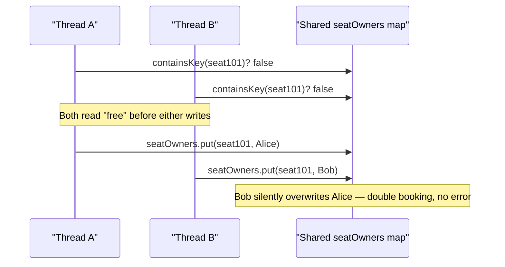
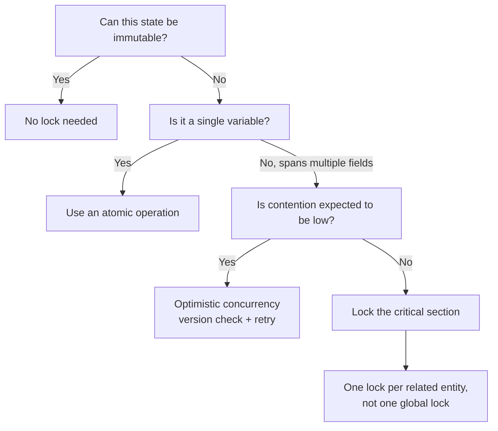
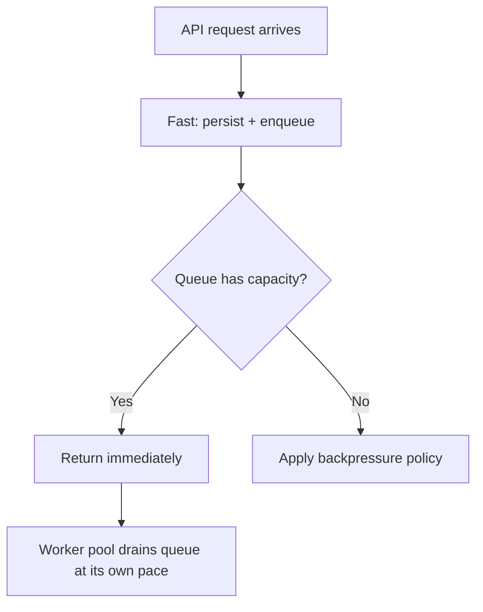

Thread safety questions in LLD rounds are rarely "implement a mutex" — they're "look at this class diagram and tell me where it breaks under concurrent access." Every concurrency problem in a design round reduces to one of three shapes: state getting **corrupted** under concurrent access, work needing **coordination** between producers and consumers, or demand exceeding a **scarce** resource. This page covers all three, spending the most time on correctness since it's what interviewers probe deepest, using a booking system as the running example.

## Three shapes of concurrency problems

| Shape | What breaks | Default fix | Typical examples |
|---|---|---|---|
| Correctness | Shared state is read and written concurrently, corrupting an invariant | Lock the critical section, or make the state immutable | Seat booking, bank balances, inventory counts |
| Coordination | Threads need ordering, handoff, or to wait on each other | A bounded queue between producer and consumer | Background jobs, bursty request handling, asynchronous email/notifications |
| Scarcity | Demand exceeds a limited resource (connections, memory, external API quota) | A semaphore (permits) or a resource pool (reusable objects) | Connection pools, rate-limited API clients, worker capacity |

> [!KEY]
> When an interviewer describes a system, classify the problem first: is state being corrupted, is work waiting on other work, or is a resource running out? That single question narrows the entire toolbox to one row of this table.

## Shared mutable state is the root cause

Every concurrency bug traces back to one thing: two or more threads reading and writing the **same mutable memory** without coordination. If data is either not shared (each thread has its own copy) or not mutable (it never changes after construction), there is no race to have.



This is the **check-then-act** race: check a condition, then act on it, with another thread's write landing in between. It is the single most common bug pattern in LLD concurrency questions — inventory checks, seat booking, connection pool limits, and balance checks all reduce to this shape.


> [!KEY]
> Before an interviewer even asks, scan your own design for any method that reads shared state and then writes based on what it read. That gap between read and write is where every race lives.

## Identifying critical sections in a design

A critical section is the smallest span of code that must run as if no other thread exists, because it reads and writes an invariant that spans more than one memory location (e.g. "this seat is unbooked AND now belongs to Alice" — one check, one write, together).

| Signal in a design | Likely critical section |
|---|---|
| `if (available) { available = false; }` | Classic check-then-act |
| A total/balance updated based on its own current value | Read-modify-write |
| Two related fields that must stay consistent (`count` and `list.size()`) | Multi-field invariant |
| A singleton's lazy-init `if (instance == null) instance = new X();` | Double-checked construction race |
| An external call inside a lock | Not itself a race, but a deadlock/throughput risk |

## Immutability as the first answer

Before reaching for a lock, ask whether the object needs to be mutable at all. An immutable object — all fields set at construction, never changed after — cannot participate in a race, because there's nothing to write.

```java
// Immutable: safe to share across threads with zero synchronisation.
// A record's fields are final, so the JVM guarantees safe publication of a
// fully-constructed instance to other threads.
public record Money(BigDecimal amount, String currency) {
    public Money add(Money other) {
        return new Money(amount.add(other.amount), currency); // returns a new instance
    }
}
```

> [!TIP]
> "Make it immutable" is the strongest possible answer to "is this thread-safe?" — it's not just synchronised, it has *no race to synchronise against*. In Java, `final` fields carry an extra guarantee: once a constructor completes, other threads are guaranteed to see the fully-initialised final fields (safe publication). Say this before reaching for `synchronized`; it signals you don't treat locking as the default tool.

## Lock granularity



| Granularity | What it protects | Throughput | Risk |
|---|---|---|---|
| Coarse (one global lock) | Everything behind one intrinsic lock (`synchronized`) or a single `ReentrantLock` | Low under contention — only one thread proceeds at a time | Simple, obviously correct, easiest default |
| Per-entity (one lock per row/seat/account) | Each entity's own invariant | High — unrelated entities proceed concurrently | More locks to manage, must avoid inconsistent lock ordering |
| Striped (a fixed pool of N locks, hashed by key) | Groups of entities sharing a lock slot | Middle ground — bounded lock count | Two unrelated entities can still contend if they hash to the same stripe |

```java
// Coarse-grained: correct by default, but every booking blocks every other booking
private final Object lock = new Object();
public boolean bookSeat(String seatId, String userId) {
    synchronized (lock) {
        if (owners.containsKey(seatId)) return false;
        owners.put(seatId, userId);
        return true;
    }
}
```

```java
// Per-entity: only bookings for the SAME seat contend with each other
private final ConcurrentHashMap<String, Object> seatLocks = new ConcurrentHashMap<>();
private Object lockFor(String seatId) { return seatLocks.computeIfAbsent(seatId, k -> new Object()); }

public boolean bookSeat(String seatId, String userId) {
    synchronized (lockFor(seatId)) {
        if (owners.containsKey(seatId)) return false;
        owners.put(seatId, userId);
        return true;
    }
}
```

Striped locking sits between the two: hash the key to one of `N` lock objects (`locks[Math.floorMod(key.hashCode(), N)]`), bounding the number of lock objects you allocate while still letting unrelated keys proceed concurrently most of the time — Guava's `Striped` gives you this off the shelf. It's useful when there could be millions of entities and per-entity locks would mean millions of lock objects.

## Lock ordering to avoid deadlock

Deadlock happens when two threads each hold a lock the other needs, and each waits forever. The classic case: transferring between two accounts, locking "from" then "to" — if thread A transfers X→Y while thread B transfers Y→X at the same time, A holds X waiting for Y while B holds Y waiting for X.

```java
// WRONG: lock order depends on argument order — can deadlock
public void transfer(Account from, Account to, BigDecimal amount) {
    synchronized (from) { synchronized (to) { /* move money */ } }
}
```

```java
// RIGHT: always lock in a fixed, global order (e.g. by account ID) regardless of argument order
public void transfer(Account from, Account to, BigDecimal amount) {
    Account first  = from.getId().compareTo(to.getId()) < 0 ? from : to;
    Account second = (first == from) ? to : from;
    synchronized (first) { synchronized (second) { /* move money */ } }
}
```

> [!WARNING]
> "Always acquire locks in the same global order" is the single fix interviewers want to hear for deadlock. Locking by a stable, comparable key (ID, hash) rather than by argument position is what makes the order consistent across every call site.

## Optimistic concurrency with version numbers

Locking blocks other threads even when conflicts are rare. Optimistic concurrency instead lets everyone read and compute freely, and only checks for conflict at write time using a version number (or timestamp) — if the version changed since you read it, someone else won, and you retry.

```java
public class Inventory {
    private int stock;
    private int version;

    public int getStock()   { return stock; }
    public int getVersion() { return version; }

    public boolean tryReserve(int quantity, int expectedVersion) {
        if (version != expectedVersion) return false; // someone else updated first — retry
        if (stock < quantity) return false;
        stock -= quantity;
        version++;
        return true;
    }
}
```

This is the same idea as a JPA `@Version` column throwing `OptimisticLockException` on a stale write, or a database `WHERE version = :expectedVersion` update that affects zero rows when the version moved. It trades a possible retry loop for much higher throughput when conflicts are rare — the opposite bet from locking, which pays a cost on every access to avoid a conflict that might never happen.

## Atomic operations, thread-safe singletons and concurrent collections

For a single counter or flag, a full lock is overkill — `AtomicInteger.incrementAndGet()` and `AtomicReference.compareAndSet(...)` use CPU-level atomic (compare-and-swap) instructions and are cheaper than a lock for single-variable read-modify-write. For a simple visibility flag that one thread sets and others read, a `volatile boolean` is enough: `volatile` establishes a *happens-before* relationship so a write is visible to every subsequent read, though it does **not** make compound `x++` operations atomic — that still needs an atomic type or a lock.

```java
private final AtomicInteger activeBookings = new AtomicInteger();
public void onBooked() { activeBookings.incrementAndGet(); } // no lock needed
```

When you genuinely need a lock object with more control than `synchronized` gives you, `ReentrantLock` adds `tryLock`, timed acquisition, and interruptibility; a `ReadWriteLock` (or the newer `StampedLock` with optimistic reads) lets many readers proceed in parallel while writers get exclusive access — the right choice for read-mostly shared state.

Lazy singleton initialisation is a classic double-checked-locking interview question — the naive version is a check-then-act race on `instance == null`:

```java
// Thread-safe and lazy via the initialization-on-demand holder idiom — no explicit locking
public final class ConfigService {
    private ConfigService() { }
    private static class Holder {
        static final ConfigService INSTANCE = new ConfigService();
    }
    public static ConfigService getInstance() { return Holder.INSTANCE; } // JVM builds it exactly once
}
```

The holder idiom sidesteps double-checked locking entirely. If you *do* hand-roll double-checked locking on a lazily-initialised field, that field **must** be `volatile` — without it, the Java Memory Model permits another thread to observe a non-null but partially-constructed object because the constructor's field writes can be reordered after the reference assignment.

For collections shared across threads, reach for `ConcurrentHashMap<K,V>`, `ConcurrentLinkedQueue<E>`, `CopyOnWriteArrayList<E>`, or a `BlockingQueue` implementation instead of wrapping a plain `HashMap`/`ArrayList` in your own lock — they use finer-grained internal synchronisation (lock striping or lock-free CAS) and are both correct and usually faster than a hand-rolled coarse lock. For per-thread state that never needs sharing at all, `ThreadLocal` gives each thread its own copy and removes the race entirely.

## Worked problem: double booking in a booking system

**The bug:** two users both call `isAvailable(seatId)` (returns true for both), then both call `book(seatId)` — both succeed, one seat, two owners.

| Solution | How it works | Correctness | Throughput | Complexity |
|---|---|---|---|---|
| Coarse lock around check-and-book | One lock wraps the read and write together as one atomic operation | ✅ Always correct | Low — every booking anywhere serialises | Low |
| Per-seat lock | Lock only the specific seat being booked | ✅ Correct | High — unrelated seats book concurrently | Medium — must manage lock lifetime/cleanup |
| Optimistic concurrency (version check) | Read seat + version, write only `if (version unchanged)`, else retry | ✅ Correct, assuming retry loop | High when contention is low, degrades under hot contention (many retries on one seat) | Medium — needs a retry loop and idempotent retry logic |

```java
// Correct: check and act are inside the SAME lock, so no other thread can interleave
public boolean book(String seatId, String userId) {
    synchronized (lockFor(seatId)) {
        if (owners.containsKey(seatId)) return false; // check
        owners.put(seatId, userId);                    // act
        return true;
    }
}
```

The senior answer names all three, then picks one with a reason: *"For a single popular event, seats contend heavily, so per-seat locking or optimistic concurrency both work well since contention is spread across many seats. If this were a single limited resource everyone wants — say, the last ticket — I'd expect high contention on one lock regardless of strategy, and I'd lean toward a coarse lock for simplicity since the fine-grained version buys little."*

## Coordination: handoff, backpressure, and shutdown


Coordination problems don't corrupt state — they show up as wasted CPU or unbounded memory growth because two sides of a workflow run at different speeds. A naive producer/consumer loop either busy-waits (burning CPU checking an empty queue) or sleep-polls (adding latency before work starts); the default fix is a **bounded blocking queue** (`ArrayBlockingQueue` or a capacity-bounded `LinkedBlockingQueue`) between them, letting a consumer block efficiently on `take()` when idle and a producer feel backpressure on `put()` when the consumer falls behind. In practice you rarely manage the threads by hand — an `ExecutorService` (a thread pool backed by exactly such a queue) is the idiomatic Java building block.



Bounding the queue is what forces a decision the moment the producer outruns the consumer, instead of deferring the crash to a later out-of-memory error. Three honest answers to "what happens when the queue is full":

| Backpressure policy | Behaviour | Good for |
|---|---|---|
| Block the producer | Caller waits until space frees up | Internal pipelines where slowing the caller is safe |
| Timeout and reject | Caller gets a "try again" error after a short wait | User-facing APIs — a fast, honest failure beats an unbounded wait |
| Drop and log | Newest (or oldest) item is discarded, logged for visibility | Best-effort telemetry/metrics where losing a sample is acceptable |

Shutting a worker down cleanly is the other coordination detail interviewers probe: a worker blocked in "take next item" needs a way to notice it should stop. The standard techniques: interrupt the blocked thread (`Thread.interrupt()`, which makes a blocked `take()` throw `InterruptedException`) so it wakes and exits, poll with a timeout (`queue.poll(1, TimeUnit.SECONDS)`) and check a shutdown flag between attempts, or submit a **poison pill** — a sentinel item the worker recognises as "no more work is coming." When several threads must rendezvous at a barrier — wait for N workers to finish before proceeding — a `CountDownLatch` or `CyclicBarrier` expresses that far more cleanly than hand-rolled waiting.

For many independent, stateful entities that occasionally message each other — a game server's players, a trading engine's order books, a chat system's rooms — a single shared queue starts to strain. The **actor model** is the design-level alternative: each entity owns a private mailbox and processes its own messages one at a time, so there's no shared state to protect — the per-actor queue replaces the lock. It's a bigger commitment than a shared blocking queue, so reach for it only when many independent entities message each other, not as the default for one producer/consumer pipeline.


## Scarcity: bounding limited resources

Scarcity problems are different again: nothing is corrupted, but demand for a limited resource — connections, memory, third-party API quota — exceeds supply. Two tools cover almost every case, and the choice comes down to whether the resource is stateless permission or a stateful object that must be reused.

| Tool | Grants | Use when |
|---|---|---|
| Semaphore (N permits) | Permission to proceed — no object handed back | Limiting concurrent operations (at most 5 in-flight downloads) or bounding aggregate consumption (a 100 MB in-flight buffer budget) |
| Resource pool (bounded queue of real objects) | An actual reusable object (a connection, a buffer) | The resource is expensive to create and must be handed out, used, and returned |

A pool built from a bounded queue has three practical wrinkles worth naming unprompted: pre-build every object upfront (simpler and the right interview default, even though lazy-init starts faster); validate on checkout, since a returned object might be broken; and acquire with a **timeout** rather than an unbounded wait, so one slow caller can't starve everyone else.

```java
public Connection acquire(long timeout, TimeUnit unit) throws InterruptedException {
    Connection conn = pool.poll(timeout, unit); // pool is a BlockingQueue<Connection>
    if (conn != null) return conn;
    throw new TimeoutException("No connection available within the deadline");
}
```

When the bottleneck is poor utilization rather than the limit itself — some tasks are fast, some slow, workers sit idle — three techniques help without raising the limit: work stealing (idle workers pull from a busy worker's queue, exactly what `ForkJoinPool` does), batching (trade latency for throughput on small operations), and adaptive sizing (grow/shrink capacity with measured demand instead of a fixed constant).


## What to say when asked "is this thread-safe?"

1. **Name the shared mutable state** — which fields, which objects, are touched by more than one thread.
2. **Name the invariant** that must hold across a read and a write (e.g. "a seat has at most one owner").
3. **Name the race shape** — check-then-act or read-modify-write.
4. **Propose the smallest fix that restores the invariant** — lock, atomic, or immutability — and say why you didn't pick a bigger hammer.
5. **Name the throughput trade-off** of your fix, unprompted.

> [!DANGER]
> A common failure: locking only the *write*, not the *read-then-write* as one unit — `if (!isBooked(seatId)) { synchronized (l) { book(seatId); } }`. The check happens outside the lock, so two threads can both pass the check before either takes the lock. The check and the act must be inside the **same** critical section.

## Cheat sheet

- Classify first: correctness (state corruption), coordination (ordering/handoff), or scarcity (limited resource) — each has a different default fix.
- Every race reduces to shared **mutable** state — remove either the sharing or the mutability and the race disappears.
- Check-then-act and read-modify-write are the two race shapes that cover almost every LLD concurrency question; the check and the act must be inside the *same* critical section.
- Immutability beats locking: no shared writable state means nothing to synchronise; `final` fields are safely published once the constructor returns.
- Coarse lock = correct by default, low throughput. Per-entity/striped lock = higher throughput, more to manage. `ReadWriteLock`/`StampedLock` win for read-mostly state.
- Deadlock's fix is a fixed global lock-acquisition order, usually by a stable ID, not by argument position.
- Optimistic concurrency (version/timestamp check) trades occasional retries for much higher throughput under low contention.
- `AtomicInteger`/`AtomicReference` (CAS) for single variables, `synchronized`/`ReentrantLock`/`ConcurrentHashMap` for anything spanning more than one field; the initialization-on-demand holder idiom (or an `enum`) for a correct lazy singleton, and `volatile` on any double-checked-locked field.
- `volatile` gives visibility and happens-before but not atomicity; `synchronized`/atomics give both. `ThreadLocal` removes sharing entirely for per-thread state.
- Coordination default: a bounded `BlockingQueue` (or an `ExecutorService`) with an explicit backpressure policy (block, timeout-reject, drop-log), a shutdown mechanism (interrupt, poll timeout, poison pill), and `CountDownLatch`/`CyclicBarrier` for rendezvous.
- Scarcity default: a `Semaphore` for stateless permits, a resource pool (bounded `BlockingQueue`) when the scarce thing is a reusable object.
- Watch the interning traps: `==` on `String`s compares references (use `equals`), and `Integer.valueOf` caches only −128..127 so `==` on autoboxed `Integer`s is unreliable — surprising under concurrent caching code.
- Always name the throughput trade-off of your fix — "correct but serialises everything" is an honest, useful answer.

## Common mistakes

| Mistake | Fix |
|---|---|
| Locking the write but checking outside the lock | Put the check and the act inside the same critical section |
| Reaching for a lock before considering immutability | Ask "does this need to be mutable at all?" first |
| Locking `from` then `to` in argument order for a transfer | Lock in a fixed order derived from a stable key (ID), not argument position |
| Treating `HashMap<K,V>` as thread-safe because "it's just reads" | Any concurrent write (or write during iteration) is unsafe and can even corrupt the map; use `ConcurrentHashMap` |
| Hand-rolling double-checked locking for a singleton | Use the initialization-on-demand holder idiom or an `enum`; if you must hand-roll DCL, mark the field `volatile` |
| Assuming optimistic concurrency has no downside | Under high contention on one row, it can retry far more than a lock would block |
| Saying "we'd add some locks" with no specifics | Name the exact shared field, the race shape, and the lock's scope |
| Using an unbounded queue between producer and consumer, or leaving a worker with no shutdown path | Bound the queue and pick a backpressure policy; support interruption, a polling timeout, or a poison pill for shutdown |

## Summary

Thread safety in a design starts with classifying the problem — correctness, coordination, or scarcity — then finding the exact shared mutable state, invariant, or bottleneck before an interviewer does, and picking a fix whose trade-off you can defend. For correctness: immutability first, then lock granularity, atomics, or optimistic concurrency under low contention — double-booking is the canonical worked example. For coordination: a bounded queue with an explicit backpressure and shutdown policy, or the actor model for many independent entities. For scarcity: a semaphore for permits, or a resource pool for objects that must be reused. When asked "is this thread-safe", answer in the shape: state, invariant, race, fix, trade-off.

## Top Interview Questions

### Q1. What is the root cause of almost every concurrency bug, and how do you spot it in a design before writing code?

Almost every concurrency bug traces back to **shared mutable state** — two or more threads reading and writing the same memory without coordination. You spot it in a design by scanning for fields that more than one thread can reach (instance fields on a singleton or a long-lived service, static fields, anything passed to multiple worker threads) and asking whether any method reads that state and then writes based on what it read. If either the sharing or the mutability is removed — the data is thread-local, or it's immutable after construction — there's no race possible, regardless of how many threads touch it. This is why "make it immutable" is often a stronger answer than "add a lock."

### Q2. Explain the check-then-act race with a concrete example, and how you fix it.

Check-then-act is when a thread reads a condition (check) and then performs an action based on that read (act), with a gap in between where another thread can interleave. Classic example: `if (!seatOwners.containsKey(seatId)) { seatOwners.put(seatId, userId); }` — two threads can both evaluate the `if` as true (seat looks free to both) before either writes, so both proceed to "book" the same seat. The fix is to make the check and the act a single atomic/critical section: wrap both inside the same `synchronized` block (or use `ConcurrentHashMap.putIfAbsent`/`computeIfAbsent`, which does the check-and-act atomically for you), so no other thread can observe the "free" state between your check and your write. A common mistake is locking only the write and leaving the check outside the lock, which doesn't fix anything.

### Q3. What's the difference between check-then-act and read-modify-write races?

Check-then-act reads a *boolean condition* and acts on it (is this seat free? is this connection pool below its limit?) — the bug is two threads seeing the same "yes" before either commits. Read-modify-write reads a *value*, computes a new value from it, and writes it back (a balance, a counter, a running total) — the bug is two threads both reading the same old value, so one thread's update is silently lost when the second write overwrites the first. Both are races caused by a gap between reading shared state and writing based on it; check-then-act is fixed the same way as read-modify-write for multi-field cases (lock the whole read+write), but single-variable read-modify-write can often be fixed more cheaply with an atomic operation like `AtomicInteger.incrementAndGet()`.

### Q4. When would you choose immutability over locking, and when does it stop being enough on its own?

Choose immutability whenever an object's fields are fully known at construction and never need to change afterward — value objects like `Money`, `TimeSlot`, or a configuration snapshot are ideal candidates, and making them immutable means they can be shared across any number of threads with zero synchronisation, no lock, no atomic, nothing. It stops being sufficient on its own when the *system* still needs to track something that changes over time — a seat's occupied/free status, an account balance — because that changing state has to live somewhere mutable. The usual pattern is: keep as much as possible immutable (the `Seat` ID, the `Money` amount type), and isolate the genuinely mutable, shared parts (an `occupied` flag, a `balance`) behind a lock, atomic, or optimistic-concurrency check.

### Q5. What's the trade-off between coarse-grained and fine-grained (per-entity) locking?

A coarse-grained lock — one lock object guarding an entire data structure or subsystem — is trivially easy to reason about and prove correct, but it serialises *all* operations through one gate, even ones touching completely unrelated entities, which kills throughput under load. A fine-grained, per-entity lock (one lock per seat, per account, per row) lets unrelated entities proceed fully concurrently, dramatically improving throughput, but introduces real complexity: you now have to manage potentially many lock objects, decide when to create/dispose them, and — critically — avoid acquiring multiple locks in an order that can deadlock. The senior answer names both and picks based on expected contention: low contention or a simple system → coarse lock is fine; high concurrent traffic on independent entities → fine-grained pays for its complexity.

### Q6. How does deadlock happen with per-entity locking, and what's the standard fix?

Deadlock happens when two threads each hold a lock the other is waiting for, so neither can proceed. The classic case is a funds transfer: thread A calls `transfer(accountX, accountY)` and locks X then waits for Y, while thread B simultaneously calls `transfer(accountY, accountX)` and locks Y then waits for X — each holds what the other needs. The standard fix is a **consistent global lock ordering**: always acquire locks in the same order regardless of the order they're passed in, typically by sorting on a stable, comparable key like account ID (`lock the lower ID first`). As long as every code path acquiring more than one lock follows the same ordering rule, a circular wait — the necessary condition for deadlock — cannot form.

### Q7. What is optimistic concurrency control, and when is it preferable to locking?

Optimistic concurrency assumes conflicts are rare: instead of taking a lock before reading, you read the data along with a version number (or timestamp), do your work without holding any lock, and only check at write time whether the version is still what you expected. If it changed, someone else wrote first, so you discard your work and retry (or fail back to the caller). It's preferable to locking when contention is genuinely low — most reads never actually collide with a concurrent write — because it avoids paying the cost of locking on every single access. It gets worse than locking when contention is high on the same row, since many threads will retry repeatedly instead of simply queuing behind a lock; in that case a lock (or per-entity lock) is usually the better bet.

### Q8. Walk through the double-booking problem in a seat reservation system and the trade-offs of your fix.

The bug: `isAvailable(seatId)` returns true for two concurrent callers before either has booked, so both proceed to `book(seatId)` and both "succeed" — one seat, two owners, and no exception raised to reveal the problem. The minimal correct fix is a lock scoped around both the availability check and the booking write together, so they execute as one atomic unit — a coarse lock (one lock for the whole booking system) is trivially correct but serialises every booking anywhere; a per-seat lock lets unrelated seats book fully concurrently at the cost of managing a lock per seat ID; an optimistic version check on the seat avoids locking entirely but requires a retry loop and behaves worse if one specific seat is extremely popular. I'd pick per-seat locking or optimistic concurrency for a large multi-event system with spread-out contention, and a coarse lock for a small system where simplicity matters more than raw throughput.

### Q9. Why is naive double-checked locking for a singleton broken in some languages, and how do you avoid the problem in Java?

The naive pattern — `if (instance == null) { synchronized (lock) { if (instance == null) instance = new X(); } }` — exists to avoid taking a lock on every access after the singleton is created, but on some memory models a thread can observe a **partially constructed** object: the reference gets assigned before the constructor has fully initialised all fields, due to instruction reordering, so a second thread reading `instance` outside the lock can see a non-null but not-fully-built object. In Java you avoid it two ways: use the **initialization-on-demand holder idiom** (a private static nested `Holder` class whose static initialiser the JVM runs exactly once, lazily, with no explicit locking) or an `enum` singleton; or, if you insist on double-checked locking, declare the field `volatile` — since the Java 5 memory model, a `volatile` write establishes a happens-before edge that guarantees a reader sees the fully-constructed object rather than a reordered, half-initialised one.

### Q10. In production, you notice occasional lost updates to a shared in-memory counter under load, but no exceptions are thrown. How would you diagnose and fix this?

Silent lost updates with no exception is the signature of a read-modify-write race: two threads read the same counter value, each computes `value + 1` independently, and the second write simply overwrites the first, discarding one increment — nothing throws because both writes are individually valid, just wrong given what actually happened concurrently. I'd confirm this by checking whether the counter is a plain `count++`/`counter = counter + 1` on a field touched from multiple threads (a request-handling method, a background job) rather than behind synchronisation. The fix is either `AtomicInteger.incrementAndGet()` for a bare counter, or a `synchronized` block / `ReentrantLock` around the read-modify-write if the update also depends on other shared fields that need to stay consistent together — I'd add a load test afterward that hammers the counter concurrently and asserts the final count matches the number of increments issued, to prove the fix actually holds under contention.

### Q11. Are `ConcurrentHashMap` and similar concurrent collections a complete answer to thread safety, or do they have limits?

They solve thread safety for **individual operations** on the collection itself — a concurrent `put`, `get`, or `remove` call won't corrupt the map's internal structure, and you don't need your own lock just to use it safely. They do **not** make multi-step operations atomic: `if (!map.containsKey(key)) map.put(key, value);` is still a check-then-act race even on a `ConcurrentHashMap`, because the check and the write are two separate calls. For that, you use the collection's own compound methods — `putIfAbsent`, `computeIfAbsent`, `compute`, `merge`, or `replace(key, oldValue, newValue)` — which perform the check-and-act atomically inside the collection's own implementation. The lesson: concurrent collections protect their own internal state, not the business invariant you're trying to enforce across multiple calls.

### Q12. An interviewer asks "is this thread-safe?" about a class you just designed. What's the structure of a strong answer?

I answer in five parts, explicitly: first, name exactly which fields are shared mutable state and which threads could touch them concurrently; second, name the invariant that must hold across a read and a write together (e.g. "at most one owner per seat"); third, name the race shape — check-then-act or read-modify-write; fourth, propose the smallest fix that restores the invariant, defaulting to immutability, then a lock scoped around the whole check-and-act, or an atomic for a single variable; and fifth, state the throughput trade-off of that fix without being asked, and whether a cheaper or more scalable alternative exists if contention turns out to be higher or lower than expected. That structure shows I'm reasoning from the actual state and invariant, not reciting "add a lock" as a reflex.

### Q13. A producer is adding work faster than a consumer can process it. What are your options, and how do you pick one?

The first decision is whether the queue between them is bounded — an unbounded queue just postpones the failure to an eventual out-of-memory crash once the producer has outrun the consumer for long enough, so a bounded queue is the non-negotiable first step. Once it's bounded, you need an explicit policy for what happens when it's full: block the producer (fine for internal pipelines where a slower caller is acceptable), time out and reject with a "try again" error (the right default for user-facing APIs, since a fast honest failure beats an unbounded wait), or drop the newest/oldest item and log it (acceptable for best-effort telemetry where losing a sample doesn't matter). I'd pick based on who's calling and what a stall costs them — a checkout API should reject fast, a metrics pipeline can drop samples.

### Q14. What's the difference between using a semaphore and using a resource pool to handle a scarce resource, and when would you pick each?

A semaphore hands out **permission**, not an object — it's a counter of permits that lets you cap how many operations run concurrently (at most 5 simultaneous downloads) or how much of a budget is consumed at once (a 100 MB in-flight buffer, acquiring a variable number of permits per request), but the caller still creates or owns whatever it's doing with that permission. A resource pool hands out the **actual object** — a real database connection, a real buffer — because the object itself is expensive to construct and needs to be reused rather than recreated on every call; the pool is typically backed by a bounded queue of pre-built objects, acquired with a timeout and returned when done. Use a semaphore when the scarcity is about a *count* or *budget*; use a pool when the scarcity is about a *specific expensive-to-create object* that must be handed back for someone else to reuse.
