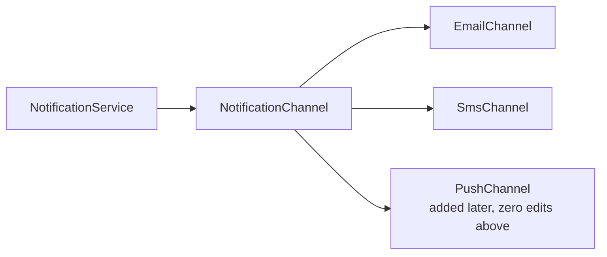
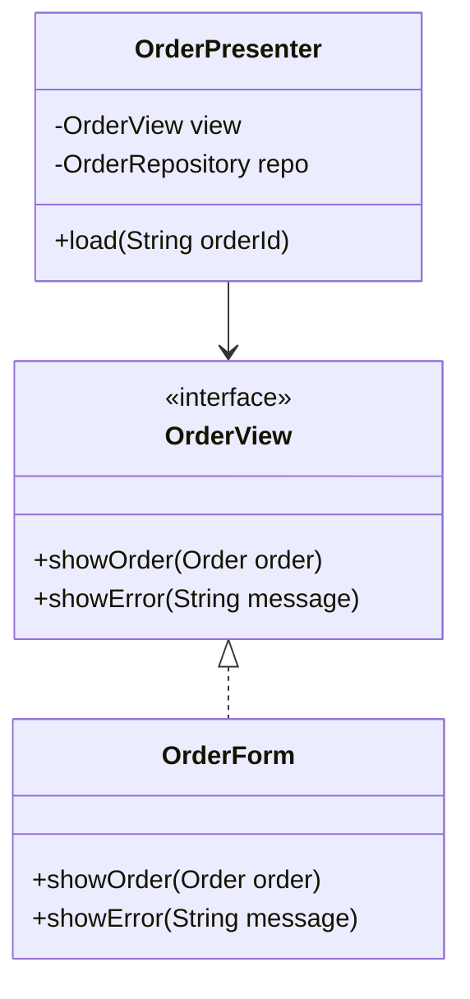

Extensibility and testability are the same underlying skill wearing two hats: both come from **not hard-wiring decisions that vary**. A class that's easy to extend without editing is almost always also easy to unit test in isolation, because both properties come from depending on interfaces instead of concrete, hard-coded collaborators.

## Designing for change

### Identifying axes of variation

Before adding any abstraction, name what's actually likely to vary: payment method, notification channel, pricing rule, storage backend, region-specific tax logic. An axis of variation is something the *business* changes, not something you imagine might change — resist adding an interface for a dimension nobody has asked to vary yet.

| Axis of variation | Interface to introduce | Concrete implementations |
|---|---|---|
| How a fee is calculated | `PricingStrategy` | `FlatFee`, `TieredFee`, `PromotionalFee` |
| Where a notification is sent | `NotificationChannel` | `EmailChannel`, `SmsChannel`, `PushChannel` |
| Where data is persisted | `OrderRepository` | `SqlOrderRepository`, `InMemoryOrderRepository` |
| What counts as "now" | `java.time.Clock` | `Clock.systemUTC()`, `Clock.fixed(...)` (for tests) |

### Programming to interfaces, not implementations

The dependency should be declared as the *abstraction* the caller needs, not the *concrete class* that happens to provide it today.



```java
// Hard to extend or test: NotificationService is welded to SmtpEmailSender
public class NotificationService {
    private final SmtpEmailSender sender = new SmtpEmailSender();
    public void notify(String message) { sender.send(message); }
}

// Open for extension, easy to test: depends on an interface, injected
public class NotificationService {
    private final NotificationChannel channel;
    public NotificationService(NotificationChannel channel) { this.channel = channel; }
    public void notify(String message) { channel.send(message); }
}
```

The second version can add SMS or push notifications as new classes with zero changes to `NotificationService`, and a unit test can inject a fake `NotificationChannel` that just records calls instead of actually sending email.

### Open/closed in practice

"Open for extension, closed for modification" sounds abstract until you have a concrete rule: **if adding a requirement means editing a class that already works and is already tested, the design isn't open**. Adding `TieredFee` should mean writing a new class, not adding a branch to an existing `calculateFee` method that every other pricing path also runs through.

> [!KEY]
> The test for Open/Closed isn't "did I use an interface" — plenty of interfaces still get edited every time a new case appears. The test is "does adding a new case require a new file, or a diff to an existing, working one?"

### Plugin and registry patterns

When the set of implementations isn't known at compile time — third-party integrations, user-configured payment providers — a registry resolves an implementation by a key at runtime instead of the caller `new`-ing a concrete type directly.

```java
public class NotificationChannelRegistry {
    private final Map<String, NotificationChannel> channels = new HashMap<>();
    public void register(String key, NotificationChannel channel) { channels.put(key, channel); }
    public NotificationChannel resolve(String key) { return channels.get(key); } // new channels register without touching callers
}
```

This is exactly how Spring's `ApplicationContext`, the JDK's `ServiceLoader` SPI mechanism, and plugin-based systems (IntelliJ/Eclipse plugins, payment gateway SDKs) let new implementations show up without recompiling the code that uses them.

### Configuration over code, and feature toggles

Values that change by environment or over time (a discount percentage, a rollout flag) belong in configuration, not in a recompiled constant — and a feature toggle lets you ship code dark and turn on behaviour without a deploy.

```java
public class CheckoutService {
    private final FeatureFlags flags;
    public CheckoutService(FeatureFlags flags) { this.flags = flags; }

    public BigDecimal getTotal(Order order) {
        // The toggle is a runtime decision, not a compile-time fork
        return flags.isEnabled("new-tax-engine")
            ? NewTaxEngine.calculate(order)
            : LegacyTaxEngine.calculate(order);
    }
}
```

> [!TIP]
> Say this out loud when asked about toggles: "a feature flag is a temporary Strategy selector — the moment the old path is retired, the flag and the dead branch should be deleted." Toggles that live forever are technical debt, not design.

## Designing for tests

### Dependency injection instead of `new` in the constructor

A class that constructs its own collaborators (`new SqlOrderRepository()` inside a constructor) cannot be tested without a real database, because there's no seam to substitute a fake. Injecting the dependency through the constructor gives the test a place to plug in a test double.

```java
// Untestable without a real database and a real clock
public class OrderService {
    private final SqlOrderRepository repo = new SqlOrderRepository();
    public boolean isExpired(Order order) {
        return Instant.now().isAfter(order.getPlacedAt().plus(30, ChronoUnit.DAYS));
    }
}

// Testable: repository and time are both seams
public class OrderService {
    private final OrderRepository repo;
    private final Clock clock;
    public OrderService(OrderRepository repo, Clock clock) {
        this.repo = repo;
        this.clock = clock;
    }
    public boolean isExpired(Order order) {
        return clock.instant().isAfter(order.getPlacedAt().plus(30, ChronoUnit.DAYS));
    }
}
```

### Time and randomness as injected dependencies

`Instant.now()`/`LocalDateTime.now()` and `new Random()` called directly inside business logic are two of the most common causes of flaky, unrepeatable tests — the same input produces a different result depending on when the test runs. Java gives you `java.time.Clock` as a built-in seam for time; inject it (and a `Random`/`RandomGenerator`) so the "non-determinism" itself becomes a controllable input.

```java
// java.time.Clock is the built-in "now" seam — no custom interface needed
Clock production = Clock.systemUTC();                                          // real wall-clock time
Clock test = Clock.fixed(Instant.parse("2026-01-01T00:00:00Z"), ZoneOffset.UTC); // a test pins "now"

// business code reads time only through the injected clock
Instant now = clock.instant();
```

### The humble object pattern

Some things are genuinely hard to unit test directly — UI rendering, raw database calls, hardware I/O. The humble object pattern splits that code into a thin, "humble" layer that does only the untestable I/O, and a separate, fully testable layer that contains all the logic and decisions, talking to the humble layer through an interface.



`OrderPresenter` contains every decision (what to show, when it's an error) and is tested with a fake `OrderView`; `OrderForm` (the humble object) contains almost no logic — just enough to draw what it's told — so it barely needs testing at all.

### What makes code hard to test

| Smell | Why it blocks testing | Fix |
|---|---|---|
| `new ConcreteType()` inside a constructor or method | No seam to substitute a fake | Inject the dependency via constructor/interface |
| `static` methods holding logic or state | Can't be swapped or mocked, and often carries hidden shared state | Wrap in an instance method behind an interface |
| Direct `Instant.now()` / `new Random()` calls | Non-deterministic, test result depends on when it runs | Inject `java.time.Clock` / a seeded `Random` |
| A method that both computes and does I/O | Can't assert on the computation without triggering the I/O | Split computation (pure) from I/O (side-effecting) |
| Deep inheritance chains with logic in base classes | Hard to isolate the behaviour under test from unrelated base logic | Prefer composition; keep base classes thin |
| A constructor with 8+ parameters wired by hand | Painful to instantiate in a test, signals too many responsibilities | Split the class, or introduce a factory/builder |

> [!WARNING]
> Mocking frameworks make it *possible* to test almost anything, including badly designed code — which hides the actual problem. If a class needs five mocks to test one method, that's a design smell (too many responsibilities, too many dependencies), not a reason to write a more elaborate mock setup.

### A class you can test without mocks

Pure logic — no I/O, no shared state — needs no test doubles at all; you just call it and assert on the return value.

```java
public class DiscountCalculator {
    public BigDecimal apply(BigDecimal price, int loyaltyYears) {
        if (loyaltyYears >= 5) return price.multiply(BigDecimal.valueOf(0.80));
        if (loyaltyYears >= 1) return price.multiply(BigDecimal.valueOf(0.95));
        return price;
    }
}

// No mocks needed — pure function in, value out (JUnit 5 + AssertJ)
@Test
void appliesLoyaltyDiscount() {
    assertThat(new DiscountCalculator().apply(BigDecimal.valueOf(100), 5))
        .isEqualByComparingTo("80.00");
}
```

Pushing as much logic as possible into classes shaped like this — inputs in, a value out, no hidden dependency on the outside world — is the single highest-leverage testability habit: the *design* choice (keep logic pure, isolate I/O at the edges) is what makes mocks optional rather than mandatory.

## Cheat sheet

- Extensibility and testability come from the same habit: depend on interfaces, not concrete collaborators.
- Only add an interface for an axis of variation the business actually has — not a hypothetical one.
- Open/Closed test: does the next requirement need a new file, or a diff to an existing, working one?
- Registries/plugins resolve an implementation by key at runtime — no recompilation to add a new one.
- Feature toggles are a temporary Strategy selector; delete the flag and dead branch once the rollout is done.
- Inject `java.time.Clock` and a `Random`/`RandomGenerator` — never call `Instant.now()`/`new Random()` inside business logic directly.
- The humble object pattern isolates untestable I/O into a thin layer, keeping all decisions in a testable one.
- If a class needs many mocks to test one method, that's a design smell, not a reason for a bigger mock.
- Prefer pure functions (input in, value out, no hidden dependency) wherever the logic allows it — no mocks needed.
- A constructor doing `new ConcreteType()` internally has no seam; a constructor taking an interface does.

## Common mistakes

| Mistake | Fix |
|---|---|
| Constructing dependencies with `new` inside a class | Inject them through the constructor as interfaces |
| Adding an interface for a variation nobody has asked for | Wait until a second real implementation is likely |
| Calling `Instant.now()`/`new Random()` directly in logic | Inject `java.time.Clock`/a seeded `Random` |
| Leaving a feature flag in code long after rollout | Delete the flag and the dead branch once decided |
| Testing a UI/I/O class directly with heavy mocking | Split into a humble object plus a testable logic class |
| A method that computes and performs I/O in one block | Separate the pure computation from the side effect |
| Treating "many mocks pass" as proof of good design | Treat many required mocks as a signal to split responsibilities |

## Summary

Extensibility and testability both come from the same design habit: depend on interfaces for the things that genuinely vary, and inject those dependencies rather than constructing them internally. Open/Closed is concrete in practice — a new requirement should mean a new class, not an edit to a working one — and the same seams that let you swap implementations in production (a new pricing strategy, a new notification channel) are exactly what let you substitute a fake in a test. Push time, randomness and I/O to the edges behind interfaces, keep as much logic as possible pure, and treat "this needs five mocks to test" as a sign to redesign, not to mock harder.

## Top Interview Questions

### Q1. What's the relationship between extensible design and testable design?

They come from the same underlying property: depending on an abstraction instead of a concrete, hard-wired collaborator. A class that takes a `NotificationChannel` via its constructor can be extended in production with a new channel implementation without being edited, and it can be tested by injecting a fake channel that just records calls instead of sending real emails — the same seam serves both purposes. Conversely, a class that does `new SmtpEmailSender()` internally is both hard to extend (you'd have to edit it to add SMS) and hard to test (no way to substitute a fake in a unit test). Good extensibility and good testability are both downstream of the same discipline: identify what varies, put it behind an interface, and inject it.

### Q2. How do you decide when a piece of behaviour deserves its own interface, versus when that's over-engineering?

I look for an actual axis of variation the business has, not one I'm imagining might appear — "we support three payment providers today and are onboarding a fourth next quarter" is a real axis; "we might someday support a different database" with no concrete plan is speculative. A good heuristic: if the requirements already say "different types of X" or a second real implementation is imminent, introduce the interface now; if there's exactly one implementation with no signal of a second, keep it concrete and extract an interface later when the second implementation actually shows up. Over-interfacing has a real cost — extra indirection, extra files to navigate — so I'd rather explain a concrete class today than defend an unused abstraction in a review.

### Q3. What does "open for extension, closed for modification" mean in practice, on a real class?

In practice, it means adding a new business case should require writing a **new class**, not adding a branch to a method that already works and is already tested. For example, if `calculateFee` is a `switch` on customer tier, adding "enterprise tier" means editing that method and re-testing every tier that shares it, risking a regression in code that had nothing to do with the change. If `calculateFee` is instead a `PricingStrategy` interface with one implementation per tier, adding "enterprise tier" is a new `EnterprisePricing implements PricingStrategy` class; nothing about `RegularPricing` or `PremiumPricing` is touched, compiled differently, or re-tested. The litmus test I use: "does this change need a diff to an existing file, or just a new one?"

### Q4. What's the humble object pattern, and when would you reach for it?

The humble object pattern splits a piece of functionality into two parts: a "humble" object that does only the hard-to-test I/O or rendering (drawing a UI, writing to a socket, calling a hardware driver) with as little logic as possible, and a separate object that contains all the actual decisions and logic, talking to the humble object through a small interface. You reach for it whenever the untestable part (UI framework, raw DB driver, hardware) can't reasonably be avoided, but you still want the decision logic — what to show, when it's an error, what to compute — to be unit tested without spinning up that untestable dependency. A `Presenter`/`View` split in MVP, or a thin repository wrapping raw JDBC behind an interface consumed by testable service logic, are both instances of this pattern.

### Q5. Why is calling `Instant.now()` directly inside business logic a testability problem, and how do you fix it?

Because the method's output now depends on *when the test happens to run*, which makes the test non-deterministic — a test asserting "this order is not expired" can start failing a year later purely because time passed, with no code change, or can flake near a day/month boundary. It also makes it impossible to test the "order is expired" branch reliably without literally waiting real time or manipulating the system clock, which is fragile and slow. The fix is to inject a `java.time.Clock` (`Clock.systemUTC()` in production; `Clock.fixed(...)` in tests, returning whatever fixed instant the test needs) so the "current time" becomes a controllable input rather than a hidden global. The same reasoning applies to `new Random()` — inject a seeded `Random`/`RandomGenerator` so tests can assert against deterministic values.

### Q6. What's wrong with a constructor that does `repository = new SqlOrderRepository();` internally, from a testability standpoint?

It removes the seam a test would need to substitute a fake — any unit test for that class now transitively depends on a real SQL connection being available, which makes the test slow, flaky (network/DB availability), and no longer a *unit* test since it's exercising a database too. It also silently couples the class to one specific implementation, so if the team later needs an in-memory repository for a different environment, or wants to swap SQL for another store, this class has to be edited directly. The fix is dependency injection: take an `OrderRepository` as a constructor parameter, let the composition root (DI container, `main`, test setup) decide what concrete instance to provide, and now a test can inject an in-memory fake with a couple of seeded orders and assert against it directly. For the genuine database integration test, Testcontainers can spin up a real disposable database in Docker.

### Q7. A method needs to both calculate a value and write it to a database. How would you restructure it to make it more testable?

I'd split it into two pieces: a pure function that takes the inputs it needs and returns the computed value with no side effects, and a thin orchestrating method (or a separate class) that calls the pure function and then performs the write through a repository interface. The pure function can be unit tested exhaustively with plain input/output assertions and no mocks at all — different loyalty years, different prices, edge cases at the boundaries. The orchestration layer, which does need a mock/fake for the repository (a Mockito `mock(OrderRepository.class)` with `verify(...)`), becomes trivial to test too, because it only has one job left: call the calculation, then call `save`. This separation — compute here, persist there — is usually the single biggest testability win available in a method that currently does both.

### Q8. What's a feature toggle from a design perspective, and what's the risk of leaving toggles in code long-term?

A feature toggle is effectively a runtime Strategy selector: instead of the client choosing an implementation at construction time, a flag (often backed by configuration or a feature-flag service) decides which of two code paths runs, and that decision can change without a redeploy. The risk of leaving toggles around indefinitely is that the codebase accumulates permanent branching for what was meant to be a temporary rollout mechanism — every old flag is a hidden dimension of behaviour that every future change now has to consider ("does this also need to work with the flag off?"), and test coverage often only exercises one side. The discipline is to treat every toggle as having a planned removal date: once the new path is fully rolled out and trusted, delete the flag and the old branch in the same change.

### Q9. You're reviewing a class that requires five mocks to unit test a single method. What does that tell you, and what would you do?

It tells me the class likely has too many responsibilities or too many direct dependencies for what should be one cohesive unit of behaviour — each mock represents a collaborator the method reaches into, and five collaborators for one method usually means the method (or the class) is doing several unrelated jobs. Rather than writing a more elaborate mock setup to make the test pass, I'd look at whether the method naturally splits into smaller pieces, each depending on fewer things — for example, separating "validate the request" from "calculate the total" from "persist and notify" into distinct, independently testable units, each needing at most one or two collaborators. Treating "it's hard to test" as direct feedback about the design, rather than a testing-tooling problem, is the mindset that actually fixes it.

### Q10. How would you design a plugin/registry system so that new implementations can be added without recompiling the code that uses them?

I'd define a shared interface for the varying behaviour (`NotificationChannel`, `PaymentProvider`), have each implementation register itself with a registry keyed by a string or enum identifier (`registry.register("sms", new SmsChannel())`), and have all calling code resolve an implementation from the registry by key (`registry.resolve(order.getPreferredChannel())`) rather than constructing a concrete type directly. New implementations become new classes that call `register` during startup/composition — via a DI container's classpath scanning, the JDK's `ServiceLoader` SPI, a configuration file, or an explicit startup list — with zero changes to any code that calls `resolve`. The main design decision to be explicit about is where registration happens (a central composition root is easiest to reason about) and what happens on `resolve` for an unregistered key — fail loudly rather than silently defaulting.

### Q11. In production, a bug only reproduces "sometimes" and the team suspects it's related to test flakiness masking a real issue. How would you use these design principles to investigate?

I'd first check whether the flaky test (or the underlying code path) has a hidden non-deterministic dependency — a direct `Instant.now()`/`new Random()` call, an unseeded `UUID`, or reliance on `HashMap` iteration order — since these are the most common causes of "sometimes" behaviour that isn't a real concurrency bug. If those are already injected behind `java.time.Clock`/`Random` seams, I'd look at whether the class under test has a genuine shared-mutable-state issue (a static field, a shared cache) that only manifests when tests run in parallel or share state across runs. Either way, the fix reinforces the same principle: anything that makes behaviour depend on "when" or "in what order" something runs should be an explicit, injected, controllable dependency — not an ambient global the code silently reaches for.

### Q12. How do you justify spending time introducing seams (interfaces, injected dependencies) in a codebase under deadline pressure, when it feels like "extra work" compared to just writing the concrete implementation?

I'd frame it around the cost of the *next* change, not this one: the concrete version ships slightly faster today, but the first time a second payment provider, a second notification channel, or a single unit test is needed, the concrete version requires editing already-shipped, already-trusted code, while the seam-based version requires only an addition. I'd also point out that the "extra work" of an interface plus constructor injection is usually a few extra lines, not a redesign — it's not a large seam to add up front, but it is a large amount of work to retrofit once three call sites already depend on the concrete type directly. Under real deadline pressure I'd still introduce the seam for anything I can already see varying soon (payment methods, notification channels), and defer it only for the parts of the design that are genuinely a one-off with no visible second case.
