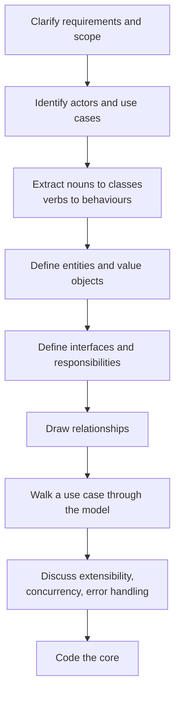
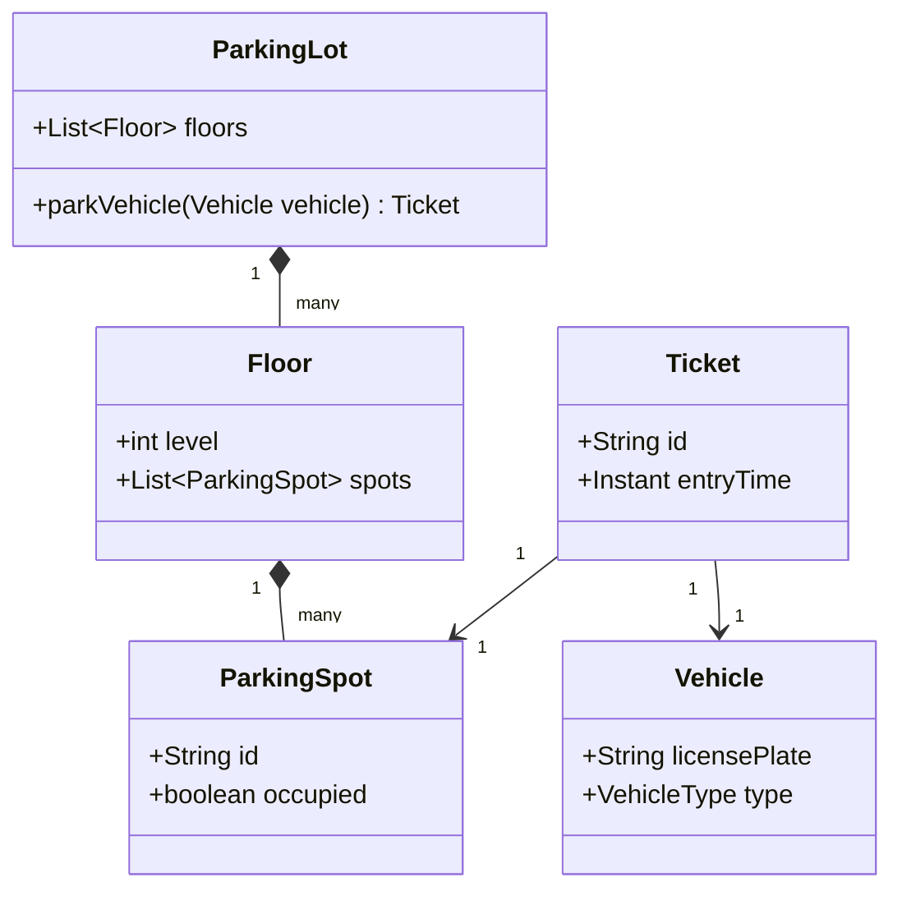
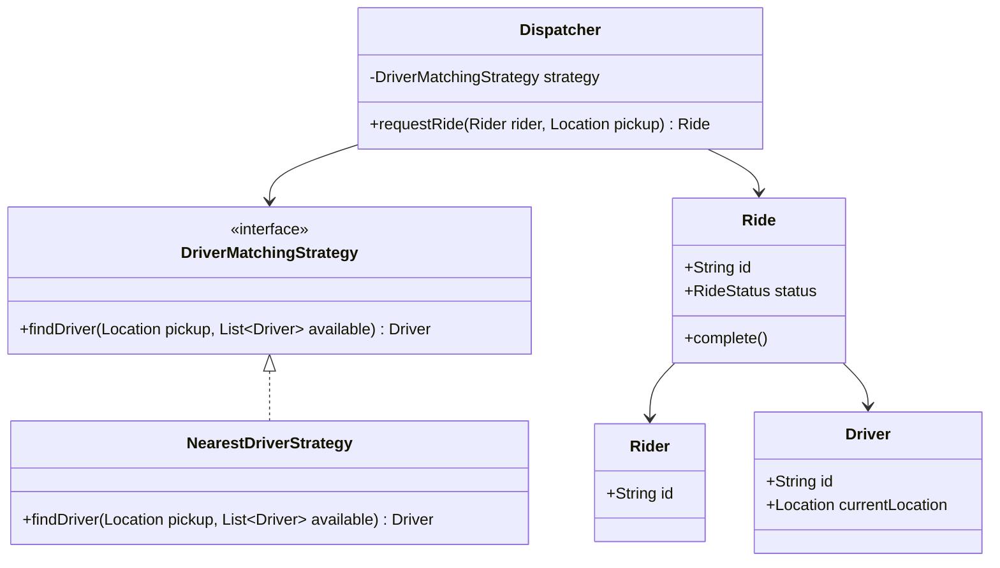

Most candidates who "know" design patterns still fail LLD rounds because they jump straight to code with no shared understanding of scope. Interviewers are grading your **process** as much as your final class diagram — the goal every round is the same: clean, maintainable code that visibly applies OOP, SOLID, and design patterns, arrived at through a process the interviewer can follow. This page gives a repeatable structure for a 45–60 minute round, a time budget, a reusable class skeleton for the coding portion, and what to do when the interviewer throws a curveball requirement halfway through.


## The shape of the round




Every stage produces something the interviewer can see — a list, a diagram, a spoken walkthrough. Silence while you think is the single biggest score-killer; narrate constantly, even "I'm considering whether Payment should be an entity or a value object" is worth more than silence followed by a diagram.

## Time budget for a 45–60 minute round

| Phase | Time (45 min round) | Time (60 min round) | Output |
|---|---|---|---|
| Clarify requirements & scope | 5 min | 7 min | Written list of in-scope/out-of-scope features |
| Actors & use cases | 3 min | 5 min | 3–6 use cases, one sentence each |
| Nouns → classes, verbs → behaviours | 3 min | 4 min | Rough candidate class list |
| Core entities & value objects | 5 min | 7 min | Named classes with 2–4 key fields each |
| Interfaces & responsibilities | 5 min | 6 min | Interfaces for anything that varies |
| Relationships (class diagram) | 5 min | 7 min | Drawn or described class diagram |
| Walk a use case through the model | 5 min | 6 min | Verbal trace, catches missing methods |
| Extensibility / concurrency / errors | 4 min | 6 min | Named trade-offs, not full solutions |
| Code the core | 12–15 min | 15–18 min | Compiling(ish) classes for 2–3 central use cases |

> [!KEY]
> Never spend more than 10–15% of the round on requirements. Interviewers deliberately give an ambiguous prompt ("design a parking lot") — the point is to see you *bound the problem yourself*, not interrogate every edge case. Ask 3–5 sharp questions, state your assumptions for the rest, and move.

## Step by step

### 1. Clarify requirements and scope

Ask about scale (single building or a mall lot?), the must-have features vs nice-to-haves, and who the users are (driver, attendant, admin). State explicit assumptions for everything you don't ask: *"I'll assume single-currency pricing and no reservations unless you tell me otherwise."* Write the in-scope list somewhere visible — it becomes your contract with the interviewer. A concrete written scope, covering capabilities, transition rules, error handling, and explicit non-goals, looks like this:

```text
Requirements: two players alternate marks on a 3x3 grid; a row/column/diagonal wins;
a full board with no winner is a draw; invalid moves (occupied cell, move after game over) are rejected.

Out of scope: UI/rendering, AI opponent, networked multiplayer, NxN boards, undo/redo.
```

### 2. Actors and use cases

List who interacts with the system and the 3–6 things they do: *"Driver: park a vehicle, pay, retrieve vehicle. Attendant: issue ticket, resolve a lost ticket. Admin: configure pricing."* This is a sentence-level list, not a diagram yet — it stops you from designing for a use case nobody asked for.

### 3. Nouns → classes, verbs → behaviours

Underline the nouns in your requirements and use cases (`Vehicle`, `Spot`, `Ticket`, `Gate`, `Payment`) — these are candidate classes. Underline the verbs (`park`, `pay`, `assign spot`, `calculate fee`) — these become methods, and if a verb doesn't obviously belong to one noun, it's often a service or a strategy (`PricingStrategy.calculateFee`).

### 4. Core entities and value objects

Separate objects with identity and a lifecycle (**entities** — `Vehicle`, `Ticket`, `Booking`) from immutable data bundles with no identity of their own (**value objects** — `Money`, `TimeSlot`, `Address`). Getting this distinction right early prevents a common mid-interview stumble: mutating a value object in place, or giving an entity no identity field at all. While you place fields, keep a rule of thumb running: a class should own the method for any state it tracks — put `Board.checkWin()` on `Board`, not on `Game` reaching into `Board`'s cells — so behaviour stays next to the data it reads, and callers get told what happened rather than asking for raw state to decide for themselves.

| | Entity | Value object |
|---|---|---|
| Identity | Has a stable ID, compared by ID | Compared by value (all fields equal) |
| Mutability | Usually mutable over its lifecycle | Usually immutable |
| Example | `Order`, `Ticket`, `Account` | `Money`, `TimeSlot`, `Address` |
| Lives in a repository/collection | Often, yes | Rarely on its own — embedded in an entity |

### 5. Interfaces and responsibilities

For anything that **varies by policy** (pricing, notification channel, payment method), define an interface now, even with one implementation — it signals Open/Closed thinking and avoids a rewrite later when the interviewer says "now add hourly AND flat pricing". For everything else, resist the urge to interface-ify every class; a `Ticket` with no variation doesn't need a `TicketInterface`.

```java
public interface PricingStrategy {
    BigDecimal calculateFee(Duration duration, VehicleType type);
}
```

### 6. Draw relationships

Sketch (verbally or literally) composition (`ParkingLot` owns `Floor`s owns `Spot`s — dies with the parent), aggregation (`Floor` has `Spot`s that could theoretically be reassigned), and association (`Ticket` references a `Vehicle` it doesn't own). Getting composition vs aggregation right is a small but real signal of OOP fluency.



### 7. Walk a use case through the model

Pick the most central use case and trace it method by method against your diagram out loud: *"Driver arrives → `ParkingLot.parkVehicle(vehicle)` → finds a free `Spot` on some `Floor` → creates a `Ticket` → marks the spot occupied."* This step reliably surfaces missing methods and awkward responsibilities before you've written a line of code — much cheaper to fix now than mid-coding.

### 8. Extensibility, concurrency and error handling

Name the likely extension points ("new vehicle types", "new pricing schemes", "multiple lots") and how your design already absorbs them via the interfaces you defined. Name the concurrency risk explicitly even if you don't fully solve it: *"Two drivers claiming the same spot simultaneously is a check-then-act race — I'd lock per-spot or use an atomic compare-and-swap on spot state."* Name the error cases: invalid ticket, lot full, payment failure — and how they surface (exceptions vs result objects).

> [!TIP]
> Say the *name* of the concurrency problem ("this is a check-then-act race") even under time pressure — it demonstrates the vocabulary interviewers are listening for, even if you don't have time to write the locking code.

### 9. Code the core

Code the 2–3 classes and methods central to the use case you walked through, not everything you diagrammed. Favour a compiling, if incomplete, subset over a sprawling half-finished sketch — interviewers weight working code for the core path much higher than stubbed method signatures for every edge case. Once it compiles, do a quick dry run with a concrete, non-trivial sequence rather than declaring victory on sight — pick real inputs and trace the state after each call:

```text
Initial: board empty, currentPlayer = X
makeMove(X, 0, 0) → board[0][0] = X, currentPlayer = O
makeMove(O, 1, 1) → board[1][1] = O, currentPlayer = X
```

A 30-second trace like this catches an off-by-one or a forgotten state transition before the interviewer does.

## What interviewers actually score

| Dimension | What they're watching for |
|---|---|
| Problem framing | Did you scope the problem instead of guessing, or over-asking? |
| Class design | Sensible responsibilities, no god objects, entities vs value objects understood |
| SOLID in practice | Interfaces where things vary, not everywhere; open for extension without editing existing code |
| Communication | Narrating decisions, naming trade-offs, not silent typing |
| Adaptability | Handling a new requirement by extending, not rewriting |
| Code quality | Meaningful names, consistent style, no dead branches |
| Concurrency/error awareness | Naming the risk even if not fully implemented in the time available |
| Openness to feedback | Incorporating an interviewer's hint or correction quickly, without getting defensive or quietly ignoring it |

## Handling the curveball requirement

Interviewers almost always add a requirement mid-round — "now support multiple parking lots with shared pricing" or "now vehicles can pre-book a spot". This tests whether your first design was **actually** extensible or just looked clean.

1. **Restate it back** to confirm scope: *"So a `Booking` reserves a spot ahead of time, and `parkVehicle` should honour an existing booking if one exists — correct?"*
2. **Locate the extension point** in your existing design before writing anything: does it need a new class, a new interface implementation, or a change to an existing method's contract?
3. **Say the cost out loud** if it's not free: *"This means `parkVehicle` needs to check for a reservation first — that's a small change to one method, not a redesign."*
4. If it genuinely breaks your model (a decision made too early, like assuming a single lot), **admit it and fix it** rather than forcing the new requirement into a bad shape: *"I'll promote `ParkingLot` to have an ID and introduce a `ParkingLotManager` — that was an assumption I should have flagged earlier."*

> [!WARNING]
> The worst reaction to a curveball is silently bolting on a special case (`if isPreBooked) { ... }` sprinkled into three unrelated methods). Interviewers are specifically testing whether the new requirement reveals a missing abstraction — naming that is worth more than code that happens to pass the example.

## Worked mini-example: requirements to class diagram

**Prompt:** "Design a ride-hailing matching system." **Clarify:** single city, no pricing/surge for now, riders request rides, drivers accept or reject. **Actors:** Rider, Driver, Dispatcher. **Nouns → classes:** `Rider`, `Driver`, `Ride`, `Location`. **Verbs → behaviours:** `requestRide`, `matchDriver`, `acceptRide`, `completeRide`.

**Entities vs value objects:** `Ride` is an entity (has an ID and a lifecycle: `Requested → Matched → InProgress → Completed`); `Location` (lat/long) is a value object. **Variation point:** driver-matching strategy (nearest driver today, could become "highest rated" later) → `DriverMatchingStrategy`.



Walking the use case: *"Rider calls `Dispatcher.requestRide` → dispatcher asks the strategy to find a driver from available drivers → creates a `Ride` in `Requested` status → driver accepts → status moves to `InProgress`."* This single trace already exposes that `Ride` needs a state machine (State pattern, see Part 2) and that `Dispatcher` should not hold driver-selection logic directly (Strategy) — exactly the kind of thing this framework is meant to surface before you start typing.

## A reusable class skeleton for the coding portion

Most machine-coding problems collapse into the same shape once you strip away domain names: an orchestrator class that indexes its entities, tracks what's claimed/occupied, delegates a varying rule to an injected strategy, optionally notifies listeners, and guards its critical section with a lock if state is shared. Having this skeleton ready means step 9 starts from a scaffold instead of a blank file.

```java
public class XService {                        // orchestrator: ParkingLot, BookingSystem, Locker,
                                               // RateLimiter, RideService, MatchingEngine, JobScheduler
    private final Map<String, Entity> byId = new HashMap<>();      // 1. index for O(1) routing
    private final Set<String> claimed = new HashSet<>();          // 2. occupancy / availability
    private final Strategy strategy;                              // 3. injected pluggable rule
    private final List<Listener> listeners = new ArrayList<>();   // 4. observers (optional)
    private final Object lock = new Object();                     // 5. lock if shared mutable state

    public XService(Strategy strategy) { this.strategy = strategy; }

    public Result doTheThing(Input input) {
        // guard clauses → find resource → claim atomically → issue token → notify → return
        return null;
    }
}
```

> [!TIP]
> Say the five pieces out loud as you type them: "an index for lookup, a set for what's taken, an injected strategy for the part that varies, listeners if anything needs notifying, and a lock around the claim." Naming the shape before you fill it in reads as a pattern you've internalised, not one you're improvising.

## Recognising the problem shape fast

Before naming a design pattern, ask five questions in order — they map straight onto the class-relationship vocabulary from the OOP foundations pages:

```text
1. Is it IS-A?              → Inheritance
2. Is it HAS-A?              → Composition / Aggregation
3. Does it just USE another? → Association / Dependency
4. Many implementations of the same behaviour? → Interface + Strategy
5. Does behaviour change based on internal state? → State pattern
```

Most LLD services converge on the same skeleton of relationships: a `Service` **manages** entities, **uses** a repository for persistence, **uses** a strategy for the part that varies, and **notifies** observers when something changes. Once you can name which of your classes plays which of those four roles, the class diagram mostly draws itself.

Recognising the shape by problem name is a fast, memorisable shortcut — most of what looks like 23 different problems reduces to combinations of Strategy, State, Factory, and Observer:

| Problem | Core relationship | Likely pattern(s) |
|---|---|---|
| Parking lot | `Lot` has `Floor`s has `Spot`s; `Ticket` references `Vehicle` + `Spot` | Strategy (pricing), Factory (spot/vehicle types) |
| Elevator system | `System` has `Elevator`s; each has a state and a door | State (idle/moving/maintenance), Strategy (scheduling) |
| Vending machine | `Machine` has `Inventory`, `Payment`, and a state | State (idle/has-money/dispensing) |
| Movie ticket booking | `Booking` → `Showtime` → `Seat`s | State (booking status), Strategy (pricing), Observer (notifications) — seat claims must be atomic |
| Ride sharing | `Ride` has `Rider`+`Driver`; `Service` has a matching strategy | Strategy (matching), State (ride lifecycle), Observer (status) |
| ATM | `ATM` has a state; `Transaction` varies by type | State (session), Chain of Responsibility (denomination dispensing) |
| Splitwise | `Expense` has `Split`s, each tied to a `User` | Strategy (equal/exact/percentage split) |
| Logger | `Logger` has a chain of `LogHandler`s | Chain of Responsibility, Singleton (if one shared logger is required) |
| File system | `Directory` contains `FileSystemEntity` (`File` or `Directory`) | Composite |
| Order/shopping cart | `Order` has a lifecycle; pricing/payment vary | State (order lifecycle), Strategy (discount/payment), Observer |
| Stock trading | `OrderBook` has buy/sell `Order`s | Strategy (matching), State (order lifecycle), Command (place/cancel) |

> [!KEY]
> If you only prepare three problems deeply, make them Parking Lot, Vending Machine, and Elevator — they're asked constantly because each isolates a different combination (Strategy+Factory, State+Strategy, State+Strategy with concurrency), so between them they cover most of what shows up elsewhere in disguise.

## Cheat sheet

- Spend the first 10–15% of the round scoping — ask 3–5 questions, state the rest as assumptions.
- Nouns become classes, verbs become methods; verbs with no obvious owner become services or strategies.
- Separate entities (identity, lifecycle) from value objects (immutable, compared by value) early.
- Only introduce an interface where something genuinely varies — resist interface-per-class.
- Composition vs aggregation vs association is a cheap, high-signal detail to get right in your diagram.
- A class should own the method for the state it tracks — callers should be told what happened, not handed raw state to decide with.
- Always walk one use case through your model out loud before coding — it catches missing methods for free.
- Name concurrency and error-handling risks even if you don't have time to fully solve them.
- Code the 2–3 classes central to the use case you walked through, then dry-run a concrete trace before declaring done.
- The five-question shortcut — is-a, has-a, uses, many-implementations, state-dependent — maps straight to inheritance, composition, association, Strategy, and State.
- On a curveball requirement: restate it, locate the extension point, say the cost, and admit it if it breaks an earlier assumption.
- Silence is the enemy — narrate every decision, including ones you're still deciding, and take interviewer hints without getting defensive.

## Common mistakes

| Mistake | Fix |
|---|---|
| Diving into code before agreeing scope | Spend 5–7 minutes writing an explicit in/out-of-scope list |
| Interviewing yourself for 20 minutes on edge cases | Ask 3–5 sharp questions, state assumptions for the rest |
| Making every class implement an interface | Interface only where behaviour genuinely varies |
| Never separating entities from value objects | Ask "does this have an ID and a lifecycle, or is it just data?" |
| Designing silently, then presenting a finished diagram | Narrate continuously — trade-offs, doubts, and all |
| Bolting a curveball requirement on with an `if` flag | Locate the missing abstraction and name the cost of the change |
| Running out of time with nothing compiling | Code the central 2–3 classes for one use case first, edge cases later |
| Declaring the code done right after it compiles | Dry-run a concrete, non-trivial sequence and trace the state after each call |

## Summary

An LLD round rewards a repeatable process more than pattern trivia: scope the problem quickly, turn nouns and verbs into a candidate model, separate entities from value objects, interface only what varies, and prove the design by walking a real use case through it before writing code. A five-question shortcut (is-a, has-a, uses, many-implementations, state-dependent) and a reusable orchestrator skeleton let you recognise the shape of most machine-coding problems fast instead of designing from scratch every time. Budget your time so requirements don't eat the round, and treat a mid-round curveball as a chance to show your design absorbs change rather than a threat to your diagram. Interviewers are scoring how you think as much as what you produce — narrate constantly.

## Top Interview Questions

### Q1. How would you structure a 45-minute LLD interview from start to finish?

I'd budget roughly 5 minutes clarifying requirements and scope, 3 minutes identifying actors and use cases, a few minutes turning nouns into candidate classes and verbs into behaviours, 5 minutes defining core entities and value objects, 5 minutes on interfaces for anything that varies, 5 minutes drawing relationships between classes, 5 minutes walking a central use case through the model to catch gaps, a few minutes naming extensibility/concurrency/error-handling concerns, and the remaining 12–15 minutes coding the 2–3 classes central to that use case. The exact split flexes with what the interviewer emphasises, but the order — scope, model, verify by walkthrough, then code — stays the same because each step's output feeds the next.

### Q2. How do you turn a vague prompt like "design a parking lot" into a concrete scope?

I ask a small number of targeted questions rather than an exhaustive list: single building or multiple lots, what vehicle types, is pricing in scope, is payment in scope, do we need reservations. For anything I don't ask, I state an explicit assumption out loud — "I'll assume a single lot, three vehicle types, and hourly pricing unless told otherwise" — and write the resulting in-scope/out-of-scope list somewhere visible. This matters because the prompt is deliberately underspecified; the interviewer wants to see that I can bound an ambiguous problem myself rather than either guessing silently or interrogating every possible edge case for ten minutes.

### Q3. How do you go from requirements to a first list of candidate classes?

I underline the nouns in the requirements and use cases — these become candidate classes, for example `Vehicle`, `Spot`, `Ticket`, `Gate` in a parking lot. Then I underline the verbs — `park`, `pay`, `assign spot` — which become methods on those classes. If a verb doesn't clearly belong to one noun (like "calculate fee", which isn't really owned by `Vehicle` or `Spot`), that's usually a sign it belongs to a service or a strategy object instead, like `PricingStrategy`. This noun/verb pass is deliberately rough — it's meant to produce a first draft fast, which I then refine once I separate entities from value objects.

### Q4. What's the difference between an entity and a value object, and why does it matter for LLD?

An entity has identity — it's tracked by a stable ID and compared by that ID even if its other fields change over time, and it usually has a lifecycle (`Order`, `Ticket`, `Account`). A value object has no identity of its own — it's compared by the equality of all its fields, and it's typically immutable (`Money`, `TimeSlot`, `Address`). Getting this right matters because entities need identity fields and mutation methods with invariants enforced, while value objects should be immutable and safely shared/copied without aliasing bugs. Treating a value object like an entity (giving `Money` an ID) or an entity like a value object (comparing two `Order`s by field equality) leads to subtle correctness bugs later.

### Q5. Why should you only add an interface where something "varies", instead of interfacing every class?

Adding an interface to a class with exactly one implementation and no expected variation adds a layer of indirection with no payoff — extra files, extra navigation, no actual flexibility gained, and it can read as over-engineering to an interviewer. The rule of thumb is: if the requirements mention "different types of X" or "pluggable Y" (different pricing schemes, different notification channels, different payment methods), that's a real variation point and deserves an interface, ideally introduced before you're asked for it. If it's just data with no variation (a `Ticket` that always behaves the same way), a concrete class is the right call, and you can always extract an interface later if a second implementation actually appears.

### Q6. Why is "walking a use case through the model" a critical step, and what does it catch?

Walking a use case means tracing, out loud, exactly how a call like `ParkingLot.parkVehicle(vehicle)` moves through the classes you've drawn — which method gets called, what object it needs, what it returns — before writing any implementation. This reliably catches problems that a static class diagram hides: a missing method needed to complete the flow, a class that needs a reference it doesn't have, or a responsibility that's implicitly split across two classes with no clear owner. It's far cheaper to discover "oh, `Floor` needs a way to find a free spot, I haven't defined that" during a 30-second verbal trace than three minutes into writing code for it.

### Q7. Composition, aggregation and association — what's the difference and why bring it up in an interview?

Composition is ownership with a shared lifecycle — the child cannot outlive the parent (a `ParkingLot` owns its `Floor`s; delete the lot, the floors go with it). Aggregation is a "has-a" relationship without shared lifecycle — the child can exist independently and be reassigned (a `Floor` "has" `Spot`s, but spots could conceivably move between floors in a remodel). Association is the weakest — one object simply references another it doesn't own (`Ticket` references a `Vehicle`). Naming these correctly in your class diagram is a cheap, high-signal detail: it shows you're not just drawing boxes and arrows but actually thinking about object lifetimes and ownership, which is a big part of what LLD is testing.

### Q8. The interviewer says "actually, now we need to support multiple parking lots sharing the same pricing rules." How do you handle this mid-interview?

First I restate it to confirm scope: "so pricing is shared across lots, but occupancy/spots are still per-lot — correct?" Then I locate the extension point in my existing design: if I already extracted `PricingStrategy` as its own interface independent of `ParkingLot`, this is nearly free — I just instantiate one strategy and share it across multiple `ParkingLot` instances. If I hadn't extracted it — if pricing logic were hardcoded inside `ParkingLot` — I'd say so honestly: "that was baked into `ParkingLot`, so this requires pulling it out into its own class now, here's the change." Either way, I say the cost out loud rather than silently patching it, because that's what the curveball is actually testing.

### Q9. What's the difference between how you'd handle "add a new vehicle type" versus "add multi-city support" as follow-up requirements?

Adding a new vehicle type is usually a narrow, contained change if `VehicleType` was modelled as an enum or a small class with a few properties consumed by `PricingStrategy` — it's a new enum value or subclass and possibly one new pricing rule, without touching the core `ParkingLot`/`Ticket` flow. Multi-city support is structurally deeper: it usually means `ParkingLot` needs an owning `City`/region concept, pricing might vary by region (another dimension on `PricingStrategy`), and any singleton assumptions ("there is one lot") need to become a collection managed by something like a `ParkingLotManager`. I'd flag the second kind explicitly as "this changes an assumption I made in the first five minutes" rather than trying to force it into the existing single-lot model.

### Q10. How do you talk about concurrency in an LLD interview when you don't have time to fully implement locking?

I name the specific race condition rather than giving a vague "yes, we'd need thread safety" — for example, "two drivers requesting the last free spot at the same time is a check-then-act race: both read 'spot free', both proceed to book it." Then I name a concrete fix at the right level of detail for the time remaining: a coarse lock around the spot-assignment critical section as the simple, correct-by-default answer, or a per-spot lock / atomic compare-and-swap on spot state if the interviewer wants more depth. I don't try to write the full locking code unless asked — naming the exact race and a specific, appropriately-scoped fix earns the credit; hand-waving "we'd add some locks" does not.

### Q11. What's a mistake candidates make when handling error conditions in an LLD design, and what's the better approach?

The common mistake is treating error handling as an afterthought — no mention of what happens when the parking lot is full, a ticket is invalid, or a payment fails, until the interviewer explicitly asks. The better approach is naming the failure modes as part of the initial use-case walkthrough: "if no spot is available, `parkVehicle` should return a clear failure rather than throwing an unchecked exception a caller doesn't expect — I'd model this as a result type or a specific `NoSpotAvailableException`, not a generic error." Deciding exceptions vs result objects for *expected* failure paths (lot full) versus truly *exceptional* ones (a database is unreachable) is a distinction that signals production experience, not just textbook OOP.

### Q12. How do you avoid running out of time with nothing working by the end of the round?

I protect the coding phase by deliberately narrowing scope before I start typing: instead of coding every class in my diagram, I pick the 2–3 classes and one use case that are most central — usually whatever I just walked through verbally — and get that path compiling and correct first. Anything not on that path (an admin configuration screen, a rare edge case) gets mentioned as "I'd add this next" rather than attempted. I also timebox the earlier phases strictly using something close to the budget table I use for prep, so that requirements-gathering or diagramming doesn't quietly eat into the 12–15 minutes I need for actual code — a clean, working core beats a half-finished sprawl every time.

### Q13. You say most machine-coding problems "collapse into the same shape." What does that shape look like?

Almost every orchestrator class — a `ParkingLot`, a `BookingSystem`, a `RateLimiter`, a `RideService` — needs the same five ingredients: a dictionary indexing entities by ID for O(1) lookup, a set tracking what's currently claimed or occupied, an injected strategy object for whatever rule varies (pricing, matching, eviction), an optional list of listeners for anything that needs notifying, and a lock guarding the critical section if state is shared across threads. Recognising this shape means step 9 starts from a scaffold — declare those five fields, then fill in `DoTheThing` as guard clauses → find the resource → claim it atomically → issue a result → notify → return — instead of inventing structure under time pressure.

### Q14. Give me a fast way to guess which design pattern(s) a new LLD prompt is likely to need, before you've designed anything.

I run five questions in order: is one thing genuinely a specialised version of another (inheritance)? Does one object durably own another (composition/aggregation)? Does it just reference another without owning it (association/dependency)? Are there multiple interchangeable ways to do the same operation (interface plus Strategy)? Does an object's allowed behaviour change based on what happened to it before (State)? In practice, a huge fraction of "new" LLD prompts are recognisable variations on a small set of shapes — a lifecycle with rules is State, a pluggable algorithm is Strategy, a tree of contains-relationships is Composite, one event needing many reactions is Observer — so naming the shape from the first read of the prompt, before drawing a single box, saves real time later.
