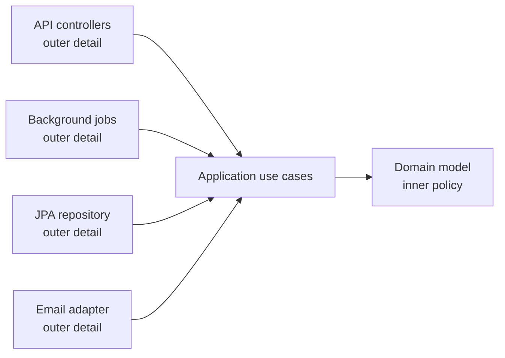
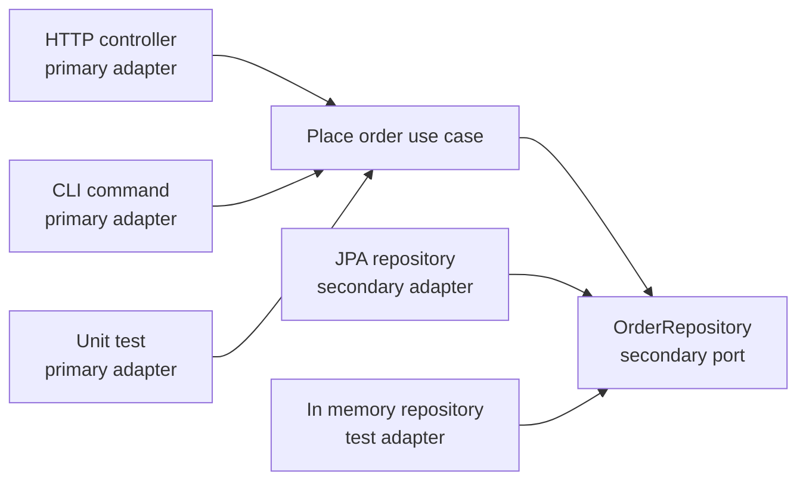

Application architecture is about where code is allowed to live and which direction dependencies may point. In an LLD interview, it helps you explain why a design remains testable when the database, HTTP framework, or messaging provider changes.

## Why layering exists

Layers exist because different parts of a system change for different reasons. Business rules change when the domain changes, controllers change when the API contract changes, persistence changes when the database or ORM changes, and UI or transport code changes when the delivery channel changes. If all of those concerns sit in one class, every change has a larger blast radius than it should.

The goal is not ceremony. The goal is to make the important rules easy to test and hard to accidentally couple to details.

| Concern | Owns | Should not own |
|---|---|---|
| Domain | Business concepts, invariants, value objects, aggregate behavior | SQL, HTTP attributes, JSON serialization |
| Application | Use cases, transactions, authorization decisions, orchestration | Framework-specific controllers or ORM mappings |
| Interface adapters | Controllers, presenters, API request and response models | Core business rules |
| Infrastructure | Databases, message brokers, email, external APIs, file storage | Policy decisions about the domain |

> [!KEY]
> The dependency rule is the whole point: source code dependencies should point toward policy and away from details. Domain code can be used without loading the web framework, ORM, or cloud SDK.

## Classic N tier and where it rots

Classic N-tier architecture usually starts as Presentation -> Business Logic -> Data Access. It is easy to explain and often enough for a small CRUD application. The trouble starts when "business logic" becomes a bag of transaction scripts, domain objects become DTOs with public setters, and every service method directly knows which database tables and ORM includes are needed.

The most common rot is not that layers exist. It is that the wrong dependencies cross the layer boundary.

| Healthy N-tier | Rotten N-tier |
|---|---|
| Controllers translate HTTP into use case calls | Controllers validate, calculate, save, and publish messages |
| Business layer owns rules and workflow | Business layer passes entities through to the data layer unchanged |
| Data access hides query details | Callers build ORM queries and know table shape |
| DTOs are mapped at the boundary | DTOs leak through every layer and replace the domain model |

A senior answer should be pragmatic: N-tier is a reasonable starting point when most operations are simple create, read, update, and delete. It becomes fragile when the domain has real invariants, multiple entry points, or persistence details start dictating object design.

## Clean and Onion dependency rule

Clean Architecture and Onion Architecture use concentric rings to say the same thing more forcefully than N-tier: the domain sits at the center, and details sit outside it. The inner rings define policy. The outer rings contain mechanisms.



Clean Architecture normally names rings as entities, use cases, interface adapters, and frameworks. Onion Architecture normally names the center as domain model, surrounded by domain services, application services, and infrastructure. The terms differ, but the design rule is the same: the database and framework are replaceable details, not the center of the model.

| Ring | What belongs there | Example |
|---|---|---|
| Domain | Entities, value objects, invariants, domain events, domain services | `Order`, `Money`, `CanShip` rule |
| Application | Use cases, command handlers, transactions, ports, DTOs | `PlaceOrderHandler`, `OrderRepository` |
| Interface adapters | Controllers, presenters, API mappers, CLI commands | `OrdersController`, `OrderResponse` |
| Infrastructure | ORM mappings, repositories, email clients, queues, cloud SDKs | `JpaOrderRepository`, `SmtpEmailSender` |

> [!WARNING]
> Clean Architecture is not a folder naming exercise. If the domain module references JPA/Hibernate, Spring MVC, or a generated API client, the dependency rule is already broken even if the folders look clean.

## Ports and Adapters

Hexagonal Architecture, also called Ports and Adapters, describes the same boundary with a different metaphor. The application core exposes or consumes ports, and adapters translate between the outside world and those ports.

There are two directions to name clearly:

| Adapter type | Also called | Initiates what | Examples |
|---|---|---|---|
| Primary | Driving adapter | Calls into the application | HTTP controller, CLI command, scheduled job, test |
| Secondary | Driven adapter | Is called by the application through a port | SQL repository, payment gateway, email sender, message publisher |



The primary side is often easy to see: a user request, job, or test invokes a use case. The secondary side is where candidates often slip. The core should not know `SqlOrderRepository` or `SmtpEmailSender`; it should know a port such as `OrderRepository` or `NotificationGateway`, and the adapter implements that port outside the core.

## Dependency inversion in code

Dependency inversion is what makes the dependency rule enforceable in a real codebase. The application layer defines what it needs, and infrastructure supplies the implementation. The composition root wires them together at startup.

```java
public interface OrderRepository {
    Optional<Order> findById(UUID id);
    void save(Order order);
}

public final class ConfirmOrderHandler {
    private final OrderRepository orders;

    public ConfirmOrderHandler(OrderRepository orders) {
        this.orders = orders;
    }

    public void handle(UUID orderId) {
        Order order = orders.findById(orderId)
            .orElseThrow(() -> new IllegalStateException("Order not found."));

        order.confirm();
        orders.save(order);
    }
}
```

The handler has no JPA/Hibernate dependency and can be tested with an in-memory fake. The JPA implementation belongs outside:

```java
public final class JpaOrderRepository implements OrderRepository {
    private final EntityManager entityManager;

    public JpaOrderRepository(EntityManager entityManager) {
        this.entityManager = entityManager;
    }

    @Override
    public Optional<Order> findById(UUID id) {
        return entityManager
            .createQuery("select o from Order o left join fetch o.lines where o.id = :id", Order.class)
            .setParameter("id", id)
            .getResultStream()
            .findFirst();
    }

    @Override
    @Transactional
    public void save(Order order) {
        entityManager.merge(order);
    }
}
```

This is not about hiding every implementation behind an interface. It is about putting interfaces on boundaries where details are volatile, slow, external, or hard to test.

## Keeping frameworks out of the domain

Framework and persistence concerns creep in through convenient annotations, base classes, lazy-loading proxies, and public setters. They seem harmless at first because they reduce mapping code, but they make the domain obey the framework's construction and lifecycle rules instead of the business rules.

| Pressure | Better boundary |
|---|---|
| ORM needs a parameterless constructor | Keep it private or protected and expose factories that enforce invariants |
| API needs a JSON-friendly shape | Map to request and response DTOs at the controller boundary |
| Database schema differs from the aggregate | Map inside the repository or infrastructure mapper |
| External API model has confusing names | Use an adapter that translates into domain terms |
| Tests need a simple entry point | Test use cases through ports, not controllers or real infrastructure |

> [!TIP]
> A useful interview phrase is: "The architecture should scream the domain, not the framework." A project organized around Orders, Payments, and Inventory communicates more than one organized only around Controllers, Services, and Repositories.

## A practical project structure

In Java, the boundary is easiest to explain with Maven or Gradle module dependencies, not just packages. `myapp-domain` references only the JDK and tiny domain-safe libraries. `myapp-application` references `domain` and defines use cases plus ports. `myapp-infrastructure` references `application` and implements ports. `myapp-api` references `application` and `infrastructure` only because it is the composition root that wires real adapters.

| Module | References | Typical contents |
|---|---|---|
| `myapp-domain` | None | Aggregates, value objects, domain events, domain services |
| `myapp-application` | `domain` | Command handlers, query handlers, ports, DTOs, validation |
| `myapp-infrastructure` | `application`, `domain` | JPA/Hibernate mappings, Flyway/Liquibase migrations, external clients, adapter implementations |
| `myapp-api` | `application`, `infrastructure` | Controllers, filters, authentication, dependency injection wiring |

The API module knowing infrastructure is acceptable because startup code chooses concrete adapters. What would be wrong is `application` referencing `infrastructure` to construct `JpaOrderRepository`, or `domain` referencing Spring MVC or Jackson annotations to satisfy serialization. In interviews, naming the module dependency rule is often more convincing than drawing another circle because it shows how the architecture fails at compile time when someone points a dependency the wrong way.

## Cost and when simpler wins

Every boundary has a cost: more projects, more mapping, more interfaces, more tests that need fakes, and more concepts for new engineers to learn. That cost is worth paying when the domain is complex, infrastructure changes independently, or multiple entry points need the same rules. It is not worth paying for a two-screen internal CRUD tool where the fastest and clearest design is a controller, a small service, and direct ORM access.

| Situation | Reasonable structure |
|---|---|
| Simple admin CRUD with low change rate | Thin controller plus ORM-backed service |
| Domain has important invariants | Domain plus application layer plus infrastructure adapters |
| Multiple delivery channels call the same rules | Hexagonal ports with primary adapters |
| Persistence or vendors are likely to change | Ports for repositories and external gateways |
| Team is large and boundaries must be enforced | Separate projects or modules with reference rules |

The senior answer is not "always Clean Architecture." It is "I will keep the domain independent when the domain is valuable enough to protect, and I will start simpler when indirection is not earning its keep."

## Cheat sheet

- Layers separate reasons to change: domain rules, use cases, delivery mechanisms, and infrastructure.
- Classic N-tier is fine for simple CRUD, but rots when services become transaction scripts and persistence leaks upward.
- Clean Architecture and Onion Architecture both enforce inward dependencies toward domain policy.
- Hexagonal Architecture names the edges: primary adapters drive the app, secondary adapters are driven by the app through ports.
- The application defines ports such as repositories and gateways; infrastructure implements them.
- Frameworks, ORM attributes, generated clients, and serialization models should not dictate the domain model.
- Use module dependencies, package rules, and the composition root to enforce architecture physically.
- Mapping code is not always waste; it buys isolation where boundaries matter.
- Simpler structures are correct when the domain is mostly CRUD and the team does not need the extra indirection.

## Common mistakes

| Mistake | Fix |
|---|---|
| Treating Clean Architecture as folder names | Enforce source dependencies so inner layers cannot reference outer details |
| Putting repository interfaces in infrastructure | Define ports where they are consumed, then implement them in infrastructure |
| Letting controllers contain business decisions | Translate HTTP at the edge and call application use cases |
| Returning ORM entities directly from APIs | Map to response DTOs at the adapter boundary |
| Wrapping every class in an interface | Abstract volatile boundaries, not stable one-implementation helpers |
| Using hexagonal diagrams but making the core call concrete adapters | Make the core call ports and let adapters implement those ports |

## Summary

Layered, Clean, Onion, and Hexagonal architectures are all ways to protect policy from details. The important rule is dependency direction: domain and application code should not depend on frameworks, databases, or external vendors. Use ports and adapters when a boundary buys testability, replaceability, or multiple entry points, and keep the structure simpler when the extra mapping and indirection are not paying for themselves.

## Top Interview Questions

### Q1. What problem does application layering solve in an LLD design?

Layering solves the problem of unrelated reasons to change being mixed into the same code. A controller changes because the HTTP contract changes, an aggregate changes because a business invariant changes, a repository changes because the database query or ORM mapping changes, and an email adapter changes because a vendor changes. If those concerns are tangled together, every feature has a larger blast radius and tests need too much infrastructure. A good layered design gives each concern a boundary and a dependency direction. In an interview, I would say the point is not ceremony; it is making core rules testable without the web server, database, or cloud SDK and making future changes local rather than contagious.

### Q2. How is classic N-tier architecture different from Clean Architecture?

Classic N-tier usually describes a top-down stack: presentation calls business logic, business logic calls data access. It is simple and often fine for CRUD, but many implementations put the database effectively at the center because business objects and services know the ORM shape. Clean Architecture is stricter. It says dependencies point inward toward policy: controllers, databases, and frameworks are outer details; use cases and domain rules are inner policy. The application can define an `OrderRepository`, but the JPA implementation lives outside. The key difference is not the number of layers but who depends on whom. Clean Architecture makes it impossible, or at least obviously wrong, for the domain to depend on infrastructure.

### Q3. What is the dependency rule, and how do you enforce it in code?

The dependency rule says source code dependencies should point toward higher-level policy and away from low-level details. Domain depends on nothing, application depends on domain, and infrastructure depends inward on application or domain abstractions. You enforce it with module dependencies and package rules: the domain module has no ORM or web framework dependency; the application module defines ports; the infrastructure module implements them; the API module wires implementations into the dependency injection container. Code review alone is not enough because accidental references creep in. A physical project structure that prevents the wrong reference from compiling is the strongest enforcement.

### Q4. What goes in the domain layer versus the application layer?

The domain layer contains business concepts and rules that are true regardless of delivery mechanism: entities, value objects, aggregate behavior, invariants, domain events, and domain services when a rule spans entities. The application layer contains use case orchestration: command handlers, query handlers, transaction boundaries, authorization checks, calls to repositories or gateways, and mapping between use case inputs and outputs. A useful test is whether the code would still be meaningful in a CLI app or a background job. If yes, it may belong in domain or application. If it exists only because of HTTP, JSON, JPA/Hibernate, or a queue provider, it belongs outside the core.

### Q5. Explain primary and secondary adapters in Hexagonal Architecture.

Primary adapters, also called driving adapters, initiate work by calling into the application. Examples are HTTP controllers, CLI commands, scheduled jobs, message consumers, and even tests. Secondary adapters, also called driven adapters, are called by the application through ports it owns. Examples are SQL repositories, payment gateways, email senders, caches, and message publishers. The distinction matters because dependency direction differs from runtime call direction. The application core may call `EmailSender`, but the concrete `SmtpEmailSender` adapter depends on that port, not the other way around. This lets the same use case be driven by HTTP today, a job tomorrow, and a test fake immediately.

### Q6. Why should framework and persistence concerns stay out of the domain model?

Framework and persistence details change for reasons unrelated to the business. If the domain model inherits from an ORM base class, exposes setters only because the mapper needs them, carries JSON attributes for API serialization, or references HTTP request types, the domain can no longer be tested or evolved independently. Worse, framework constraints can weaken invariants: a public parameterless constructor and public setters make invalid states easier to create. The better approach is to keep the domain focused on business behavior and map at boundaries. Repositories or infrastructure mappers can translate between database shape and aggregate shape, while controllers map between API contracts and use case inputs.

### Q7. When would you use Clean or Hexagonal Architecture, and when would you avoid it?

I would use it when the domain has meaningful rules, multiple entry points need the same behavior, infrastructure is likely to change, or the team is large enough that boundaries need enforcement. It pays off when I can test a use case with fake ports and no database, or change an email vendor without touching business logic. I would avoid full ceremony for simple internal CRUD tools, prototypes, or services where every operation is a thin table edit and the team values speed over long-lived domain modeling. In those cases, direct ORM use behind a small service may be clearer. The senior answer is to price the indirection rather than applying it by default.

### Q8. How does dependency inversion help keep architecture clean?

Dependency inversion lets high-level policy define what it needs instead of depending on a low-level implementation. The application layer can define `OrderRepository` or `PaymentGateway`, and the infrastructure layer provides `JpaOrderRepository` or `StripePaymentGateway`. That means the application depends on abstractions it owns, while details depend inward on those abstractions. In practice, this gives three benefits: tests can use fakes without JPA/Hibernate or external services, infrastructure can be swapped without changing use cases, and the dependency graph obeys the architecture rule. The key nuance is not to add interfaces everywhere. Put them at boundaries where the dependency is slow, external, volatile, or hard to test.

### Q9. How would you migrate a messy layered application toward a cleaner architecture without a rewrite?

I would migrate one seam at a time. First, identify a use case whose business logic is currently mixed with controller and data access code. Extract a handler or application service for that use case, and define only the ports it needs. Second, move business rules into domain methods or value objects so the handler orchestrates rather than calculates everything itself. Third, implement the ports with the existing database code, leaving the schema unchanged. Fourth, redirect the existing controller to call the handler. This creates one clean vertical path without a big-bang rewrite. Repeat for high-change or high-risk use cases first, not for every CRUD endpoint.

### Q10. What are signs that an architecture has too much indirection?

Signs include interfaces with one implementation and no expected variation, DTO-to-DTO mapping chains that do not protect a real boundary, services whose only method forwards to another service, and tests that require more fake setup than the production behavior being tested. Another sign is team confusion: engineers spend more time finding the correct layer than understanding the domain rule. The fix is not to delete all boundaries, but to ask which ones are earning their keep. Keep boundaries around volatile infrastructure, external systems, and rich domain rules. Collapse ceremony around simple helpers, stable code, or CRUD paths where directness improves readability without increasing risk.
