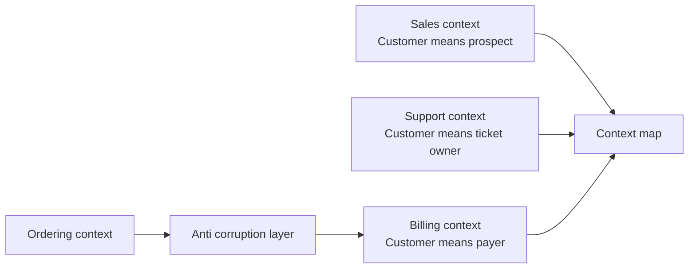

Domain-driven design is useful when the hard part of the system is the business model, not the framework plumbing. It gives you language for drawing boundaries, protecting invariants, and deciding how persistence should support the model instead of controlling it.

## Strategic DDD

Strategic DDD starts before classes and tables. It asks which model is valid in which part of the business, who owns that model, and how teams translate between models without pretending one universal object can satisfy everyone.

The first tool is ubiquitous language: the shared vocabulary used by domain experts and developers inside a bounded context. If the business says "reservation" and the code says "booking," every conversation has a translation tax. In a strong design, class names, method names, events, and API contracts use the same words the domain uses.

The second tool is the bounded context: an explicit boundary inside which a model is consistent. The same word can mean different things in different contexts, and that is not a bug.



| Strategic concept | Interview explanation | Practical output |
|---|---|---|
| Ubiquitous language | Code and conversations use the same domain terms | Glossary, event names, aggregate names |
| Bounded context | A model is valid only within an explicit boundary | Context map, module boundary, service boundary |
| Context mapping | Relationship between contexts is named deliberately | Shared kernel, customer supplier, conformist, anti-corruption layer |
| Anti-corruption layer | Translation protects your model from another model | Adapter that maps external terms into local domain terms |

> [!KEY]
> A bounded context is not automatically a microservice. It is first a model boundary. It can live inside a modular monolith, a separate package, or a service depending on team and operational needs.

## Tactical DDD building blocks

Tactical DDD is the code-level vocabulary: entities, value objects, aggregates, domain events, domain services, and factories. Use these when they clarify rules. Do not use them to decorate simple CRUD with extra nouns.

| Building block | Use when | Example |
|---|---|---|
| Entity | Identity matters over time even if attributes change | `Order`, `Customer`, `Shipment` |
| Value object | Equality is by value and the object should be immutable | `Money`, `Address`, `DateRange` |
| Aggregate | A cluster must enforce invariants as one consistency boundary | `Order` with `OrderLine` children |
| Aggregate root | One object is the only external entry point to an aggregate | `Order.AddLine`, not `OrderLine.Quantity = 5` |
| Domain event | Something meaningful happened inside the domain | `OrderConfirmed` |
| Domain service | A domain rule spans objects and belongs to no single entity | `PricingPolicy`, `FundsTransferService` |
| Factory | Construction has rules that do not fit a constructor cleanly | `Order.CreateDraft` |

```java
public record Money(BigDecimal amount, String currency) {
    public Money {
        Objects.requireNonNull(amount);
        Objects.requireNonNull(currency);
    }

    public Money add(Money other) {
        if (!currency.equals(other.currency())) {
            throw new IllegalArgumentException("Currency mismatch.");
        }
        return new Money(amount.add(other.amount()), currency);
    }
}

public final class Order {
    private final UUID id;
    private final List<OrderLine> lines = new ArrayList<>();
    private final List<DomainEvent> events = new ArrayList<>();
    private OrderStatus status = OrderStatus.DRAFT;

    public Order(UUID id) {
        this.id = id;
    }

    public UUID getId() { return id; }
    public OrderStatus getStatus() { return status; }
    public List<OrderLine> getLines() { return List.copyOf(lines); }
    public List<DomainEvent> getEvents() { return List.copyOf(events); }

    public void addLine(UUID productId, int quantity, Money price) {
        if (status != OrderStatus.DRAFT) throw new IllegalStateException("Order is locked.");
        if (quantity <= 0) throw new IllegalArgumentException("quantity must be positive");
        lines.add(new OrderLine(productId, quantity, price));
    }

    public void confirm() {
        if (lines.isEmpty()) throw new IllegalStateException("Cannot confirm an empty order.");
        status = OrderStatus.CONFIRMED;
        events.add(new OrderConfirmed(id, Instant.now()));
    }
}
```

The important detail is not the event list. It is that invalid state is impossible through the public API: callers cannot confirm an empty order or mutate lines after confirmation.

## Aggregates and invariant boundaries

An aggregate is a consistency boundary. All changes that must be immediately consistent belong inside the same aggregate and are made through its root. External objects hold the aggregate root's ID, not direct references to its internal children.

| Rule | Why it matters |
|---|---|
| Only the root is loaded and saved directly | Persistence follows the consistency boundary |
| Children are modified through root methods | Invariants stay centralized |
| Other aggregates are referenced by ID | Avoids accidental large object graphs and cross-aggregate transactions |
| One transaction updates one aggregate when possible | Keeps concurrency and locking manageable |

This is why repository-per-table is usually wrong in a DDD model. If `OrderLine` cannot be changed independently of `Order`, an `IOrderLineRepository` invites callers to bypass the root. A repository per aggregate root preserves the model's rule: load the root, ask it to change itself, save the root.

> [!WARNING]
> A service class that sets entity properties from the outside is often an anemic domain model in disguise. If a rule must always hold, put it behind a method on the aggregate or value object that owns the invariant.

## Repository and Unit of Work

A repository abstracts persistence behind a collection-like interface for aggregates. A unit of work groups changes and commits them atomically. In Java, a JPA `EntityManager` or Spring Data repository can already cover much of the repository/unit-of-work role, so the question is when an extra abstraction earns its cost.

```java
public interface OrderRepository {
    Optional<Order> findById(UUID id);
    void add(Order order);
}

public interface UnitOfWork {
    int commit();
}

public final class PlaceOrderHandler {
    private final OrderRepository orders;
    private final UnitOfWork unitOfWork;

    public PlaceOrderHandler(OrderRepository orders, UnitOfWork unitOfWork) {
        this.orders = orders;
        this.unitOfWork = unitOfWork;
    }

    public UUID handle(PlaceOrder command) {
        Order order = OrderFactory.create(command.customerId(), command.items());
        orders.add(order);
        unitOfWork.commit();
        return order.getId();
    }
}
```

| Choice | Good fit | Risk |
|---|---|---|
| Direct `EntityManager` / Spring Data repository | Small CRUD service, low domain complexity | JPA/Hibernate and query details leak into application code |
| Specific repository per aggregate | Rich domain model, test seam, non-trivial queries | More interfaces and mapping code |
| Generic repository | Simple scaffolding with uniform CRUD | Weak domain language and too many irrelevant methods |
| Unit of work interface | Multiple repositories share one transaction boundary | Duplicate abstraction if callers already use the transaction manager cleanly |

> [!NOTE]
> A balanced interview answer is: "For simple CRUD I may inject a Spring Data repository or `EntityManager` directly. For aggregate-rich domains, caching, partition-key logic, or test seams, I define specific repositories and let the transaction manager implement the unit of work."

## The leaky queryable repository

A repository that returns a JPA `CriteriaQuery`, Hibernate `Query`, or Spring Data executor looks flexible, but it leaks the ORM into callers. The caller now decides fetch joins, filters, translation limits, and execution timing. That means query logic is scattered across use cases and tests must understand JPA/Hibernate behavior.

```java
public interface OrderRepository {
    CriteriaQuery<Order> orders(); // Leaks JPA query composition to callers.
}

public interface BetterOrderRepository {
    Optional<Order> findWithLines(UUID orderId);
    List<Order> find(OrderSpecification spec);
}
```

The improved version says what the application needs in domain terms. When query combinations are reusable, a specification can carry the predicate without exposing the entire ORM surface.

```java
public interface OrderSpecification {
    Predicate toPredicate(Root<Order> root, CriteriaBuilder cb);
}

public final class PendingOrdersForCustomer implements OrderSpecification {
    private final UUID customerId;

    public PendingOrdersForCustomer(UUID customerId) {
        this.customerId = customerId;
    }

    @Override
    public Predicate toPredicate(Root<Order> order, CriteriaBuilder cb) {
        return cb.and(
            cb.equal(order.get("customerId"), customerId),
            cb.equal(order.get("status"), OrderStatus.DRAFT));
    }
}
```

Specification is most useful when predicates are meaningful domain concepts reused in multiple places. It is overkill for a one-off filter in a simple query handler.

## CQRS and the read side

CQRS separates commands that change state from queries that read state. In a DDD-heavy write path, commands should load aggregates and enforce invariants. Reads often do not need aggregates at all; they need fast, shaped DTOs.

| Side | Model | Persistence style |
|---|---|---|
| Command side | Rich aggregate with invariants | Repository plus unit of work |
| Query side | Flat DTO or read model | Direct SQL, view, projection, cache, search index |
| Validation | Business rules and invariants | Input filters, authorization, query parameters |
| Scaling pressure | Consistency and transaction correctness | Latency, denormalization, pagination |

CQRS does not require a separate database, asynchronous projections, or event sourcing. A practical version can be one database with command handlers using repositories and query handlers using optimized SQL or views. The key is that the read model is allowed to be shaped for the question being asked instead of forcing every read through aggregate reconstruction.

> [!DANGER]
> Do not use DDD terminology to hide simple table operations. If there are no invariants, no domain language, and no meaningful consistency boundary, aggregates and repositories can become ceremony rather than design.

## When DDD is over-engineering

DDD is expensive because it requires domain conversations, careful naming, boundaries, mapping, and team discipline. That is a good investment when misunderstandings are costly and rules are complex. It is waste when the problem is mostly data entry.

| Use DDD when | Keep it simpler when |
|---|---|
| Business rules are complex and change often | Operations are basic CRUD |
| Domain experts use precise language | Nobody cares about domain vocabulary |
| Invariants must be protected in code | Database constraints are enough |
| Multiple models use the same word differently | One team owns one simple data model |
| The model will live for years | A prototype or back-office tool needs speed |

The senior signal is restraint. Apply strategic DDD to find boundaries, tactical DDD to protect real rules, and persistence patterns where they support the model.

## Cheat sheet

- Ubiquitous language means code uses the same terms domain experts use inside a bounded context.
- Bounded contexts define where a model is valid; they are model boundaries before they are service boundaries.
- Anti-corruption layers translate external models so they do not pollute your local domain.
- Entities have identity; value objects have value equality and should be immutable.
- Aggregates are consistency boundaries; the aggregate root is the only external entry point.
- Repositories should be per aggregate root, not per table.
- JPA `EntityManager` and Spring transactions already provide unit-of-work behavior; wrap them when the abstraction buys testability or protects domain rules.
- Returning ORM query objects from repositories leaks persistence concerns and scatters query logic.
- Specification encapsulates reusable query predicates, but is not needed for every filter.
- CQRS can mean separate handlers and models without separate databases or event sourcing.

## Common mistakes

| Mistake | Fix |
|---|---|
| Forcing one shared `Customer` model across unrelated contexts | Define bounded contexts and translate between them |
| Creating repositories for every table | Create repositories for aggregate roots only |
| Letting services set entity state directly | Move invariant-protecting behavior into aggregate methods |
| Treating `EntityManager` or Spring Data as always forbidden | Use them directly for simple CRUD, abstract persistence for rich domains or volatile storage |
| Returning ORM query objects from a repository | Expose domain-specific methods or specifications |
| Applying CQRS as separate infrastructure by default | Start with separate command and query models, then split storage only when needed |
| Naming everything `SomethingService` | Use domain names that reveal the business concept and responsibility |

## Summary

DDD is about modeling a business accurately enough that the code protects its language and rules. Strategic DDD gives you ubiquitous language, bounded contexts, context maps, and anti-corruption layers; tactical DDD gives you entities, value objects, aggregates, events, services, and factories. Repository, unit of work, specification, and CQRS are persistence tools that should support those boundaries, not replace them with generic data-access ceremony.

## Top Interview Questions

### Q1. What is ubiquitous language, and why does it matter?

Ubiquitous language is the shared vocabulary used by domain experts and engineers inside a bounded context, and it should show up directly in code. If the business says "reservation" but the code says "booking" and the database says "hold," every conversation requires translation and subtle rule differences get lost. In practice, ubiquitous language influences class names, method names, domain events, API fields, and design docs. It matters in interviews because it shows you are not just arranging objects; you are modeling the business. A strong answer includes a boundary: the same word can mean something different in another bounded context, and that is handled by translation rather than forcing one universal model.

### Q2. What is a bounded context?

A bounded context is an explicit boundary within which a domain model and its language are consistent. For example, `Customer` in a billing context may mean a payer with invoices and payment methods, while `Customer` in a support context may mean a ticket owner with SLA information. Trying to force those into one shared class usually creates a bloated model with optional fields and unclear rules. A bounded context lets each model stay clean and then defines how contexts communicate. The practical output might be a module boundary in a monolith, a package boundary, or a service boundary, but it is first a modeling decision, not automatically a deployment decision.

### Q3. Explain entity versus value object with an example.

An entity has identity that matters over time even when its attributes change. An `Order` remains the same order if its status changes from draft to confirmed because its identity is the order ID. A value object has no identity; equality is based on its values. `Money(10, "USD")` equals another `Money(10, "USD")` regardless of where it was created. Value objects should usually be immutable because changing them in place blurs their value semantics. In Java 17, records are a good fit for many value objects, with validation in the compact constructor. A strong example also mentions behavior: `Money.Add` should reject adding different currencies because that invariant belongs with the value.

### Q4. What is an aggregate root, and why does only the root get a repository?

An aggregate root is the public entry point to a cluster of entities and value objects that must maintain invariants together. External code loads the root, asks it to perform behavior, and saves the root. Child objects are not changed independently because doing so could bypass rules. For an `Order`, the `Order` root may own `OrderLine` children and enforce "cannot modify lines after confirmation." If there is an `IOrderLineRepository`, a caller can change line quantity without asking the order, breaking that rule. That is why repositories are per aggregate root, not per table. Persistence follows the consistency boundary of the model.

### Q5. What is the difference between a domain service and an application service?

A domain service contains domain logic that does not naturally belong to one entity or value object, often because it spans multiple aggregates. It should be stateless and speak domain language, such as a `FundsTransferPolicy` deciding whether a transfer between two accounts is allowed. An application service orchestrates a use case: load aggregates, call domain behavior, manage transactions, call repositories or gateways, and return a result. If a service knows about HTTP, transactions, repositories, or DTO mapping, it is probably application-layer orchestration. If it contains a pure business rule that domain experts would recognize and that rule has no natural entity owner, it may be a domain service.

### Q6. Why is returning ORM query objects from a repository considered a leak?

Returning `CriteriaQuery`, Hibernate `Query`, or a Spring Data executor exposes the ORM's query model to application code. The caller now decides how to compose filters, when the query executes, which includes are required, and which expressions can translate to SQL. That removes most of the value of the repository because persistence details and query performance are now spread across handlers. It also makes tests misleading: an in-memory fake may accept predicates that JPA/Hibernate cannot translate. A better repository exposes domain-specific methods like `findWithLines` or accepts a specification object for reusable predicates. The repository keeps control over includes, execution, and persistence-specific optimization.

### Q7. Are JPA `EntityManager` and Spring Data repositories already repository and unit-of-work tools?

Yes, partly. Spring Data repositories provide collection-like access to entities, and a JPA `EntityManager` inside a transaction tracks changes until commit, which is unit-of-work behavior. That is why wrapping them mechanically for every CRUD table can be redundant. The counterargument is architectural: application code that directly depends on JPA/Hibernate now depends on a persistence detail, and tests may need ORM behavior to run. My rule is pragmatic. For simple CRUD, using Spring Data or `EntityManager` directly can be clearer. For rich aggregates, non-trivial query logic, caching, partition keys, or a need for clean test fakes, a specific repository and unit-of-work abstraction earns its cost.

### Q8. What is the Specification pattern, and when is it useful?

Specification encapsulates a predicate or business selection rule as an object that can be reused and composed. In a C# persistence model, a specification often exposes a JPA `Predicate` or Spring Data `Specification<T>` so the ORM can translate it to SQL, while also giving the concept a domain name such as `PendingOrdersForCustomer`. It is useful when the same filter appears in multiple queries, when predicates need to be combined, or when you want query rules named and tested independently. It is not useful for every one-off filter. If a query handler has a single obvious condition used nowhere else, a specification may add indirection without improving clarity.

### Q9. How does CQRS change the read side in a DDD application?

In a DDD application, the write side usually needs aggregates because commands must enforce invariants. The read side often does not need aggregates; it needs data shaped for a screen, report, or API response. CQRS lets command handlers use repositories and rich domain objects, while query handlers read directly into DTOs from optimized SQL, a view, a cache, or a projection. This avoids reconstructing an aggregate just to display a list. CQRS does not require event sourcing or a separate database. A simple version is separate command and query handlers over the same database. Split storage only when read performance or independent scaling justifies the extra consistency work.

### Q10. When is DDD over-engineering?

DDD is over-engineering when the domain has few rules, the operations are mostly CRUD, and the team gains no clarity from aggregates, factories, domain events, or repositories. A small admin tool with five tables and simple validation may be easier to maintain with controllers, DTOs, and direct ORM access. DDD has costs: more mapping, more concepts, more conversations, and more discipline around boundaries. It pays off when business language is nuanced, invariants are important, multiple contexts use different meanings for the same term, or the model will evolve for years. The senior answer is not "always use DDD"; it is "use DDD where the business complexity justifies the modeling cost."
