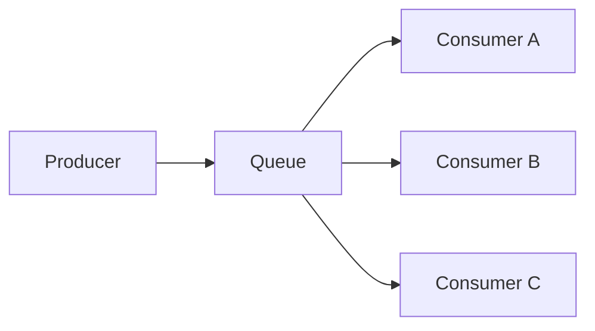
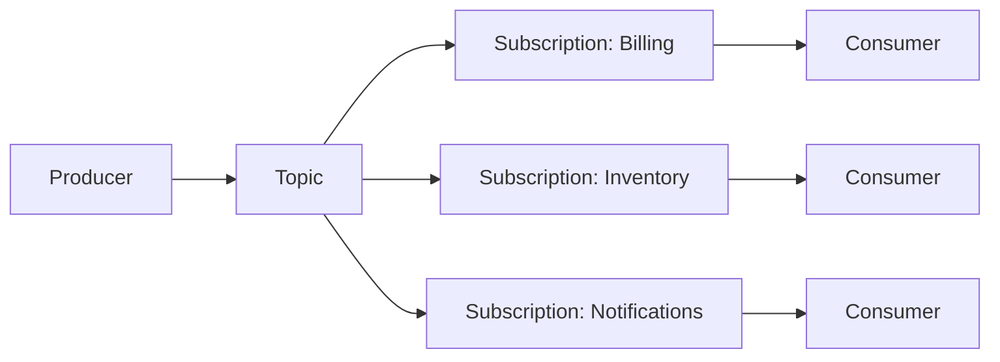
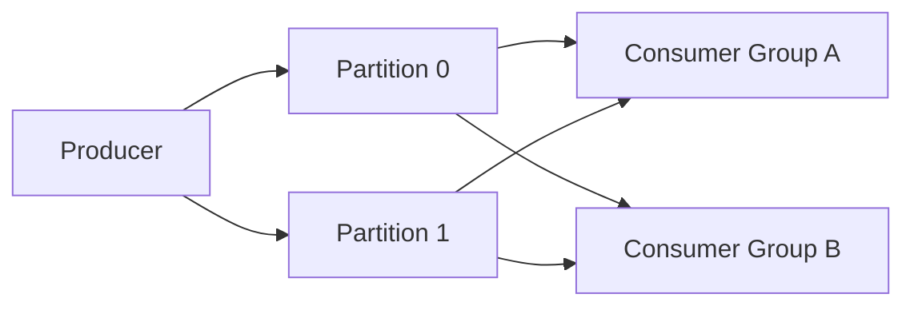

"Messaging" is not one thing. A competing-consumer queue, a publish-subscribe topic and a partitioned append-only log solve different problems, and interviewers use this question to check whether you actually understand the systems you have operated or just know the product names.

## The three consumption models

Every messaging technology is fundamentally one of these three shapes, sometimes with a second shape layered on top (Service Bus topics are pub-sub built out of per-subscription queues; Kafka is a log that can emulate a queue with a single-partition topic).

| Property | Competing-consumer queue | Publish-subscribe topic | Partitioned append-only log |
|---|---|---|---|
| Consumption model | One consumer per message, load-shared | Every subscriber gets its own copy | Every consumer group gets its own copy, ordered by offset |
| Retention | Message deleted on ack (or TTL) | Deleted per-subscription on ack | Time/size based, independent of consumption |
| Replay | Not possible once acked | Not possible once acked (per subscription) | First-class — rewind offset, re-read history |
| Ordering | FIFO only with sessions/message groups | FIFO only within a session, per subscription | Strict within a partition, none across partitions |
| Scaling unit | Add consumers up to prefetch limits | Add subscriptions (fan-out), consumers per subscription | Add partitions; consumers per group ≤ partitions |
| Fan-out | None — one logical consumer group | Native — N subscribers, N independent reads | Native — N consumer groups, independent offsets |
| Typical products | Azure Service Bus queue, SQS, RabbitMQ queue | Service Bus topics, SNS+SQS, RabbitMQ exchange | Kafka, Event Hubs, Kinesis |

> [!KEY]
> A queue answers "who does this work item?" A topic answers "who needs to know this happened?" A log answers "what is the full history of what happened, and can I replay it?" Picking the wrong one shows up months later as a redesign.

## Competing-consumer queues

A queue holds work items; each item is handed to exactly one consumer instance, and consumers compete for the next item. This is the shape you want for **task distribution** — order processing, image resizing, sending an email — where the unit of work should be done once and then forgotten.



Adding consumers increases throughput almost linearly until you hit contention on the queue itself or on a downstream resource. There is no concept of "replay" — once a message is acknowledged it is gone, so a queue is a poor audit log.

## Publish-subscribe topics

A topic broadcasts each message to every subscription. Each subscription behaves like its own private queue with its own cursor, its own dead-letter queue and (in Service Bus) its own filters. This is the shape for **fan-out** — one `OrderPlaced` event needs to trigger billing, inventory and notifications independently, each at its own pace, each able to fail without affecting the others.



Scaling a topic means scaling the number of *subscriptions* for fan-out, and the number of consumers *per subscription* for throughput within one subscriber. Like a queue, once a subscription acks a message it is gone from that subscription — there is no replay across time.

## Partitioned append-only logs

A log — Kafka, Event Hubs, Kinesis — does not delete messages when they are read. It appends every message to a partition and hands each consumer group an independent, movable offset into that partition. Consumers pull; nothing is "removed" by reading it.



> [!TIP]
> Say this out loud in an interview: "a log is not a queue with extra steps — it decouples *retention* from *consumption*." A queue's lifetime is tied to whether someone has acked the message; a log's lifetime is tied to a retention policy (7 days, 100 GB, forever) regardless of who has read it.

This unlocks replay: a new consumer group can start at offset zero and rebuild derived state from history, or a fixed consumer can rewind after a bug to reprocess the last hour. The cost is that ordering is only guaranteed **within a partition**, and consumers must track their own offsets.

A Kafka-style topic makes this concrete: messages accumulate per topic while a consumer's cursor moves forward through them independently of whether older entries are ever deleted.


## Message brokers vs event streaming platforms

| Aspect | Message broker (Service Bus, RabbitMQ, SQS) | Event streaming platform (Kafka, Event Hubs) |
|---|---|---|
| Primary abstraction | Queue / topic with per-message state | Partitioned, ordered, immutable log |
| Delivery | Broker pushes or consumer locks/completes one message | Consumer pulls a batch and tracks its own offset |
| Message removal | On ack / TTL / dead-letter | Never on read — only by retention policy |
| Multiple independent readers | Needs a subscription per reader | Native — any number of consumer groups |
| Ordering guarantee | Per queue, or per session/message-group | Per partition |
| Best for | Task distribution, request/reply, workflow steps | Event sourcing, analytics pipelines, audit trail, CDC |

RabbitMQ and Kafka are the two products that get compared most often in this debate, and it helps to see them side by side even though both fit the same producer-broker-consumer shape at a glance:


That difference shows up operationally too — RabbitMQ ships as a single binary with simple clustering and a management UI, while Kafka's partition management and (historically) ZooKeeper coordination give it more moving parts to run:


> [!WARNING]
> Don't say "Kafka is just a faster queue." It fails as a queue when you need per-message state like completion, abandon, or a real dead-letter queue with individual redelivery — Kafka has none of these built in; you build them in the consumer.

The API shape reflects the model directly — a broker gives you per-message completion, a log gives you an offset you commit yourself:

```csharp
// Broker (Service Bus): per-message completion, no replay
await using var receiver = client.CreateReceiver("orders-queue");
ServiceBusReceivedMessage msg = await receiver.ReceiveMessageAsync();
await ProcessAsync(msg.Body);
await receiver.CompleteMessageAsync(msg); // gone — cannot be re-read

// Log (Kafka): consumer owns and commits its own offset — replay is just resetting it
var result = consumer.Consume(TimeSpan.FromSeconds(1));
await ProcessAsync(result.Message.Value);
consumer.Commit(result); // advances offset; a new group (or a reset) can still re-read this record
```

## When each is right

- **Task to be done exactly once by somebody** → competing-consumer queue.
- **Fact that several independent systems must react to** → pub-sub topic.
- **History that must be replayable, or read at different speeds by different consumers** → partitioned log.
- **High-throughput telemetry, clickstream, or CDC feed** → partitioned log, because per-message broker bookkeeping does not scale to millions of messages per second.
- **Strict per-message workflow (approve, retry, dead-letter this specific item)** → broker queue/topic, because that state model is native there.

## Cheat sheet

- Queue = one consumer per message. Topic = one copy per subscription. Log = one offset per consumer group, replay included.
- Retention is tied to acknowledgement in a broker, and to a time/size policy in a log — this is the core distinction.
- Ordering is never truly global; it's per-queue-session, per-subscription-session, or per-partition. Say this before an interviewer asks it.
- Fan-out is native to topics and logs; you fake it on a raw queue with multiple queues bound to the same source.
- Kafka's "consumer group" is the log's answer to a broker's "queue" — same competing-consumer feel, different retention model.
- If someone needs to ask "can I replay yesterday's traffic," you need a log, not a broker.
- Service Bus topics are pub-sub built from queues under the hood — each subscription is its own queue with its own DLQ.

## Common mistakes

| Mistake | Fix |
|---|---|
| Using Kafka as a simple task queue and reinventing per-message ack/retry/DLQ | Use a broker queue for discrete task distribution unless you also need replay or huge throughput |
| Assuming a topic/queue can be replayed after acknowledgement | Design the audit trail into a log or a database, not the ephemeral broker queue |
| Believing "ordering" means global ordering | Always qualify: ordering per partition, per session, or per queue — never across the whole system |
| Adding more consumers to a Kafka topic than it has partitions | Extra consumers in the group sit idle — partitions are the hard cap on parallelism |
| Treating a topic's multiple subscriptions as one shared cursor | Each subscription has its own independent cursor and DLQ |

## Summary

Queues distribute discrete work items to exactly one consumer and forget them once acked. Topics broadcast the same message to every independent subscriber, each with its own queue-like semantics. Logs decouple retention from consumption entirely, letting many consumer groups read the same immutable history at their own pace and rewind it. Picking between them is really picking between "do this once," "notify everyone," and "keep a replayable history" — state that trade-off explicitly and the rest of the design follows.

## Top Interview Questions

### Q1. What is the fundamental difference between a queue and a topic?

A queue delivers each message to exactly one consumer among a competing pool — it is for distributing work. A topic delivers a copy of each message to every subscription bound to it — it is for broadcasting a fact to multiple independent consumers. Internally, many topic implementations (Service Bus, SNS+SQS) are built from per-subscription queues, so each subscriber still gets queue-like semantics (its own ack, its own dead-letter queue, its own redelivery), but the fan-out happens once at the topic level. The practical test: if two different services need to react to the same event independently, you need a topic; if only one worker should ever process a given item, you need a queue.

### Q2. Why is a partitioned log like Kafka not "just a queue"?

A queue's retention is tied to acknowledgement — read it, ack it, it's gone. A log's retention is tied to a time or size policy and is completely independent of who has read it; reading never removes data. This lets any number of consumer groups read the same partition independently, each tracking its own offset, and lets a consumer group rewind and replay history it has already processed. A queue also gives you per-message state (complete, abandon, dead-letter one specific message) natively; a log gives you none of that — you build retry/DLQ semantics yourself in the consumer, usually with a separate retry topic.

### Q3. How does ordering differ across queues, topics and logs?

None of the three give you free global ordering across all consumers. A broker queue with sessions/message-groups (Service Bus sessions, SQS FIFO message groups) guarantees order only within a session key. A topic's ordering guarantee applies per subscription, per session, independently for each subscriber. A log guarantees order only within a single partition; two messages in different partitions have no ordering relationship, even if produced in order. In all three cases, if you need cross-entity ordering you either accept eventual consistency, use one partition/session per entity, or design the consumer to tolerate reordering with version numbers.

### Q4. When would you choose Kafka over Azure Service Bus for a new pipeline?

Choose Kafka/Event Hubs when you need replay (rebuilding a read model, backfilling a new consumer), very high throughput (hundreds of thousands of messages/second), multiple independent consumer groups reading the same stream at different speeds, or you're building an event-sourced or CDC-style architecture where the log itself is the source of truth. Choose Service Bus when the unit of work needs rich per-message operations — complete, abandon, schedule, defer, session-based ordering, transactional send-and-complete — and volumes are moderate. A senior answer names the deciding factor explicitly rather than a blanket "Kafka is better."

### Q5. Your team put a fan-out use case on a single Service Bus queue with one consumer group reading everything and re-routing internally. What's wrong with this design?

A single queue only gives one logical consumer per message; using one consumer to "re-route" to other systems reintroduces a fragile, hand-rolled fan-out layer, creates a single point of failure, and couples all downstream systems' failure modes to that one router. If billing's handler throws, it can block inventory and notifications too, or you need custom code to isolate them. The fix is a topic with one subscription per downstream system — each gets an independent queue, its own retry policy, its own DLQ, and a failure in one subscription cannot affect another.

### Q6. Explain why a Kafka consumer group cannot use more consumers than partitions.

A partition is the unit of parallelism and ordering. Kafka guarantees that within a partition, only one consumer *in a given group* reads at a time — this is what preserves per-partition ordering. If you add an 11th consumer to a group consuming a 10-partition topic, that 11th consumer is assigned no partitions and sits idle. To gain more parallelism you must add partitions, which is a topic-level, largely irreversible-in-practice change (existing keys can land on different partitions after a repartition, breaking per-key ordering), so partition count is usually chosen generously up front.

### Q7. How would you design an order-processing system: as one queue, or as a topic with a log behind it?

Use a queue (or topic subscription) for the *work* — "process this order" is a discrete task that should happen exactly once, benefits from complete/abandon/dead-letter semantics, and doesn't need replay. Separately, publish an immutable `OrderPlaced`/`OrderShipped` event stream to a log for anything that needs history: analytics, rebuilding a read model, audit, or a new downstream consumer arriving later that needs the last 30 days of orders. This "queue for work, log for facts" split is a common senior-level answer because it avoids overloading one technology with both jobs.

### Q8. What happens to message order in a topic with multiple subscriptions if one subscriber falls behind?

Nothing happens to order — each subscription is completely independent, with its own cursor/queue and its own pace. A slow subscriber (say, notifications) does not block or reorder messages for a fast subscriber (say, billing); it just accumulates a backlog in its own subscription. The risk is entirely local to that subscription: growing backlog, higher latency for that consumer, and possibly hitting the subscription's max size or the message TTL, causing messages to expire or dead-letter — but this never affects sibling subscriptions.

### Q9. Can you replay messages from a Service Bus queue the way you can from Kafka? Why or why not?

Not naturally. Service Bus deletes a message once it is completed (or it expires/dead-letters), so there is no built-in mechanism to "rewind" a queue to reread history — the entire retention model is ack-based, not offset-based. Kafka retains messages for a configured period or size regardless of consumption, and consumers track an independent, movable offset, so replay is just resetting that offset. If you need replay semantics on Service Bus, you must build it yourself — e.g., persist events to a log/table as well and replay from there, or use Service Bus purely for work dispatch and keep the source of truth elsewhere.

### Q10. In production, how do you decide the number of partitions for a new Kafka topic?

Start from your target consumer parallelism and expected per-partition throughput ceiling (a single partition typically sustains a few MB/s to tens of MB/s depending on payload and consumer work). Multiply desired consumers by a comfortable headroom factor, because partition count is expensive to change later — increasing it reshuffles key-to-partition mapping and can break ordering guarantees for keys that move. A common rule of thumb is to size for the throughput and parallelism you expect at 12–24 months, not just launch day, since over-provisioning partitions is far cheaper than a repartitioning migration later.

### Q11. What's the trade-off between using a broker's built-in fan-out (topics) versus consumers publishing further events downstream themselves?

Broker-native fan-out (one producer, N subscriptions) keeps the producer simple and decoupled — it doesn't know or care who is listening, and adding a new subscriber requires no producer change. Consumer-driven re-publishing (a consumer processes a message and emits its own follow-on event) is appropriate when the follow-on event represents a *new fact* derived from processing, not just a copy of the original — e.g., `OrderPlaced` triggers a consumer that emits `PaymentAuthorized` only after successfully charging a card. The trade-off is coupling and latency: native fan-out is faster and simpler for pure broadcast; chained events are necessary when there's real business logic between cause and effect.

### Q12. A junior engineer proposes using Kafka topics for a simple background-job queue (send-email, generate-report). What would you push back on?

I'd ask whether they need replay, huge throughput, or multiple independent consumer groups — if not, Kafka adds operational cost (partition management, consumer offset handling, no native per-message retry/DLQ) for no benefit over a purpose-built queue. Job queues need per-message state: mark this one done, retry that one three times then dead-letter it, delay this one 10 minutes. Kafka doesn't give you that model; you'd have to hand-roll retry topics and poison-message handling. A broker queue (Service Bus, SQS, RabbitMQ) gives you all of that out of the box, with a simpler operational model for a workload that doesn't need a log's replay guarantees.
