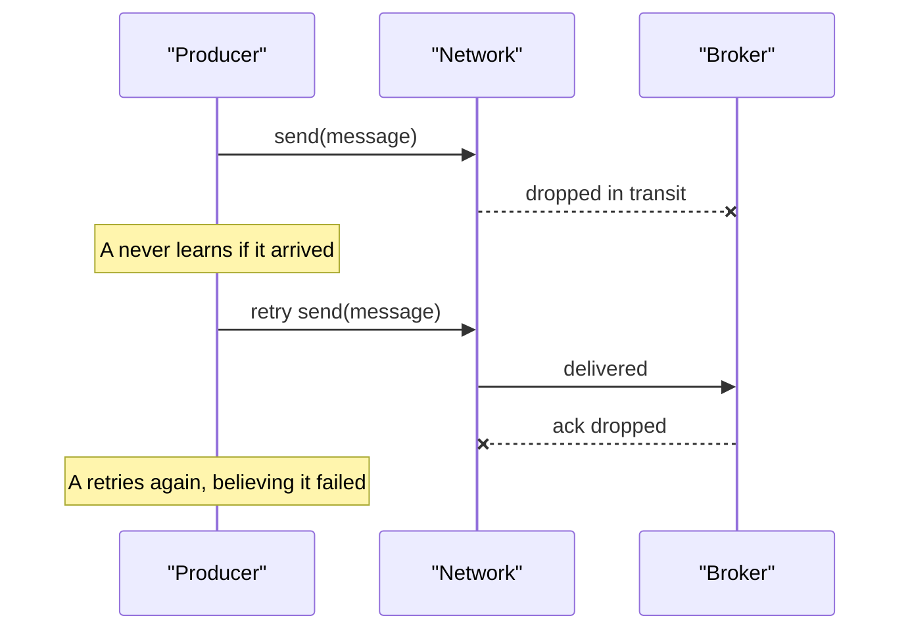
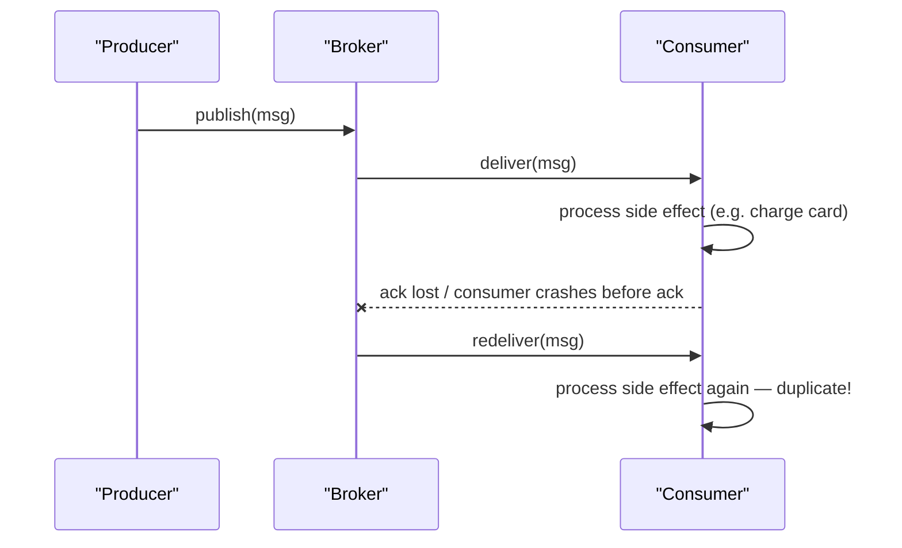

Every messaging interview eventually asks "does your system guarantee exactly-once delivery?" The correct senior answer is that delivery cannot be exactly-once over an unreliable network — only *processing* can, and only through a specific mechanism you should be able to name.

## The three delivery guarantees, precisely

| Guarantee | Definition | What can go wrong | Cost |
|---|---|---|---|
| At-most-once | Message sent/attempted zero or one times, no retry on failure | Message loss on any error | Cheapest, no dedup needed |
| At-least-once | Message delivered one **or more** times until acknowledged | Duplicate processing | Requires idempotent consumers |
| Effectively-once / exactly-once processing | Message effect is applied **exactly** one time, despite possible duplicate deliveries | Duplicate delivery still possible underneath | Achieved at the processing layer with idempotency or transactions, not as network delivery |

> [!KEY]
> Exactly-once **delivery** is impossible to guarantee over a network that can drop, delay or duplicate packets. Exactly-once **processing** is achievable — by making the effect of processing idempotent, or by wrapping the read-process-write in a single atomic transaction.

## Why exactly-once delivery is impossible: the two-generals problem

Two generals must coordinate an attack by sending messengers across enemy territory where any messenger might be captured. General A sends "attack at dawn." Did it arrive? A can't know unless B sends an acknowledgement — but that ack can also be lost, so B can't know if A got the ack, and so on forever. There is no number of messages that produces mutual certainty.



This maps directly onto producer-to-broker and broker-to-consumer hops: any ack itself can be lost, so the sender can never distinguish "message lost" from "ack lost" without retrying — and retrying risks a duplicate. This is why every real system chooses at-least-once (retry, risk duplicates) or at-most-once (don't retry, risk loss); "exactly-once wire delivery" is not a real option.

## Acknowledgement models

Underneath every one of these models is the same basic shape: a broker sits between producer and consumer, using its own routing rules and queue to decide what gets delivered and when it can be considered handled.


| Model | How it works | Failure behaviour | Used by |
|---|---|---|---|
| Auto-ack | Broker marks delivered as soon as it's sent over the wire | Consumer crash after receipt = message lost | Fire-and-forget pub/sub, low-value telemetry |
| Manual ack (complete) | Consumer explicitly acks after finishing work | Crash before ack = redelivered (at-least-once) | RabbitMQ manual ack, SQS delete |
| Peek-lock | Message is leased/locked for a visibility window; consumer must complete before lock expires or it becomes visible again | Lock expiry (slow processing) = redelivered even if work finished | Azure Service Bus, SQS visibility timeout |

```csharp
// Peek-lock: the message stays invisible only until CompleteMessageAsync
// or LockDuration expires — whichever comes first.
processor.ProcessMessageAsync += async args =>
{
    try
    {
        await HandleOrderAsync(args.Message.Body);
        await args.CompleteMessageAsync(args.Message); // ack — only now is it removed
    }
    catch (TransientException)
    {
        await args.AbandonMessageAsync(args.Message); // release lock early, retry sooner
    }
    // Crash here with no complete/abandon → lock simply expires → redelivered anyway
};
```

> [!WARNING]
> Peek-lock's biggest production trap: if your handler takes longer than the lock duration and you don't renew the lock, the message becomes visible to another consumer *while you are still processing it*. You now have two workers doing the same job concurrently. Renew the lock, or set the lock duration realistically for your P99 processing time.

## Where loss and duplication actually happen



Loss happens when: the producer doesn't wait for a broker ack before considering the send successful, the broker isn't durably persisted before acking the producer, or a consumer acks before finishing work and then crashes. Duplicates happen when: a producer retries a send it isn't sure landed, or a consumer finishes work but the ack is lost/times out, so the broker redelivers a message that was already processed.

## Kafka transactions: what they really guarantee

Kafka's transactional producer/consumer API (`enable.idempotence`, transactional IDs, `read_committed` isolation) gives **exactly-once *within* Kafka** for the specific pattern of "read from topic A, process, write to topic B, commit offset" — all as one atomic unit. If the consumer crashes mid-transaction, the whole write plus offset commit is rolled back, so on restart it reprocesses from the same point with no partial output visible to `read_committed` consumers.

> [!DANGER]
> Kafka's exactly-once guarantee stops at the Kafka cluster boundary. The moment your consumer calls an external system — an HTTP API, a database, sends an email — that call is *not* part of the Kafka transaction. If the consumer crashes after calling the external API but before the Kafka transaction commits, the external call will be repeated on redelivery. You still need idempotency at that boundary.

## Idempotency vs transactional consumption

| Approach | How it achieves "exactly-once processing" | Where it applies |
|---|---|---|
| Idempotent handler | Processing the same message twice produces the same end state (e.g., `SET status = 'shipped'` not `INCREMENT count`) | Any consumer, any broker |
| Transactional consume-process-produce | Read, side-effect and offset-commit happen as one atomic unit | Kafka transactions, or a DB transaction that writes business data + a dedup marker + updates a local offset table |
| Deduplication table | Store processed message IDs; skip if already seen | Any broker, combined with either of the above |

## Mapping business requirements to semantics

| Business requirement | Semantics needed | Typical mechanism |
|---|---|---|
| "Never lose a metric point, duplicates are fine" | At-least-once | Manual ack after processing, retry on failure |
| "Never double-charge a customer" | At-least-once delivery + idempotent processing | Message ID + payment idempotency key + dedup table |
| "Best-effort telemetry, some loss acceptable" | At-most-once | Auto-ack / fire-and-forget UDP-style send |
| "Every event must update the read model exactly once" | Exactly-once processing | Kafka transactions or read-process-write in one DB transaction |
| "Audit log must have zero gaps, duplicates tolerated by downstream dedup" | At-least-once | Peek-lock with generous lock duration + idempotent writer |

## Cheat sheet

- Exactly-once **delivery** is impossible over an unreliable network — this is the two-generals problem, not a solvable engineering problem.
- Exactly-once **processing** is achievable via idempotency or an atomic read-process-write transaction.
- At-least-once is the practical default almost everywhere; design consumers to be idempotent rather than chasing zero duplicates at the broker layer.
- Peek-lock ≠ ack — a message can be redelivered even after you finish work, if the lock expired first.
- Kafka's "exactly-once" is scoped to Kafka-to-Kafka; anything touching an external system still needs idempotency.
- Loss happens on the producer→broker or broker→consumer hop when acks aren't durable; duplicates happen when acks are lost or retried.
- Ask "what does the business tolerate — loss or duplicates?" before choosing an ack model; the answer is almost never "neither."

## Common mistakes

| Mistake | Fix |
|---|---|
| Claiming a system is "exactly-once" because it uses Kafka transactions | Clarify the guarantee stops at the cluster boundary; external side effects still need idempotency |
| Auto-acking before processing to "be safe" | This is at-most-once — acking early only protects against redelivery, not against loss |
| Assuming manual ack alone prevents duplicates | It reduces the *window* for duplicates but does not eliminate them; a crash between processing and ack still causes a duplicate |
| Not renewing peek-locks for long-running handlers | Configure lock renewal or a realistic lock duration matching P99 processing time |
| Treating "idempotent" and "at-most-once" as the same fix for duplicates | Idempotency handles at-least-once safely with zero loss; at-most-once trades loss for simplicity, a different trade-off |

## Summary

At-most-once, at-least-once and exactly-once are guarantees about what the *network and broker* can promise, and only at-least-once and at-most-once are actually achievable at that layer — exactly-once delivery is ruled out by the two-generals problem. What most systems mean by "exactly-once" is exactly-once *processing*, achieved either by making handlers idempotent or by wrapping read-process-write in an atomic transaction (as Kafka transactions do, within the Kafka boundary). The senior answer always separates "delivery guarantee" from "processing guarantee" and states which mechanism bridges the gap for external side effects.

## Top Interview Questions

### Q1. What's the difference between at-most-once, at-least-once and exactly-once delivery?

At-most-once means a message is delivered zero or one times — there's no retry, so a failure anywhere causes silent loss, but there are never duplicates. At-least-once means the sender keeps retrying until it gets a confirmed ack, guaranteeing no loss but allowing the same message to be delivered more than once if an ack is lost after successful processing. Plain exactly-once delivery is the impossible ideal over an unreliable network; in real systems the useful target is exactly-once processing, achieved with idempotency or an atomic transaction on top of at-least-once delivery.

### Q2. Why is exactly-once delivery impossible? Explain using the two-generals problem.

The two-generals problem shows that two parties cannot reach guaranteed mutual agreement over a channel that can lose messages, no matter how many acknowledgements they exchange — each ack could itself be lost, so the sender can never be certain whether the original message or just the ack failed. Applied to messaging: a producer that doesn't get an ack cannot tell whether the broker never received the message or received it but the ack was lost. If it doesn't retry, it risks losing a message that actually arrived (at-most-once); if it retries, it risks the broker receiving it twice (at-least-once). There is no third option at the network layer — you must pick one of these trade-offs.

### Q3. If exactly-once delivery isn't possible, how do systems claim "exactly-once processing"?

They achieve it one layer up, at the application or storage layer, on top of at-least-once delivery. Two mechanisms: idempotency, where processing the same message multiple times produces the same end state (e.g., a dedup table with a unique constraint on message ID, or a naturally idempotent write like `SET status = X`); and atomic transactional consumption, where reading the message, applying its effect, and committing the offset happen as one indivisible unit, so a crash mid-way rolls everything back and the message is reprocessed cleanly from the same point. Kafka's transactional API is the canonical example of the second approach, scoped to Kafka-to-Kafka operations.

### Q4. What does Kafka's "exactly-once semantics" (EOS) actually guarantee, and where does it stop?

EOS guarantees that a consume-transform-produce cycle — reading input, producing output to one or more topics, and committing the input offset — happens atomically: on failure, none of it is visible to consumers using `read_committed` isolation, and on restart it retries the whole unit cleanly with no duplicate output topics. It relies on idempotent producers (deduplicated by producer ID + sequence number) plus transactional coordination. It stops at the Kafka cluster boundary: if your consumer's transaction also calls a REST API, writes to a non-transactional database, or sends an email, none of that is covered — those side effects can still be duplicated on retry and need their own idempotency.

### Q5. Explain the difference between auto-ack, manual ack, and peek-lock as acknowledgement models.

Auto-ack marks a message as delivered as soon as it leaves the broker, before the consumer has necessarily processed it — if the consumer crashes right after receipt, the message is lost, so this is effectively at-most-once. Manual ack requires the consumer to explicitly acknowledge after finishing work; if it crashes first, the broker redelivers, giving at-least-once. Peek-lock (Service Bus, SQS visibility timeout) is a variant of manual ack where the message is invisible to other consumers for a bounded lease window rather than indefinitely — if the consumer doesn't complete (or renew the lock) before that window expires, the message becomes visible again even if the consumer is still working on it, which can cause concurrent double-processing, not just a simple redelivery after a crash.

### Q6. Your payment consumer uses at-least-once delivery. How do you guarantee a customer is never charged twice?

At-least-once means the message consuming "charge this customer" can arrive more than once, so the charge operation itself must be made idempotent rather than trying to prevent redelivery. The standard pattern is an idempotency key: generate a stable key per logical charge (often the message ID or order ID), record it in a table with a unique constraint before or atomically with calling the payment gateway, and have the gateway (most support this natively, e.g., Stripe's idempotency-key header) or your own dedup table refuse to process the same key twice. The insert-then-charge (or check-then-charge) must happen in a transaction with the state change, so a crash between the dedup check and the charge can't create a second charge on redelivery.

### Q7. A consumer processes a message, writes to the database, but crashes before acknowledging it to Service Bus. What happens, and is this a bug?

Service Bus's peek-lock will let the lock expire (or, on abrupt consumer crash, the lock times out) and redeliver the message to another consumer, because from the broker's point of view the message was never completed. This is not a bug — it's exactly what at-least-once delivery guarantees: no loss, at the cost of a possible duplicate. The actual bug risk is in the consumer: if the database write isn't idempotent (e.g., an `INSERT` without a unique constraint, or an `INCREMENT`), the redelivery will duplicate that write. The fix is to make the handler idempotent — a dedup table keyed on message ID within the same transaction as the business write, or a natural idempotent operation.

### Q8. Why can't you just deduplicate at the broker to get exactly-once delivery for free?

Brokers can do *duplicate detection* over a bounded window (Service Bus's duplicate detection window, Kafka's idempotent producer with sequence numbers), which removes duplicates the broker itself introduces on retry of the same producer send. But this only covers producer-to-broker duplicates within that window — it cannot prevent a consumer from processing a message, crashing before ack, and receiving the same message again later (broker-to-consumer duplication), because from the broker's perspective that's a legitimate redelivery, not a duplicate send. It also can't detect application-level duplicates, like two different messages that represent the same business event from an upstream retry. Broker-level dedup narrows the problem; it doesn't eliminate the need for consumer idempotency.

### Q9. When would at-most-once actually be the right choice, given it can lose messages?

When the cost of occasionally losing a message is lower than the cost of the complexity needed to guarantee delivery, and duplicates would be actively harmful or meaningless. Examples: high-volume metrics/telemetry where losing 0.01% of data points doesn't change any dashboard's conclusion, live position updates where a newer message supersedes an old one anyway, or best-effort cache invalidation where a missed invalidation just means slightly stale data until the next write. In all these cases, retry-driven at-least-once would add latency and duplicate-handling complexity for no real benefit, so accepting occasional loss is the pragmatic trade-off — but it should be a stated decision, not a default.

### Q10. How would you design a consumer that must call a non-idempotent third-party API (e.g., "send SMS") under at-least-once delivery?

I'd wrap the call with an idempotency layer external to the third party: before calling, check a dedup store (a table or cache keyed by message ID) inside a transaction or atomic check-and-set; if already marked "sent," skip the call; if not, mark it as "in-flight," make the call, then mark it "sent" on success. If the third-party API itself supports an idempotency key (many do, e.g., Twilio's per-request unique ID), pass the message ID as that key so even a retry after a crash between "call API" and "mark sent" is deduplicated by the provider. The key design point: the dedup marker must be written durably before or atomically with the external call, not after, or a crash in between still causes a duplicate send.

### Q11. What's the practical difference between "the message was lost" and "the message was delivered but processing failed silently"?

The first means the broker or network never delivered the payload — the consumer never saw it, so there's no trace of an attempt; this usually stems from acking too early, an unpersisted send, or a dropped connection before delivery confirmation. The second means the consumer received the message but its processing logic swallowed an exception, updated nothing, and then acked anyway — the broker correctly recorded successful delivery, but the business effect never happened. From an operational standpoint the second is more dangerous because monitoring on broker-level delivery metrics looks perfectly healthy; you need application-level success metrics (e.g., "orders successfully billed" vs "orders received") to catch it, not just queue depth or ack rate.

### Q12. How do you decide, for a new integration, whether you need exactly-once processing or if at-least-once with basic retry is enough?

I ask whether the operation is naturally idempotent or cheaply retryable without harm — if it's a `SET`/upsert style write, plain at-least-once with a retry loop is enough and adding dedup infrastructure is wasted effort. If the operation has an external side effect that's expensive or irreversible if duplicated (charging money, sending a physical shipment, firing an SMS/email a customer will notice), I design explicit exactly-once processing: an idempotency key, a dedup table with a unique constraint, and a transaction tying the dedup check to the business write. I also check whether the broker offers native help (Service Bus duplicate detection window, Kafka idempotent producer) as a first line of defense, while treating consumer-side idempotency as the non-negotiable second line, since broker dedup alone never covers the consumer crash-before-ack case.
