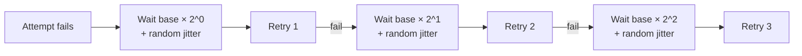
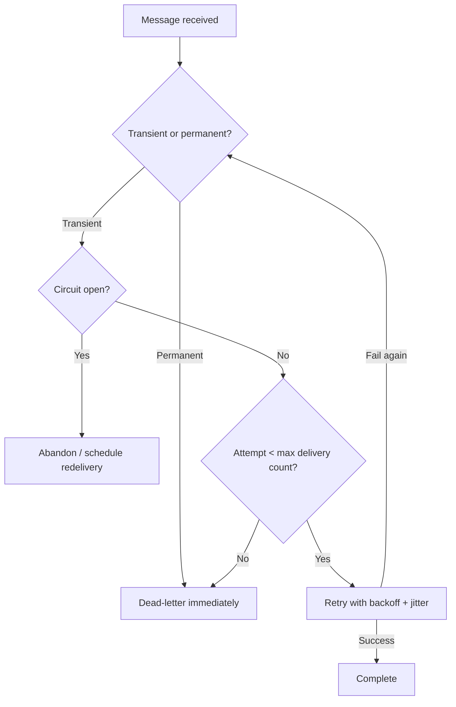

Retrying is the easy part; retrying *correctly* is what gets tested. This section covers classifying failures, spacing retries so they don't cause the outage they're meant to prevent, and knowing when to stop retrying and dead-letter a message instead.

## Transient vs permanent failures

The first decision on any failure is whether retrying could possibly help.

| Failure type | Examples | Retry? |
|---|---|---|
| Transient | Network blip, downstream 503, connection pool exhaustion, deadlock victim, throttling (429) | Yes — likely to succeed shortly |
| Permanent | Malformed payload, missing required field, business rule violation (e.g., insufficient stock), unauthorized | No — will fail identically every time |
| Ambiguous | Timeout (did the write happen or not?), downstream 500 with no detail | Retry cautiously, prefer idempotent operations |

> [!KEY]
> Retrying a permanent failure doesn't just waste time — it delays dead-lettering, hides a real bug behind a wall of retry logs, and, in an ordered partition, blocks every message behind it. Classify the exception before deciding to retry, don't retry everything by default.

## Immediate, delayed and scheduled redelivery

| Strategy | When | Mechanism |
|---|---|---|
| Immediate in-process retry | Very short transient blip, cheap operation (e.g., a single DB call) | Retry loop inside the handler, 1-3 attempts, small fixed delay |
| Delayed broker redelivery | Downstream dependency needs recovery time | Abandon the message; broker redelivers after a lock/visibility timeout, or you explicitly schedule it |
| Scheduled future redelivery | Known recovery time (e.g., "retry after maintenance window ends") | `ScheduledEnqueueTimeUtc` (Service Bus) / delay queue — enqueue a copy for a specific future time |

## Exponential backoff and jitter

Fixed-delay retries from many consumers synchronize into bursts that hit the downstream dependency at the same instant, right as it's recovering — the classic **thundering herd**. Exponential backoff spaces out retries over time; jitter (randomizing the delay) desynchronizes the retries of different consumer instances so they don't collide.



| Backoff style | Delay formula (attempt n) | Problem it solves |
|---|---|---|
| Fixed | `constant` | Simple, but synchronizes retries → thundering herd |
| Exponential | `base * 2^n` | Spaces retries out as failures persist |
| Exponential + jitter | `base * 2^n * random(0.5, 1.5)` (or "full jitter": `random(0, base * 2^n)`) | Desynchronizes concurrent consumers, avoiding retry storms |

> [!WARNING]
> Without jitter, a downstream outage that recovers at time T causes every waiting consumer to retry at almost exactly the same moment, potentially re-triggering the outage immediately — an entirely self-inflicted second incident. Jitter is not optional at any meaningful scale.

## Max delivery count, abandon, complete, dead-letter

| Action | Effect |
|---|---|
| Complete | Message is removed — processing succeeded |
| Abandon | Message goes back to the queue immediately for redelivery (lock released) |
| Dead-letter | Message moved to the DLQ with a reason/description, stops consuming normal retry attempts |
| (Do nothing, let lock expire) | Same effective result as abandon, but slower — happens after the lock timeout |

Max delivery count is the hard stop: after N failed delivery attempts (Service Bus default is 10), the broker automatically dead-letters the message regardless of the reason for failure. This is the safety net that prevents an unclassified permanent failure from looping forever.

## Retry budgets

A retry budget caps the *proportion* of total traffic that may be retries, protecting the downstream dependency from an amplification effect: if 20% of primary requests fail and each gets retried 3 times, the downstream now sees 1.6x its normal load from retries alone, right when it's least able to take it.

```csharp
public class RetryBudget
{
    private readonly int _windowSize = 100;
    private readonly Queue<bool> _outcomes = new();
    private readonly double _maxRetryRatio = 0.10; // allow at most 10% retries

    public bool CanRetry()
    {
        if (_outcomes.Count < _windowSize) return true;
        double retryRatio = _outcomes.Count(x => x) / (double)_outcomes.Count;
        return retryRatio < _maxRetryRatio;
    }

    public void RecordAttempt(bool wasRetry)
    {
        if (_outcomes.Count >= _windowSize) _outcomes.Dequeue();
        _outcomes.Enqueue(wasRetry);
    }
}
```

> [!TIP]
> Say this out loud: "retries turn a partial failure into amplified load on the thing that's already struggling — a retry budget stops the retry storm from becoming the actual outage."

## Retrying non-idempotent work

If a handler's side effect isn't idempotent (charging a card, sending an email), a retry after an ambiguous failure (timeout, connection reset mid-call) risks duplicating that effect. The safe pattern is: pass an idempotency key to the downstream call so it can dedupe on its side, or check a dedup/inbox table before retrying — this is the same mechanism covered under idempotency, applied specifically at the retry boundary rather than only at redelivery.

## Broker redelivery vs in-process retry

| | In-process retry | Broker redelivery |
|---|---|---|
| Speed | Fast — no network round trip to re-fetch | Slower — message must be abandoned/expire and re-fetched |
| Visibility | Invisible to monitoring unless logged explicitly | Visible as delivery count, dead-letter events |
| Best for | Sub-second transient errors (deadlock retry, brief connection blip) | Failures needing real recovery time (downstream is down, rate-limited) |
| Risk | Blocks the consumer thread/message lock for the whole retry loop | Frees up the consumer immediately; other messages can be processed meanwhile |

> [!NOTE]
> A common production pattern: 1-2 fast in-process retries for genuinely transient errors, then abandon to the broker for anything that needs more than a second or two — this avoids holding a message lock hostage to a slow retry loop while other messages in the queue wait.

## Poison message identification and circuit breaking

A poison message is one that fails deterministically no matter how many times it's redelivered — a malformed payload, a message that triggers a bug, or a reference to data that will never exist. Track delivery count and treat anything approaching max delivery count as a poison-message candidate for alerting, even before it's dead-lettered.

Circuit breaking protects the downstream dependency itself: if a consumer's calls to a downstream service are failing above a threshold, open the circuit and abandon/schedule-redeliver messages without even attempting the call for a cool-down period, rather than hammering an already-failing dependency with every message in the queue.



## Cheat sheet

- Classify first: transient (retry), permanent (dead-letter immediately), ambiguous (retry cautiously with idempotency).
- Exponential backoff spaces retries out; jitter is required to stop concurrent consumers from retrying in lockstep.
- Max delivery count is the safety net for anything you failed to classify correctly — it always wins eventually.
- Retry budgets cap the retry-to-primary-traffic ratio, preventing retries from amplifying load on an already-struggling dependency.
- In-process retry for sub-second transient blips; broker redelivery/abandon for anything needing real recovery time.
- Circuit-break the downstream call, not just the message — stop hammering a dependency that's already down.
- Never retry a non-idempotent side effect without an idempotency key or dedup check at the retry boundary too.

## Common mistakes

| Mistake | Fix |
|---|---|
| Retrying every exception the same way regardless of type | Classify transient vs permanent first; dead-letter permanent failures immediately |
| Fixed-delay retry with no jitter | Add jitter — otherwise concurrent consumers retry in sync and re-trigger the outage |
| Holding a message lock hostage to a long in-process retry loop | Use 1-2 fast retries in-process, then abandon to the broker for anything slower |
| No retry budget — retries freely amplify load on a failing downstream | Cap the retry-to-primary ratio so retries can't multiply an outage |
| Treating "max delivery count reached" as a silent, unmonitored event | Alert on dead-letter rate — it's a leading indicator of a real bug or outage |

## Summary

Good retry design starts with classifying the failure — transient failures deserve backoff and retry, permanent failures should dead-letter immediately, and ambiguous failures need idempotency before you retry at all. Exponential backoff with jitter prevents synchronized retry storms from re-triggering the outage they're recovering from, a retry budget caps how much extra load retries can add to an already-struggling dependency, and max delivery count is the non-negotiable backstop that eventually dead-letters anything you got wrong. Choose in-process retry for fast transient blips and broker redelivery for anything needing real recovery time, and circuit-break the downstream call itself when it's clearly unhealthy.

## Top Interview Questions

### Q1. How do you decide whether a failure is worth retrying?

I classify the exception into transient, permanent, or ambiguous. Transient failures — network timeouts, 503s, connection pool exhaustion, throttling responses — are worth retrying because the same operation is likely to succeed shortly after. Permanent failures — validation errors, malformed payloads, business rule violations like insufficient stock — will fail identically on every retry, so retrying just delays the inevitable dead-letter and wastes attempts; these should be dead-lettered immediately with a clear reason. Ambiguous failures, like a timeout where you don't know if the write actually completed, need retrying cautiously and only if the operation is idempotent or the retry path checks for prior completion first — otherwise a retry can create a duplicate side effect.

### Q2. Why is jitter necessary in addition to exponential backoff?

Exponential backoff alone still produces synchronized retries: if 500 consumers all fail at the same moment because a downstream dependency went down, and they all use the same deterministic backoff formula, they will all retry again at almost exactly the same future instant. If that dependency has just started recovering, this synchronized wave of retries can overwhelm it again immediately — a thundering herd, effectively a self-inflicted second outage. Jitter randomizes each consumer's actual delay (e.g., "full jitter": a random value between 0 and the computed exponential delay), spreading retries out over a window instead of a single instant, so the downstream sees a smoothed ramp of load rather than a synchronized spike.

### Q3. What is a retry budget and why do you need one on top of backoff and jitter?

A retry budget caps the proportion of total traffic that is allowed to be retries within a time window, rather than allowing every failed request to be retried unconditionally. Without it, a partial outage (say 20% of calls failing) can amplify load on the already-struggling downstream dependency — each failure retried 3 times means the downstream sees significantly more total requests than its actual healthy capacity, right when it's least able to absorb them, which can turn a partial degradation into a total outage. Backoff and jitter control the *timing* of retries; a retry budget controls the *volume*, and both are needed because good timing alone doesn't prevent retries from silently multiplying load during a sustained failure.

### Q4. What's the difference between abandoning a message and letting its lock expire?

Abandoning explicitly and immediately releases the message's lock back to the broker, making it available for redelivery right away — you're telling the broker "I'm done trying for now, give this to someone (possibly me again)." Letting the lock expire achieves the same end result but only after the full lock/visibility timeout elapses, which is slower and less deliberate — it usually indicates the consumer crashed, hung, or simply forgot to release the lock rather than making an intentional decision. In production code, explicit abandon (often paired with a computed delay before the message becomes available again) is preferred because it's faster and it's a clear signal in logs and metrics that a specific failure occurred, versus a timeout which could mean anything from a slow handler to a crash.

### Q5. When would you choose in-process retry over relying on the broker's redelivery?

In-process retry (a loop inside the handler, 1-3 attempts with small fixed delays) is appropriate for genuinely fast, sub-second transient errors — a single deadlock victim retry on a DB call, or a brief connection reset that typically clears in milliseconds. It's fast because there's no round trip back through the broker's redelivery mechanism. I'd switch to broker redelivery (abandon, or schedule for later) once the needed recovery time exceeds roughly a second or two, because holding a message lock hostage to a long in-process retry loop blocks that consumer from picking up any other message and, in Service Bus's peek-lock model, risks the lock itself expiring mid-retry. The rule of thumb: fast and cheap → retry in-process; anything needing real recovery time → let the broker redeliver.

### Q6. Your service starts throwing 503s from a downstream dependency, and your consumer's retry logic keeps calling it on every message. What should you add, and why?

I'd add a circuit breaker around the downstream call. Once failures against that dependency exceed a threshold within a window, the circuit opens and the consumer stops calling it entirely for a cool-down period, abandoning or scheduling messages for later without even attempting the call — this both gives the downstream dependency room to recover (rather than every queued message hammering it simultaneously) and avoids wasting consumer capacity on calls that are almost certain to fail. After the cool-down, the circuit moves to half-open and allows a small number of trial calls through before fully closing again if they succeed, which prevents immediately re-opening the flood the moment the dependency shows the first sign of life.

### Q7. What happens when a message hits the max delivery count, and why is this setting important even if your failure classification is good?

Once a message has been delivered and failed (abandoned, or lock-expired) a configured number of times — Service Bus's default is 10 — the broker automatically dead-letters it, regardless of the reason, stopping any further normal-queue delivery attempts. This matters as a safety net even with good classification because classification logic itself can have bugs, an exception type can be misclassified as transient when it's actually permanent, or a downstream outage can genuinely outlast your retry budget — max delivery count guarantees the system self-heals from "stuck forever retrying" into "parked for investigation" without needing a human to notice and intervene manually.

### Q8. How do you retry an operation that isn't idempotent, like sending a confirmation email, without risking duplicates?

I wouldn't rely on the retry loop alone — I'd add an idempotency layer at the retry boundary itself: before making the call, check a dedup/inbox record for this message (or generate a stable idempotency key and pass it to the downstream provider if it supports one, as many email/SMS/payment APIs do). On an ambiguous failure like a timeout, where I genuinely don't know if the email was sent, I'd either query the provider for the prior attempt's status using that key, or accept the small residual risk if no such lookup exists, rather than blindly resending. The key point is that retry safety for non-idempotent operations depends on idempotency infrastructure, not on retry logic itself — retrying is never "free" for a side effect that can't be undone or deduplicated downstream.

### Q9. A poison message is blocking a partition that requires strict ordering. Walk through your production response.

First, I'd confirm it actually is a poison message — deterministically failing regardless of delivery count — rather than a slow-but-recoverable transient issue, by checking the delivery count and exception pattern in logs. If it's confirmed poison and the partition needs ordering, I'd reduce the max delivery count temporarily if needed to force a faster dead-letter (since every retry attempt delays every message behind it in that partition), then dead-letter it and let the partition resume processing its backlog. Afterward, I'd investigate the dead-lettered message's root cause (bad payload, a bug triggered by specific data), and if it represented real business data that needs to be applied, I'd fix the underlying issue and replay it out of band — accepting that it will now be applied out of its original order, and reconciling any resulting inconsistency explicitly.

### Q10. What's the risk of setting max delivery count too high versus too low?

Too high, and a permanent failure (or a poison message in an ordered partition) retries for a long time before finally dead-lettering, wasting consumer capacity, delaying detection of a real bug, and — in an ordered scope — blocking every message behind it for that entire retry window. Too low, and genuinely transient failures that would have succeeded on, say, the 4th or 5th attempt get dead-lettered prematurely, pushing otherwise-recoverable messages into a DLQ that then needs manual triage and replay, adding operational burden for something that should have self-healed. The right value depends on the failure's typical recovery time and whether the message sits in an ordered scope — ordered/latency-sensitive scopes should lean lower, with dead-lettering treated as a fast, well-monitored safety valve rather than a rare event.
