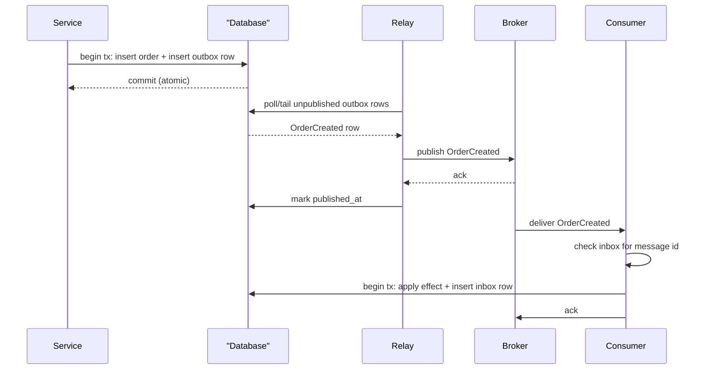

Any service that writes to its own database and then publishes an event faces a problem with no atomic fix at the infrastructure level: the write and the publish are two separate systems, and either can fail independently. The outbox and inbox patterns are the standard, interview-expected answer to this — and one of the most reliable ways to tell if a candidate has actually operated a messaging system in production.

## The dual-write problem, precisely

A service commits a database transaction (say, "order created") and then calls a message broker to publish `OrderCreated`. There is no distributed transaction spanning a relational database and a broker in the general case, so exactly one of these can go wrong independently:

| Failure point | Result |
|---|---|
| DB commit succeeds, publish fails (broker down, network blip) | State changed, no event ever sent — downstream systems never learn about the order |
| Publish succeeds, DB commit fails or rolls back after | Event sent for a state change that never actually happened |
| Process crashes between the two calls | Either of the above, non-deterministically |

> [!KEY]
> The dual-write problem exists because "write to DB" and "publish to broker" are two different systems with no shared transaction coordinator. Any solution either makes them share one (2PC), or restructures the problem so only one atomic write is needed (outbox).

## The transactional outbox

The fix: don't publish directly. Instead, write the event to an **outbox table in the same database, in the same local transaction** as the business write. A separate relay process reads the outbox and publishes to the broker, retrying until it succeeds. Because the outbox row and the business row commit atomically (they're one transaction, one database), you can never have one without the other.

```sql
CREATE TABLE outbox (
    id              UUID PRIMARY KEY,
    aggregate_type  VARCHAR(100)  NOT NULL,   -- e.g. 'Order'
    aggregate_id    VARCHAR(100)  NOT NULL,
    event_type      VARCHAR(100)  NOT NULL,   -- e.g. 'OrderCreated'
    payload         JSONB         NOT NULL,
    created_at      TIMESTAMPTZ   NOT NULL DEFAULT now(),
    published_at    TIMESTAMPTZ   NULL        -- set by the relay once sent
);
```

```csharp
// Single local transaction: business write + outbox write commit together.
using var tx = await connection.BeginTransactionAsync();

await connection.ExecuteAsync(
    "INSERT INTO orders (id, status) VALUES (@Id, 'Created')", order, tx);

await connection.ExecuteAsync(
    """
    INSERT INTO outbox (id, aggregate_type, aggregate_id, event_type, payload)
    VALUES (@Id, 'Order', @OrderId, 'OrderCreated', @Payload::jsonb)
    """,
    new { Id = Guid.NewGuid(), order.OrderId, Payload = JsonSerializer.Serialize(evt) }, tx);

await tx.CommitAsync(); // atomic: both rows exist, or neither does
```

### Relay: polling vs CDC

| Relay style | How it works | Trade-offs |
|---|---|---|
| Polling publisher | A background job periodically `SELECT`s unpublished rows, publishes, marks `published_at` | Simple to build; adds polling latency and DB load at high frequency |
| Change Data Capture (CDC) | A tool (Debezium, SQL Server CDC) tails the transaction log and streams outbox inserts to the broker | Near real-time, no polling load, but adds operational complexity (a CDC pipeline to run and monitor) |

> [!TIP]
> Naming Debezium and CDC-based outbox relaying, unprompted, is a strong signal in a senior interview — it shows you know the pattern is used at scale (this is how Debezium's own "outbox event router" works).

## Ordering and at-least-once delivery

The relay guarantees **at-least-once** delivery, never exactly-once: if it publishes successfully but crashes before marking the row `published_at`, it will republish on restart. Consumers must be idempotent (see inbox, below). Ordering is preserved *per aggregate* if the relay processes and publishes rows in `created_at`/insertion order and the broker preserves order within a partition/queue keyed by aggregate ID — but ordering across different aggregates is not guaranteed and usually shouldn't be relied on.

> [!WARNING]
> The outbox pattern removes the "lost event" failure mode but introduces "duplicate event" as a certainty, not a possibility. If your consumers aren't idempotent, the outbox has just moved the bug downstream.

## The inbox pattern: consumer-side dedup

Because publishing is at-least-once, a consumer will eventually see the same message twice — a retried publish, a redelivered message after a crash before ack, or a redriven DLQ entry. The **inbox pattern** records which message IDs have already been processed, in the same local transaction as the side effect, so a duplicate is detected and skipped rather than reapplied.

```sql
CREATE TABLE inbox (
    message_id   UUID NOT NULL,      -- the id from the event envelope
    consumer     VARCHAR(100) NOT NULL,
    processed_at TIMESTAMPTZ NOT NULL DEFAULT now(),
    PRIMARY KEY (message_id, consumer)
);
```

```csharp
using var tx = await connection.BeginTransactionAsync();

var alreadyProcessed = await connection.ExecuteScalarAsync<bool>(
    "SELECT EXISTS(SELECT 1 FROM inbox WHERE message_id = @Id AND consumer = @Consumer)",
    new { evt.Id, Consumer = "billing-service" }, tx);

if (!alreadyProcessed)
{
    await ApplyBusinessEffectAsync(evt, connection, tx); // e.g. charge the card
    await connection.ExecuteAsync(
        "INSERT INTO inbox (message_id, consumer) VALUES (@Id, @Consumer)",
        new { evt.Id, Consumer = "billing-service" }, tx);
}

await tx.CommitAsync();
ack(); // ack only after the transaction commits
```

This is the general shape of an **idempotent receiver**: dedup key + business effect committed atomically, ack only after commit. Without the inbox table, idempotency has to be re-derived from business logic alone (e.g. "only charge if not already charged"), which is harder to get right for every event type.

## Cleaning up

Both tables grow forever unless pruned. Outbox rows can be deleted (or archived) once `published_at` is set and past a safety window (in case the relay itself needs to re-audit). Inbox rows need to be kept at least as long as the broker's redelivery window could plausibly produce a duplicate — commonly a rolling 7–30 day window — after which old rows are purged by a scheduled job.

## Comparing approaches to the dual-write problem

| Approach | Atomicity mechanism | Ordering | Operational cost | Notes |
|---|---|---|---|---|
| Transactional outbox | Single local DB transaction + relay | Per-aggregate, if relay/broker preserve it | Low–medium (extra table + relay/CDC) | Most common production answer |
| Two-phase commit (2PC/XA) | Distributed transaction coordinator across DB and broker | Strong if coordinator guarantees it | High — needs XA support, hurts availability and latency | Rarely used with modern brokers; most don't support XA well |
| Event sourcing | The event *is* the source of truth; state is derived from it, so there's nothing else to keep in sync | Strong within a stream | High — a different storage/query model entirely | Solves dual-write by removing the second write |
| CDC directly off business tables | Tail the transaction log of the business table itself, no outbox table needed | Reflects raw DB write order | Medium — needs CDC infra, plus event shaping downstream | Skips the outbox table but exposes internal schema unless carefully mapped |

## The full flow



> [!NOTE]
> The outbox solves the *producer's* atomicity problem; the inbox solves the *consumer's* duplicate problem. You typically need both in any pipeline that cares about correctness, not just one.

## Cheat sheet

- The dual-write problem: writing to a DB and publishing to a broker cannot be one atomic operation without extra machinery.
- Outbox pattern: write the event to a table in the *same local transaction* as the business change; a relay publishes it afterward.
- The relay is inherently at-least-once — plan for duplicates, don't try to eliminate them at the relay.
- Polling relay = simple, adds latency/DB load. CDC relay (Debezium) = near real-time, adds operational surface.
- Inbox pattern: record processed message IDs in the same transaction as the side effect, to make consumers idempotent.
- Ordering is only guaranteed per-aggregate/per-partition key, never globally, across an outbox relay.
- 2PC technically solves dual-write but is rarely used with modern brokers — high cost, poor availability trade-off.
- Both outbox and inbox tables need a retention/cleanup job or they grow forever.

## Common mistakes

| Mistake | Fix |
|---|---|
| Publishing directly after commit ("it usually works") | Route through an outbox table in the same transaction |
| Assuming the outbox guarantees exactly-once delivery | It guarantees at-least-once; consumers must be idempotent |
| Acking a message before the inbox/business transaction commits | Ack only after the local transaction commits, so a crash causes redelivery, not silent loss |
| Never pruning the outbox/inbox tables | Add a scheduled cleanup job with a safe retention window |
| Expecting global ordering across all published events | Only rely on ordering within a single aggregate/partition key |
| Treating CDC-based relay as "just a nice-to-have" | For high-throughput systems it avoids polling load and lag; treat it as a real infra dependency to monitor |

## Summary

The dual-write problem is unavoidable the moment a service both persists state and publishes an event — you cannot commit to two independent systems atomically without extra coordination. The transactional outbox sidesteps this by making the event part of the same local transaction as the business write, then relaying it asynchronously with at-least-once semantics. The inbox pattern is the necessary counterpart on the consumer side, turning "at-least-once delivery" into "effectively-once processing" via a dedup table committed alongside the business effect. Together they are the standard, production-proven answer — 2PC and pure event sourcing are the alternatives, each with real trade-offs worth naming.

## Top Interview Questions

### Q1. What exactly is the dual-write problem?

It's the failure mode that arises when a service must both update its own database and publish a message to a broker as part of the same logical operation, but these are two separate systems with no shared transaction. If the DB commit succeeds and the publish fails, downstream systems never learn about a state change that really happened. If the publish succeeds but the DB transaction later fails or rolls back, consumers act on an event describing something that never happened. A crash between the two steps produces either failure non-deterministically. There is no way to make these two calls atomic without additional machinery like an outbox table, CDC, or a distributed transaction coordinator.

### Q2. Describe the transactional outbox pattern end to end.

Instead of publishing directly to a broker, the service writes the event as a row in an "outbox" table, in the same local database transaction as the business write — so both succeed or both roll back together, guaranteed by the database's own ACID transaction. A separate relay process (a polling job or a CDC pipeline like Debezium tailing the transaction log) reads unpublished outbox rows, publishes them to the broker, and marks them published once acknowledged. Because the event's existence is now tied to the business row via one atomic commit, you can never end up with the state change but no event, or vice versa — only the timing of the async relay varies.

### Q3. Why is the outbox relay described as "at-least-once", and what does that require from consumers?

The relay can crash or the broker acknowledgment can be lost after a message is actually published but before the outbox row is marked `published_at`, in which case the relay will republish that row on restart — so the same logical event can be delivered to consumers more than once. There is no cheap way to make this exactly-once without a two-phase commit across the relay and broker, which is rarely worth the cost. This means every consumer must be idempotent: it needs to detect and safely ignore a duplicate delivery, typically via an inbox table that records processed message IDs in the same transaction as the side effect it performs.

### Q4. What is the inbox pattern and how does it differ from the outbox?

The outbox solves the producer's problem — guaranteeing an event is never lost even though publish and commit aren't naturally atomic. The inbox solves the consumer's problem — guaranteeing a duplicate delivery doesn't cause the business effect to happen twice. It works by recording the message's unique ID in an inbox table as part of the same local transaction that applies the business effect (e.g. charging a card, decrementing stock); before processing, the consumer checks whether that message ID is already in the inbox and skips the effect if so. Both patterns are usually needed together for a pipeline to be end-to-end correct.

### Q5. Compare the outbox pattern with two-phase commit (2PC) for solving dual-write.

2PC uses a distributed transaction coordinator to atomically commit both the database write and the broker publish, or roll back both — conceptually the cleanest fix, since there's genuinely one atomic operation. In practice it's rarely used: most modern brokers (Kafka, SQS, most managed queue services) don't support XA/2PC well, the coordinator becomes a single point of failure and a latency/availability cost on every write, and it doesn't scale well across service boundaries. The outbox pattern instead restructures the problem so only *one* atomic write is needed (to the local database), and accepts an async, at-least-once relay for the second step — trading strict atomicity for much better availability and no cross-system transaction coordinator.

### Q6. How would you decide between a polling outbox relay and a CDC-based one like Debezium?

Polling is simpler to build and reason about — a scheduled job selects unpublished rows and publishes them — but it introduces latency proportional to the poll interval and adds repeated read load to the outbox table as volume grows. CDC-based relay tails the database's transaction log directly, so newly committed outbox rows are streamed to the broker within milliseconds with no polling overhead, but it adds a real piece of infrastructure (Debezium or equivalent, often backed by Kafka Connect) that itself needs monitoring, upgrades, and failure handling. I'd default to polling for low-to-moderate throughput or a simpler ops footprint, and move to CDC once poll latency or DB load from frequent polling becomes a measurable problem.

### Q7. Your outbox relay has been failing silently for two hours due to a broker outage. What do you check, and how do you recover?

First, confirm the outbox table itself is healthy and business writes are unaffected — since the outbox insert is in the same local transaction as the business write, orders should still be recording correctly even though nothing has been relayed. I'd check the count and oldest `created_at` of unpublished rows (`published_at IS NULL`) to quantify the backlog, verify the relay's retry/backoff logic isn't stuck in a bad state, and once the broker recovers, let the relay drain the backlog — this is exactly the scenario the pattern is designed to survive without data loss. I'd also confirm downstream consumers can handle a burst of now-stale events arriving all at once, and that nothing downstream assumed near-real-time delivery as a correctness guarantee rather than a latency expectation.

### Q8. How do you guarantee ordering with the outbox pattern, and what are its limits?

Ordering can be preserved *per aggregate* (e.g. all events for a given order ID) if the relay reads and publishes outbox rows in insertion order and the broker preserves order within whatever partition/queue key you route by — typically the aggregate ID as the Kafka partition key, or a FIFO queue's message group ID in SQS. There is no practical way to guarantee global ordering across all aggregates through an outbox relay, because rows for different aggregates can be relayed and published in any interleaving, and most brokers don't offer total order across partitions anyway. Any consumer logic that implicitly assumes cross-aggregate ordering is a latent bug — design consumers to be correct regardless of interleaving between unrelated aggregates.

### Q9. When would you choose event sourcing over an outbox pattern for this problem?

Event sourcing removes the dual-write problem entirely by making the event the single source of truth — there's no separate "business table" and "event" to keep in sync, because the current state is derived by replaying (or folding) the event stream itself. This is attractive when you need a full audit history, temporal queries ("what did this look like last Tuesday"), or you're already comfortable with the operational and query-model complexity of an event store and projections. I'd choose outbox instead when the team already has a conventional relational data model that works well for reads, and you just need reliable event publication as a side effect of it — which is the more common situation and has a smaller learning curve.

### Q10. How do you clean up outbox and inbox tables so they don't grow forever, and what's the risk of getting retention wrong?

For the outbox, rows can be deleted or archived once `published_at` is set and past a safety window that would let you re-audit a recent incident, typically via a scheduled job rather than deleting immediately on publish. For the inbox, retention needs to cover the maximum plausible redelivery window of the broker — if a dead-lettered message could be redriven manually 20 days later, purging inbox rows after 7 days reopens the door to duplicate processing right when you least expect it, since the whole point of the inbox is to catch exactly that late redelivery. Getting retention too short silently reintroduces the bug the pattern exists to prevent; getting it too long just costs storage, which is the safer side to err on.

### Q11. A downstream service reports receiving the same `OrderCreated` event three times in one hour. Is this a bug?

Not necessarily — it's the expected behaviour of an at-least-once outbox relay, and could be caused by the relay crashing after publish but before marking `published_at`, a broker-level redelivery due to a delayed acknowledgment, or a manual DLQ redrive during an earlier incident. The real question is whether the *consumer* handled it correctly: if it has an inbox table checking message IDs before applying the effect, three deliveries should produce one business effect and the report is a non-issue. If the consumer applied the effect three times — for example, charged a card three times — that's the actual bug, and the fix is adding (or fixing) the idempotent-receiver logic on the consumer side, not trying to make the relay exactly-once.

### Q12. How would you test that your outbox/inbox implementation is actually correct, not just "usually works"?

I'd write integration tests that explicitly simulate the failure modes the pattern exists for: kill the relay process after it publishes but before it marks the row published, and assert the message is republished and the consumer's inbox correctly deduplicates it into a single effect; roll back the business transaction and assert no outbox row (and therefore no event) exists; and replay the same message ID twice through the consumer and assert the business effect (e.g. account balance) only changes once. I'd also add a production-safe chaos test — briefly pausing the broker connection or relay — in staging, and monitor real outbox backlog age and inbox table growth rate as ongoing signals that the pattern is behaving as designed rather than assuming it from the code alone.
