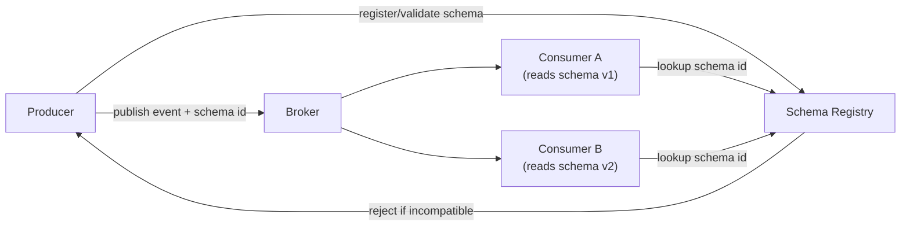

An event, once published, can outlive the code that produced it by years — it might sit in a topic with long retention, be replayed months later, or be read by a consumer that hasn't been redeployed since before the schema changed. Schema evolution is about designing events so that producers and consumers can change independently, on their own schedules, without either side breaking the other.

## Why event schemas outlive code

A request/response API call and its handler deploy together, roughly, so a breaking change can be coordinated in one release. An event is different: it is written once and may be read by many consumers, deployed at different times, some of which don't exist yet when the event is published, and some of which read it from long-retained storage well after the producer has moved on to a newer schema version. The schema is effectively a **public contract with the future**, not just with today's consumers.

> [!KEY]
> Treat every published event schema as permanent. You are not just changing a struct — you are changing a contract that unknown future readers, and possibly a replay of past data, both depend on.

## Compatibility modes, defined

| Mode | Rule | Example | Who can evolve safely |
|---|---|---|---|
| Backward compatible | A new schema can read data written with the old schema | Consumer upgraded to v2 can still read v1 events | Producers can be upgraded ahead of consumers |
| Forward compatible | An old schema can read data written with the new schema | Consumer still on v1 can read v2 events (ignoring new fields) | Consumers can be upgraded after producers, or lag behind |
| Full compatible | Both directions hold | Any mix of v1/v2 producers and consumers can coexist | Safest for independent deploy schedules — the usual target |

In an event-driven system with many independent consumer teams, **full compatibility** is the practical goal for most changes: you rarely control every consumer's deploy schedule, so you need both directions to hold simultaneously.

## Safe changes vs breaking changes

| Change | Safe? | Why |
|---|---|---|
| Add an optional field with a default | ✅ Safe | Old consumers ignore it (forward-compatible); new consumers get a sensible default for old data (backward-compatible) |
| Add a new event type | ✅ Safe | Existing consumers of other types are unaffected; new consumers opt in |
| Remove a field | ❌ Breaking | Any consumer still reading it gets a null/missing value it wasn't built to handle |
| Rename a field | ❌ Breaking | Equivalent to removing one field and adding another — no consumer maps the old name automatically |
| Change a field's type (string → int) | ❌ Breaking | Deserialization fails or silently coerces incorrectly |
| Repurpose a field's meaning without renaming it | ❌ Breaking (silently) | Old consumers keep reading it, now getting semantically wrong data with no error at all |
| Make a required field optional | ✅ Usually safe | Loosening a constraint rarely breaks an existing reader |
| Make an optional field required | ❌ Breaking | Old producers may still omit it, violating the new consumer's expectation |

> [!DANGER]
> Repurposing a field — reusing `status` to mean something new instead of adding `statusV2` — is the most dangerous change on this list precisely because it doesn't throw an error. Old consumers keep working, silently misinterpreting data, and nobody notices until a report or a downstream decision is visibly wrong.

## Never remove or repurpose a field

The two changes that must be permanently avoided, even years after a field looks unused, are removing a field and repurposing its meaning. If a field is truly obsolete, the safe path is: stop populating it with new data (send a default/null going forward), document it as deprecated, wait out the retention period plus a safety margin, confirm via consumer telemetry that nothing reads it, and only then consider a *new* event type without it — never edit the meaning of the existing field in place.

> [!WARNING]
> "Nobody uses that field anymore" is a belief, not a fact, until you've checked consumer-side metrics or asked every team that could plausibly subscribe. Long-retained topics and replay make "unused" very hard to verify from the producer side alone.

## Versioning strategies

| Strategy | How it works | Trade-off |
|---|---|---|
| Version field in the envelope | Each event carries `"version": 2`; consumers branch on it | Simple, but consumers accumulate branching logic over time |
| New event type per breaking change | `OrderCreatedV2` alongside `OrderCreated` | Explicit and unambiguous, but proliferates type names |
| Upcasting | A translation layer converts old-shaped events to the current shape before handing them to business logic | Keeps business logic clean; adds a maintenance layer of converters |
| Tolerant reader | Consumer only reads the fields it needs and ignores/defaults everything else | Naturally forward-compatible; requires discipline to never over-bind to the full shape |

> [!TIP]
> "Upcasting" is a term worth using by name — it signals you've actually operated an event-sourced or long-retention system, not just read about schemas in the abstract.

```csharp
// Upcaster: translate an old event shape into the current one before handling it.
public OrderCreatedV2 Upcast(JsonDocument raw)
{
    var version = raw.RootElement.GetProperty("version").GetInt32();
    return version switch
    {
        1 => new OrderCreatedV2
        {
            OrderId = raw.RootElement.GetProperty("orderId").GetString()!,
            Currency = "USD", // v1 had no currency field — safe, documented default
            Amount = raw.RootElement.GetProperty("amount").GetDecimal()
        },
        2 => JsonSerializer.Deserialize<OrderCreatedV2>(raw)!,
        _ => throw new NotSupportedException($"Unknown event version {version}")
    };
}
```

## Schema registry and contract enforcement

A schema registry (Confluent Schema Registry, AWS Glue Schema Registry) stores every version of every schema and enforces a compatibility rule (backward, forward, or full) at publish time — a producer trying to publish an incompatible change is rejected before it ever reaches consumers.



This shifts the failure earlier and makes it loud: instead of a consumer silently mis-deserializing an event in production, the producer's deploy or CI pipeline fails immediately with a clear compatibility violation.

## The event envelope

A well-designed envelope separates transport/routing metadata from the business payload, so the same metadata fields work across every event type in the system:

| Field | Purpose |
|---|---|
| `id` | Unique event ID — used for inbox-style deduplication downstream |
| `type` | Event type name, e.g. `OrderCreated` |
| `version` | Schema version of the payload |
| `timestamp` | When the event occurred (not when it was published, if the two can differ) |
| `correlationId` | Ties together all events belonging to one logical business operation |
| `causationId` | The specific event or command that directly caused this one — builds a causal chain |
| `payload` | The actual business data, versioned independently of the envelope |

```csharp
public record EventEnvelope<T>(
    Guid Id,
    string Type,
    int Version,
    DateTimeOffset Timestamp,
    Guid CorrelationId,
    Guid? CausationId,
    T Payload);
```

Keeping the envelope shape stable and evolving only the payload (plus its version number) means routing, logging, and tracing infrastructure never has to change when a business schema changes.

## Consumer-driven contracts and migrating consumers first

Consumer-driven contract testing has each consumer publish (to a shared registry or repo) the exact fields and shapes it actually depends on; producer CI runs against every registered contract and fails the build if a proposed change would violate one — catching breaking changes before publish, across team boundaries, without needing a live end-to-end environment. Practically, when a genuinely breaking change is unavoidable, **migrate consumers to tolerate both shapes first**, deploy the producer's new shape second, and only remove support for the old shape once every consumer has confirmed the migration — never the reverse order.

## Cheat sheet

- Events outlive code: long retention and replay mean an old schema can resurface at any time.
- Backward compatible = new schema reads old data. Forward compatible = old schema reads new data. Aim for full compatibility.
- Safe: add optional fields with defaults, add new event types, loosen constraints.
- Breaking: remove a field, rename a field, change a type, repurpose a field's meaning.
- Repurposing a field is the most dangerous change — it fails silently, not loudly.
- Versioning strategies: envelope version field, new event type, upcasting, tolerant reader — pick per situation, often combine them.
- A schema registry enforces compatibility at publish time, turning a future silent consumer bug into an immediate, loud producer-side rejection.
- Envelope metadata (id, type, version, timestamp, correlation, causation) should be stable even as payloads evolve.
- Migrate consumers to tolerate a new shape *before* producers start emitting it, never after.

## Common mistakes

| Mistake | Fix |
|---|---|
| Renaming or repurposing a field instead of adding a new one | Add a new field/event type; deprecate the old one gradually |
| Assuming forward compatibility is "someone else's problem" | Design for full compatibility — you rarely control every consumer's deploy schedule |
| Making a previously optional field required | Treat it as a breaking change requiring the same rollout care as removal |
| No schema registry or contract check in CI | Add automated compatibility validation before publish, not after an incident |
| Hard-binding consumers to the full event shape | Use a tolerant reader that only extracts the fields it needs |
| Deploying producer changes before consumers can handle them | Migrate consumers first, producer second, cleanup last |

## Summary

Because events are read by consumers you don't control on schedules you can't dictate, and because long retention means old data can resurface at any time, every published schema is effectively a permanent contract. Backward, forward, and full compatibility give precise vocabulary for what "safe" means; additive, default-backed changes are almost always safe, while removing, renaming, retyping, or repurposing a field is almost always breaking — often silently so. A schema registry, a stable envelope, upcasting or tolerant readers, and consumer-driven contracts turn schema evolution from a source of production incidents into a routine, low-risk part of shipping.

## Top Interview Questions

### Q1. Why do event schemas need more careful evolution than a typical internal API contract?

A request/response API's client and server are usually deployed close together in time, and a breaking change can be coordinated in a single release window. An event, once published, can be read much later by consumers deployed on entirely different schedules, some of which may not even exist yet when the event was first published, and long topic retention or replay means old-shaped events can resurface and be read by new code long after the producer has moved on. The schema is effectively a contract with an unknown future audience, not just today's known consumers, so changes that would be trivial in a synchronous API — renaming a field, changing a type — can silently break a consumer you have no visibility into.

### Q2. Define backward, forward, and full compatibility with examples.

Backward compatibility means a *new* schema can correctly read data written under the *old* schema — for example, a consumer upgraded to expect a new optional field can still process older events that lack it, using a default. Forward compatibility means an *old* schema can correctly read data written under the *new* schema — an old consumer that has never heard of a newly added field simply ignores it and keeps working. Full compatibility requires both directions to hold at once, which is what lets producers and consumers upgrade in any order without any coordinated deployment. In practice, full compatibility is the target for most changes because you rarely control every consumer's release schedule.

### Q3. Give three examples of safe changes and three examples of breaking changes to an event schema.

Safe: adding a new optional field with a sensible default (old consumers ignore it, new consumers get the default on old data); adding an entirely new event type (existing consumers of other types are unaffected); and loosening a constraint, like making a previously required field optional. Breaking: removing a field that any consumer still reads (they get a missing/null value they weren't built to handle); renaming a field (functionally the same as removing one and adding another, with no automatic mapping); and changing a field's type, such as a string becoming an integer, which typically fails deserialization outright or silently coerces incorrectly.

### Q4. Why is repurposing a field's meaning considered worse than removing it outright?

Removing a field usually causes a loud, immediate failure — a null reference, a missing-key exception, or a deserialization error that shows up in logs and gets fixed quickly. Repurposing a field — reusing an existing `status` field to mean something semantically different without renaming it — causes no error at all: old consumers keep deserializing successfully and keep running their logic, just against data that now means something different than they assume. This can silently corrupt downstream decisions, reports, or business logic for a long time before anyone notices, precisely because nothing crashes. The fix is always to introduce a new field or new event type for a new meaning, never to reinterpret an existing one in place.

### Q5. What is upcasting, and when would you use it over simply versioning the consumer's logic inline?

Upcasting is a translation layer that converts an older-shaped event into the current shape before handing it to business logic, so the actual handler code only ever deals with one, current schema shape regardless of which version was originally published. This is preferable to scattering `if (version == 1) ... else if (version == 2) ...` branches throughout business logic, because it isolates version-handling complexity into one well-tested converter layer and keeps the business logic clean as versions accumulate over years. It's especially valuable in event-sourced systems or long-retention topics where a consumer or replay might encounter five or six historical versions of the same event type in a single run.

### Q6. What role does a schema registry play in preventing breaking changes?

A schema registry stores every version of every event schema and enforces a configured compatibility rule (backward, forward, or full) at publish time: when a producer tries to register a new schema version, the registry checks it against the rule and rejects the publish if it would violate compatibility with schemas already in use. This turns a potential silent, future consumer failure into an immediate, loud rejection in the producer's CI/CD pipeline, at the moment the risky change is introduced rather than months later when a specific consumer trips over it. It also gives you a queryable history of every schema version ever used, which is essential when writing an upcaster or debugging a replay that touches old data.

### Q7. Design an event envelope. What fields belong in it versus in the payload, and why?

The envelope should carry metadata common to every event type, independent of business content: a unique `id` (used for downstream deduplication, e.g. an inbox table), the event `type` name, a schema `version` for the payload, a `timestamp` for when the event occurred, a `correlationId` tying together every event in one logical business operation, and a `causationId` identifying the specific event or command that directly triggered this one, forming a causal chain useful for debugging and tracing. The business-specific data belongs in a separate `payload` field, versioned independently — this separation means routing, logging, and tracing infrastructure never needs to change just because a business schema evolves, and correlation/causation IDs let you reconstruct an entire saga or workflow across services after the fact.

### Q8. A consumer team reports their service crashed after deserializing an event from your service. How do you investigate, and what's the long-term fix?

I'd first check whether the event's schema version differs from what the consumer expects — a missing field, an unexpected null, or a changed type are the most common causes — by comparing the actual event payload against both the current and prior registered schema versions. If there's no schema registry, this is often hard to pin down quickly, which is itself a signal to add one. The immediate fix might be a hotfix on the consumer to tolerate the new shape or roll back the producer's change; the long-term fix is enforcing compatibility checks at publish time via a schema registry or consumer-driven contract tests in the producer's CI, so this class of failure is caught before deploy rather than reported by an affected team afterward.

### Q9. What is a consumer-driven contract, and how does it change how teams coordinate schema changes?

A consumer-driven contract is a specification, authored and maintained by each consumer, describing exactly which fields and shapes it depends on from a given event type — checked into a shared repository or contract registry rather than left implicit. The producer's CI pipeline runs every registered consumer contract against any proposed schema change and fails the build if the change would violate one, which shifts the detection of a breaking change from "a consumer team files an incident weeks later" to "the producer's own pull request fails a check before merge." This removes the need for a live, coordinated end-to-end test environment across teams and makes the dependency between producer and consumer explicit and automatically enforced instead of tribal knowledge.

### Q10. Why should consumers be migrated before producers when a breaking change is genuinely unavoidable?

If the producer starts emitting the new shape first, every consumer still running the old code will immediately start failing or silently misbehaving on the new events, because they were never given a chance to prepare for the change — you've effectively forced a breaking change onto everyone simultaneously with no rollout window. Migrating consumers first means deploying them with logic that can tolerate *both* the old and new shapes (a tolerant reader or an upcaster), verifying via monitoring that every consumer has actually deployed and is coping correctly, and only then flipping the producer to emit the new shape — at which point consumers were already ready for it. The old-shape support is removed from consumers last, once telemetry confirms the producer has fully cut over and no old-shaped events remain in flight.

### Q11. How would you handle a field that's genuinely obsolete and safe to stop maintaining?

Rather than removing it outright, I'd first stop actively populating it with meaningful new data (sending a documented default or null going forward) and mark it deprecated in the schema documentation and registry, while leaving it structurally present so any consumer still reading it doesn't break. I'd then use consumer-side telemetry, schema registry usage reports, or direct outreach to every team that could plausibly subscribe to confirm nothing actually reads it anymore — "probably unused" is not sufficient given long retention and replay can resurface consumers you forgot existed. Only after that verification, and after waiting out at least one full retention/replay window, would I consider actually dropping the field from a new major schema version, and even then typically via a new event type rather than editing the existing one.

### Q12. How does schema evolution interact with event replay — what breaks if you replay old events through current consumer code?

If a consumer's current code assumes every event matches the latest schema version and it replays an older event missing a field the current code treats as required, deserialization can fail outright, or worse, silently populate a default that's wrong for that historical event's actual business context. This is exactly why upcasting or a tolerant reader matters for replay specifically — the consumer (or a preprocessing layer) must correctly interpret every historical version it might encounter, not just the latest one, since replay by definition reintroduces old-shaped data into current code paths. Any replay tooling should explicitly test against a representative sample of every schema version still present in retained storage, not just the current version, before being run against production data.
