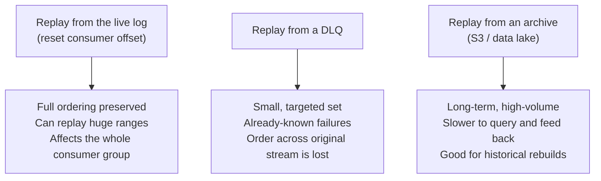
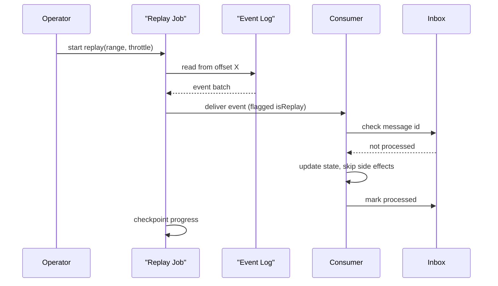

Replay is deliberately re-feeding events that were already produced — sometimes already consumed — back through a consumer. It is one of the most powerful recovery tools in an event-driven system and one of the easiest ways to cause a second incident on top of the first if you don't design for it in advance.

## When you need replay

| Scenario | Why replay is the fix |
|---|---|
| A bug in a consumer processed events incorrectly | Fix the bug, then replay the affected time range to reprocess correctly |
| A new consumer needs historical context | It didn't exist when past events were published — replay brings it up to date |
| Rebuilding a projection/read model | The read model is derived state; rebuild it by replaying the events that produce it |
| A data correction is needed | An upstream data error is fixed at the source, and downstream state must reflect the fix |

> [!KEY]
> Replay only works if the events are still available and consumers can safely process the same event more than once. Everything else in this page follows from those two requirements.

## Offsets and retention: the enabler

Replay is only possible because most brokers don't delete a message the instant it's consumed. Kafka retains messages for a configurable period (or forever, with compaction/tiered storage) and tracks **consumer offsets** separately from the log itself — resetting a consumer group's offset backward causes it to reread already-seen messages. SQS, by contrast, deletes a message once acknowledged, so "replay" there means pulling from a separate archive (S3, a data lake sink), not rewinding the queue itself.

| Source system | Retention model | How you replay |
|---|---|---|
| Kafka / Pulsar (log-based) | Time or size-based retention, offsets are just a pointer | Reset consumer group offset backward, or start a new consumer group from an earlier offset |
| SQS / traditional queue | Message deleted on ack | Replay from a DLQ (recent failures) or an archived copy (S3 sink), not the live queue |
| Event store (event sourcing) | Retained forever by design | Replay the whole stream, or from a specific event/sequence number, to rebuild a projection |

> [!TIP]
> "What's your retention policy, and does it double as your replay window?" is a fair question to ask back in an interview — it shows you know replay capability is a direct function of retention, not a given.

## Three replay sources, three different risk profiles



| Replay source | Best for | Watch out for |
|---|---|---|
| Live log (offset reset) | Reprocessing a time range after a bug fix, rebuilding a projection | Resets the whole consumer group unless you spin up an isolated one — affects live traffic if not careful |
| Dead-letter queue | Retrying a known, bounded set of failed messages | Original relative ordering between them and the rest of the stream is usually lost |
| Archive (S3, data lake) | Historical corrections, compliance reprocessing, long-past data | Requires a separate feed-back path into the live pipeline; slower, batchier |

## Side effects during replay, and how to suppress them

The core danger of replay is that a consumer's original run likely had side effects — sending an email, charging a card, calling a partner webhook — and replaying naively re-triggers every one of them. Three approaches:

1. **Idempotency at the effect** — the side effect itself is safe to repeat (an inbox table dedups by message ID before charging a card again).
2. **Replay in shadow mode** — route replayed events to a separate code path or environment that recomputes state/projections but explicitly no-ops on external side effects (no real emails sent, no real webhooks fired).
3. **Flag the replay explicitly** — tag replayed events (`isReplay: true` in the envelope or a separate topic) so consumers can choose to skip effect-triggering logic while still updating internal state.

> [!DANGER]
> Replaying a full event history through a consumer that emails customers on every `OrderCreated`, with no suppression, will re-send every historical order confirmation email at once. This is a real, repeated production incident pattern — always ask "what side effects does this consumer have?" before replaying anything through it.

## Idempotency is the precondition, not a nice-to-have

Replay safety and idempotent consumers are the same requirement viewed from two angles. If a consumer can already safely process a duplicate delivery (the standard at-least-once guarantee most brokers provide), it can — by construction — also safely process a replay, because a replay is just a very late, very intentional duplicate. This is why the inbox pattern matters even in systems that "never" naturally redeliver: replay makes redelivery a deliberate, scheduled event you will eventually need.

```csharp
// Same idempotent-receiver shape used for ordinary at-least-once delivery
// works unmodified for replay — that's the point.
public async Task HandleAsync(OrderCreatedEvent evt)
{
    if (await _inbox.AlreadyProcessedAsync(evt.Id, consumer: "email-service"))
        return; // replay or ordinary redelivery — same safe no-op

    if (!evt.IsReplay)
        await _emailSender.SendConfirmationAsync(evt.CustomerEmail, evt.OrderId);

    await _inbox.MarkProcessedAsync(evt.Id, consumer: "email-service");
}
```

## Shadow consumers and parallel run

For a risky change — a rewritten projection builder, a new fraud-scoring consumer — run the new logic as a **shadow consumer**: it replays the full history (or a representative slice) into its own isolated storage, in parallel with the existing production consumer, with its output compared against the current system but never actually serving traffic or triggering effects. Once the shadow's output matches expectations across a full replay, you cut over — either by promoting its storage to primary, or by letting it take over live traffic while the old one is retired.

## Throttling replay

A replay can generate months of traffic in minutes if run at full speed, which will overwhelm downstream systems sized for steady-state load, not a replay burst.

| Technique | Effect |
|---|---|
| Rate limit the replay job itself | Caps events/sec regardless of how fast the source can serve them |
| Replay into a lower-priority consumer group/partition | Live traffic isn't starved for broker resources |
| Batch with pacing (e.g. 1,000 events, pause, repeat) | Gives downstream systems (DBs, external APIs) breathing room to keep up |
| Backpressure-aware consumer (bounded channel, credit-based) | Replay naturally slows to the actual downstream capacity rather than the source's speed |

> [!WARNING]
> "Just replay the whole topic" without a throttle is a common way to turn a data-quality bug into an availability incident — the replay burst hits the same downstream database the live traffic depends on.

## Ordering during replay

Replaying from a single partition/log preserves original order. Replaying from a DLQ or an archive query often does not — messages may come back in a different order than they were originally produced, especially if failures were spread across time or partitions. If a consumer's correctness depends on ordering (e.g. applying updates to a projection in sequence), replaying out of order can silently produce a wrong final state with no error at all. Mitigation: replay from the log itself when order matters, or make the consumer's apply logic commutative/order-independent (e.g. compare a version/sequence number and reject stale updates) when it doesn't.

## Checkpointing

A long-running replay should checkpoint its own progress (last successfully replayed offset/timestamp), independent of the live consumer's own offset, so that if the replay job itself crashes partway through a multi-hour run, it resumes from where it left off instead of restarting from the very beginning or silently skipping a range.

## A replay runbook

| Step | Action | Why it matters |
|---|---|---|
| 1. Scope | Define the exact time range / partition / message set to replay | Prevents accidentally replaying far more than intended |
| 2. Confirm idempotency | Verify the target consumer safely handles duplicates | Non-idempotent consumers must not be replayed into directly |
| 3. Suppress side effects | Flag as replay, or route to a shadow path, for anything effect-triggering | Prevents re-sending emails, re-charging cards, re-firing webhooks |
| 4. Throttle | Set a rate limit well below downstream capacity | Prevents a replay-induced outage |
| 5. Checkpoint | Track replay progress independently | Allows safe resume after a crash mid-replay |
| 6. Verify | Compare a sample of replayed output against expected/previous state | Confirms correctness before declaring done |
| 7. Communicate | Notify on-call / downstream teams before starting | A sudden traffic pattern shouldn't page someone as a surprise |



## Cheat sheet

- Replay reasons: bug fix reprocessing, onboarding a new consumer, rebuilding a projection, correcting bad data.
- Retention is the enabler — Kafka-style logs let you rewind offsets; ack-and-delete queues need a separate archive.
- Three sources: live log (full order, affects the group), DLQ (targeted, order not preserved), archive (historical, batchy).
- Idempotency is the precondition for safe replay — a replay is just a very late, intentional duplicate delivery.
- Suppress side effects explicitly: flag replayed events, or run a shadow consumer that recomputes state without triggering external effects.
- Always throttle a replay — full-speed replay can overwhelm downstream systems sized for steady-state load.
- Ordering is preserved replaying from a log, not guaranteed replaying from a DLQ or archive query.
- Checkpoint replay progress independently of the live consumer's offset, so a crash mid-replay can resume safely.
- Verify output on a sample before declaring a replay complete, and tell on-call before you start.

## Common mistakes

| Mistake | Fix |
|---|---|
| Replaying through a consumer with unsuppressed side effects | Flag events as replay, or use a shadow consumer that no-ops external effects |
| Assuming replay is safe because "it's the same data" | Idempotency must be verified, not assumed — check for an inbox/dedup mechanism first |
| Running a replay at full source speed | Throttle to below downstream capacity |
| Replaying from a DLQ and expecting original ordering | Only the live log preserves order; design consumers to tolerate reordering otherwise |
| No checkpoint on a long-running replay job | Track replay progress independently so a crash can resume, not restart |
| Starting a large replay with no heads-up to on-call | Communicate scope and timing before starting |

## Summary

Replay turns "the data is already gone" into "we can safely re-derive it," but only if you designed for it before you needed it: retained, replayable storage; idempotent consumers that treat replay as just another duplicate delivery; explicit suppression of side effects; throttling so a replay burst doesn't become its own outage; and checkpointing so a long replay can resume after a crash. Treat every replay as a deliberate, scoped operation with a runbook, not an emergency improvisation — the difference between the two is usually whether the original design assumed replay would eventually be needed.

## Top Interview Questions

### Q1. What are the main reasons you'd need to replay events, and what do they have in common?

The common scenarios are: a bug in a consumer processed past events incorrectly and needs reprocessing after the fix; a new consumer is being onboarded and needs historical context it never received live; a projection or read model needs to be rebuilt because it's derived state and something changed in how it's derived; and a data correction upstream needs to propagate to everything downstream that already consumed the incorrect version. What they have in common is that the *events themselves* are treated as the durable source of truth, and any derived state (a database row, a read model, a side effect) can in principle be recomputed by re-running them — which only works if the events are still retained and consumers can safely process them again.

### Q2. Why does Kafka support replay naturally while a typical SQS-style queue does not?

Kafka is log-based: messages are retained for a configured period (or indefinitely with compaction) independent of whether they've been consumed, and consumer offsets are just a pointer into that log tracked separately per consumer group — resetting the offset backward causes the group to reread already-seen messages, which is a first-class, cheap operation. A traditional queue like SQS deletes a message once it's acknowledged, so there's nothing left in the queue to rewind to; "replay" there requires a separate durable copy of the data — typically an archive fed by a sink (S3, a data lake) — that gets read and re-published back into the live pipeline, which is a heavier, more manual operation than an offset reset.

### Q3. Compare replaying from the live log, from a dead-letter queue, and from an archive.

Replaying from the live log by resetting a consumer group's offset preserves full original ordering and can cover large ranges cheaply, but it affects the entire consumer group unless you first spin up an isolated group, so it risks interfering with live traffic if not scoped carefully. Replaying from a DLQ targets a small, already-known set of failed messages, which is precise and low-risk in volume, but the relative order between those messages and the rest of the original stream is typically lost since they were pulled out of sequence when they failed. Replaying from an archive (an S3 or data-lake sink) is best for historical or compliance-driven corrections over long time ranges, but it's slower to query, batchier to feed back into the live pipeline, and requires its own dedicated tooling since it isn't a native broker operation.

### Q4. Why is idempotency described as a "precondition" for replay rather than a separate concern?

A replay is functionally identical, from the consumer's point of view, to a very late, deliberately-triggered duplicate delivery of an event it may have already processed — and duplicate delivery is something any at-least-once messaging consumer must already tolerate correctly. If a consumer has a working inbox pattern or other dedup mechanism for ordinary redelivery, that exact same mechanism makes replay safe with no additional work, because the consumer can't distinguish "this is a network-retry duplicate" from "this is an intentional replay" — both just look like "I've seen this message ID before." Conversely, a consumer that isn't idempotent isn't safe to replay into at all, regardless of how carefully the replay job itself is built, so idempotency has to be verified as a prerequisite before any replay is attempted.

### Q5. How do you prevent a replay from re-triggering real-world side effects like emails or payments?

Three complementary techniques: rely on the consumer's existing idempotency (an inbox table) so a duplicate delivery — replayed or not — is detected and the effect isn't reapplied; explicitly flag replayed events, either via an `isReplay` field in the envelope or by routing them through a separate topic, so consumer logic can choose to update internal state but skip effect-triggering code paths entirely; or run a shadow consumer that recomputes derived state in isolated storage without any live external integrations wired up at all, so there's no side-effect path to accidentally trigger in the first place. Before replaying through any consumer, you should explicitly enumerate what side effects it has — this is the single most common way replays turn into incidents when skipped.

### Q6. What is a shadow consumer, and when would you use one?

A shadow consumer runs new or rewritten processing logic — a new projection builder, a rewritten fraud model — in parallel with the existing production consumer, replaying the same historical event stream into its own isolated storage, with no live external side effects and no traffic actually being served from its output yet. You'd use this to validate a risky rewrite before cutting over: replay the full (or a representative) history into the shadow, compare its output against the current production system's state or expected results, and only promote it to primary once you've confirmed correctness across the full replay. This gives you a safe way to test "does the new logic produce the right answer over real historical data" without any risk to live traffic or a rollback plan if it's wrong.

### Q7. Why must a replay be throttled, and what techniques would you use?

An event log or archive can typically be read far faster than the original event rate that downstream systems (databases, external APIs, other services) were sized to handle at steady state — replaying months of events in minutes can generate a traffic burst many times larger than anything the downstream capacity planning accounted for, causing a self-inflicted outage on top of whatever the replay was meant to fix. Techniques include explicitly rate-limiting the replay job itself regardless of source read speed, routing the replay through a lower-priority consumer group or partition so live traffic isn't starved, pacing in batches with pauses between them, and building the consuming side on a backpressure-aware pipeline (a bounded channel or credit-based flow control) so it naturally throttles to real downstream capacity rather than the replay source's speed.

### Q8. Does replay preserve message ordering? What are the implications for a consumer that depends on order?

Ordering is preserved when replaying directly from a single partition or log in its original sequence, because that's simply reading the same ordered structure again from an earlier point. It is generally *not* preserved when replaying from a dead-letter queue or querying an archive, since failed messages get pulled out of their original sequence when they fail, and archive queries typically return results in whatever order the query mechanism produces, not necessarily original production order. If a consumer's correctness genuinely depends on applying updates in order — for example, building a projection where a later update must overwrite an earlier one — replaying out of order can silently produce an incorrect final state with no visible error, so either replay from the log specifically when order matters, or make the consumer's apply logic order-independent by comparing a version/sequence number per record and rejecting stale updates.

### Q9. You need to run a replay that will take six hours. What do you build in to make this safe?

I'd add explicit checkpointing of the replay job's own progress — the last successfully replayed offset or timestamp, stored independently of the live consumer's offset — so that if the replay process itself crashes three hours in, it resumes from the checkpoint rather than restarting from zero or, worse, silently skipping the range it already covered. I'd throttle the replay to a rate well below downstream capacity so it doesn't create a six-hour sustained overload, verify a sample of output partway through rather than waiting until the end to discover a problem, and communicate the timing and scope to on-call ahead of time so an unusual but expected traffic pattern doesn't trigger a false-alarm page partway through.

### Q10. A replay just re-sent thousands of historical order confirmation emails to customers. What went wrong, and how do you prevent it next time?

The consumer that handles `OrderCreated` events clearly triggers a real side effect (sending an email) with no distinction between "first time seeing this event" and "this is a replay/duplicate delivery" — meaning it either lacked an idempotency check (an inbox table) entirely, or had one but the replay was run through a code path or consumer group that bypassed it. The immediate fix is apologizing and understanding the blast radius; the structural fix is adding (or repairing) an inbox-based idempotency check on that consumer so any future duplicate or replayed delivery is a safe no-op for the email-sending path specifically, and adopting an explicit replay-flagging convention so effect-triggering logic can be skipped deliberately during any future replay, verified with a dry run on a small time range before ever replaying at full scope again.

### Q11. How does replay relate to rebuilding a projection in an event-sourced system?

In event sourcing, a projection (a read-optimized view built from events) is explicitly derived state — the events are the source of truth, and the projection can always be thrown away and rebuilt by replaying the full event stream (or the relevant subset) through the projection-building logic from the beginning. This is actually the *most natural* and lowest-risk replay scenario, because projection builders typically have no external side effects at all — they just write to a read model store — so the side-effect-suppression concerns that apply to most consumers are largely moot; the main remaining concerns are throttling so the rebuild doesn't overwhelm the read store, and checkpointing progress for a rebuild that might take hours over a large stream.

### Q12. What would you check before approving a production replay request from another team?

I'd confirm the exact scope (time range, partitions, or message set) is precisely defined rather than open-ended, verify the target consumer has a working idempotency mechanism so duplicate processing from the replay is safe, and check what side effects that consumer has — anything that emails, charges, or calls an external partner needs an explicit suppression or shadow-mode plan before I'd approve it. I'd also want to see a throttling plan sized against the downstream systems' known capacity, a checkpointing approach if the replay is long-running, and confirmation that on-call and any affected downstream teams have been notified of the timing — a replay is a deliberate, scoped operation, and any of these missing is a reason to pause and fill the gap before proceeding.
