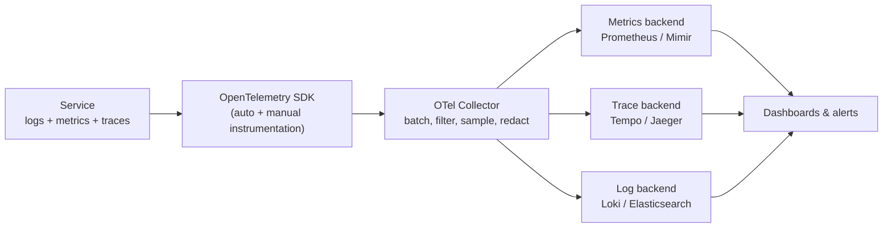

"Production latency suddenly increased — what do you do?" is answered with these three signals in a specific order: metrics tell you *something* is wrong and roughly where, traces tell you *which request path* is slow, and logs tell you *why*. Knowing which tool answers which question, and why you cannot fake one with the other, is the foundation the rest of this track builds on.

## Monitoring vs observability

Monitoring is watching for **known unknowns** — you predicted a failure mode and built a dashboard or alert for it. Observability is being able to answer **unknown unknowns** — a question you never anticipated, asked live against production data, without shipping new code.

> [!KEY]
> Monitoring answers questions you thought of in advance. Observability lets you ask a question you didn't think of, right now, and get an answer from the data you already have.

A system is "observable" when its internal state can be inferred from its external outputs — logs, metrics, and traces — without attaching a debugger.

## The three pillars compared

| | Logs | Metrics | Traces |
|---|---|---|---|
| What it answers | What exactly happened, with full context | Is the system healthy, in aggregate, over time | Where did this one request spend its time |
| Cardinality | High — free text, any field | Must be kept low (see below) | High per span, but scoped to one trace |
| Cost driver | Storage volume, ingest bytes | Number of unique time series | Storage volume, sampling rate |
| Retention | Days to weeks (expensive to keep long) | Months (cheap once aggregated) | Days (huge volume, sampled) |
| Query shape | Full-text / field search over a window | Aggregation over time (rate, avg, percentile) | Single request timeline, span tree |
| Reach for it when | You know the request ID or need the exact error | You need a trend, a rate, or an alert threshold | You need to find *where* time went across services |

None of these substitute for another. A dashboard full of green metrics cannot tell you why *this specific customer's* checkout failed at 14:02; a log line cannot tell you that error rate has been climbing for six hours; a single trace cannot tell you if this is a one-off or an emerging trend.

## Structured logging

A log line is only as useful as its queryability. Unstructured logs built by string interpolation are effectively write-only.

```csharp
// Bad — un-queryable. Can't filter by userId or amount without regex.
logger.LogInformation($"User {userId} charged {amount} for order {orderId}");

// Good — structured. Each value is a named field you can filter and aggregate on.
logger.LogInformation("User {UserId} charged {Amount} for order {OrderId}",
    userId, amount, orderId);
```

The second form, using message templates (a core feature of `Microsoft.Extensions.Logging`, Serilog, and most modern logging libraries), emits a structured event: the template stays constant (cheap to index) and the values become searchable fields. You can then ask "show me every charge over $500 in the last hour" as a query, not a regex.

> [!DANGER]
> String interpolation (`$"..."`) inside a log call bakes the values into the message text. You lose the ability to filter, aggregate, or group by that field — you can only full-text search, which is slow and imprecise at scale.

### Log levels — what belongs where

| Level | Use for | Example |
|---|---|---|
| `Trace`/`Debug` | Step-by-step detail, disabled in production by default | "Cache lookup key=xyz miss" |
| `Information` | Notable business events, request lifecycle | "Order 123 placed", "Payment authorised" |
| `Warning` | Recoverable anomaly, degraded but functioning | "Retrying after transient timeout" |
| `Error` | An operation failed and the user was affected | "Payment provider returned 500" |
| `Critical` | The whole service or a core dependency is down | "Database connection pool exhausted" |

## Metric types

| Type | Behaviour | Example | Watch out for |
|---|---|---|---|
| Counter | Only increases (or resets to 0 on restart) | `http_requests_total`, `orders_placed_total` | Use `rate()`/`increase()`, never read raw value |
| Gauge | Goes up and down, a snapshot value | `queue_depth`, `active_connections`, `memory_used_bytes` | No history baked in — sample frequency matters |
| Histogram | Buckets observations, gives distribution + percentiles | `http_request_duration_seconds` | Bucket boundaries fix your percentile accuracy |
| Summary | Client-side quantiles, cheaper to store, cannot aggregate across instances | Legacy latency tracking | Avoid for anything you need to average across pods |

> [!TIP]
> If asked "counter or gauge for in-flight requests?" the answer is gauge — it can go down. Counters that "reset" (like requests-per-restart) are still monotonic between resets; PromQL's `rate()` is specifically designed to handle that reset correctly.

## Cardinality explosion — the main cost driver

Cardinality is the number of unique time series a metric name produces once you count every label combination. A metric with `user_id` or `order_id` as a label is not a metric anymore — it is an unbounded set of metrics, and it will fall over your metrics backend or your bill.

```
http_requests_total{method="GET", route="/orders/:id", status="200"}   # fine — bounded
http_requests_total{method="GET", route="/orders/{orderId}", status="200"}  # explosion
```

> [!WARNING]
> The rule of thumb: labels should have a small, known set of possible values (HTTP method, status code class, route template, region). Never label with a customer ID, request ID, email, or raw path. That data belongs in a **log** or a **trace span attribute**, not a metric label.

## Sampling

Full-fidelity data at scale is unaffordable, so all three pillars sample or aggregate:

- **Logs** — sample verbose levels (`Debug`) in production, or sample a percentage of successful requests while always keeping errors.
- **Traces** — head-based (decide at the start, cheap, may miss rare slow traces) or tail-based (decide after seeing the full trace, catches the interesting ones, costs more to buffer). Covered in depth in the tracing page.
- **Metrics** — pre-aggregated at collection time (histograms, not raw events), so "sampling" here really means bucket/resolution choice.

## Events and profiles — the fourth and fifth signal

- **Events** — discrete, structured records of something that happened once (a deployment, a feature flag flip, a config change). Overlaying deploy events on a latency graph is often the fastest way to spot "the regression started at the same minute as the release."
- **Continuous profiling** — CPU/memory profiles sampled continuously in production (pprof-style, or .NET's `dotnet-trace`/EventPipe), letting you answer "which function is burning CPU right now" without attaching a debugger. This is increasingly treated as a peer signal to logs/metrics/traces for CPU-bound latency investigations.

## OpenTelemetry as the unifying standard

OpenTelemetry (OTel) is a vendor-neutral API, SDK, and wire protocol (OTLP) for emitting logs, metrics, and traces from one instrumentation layer, so you are not locked into a single backend (Datadog, Grafana, Application Insights, Honeycomb all accept OTLP). In .NET, it hooks into `ILogger`, `ActivitySource` (tracing), and `Meter` (metrics) — the built-in primitives — rather than requiring a separate SDK per signal.



The Collector sits between your services and your backends so you can change backends, add redaction, or resample without redeploying every service.

## Cheat sheet

- Metrics = trend and alerting, logs = detail and cause, traces = where time went across services.
- Monitoring = known unknowns, observability = unknown unknowns.
- Never string-interpolate a log message — use structured/templated logging so fields stay queryable.
- Counters only go up (use `rate()`); gauges go up and down; histograms give you percentiles.
- High-cardinality values (user ID, order ID, email) belong in logs/span attributes, never metric labels.
- Sampling is unavoidable at scale for logs and traces; keep errors and slow requests, sample the rest.
- Deploy/config-change events overlaid on graphs are the fastest correlation tool you have.
- OpenTelemetry unifies instrumentation across all three signals and decouples you from a specific backend.

## Common mistakes

| Mistake | Fix |
|---|---|
| Logging with string interpolation (`$"user {id}"`) | Use structured/templated logging so fields are queryable |
| Adding `user_id` or `order_id` as a metric label | Put high-cardinality identifiers in logs or trace attributes |
| Using `Summary` metrics and averaging across instances | Use histograms — they aggregate correctly across pods |
| Treating logs as your alerting mechanism | Alert on metrics; use logs to explain an alert after it fires |
| Logging everything at `Information` | Reserve `Information` for meaningful events; use `Debug` for step detail |
| Assuming one signal replaces the others | Use metrics to detect, traces to localise, logs to explain |

## Summary

Metrics, logs, and traces each answer a different question and each pay a different cost, and no single one can replace the others. Metrics detect that something is wrong and give you a trend; traces localise the problem to a specific service or hop; logs supply the concrete detail that explains why. Structured logging and disciplined, low-cardinality metric labelling are what keep this data affordable and queryable at scale, and OpenTelemetry is now the standard way to emit all three from one instrumentation layer without locking into a backend.

## Top Interview Questions

### Q1. What is the difference between monitoring and observability?

Monitoring is built around **known unknowns** — you anticipate a failure mode (disk fills up, error rate spikes) and build a dashboard or alert specifically for it. Observability is the broader property of a system: can you answer an **unknown unknown**, a question you never anticipated, using only the telemetry the system already emits, without shipping new code? A system with great dashboards but no ability to slice by an arbitrary dimension (a specific customer, a specific version, a specific region) is well-monitored but not observable. In practice you need both: monitoring to catch the failure modes you expect, observability to debug the ones you don't.

### Q2. Why can't you just use logs for everything?

Logs are expensive to store and slow to aggregate at scale, so they are a poor fit for continuous questions like "what is our p99 latency trend over the last month" — that requires scanning and parsing potentially billions of lines. Metrics pre-aggregate at collection time (a histogram bucket increment costs almost nothing) specifically so trend and threshold questions are cheap. Logs are the right tool for "what exactly happened to this one request" — high detail, low frequency of access, not the right tool for "is the system healthy right now."

### Q3. What's the difference between a counter and a gauge, and why does it matter?

A counter only increases (it may reset to zero on restart, e.g., `http_requests_total`); you never read its raw value, you apply a rate function like PromQL's `rate()` over a time window to get requests/sec, and `rate()` is specifically built to handle the restart-to-zero case correctly. A gauge is a point-in-time snapshot that can go up or down, like `queue_depth` or `active_connections` — you read it directly or average it. Picking the wrong type breaks dashboards: graphing a raw counter looks like an ever-climbing line that tells you nothing about current load; treating a gauge like a counter and applying `rate()` to it produces nonsense.

### Q4. Why is cardinality the main cost and reliability risk in a metrics system?

Every unique combination of a metric name and its label values creates a new time series that the backend must store and index. A metric like `http_requests_total{route, method, status}` with bounded label values (a handful of routes, a handful of statuses) stays in the hundreds or low thousands of series. Add a label with unbounded values — `user_id`, `order_id`, a raw unhashed path — and you multiply that by every distinct user or order that has ever existed, producing millions of series. This is called cardinality explosion, and it is the single most common way teams take down or bankrupt their metrics backend (Prometheus in particular degrades badly under high cardinality). The fix is to keep high-cardinality identifiers out of metric labels entirely and put them in logs or trace span attributes instead.

### Q5. What is structured logging and why does it matter for querying?

Structured logging emits a log event with named fields (`UserId`, `Amount`, `OrderId`) rather than a single pre-formatted string, typically via a message template like `"User {UserId} charged {Amount}"` where the template and the values are stored separately. This means you can query "every event where `Amount > 500`" as a real filter/aggregation instead of a brittle regex over free text, and the backend can index each field. String interpolation (`$"User {userId} charged {amount}"`) destroys this — by the time it reaches the log sink it is one opaque string, so you lose type information and the ability to filter or aggregate on any individual value.

### Q6. Walk me through what you'd check first when latency suddenly spikes in production.

First, metrics — check the RED/golden-signal dashboard to confirm scope: is it one endpoint, one region, one dependency, or global? That tells you whether to suspect a specific deploy, a downstream dependency, or infrastructure. Second, traces — pull a handful of slow traces from that window and look at the flame graph to see which span (which service call, which DB query) is consuming the extra time; this narrows "latency is up" to "the payment-service call is up." Third, logs — for that specific service and time window, pull structured logs (ideally correlated by trace ID) to see the actual error or warning that explains *why* that call is slow (timeout, connection pool exhaustion, a specific downstream error code). This detect-localise-explain order is exactly why you need all three signals, not just one.

### Q7. What's the difference between a histogram and a summary metric, and which should you default to?

Both estimate quantiles/percentiles of observed values (like request duration), but a summary computes the quantile client-side over a sliding window and exposes pre-computed values like p50/p99 — cheap to query but **cannot be aggregated across instances** (you cannot average a p99 from ten pods into a fleet-wide p99). A histogram stores counts in pre-defined buckets and lets the backend compute quantiles at query time using a function like PromQL's `histogram_quantile()`, which **can** be aggregated across instances first and then quantiled. Default to histograms for anything you'll ever need fleet-wide or multi-dimensional visibility into, which in practice is almost everything.

### Q8. Why shouldn't you log at Information level for every request?

High-volume `Information` logging on every request multiplies storage and ingestion cost roughly linearly with traffic, and it drowns the genuinely meaningful events (an order placed, a payment authorised) in noise, making search slower and more expensive. The better pattern: use metrics (counters/histograms) to capture the volume and latency of every request cheaply, reserve `Information` logs for business-meaningful, relatively low-frequency events, use `Warning`/`Error` for anomalies, and keep step-by-step request tracing detail at `Debug` (disabled in production, or sampled) unless you are actively debugging.

### Q9. What is OpenTelemetry and why has it become the default choice?

OpenTelemetry is a vendor-neutral specification, API, SDK, and wire protocol (OTLP) for producing logs, metrics, and traces from a single instrumentation layer. Before it, you typically instrumented separately per backend (a Datadog SDK, a New Relic SDK, a Jaeger client), meaning switching vendors meant re-instrumenting your whole codebase. With OTel, you instrument once, route through an OTel Collector, and can point the Collector at Prometheus, Tempo, Application Insights, Honeycomb, or Datadog without touching application code. In .NET it integrates with the existing `ILogger`, `ActivitySource`, and `Meter` primitives, so adopting it does not require rewriting existing instrumentation.

### Q10. Give an example where a metric alone would mislead you, and what you'd check next.

Average request latency looks fine at 120ms, but p99 has quietly climbed from 400ms to 3 seconds — a plain average hides this because it's dominated by the high-volume fast requests. Seeing this on a histogram-derived p99 graph tells you *something* is wrong for a tail of requests, but not which ones or why. The next step is traces: filter for traces above a duration threshold in that window, look at which span dominates their timeline (a specific downstream call, lock contention, GC pause), and cross-reference with logs from that service to find the concrete error or contention event. This is the detect (metric) → localise (trace) → explain (log) pattern in miniature.

### Q11. How would you decide what to put in a log line versus a trace span attribute versus a metric label?

Metric labels must be low-cardinality and bounded (method, status class, route template) because each unique combination creates a new stored time series — put anything unbounded (user ID, order ID, email, raw URL) here and you cause a cardinality explosion. Trace span attributes can be higher cardinality because they're scoped to a single trace/span rather than creating a persistent time series, so `order.id` or `customer.tier` are fine there and useful for filtering traces. Logs can hold anything, including large free-text payloads, stack traces, and full request/response bodies (subject to redaction), because each log line is its own independent record with no series-explosion risk — the cost there is storage volume and query speed, not cardinality blow-up.

### Q12. What are continuous profiles and events, and why are they sometimes called the fourth and fifth pillars?

An event is a discrete record of something that happened once and is worth annotating on a timeline — a deployment, a config change, a feature flag toggle — and overlaying these on a latency or error graph is often the single fastest way to correlate "the regression started at 14:03" with "we deployed at 14:03." Continuous profiling samples CPU/memory call stacks in production over time (via `dotnet-trace`/EventPipe in .NET, or pprof-style tooling elsewhere), letting you answer "which function is consuming CPU right now across the fleet" without attaching a debugger or reproducing locally. Both are increasingly treated as peers to logs/metrics/traces because they answer questions those three don't cover well: precise causal timestamps, and code-level hot-spot attribution.
