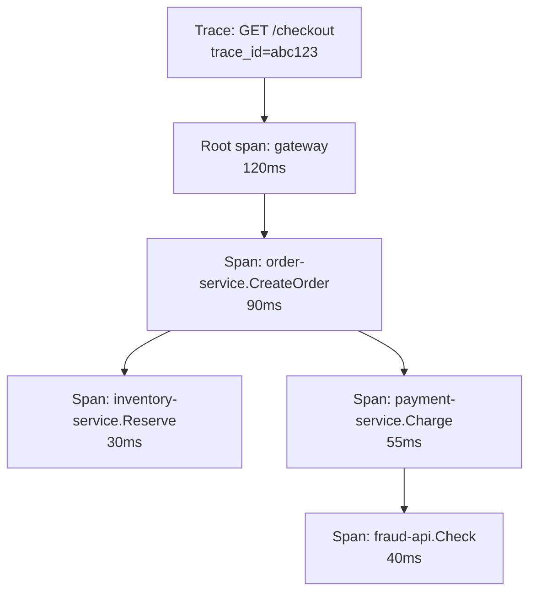
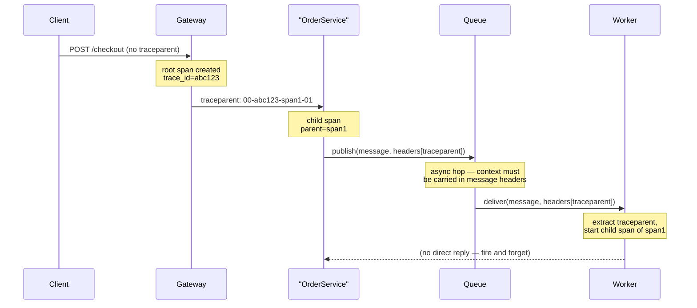

A single user request in a microservice architecture might touch a gateway, three services, a cache, a database, and a queue. Distributed tracing stitches all of that into one timeline so you can answer "where did the 2 extra seconds go" without guessing. It is the tool that turns "latency spiked" into "the payment-service call to the fraud-check API is slow."

## Traces, spans, and parent-child relationships

A **trace** represents one end-to-end request. A **span** represents one unit of work within it (an HTTP call, a DB query, a function). Spans form a tree: each span has a parent, except the root span, and children represent work done *because of* their parent (a downstream call, a retry, a cache lookup).



Each span carries: a `span_id`, its `parent_span_id`, a `trace_id` shared by the whole tree, start/end timestamps, a status (ok/error), and **attributes** — key-value metadata like `http.route`, `db.statement`, `order.id`.

| Field | Purpose |
|---|---|
| `trace_id` | Same across every span in the request — the thing you search by |
| `span_id` | Unique to this unit of work |
| `parent_span_id` | Links to the caller — builds the tree |
| `attributes` | Structured metadata for filtering/grouping within a trace |
| `events` | Timestamped notes within a span (e.g. "retry attempt 2") |
| `status` | ok / error, plus an optional message |

## Context propagation — the W3C traceparent

For the tree to connect across process boundaries, the trace context must travel with the request. The W3C standard header is `traceparent`:

```http
traceparent: 00-4bf92f3577b34da6a3ce929d0e0e4736-00f067aa0ba902b7-01
             ^^ version   ^^ trace-id (32 hex)     ^^ parent span-id  ^^ flags
```

Over HTTP, middleware reads the incoming `traceparent`, starts a child span, and injects a new `traceparent` into any outgoing request. This is automatic with OpenTelemetry's ASP.NET Core and `HttpClient` instrumentation — you don't hand-roll header propagation for synchronous calls.

> [!WARNING]
> The hop people forget is **through a message queue**. HTTP propagation is automatic; queue propagation is not. When a producer publishes to Kafka/Service Bus/SQS, the `traceparent` must be serialized into message headers/metadata by hand (or via a queue-specific OTel instrumentation package), and the consumer must extract it and start its span as a **child of the producer's span**, not a fresh root. Skip this and you get two disconnected traces instead of one — the classic "broken trace" problem.



## Correlation ID vs trace ID

They solve overlapping but distinct problems and interviewers expect you to know the difference:

| | Correlation ID | Trace ID (W3C) |
|---|---|---|
| Origin | Application-defined convention, often a custom header | Standardised format, `traceparent` |
| Scope | Often one logical business transaction across systems, sometimes reused across retries | One specific trace tree of spans |
| Structure | Opaque string, no built-in hierarchy | Structured — carries span hierarchy via parent-child IDs |
| Tooling | Requires custom log correlation | Native support in APM/tracing backends (Jaeger, Tempo, App Insights) |
| When you still need it | Cross-system business ID that outlives a single trace (e.g., an order ID spanning days) | Debugging the live, in-flight request path |

In practice, many teams log both: the trace ID for request-level debugging, and a business correlation ID (order ID, session ID) for tying together events that span multiple, separate traces over time.

## Sampling — head-based, tail-based, adaptive

Storing every span of every trace is prohibitively expensive at scale, so a sampling decision is made somewhere in the pipeline.

| Strategy | When decided | Pros | Cons |
|---|---|---|---|
| Head-based | At the root span, before the request executes | Cheap, simple, low overhead | May drop the rare slow/error trace you actually wanted |
| Tail-based | After the full trace completes, in the collector | Can keep 100% of errors/slow traces, sample the rest | Requires buffering the whole trace, more collector memory/cost |
| Adaptive/probabilistic | Rate adjusted dynamically based on traffic volume | Keeps a stable absolute volume regardless of traffic spikes | More complex to reason about "what % am I actually keeping" |

> [!TIP]
> A strong answer: "Head-based sampling at 1% keeps costs flat but might drop exactly the slow outlier we need. Tail-based sampling lets us keep 100% of errors and anything over, say, 1 second, while sampling healthy fast traces at 1% — the interesting traces are never the ones you lose."

## Reading a flame graph

A flame graph (span waterfall) lays spans as horizontal bars against a shared time axis, nested by parent-child. To find the slow span:

1. Find the widest bar relative to its parent — that span consumed the most of its parent's total time.
2. Check for **gaps** between a span's end and its child's start — that gap is time spent outside instrumented code (serialization, queueing, thread pool wait).
3. Look for spans that repeat identically — a retry storm or an N+1 query pattern hiding inside one logical operation.

> [!KEY]
> The span that is wide **and** has few or no children is usually your root cause — it did the work itself rather than delegating to something else that was slow.

## Instrumenting with OpenTelemetry in C#

```csharp
// Program.cs — register tracing once at startup
builder.Services.AddOpenTelemetry()
    .WithTracing(tracing => tracing
        .AddAspNetCoreInstrumentation()   // auto: incoming HTTP spans
        .AddHttpClientInstrumentation()   // auto: outgoing HTTP spans + traceparent injection
        .AddSource("OrderService")        // custom ActivitySource used by manual spans
        .AddOtlpExporter());

// Manual span for custom work, e.g. around a queue publish
private static readonly ActivitySource Source = new("OrderService");

public async Task PublishOrderCreated(Order order)
{
    using var activity = Source.StartActivity("PublishOrderCreated", ActivityKind.Producer);
    activity?.SetTag("order.id", order.Id);
    activity?.SetTag("order.total", order.Total);

    var message = new ServiceBusMessage(JsonSerializer.Serialize(order));
    // Manually propagate context across the async hop
    if (activity != null)
        message.ApplicationProperties["traceparent"] = activity.Id;

    await _sender.SendMessageAsync(message);
}
```

`ActivitySource`/`Activity` are .NET's built-in tracing primitives (System.Diagnostics), which OpenTelemetry wraps rather than replaces — this is why adding OTel to an existing .NET app rarely requires touching business logic.

## Overhead and cost

Tracing is not free: each span allocates memory, serializes attributes, and is exported over the network. Rules of thumb worth stating in an interview:

- Auto-instrumentation (ASP.NET Core, HttpClient, EF Core) adds low single-digit percent CPU overhead — acceptable almost everywhere.
- Excessive manual spans (one per loop iteration, one per tiny helper method) create noisy, expensive traces without adding debugging value — span *meaningful* units of work.
- Sampling is the primary cost lever; span count and attribute size per span are secondary levers.

## What belongs in a span attribute — and what doesn't

| Put in attributes | Keep out |
|---|---|
| `http.method`, `http.status_code`, `db.system` | Full request/response bodies |
| `order.id`, `customer.tier` (moderate cardinality, scoped to this trace) | Passwords, tokens, PII without redaction |
| `retry.count`, `cache.hit` | Anything that should instead be a metric label (aggregatable trend data) |

> [!DANGER]
> Span attributes are still exported and stored — dumping a full JSON payload or a stack trace into an attribute bloats every trace and can leak sensitive data into your tracing backend, which often has looser access controls than your primary logs.

## Cheat sheet

- A trace is a tree of spans sharing one `trace_id`; parent-child links reconstruct causality.
- W3C `traceparent` propagates automatically over HTTP via OTel's ASP.NET Core/HttpClient instrumentation.
- Queues are the async hop everyone forgets — you must manually carry `traceparent` in message headers and re-parent the consumer's span.
- Correlation ID = business-level, cross-system identifier; trace ID = structured, single-request tree with native tool support.
- Head-based sampling is cheap but can miss the interesting trace; tail-based can guarantee you keep all errors/slow traces at higher cost.
- In a flame graph, look for the widest bar and gaps between parent end and child start.
- `ActivitySource`/`Activity` are .NET's native tracing primitives; OpenTelemetry wraps them, it doesn't replace them.
- Span attributes: structured, moderate-cardinality metadata scoped to one trace — never bodies, secrets, or unbounded free text.

## Common mistakes

| Mistake | Fix |
|---|---|
| Assuming queue-based hops propagate trace context automatically | Manually inject/extract `traceparent` in message headers |
| Creating a new root span in the consumer instead of a child | Extract the producer's context and start a child span |
| One span per tiny function call | Span meaningful units — a DB query, an external call, not every helper |
| Putting full payloads or secrets in span attributes | Keep attributes small, structured, and redacted |
| Using only head-based sampling for a low-traffic critical path | Add tail-based sampling to guarantee errors/slow traces are kept |
| Confusing correlation ID with trace ID in an interview answer | State both, and when you'd use each |

## Summary

Distributed tracing reconstructs one request's path as a tree of spans linked by a shared trace ID, propagated automatically over HTTP via the W3C `traceparent` header but requiring manual handling across queues and other async boundaries. Sampling strategy (head vs tail vs adaptive) is the main cost-vs-completeness trade-off, and reading a flame graph means finding the widest span and the gaps between spans. OpenTelemetry, built on .NET's native `Activity` API, is the standard way to instrument this in C#, and disciplined span attributes keep traces useful without becoming a second, uncontrolled data store.

## Top Interview Questions

### Q1. What is the difference between a trace and a span?

A trace represents the entire journey of one logical request through a system, identified by a single `trace_id` shared across every piece of work done on its behalf. A span represents one unit of work within that trace — an HTTP call, a database query, a function boundary — and carries its own `span_id`, a `parent_span_id` linking it to its caller, start/end timestamps, attributes, and a status. Spans form a tree rooted at the entry point (e.g., the API gateway), and the shape of that tree — width, depth, gaps — is what you read to understand where time was spent and why.

### Q2. How does trace context propagate across an HTTP call, and where does it break down?

Over HTTP, the caller's tracing library injects a `traceparent` header (the W3C standard: version, trace ID, parent span ID, flags) into the outgoing request; the callee's middleware reads it and starts its own span as a child of that parent span ID, continuing the same trace ID. In ASP.NET Core and `HttpClient`, OpenTelemetry's auto-instrumentation does this for you with zero code changes. It breaks down at **asynchronous hops** — publishing to a message queue, writing to a database that's polled later, fire-and-forget background jobs — because there is no synchronous call to attach a header to. You must manually serialize the `traceparent` into the message's headers/metadata at publish time and manually extract and re-parent it at consume time, or you get two disconnected traces instead of one continuous tree.

### Q3. Compare head-based and tail-based sampling. Which would you use for a payments service?

Head-based sampling decides whether to record a trace right at the start (e.g., "sample 1% of requests"), before you know how the request will turn out — it's cheap and simple but can just as easily drop the one slow or failed request you actually needed. Tail-based sampling buffers the whole trace in the collector and decides after it completes, so you can keep 100% of errors and anything over a latency threshold while still sampling healthy traffic down to a low percentage — at the cost of more memory/compute in the collector and slightly delayed export. For a payments service, I'd use tail-based sampling (or a hybrid): payment failures and slow charges are exactly the traces you cannot afford to lose, and the extra collector cost is justified by the criticality of that path.

### Q4. What's the difference between a correlation ID and a trace ID?

A correlation ID is an application-defined, often opaque identifier used to tie together everything related to one business transaction, which might span multiple traces over a longer time window (e.g., an order ID that appears in logs across checkout, fulfillment, and shipping days later). A trace ID is a standardised (W3C `traceparent`) identifier for one specific request's span tree, with native support in tracing backends for visualizing the parent-child hierarchy, timing, and status. In practice you log both: the trace ID to jump straight into the flame graph for that one request, and the correlation ID to search logs and traces across the full lifetime of a business entity that outlives any single trace.

### Q5. A trace shows a span for `PaymentService.Charge` taking 900ms but its only child span, the fraud-check call, only took 40ms. What does that tell you, and what do you check next?

That 860ms is unaccounted for by any instrumented child — it's either being spent in code inside `Charge` itself that isn't wrapped in a span (serialization, a lock, an in-process computation) or it's a gap between the fraud-check span ending and the next thing happening. I'd first check for **uninstrumented work**: is there a synchronous JSON serialization, a retry loop, or a blocking call to something like a distributed lock or cache that isn't wrapped in its own span? Next I'd check logs for that span's time window on that service instance for GC pauses, thread pool queuing, or lock contention. This is a common case where the trace tells you exactly *where* to look (inside `Charge`, not downstream) even though it can't yet tell you *what* — that's when you add a manual span around suspected code, or pull a CPU profile for that instance.

### Q6. What overhead does distributed tracing add, and how would you keep it under control?

Auto-instrumentation for common frameworks (ASP.NET Core, HttpClient, EF Core, common queue clients) typically costs low single-digit percent CPU and modest memory for span buffering — acceptable for the vast majority of services. The overhead grows with span count and attribute size: instrumenting every tiny helper method or loop iteration creates thousands of near-useless spans per request, which both slows the app (allocation, serialization) and produces noisy, hard-to-read traces. The controls are: instrument at meaningful boundaries (network calls, DB calls, significant business operations) rather than everywhere, keep attributes small and structured rather than embedding large payloads, and use sampling as the primary lever for total data volume rather than trying to instrument less.

### Q7. What should and shouldn't go into a span's attributes?

Attributes should be small, structured, moderate-cardinality metadata useful for filtering and understanding that specific span — HTTP method and status code, the database system and operation type, business identifiers like order ID or customer tier, retry counts, cache hit/miss. They should not include full request/response bodies, stack traces, secrets, tokens, or unredacted PII — these bloat every trace's storage footprint and can leak sensitive data into a tracing backend that frequently has broader team access and looser retention/access controls than primary application logs or a secrets vault. If you need that level of detail, log it (with redaction) and correlate by trace ID, rather than embedding it directly in the span.

### Q8. How do you read a flame graph (span waterfall) to find the slow part of a request?

Spans are drawn as horizontal bars on a shared time axis, nested under their parent, so width represents duration and horizontal position represents when the work happened relative to its siblings. I look for the widest bar relative to its parent's total width — that's the span consuming the largest share of the request's time — and then recurse into its children the same way until I hit a span with few or no children that is still wide, which is usually the actual root cause rather than something delegating further down. I also look for gaps: time between a parent span's start and its first child's start, or between two sibling spans, that isn't covered by any span — that's usually serialization, queuing, or thread pool wait time that wasn't instrumented, and it's a hint to add a manual span there next time.

### Q9. What are the async hops that most commonly break traces, and how do you fix each?

The three common ones: (1) message queues — publisher and consumer are separate processes with no synchronous call between them, fixed by serializing `traceparent` into message headers/metadata and extracting it on consume to start a child span; (2) fire-and-forget background jobs or scheduled tasks — the triggering request may finish and its span may end before the job runs, so the job's span should still be started as a child of the trigger's context if it was captured at enqueue time, or accepted as a separate trace with a shared correlation ID if not; (3) batch/polling consumers that pick up work written earlier by an unrelated process — often there is no meaningful "parent" and the right answer is a fresh trace linked by a business correlation ID rather than forcing an artificial parent-child relationship.

### Q10. Why does OpenTelemetry use .NET's built-in `Activity`/`ActivitySource` rather than its own tracing primitive?

.NET added `Activity` and `DiagnosticSource` as first-class tracing primitives in the framework itself, independent of any specific vendor, years before OpenTelemetry's C# SDK matured. Rather than duplicating that with a separate concept, OpenTelemetry's .NET SDK wraps `Activity` directly — an `Activity` *is* an OTel span under the hood. This means libraries that already emit `Activity` data (ASP.NET Core, `HttpClient`, EF Core, gRPC) are automatically OTel-compatible with no code changes, and teams that hand-rolled `Activity`-based tracing before adopting OTel can adopt it incrementally by just adding exporters, not rewriting instrumentation.

### Q11. How would you debug a "broken trace" — where a request clearly went through service B but B's spans never show up under the same trace ID?

First check whether the hop between A and B is synchronous (HTTP/gRPC) or asynchronous (queue, event, scheduled job) — broken traces are almost always an async hop where context propagation isn't automatic. If it's a queue, check whether the producer is actually writing `traceparent` into message headers/metadata and whether the consumer's instrumentation is configured to extract it and start a child span rather than a fresh root; a common bug is the producer sending it under a slightly different header key than the consumer's library expects. If it's synchronous, check whether the call goes through a component that doesn't propagate headers by default — a raw `HttpClient` without the OTel instrumentation package, a proxy or API gateway configured to strip unrecognized headers, or a hop through code that manually constructs a new request without copying headers.

### Q12. In an interview, how would you argue for investing engineering time in better tracing instrumentation to a team that currently only has metrics?

I'd frame it around mean time to resolution: metrics tell you a request path is slow on average, but without traces, localizing *which* of ten downstream calls in a fan-out is responsible for a latency regression means manually adding logging, redeploying, and waiting for the issue to recur — often hours per incident. With tracing in place, that localization takes minutes by opening one slow trace and reading the flame graph, directly against production data, without a deploy. I'd also point out it compounds: once auto-instrumentation is in place for HTTP/DB/queue calls, the marginal cost per new service is near zero, while the cost of debugging without it scales with the number of services in the request path — which only grows over time in a microservices architecture.
