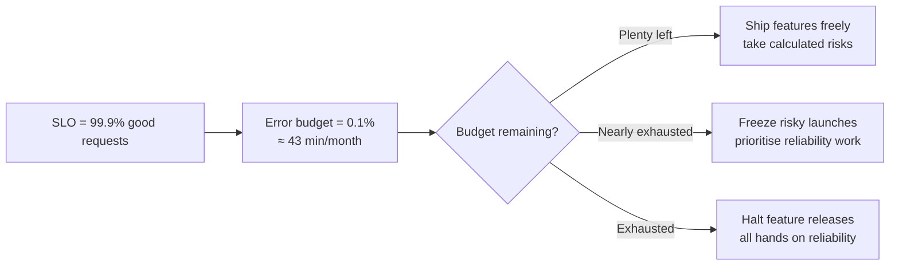

Error budgets turn "reliability" from a vague aspiration into a number a team can plan around. This page covers how to choose an SLI that reflects real user experience, how to set an SLO without guessing, and how the resulting error budget becomes the tool that decides whether the team ships features or pays down reliability debt this sprint.

## SLI, SLO, SLA — the vocabulary

| Term | Definition | Example |
|---|---|---|
| SLI (indicator) | A precise, measured metric of user-facing behaviour | "Proportion of HTTP requests completed in under 300ms" |
| SLO (objective) | The target value for an SLI over a window | "99.5% of requests under 300ms, over a rolling 30 days" |
| SLA (agreement) | A contractual promise, usually looser than the SLO, with a penalty for breach | "99.0% monthly uptime, or a service credit" |

> [!KEY]
> The SLO should always be **stricter** than the SLA. The gap between them is your safety margin — you want to notice and fix a problem internally long before you're contractually in breach.

## Choosing an SLI that reflects user experience

A good SLI is measured as close to the user as possible and reflects a dimension they actually care about. The common categories:

| Dimension | What it measures | Example SLI |
|---|---|---|
| Availability | Did the request succeed at all | % of requests returning non-5xx |
| Latency | Was it fast enough to feel responsive | % of requests under a threshold (not average!) |
| Quality | Was the response actually correct/complete | % of search results with zero degraded results served |
| Freshness | Is the data recent enough to be useful | % of dashboard reads with data less than 5 minutes old |
| Correctness | Did the system do the right thing | % of payments reconciled with no discrepancy |

> [!TIP]
> When asked "what SLI would you pick for X", always tie it back to what the *user* experiences, not what's easiest to measure server-side. For a search service, "search API responded" is a weaker SLI than "search API responded with at least one relevant result in under 500ms" — the second is harder to instrument but far closer to what "working" means to a user.

## Request-based vs window-based SLIs

| | Request-based | Window-based |
|---|---|---|
| Unit of measurement | Each individual request is good/bad | Each fixed time slice (e.g., each minute) is good/bad |
| Formula | good requests / total requests | good time windows / total time windows |
| Best for | High-volume services with many requests per window | Low-volume services, or batch/background systems without discrete "requests" |
| Weakness | Needs enough volume per window to be statistically meaningful | A single bad request can unfairly fail an entire minute-long window |

Most HTTP APIs use request-based SLIs because they have enough volume; batch pipelines and low-traffic services often use window-based instead ("was the pipeline healthy during this 5-minute bucket").

## Setting the target from data, not aspiration

The single most common SLO mistake is picking a round, aspirational number (99.99%) without checking what the system has actually achieved. The right process:

1. Pull 3–6 months of historical data for the chosen SLI.
2. Find the achieved percentile (what did we actually deliver, not what we hoped for).
3. Set the target slightly below that, leaving room to improve without needing an immediate, disruptive step-change.
4. Revisit quarterly as the system and traffic change.

> [!WARNING]
> "Five nines" (99.999%) sounds impressive but allows only about **5 minutes of downtime per year** — for most internal or non-safety-critical systems this is an unjustifiable engineering cost. Before agreeing to a target, always ask: what does the business actually lose per minute of downtime, and does that justify the cost of the next nine?

| Availability target | Downtime per year | Downtime per 30 days |
|---|---|---|
| 99% | ~3.65 days | ~7.2 hours |
| 99.9% | ~8.7 hours | ~43 minutes |
| 99.95% | ~4.4 hours | ~21.6 minutes |
| 99.99% | ~52 minutes | ~4.3 minutes |
| 99.999% | ~5.3 minutes | ~26 seconds |

## The error budget as a decision-making tool

If the SLO is 99.9%, the **error budget** is the remaining 0.1% — the amount of "badness" you're allowed before breaching the objective. It converts an abstract reliability conversation into a shared, numeric resource both product and engineering can plan against.



The error budget is a **shared resource**, not a penalty. It gives engineering explicit permission to take risks (ship faster, launch experimentally) when the budget is healthy, and it gives them explicit authority to say no to a risky launch when the budget is nearly spent — a conversation that used to be political now has a number attached.

## Burn rate and time-to-exhaustion

Burn rate is how fast you're consuming the error budget relative to the rate that would exactly exhaust it by the end of the window. A burn rate of 1x means "on pace to exhaust exactly at the SLO window's end"; a burn rate of 10x means "exhausting 10x faster than sustainable."

**Worked example:** SLO = 99.9% over 30 days → error budget = 0.1% of requests = 43.2 minutes of allowed "bad" time over the month.

| Burn rate | Meaning | Time to exhaust full budget | Typical response |
|---|---|---|---|
| 1x | Exactly sustainable | 30 days | Normal operation |
| 2x | Twice the sustainable rate | 15 days | Watch closely, investigate |
| 6x | Significant sustained issue | 5 days | Page — needs same-day attention |
| 14.4x | Severe, fast-onset | ~2 days | Page immediately — active incident |
| 60x | Consuming the full 30-day budget in ~12 hours | ~12 hours | Sev1, likely a full outage |

The core formula: `time to exhaustion = budget remaining / current burn rate`. If you've already burned 20% of the month's budget and it's day 5 of 30, your burn rate so far is `(20% / 5 days) / (100% / 30 days) = 1.2x` — trending to exhaust the whole month's budget by around day 25, five days early.

## SLA — the contractual, looser cousin

An SLA is what you promise externally, usually to a customer or in a contract, and typically comes with a financial or contractual remedy (service credits, termination rights) if breached. Because breaching an SLA has real business consequences, it should sit with meaningful margin below your internal SLO — you want your own alerting to fire and give you time to react well before you're anywhere near an SLA breach.

## Dependency SLOs and composite availability

If your service calls three downstream dependencies, each with its own SLO, your own achievable availability is bounded by the combination of theirs (for calls made in series, not in parallel/fallback):

```text
Composite availability ≈ SLO_A × SLO_B × SLO_C
99.95% × 99.9% × 99.99% ≈ 99.84%
```

> [!DANGER]
> A service cannot promise a higher SLO than the weakest critical dependency it calls synchronously without a fallback. If your payment provider only offers 99.9%, promising 99.99% end-to-end checkout availability is not achievable unless you add a fallback, cache, retry, or degrade gracefully when that dependency is down.

## Reporting and review cadence

- **Weekly** — burn rate trend, any active budget-related freezes.
- **Monthly** — did we meet the SLO, how much budget remains, any repeat offenders in the error breakdown.
- **Quarterly** — should the target itself change (traffic grew, architecture changed, business criticality changed)?

## Common mistakes

| Mistake | Fix |
|---|---|
| Picking 99.99% because it sounds good | Derive the target from historical achieved performance and real business cost of downtime |
| Using average latency as the SLI | Use a percentile threshold — averages hide the tail that users actually feel |
| Treating error budget policy as optional | Agree upfront, in writing, what happens when the budget is exhausted (feature freeze) |
| No margin between SLO and SLA | Keep SLO meaningfully stricter so you react before a contractual breach |
| One SLO for a service with very different user journeys | Define separate SLOs per critical journey (login, checkout, search) |
| Never revisiting the target | Review quarterly as traffic and architecture evolve |

## Cheat sheet

- SLI = measured indicator, SLO = internal target, SLA = external contractual promise (always looser than the SLO).
- Pick SLIs close to the user: availability, latency (percentile, not average), quality, freshness, correctness.
- Request-based SLIs for high-volume APIs; window-based for low-volume or batch systems.
- Set the SLO target from 3–6 months of historical data, not an aspirational round number.
- Error budget = 100% − SLO; it's a shared resource that grants permission to ship fast or forces a reliability focus.
- Burn rate = how fast you're consuming the budget relative to sustainable; time to exhaustion = budget remaining / burn rate.
- Composite availability across serial dependencies multiplies — you can't out-promise your weakest critical dependency.
- Review SLO targets quarterly; review burn rate weekly.

## Summary

An SLI is the precise, user-facing metric you measure; an SLO is the internal target you hold yourself to, set from historical data rather than wishful thinking; an SLA is the looser, contractual promise made externally with real penalties attached. The error budget — the gap between 100% and the SLO — turns reliability into a shared, numeric resource: healthy budget means ship and take risks, nearly exhausted budget means freeze and fix. Burn-rate maths lets you catch both a sudden severe outage and a slow sustained degradation before the budget, and the SLA behind it, are actually breached.

## Top Interview Questions

### Q1. What's the difference between an SLI, an SLO, and an SLA?

An SLI (service level indicator) is the precise, measured metric — for example, "the proportion of HTTP requests that complete successfully in under 300ms." An SLO (service level objective) is the internal target you set for that indicator over a window, like "99.9% of requests under 300ms over a rolling 30 days." An SLA (service level agreement) is a contractual, external promise — often to a paying customer — that is deliberately set looser than the SLO and typically carries a financial or contractual penalty if breached, such as service credits. The SLO should always be stricter than the SLA so your own alerting reacts and gives you time to fix a problem before you're in actual contractual breach.

### Q2. How would you choose a good SLI for a checkout service?

I'd start from what the user actually experiences during checkout rather than what's easiest to measure: availability (did the checkout request succeed at all, measured as a non-5xx response), latency (percentage of checkout requests completing under some threshold like 1 second, not the average), and correctness (percentage of completed checkouts where the charge and the order actually reconciled with no discrepancy). I'd avoid a purely infra-level SLI like "checkout-service uptime" because a service can be "up" while returning errors or silently double-charging — neither of which shows up in a simple uptime check but both of which are exactly what a user or the business cares about.

### Q3. Why should an SLO target be derived from historical data rather than chosen aspirationally?

Picking a round, aspirational number like 99.99% without checking what the system has actually achieved risks setting a target that's either trivially easy (wasting engineering effort chasing an unnecessary extra nine) or essentially unattainable given current architecture, traffic, and dependencies (guaranteeing constant, demoralising SLO breaches and error-budget alarms that don't reflect a real change in risk). The correct process is to pull several months of real performance data, look at what was actually achieved, and set the target slightly below that as a starting point that leaves room to improve deliberately — then revisit quarterly as the system evolves. This also makes the target defensible in a business conversation: it's grounded in evidence, not a marketing number.

### Q4. What is an error budget and how does it change team behaviour in practice?

The error budget is the complement of the SLO — if the SLO is 99.9%, the budget is the 0.1% of "badness" allowed before breaching it, often converted into a concrete unit like minutes of allowed downtime per month. Its practical power is that it turns "how much risk can we take this sprint" from a political argument into a shared number: when the budget is healthy, engineering has explicit permission to ship faster, run experiments, and take calculated risks; when the budget is nearly exhausted, there's a pre-agreed, non-negotiable trigger to freeze risky launches and reallocate the team to reliability work. This removes the recurring, unproductive debate between "ship the feature" and "fix reliability" by replacing it with a number both sides agreed to in advance.

### Q5. Walk me through the maths of burn rate with a concrete example.

Say the SLO is 99.9% over a rolling 30-day window, so the error budget is 0.1% of total request time, which works out to about 43.2 minutes of "bad" time allowed across the month. A burn rate of 1x means you're consuming that budget at exactly the sustainable pace to exhaust it right at the 30-day mark. If, five days into the window, you've already consumed 20% of the month's budget, your actual burn rate so far is (20% budget / 5 days) divided by (100% budget / 30 days) = 1.2x — meaning at this pace you'd exhaust the full month's budget by around day 25, five days before the window ends. A burn rate of 14.4x, by contrast, would exhaust the entire 30-day budget in about two days, which is why that specific threshold is commonly used for "page immediately, this is a severe incident" alerts.

### Q6. Why can't an SLI just be "average latency"?

Averages are dominated by the high-volume, fast requests and mathematically hide a slow tail — a service can have a perfectly healthy 50ms average while 2% of requests take 5 seconds, which is a real, painful experience for real users that an average-based SLI would never flag. The standard fix is a threshold-based SLI: "the percentage of requests completed under X ms," which directly counts how many users experienced acceptable latency, or tracking specific percentiles (p95, p99) as the underlying metric. This is one of the most common SLO design mistakes and a strong signal in an interview if you catch and correct it unprompted.

### Q7. What's the difference between a request-based and a window-based SLI, and when would you use each?

A request-based SLI evaluates each individual request as good or bad and computes the ratio directly — good requests divided by total requests — which works well for high-volume services where there's enough traffic in any given period to be statistically meaningful. A window-based SLI instead buckets time into fixed slices (say, each minute) and marks each slice as good or bad as a whole, then computes good windows over total windows — better suited to low-volume services, batch jobs, or systems without a clean notion of a discrete "request," where a single request-level SLI would be too noisy or not well-defined. The trade-off is that window-based SLIs can be harsh: one bad request in an otherwise healthy minute can fail that entire window.

### Q8. How do you think about composite availability across dependencies, and what's the implication for promising an SLO?

For dependencies called synchronously in series with no fallback, the combined availability is approximately the product of each dependency's individual availability — three dependencies each at 99.9% combine to roughly 99.7%, not 99.9%. This means you cannot honestly promise a higher SLO than your weakest critical synchronous dependency without adding resilience: a cache to serve stale-but-available data, a fallback path, retries with a circuit breaker, or graceful degradation that avoids failing the whole request when that one dependency is down. In an interview, this is the kind of answer that shows you understand SLOs aren't just measured, they're architecturally constrained by what you depend on.

### Q9. Your team's error budget for the month is fully exhausted with a week left. What do you actually do?

First, I'd confirm the agreed error-budget policy actually exists and is being followed — most teams pre-agree that budget exhaustion triggers a feature freeze and a shift of the team's focus to reliability work, and the value of the policy comes from actually honouring it rather than re-litigating it under pressure each time. Concretely: halt risky or non-essential deploys and experiments for the rest of the window, look at the error/latency breakdown to find what consumed the majority of the budget (often a small number of incidents or one bad deploy dominate), and prioritise fixing or hardening against that specific cause rather than generic reliability work. I'd also flag to stakeholders early rather than let it be a surprise at month-end reporting — the whole point of the budget is to make this conversation proactive, not reactive.

### Q10. How is an SLA different from an SLO in terms of what happens when it's breached, and why does the gap between them matter?

An SLO breach is an internal signal — it should trigger a blameless review, and depending on your policy, a feature freeze or reliability-focused sprint, but it's not a contractual event by itself. An SLA breach is external and typically has a defined, often financial, consequence: service credits, a right to terminate the contract, or another agreed remedy, because it was promised to a customer or partner in a legal agreement. The gap between the two is your safety margin: if you set the SLO meaningfully stricter than the SLA (say, 99.95% internal vs 99.9% contractual), your own alerting and error-budget process will trigger and give you a chance to fix a developing problem well before you're anywhere near the costlier, contractual failure.

### Q11. How often should SLO targets be reviewed, and what might trigger changing one?

I'd review burn rate weekly as an operational check, review whether the SLO was met and how much budget remains monthly, and revisit whether the target itself is still the right number on a quarterly cadence, since more frequent changes make the target feel arbitrary and less frequent risks it becoming stale. Triggers for actually changing a target include a significant architecture change (a new caching layer or a re-platform that meaningfully shifts what's achievable), a change in business criticality (a feature moving from experimental to revenue-critical), sustained traffic growth that changes the profile of load, or consistently and comfortably beating the current target quarter over quarter, suggesting there's room to either tighten it or reallocate the freed-up error budget elsewhere.

### Q12. In an interview, how would you respond if asked "why not just aim for 100% reliability"?

I'd explain that 100% is not just expensive but actually impossible to guarantee in a distributed system with dependencies, networks, and hardware that all fail independently, so treating it as the goal sets the team up for a permanent, demoralising sense of failure rather than a meaningful target. Beyond that, each additional nine of reliability costs disproportionately more engineering effort — going from 99.9% to 99.99% often requires multi-region failover, extensive redundancy, and operational rigor that may cost far more than the business impact of the marginal downtime it prevents. The right question isn't "how reliable can we be" but "what level of reliability does this specific user journey need, given what it actually costs the business when it fails" — which is exactly what the SLO-setting process from historical data and business impact is designed to answer.
