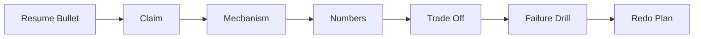

A resume bullet is a promise that you can explain a real decision under pressure. Treat each line as a miniature system design and behavioral story with scale, constraints, alternatives, failure modes, and your specific ownership.

## The interviewer attack path

Interviewers do not usually attack a bullet in the order it appears on the page. They start with the claim, then move toward evidence, mechanism, and judgment until they know whether you actually owned the work.



| Interviewer move | What they are testing | Your answer must contain |
|---|---|---|
| Ask what problem existed | Context and judgment | Users, business pain, scale, deadline, and why it mattered |
| Ask what you built | Technical ownership | Components, data flow, APIs, storage, and integration points |
| Ask why this design | Trade-off awareness | At least one rejected alternative and the rejection reason |
| Ask for numbers | Credibility | Source of each metric and whether it is measured or estimated |
| Ask what broke | Production maturity | Failure mode, detection, mitigation, and permanent fix |
| Ask what you owned | Level calibration | Clear separation between your decisions and team execution |

> [!KEY]
> A strong bullet is not a slogan. It is a claim you can defend with a mechanism, a measured result, and a trade-off you chose deliberately.

The safest preparation rhythm is to speak every bullet twice. First give a two-minute version that covers problem, personal action, and result. Then give a five-minute version that adds constraints, architecture, rejected alternatives, failure handling, and what you would change. If either version feels vague, the bullet is not ready.

## The drilldown ladder

Use the same ladder for every project, whether the bullet is about a distributed system, migration, security wave, developer platform, or business tool.

| Ladder step | Prompt to answer aloud | Good signal |
|---|---|---|
| Claim | What did the bullet say happened | One sentence with scope and result |
| Problem | What was broken before | User or business pain, not just implementation work |
| Mechanism | How did the system work | Architecture, data path, state, and integration contracts |
| Numbers | How did you measure success | Before and after metrics with units and time window |
| Alternatives | What else could you have done | Two options and the reason they lost |
| Failure | What would fail first | Detection, fallback, rollback, and on-call behavior |
| Ownership | What did you personally decide | Specific design, code, migration, negotiation, or review |
| Redo | What would you change now | A concrete improvement, not vague perfectionism |

A useful spoken structure is problem, constraints, design, decision, result, reflection. The first two parts prove that you understood the situation. The middle parts prove technical depth. The final reflection proves seniority because it shows you can evaluate your own work without becoming defensive.

```text
Bullet defense worksheet
Claim: one measurable achievement
Problem: who was hurt and why it mattered
Mechanism: components and data flow
Numbers: source, unit, and time window
Trade off: chosen option and rejected option
Failure drill: detection, fallback, rollback
Ownership: I designed, built, decided, led, or negotiated
Redo: one concrete improvement
```

> [!TIP]
> Use I for decisions and we for execution. A senior answer can be collaborative without hiding the specific judgment you brought to the project.

## Defending numbers honestly

Numbers make a resume credible, but they also create follow-up questions. Be ready to defend the source of every number such as seven million players, five thousand requests per second, 99.99 percent availability, p99 latency from 600 ms to 150 ms, 87 percent gateway load reduction, 130 developers, 20 tools, 150 titles per day, or a five million dollar campaign impact.

| Number type | Best evidence | How to phrase it |
|---|---|---|
| Traffic | Load test report, gateway logs, or App Insights | We sustained 5K RPS in staging and matched production shaped traffic |
| Latency | p95 or p99 dashboard over a named window | p99 moved from 600 ms to 150 ms after the partition key migration |
| Availability | SLO dashboard and incident history | We maintained 99.99 percent for six months after launch |
| Adoption | Telemetry, active users, or team inventory | 130 developers invoked the platform across more than 10 services |
| Business impact | Finance or product reporting | Finance tied campaigns authored through the platform to five million dollars quarterly |
| Security impact | Inventory, scan result, or audit | 14 services removed shared Redis keys and moved to Managed Identity |

If you do not have an exact value, do not invent one. State the measured input, state the assumption, and give a range. For example, if cache hit rate was 94 percent and read load was 5K RPS, then Cosmos absorbed roughly 300 RPS, assuming the hit rate was stable across hot content. That is stronger than pretending to remember an exact number.

## Personal ownership under pressure

The most common resume deep-dive failure is hiding behind we. Interviewers are not asking whether the project happened; they are asking whether your level matches the bullet.

| Weak answer | Strong answer |
|---|---|
| We migrated Cosmos and improved latency | I owned the partition key analysis, built the dual-write plan, and led the cutover review |
| We built an AI certification flow | I designed the stage isolation, idempotency key, and embeddings threshold calibration |
| We got teams to adopt the platform | I surveyed the pain points, built the first tools, and converted champions team by team |
| We remediated CVEs quickly | I wrote the service enumeration query, tiered blast radius, and drove P0 PRs |
| We used Redis | I chose Redis for hot read paths because scaling RU alone did not solve p99 latency |

A balanced answer gives credit without blurring accountability: this was a team of four, and my personal ownership was the architecture decision, migration plan, idempotency layer, and partner coordination. Then say what teammates owned. That makes you more credible, not less.

> [!WARNING]
> Do not claim implementation details you cannot defend. If you were the reviewer or architect rather than the primary builder, say that and go deep on the design reasoning you actually owned.

## Failure and redo drills

Every strong bullet needs a failure drill. This is not self-sabotage; it proves you understand production systems. Prepare the predictable what if questions before the interview.

| Failure question | Strong answer shape |
|---|---|
| What if Redis goes down | Fallback path, latency impact, alert, and recovery owner |
| What if messages duplicate | Idempotency key, conditional write, and safe retry behavior |
| What if a partner sends bad schema | Version check, dead letter reason, replay path, and contract test gap |
| What if traffic grows ten times | Bottleneck forecast, scale lever, and cost trade-off |
| What if migration fails halfway | Feature flag rollback, old system still receiving writes, and RTO |
| What if security exception is needed | Named expiry, approver, compensating control, and follow-up audit |

The redo answer should be specific. Say you would add partition heat maps from day one, build contract testing earlier, automate the AI evaluation harness, version the Terraform module before adoption, or create an SBOM based CVE dashboard before the next emergency. Avoid saying nothing. Perfect projects do not sound real.

## Self-audit and rapid fire loop

Do not stop after writing the answers. Score each bullet, then practice the follow-up path aloud until the answer is stable under interruption. The target is not memorization; it is having enough structure that you can recover when the interviewer jumps from architecture to ownership or from impact to failure.

| Dimension | Weak signal | Strong signal |
|---|---|---|
| Problem clarity | The system needed improvement | Names who was hurt, the scale, and why delay mattered |
| Metrics | Has impressive numbers | Knows source, time window, unit, and caveat for each number |
| Ownership | Mostly says we | Names the exact design, code, migration, review, or negotiation owned personally |
| Alternatives | Cannot name a realistic option | Compares at least two viable options and rejects one using constraints |
| Technical depth | Can describe the happy path | Can explain bottleneck, data model, retry behavior, and rollback |
| Business impact | Says it helped users | Connects the engineering work to launch speed, revenue, reliability, or security risk |
| Reflection | Says nothing would change | Names one design or process improvement with a reason |

Run a 20-question rapid-fire pass on interview morning. Keep each answer under a minute: why event-driven, why this partition key, what if Redis dies, how duplicate messages are handled, how the five million dollar number was measured, how 600 services were enumerated, how JIT revocation works, and how the AI threshold was tuned. Missed answers are not failures; they are the last gaps to patch.

| Practice mode | Time box | Goal |
|---|---|---|
| First sentence drill | 15 seconds | Make the opening sentence crisp and metric backed |
| Two-minute pass | 2 minutes | Cover problem, action, result, and one trade-off |
| Random follow-up | 60 seconds | Defend a specific decision without restarting the story |
| Failure drill | 90 seconds | Explain detection, degraded behavior, rollback, and permanent fix |
| Redo drill | 30 seconds | State one concrete improvement without sounding defensive |

The final test is consistency. If the news feed is 5K RPS in one answer, do not inflate it later. If the AI certification false-positive rate moved from 12 percent to under 2 percent, keep that wording stable. Interviewers forgive honest uncertainty; they do not forgive shifting numbers.

## Cheat sheet

- Every bullet needs a two-minute and five-minute answer.
- Lead with problem and stakes before architecture.
- Defend numbers with source, unit, window, and caveat.
- Name your specific contribution before the interviewer asks twice.
- Prepare at least two alternatives and why they lost.
- Include one failure mode, one fallback, and one rollback path.
- Use measured numbers when you have them and ranges when you estimate.
- Keep the redo answer concrete and slightly uncomfortable.
- Remove bullets you cannot defend for five minutes.
- Practice the first sentence until it is crisp under pressure.
- Reconcile contradictory numbers before the loop begins.

## Common mistakes

| Mistake | Fix |
|---|---|
| Starting with a component list | Start with the user or business problem and then explain components |
| Saying we for every decision | Use I for decisions you owned and we for shared execution |
| Quoting numbers without units | Attach RPS, milliseconds, percent, services, developers, or time windows |
| Claiming a flawless launch | Name one real risk, mitigation, or improvement you would make now |
| Forgetting rejected alternatives | Prepare Service Bus versus Kafka, Redis versus RU scaling, and dual-write versus big-bang style comparisons |
| Overfitting one story | Keep separate anchors for scale, migration, AI, security, business impact, and leadership |
| Making up implementation details | Be honest about your role and explain the reasoning you actually know |
| Ending with impact only | Close with reflection so the answer shows growth, not just success |

## Summary

Resume drilldown is about defensibility. A senior answer ties a concrete problem to an owned decision, a measurable result, a rejected alternative, and a production failure mode. Prepare every bullet the same way so the interviewer can probe anywhere without finding a hollow claim.

## Top Interview Questions

### Q1. How do you prepare to defend a resume bullet in a senior interview?

I prepare the bullet at two depths. The two-minute version is problem, what I personally did, and result with one metric. The five-minute version adds constraints, architecture, alternatives, trade-offs, failure handling, and what I would change. I also write down the first follow-up I expect, because that tells me whether the bullet has real depth. If the bullet says 99.99 percent SLO, I need to explain alerting, fallback, error budget, and production behavior. If it says migration, I need rollback and validation. A bullet is ready only when I can answer the first five why questions without inventing details.

### Q2. What is the difference between a two-minute and a five-minute resume answer?

The two-minute answer is a credibility pass. It should say what problem existed, what I owned, and what changed, with one or two numbers. The five-minute answer is the depth pass. It includes constraints, architecture, alternatives considered, the hardest technical decision, failure behavior, and reflection. For example, the two-minute Cosmos answer is p99 latency was 600 ms, I redesigned the partition key and migrated with dual-write, and p99 became 150 ms. The five-minute version explains why category partitioning was hot, why RU scaling was rejected, how shadow reads validated correctness, and how the feature flag made rollback safe.

### Q3. How do you answer what was your specific contribution without sounding self-centered?

Start by acknowledging the team, then separate decisions from execution. A strong answer sounds like this was a team of four, and my personal ownership was the partition key analysis, the dual-write migration plan, the feature flag rollout, and the cross-org cutover review. The team built the broader API surface and dashboards. That answer is collaborative because it credits others, but it is also scorable because it identifies what you personally decided and built. Avoid vague claims like I helped with the architecture. Use verbs such as designed, implemented, validated, negotiated, reviewed, or led.

### Q4. How should you defend a metric when you do not have the exact source in front of you?

Be explicit about what is measured and what is estimated. Say the metric you do have, the source you remember, and the assumption behind any derivation. For instance, I do not have the exact Cosmos read count in front of me, but the system handled 5K RPS and the Redis hit rate settled around 94 percent, so Cosmos saw roughly 300 RPS on the hot path. That assumes the hit rate was stable across the main feed queries. This style is credible because it shows numerical reasoning and avoids false precision. A confident fabricated number is much worse than an honest range.

### Q5. Why do interviewers ask for rejected alternatives on your own project?

They are testing whether you made a design decision or merely followed the first idea. A senior engineer can name options, constraints, and rejection reasons. For example, Service Bus over Kafka might be justified by lower operational overhead, native dead lettering, and modest write volume. Redis over simply adding Cosmos RU might be justified because RU scaling increases cost but does not remove hot read latency. Dual-write over big-bang cutover might be justified by rollback time. The alternative does not need to be wrong in general; it only needs to be wrong for the constraints you had.

### Q6. What should you do if a resume bullet represents work you reviewed but did not build?

Do not pretend to be the primary implementer. Say your actual role and then go deep where you can be truthful. For example, I was the design reviewer rather than the engineer who wrote the service, so my contribution was evaluating the partition strategy, identifying migration risk, and approving the rollout plan. I can explain the architecture and trade-offs, but I did not write the backfill script. This is not weakness; it is trust building. If the bullet cannot survive that honest framing, rewrite it or remove it before the interview.

### Q7. How do you talk about production failures without damaging the story?

Use failures to prove production maturity. Name the failure mode, how it was detected, what degraded behavior protected users, and what permanent fix followed. For a cache-backed feed, say Redis failure falls back to Cosmos with higher but acceptable latency, while alerts on cache miss rate fire before SLO breach. For Service Bus, say duplicate messages are expected, so idempotency keys make retries safe. Avoid saying nothing broke. At senior levels, the interviewer expects live-site reality. The best answer shows calm ownership, not perfection.

### Q8. What makes a resume bullet indefensible?

A bullet is indefensible when it contains a big claim without a mechanism. Red flags include no metrics, no personal ownership, no rejected alternatives, no failure scenario, and no way to explain the architecture. Another warning sign is inconsistent scale: saying 5K RPS in one answer and millions of requests per second in another. A bullet can also be indefensible because the role is overstated. If you were only adjacent to the work, frame it as a contribution rather than ownership. The goal is not to maximize impressive words; it is to maximize truthful depth.

### Q9. How do you convert a team achievement into an interview answer about your level?

Turn the team achievement into a decision map. Identify the decisions you personally made, the artifacts you created, the code you wrote, the reviews you led, and the negotiations you handled. Then state team execution separately. If the achievement was a developer platform adopted by 130 engineers, your level signal might be discovering the pain through surveys, choosing CLI distribution over a portal, designing JIT access revocation, and driving champions without a mandate. The adoption number is the impact, but the decision map is what lets the interviewer evaluate your seniority.

### Q10. How should you practice resume drilldown before the interview?

Use rapid-fire practice with a timer. For each bullet, answer the first sentence in 15 seconds, the two-minute version in two minutes, and one random follow-up in 60 seconds. Rotate across themes: scale, latency, AI, security, business impact, migration, and leadership. Keep a checklist for metrics, alternatives, failure mode, personal contribution, and redo. If you consistently overrun, you are probably explaining architecture too early. If you consistently finish in 30 seconds, the story lacks depth. Practice aloud because silent preparation hides gaps in sequencing and confidence.
