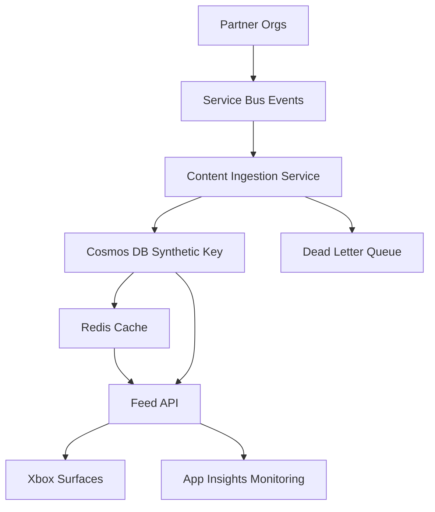
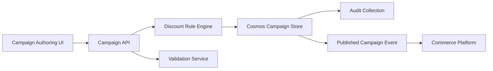
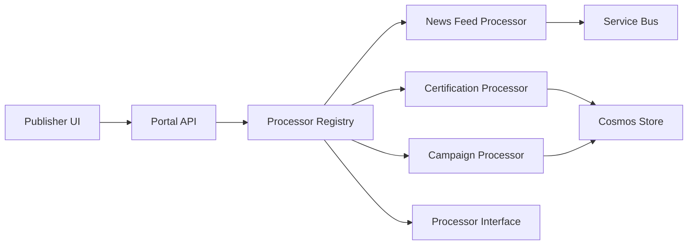

These projects show how to defend platform work that spans APIs, partner integrations, business rules, and organization-wide adoption. Use them when the interviewer wants evidence of scale, product judgment, cross-team leadership, and clean extensibility.

## Publisher News Feed Platform

### Interview pitch

I designed and led the Publisher News Feed Platform, replacing more than 20 legacy content systems with one event-driven service for Xbox surfaces. The platform served 7M players at 5K RPS with a 99.99 percent SLO, exposed 15 REST APIs, ingested content from hundreds of publishers through five partner organizations, and ran on Cosmos DB plus Redis.

> [!KEY]
> The strongest hook is not the component list. It is that one platform replaced fragmented ownership while keeping 7M players live under a 99.99 percent SLO.

### Architecture



### Decisions and trade-offs

| Decision | Chosen approach | Rejected alternative | Reason |
|---|---|---|---|
| Partner integration | Service Bus events | Shared database writes | Shared writes couple schemas, SLOs, and blast radius across teams |
| Read path | Redis in front of Cosmos | Only increasing Cosmos RU | RU scaling increases cost and does not give sub-millisecond hot reads |
| Partitioning | Synthetic hash prefix plus publisher and content type | Category only | Category skew made popular genres hot partitions and publisher alone left top-publisher skew |
| Idempotency | Document key per content event | Deduplication query | Key based writes are constant time and safe during retry storms |
| Monitoring | App Insights dashboards and alerts | Manual partner status tracking | SLO work needed objective alerts and shared launch visibility |

### Hard problems and impact

| Area | Detail |
|---|---|
| Scale | 7M players, 5K RPS peak read load, p99 target of 150 ms |
| Reliability | 99.99 percent SLO maintained for more than six months post launch |
| Scope | 20 plus legacy systems retired and 15 REST APIs shipped |
| Partner model | Five partner organizations aligned through adapters and rollout status |
| Publisher reach | Hundreds of publishers gained a consistent delivery path |

The hard technical decision was the partition key. I modeled historical content IDs before committing, then validated the new distribution under production shaped load. The hard organizational problem was schema alignment across partner teams. Each partner could publish its native message shape, while the ingestion service normalized into a canonical model. If I rebuilt it, I would add partition heat map monitoring, partner contract tests, and migration runbooks before the first cutover instead of adding them under launch pressure.

### Failure drills

| Drill | Defensible answer |
|---|---|
| Redis outage | Fall through to Cosmos, watch miss rate, accept higher latency while preserving correctness |
| Partner schema drift | Version message contracts, dead-letter unsupported versions, replay after adapter fix |
| Retry storm | Idempotency key makes duplicate events safe and DLQ depth triggers on-call review |
| Ten times traffic | Revisit cache sizing, partition heat, RU headroom, and API gateway throttling |

The senior angle is that every partner integration failure should degrade ingestion, not player reads. That is the point to repeat if the interviewer challenges why the design is asynchronous.

## Sales Campaign Authoring Platform

### Interview pitch

I built the internal Sales Campaign Authoring Platform for Xbox game offers, discounts, regional pricing, and campaign publishing. It replaced spreadsheet driven workflows, supported auditable changes, absorbed a mid-flight discount stacking requirement, and was tied by finance to five million dollars of quarterly campaign value.

### Architecture



### Decisions and trade-offs

| Decision | Chosen approach | Rejected alternative | Reason |
|---|---|---|---|
| Discount logic | Composable rule pipeline | Monolithic calculator | New rule types should not require rewriting core calculation code |
| Audit trail | Cosmos change feed into audit collection | Application layer audit writes | Change feed captures mutations even when a path bypasses the API |
| Scope control | Priority ordering first and stacking as fast follow | Full stacking at launch | Full stacking added about three weeks and threatened the fixed date |
| Business modeling | Offers, rules, regions as separate entities | Spreadsheet shaped records | Composable entities reflected real campaign scenarios and validation |

```csharp
public interface IDiscountRule
{
    int Priority { get; }
    DiscountResult Apply(DiscountContext context);
}
```

### Hard problems and impact

| Metric | Result |
|---|---|
| Business value | Five million dollars quarterly campaign value tied to authored campaigns |
| Rule change | Eight distinct stacking constraints extracted after requirements changed |
| Extensibility | Regional pricing rules added without core pipeline changes |
| Auditability | Zero data inconsistencies found in the change feed audit log |
| Delivery | MVP date held and full stacking shipped three weeks later |

The hardest moment was when finance added discount stacking two months into development. I ran a focused requirements session, separated priority ordering from full stacking, negotiated the MVP, and kept the rule interface extensible enough for the fast follow. The redo is clear: add simulation mode earlier so analysts can preview campaign impact before publishing, and consider event sourcing if reconstructing campaign state at a prior time becomes a first-class requirement.

> [!TIP]
> For business impact, say campaigns authored through the platform were tied to the revenue number. That is precise and avoids implying the tool alone generated demand.

### Failure drills

| Drill | Defensible answer |
|---|---|
| Bad campaign publish | Validation blocks invalid dates, regions, and price rules before publish event |
| Rule conflict | Priority order and mutual exclusion resolve conflicts deterministically |
| Audit gap | Change feed captures mutations even if an application path forgets an audit write |
| Late requirement | Split MVP from fast follow and keep the interface open for new rule classes |

The story should sound product aware. The hardest trade-off was not just code structure; it was protecting a fixed launch while acknowledging finance had discovered valid rules late.

## Publisher Portal Monorepo

### Interview pitch

I designed the Publisher Portal Monorepo with independent UI deployment and a pluggable processor model. The architecture became the default pattern for publisher-facing portal work, was adopted across 12 products, and removed deployment coupling between UI changes and backend releases.

### Architecture



### Decisions and trade-offs

| Decision | Chosen approach | Rejected alternative | Reason |
|---|---|---|---|
| Extensibility | Processor interface with registry | Direct integration per type | Core API should not change for every new processor |
| Deployment | UI and backend deployed independently | Shared pipeline | Backend rollback should not force UI rollback |
| Feature release | Forward compatible APIs and flags | UI depends immediately on new backend behavior | Flags let UI ship safely before full backend exposure |
| Repository model | Monorepo with per-project pipelines | Polyrepo | Shared contracts and components were easier to update together |

### Hard problems and impact

| Metric | Result |
|---|---|
| Adoption | Architecture adopted across 12 products |
| Deployment safety | Zero deployment coupling incidents after adoption |
| Extension path | New processor type required one class and registration |
| Publishing volume | Platform supported 150 plus daily game publishes in the broader portal flow |
| Influence | Adoption spread through engineering forum, demos, and templates rather than mandate |

The pluggable processor model made the core API stable while letting teams extend portal behavior. Processors registered at startup, advertised whether they could handle a request, and executed without modifying the registry. What I would change is contract testing. Some teams implemented subtle contract violations such as missing null handling, and those surfaced late in integration instead of in CI.

> [!WARNING]
> Do not let the monorepo detail dominate the answer. The interview signal is deployment decoupling, extensibility, and adoption across 12 products.

### Failure drills

| Drill | Defensible answer |
|---|---|
| Backend rollback | UI stays on stable API contract and feature flags hide unreleased behavior |
| Bad processor | Registry isolates the extension point and contract tests should catch invalid behavior |
| Shared contract change | Monorepo makes cross-cutting PRs visible and per-project pipelines limit blast radius |
| Team resistance | Start with two adopters, publish the template, and let visible release speed pull teams in |

The senior signal is a standard that other teams can safely use. If a pattern only works when the original author reviews every change, it is not yet a platform.

### Interview framing

Use these three projects as a progression of platform scope. The feed story proves that you can own a high-scale runtime service with real SLO pressure. The campaign story proves that you can model messy business rules and negotiate scope without losing launch discipline. The portal story proves that you can turn a design into an adopted organizational standard. In a loop, avoid telling all three with the same emphasis. If the interviewer asks about technical depth, lead with the feed partitioning and cache behavior. If they ask about product judgment, lead with discount rules and finance trade-offs. If they ask about staff-level influence, lead with 12-product adoption and the processor contract.

| Prompt | Best project | First hook |
|---|---|---|
| Scale and reliability | Publisher News Feed Platform | 7M players and 99.99 percent SLO |
| Business requirements | Sales Campaign Authoring Platform | Stacking rules arrived two months in |
| Organizational leverage | Publisher Portal Monorepo | 12 products adopted the pattern |

## Cheat sheet

- News feed is the scale, SLO, and cross-partner ownership story.
- Sales campaign is the business impact, rule modeling, and scope negotiation story.
- Publisher portal is the org-wide architecture adoption and deployment decoupling story.
- For news feed, expect partition key, Redis fallback, Service Bus, and partner schema questions.
- For campaign authoring, expect rule engine, audit log, revenue attribution, and changing requirements.
- For portal monorepo, expect processor contract, feature flags, monorepo trade-offs, and adoption path.
- Use exact numbers but phrase business numbers as enabled or tied to finance reporting.
- Always end with a redo: heat maps, simulation mode, event sourcing, or contract tests.

## Common mistakes

| Mistake | Fix |
|---|---|
| Listing all 15 feed APIs | Explain the platform data path and only name API count as impact |
| Saying Service Bus was chosen because it was available | Explain dead lettering, at least once delivery, and lower operating burden |
| Overclaiming five million dollars | Say finance tied authored campaigns to that quarterly value |
| Making the rule engine sound abstract | Explain priority order, mutual exclusion, and fast follow stacking |
| Treating monorepo as the achievement | Tie it to independent deployment and shared contracts |
| Ignoring adoption mechanics | Explain demos, templates, champions, and architectural forum visibility |
| Saying nothing would change | Name heat maps, contract tests, simulation mode, or event sourcing |

## Summary

Platform and API stories win when they connect architecture to adoption. The news feed shows high-scale service ownership, the sales platform shows business rule modeling under changing requirements, and the portal monorepo shows a reusable architecture that influenced 12 products. Across all three, the defensible answer is problem, data flow, decision, metric, failure mode, and redo.

## Top Interview Questions

### Q1. How did the Publisher News Feed Platform achieve a 99.99 percent SLO?

The SLO came from both architecture and operations. The read path used Redis for hot content and Cosmos as a fallback, so cache failure degraded latency rather than availability. Partner ingestion was asynchronous through Service Bus, which isolated partner outages from feed reads. Duplicate messages were expected and handled with idempotency keys, while invalid messages went to a dead letter queue for replay. App Insights dashboards tracked p99 latency, availability, cache miss rate, and DLQ depth, with alerts before the formal SLO boundary. I would emphasize that 99.99 percent was not one trick; it was fallback behavior, isolation, retry safety, and monitoring together.

### Q2. Why did you choose Service Bus instead of direct database writes or Kafka?

Direct database writes would have coupled partner schemas, deployment timing, RU consumption, and failure blast radius to the feed platform. Kafka could have worked technically, but the write volume was modest and the team needed dead lettering, message lock semantics, and manageable operations more than maximum streaming throughput. Service Bus gave at least once delivery, DLQs, retries, and integration with existing Azure operations. The trade-off is that you must design idempotent consumers because duplicates are normal. For this project, operational simplicity and failure isolation mattered more than raw event throughput.

### Q3. What happens if Redis or a partner feed fails in the news feed system?

If Redis fails, the API falls back to Cosmos for reads. Hot content latency rises, but the user still receives valid feed data within the target if Cosmos is healthy and RU headroom exists. Alerts on cache miss rate fire before the SLO is exhausted. If a partner feed fails, ingestion for that partner stalls or moves bad messages to the DLQ, but the read path continues serving the last valid content. The key design principle is separation: partner write health should not take down player reads. That is also why direct partner writes to Cosmos were rejected.

### Q4. How does the sales discount rule engine work?

The engine treats discount behavior as an ordered pipeline. Each rule implements a common interface, receives a discount context, and returns a result. Rules are stored with priority so the platform can apply date, region, cap, stacking, and mutual exclusion logic in a predictable order. A mutual exclusion rule can short circuit or choose the highest value discount when two offers conflict. The important design point is open extension: adding a new rule type is one class and configuration, not a rewrite of a monolithic calculator. That choice paid off when regional pricing and stacking requirements arrived after the original design.

### Q5. How did you handle the mid-flight scope change for discount stacking?

I first converted the vague request into concrete rules. Finance and commerce partners described the cases, and I extracted eight constraints covering priority, caps, regional differences, mutual exclusions, and publish timing. Then I modeled the delivery impact: full stacking at launch was roughly three extra weeks, while priority ordering could ship on the original date. I presented both options with risks. The chosen plan was MVP on time and full stacking as a fast follow. The reason this worked is that the rule interface was already extensible, so the fast follow did not require changing the core pipeline.

### Q6. How do you defend the five million dollar campaign impact number?

I would phrase it carefully. Finance tracked campaigns authored through the platform and tied those campaigns to roughly five million dollars of quarterly value. That means the platform enabled and operationalized the campaigns; it does not mean the code alone created demand. The engineering impact was removing spreadsheet driven manual work, adding structured validation, and allowing partners to author campaigns without engineering intervention. In an interview, I would state who provided the number, the time window, and the attribution boundary. Precise language is important because senior interviewers will probe business metrics for overclaiming.

### Q7. How does the publisher portal pluggable processor model work?

Each processor implements a common contract with capability detection and processing behavior. At startup, processors register with the dependency injection container and the registry orders them by priority. When a request arrives, the registry finds the first processor that can handle it and delegates execution. Adding a processor for news feed, certification, or campaign work means adding a class and registration, not editing the core API path. The trade-off is that the contract must be well tested. Without contract tests, teams can implement edge cases inconsistently and discover the break only in integration.

### Q8. How did you decouple UI and backend deployments in the portal?

The backend APIs were versioned and new behavior was introduced behind feature flags. The UI targeted a stable contract and checked flags at runtime before exposing features that depended on newer backend behavior. That allowed UI changes to deploy independently while backend rollbacks stayed safe, because the UI did not assume a half-released API would exist. The shared pipeline alternative was simpler initially, but it forced one team rollback to block other teams. Decoupling was worth it because 12 product teams needed independent delivery while still sharing contracts and components.

### Q9. How did 12 product teams adopt the portal architecture without a mandate?

Adoption happened through proof, templates, and peer visibility. I presented the before and after deployment coupling problem in an engineering forum, then helped two early teams use the processor and deployment pattern. Their successful rollout made the value visible. I documented the pattern, turned it into the default template for new portal work, and ran demos for other teams. The important point is that teams adopted it because it reduced their release pain, not because a central rule forced them. If I did it again, I would add contract tests earlier so adoption did not depend as much on careful review.
