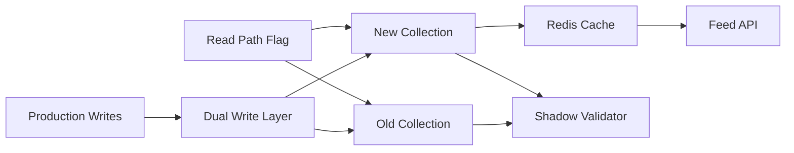
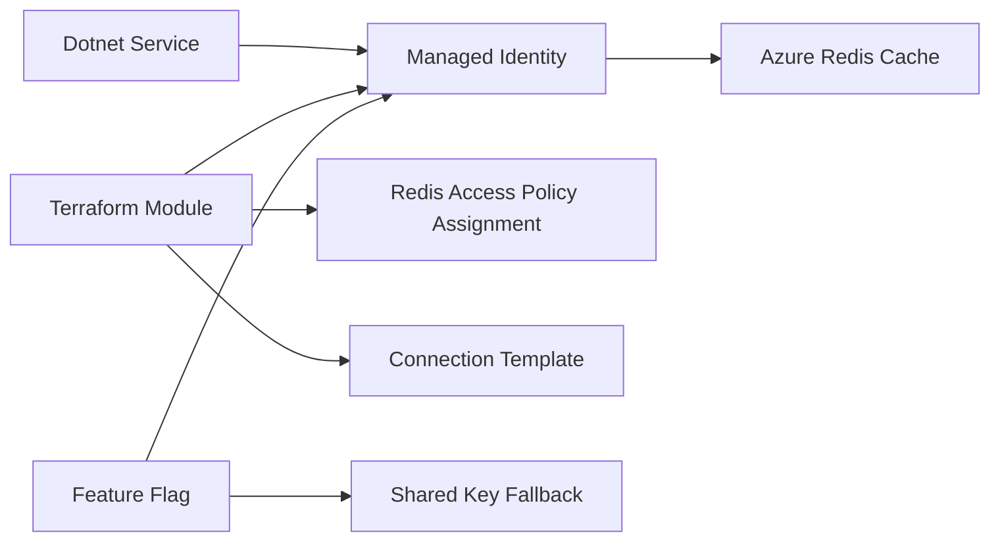
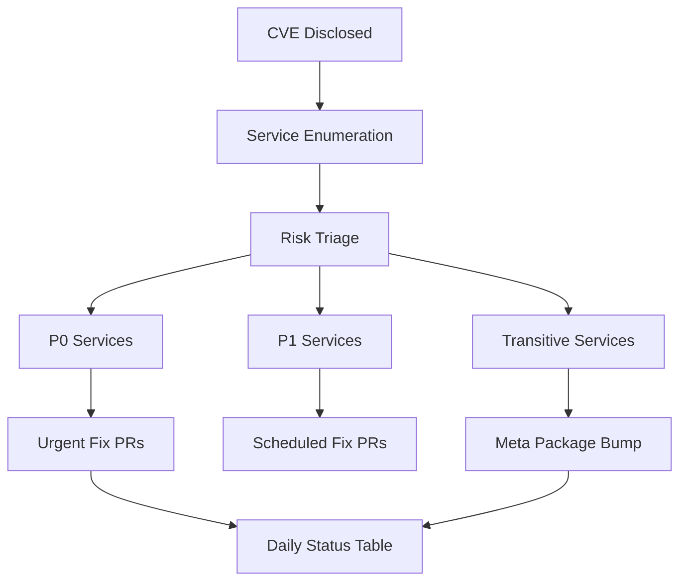

These projects are strongest when the interviewer wants zero-downtime change, cloud identity, fleet operations, or risk-based prioritization. The common pattern is controlled migration: prove the target, keep rollback cheap, and communicate status with numbers.

## Cosmos DB Partition Migration

### Interview pitch

I diagnosed a Cosmos DB hot-partition problem, redesigned the partition key, and executed a zero-downtime migration with dual-write, shadow validation, Redis read caching, and a feature-flag read flip. The result was p99 latency improving from 600 ms to 150 ms and gateway fan-out load dropping 87 percent.

> [!KEY]
> This is the technical-depth story. The interviewer should hear data-driven root cause analysis, migration safety, and a rollback plan before implementation heroics.

### Architecture

### Decisions and trade-offs

| Decision | Chosen approach | Rejected alternative | Reason |
|---|---|---|---|
| Partition key | Hash prefix plus publisher and content type | Publisher only | Top publishers still created skew |
| Migration | Dual-write with feature flag read flip | Big-bang cutover | Dual-write kept rollback under five minutes |
| Cache | Redis for hot reads on new path | Cosmos only | Even a better key could not match Redis for hot content |
| Hashing | Deterministic SHA based bucket prefix | Random prefix | Randomness hurt point reads and range reasoning |
| Validation | Shadow reader comparing old and new | Manual spot checks only | Production shaped reads expose mismatches earlier |

### Hard problems and impact

| Metric | Result |
|---|---|
| Latency | p99 read latency improved from 600 ms to 150 ms |
| Load | API gateway fan-out load reduced 87 percent |
| Backfill | More than 40M documents copied with resume tokens |
| Validation | Old and new collections ran under live writes for 48 hours |
| Headroom | Largest projected partition was about 8 GB against a 20 GB limit |
| Availability | Zero player-visible downtime during weekend cutover |

The key risk was proving the new key before the move. I sampled six months of content IDs, applied the hash function offline, and projected partition size and RU distribution. During migration, old and new collections both received writes, while reads stayed on the old path until shadow comparison passed. I would add partition heat-map monitoring from launch and automate validation comparison more deeply instead of relying partly on spot checks.

### Failure drills

| Drill | Defensible answer |
|---|---|
| Backfill interrupted | Resume token restarts from the last committed batch instead of reprocessing all documents |
| New key mismatch | Shadow validation detects divergence before customer reads switch |
| Post-flip latency spike | Feature flag returns reads to the old collection while both paths still receive writes |
| Partition growth | Alert before logical partition approaches limit and plan a second key evolution |

The answer should emphasize that the old system stayed healthy until the new system was proven. That is the difference between a controlled migration and a risky rewrite.

## Managed Identity Redis Migration

### Interview pitch

I identified shared Redis keys as a P1 compliance risk across 14 services, designed a Managed Identity migration, packaged the pattern as a Terraform module, and rolled it out with dual-mode fallback. The migration removed stored Redis secrets with zero service disruption and was adopted by additional teams.

### Architecture

### Decisions and trade-offs

| Decision | Chosen approach | Rejected alternative | Reason |
|---|---|---|---|
| Authentication | Managed Identity and Microsoft Entra authentication | Redis shared key | Static keys leak, require rotation, and grant broad access |
| Packaging | Reusable Terraform module | One-off service changes | Teams already used Terraform and needed a low-friction path |
| Rollout | Dual-mode feature flag | Forced big-bang date | Fallback reduced risk for services with older SDKs |
| Adoption | Pair first PRs and publish runbook | Email-only migration request | Security work adopted faster when the first step was easy |

### Hard problems and impact

| Metric | Result |
|---|---|
| Scope | 14 services migrated away from shared Redis keys |
| Disruption | Zero service outages during migration |
| Security | Shared-key authentication fully removed from covered services |
| Reuse | Terraform module adopted by three additional teams outside the org |
| Operations | Key rotation burden eliminated for migrated caches |

One older service used an SDK version without Redis Managed Identity support, so I hit and documented the fix during the pilot before other teams reached it. Five services had connection strings baked at startup, which required rolling restarts with health-check validation. If I repeated the work, I would add a CI compliance scan for shared-key usage and version the Terraform module from day one to prevent accidental breaking changes.

> [!TIP]
> Frame this as security ownership, not compliance ticket execution: identify the risk, make the safe path easy, and migrate without service disruption.

### Failure drills

| Drill | Defensible answer |
|---|---|
| Token acquisition fails | Feature flag falls back to the shared key during migration and alerting captures the failure |
| Role assignment missing | Terraform plan shows the scoped assignment and smoke test validates Redis auth |
| Old SDK unsupported | Pilot discovers version gap and runbook documents upgrade before broad rollout |
| Restart risk | Rolling restart drains one instance at a time and validates connection before proceeding |

The adoption lesson is that security migrations compete with feature work. Reusable infrastructure, fallback, and pair-programmed first PRs made the secure path cheaper than delaying.

## CVE Fleet Remediation

### Interview pitch

When high-severity CVEs blocked pipelines across a 600 plus microservice estate, I led triage, enumerated affected services with an Azure DevOps artifact query, tiered risk by blast radius, and remediated all P0 services within 48 hours without blocking ongoing deployments.

### Architecture

### Decisions and trade-offs

| Decision | Chosen approach | Rejected alternative | Reason |
|---|---|---|---|
| Enumeration | ADO artifact dependency query | Manual team audit | Manual audit was slower and would miss transitive references |
| Priority | Internet-facing and PII services first | CVSS score alone | Blast radius determines operational urgency in the estate |
| Transitives | Pinned meta-package and bulk PR | Hundreds of individual PRs | One shared update reduced review and merge pressure |
| Exceptions | Named expiry and tech lead acknowledgment | Open-ended bypass | Launch flexibility still needed accountability |
| Communication | Daily pinned status table | Continuous ad hoc updates | Stakeholders needed signal without interrupting remediation |

### Hard problems and impact

| Metric | Result |
|---|---|
| Estate | 600 plus microservices evaluated |
| Direct impact | 47 services had direct package references |
| Transitive impact | 553 services were handled through shared package strategy |
| P0 deadline | All P0 services remediated within 48 hours |
| P1 completion | Remaining P1 remediations completed within two weeks |
| Live site | Zero production incidents attributable to the CVE window |

The hard problem was not just package updates; it was scoping a distributed estate quickly enough to unblock teams without reducing accountability. I wrote the enumeration query, built the triage model, co-authored P0 fixes where I had access, and kept stakeholders aligned with a daily status table. I would add an SBOM based CVE dashboard and a standing meta-package strategy before the next wave so scoping takes minutes, not hours.

> [!WARNING]
> Do not describe CVE remediation as simply updating dependencies. The senior signal is inventory, risk tiering, exception control, and communication under deadline.

### Failure drills

| Drill | Defensible answer |
|---|---|
| Inventory miss | Cross-check artifact query with package lock files and service ownership list |
| Launch blocked | Grant a short exception with expiry, named approver, and required fix PR |
| Bulk PR breaks build | Roll back the shared package change and isolate direct P0 fixes first |
| Stakeholder noise | Publish one status table with totals, P0 progress, blockers, and next review time |

The behavioral signal is pressure management. The best answer says how you kept teams moving while making the risk visible and time bound.

### Interview framing

These stories all turn on risk sequencing. The Cosmos migration is safest when explained as prove the new model, dual-write, validate, then flip reads. The Redis identity rollout is safest when explained as pilot, package the module, enable dual mode, then remove keys. The CVE story is safest when explained as inventory, tier, remediate P0, handle transitive packages, then close the remaining wave. If the interviewer asks for one pattern across them, say rollback was designed before rollout started. That is the difference between a migration plan and a hope that a change succeeds.

| Prompt | Best project | First hook |
|---|---|---|
| Zero-downtime data change | Cosmos DB Partition Migration | Dual-write kept rollback under five minutes |
| Security migration | Managed Identity Redis Migration | 14 services removed shared secrets without disruption |
| Incident-scale triage | CVE Fleet Remediation | 600 plus services scoped before random fixes began |

Keep the language operational. Say who would be paged, what flag would be flipped, what dashboard would prove recovery, and when the old path could finally be removed. That detail prevents a migration story from sounding like a batch script or a one-time maintenance note with no production ownership.

## Cheat sheet

- Cosmos migration is the partition key, dual-write, validation, and rollback story.
- Managed Identity is the security migration and reusable Terraform module story.
- CVE remediation is the fleet triage and pressure communication story.
- For Cosmos, memorize p99 600 ms to 150 ms, 87 percent load reduction, 40M documents, and 48 hour validation.
- For Redis identity, memorize 14 services, zero disruption, and three external team adopters.
- For CVEs, memorize 600 plus services, 47 direct, 553 transitive, and 48 hour P0 remediation.
- Always state the rollback: read flag back to old collection, feature flag fallback to shared key, or named exception with expiry.
- The redo items are heat maps, CI scans, module versioning, SBOM dashboards, and meta-package readiness.

## Common mistakes

| Mistake | Fix |
|---|---|
| Saying the Cosmos fix was just more throughput | Explain hot partitions, logical limits, and why RU scaling did not fix p99 |
| Treating dual-write as magic | Explain read source, validation, mismatch tolerance, and rollback |
| Describing Managed Identity only as a library change | Explain access policy assignment, token flow, Terraform packaging, and restart risk |
| Ignoring fallback | Name the feature flag and shared key fallback during rollout |
| Saying CVE priority was by severity only | Explain blast radius, internet exposure, PII, and pipeline impact |
| Overloading stakeholders with updates | Use a status table with totals, fixed counts, blockers, and next action |
| Forgetting what changed afterward | Name monitoring, scans, module versioning, and SBOM work |

## Summary

Migration stories must prove safety before scale. The Cosmos migration shows how to validate a new data model under live traffic, the Redis identity rollout shows how to make a security fix adoptable, and the CVE wave shows how to operate across hundreds of services under deadline. The defensible pattern is measure, tier, migrate, validate, and keep rollback close.

## Top Interview Questions

### Q1. How did you choose the new Cosmos partition key?

I started from observed skew. The old category key concentrated the top categories into hot logical partitions, so simply adding RU would not distribute reads. I sampled six months of content IDs and modeled candidate keys offline. Publisher alone was still risky because top publishers held a large share of content. The chosen key used a deterministic hash prefix combined with publisher and content type, which spread load while keeping point reads predictable. I also checked projected logical partition size against the 20 GB limit and left headroom. The important interview point is that the key was validated with production shaped data before migration, not chosen by intuition.

### Q2. How did dual-write avoid consistency and rollback problems?

During dual-write, every new write went to both old and new collections, but customer reads stayed on the old collection until validation passed. A shadow reader sampled reads from the new collection and compared results with the old path, allowing small mismatches explained by replication lag. Once validation was clean for 48 hours, the read feature flag moved traffic gradually to the new collection. Rollback was cheap because the old collection had continued receiving writes, so flipping reads back restored the previous path in under five minutes. The design avoided the classic big-bang problem where rollback requires another migration.

### Q3. Why not fix Cosmos latency by adding more RU or only adding Redis?

Adding RU can raise the throughput ceiling, but it does not remove logical partition skew. Hot-partition reads still queue, and cost grows linearly. Redis helps hot reads, but it does not fix the underlying data distribution and cannot be the only source of truth. The chosen approach addressed both layers: redesign the partition key for even distribution and add Redis for the Zipf-like hot content access pattern. That combination improved p99 from 600 ms to 150 ms and reduced gateway fan-out load. In an interview, I would call out that caching hides some symptoms, while partitioning fixes the structural issue.

### Q4. Why was shared-key Redis authentication a security risk?

A Redis shared key is a static secret that grants broad access to the cache. If it leaks through logs, environment variables, developer machines, or a CI pipeline, the holder can read and write cache data until the key is rotated. Rotation is operationally expensive, so it often becomes infrequent. Managed Identity removes the stored secret. The service obtains a short-lived token for its Azure identity, Redis validates that identity through Microsoft Entra authentication, and access is scoped through a Redis data access policy assignment. The risk reduction is not only fewer secrets; it is better auditability, shorter credential lifetime, and easier revocation.

### Q5. What was inside the Terraform module for the Redis migration?

The module provisioned or referenced a user-assigned managed identity, created the Redis data access policy assignment scoped to the cache, and emitted the connection template needed by services. It also supported a dual-mode rollout, where services could keep the shared key fallback while enabling Managed Identity as the primary path. Packaging mattered because 14 services had to migrate without each team rediscovering the same identity and access policy steps. Terraform was already the team standard, so the module fit existing pipelines. The trade-off is module versioning; I would version it earlier to avoid breaking adopters when inputs change.

### Q6. How did you migrate services that needed connection strings at startup?

For services that read the Redis connection string only at startup, the migration required rolling restarts. I scheduled them during off-peak hours, used load balancer health checks to drain one instance at a time, and validated the Managed Identity connection on new instances before removing old instances. The feature flag kept shared-key fallback available during the rollout, so a failed identity path did not require emergency redeploy. This answer matters because identity migrations often look simple in code but fail operationally at restart, SDK, or configuration boundaries. The safe plan includes health checks and fallback.

### Q7. How did you enumerate affected services during the CVE wave?

I used Azure DevOps artifact dependency data instead of asking every team manually. The query listed pipelines and artifacts referencing the affected NuGet package and version range, which surfaced both direct references and candidates for transitive impact. Building the query took longer than running it, but it saved many hours of manual audit and reduced misses. The enumeration produced 47 direct references and a broader transitive set handled through a shared package strategy. The interview signal is that the first response to a fleet security wave should be inventory, not random PRs.

### Q8. How did you prioritize remediation when many pipelines were blocked?

I separated inherent severity from local blast radius. High CVSS mattered, but internet-facing services and services processing PII were P0 because exploitation risk and business impact were higher. Internal tooling and lower exposure services became P1. Teams with active launches could receive a temporary exception only with a named expiry, documented owner, and commitment to merge within the window. That allowed delivery sequencing without losing accountability. The daily status table showed total affected, P0 fixed, P1 fixed, blockers, and exceptions so stakeholders did not interrupt engineers continuously for updates.

### Q9. How did you handle transitive dependencies at 600 service scale?

Fixing every transitive consumer individually would have created hundreds of PRs and review bottlenecks. Instead, I identified the shared package path, pinned or updated the meta-package, and used bulk PRs where services needed a single dependency bump. A Roslyn analyzer helped detect resolution of the affected version so the team could verify the fix path. The trade-off is that shared package changes must be tested carefully because they affect many services at once. If I did it again, I would build an SBOM based dashboard and preplanned meta-package strategy before a crisis forces that machinery to be invented.
