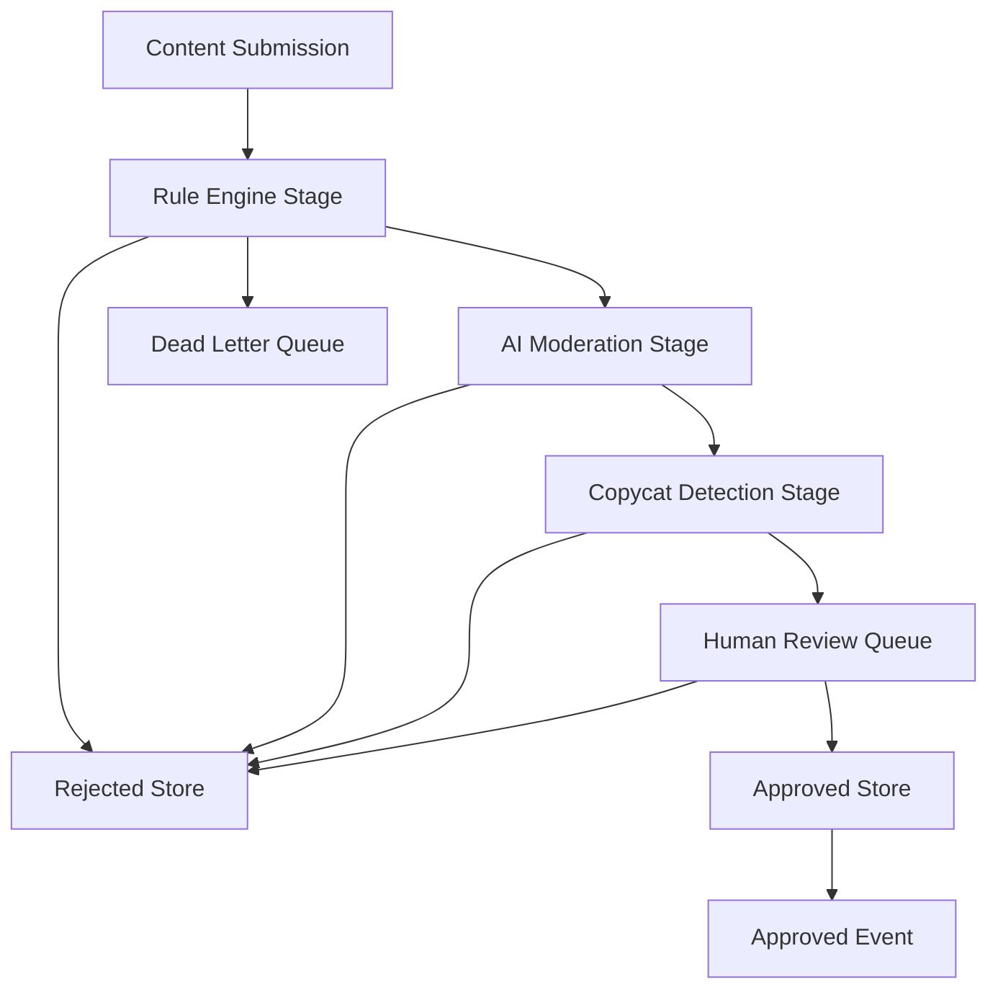
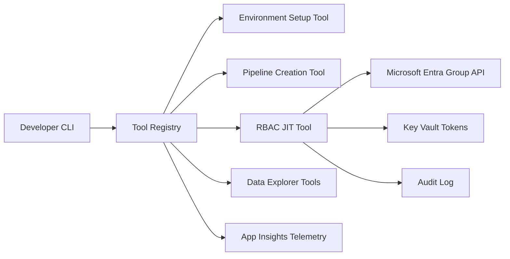
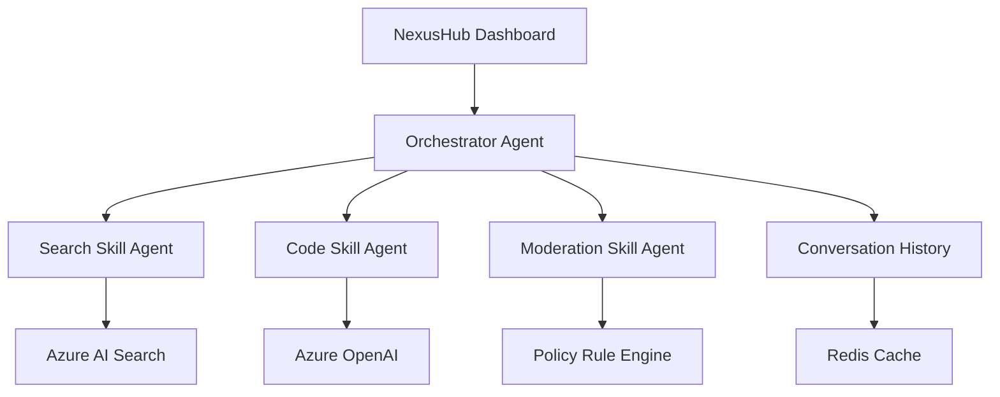

These projects cover AI workflows, internal platforms, security-aware developer experience, and agent orchestration. Use them to show initiative, production safeguards, adoption strategy, and the ability to distinguish a production system from a fast prototype.

## AI Content Certification Platform

### Interview pitch

I built a four-stage event-driven certification engine for AI-generated Xbox content: policy rules, AI moderation, embeddings based copycat detection, and human escalation. It processed submissions within a five minute p95 target, reduced false positives from about 12 percent to under 2 percent, and made duplicate certification events impossible through idempotent consumers.

> [!KEY]
> The AI story wins when it sounds like a production workflow, not an AI demo: idempotency, DLQ, thresholds, evaluation, and human escalation are the signal.

### Architecture

### Decisions and trade-offs

| Decision | Chosen approach | Rejected alternative | Reason |
|---|---|---|---|
| Stage communication | Service Bus topic per stage | Direct service calls | Topics isolate failures and allow independent retries |
| Copycat detection | Embeddings with cosine similarity | Hash comparison | Hashes catch exact copies but miss semantic near duplicates |
| Idempotency | Conditional create by submission and stage key | Check then write | Check then write races under at least once delivery |
| Thresholds | Tuned per category with labeled data | One global threshold | Uniform thresholds over-rejected some content types |
| Retry | Exponential backoff with jitter and DLQ | Fixed interval retry | Fixed intervals create retry storms during rate limits |

### Hard problems and impact

| Metric | Result |
|---|---|
| Manual effort | Review time moved from roughly 1.7 hours per title toward automated seconds for common cases |
| Throughput | Supported 150 plus titles per day in the certification flow |
| False positives | Reduced from about 12 percent to under 2 percent |
| Latency | 95th percentile certification completed under five minutes |
| Correctness | Zero duplicate certifications in six months |
| Operations | DLQ items triaged within a four hour SLA |

The difficult part was threshold calibration. I used historical review decisions to create labeled duplicate and unique pairs, swept thresholds, and chose the point that reduced false positives while preserving duplicate recall. If I rebuilt it, I would add an automated evaluation harness earlier and feed human reviewer decisions back into threshold tuning instead of making threshold changes manually.

### Failure drills

| Drill | Defensible answer |
|---|---|
| Duplicate message | Conditional create by submission and stage key makes the retry a no-op |
| Azure OpenAI rate limit | Backoff with jitter and delayed requeue protect the pipeline; secondary deployment is only used if provisioned |
| Bad schema version | Consumer dead-letters unsupported versions rather than silently misprocessing |
| False positive spike | Compare against labeled set, lower automation, and route ambiguous cases to review |

The production point is that AI output is only one stage. Reliability comes from workflow isolation, observability, idempotency, and human review when confidence is low.

## Internal Developer Productivity Platform

### Interview pitch

I built and drove adoption of an internal developer platform with more than 20 tools used by 130 plus developers across more than 10 services. It standardized environment setup, pipeline creation, gateway proxies, S2S token generation, data explorers, AKS workflows, and RBAC with JIT access, cutting common debugging and onboarding loops dramatically.

### Architecture

### Decisions and trade-offs

| Decision | Chosen approach | Rejected alternative | Reason |
|---|---|---|---|
| Distribution | CLI package used from terminal | Web portal first | CLI met engineers in daily workflows and avoided context switching |
| Access model | Time-limited JIT group assignment | Persistent elevated roles | JIT reduced standing access risk and audit exposure |
| Adoption | Champions and demos after pain survey | Org mandate | Value-led adoption created less resistance |
| Roadmap | Telemetry from per-command events | Anecdotal requests only | Usage data showed what mattered and what should be retired |
| Extensibility | Tool registry and shared conventions | Per-team scripts | A registry made tools discoverable and reusable |

### Hard problems and impact

| Metric | Result |
|---|---|
| Tools | 20 plus commands and utilities shipped |
| Adoption | 130 plus developers across 10 plus services used the platform |
| Onboarding | Service setup fell from multiple days to under half a day |
| Debugging | Common 20 to 30 minute daily tasks moved toward seconds |
| Security | JIT access removed standing elevated access for covered services |

The hard problem was adoption without a mandate. I surveyed pain points, built the first five high-value tools, demoed directly to service leads, and converted champions team by team. The hard technical problem was JIT revocation because group assignment APIs did not provide TTL; I built a scheduled function that removed expired grants and alerted if any grant exceeded the expected window. I would add telemetry earlier and open contribution paths sooner so low-usage tools and team-specific extensions were visible faster.

> [!TIP]
> Do not list all tools. Name two painkillers, then pivot to adoption, security, and force multiplier impact.

### Failure drills

| Drill | Defensible answer |
|---|---|
| Revocation job fails | Alert on grants older than threshold and keep audit records for manual removal |
| Tool produces bad config | Dry-run mode and templates let teams inspect changes before applying |
| Low adoption | Revisit pain survey, remove friction, and recruit champions instead of mandating use |
| Security review concern | Scope roles tightly and prove JIT removes standing elevated access |

The staff-level angle is leverage. A useful internal platform is not the number of commands shipped; it is repeated engineering time returned to many teams with safer default behavior.

## NexusHub Agent Orchestration

### Interview pitch

NexusHub was a 48-hour solo hackathon project: a dashboard for orchestrating AI agents and skills through MCP compatible tool-calling. It demonstrated dynamic skill registration, multi-agent workflows, tool loop guards, and context summarization while staying honest about prototype limits.

### Architecture

### Decisions and trade-offs

| Decision | Chosen approach | Rejected alternative | Reason |
|---|---|---|---|
| Agent protocol | MCP tool-calling | Custom REST between agents | MCP provided standard discovery and interoperable tool manifests |
| Planning | LLM driven orchestrator | Hardcoded workflow | The demo needed flexible composition of novel tasks |
| Skill registration | Dynamic manifest at startup | Static config | New skills could register without orchestrator redeploy |
| Loop safety | Ten call iteration guard | Trust model termination | Ambiguous prompts can create runaway tool loops |
| Context | Sliding window with summarization | Full transcript only | Long multi-agent history quickly exceeds usable context |

### Hard problems and impact

| Metric | Result |
|---|---|
| Timebox | Built solo in 48 hours |
| Interop | Three heterogeneous skill agents exposed MCP compatible tools |
| Extensibility | Adding a skill agent required no orchestrator code change |
| Safety guard | Tool-calling loop stopped at ten iterations with best effort response |
| Recognition | Won internal hackathon recognition |

The story is valuable because it shows rapid platform thinking, but it must be framed as a prototype. The two production gaps to name first are observability and failure handling: per-tool latency, token cost, error rate, retries, circuit breakers, durable history, and human approval for high-stakes tools. The redo is to productionize the operating model before expanding the skill catalog.

> [!WARNING]
> Be explicit that NexusHub was a hackathon prototype. Prototype honesty is stronger than pretending it had production resilience.

### Failure drills

| Drill | Defensible answer |
|---|---|
| Tool loop | Ten-call guard stops the planning cycle and returns a summarized best effort result |
| Skill agent slow | Production version needs timeout, retry, and circuit breaker per skill |
| Context overflow | Sliding window summarization keeps recent turns and compresses older history |
| Unsafe tool action | Add human approval and policy checks before high-impact calls |

The interview value is judgment. You can be excited about agents while still naming the controls required before real users or production systems depend on them.

### Interview framing

These three projects are easy to over-explain because they contain many tools. Keep the first pass focused on the operating lesson. The AI certification story is about wrapping probabilistic decisions in deterministic workflow controls. The developer platform story is about creating leverage by removing repeated friction for many engineers. The NexusHub story is about fast exploration of agent interoperability while being explicit about missing production guardrails. If the interviewer asks which one is most production ready, choose certification or developer productivity. If they ask where you experimented fastest, choose NexusHub and immediately state the production gaps.

| Prompt | Best project | First hook |
|---|---|---|
| Production AI | AI Content Certification Platform | Under five minute p95 with idempotent stages |
| Influence and leverage | Internal Developer Productivity Platform | 130 plus developers adopted without a mandate |
| Agent prototyping | NexusHub Agent Orchestration | MCP manifests and ten-call loop guard |

Use production language even for AI topics. Name the queue, state store, retry rule, telemetry signal, and human fallback. That keeps the conversation grounded in systems engineering rather than model excitement. For the prototype, name the guardrail that exists and the guardrail you would add before launch, including the owner who would monitor it during incidents and reviews after deployment.

## Cheat sheet

- AI certification is the production AI workflow story with idempotency and evaluation.
- Developer productivity is the initiative, influence, and force multiplier story.
- NexusHub is the rapid prototyping and agent orchestration story.
- For AI certification, memorize four stages, under five minute p95, 12 percent to under 2 percent false positives, and zero duplicate certifications.
- For developer tooling, memorize 20 plus tools, 130 plus developers, 10 plus services, and setup from days to under half a day.
- For NexusHub, memorize 48 hours, MCP tool manifests, three skill agents, ten-call loop guard, and production gaps.
- Always separate AI model behavior from production safeguards.
- Use developer platform adoption as influence without authority, not just tooling enthusiasm.

## Common mistakes

| Mistake | Fix |
|---|---|
| Saying AI solved certification | Explain rules, AI moderation, embeddings, human review, and idempotency |
| Ignoring false positives | Discuss labeled evaluation, threshold tuning, and reviewer feedback |
| Listing every developer tool | Lead with pain points, adoption, JIT access, and measured time savings |
| Describing JIT access vaguely | Explain timestamped grants, scheduled revocation, and stale grant alerts |
| Overselling NexusHub | State the 48 hour timebox and name production gaps clearly |
| Treating MCP as magic | Explain tool manifests, discovery, and standardized calls |
| Forgetting observability | Mention latency, errors, token usage, DLQ, and adoption telemetry |

## Summary

AI and platform stories need production grounding. The certification platform shows how to wrap AI in reliable workflow controls, the developer platform shows how to turn repeated engineering pain into a secure adopted toolkit, and NexusHub shows how to prototype agent orchestration while naming the missing production guardrails. Together they cover initiative, safety, adoption, and honest technical judgment.

## Top Interview Questions

### Q1. How does the AI copycat detection work technically?

The submission title and description are converted into an embedding vector, then queried against an Azure AI Search index of previously approved content. Similarity is measured with cosine similarity, and results above a calibrated threshold become potential copycat flags. The system does not automatically reject every high-similarity item; suspicious cases can route to human review to protect publishers from false positives. The threshold was tuned using labeled duplicate and unique examples from historical review decisions. The important point is that embeddings catch semantic near duplicates that hashes miss, but they require evaluation because similarity is probabilistic, not a legal or policy decision by itself.

### Q2. How did you make the certification pipeline idempotent?

Each stage used an idempotency key composed from submission ID and stage ID. Before a stage committed its result, it performed a conditional create in Cosmos so a duplicate Service Bus delivery for the same submission and stage became a no-op instead of overwriting state. This matters because Service Bus provides at least once delivery, so duplicate events are expected during retries, lock expirations, or outage recovery. I would also mention that check-then-write is unsafe because two consumers can race. The atomic conditional write makes retry behavior safe and is why the platform saw zero duplicate certifications over six months.

### Q3. How did you reduce false positives in the AI certification flow?

The first rule-heavy approach was too strict, especially around policy keywords and near-duplicate detection. I created a labeled evaluation set from historical human review decisions, ran threshold sweeps across similarity scores, and picked a threshold that kept duplicate recall high while reducing over-rejection. The result was false positives moving from roughly 12 percent to under 2 percent. I would be clear that the model was not trusted blindly. Human review remained in the path for ambiguous submissions, and the redo would be an automated evaluation harness plus reviewer feedback loop so future model or threshold changes are tested before production.

### Q4. How did you get 130 developers to adopt the productivity platform without a mandate?

I started with pain discovery instead of a tool pitch. Engineers named repeated problems: environment setup, token generation, gateway proxying, data exploration, AKS workflows, and access provisioning. I built the highest pain tools first, demoed them directly to service leads, and used early adopters as champions. The CLI distribution helped because it fit the terminal workflows developers already used. Adoption grew because each demo removed a real annoyance, not because leadership mandated it. Telemetry then showed which commands were valuable and guided the roadmap. That is the influence story: solve pain, prove value, and let peers spread it.

### Q5. How does JIT access revocation work technically?

When a developer requests access through the CLI, the platform writes a grant record with identity, target group, grant time, and expiry window. It then adds the developer to the relevant Microsoft Entra group. A scheduled function runs every 15 minutes, finds grants older than the allowed window, removes the group membership, and logs the action. If any grant remains past a safety threshold, an alert fires because stale elevated access is a security issue. The key design detail is that the platform does not rely on people remembering to remove access. Revocation is automated, audited, and visible.

### Q6. How did you measure the value of the developer platform?

I used a mix of telemetry and before-after evidence. Per-command events in App Insights showed invocation count, success rate, and failure patterns. For onboarding, new engineers compared setup time before and after the environment setup flow, moving from multiple days to under half a day for service-related setup. For debugging utilities, common 20 to 30 minute workflows moved toward seconds because token, proxy, and data explorer steps were automated. For security, the measurable value was reduction of standing elevated access in covered services. The important interview caveat is to separate measured telemetry from survey-based estimates.

### Q7. What is MCP and why did you choose it for NexusHub?

MCP is a protocol for exposing tools and context to agents through a standardized manifest and call shape. I chose it because the hackathon goal was interoperability: skill agents should advertise capabilities dynamically and be callable by an orchestrator without custom integration code for each skill. A custom REST approach would have been faster for one demo path but would couple every agent pair to bespoke schemas. MCP made the dashboard more extensible because a new skill could register its manifest and become discoverable. The trade-off is that production still needs auth, policy, observability, and approval boundaries around tool calls.

### Q8. How did you prevent the NexusHub orchestrator from looping forever?

I added a maximum iteration guard for tool calls in a planning cycle. The orchestrator tracked how many calls it made, and at ten calls it stopped, summarized the gathered context, and returned a best effort response instead of continuing indefinitely. This is necessary because LLM planners can loop on ambiguous tasks or keep asking tools for slightly different information. The guard is not a complete safety system; it is a pragmatic control for a prototype. In production, I would add per-tool timeouts, circuit breakers, policy constraints, and traces so loops are observable and debuggable rather than merely capped.

### Q9. What would you add first to make NexusHub production ready?

I would start with observability and failure handling. Every tool call needs latency, error, token cost, input size, and output status metrics. The orchestrator needs traces showing why each tool was called. Skill agents need timeouts, retries with backoff, and circuit breakers so one slow agent does not block the whole workflow. Conversation history should move from in-memory storage to a durable store, with clear retention and privacy boundaries. For high-impact actions, I would add human approval checkpoints. Those additions matter before more skills because production agent systems fail at boundaries: tools, context, permissions, and recovery.
