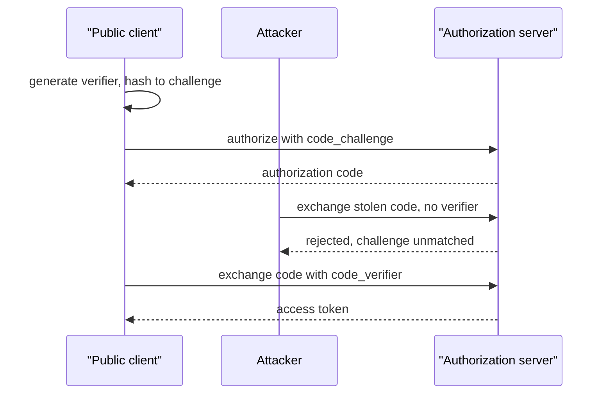

OAuth 2.0 is an **authorization delegation** framework — it lets a user grant an application limited access to their data on another service, without handing over a password. OpenID Connect (OIDC) is a thin identity layer built on top of OAuth that adds "and here is who logged in". Interviewers use this pair to check you know where authorization ends and authentication begins.

## The four roles

| Role | Definition | Example |
|---|---|---|
| Resource owner | The user who owns the data | You, logging into a photo app |
| Client | The application requesting access | The third-party photo-printing app |
| Authorization server | Issues tokens after authenticating the owner and getting consent | Google's/Okta's OAuth endpoint |
| Resource server | Hosts the protected data and validates tokens on each request | Google Photos API |

The client never sees the resource owner's password. It only ever receives a **token** scoped to specific permissions, issued by the authorization server after the owner consents — a third-party app requesting your GitHub data only ever sees a token, never your GitHub password:

> [!KEY]
> OAuth answers "can this app do X on my behalf" — it was never designed to answer "who is this user". That distinction is the single most-tested idea in this topic.

## Grant types (flows)

| Grant type | Who it's for | Notes |
|---|---|---|
| Authorization code | Server-side web apps, SPAs, mobile | The default choice today; code is exchanged server-side (or with PKCE) for a token |
| Authorization code + PKCE | SPAs, mobile/native apps (public clients) | Mandatory when the client can't hold a secret; prevents code interception |
| Client credentials | Machine-to-machine, no user involved | Service authenticates as itself with its own ID/secret or certificate |
| Device code | Input-constrained devices (TVs, CLIs) | User completes login on a second device/browser; original device polls |
| Refresh token | Any flow that issued one | Exchanged for a new access token without re-prompting the user |
| ~~Implicit~~ (deprecated) | Was for SPAs | Returned the access token directly in the URL fragment — exposed to browser history, browser extensions and in-page scripts, with no client authentication. Replaced by code + PKCE |
| ~~Resource owner password credentials~~ (deprecated) | Was for "trusted" first-party apps | Client collects the raw username/password itself — defeats the entire purpose of OAuth (never expose credentials to the client) and prevents MFA/federation |

> [!DANGER]
> If you see a design using the implicit or password grant today, flag it. Implicit leaks tokens through browser history and referrer headers with no way to authenticate the client; password grant requires the client to handle raw credentials, which OAuth exists specifically to avoid.

## The authorization code flow, step by step

1. Client redirects the user's browser to the authorization server's `/authorize` endpoint with `client_id`, `redirect_uri`, `scope`, `state`, and (for public clients) a PKCE `code_challenge`.
2. User authenticates at the authorization server and approves the requested scopes.
3. Authorization server redirects back to `redirect_uri` with a short-lived, single-use **authorization code**.
4. Client calls the `/token` endpoint with the code, its credentials (or the PKCE `code_verifier`), and `redirect_uri`.
5. Authorization server validates everything and returns an **access token** (and optionally a **refresh token**).
6. Client calls the resource server with `Authorization: Bearer <access_token>`.

> [!TIP]
> Say why the code is exchanged in a second, back-channel request instead of returning the token directly in the redirect: the code travels through the browser (visible in history/logs), the token exchange happens server-to-server (or with a verifier only the original client holds), so a stolen code alone is useless.

## PKCE and the attack it prevents

PKCE (Proof Key for Code Exchange, "pixy") protects **public clients** — SPAs and mobile apps — that cannot safely hold a client secret. Without it, a malicious app on the same device that intercepts the authorization code (via a shared redirect URI scheme) could exchange it for a token itself.

The flow: the client generates a random `code_verifier`, hashes it into a `code_challenge`, and sends only the challenge in step 1. At token exchange (step 4), it sends the original verifier. The authorization server hashes the verifier and checks it matches the challenge it stored — only the app that started the flow can produce the matching verifier, even if the code itself was intercepted.

> [!WARNING]
> PKCE is now recommended for **all** authorization-code clients, not just public ones — it is defense-in-depth against authorization code injection even for confidential (server-side) clients, and current OAuth security guidance treats it as a default, not an optional extra.

## Scopes and consent

Scopes are the mechanism for limiting *what* a token can do — `photos.read`, `calendar.write`, `offline_access`. The authorization server shows the user exactly which scopes are being requested and records consent, so a client can never silently escalate its own access; requesting a new scope requires a new consent screen (or admin pre-approval in enterprise setups).

## Access token vs refresh token vs ID token

| | Access token | Refresh token | ID token |
|---|---|---|---|
| Purpose | Authorizes calls to a resource server | Gets a new access token without re-login | Proves the user's identity to the client |
| Consumed by | Resource server | Authorization server only | Client application |
| Format | Opaque or JWT | Opaque (usually) | Always a JWT (OIDC spec) |
| Lifetime | Short (minutes) | Long (days/weeks), often rotated | Short — validated once at login, then discarded |
| Sent to resource server? | Yes | Never | No |

> [!KEY]
> The ID token is OIDC's contribution, not OAuth's. If a system design only has access and refresh tokens, it is doing pure OAuth authorization; the moment an **ID token** appears, you're doing authentication via OIDC.

## OIDC: an identity layer on top of OAuth

OpenID Connect adds three things OAuth alone doesn't define: the **ID token** (a signed JWT with `sub`, `iss`, `aud`, `exp`, and profile claims), a standard `/userinfo` endpoint, and a standard `openid` scope that triggers this behavior. Practically, OIDC is what you use for "Sign in with Google" — OAuth alone only tells you an app was *granted a scope*, never who the user actually is.

## Discovery document and JWKS

Every OIDC-compliant provider publishes a **discovery document** at a well-known path (`/.well-known/openid-configuration`) listing its endpoints (`authorization_endpoint`, `token_endpoint`, `jwks_uri`) and supported algorithms. The `jwks_uri` points to a **JWKS (JSON Web Key Set)** — the provider's public keys, indexed by `kid` (key ID) — which clients and resource servers fetch and cache to verify token signatures without any shared secret.

| Document | Purpose |
|---|---|
| `/.well-known/openid-configuration` | Tells clients where every endpoint lives and what algorithms/scopes are supported |
| JWKS (`jwks_uri`) | Public keys used to verify token signatures; supports rotation via multiple active `kid`s |

## Token audience validation

An access or ID token's `aud` (audience) claim states which resource server or client it was minted for. A resource server **must** reject a token whose `aud` doesn't match itself — otherwise a token issued for Service A (which the user legitimately consented to) could be replayed against Service B. This is the single most common OAuth/OIDC implementation bug in code review.

> [!DANGER]
> Validating only the signature and expiry, and skipping `aud`/`iss` checks, is how a token meant for one API ends up working against a completely different one — a classic confused-deputy vulnerability.

## Common misuse: using OAuth as if it were authentication

The most-repeated mistake in this space: treating "I successfully received an access token" as proof of who the user is. A bare OAuth access token only proves the client was granted a scope — it says nothing verified about identity, and different providers structure opaque tokens differently, so a client that tries to "authenticate" a user by calling an API with the access token and seeing if it works is relying on undefined behavior. The fix is always OIDC: validate the signed **ID token**'s claims (`iss`, `aud`, `sub`, `exp`, `nonce`) as the actual proof of login.

## Cheat sheet

- OAuth = delegated **authorization**. OIDC = **authentication**, built on top of OAuth.
- Four roles: resource owner, client, authorization server, resource server.
- Default flow today: authorization code + PKCE, for every client type, public or confidential.
- Implicit and password grants are deprecated — flag them in any design review.
- Access token → resource server. Refresh token → authorization server only. ID token → client, proves identity.
- PKCE stops a stolen authorization code from being redeemed by an attacker.
- Always validate `aud` and `iss`, not just the signature and `exp`.
- Discovery document + JWKS let clients find endpoints and public keys without hardcoding them.
- "I got a token" is not "I know who the user is" — that requires the ID token.
- Scopes limit what a token can do; consent screens make grants visible and revocable.

## Common mistakes

| Mistake | Fix |
|---|---|
| Using the access token to identify the user | Use the OIDC ID token and validate its claims |
| Skipping `aud` validation on the resource server | Reject any token not issued for this specific API |
| Still implementing the implicit or password grant | Use authorization code + PKCE for every client |
| Storing refresh tokens in browser `localStorage` | Prefer an `HttpOnly` cookie or secure OS credential store |
| Treating scopes as a UI-only concept | Enforce scope checks server-side on every resource access |
| Hardcoding a provider's signing key | Fetch and cache from JWKS, keyed by `kid`, to survive rotation |

## Summary

OAuth 2.0 defines how a user can delegate limited, scoped access to an application without exposing their password, using an authorization server that issues short-lived access tokens and long-lived refresh tokens. OpenID Connect adds a standard, verifiable identity layer — the ID token — on top of that same flow, which is what actually answers "who logged in". The authorization-code-with-PKCE flow is the modern default for every client type; implicit and password grants are deprecated because they leak tokens or credentials unnecessarily. In practice, get comfortable naming the four roles, the three token types, and the two checks (`aud`, `iss`) that keep tokens from being replayed where they don't belong.

## Top Interview Questions

### Q1. What is the difference between OAuth 2.0 and OpenID Connect?

OAuth 2.0 is a delegated **authorization** framework — it lets a client obtain a scoped access token to act on a resource owner's behalf, without ever seeing their credentials. It does not define any standard way to learn who the user is; an access token is just a bearer credential for calling an API. OpenID Connect is a thin, standardized identity layer built directly on top of OAuth's authorization code flow: it adds the `openid` scope, a signed **ID token** (a JWT with claims like `sub`, `iss`, `aud`, `exp`) and a `/userinfo` endpoint. In short, OAuth answers "can this app access this data", OIDC answers "who is this user" — and OIDC reuses OAuth's plumbing to do it rather than inventing a new protocol.

### Q2. Walk through the authorization code flow and explain why the code is exchanged separately instead of returning the token immediately.

The client redirects the user's browser to the authorization server, which authenticates the user and captures consent, then redirects back to the client's `redirect_uri` with a short-lived, single-use authorization code — visible in the browser URL and server logs. The client then makes a separate, back-channel POST to the token endpoint, presenting the code along with its own credentials (or a PKCE verifier for public clients), and only then receives the access and refresh tokens. This two-step design means a code intercepted in transit through the browser (history, referrer headers, a nosy browser extension) is useless on its own — redeeming it requires either the client secret or the PKCE verifier, neither of which travels through the browser. Returning the token directly in the redirect, as the deprecated implicit flow did, skips this protection entirely.

### Q3. What problem does PKCE solve, and who needs it?

PKCE protects against authorization code interception for clients that cannot hold a secret — single-page apps and native/mobile apps, known as "public clients". Without it, if a malicious app on the same device registers the same custom URL scheme or intercepts the redirect, it can capture the authorization code and redeem it for tokens itself. PKCE has the legitimate client generate a random `code_verifier`, send its hashed form (`code_challenge`) at the start of the flow, and present the original verifier at token exchange; the authorization server checks the hash matches before issuing tokens, so a code without the matching verifier is worthless to an attacker. Current best practice recommends PKCE for confidential (server-side) clients too, as defense-in-depth against code injection, not just public clients.

### Q4. Compare access tokens, refresh tokens, and ID tokens.

An access token is what the client presents to a resource server to authorize an API call; it's short-lived (minutes) and can be opaque or a JWT depending on the provider. A refresh token is a long-lived credential presented only back to the authorization server's token endpoint to obtain a new access token without forcing the user to log in again — it should never be sent to a resource server. An ID token is specific to OpenID Connect: it is always a JWT, consumed by the client itself (not a resource server), and its job is purely to prove who the user is at the moment of login — validated once and then typically discarded, not sent with subsequent API calls. Confusing an access token with an ID token is a common bug: developers sometimes try to read "identity" out of an access token that was never designed to carry verified user claims.

### Q5. Why were the implicit grant and the resource owner password credentials grant deprecated?

The implicit grant returned the access token directly in the URL fragment after redirect, with no authorization code step and no client authentication — that token then lives in browser history and is exposed to browser extensions or any in-page script running on the redirect page, with no way to verify which app actually requested it. The resource owner password credentials grant required the client application itself to collect the user's raw username and password and forward them to the authorization server — which defeats OAuth's entire premise of never exposing credentials to a third-party client, and it's incompatible with MFA, federation, or any login flow the identity provider might want to enforce later. Both were replaced by the authorization code flow with PKCE, which keeps tokens out of the browser's visible surface and never lets the client see the user's actual credential.

### Q6. What does the `aud` claim do, and what goes wrong if a resource server doesn't check it?

The `aud` (audience) claim states which resource server or client the token was issued for. A resource server must verify that its own identifier appears in `aud` before trusting any other claim in the token. If this check is skipped, a token legitimately issued for Service A — because the user consented to Service A accessing their data — could be replayed against Service B, and Service B would accept it as long as the signature and expiry check out, since a shared identity provider's signing key validates tokens for *all* its relying parties. This is a textbook confused-deputy vulnerability: the token is genuinely valid, just not valid *for this resource*, and only an explicit audience check catches it.

### Q7. How do the discovery document and JWKS work together, and why do they matter for key rotation?

The discovery document (`/.well-known/openid-configuration`) is a well-known JSON file listing an OIDC provider's endpoints — authorization, token, userinfo, and crucially `jwks_uri` — plus supported algorithms and scopes, letting clients configure themselves without hardcoding URLs. `jwks_uri` points to the provider's JSON Web Key Set: its current public signing keys, each tagged with a `kid` (key ID). When validating a token, a resource server reads the `kid` from the token header, looks up the matching public key in its cached JWKS, and verifies the signature. Because the JWKS can list multiple active keys simultaneously, the provider can rotate its signing key by publishing the new key alongside the old one, sign new tokens with the new key, and only remove the old key once every previously issued token using it has expired — rotation with zero downtime and no coordinated cutover.

### Q8. A mobile app team wants to authenticate users via OAuth by sending their access token to your API and treating "the call succeeded" as proof of identity. What's wrong with this, and what should they do instead?

An access token only proves the client was granted some scope by the authorization server — it does not, on its own, guarantee anything about the specific user's identity in a format the resource server can independently verify, and different providers issue opaque access tokens with no standardized structure at all. Treating "the resource call succeeded" as authentication also couples your authentication logic to the availability and behavior of a downstream API, and provides no way to validate claims like `iss`/`aud`/`exp` before trusting the result. The correct fix is to add the `openid` scope and use the returned **ID token**: validate its signature against the provider's JWKS, check `iss`, `aud`, `exp`, and (if present) `nonce`, and read `sub` as the verified user identifier — this is exactly the problem OpenID Connect exists to solve.

### Q9. Design the token strategy for a machine-to-machine batch job that needs to call three internal APIs every night with no user involved.

Use the `client_credentials` grant: register the batch job as its own OAuth client with either a client secret, a client certificate, or — preferably in a cloud environment — a managed/workload identity that avoids storing any secret at all. The job requests an access token scoped to only the permissions it actually needs against each API (least privilege, potentially different scopes per downstream service), and each resource server validates the token's signature, `aud`, and expiry exactly as it would for a user-originated token, just with `sub` identifying the service instead of a person. Keep the token's lifetime short (tokens for machine callers are typically re-requested per run or cached briefly, not held for the job's entire runtime), and make sure the client secret or certificate is rotated on a schedule and never checked into source control.

### Q10. A user reports that after revoking a third-party app's access in your account settings, the app can still fetch their data for a while. Is that expected, and what would you check?

It can be expected behavior depending on what "revoke" actually did. If revocation only deleted the authorization grant record and the refresh token, any access token already issued to that app remains valid until its own natural, short expiry (typically minutes) — the resource server has no way to know a token was revoked unless it's checking a live revocation list rather than just the signature and expiry. To close this gap faster, you can shorten access token lifetimes, implement a token introspection endpoint the resource server calls for high-sensitivity operations, or maintain a denylist keyed by token ID (`jti`) that's consulted at least for privileged calls. The trade-off to state explicitly: fully centralized revocation checks reintroduce a stateful lookup on every request, which is exactly what stateless tokens were meant to avoid — so most systems accept a short window of continued access after revocation as the cost of statelessness, and mitigate it with short expiries rather than eliminating it entirely.

### Q11. What are scopes, and how do they relate to consent?

Scopes are named permission units a client requests during authorization — `photos.read`, `calendar.write`, `offline_access` — that define the boundary of what the resulting access token can be used for. The authorization server presents the requested scopes to the resource owner on the consent screen, so the user can see and approve exactly what they're granting rather than an all-or-nothing "trust this app" decision. Critically, a client cannot silently expand its own access later — requesting a new scope not previously granted triggers a fresh consent prompt (or requires pre-approval by an administrator in enterprise/tenant-wide consent setups), and resource servers are expected to enforce scope checks themselves rather than trusting that the authorization server's UI was the only gate.

### Q12. Why is the device code grant needed, and how does it differ from the authorization code flow?

The device code grant exists for devices that can't easily host a browser-based redirect flow — smart TVs, IoT devices, CLI tools. Instead of redirecting the user's browser on the same device, the device displays a short code and a URL, the user opens that URL on a *different* device (like their phone) and enters the code there to complete authentication and consent, while the original device polls the token endpoint in the background until the authorization server confirms the code was approved. The core difference from the standard authorization code flow is that authentication happens on a completely separate device from the one requesting the token, which is why you see this pattern for `gh auth login` style CLI logins and streaming-service TV apps — there is no `redirect_uri` back to the constrained device at all.
