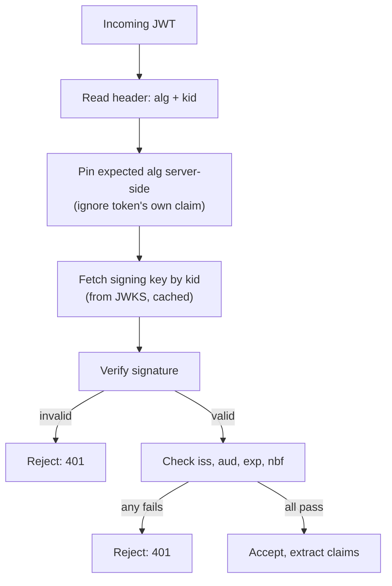

A JSON Web Token (JWT) is a compact, signed, self-contained way to carry claims between two parties. It is everywhere in modern APIs, and interviewers use it to test whether you actually validate every field or just check the signature and move on.

## Structure: header, payload, signature

A JWT is three base64url-encoded segments joined by dots: `header.payload.signature`.

```
eyJhbGciOiJSUzI1NiIsInR5cCI6IkpXVCIsImtpZCI6ImFiYzEyMyJ9
.
eyJzdWIiOiJ1c2VyXzQyIiwiaXNzIjoiaHR0cHM6Ly9hdXRoLmV4YW1wbGUuY29tIiwiYXVkIjoiaW52ZW50b3J5LWFwaSIsImV4cCI6MTczMDAwMDAwMCwiaWF0IjoxNzI5OTk2NDAwLCJyb2xlIjoiYWRtaW4ifQ
.
c2lnbmF0dXJlLWJ5dGVzLWhlcmU
```

Decoded:

```json
// Header
{ "alg": "RS256", "typ": "JWT", "kid": "abc123" }

// Payload
{
  "sub": "user_42",
  "iss": "https://auth.example.com",
  "aud": "inventory-api",
  "exp": 1730000000,
  "iat": 1729996400,
  "role": "admin"
}
```

The signature is computed over `base64url(header) + "." + base64url(payload)` using the algorithm named in the header. **Anyone can decode and read the payload** — it is not encrypted, only encoded — so a JWT must never carry secrets in plaintext claims.

> [!KEY]
> The signature proves the token wasn't *tampered with* after issuance. It says nothing about confidentiality — treat every claim as visible to whoever holds the token.

## Signing algorithms: HS256 vs RS256 vs ES256

| Algorithm | Type | Key distribution | Typical use |
|---|---|---|---|
| `HS256` | Symmetric (HMAC + SHA-256) | Same secret must be shared with every verifier | Single service issuing and validating its own tokens |
| `RS256` | Asymmetric (RSA + SHA-256) | Private key signs, public key (via JWKS) verifies | Multi-service systems — any service can verify without holding the signing secret |
| `ES256` | Asymmetric (ECDSA + SHA-256) | Same model as RS256, smaller keys/signatures | Same as RS256, preferred when token size or CPU matters |

> [!TIP]
> A senior answer names the trade-off directly: "HS256 is simpler for a monolith, but every verifier needs the same secret — if one microservice is compromised, it can *forge* tokens, not just read them. RS256/ES256 let dozens of services verify with a public key while only the auth server can sign."

## The `alg: none` and algorithm-confusion attacks

Two classic JWT library bugs, both about trusting the token's own header:

- **`alg: none`** — some early libraries honored an unsigned token if the header said `"alg": "none"`, letting an attacker strip the signature entirely and forge any claims. Fixed by *never* trusting the algorithm from the token — the verifier must specify the expected algorithm itself.
- **Algorithm confusion (RS256 → HS256)** — if a server is configured to accept both RS256 and HS256, and the verifier naively uses the algorithm named in the token's header, an attacker can take the server's known **public** RSA key and use it as the **HMAC secret** to sign a forged HS256 token. Since the server treats the public key as a valid HMAC key, the forged signature checks out.

> [!DANGER]
> The fix for both: pin the expected algorithm on the verifier side, explicitly, and reject any token whose header algorithm doesn't match. Never let the token itself tell you how to verify it.

## Standard claims, and validating every one

| Claim | Meaning | What to check |
|---|---|---|
| `iss` | Issuer — who minted the token | Matches the exact expected authorization server URL |
| `aud` | Audience — who the token is for | Contains *this* service's identifier |
| `sub` | Subject — the user or service the token represents | Non-empty; used as the identity key |
| `exp` | Expiration time (Unix seconds) | Current time is before `exp` |
| `nbf` | Not-before time | Current time is after `nbf`, if present |
| `iat` | Issued-at time | Sanity check — reject tokens "issued" in the future |
| `jti` | JWT ID — unique token identifier | Used for replay detection / denylists, if supported |

> [!DANGER]
> Checking only the signature and `exp` is the single most common JWT bug in production code review. Skipping `aud` lets a token minted for one API be replayed against another; skipping `iss` lets a token from an unrelated issuer (that happens to share a key format) slip through.

## Stateless benefit and the revocation problem

JWTs let any service verify a caller **without a network call back to a central store** — that's the entire point, and it's what makes them scale horizontally with zero shared state. The cost: once issued, a JWT is valid until `exp` no matter what happens to the underlying user or session, because validation is purely cryptographic.

The login half of this looks ordinary — the auth server validates credentials once and hands back a signed token without ever writing to a database:


The payoff shows up on every request after that: the API server verifies the signature itself, with no call back to the auth server, and branches purely on whether that local check passes:


| Mitigation | How it works | Trade-off |
|---|---|---|
| Short expiry + refresh token | Access token lives 5–15 minutes; refresh token (revocable, server-tracked) issues new ones | Revoking the refresh token still leaves a short window on outstanding access tokens |
| Denylist | Store revoked `jti`s (or user IDs) in a fast cache (Redis), checked on validation | Reintroduces a stateful lookup, partially defeating statelessness |
| Token versioning | Store a per-user version number; embed it as a claim; bump it on disable/password change | Cheap check (one field), but still needs a lookup unless cached |
| Reference tokens | Client holds an opaque ID; the resource server exchanges it for the real claims via introspection | Fully revocable instantly, but every validation is a network call — no longer "stateless" |

> [!WARNING]
> There is no free lunch here: every mitigation either accepts a revocation delay or gives up some of the statelessness JWTs exist for. State this trade-off explicitly rather than claiming JWTs are "instantly revocable" — they are not, by design.

## Where to store a JWT on the client

| Storage | XSS risk | CSRF risk | Notes |
|---|---|---|---|
| `localStorage` | High — any injected script can read it | None | Common but discouraged for anything sensitive |
| In-memory (JS variable) | Low — gone on refresh, harder to exfiltrate at scale | None | Best for SPA access tokens; requires silent re-auth on reload |
| `HttpOnly`, `Secure`, `SameSite` cookie | Low — JS cannot read it | Needs mitigation (`SameSite=Strict/Lax` + CSRF token for state-changing requests) | Best overall default for browser-based apps |

## JWT vs opaque token vs session cookie

| | JWT (self-contained) | Opaque token | Session cookie |
|---|---|---|---|
| Validation | Local signature check | Introspection call to auth server | Server-side store lookup |
| Revocation | Hard (see mitigations above) | Instant (delete server record) | Instant (delete server record) |
| Payload visible to client | Yes (base64, not encrypted) | No — meaningless string | No |
| Scales across services without shared state | Yes | No (needs introspection endpoint) | No (needs shared session store) |
| Typical use | Multi-service APIs, mobile, third-party consumption | High-security APIs wanting instant revocation | First-party server-rendered web apps |

## Key rotation with JWKS and `kid`

For asymmetric algorithms, the signer keeps a private key and publishes the public key(s) via a JWKS endpoint. Each key carries a `kid` (key ID), and every token's header names the `kid` used to sign it. To rotate: publish the new public key in the JWKS **alongside** the old one, start signing new tokens with the new key, and only remove the old public key once every token signed with it has expired. Verifiers cache the JWKS and refresh it periodically (and on an unknown `kid`, to pick up a new key without a deploy).



## Validating a JWT in C#

```csharp
var handler = new JwtSecurityTokenHandler();
var validationParameters = new TokenValidationParameters
{
    ValidateIssuer = true,
    ValidIssuer = "https://auth.example.com",
    ValidateAudience = true,
    ValidAudience = "inventory-api",
    ValidateLifetime = true,           // checks exp and nbf
    ClockSkew = TimeSpan.FromSeconds(30),
    ValidAlgorithms = new[] { "RS256" }, // pin the algorithm — never trust the token's header alone
    IssuerSigningKeyResolver = (token, securityToken, kid, parameters) =>
        jwks.GetKeys().Where(k => k.KeyId == kid)   // look up by kid from cached JWKS
};

try
{
    var principal = handler.ValidateToken(jwt, validationParameters, out var validatedToken);
    var userId = principal.FindFirst("sub")?.Value;
}
catch (SecurityTokenException)
{
    // reject — invalid signature, expired, wrong issuer/audience, etc.
}
```

> [!TIP]
> `ValidAlgorithms` is the line that stops algorithm-confusion attacks — without it, some libraries will accept whatever `alg` the token itself claims.

## Cheat sheet

- Header + payload are base64url, **not encrypted** — never put secrets in claims.
- Signature proves integrity, not confidentiality.
- HS256 = shared secret (any verifier can also forge); RS256/ES256 = public key verifies, only the signer can forge.
- Never trust the token's own `alg` header — pin the expected algorithm on the verifier.
- Validate `iss`, `aud`, `exp`, `nbf`, and sanity-check `iat` — not just the signature.
- JWTs are stateless by design, which is exactly why instant revocation is hard.
- Four revocation mitigations: short-lived + refresh, denylist, token versioning, reference tokens — each trades away some statelessness.
- Prefer `HttpOnly` cookies or in-memory storage over `localStorage` for browser clients.
- Rotate signing keys via JWKS + `kid`, publishing overlap before removing the old key.
- JWT vs opaque vs session: pick based on whether you need instant revocation or stateless scale.

## Common mistakes

| Mistake | Fix |
|---|---|
| Validating only the signature and `exp` | Also check `iss`, `aud`, and sanity-check `iat`/`nbf` |
| Trusting the `alg` from the token header | Pin the expected algorithm(s) in the verifier's configuration |
| Storing sensitive data in JWT claims, assuming it's private | Payload is base64, readable by anyone — treat it as public |
| Claiming JWTs support instant revocation | Explain the trade-off: short expiry, denylist, versioning, or reference tokens |
| Putting JWTs in `localStorage` "because it's easy" | Use `HttpOnly` cookies or in-memory storage for browser clients |
| Hardcoding a single signing key with no `kid` | Support multiple keys via JWKS to allow rotation without downtime |

## Summary

A JWT is a signed, base64-encoded bundle of claims — readable by anyone, tamper-evident, and stateless to verify, which is exactly why it scales across services but is hard to revoke early. Validating one correctly means pinning the algorithm, checking the signature against the right key (via `kid`/JWKS), and confirming every relevant claim — `iss`, `aud`, `exp`, `nbf` — not just parsing it successfully. The revocation problem has no perfect answer, only trade-offs between statelessness and control, and naming that trade-off explicitly is what separates someone who has used a JWT library from someone who understands what it is actually doing.

## Top Interview Questions

### Q1. What are the three parts of a JWT, and what does the signature actually protect?

A JWT is `header.payload.signature`, each segment base64url-encoded. The header names the signing algorithm and key ID; the payload carries the claims (issuer, subject, audience, expiry, custom data); the signature is computed over the encoded header and payload using the algorithm named in the header. The signature protects **integrity** — it proves the header and payload were not modified after signing, and (for asymmetric algorithms) that only the holder of the private key could have produced it. It does not provide confidentiality: the header and payload are only encoded, not encrypted, so anyone who obtains the token can read every claim inside it in plaintext.

### Q2. Compare HS256 and RS256, and explain why using HS256 across multiple independently-owned services is risky.

HS256 uses a single symmetric secret for both signing and verifying — fast and simple, but every service that needs to *verify* tokens must also possess the secret, and possessing that secret is enough to *forge* tokens too. RS256 is asymmetric: the authorization server holds a private key to sign tokens, and distributes only the corresponding public key (via JWKS) to any number of resource servers, which can verify signatures but cannot forge them. In a multi-service architecture, using HS256 means every service that validates tokens is also a service that, if compromised, can mint arbitrary valid tokens for any user — a much larger blast radius than RS256, where only the single issuing service holds forging capability.

### Q3. What is the algorithm-confusion attack, and how do you prevent it?

It exploits a verifier that trusts the `alg` field from the token's own header. If a server is configured to accept RS256 but a poorly written verifier also allows HS256 and picks the algorithm from the token, an attacker can take the server's public RSA key — which is intentionally public and easy to obtain — and use it as an HMAC secret to sign a forged token with `alg: HS256`. Since the verifier's HMAC check treats the public key bytes as a valid shared secret, the forged signature validates. The fix is to never let the token's header decide the verification algorithm: the verifier must be explicitly configured for one expected algorithm (or a fixed small set) and reject any token that doesn't match, regardless of what its header claims.

### Q4. Why can't a JWT be instantly revoked, and what are the main mitigations?

Validating a JWT is a purely local, cryptographic operation — check the signature, check the claims — with no network call to ask "is this still valid" by design; that's what makes JWTs scale without a shared session store. This means once issued, a token remains valid until `exp` regardless of what happens afterward (password reset, account disable, permission change). Mitigations: (1) short-lived access tokens paired with a revocable refresh token, so the damage window is minutes; (2) a denylist of revoked token IDs (`jti`) checked at validation time; (3) token versioning, where a per-user version claim is compared against a stored current version, bumped on disable; (4) reference tokens, where the client holds an opaque handle and the resource server calls an introspection endpoint for the real claims, trading statelessness for instant revocation. Every option trades away some of the "no network call" benefit that made JWTs attractive in the first place.

### Q5. What claims should a resource server validate on every incoming JWT, and what happens if `aud` is skipped?

At minimum: signature (against the correct key, using a pinned algorithm), `exp` (not expired), `nbf` (not used before its valid time, if present), `iss` (issued by the expected authorization server), and `aud` (issued for *this* resource server specifically). Skipping `aud` is a classic confused-deputy bug: a token that a user legitimately obtained and consented to for Service A — signed by the same shared identity provider that also issues tokens for Service B — would still pass signature and expiry checks at Service B, letting it be replayed somewhere it was never intended to work. The fix is a single explicit check: reject the token unless the resource server's own identifier appears in `aud`.

### Q6. Where should a single-page application store its JWT, and what are the trade-offs?

The safest options are `HttpOnly` cookies (JavaScript cannot read them, eliminating XSS token theft, but requiring `SameSite` and CSRF mitigations since cookies are sent automatically) or in-memory storage in a JS variable (cleared on refresh, harder to exfiltrate wholesale, but requiring a silent re-authentication flow on page reload). `localStorage` is common in tutorials but risky in production: any successful XSS injection can read every token in `localStorage` and exfiltrate it, with no `HttpOnly`-style protection available. The senior answer states the actual threat model being defended against — XSS vs CSRF — rather than picking storage by convenience.

### Q7. How does key rotation work for RS256-signed tokens, and why does the `kid` field matter?

The signer keeps a private key and publishes corresponding public keys through a JWKS endpoint, with each key tagged by a `kid` (key ID). Every issued token's header includes the `kid` used to sign it, so a verifier can fetch the correct public key from its (cached) JWKS rather than guessing. To rotate without downtime: publish the new public key in the JWKS *alongside* the still-valid old one, switch signing over to the new private key, and only remove the old public key from the JWKS once every token signed with the old key has naturally expired. Without `kid`, a rotation would require every verifier to instantly switch to the new key at the same moment, which is operationally fragile across many independently-deployed services.

### Q8. A production incident: users report they're still able to use the app minutes after their account was flagged for fraud and disabled. Investigate and propose a fix.

This is expected behavior if the system relies purely on JWT signature and expiry validation with no additional revocation mechanism — the access token issued before the flag was set remains cryptographically valid until `exp`, since nothing about disabling the account changes the token's signature or expiry. To confirm, check the access token lifetime configuration and whether any denylist or version check exists in the validation path. To fix it going forward: shorten access token lifetime (e.g., 5–10 minutes) so the exposure window shrinks dramatically, ensure the refresh token is revoked immediately on disable so no new access tokens can be minted, and for high-risk actions (payments, permission changes), add an explicit check against a fast-lookup denylist or a per-user token-version claim so those specific operations are blocked even within an unexpired token's lifetime.

### Q9. Why is putting a user's email or role directly into a JWT claim sometimes a problem, even though it makes authorization checks fast?

The problem isn't performance, it's staleness and exposure. Because the payload is only encoded (readable by anyone who has the token) and the claims are fixed at issuance time, embedding mutable data like `role` means the token can become **wrong** the moment that data changes server-side — a user demoted from `admin` to `member` keeps the `admin` claim until the token expires, unless you also implement one of the revocation mitigations (short expiry, versioning, denylist). It's also an exposure concern if the field is even mildly sensitive: anyone holding the token, or anyone who can see it in logs, browser storage, or a proxy, can read it in plaintext. The trade-off is real and worth naming: embedding claims avoids a database round-trip on every request, but only stays correct as long as the token's lifetime is short enough that staleness doesn't matter for that particular claim.

### Q10. What is the difference between a JWT and an opaque (reference) token, and when would you choose the opaque option despite losing statelessness?

A JWT is self-contained — a resource server can validate it locally with just a cached public key, with no network call to the authorization server. An opaque token is just a random string with no embedded meaning; a resource server must call the authorization server's introspection endpoint to learn whether it's valid and what claims it represents. You'd choose opaque tokens when instant, guaranteed revocation matters more than scaling out validation without network calls — for example, a banking API where "kill this session right now" must take effect immediately, not after a short expiry window. The cost is that every request now involves a network round trip to introspect the token (or a very short cache TTL on the introspection result), which reintroduces the shared-state dependency that JWTs were designed to eliminate — a straightforward availability/latency vs. control trade-off to state explicitly.

### Q11. Explain the difference between `exp`, `nbf`, and `iat`, and why you'd check all three rather than just `exp`.

`exp` (expiration) is the latest time the token is valid; `nbf` (not before) is the earliest time it becomes valid, used for tokens pre-issued to activate later; `iat` (issued at) records when the token was minted. Checking only `exp` misses two real cases: a token with an `nbf` in the future should be rejected even if `exp` hasn't passed yet (someone pre-distributed a token meant to activate later), and sanity-checking `iat` catches clock-skew or forged tokens claiming to have been issued in the future, which is a signal of tampering or a badly misconfigured clock. Most JWT libraries validate `nbf` alongside `exp` automatically if the claim is present, but `iat` sanity checks are often left to the application, and skipping them is a common gap.

### Q12. How would you validate a JWT correctly in a .NET API, and what's the most common mistake teams make when wiring this up?

Configure `TokenValidationParameters` to explicitly validate issuer, audience, and lifetime, pin the accepted signing algorithm(s) rather than trusting the token's own `alg`, and resolve the signing key by `kid` from a cached JWKS client rather than a hardcoded key — then call `JwtSecurityTokenHandler.ValidateToken` (or the ASP.NET Core JWT bearer middleware, which does this under the hood) and catch `SecurityTokenException` to reject anything that fails any check. The most common mistake is leaving `ValidateIssuer` or `ValidateAudience` set to `false` "to get it working" during development and never re-enabling them before shipping — which silently turns off exactly the checks that prevent a token minted for one service or environment from being replayed against another.
