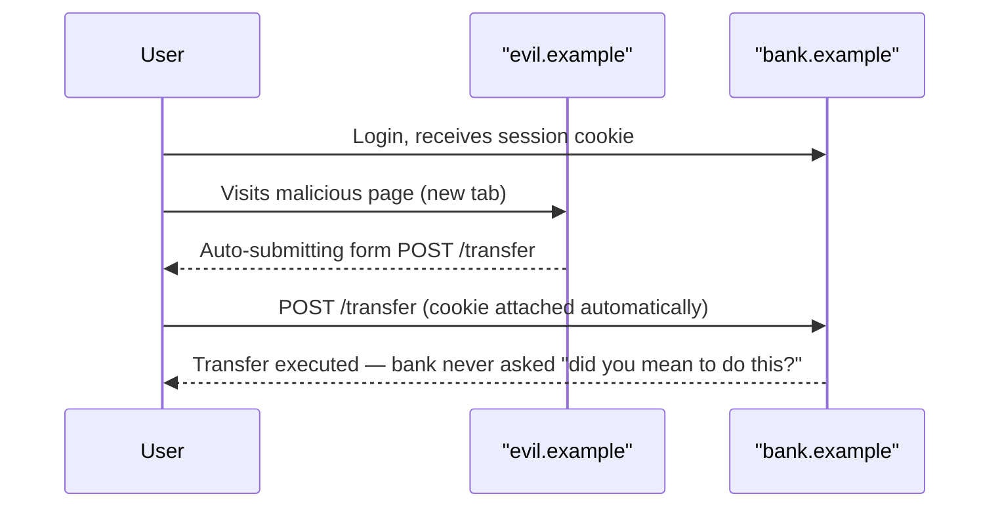
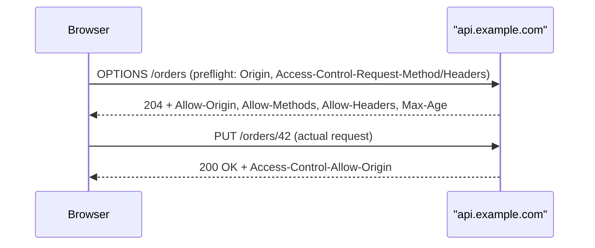

These three acronyms get confused constantly, and interviewers use that confusion to filter candidates. XSS is about untrusted data becoming code, CSRF is about a browser's cookies being used against the user, and CORS is a relaxation of a *browser* rule that has nothing to do with server-side authorization. Keep those three sentences straight and you will outperform most candidates immediately.

## Cross-site scripting (XSS)

XSS happens when attacker-controlled input is rendered as executable HTML, JavaScript or CSS instead of inert text.

| Type | Where the payload lives | Example trigger |
|---|---|---|
| Stored | Persisted in the database, served to every viewer | A comment field rendered without encoding |
| Reflected | Bounced back in the response for one request | A search query echoed into a results page |
| DOM-based | Never touches the server; a client-side sink executes it | `location.hash` written into `innerHTML` |

The fix is **context-aware output encoding**, not a single "sanitize everything" function. The encoding rule depends on where the data lands:

| Output context | Required encoding |
|---|---|
| HTML body text | HTML entity encode (`<` → `&lt;`) |
| HTML attribute | Attribute encode, quote every attribute |
| `<script>` block / JS string | JavaScript string encode, never just HTML-encode |
| URL query parameter | URL encode |
| CSS value | CSS encode, disallow `expression()`/`url()` from user input |

The rule to say out loud: encode at the point of **output**, based on the context you are writing into — not at the point of input. Input validation (allow-lists for shape) and output encoding solve different problems; conflating them is how encoding bugs slip through.

```csharp
// Razor auto-encodes by default — this is safe:
<p>@userComment</p>

// @Html.Raw bypasses encoding entirely. Only ever use it on content
// that has been through a dedicated sanitizer, never on raw user input.
<p>@Html.Raw(userComment)</p> // ❌ stored XSS if userComment is attacker-controlled
```

### DOM XSS sinks and sanitisation libraries

DOM XSS is worth calling out separately because it bypasses the server entirely — a WAF or output encoding on the server does nothing. The dangerous **sinks** are `innerHTML`, `outerHTML`, `document.write`, `eval`, `setTimeout("string")`, and `location`/`href` assignment from user-controlled sources. The fix is to prefer `textContent` over `innerHTML`, and when rich HTML really is required, run it through a sanitisation library such as DOMPurify (client) or `HtmlSanitizer` (.NET) that strips scripts, event handlers and dangerous attributes while keeping safe markup.

## Content Security Policy

CSP is a response header that tells the browser which sources of script, style, image and connection are allowed to execute — a second layer of defence if an encoding bug slips through.

```http
Content-Security-Policy: default-src 'self'; script-src 'self' https://cdn.example.com;
  object-src 'none'; base-uri 'self'; frame-ancestors 'none';
```

| Directive | Purpose |
|---|---|
| `default-src` | Fallback for any directive not explicitly set |
| `script-src` | Where scripts may load from — the most important one |
| `object-src 'none'` | Blocks Flash/plugins, a legacy XSS vector |
| `base-uri 'self'` | Stops attackers rewriting `<base>` to hijack relative URLs |
| `frame-ancestors` | Modern replacement for `X-Frame-Options`, prevents clickjacking |

> [!TIP]
> Roll CSP out in **`Content-Security-Policy-Report-Only`** mode first, pointed at a `report-uri`/`report-to` endpoint. Watch the violation reports for a week against real traffic, then flip to enforcing. Shipping a strict CSP straight to enforcing mode is the single most common way to break a production site overnight.

Avoid `'unsafe-inline'` and `'unsafe-eval'` — they defeat most of CSP's value. If inline scripts are unavoidable, use a per-request **nonce** (`script-src 'nonce-{random}'`) rather than a hash of the script content, which is easier to maintain.

## CSRF: why it works with cookies

Cross-site request forgery abuses the fact that browsers attach cookies to a request automatically, regardless of which site *initiated* that request.



The victim never sees anything happen — the browser just does what forms and cookies always do. The bank's server has no way to distinguish a request that originated from its own page versus `evil.example`, because the cookie is valid either way.

> [!WARNING]
> CSRF only works because the browser attaches credentials **implicitly**. An API that requires a bearer token in an `Authorization` header, set explicitly by JavaScript from storage, is not vulnerable to classic CSRF — a cross-site form can't add a custom header. This is why token-based SPA APIs often skip anti-forgery tokens, while cookie-authenticated apps cannot.

### Defences

| Mechanism | How it works |
|---|---|
| Synchroniser token pattern | Server embeds a random token per session/form; validated on submit, unknown to the attacker |
| Double-submit cookie | Token set as a cookie **and** required as a header/body field; attacker can't read the cookie to copy it into the header (assuming no XSS) |
| `SameSite` cookies | Browser withholds the cookie on many cross-site requests; `Lax` blocks classic cross-site form POSTs |
| Custom header requirement | Simple requests (plain form POST) can't set custom headers; requiring one forces a preflighted CORS request |

```csharp
// ASP.NET Core anti-forgery, synchroniser token pattern
services.AddAntiforgery(options => options.HeaderName = "X-CSRF-TOKEN");

[HttpPost]
[ValidateAntiForgeryToken]
public IActionResult Transfer(TransferModel model) { /* ... */ }
```

## SameSite cookies

| Mode | Sent on cross-site request? | Default use case |
|---|---|---|
| `Strict` | Never | Highest security; breaks links arriving from email/other sites |
| `Lax` | Only on top-level navigation (GET) | Modern browser default; blocks cross-site POST |
| `None` | Always (requires `Secure`) | Needed for legitimate cross-site embeds (widgets, SSO) |

`Lax` is the default in Chrome and Firefox today, which already blocks classic form-POST CSRF — but it does **not** replace anti-forgery tokens, because `Lax` still allows top-level GET navigations to carry cookies, and some frameworks still accept state-changing GETs.

## CORS: a browser relaxation, not a server firewall

The same-origin policy is the browser's default: JavaScript on `a.com` cannot read responses from `b.com`. CORS is how `b.com` opts *back into* allowing that, via response headers.

| Header | Meaning |
|---|---|
| `Access-Control-Allow-Origin` | Which origin(s) may read the response |
| `Access-Control-Allow-Methods` | Methods allowed in the actual request |
| `Access-Control-Allow-Headers` | Custom headers the client is allowed to send |
| `Access-Control-Allow-Credentials` | Cookies/auth headers may be included |
| `Access-Control-Request-Method`/`-Headers` | Sent by the browser in the preflight to ask permission |

A **simple request** (GET/HEAD/POST with only standard headers and simple content types) goes straight through, with the browser checking `Access-Control-Allow-Origin` on the response before exposing it to JavaScript. Anything else — custom headers, `PUT`/`DELETE`, or an `application/json` body — triggers a **preflight**: the browser asks first.



> [!DANGER]
> `Access-Control-Allow-Origin: *` combined with `Access-Control-Allow-Credentials: true` is **forbidden by browsers** and will fail — you cannot wildcard the origin if credentials (cookies, `Authorization`) are involved. You must echo back a specific, validated origin.

> [!KEY]
> The most common misconception: **CORS is not a security boundary that protects your API.** It protects *browser users* by restricting what a page running in their browser is allowed to read. A `curl` request, a mobile app, or a server-to-server call ignores CORS headers completely — they were never enforced by your API in the first place, only by the requesting browser. Real authorization must still happen server-side on every request.

## Cheat sheet

- Encode output based on **context** (HTML, attribute, JS, URL, CSS) — never one blanket encoder.
- DOM XSS bypasses the server entirely; audit `innerHTML`, `eval`, `document.write`.
- Roll out CSP in `Report-Only` mode first; avoid `'unsafe-inline'`.
- CSRF requires **implicit** credential attachment — bearer tokens in headers are naturally immune.
- `SameSite=Lax` is the browser default today; still pair it with anti-forgery tokens.
- CORS is enforced by the **browser**, not the server — it never replaces authorization.
- `Allow-Origin: *` + credentials is impossible; echo a validated specific origin instead.
- Preflight (`OPTIONS`) is triggered by custom headers, non-simple methods, or `application/json` bodies.

## Common mistakes

| Mistake | Fix |
|---|---|
| Treating input validation as XSS protection | Validate shape on input, encode on output for the actual context |
| Using `Html.Raw` on user input | Sanitize with a dedicated library first, or avoid raw HTML entirely |
| Assuming CORS protects the API from non-browser clients | Enforce auth/authz server-side regardless of `Origin` header |
| Reflecting the `Origin` header verbatim for every request | Validate against an allow-list before echoing it back |
| Relying only on `SameSite=Lax` for CSRF protection | Still use anti-forgery tokens for state-changing requests |
| Shipping a CSP straight to enforcing mode | Use `Report-Only` and monitor violations first |

## Summary

XSS is an encoding failure that lets attacker data execute as code; fix it with context-aware output encoding and use CSP as a second layer. CSRF exploits the browser's automatic, implicit attachment of cookies to cross-site requests; anti-forgery tokens and `SameSite` cookies are the defence, and bearer-token APIs are naturally resistant. CORS is a browser-enforced relaxation of the same-origin policy that governs what JavaScript may read — it is not, and was never meant to be, a server-side access control mechanism. Keeping these three mental models separate is what separates a strong appsec answer from a muddled one.

## Top Interview Questions

### Q1. What are the three types of XSS and how do they differ?

Stored XSS persists the payload (in a database, log, or file) and serves it to every subsequent viewer — a comment field rendered without encoding is the classic example. Reflected XSS bounces the payload back in a single response, usually via a query parameter echoed into an error page or search results, and requires tricking the victim into clicking a crafted link. DOM-based XSS never touches the server at all: client-side JavaScript reads attacker-controlled data (like `location.hash`) and writes it into a dangerous sink such as `innerHTML`. The distinction matters because server-side output encoding and a WAF can catch stored/reflected XSS, but DOM XSS requires fixing the client-side JavaScript itself.

### Q2. Why is output encoding context-dependent instead of one universal function?

The same character sequence is dangerous or safe depending on where it lands. `<` needs HTML-entity encoding inside a text node, but inside a JavaScript string literal you need JavaScript string escaping, and inside a URL you need percent-encoding. Applying HTML encoding to data destined for a `<script>` block does not stop `"; alert(1); //` from breaking out of the string, because quotes aren't part of HTML's dangerous character set. Frameworks like Razor auto-encode for the HTML-body context by default, but developers still get bitten when writing into attributes, inline event handlers, or JSON embedded in a script tag — each needs its own encoder.

### Q3. Walk through a concrete CSRF attack against a banking site.

The victim logs into `bank.example` and receives a session cookie. Without logging out, they visit a malicious page on `evil.example` that contains a hidden auto-submitting form targeting `bank.example/transfer` with attacker-chosen parameters. When the form submits, the browser attaches the `bank.example` cookie automatically — it doesn't matter that the request originated from `evil.example`'s page, because cookies are scoped to the target domain, not the initiating one. `bank.example`'s server sees a validly authenticated request and processes the transfer. The user never clicked anything that looked suspicious; the exploit lives entirely in the fact that browsers attach cookies based on destination, not origin of the request.

### Q4. Why doesn't CSRF work against an API secured with a bearer token in the Authorization header?

CSRF relies on the browser attaching credentials **implicitly** and automatically to a cross-site request — which is exactly what happens with cookies. A bearer token, by contrast, has to be added explicitly by JavaScript reading it from local storage or memory and setting the `Authorization` header on the request. A plain cross-site HTML form cannot set custom headers, so it cannot forge that request. If the API were called via `fetch`/XHR with a custom header, that would trigger a CORS preflight, which the attacker's origin would fail unless the API explicitly allowed it. This is why many token-based SPA backends skip CSRF tokens entirely and rely on the header requirement itself as the defence — the trade-off is you now need to be careful the token isn't stolen via XSS instead.

### Q5. Explain the SameSite cookie attribute and its three values.

`SameSite` controls whether a cookie is sent on a request that originates from a different site than the cookie's domain. `Strict` never sends the cookie cross-site, which is the safest but breaks scenarios like clicking a link from an email that should land you logged in. `Lax`, the modern browser default, sends the cookie on top-level navigations (a user clicking a link, causing a GET) but withholds it on cross-site POSTs, image loads, or iframe requests — this alone blocks the classic form-POST CSRF attack. `None` sends the cookie on every cross-site request regardless of type, and browsers require it be paired with `Secure`; it's needed for legitimate cases like third-party embedded widgets or SSO iframes. `Lax` reduces CSRF risk significantly but doesn't eliminate it, so anti-forgery tokens are still recommended for sensitive state-changing endpoints.

### Q6. What's the difference between the synchroniser token pattern and the double-submit cookie pattern for CSRF?

The synchroniser token pattern has the server generate a random token, store it against the user's session server-side, and embed it in every form; on submission the server compares the submitted token against the stored one, requiring server-side session state. The double-submit cookie pattern instead sets the same random token as a cookie **and** requires the client-side JavaScript to also send it as a header or hidden field; the server just checks the two match, without needing to persist anything. Double-submit is stateless and scales easily but depends on the assumption that an attacker cannot read the cookie value to copy it into the header — which fails if the site has an XSS vulnerability, since JavaScript can read non-HttpOnly cookies. The synchroniser pattern is more robust but requires session state, making it a poor fit for some stateless API architectures.

### Q7. What does CORS actually protect, and what is the most common misconception about it?

CORS governs whether JavaScript running in a browser, on one origin, is allowed to **read the response** of a request it made to a different origin — it is a relaxation of the browser's same-origin policy, enforced entirely client-side by the browser. The common misconception is treating CORS headers as a server-side access control mechanism that blocks unauthorized requests from reaching the API. It does not: the request itself is still sent and processed by the server (for simple requests) or after a preflight approval (for complex ones); CORS only decides whether the *browser* hands the response back to the calling script. A `curl` command, mobile app, server-to-server call, or a browser extension completely ignores CORS restrictions, because there's no browser sandbox to enforce them. Real security still requires authentication and authorization on every request, independent of `Origin`.

### Q8. What triggers a CORS preflight request, and what happens during one?

A request is "simple" — no preflight — only if it uses `GET`, `HEAD` or `POST`, sets no headers beyond a small safelisted set (like `Accept`, `Accept-Language`, `Content-Type`), and `Content-Type` is one of `text/plain`, `multipart/form-data` or `application/x-www-form-urlencoded`. Anything else — a `PUT`/`DELETE`/`PATCH` method, a custom header such as `Authorization` or `X-CSRF-Token`, or a JSON body — forces the browser to send an `OPTIONS` request first, called the preflight, before the real request. The preflight includes `Access-Control-Request-Method` and `Access-Control-Request-Headers` so the server can say in advance whether it will allow that combination. The server responds with `Access-Control-Allow-Methods`, `Access-Control-Allow-Headers` and `Access-Control-Allow-Origin`; only if all match does the browser send the actual request, and it caches that approval for `Access-Control-Max-Age` seconds to avoid preflighting every call.

### Q9. In production, you see CORS errors in the browser console after deploying a new frontend to a different subdomain. How do you debug and fix it?

First check whether it's a simple or preflighted request — open the network tab and look for a failed `OPTIONS` call, which tells you it's preflighted (likely due to a custom header like `Authorization` or a `Content-Type: application/json` body with certain methods). Then inspect the actual response headers on the preflight: is `Access-Control-Allow-Origin` present, and does it match the new subdomain exactly (scheme, host and port all matter)? A frequent cause is an allow-list on the server that wasn't updated for the new subdomain, or credentials being sent (`fetch(..., { credentials: "include" })`) while the server still returns a wildcard `*` origin, which browsers reject outright when credentials are involved. The fix is to add the new origin to the server's CORS allow-list (never blanket-wildcard if credentials are used) and confirm `Access-Control-Allow-Methods`/`-Headers` cover what the frontend actually sends.

### Q10. Why is `Access-Control-Allow-Origin: *` combined with credentials forbidden, and what should you do instead?

If a wildcard origin were allowed alongside `Access-Control-Allow-Credentials: true`, any website in the world could make a credentialed request to your API using a victim's cookies and read the response — effectively defeating the same-origin policy protection users rely on. Browsers enforce this as a hard rule: a request made with `credentials: 'include'` will fail client-side if the response's `Allow-Origin` is `*`, regardless of what the server intended. The correct pattern is to maintain a server-side allow-list of trusted origins, then dynamically echo back the specific `Origin` header value (after validating it's on the list) rather than using a wildcard, and set `Vary: Origin` so caches don't serve one origin's CORS headers to another.

### Q11. How would you roll out a strict Content Security Policy on an existing production application without breaking it?

Start by shipping the policy as `Content-Security-Policy-Report-Only` with a `report-to`/`report-uri` endpoint, so violations are logged but nothing is actually blocked. Let it run against real production traffic for at least a week to catch inline scripts, third-party analytics tags, and CDN-hosted assets that the policy would otherwise break. Triage the violation reports: legitimate sources get added to the allow-list, and genuinely risky inline scripts get moved to external files or given per-request nonces. Only once the report-only version generates near-zero unexpected violations do you flip the header to the enforcing `Content-Security-Policy`, ideally behind a feature flag so it can be rolled back instantly if something was missed.

### Q12. What are the most dangerous DOM XSS sinks, and how do sanitisation libraries mitigate them?

The classic dangerous sinks are `innerHTML`/`outerHTML` (parses and executes markup), `document.write`, `eval` and `Function()` (execute arbitrary strings as code), `setTimeout`/`setInterval` called with a string argument instead of a function, and assigning attacker-controlled data directly to `location`/`href`/`src`. The safe default is to prefer `textContent` or `setAttribute` with known-safe values, which never parse markup. When rich HTML genuinely needs to be rendered — a comment system supporting bold/italic, for example — a sanitisation library such as DOMPurify parses the HTML into a DOM tree, strips any script tags, event handler attributes (`onerror`, `onclick`), and dangerous URI schemes (`javascript:`), and serializes back only the safe subset, so it can be assigned to `innerHTML` without executing attacker code.
