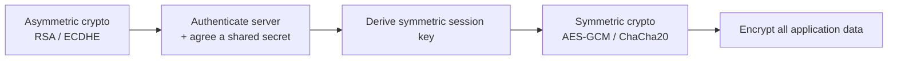
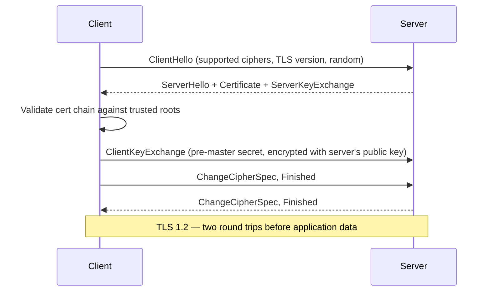
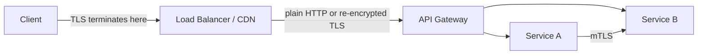

TLS is asked about constantly because almost every service depends on it, yet most engineers can only describe it as "the padlock icon". A senior answer explains what TLS guarantees, what it deliberately does not guarantee, and how the handshake gets both sides to a shared key without ever sending that key over the wire.

## What TLS provides — and what it doesn't

| Property | Provided by TLS | Mechanism |
|---|---|---|
| Confidentiality | Yes | Symmetric encryption of the session (AES-GCM, ChaCha20) |
| Integrity | Yes | AEAD ciphers / MACs detect tampering in transit |
| Server authentication | Yes | Certificate signed by a trusted CA proves server identity |
| Client authentication | Only if configured (mTLS) | Client certificate, not used by default |
| Application-layer security | No | TLS doesn't stop SQL injection, XSS, or a compromised endpoint |
| Data-at-rest protection | No | TLS only protects data **in transit** |

> [!KEY]
> TLS answers "am I talking to who I think I am, and can anyone eavesdrop or tamper on the way?" It says nothing about what happens once the data arrives — a server can still log secrets in plaintext or store passwords unhashed after a perfectly valid TLS connection.

## Symmetric vs asymmetric roles

TLS uses both, because each is good at a different job: asymmetric (public/private key) crypto is slow but solves the "we've never met" identity and key-exchange problem; symmetric crypto is fast and does the actual bulk encryption once both sides share a secret.



## The handshake, step by step



TLS 1.3 collapses this to a **single round trip**: the client guesses the server's preferred key-exchange group and sends its key share in the very first `ClientHello`, letting the server reply with its certificate, `Finished`, and the ability to send encrypted application data immediately. TLS 1.3 also removed weak ciphers (no more RSA key exchange, no CBC-mode ciphers, no renegotiation), so there's no downgrade dance to negotiate around legacy support.

> [!TIP]
> Say this out loud: *"TLS 1.3 cuts the handshake to one round trip and mandates forward secrecy — TLS 1.2 needs two round trips and can still be configured with a static RSA key exchange that has no forward secrecy."* That single sentence covers version, latency and a security property in one breath.

## Certificates and the chain of trust

A certificate binds a public key to an identity (a domain name) and is signed by a Certificate Authority (CA). Browsers and OSes ship with a small set of trusted **root CAs**; everything else is trusted transitively.

```
Root CA (trusted by OS/browser, offline, rarely used directly)
   └── Intermediate CA (does the day-to-day signing)
         └── Leaf certificate (issued to your domain)
```

When a client connects, it checks:

| Validation check | Failure means |
|---|---|
| Chain builds to a trusted root | Untrusted issuer — most browsers hard-fail |
| Signature valid at each link | Certificate tampered with or forged |
| Not expired (`notBefore`/`notAfter`) | Classic outage — see below |
| Hostname matches `CN`/`SAN` | Wrong-domain cert, blocked as a MITM risk |
| Not revoked (CRL/OCSP) | Compromised key still being trusted |

> [!WARNING]
> Certificate validation checks the **chain and hostname**, not "is this a legitimate business". A validly-issued certificate for `paypa1-support.com` passes every TLS check perfectly — TLS proves you're talking to the domain in the certificate, not that the domain is trustworthy. Phishing exploits exactly this gap.

## Pinning, mutual TLS, and HSTS

**Certificate pinning** hardcodes which certificate or public key a client should accept for a given host, rejecting anything else even if it chains to a valid CA. It stops a compromised or coerced CA from silently issuing a rogue cert for your domain — but it is operationally risky: if you rotate your certificate and forget to update pinned clients (especially old mobile app versions you can't force-update), you lock out your own users. Most teams now prefer **certificate transparency monitoring** over hard pinning for exactly this reason.

**Mutual TLS (mTLS)** flips client authentication on: both sides present certificates, which is the standard way to secure service-to-service traffic inside a mesh (Istio, Linkerd) without managing a separate credential system per service.

**HSTS** (`Strict-Transport-Security: max-age=31536000; includeSubDomains`) tells the browser to never even attempt plain HTTP for this domain again, closing the window where a user's first request could be intercepted and downgraded before a redirect to HTTPS happens.

## Perfect forward secrecy and cipher suites

A cipher suite name like `TLS_ECDHE_RSA_WITH_AES_128_GCM_SHA256` encodes four choices: the key exchange (`ECDHE`), the certificate's signature algorithm (`RSA`), the bulk cipher (`AES_128_GCM`), and the hash used for the handshake MAC (`SHA256`). **Perfect forward secrecy (PFS)** means each session negotiates a fresh, ephemeral key (the `E` in `ECDHE`/`DHE`) that is discarded afterwards — so if the server's long-term private key is stolen later, past recorded traffic still can't be decrypted, because the session keys were never derivable from the long-term key alone.

## Certificate expiry, termination points, and automation

Expired certificates are one of the most common causes of full-site outages — they fail silently in monitoring (the service is "up", just unreachable over TLS) and the expiry date is fixed months in advance, so nobody notices until it happens.



| Termination point | Trade-off |
|---|---|
| CDN/edge | Lowest client latency; internal traffic may be plaintext unless re-encrypted |
| Load balancer | Central cert management; internal hops need their own protection |
| Each service (mTLS) | Strongest, zero-trust; highest operational overhead |

The fix for expiry outages is automation: **ACME** protocols (Let's Encrypt, or a cloud provider's managed certificate service) issue and renew certificates automatically well before expiry, with alerting on renewal failures — not a calendar reminder to a person.

```csharp
// Danger: disabling certificate validation to "fix" a handshake error in dev
// This must never reach production — it defeats TLS entirely.
handler.ServerCertificateCustomValidationCallback =
    (msg, cert, chain, errors) => true; // ❌ accepts any certificate, including attacker's
```

## Cheat sheet

- TLS provides confidentiality, integrity and **server** authentication — client auth needs mTLS.
- Asymmetric crypto sets up trust and a shared secret; symmetric crypto does the bulk encryption.
- TLS 1.3 is one round trip and mandates forward secrecy; TLS 1.2 is two round trips and can lack it.
- A valid certificate proves domain ownership, not legitimacy — phishing domains get valid certs too.
- Certificate pinning stops rogue-CA issuance but risks self-inflicted lockouts on rotation.
- mTLS is the standard for service-to-service auth inside a mesh.
- HSTS prevents the first-request downgrade window from plain HTTP.
- PFS means a stolen long-term key can't decrypt past recorded traffic.
- Automate certificate renewal (ACME) — expiry is a top cause of full outages.

## Common mistakes

| Mistake | Fix |
|---|---|
| Disabling certificate validation to silence dev errors | Trust a local dev CA instead; never ship validation bypass |
| Assuming TLS secures data once stored | TLS is transit-only; encrypt at rest separately |
| Manual certificate renewal on a calendar reminder | Automate with ACME/managed certificates and alert on failure |
| Hard-pinning certificates in long-lived mobile clients | Prefer certificate transparency monitoring, or pin the CA not the leaf |
| Treating "valid cert" as "trustworthy site" | Certificates prove identity of the domain, not intent |
| Terminating TLS at the edge and leaving internal traffic plaintext | Re-encrypt or use mTLS for internal hops handling sensitive data |

## Summary

TLS combines slow asymmetric cryptography to authenticate the server and agree a secret, with fast symmetric cryptography to encrypt the actual session, giving confidentiality, integrity and server authentication but nothing about what happens to data afterwards. Certificates prove domain identity through a chain of trust to a small set of root CAs, and validation failures — expiry, hostname mismatch, revocation — are the practical things that break in production. TLS 1.3 tightens the handshake to one round trip and mandates forward secrecy, mutual TLS extends authentication to the client side for service-to-service traffic, and automated renewal is the single highest-leverage operational fix against certificate-expiry outages.

## Top Interview Questions

### Q1. What security properties does TLS actually provide, and what does it not provide?

TLS provides confidentiality (encrypting the payload so eavesdroppers can't read it), integrity (detecting any tampering in transit via AEAD ciphers or MACs), and server authentication (the certificate, signed by a trusted CA, proves you're talking to the domain you intended). It does not provide client authentication by default — that requires mutual TLS — and it says nothing about application-layer vulnerabilities like SQL injection or XSS, nor about how data is protected once it's stored. A common trap is assuming "the site has HTTPS" means the application is secure; TLS only secures the pipe, not what travels through it or what happens at either end.

### Q2. Why does TLS use both symmetric and asymmetric cryptography instead of just one?

Asymmetric cryptography solves the problem of two parties who've never met agreeing on a secret and authenticating identity, but it's computationally expensive — too slow to encrypt every byte of a video stream or API payload. Symmetric cryptography (AES-GCM, ChaCha20) is fast enough for bulk data but requires both sides to already share a secret key, which is the exact problem asymmetric crypto solves. So TLS uses asymmetric operations during the handshake to authenticate the server and derive a shared symmetric key, then switches entirely to symmetric encryption for the actual application data — getting the security guarantees of asymmetric crypto with the performance of symmetric crypto.

### Q3. Describe the TLS 1.2 handshake and explain what TLS 1.3 changed.

In TLS 1.2, the client sends a `ClientHello` listing supported ciphers; the server replies with `ServerHello`, its certificate, and key exchange parameters; the client validates the certificate chain, computes a pre-master secret, and both sides exchange `ChangeCipherSpec`/`Finished` messages before any application data flows — two full round trips of latency before the first real byte. TLS 1.3 collapses this to one round trip by having the client speculatively send its key share for a guessed group in the very first message, so the server can respond with its certificate and `Finished` and start sending encrypted application data immediately. TLS 1.3 also removed legacy weak options entirely — no static RSA key exchange, no CBC-mode ciphers, no renegotiation — so every TLS 1.3 connection has forward secrecy by construction, whereas TLS 1.2 could be configured without it.

### Q4. What is the chain of trust, and what does a client actually check when validating a certificate?

A leaf certificate for your domain is signed by an intermediate CA, which is itself signed by a root CA that ships pre-trusted in the OS or browser's trust store — validation walks this chain, verifying each signature, until it reaches a trusted root. Along the way, the client checks that the chain is unbroken and each signature is valid, that the certificate hasn't expired (`notBefore`/`notAfter`), that the hostname being connected to matches the certificate's `CN` or Subject Alternative Names, and that the certificate hasn't been revoked, checked via a CRL or OCSP responder. Any single failure — an expired cert, a mismatched hostname, an untrusted root — causes browsers to hard-fail the connection rather than silently downgrade, because a soft failure would be trivially exploitable by a man-in-the-middle.

### Q5. What is certificate pinning, and why do many teams avoid it despite the extra security?

Certificate pinning hardcodes the expected certificate or public key for a given host inside the client, so even a certificate that chains correctly to a trusted CA is rejected if it doesn't match the pin — this defends against a compromised or coerced CA issuing a rogue certificate for your domain. The operational risk is that when you legitimately rotate your certificate (routine renewal, or moving to a new CA), any client with the old pin baked in will refuse to connect, and for distributed clients like old mobile app versions you may not be able to force an update. Teams that got burned by a pinning-induced outage often move to pinning the CA or a backup key instead of the leaf certificate, or replace pinning with certificate transparency log monitoring, which detects rogue issuance without risking a client-side lockout.

### Q6. What is mutual TLS and when would you use it in production?

Mutual TLS (mTLS) requires both the client and the server to present certificates, so authentication is bidirectional instead of only the server proving its identity. It's the standard mechanism for service-to-service authentication inside a microservices mesh (Istio, Linkerd, or a cloud provider's private networking) because it gives every service a cryptographic identity without needing to distribute and rotate separate API keys or shared secrets between every pair of services. The trade-off is operational complexity — every service needs a certificate issued and rotated, which is why service meshes typically automate certificate issuance and short-lived rotation through a built-in CA, rather than expecting engineers to manage it manually.

### Q7. What is perfect forward secrecy and why does it matter if a server's private key is later stolen?

Perfect forward secrecy means each TLS session negotiates a unique, ephemeral key (via `ECDHE` or `DHE` key exchange) that exists only for that session and is discarded afterward, rather than deriving the session key directly and repeatably from the server's long-term private key. This matters because if an attacker records encrypted traffic today and later steals the server's long-term private key — through a breach, subpoena, or vulnerability — they still cannot decrypt the previously recorded sessions, because those session keys were never mathematically derivable from the long-term key alone. Without PFS (older RSA key exchange), a single stolen private key would retroactively unlock every past conversation ever encrypted with it, which is why TLS 1.3 makes forward secrecy mandatory.

### Q8. How does revocation checking work, and why is OCSP stapling preferred over the client querying the CA directly?

When a private key is compromised, the CA needs a way to tell clients "this certificate, though otherwise valid and unexpired, must no longer be trusted" — that's revocation. The older mechanism, CRLs (Certificate Revocation Lists), requires downloading a list of every revoked serial number, which grows large and is checked infrequently. OCSP (Online Certificate Status Protocol) lets a client ask the CA directly, "is this specific serial number revoked?" — but that means every single TLS handshake makes an extra network call to the CA, adding latency and giving the CA a real-time record of who is visiting which site, plus an outage at the CA breaks every site relying on it. OCSP stapling fixes both problems: the server itself periodically queries the CA and "staples" a signed, time-stamped OCSP response onto its own certificate during the handshake, so the client verifies revocation status without any extra round trip and without leaking browsing activity to the CA.

### Q9. A certificate on a production service expired at 2 a.m. and caused a full outage even though monitoring showed the service as healthy. Why did monitoring miss it, and how do you prevent recurrence?

Typical health checks hit an internal endpoint or check process liveness/CPU, which stays green because the application process itself is running fine — the failure is specifically in the TLS handshake external clients perform, which most internal health checks never exercise. The fix has two parts: first, add an explicit synthetic check that connects over TLS from outside the perimeter and alerts when the certificate's remaining validity drops below a threshold (say, 14 days), not just whether the service responds. Second, and more durably, remove the human step entirely by automating renewal with ACME (Let's Encrypt) or a cloud-managed certificate service that reissues automatically well before expiry and pages on-call only if a renewal attempt itself fails — turning a calendar-reminder process into a self-healing one.

### Q10. Where would you terminate TLS in a system with a CDN, a load balancer, and internal microservices, and what are the trade-offs?

Terminating at the CDN/edge gives the lowest latency to end users and offloads certificate management to the CDN provider, but traffic between the CDN and your origin, and between internal services, may travel in plaintext unless you explicitly re-encrypt it — acceptable for public, non-sensitive content, risky for anything carrying credentials or PII. Terminating at a central load balancer centralizes certificate rotation but means every internal hop past that point needs its own protection if it crosses a boundary you don't fully trust (a shared VPC, a multi-tenant cluster). The strongest posture terminates TLS at each service via mutual TLS, so every hop is authenticated and encrypted end-to-end, at the cost of operational overhead for certificate issuance and rotation per service — which is why this is usually automated via a service mesh rather than done by hand.

### Q11. What does a cipher suite name like TLS_ECDHE_RSA_WITH_AES_128_GCM_SHA256 tell you?

It encodes four independent choices made during the handshake: `ECDHE` is the key exchange algorithm, an elliptic-curve Diffie-Hellman variant that provides forward secrecy through ephemeral keys; `RSA` is the algorithm used to sign the certificate, authenticating the server's identity; `AES_128_GCM` is the symmetric cipher used to encrypt the actual application data, with GCM providing authenticated encryption (confidentiality plus integrity in one step); and `SHA256` is the hash function used within the handshake's key-derivation and integrity checks. Reading a cipher suite this way lets you quickly spot risk — for example, spotting `CBC` instead of `GCM` flags a mode vulnerable to padding-oracle style attacks, and spotting static `RSA` instead of `ECDHE`/`DHE` flags a key exchange with no forward secrecy.

### Q12. How does HSTS close a gap that HTTPS alone leaves open?

Even if a server only serves HTTPS, a user typing a bare domain name or following an old `http://` link makes their browser's very first request over plain HTTP, which is exactly the request an attacker on the network path can intercept and rewrite before any redirect to HTTPS happens — a classic SSL-stripping attack. `Strict-Transport-Security: max-age=31536000; includeSubDomains` tells the browser, after the first successful HTTPS visit, to rewrite every future request to that domain (and its subdomains) to HTTPS internally, before any network request is even sent, closing that downgrade window entirely. The remaining gap is the very first visit ever to a domain, which is why browsers maintain an HSTS preload list — sites can submit their domain to be baked into the browser itself as HTTPS-only, with no bootstrap request required at all.
