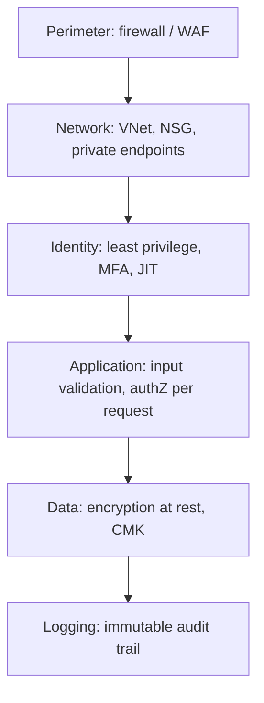

Cloud security interview questions are rarely about a single exotic attack — they're about whether you design systems assuming any one layer *will* eventually fail. A senior answer names the layer that failed, the layer that caught it, and why neither alone was sufficient.

## Defence in depth and shared responsibility

Defence in depth means no single control is trusted to be the only thing standing between an attacker and data — network isolation, identity, encryption, monitoring and application-layer validation each independently reduce blast radius, so a failure in one still leaves others standing.



The **shared responsibility model** draws a line between what the cloud provider secures and what you do: the provider secures the physical data centre, host hypervisor and, for managed services, the underlying platform; you remain responsible for identity configuration, network rules, data classification, and anything you deploy on top. This split shifts by service model — IaaS puts most responsibility on you (OS patching included), PaaS shifts patching to the provider, SaaS shifts almost everything except your own data and access configuration.

> [!KEY]
> "The cloud is secure" is not a sentence — say "the cloud *provider's infrastructure* is secure; *my configuration on top of it* is my responsibility." Nearly every major cloud breach in the last decade was a misconfiguration on the customer side (an open storage bucket, an overly broad IAM role), not a provider-side failure.

## Least privilege in practice

| Practice | What it prevents |
|---|---|
| Role scoping to specific resources, not subscription-wide | Compromised credential can't touch unrelated resources |
| Avoiding wildcard permissions (`*:*`, `Contributor` on everything) | A single over-broad grant becoming a full-account takeover |
| Just-in-time (JIT) elevation | Standing admin rights that are always available to steal |
| Break-glass accounts, separately monitored | Emergency access without becoming a permanent backdoor |

JIT elevation means privileged roles are granted only for a bounded time window, on request, with approval and full audit logging — rather than an engineer holding permanent "Owner" rights they use twice a year. **Break-glass accounts** are emergency-only credentials, stored offline or in a vault, used only when normal identity providers are unavailable (e.g. an SSO outage) — they must be tightly monitored precisely because they bypass the normal control plane.

> [!TIP]
> If asked "how do you avoid standing privileged access", describe **JIT + approval workflow + time-bound tokens + audit log**, and name a concrete tool (Azure PIM, AWS IAM temporary credentials via STS) — naming the mechanism, not just the principle, reads as hands-on experience.

## Network isolation

| Layer | Purpose |
|---|---|
| VNet/VPC | Logical network boundary per environment or workload |
| Subnet | Segments a VNet, lets you apply different rules per tier |
| Security group / NSG | Stateful allow/deny rules at the instance or subnet level |
| Private endpoint | Gives a managed PaaS service (database, storage) a private IP inside your VNet |
| No public IP on data stores | Removes the entire class of "internet-scanned and brute-forced" attacks |

The strongest posture puts databases and internal services with **no public IP at all**, reachable only via private endpoints or peered VNets, so even a misconfigured firewall rule doesn't expose them to the open internet — the resource simply has no globally routable address to hit. Subnets let you apply different NSG rules per tier (web subnet allows 443 inbound from anywhere; data subnet allows traffic only from the app subnet on its specific port).

> [!WARNING]
> A security group that's correctly locked down inbound but wide open **outbound** still lets a compromised instance exfiltrate data to any destination. Egress rules are the control most teams forget — restrict outbound traffic to known destinations (specific storage endpoints, package registries) and log/alert on unexpected outbound connections, since large or unusual egress volume is one of the clearest signals of active data exfiltration.

## Encryption, secrets, and audit trails

| Concern | Control |
|---|---|
| Data at rest | Provider-managed encryption by default; use customer-managed keys (CMK) for regulated data so you control (and can revoke) the key independently |
| Data in transit | TLS everywhere, including internal service-to-service hops |
| Secrets (connection strings, API keys) | Centralized vault (Key Vault, Secrets Manager), never in source control or plain environment variables in CI logs |
| Audit trail | Immutable, write-once logging (append-only storage, separate account/subscription from the workload being audited) |

Customer-managed keys matter because they let you **revoke access independently of the provider** — if you rotate or disable the key, even the provider can no longer decrypt your data, which is often a compliance requirement, not just a security nicety. Audit logs must be immutable and stored somewhere the workload's own compromised credentials can't reach and delete — logging to the same account that was breached defeats the purpose, since the first thing a competent attacker does is cover their tracks.

```csharp
// Reading a secret from Key Vault rather than a config file or env var
var client = new SecretClient(new Uri(vaultUri), new DefaultAzureCredential());
KeyVaultSecret secret = await client.GetSecretAsync("db-connection-string");
// The app's managed identity, not a shared key, authorizes this call
```

## Container, image, and IaC security

Container images inherit every vulnerability baked into their base layer, so **image scanning** (Trivy, Microsoft Defender for Containers) in the CI pipeline catches known CVEs in OS packages and dependencies before deployment, not after. Running containers as non-root, using minimal base images (distroless, Alpine), and pinning image digests rather than mutable tags (`:latest`) all shrink the attack surface. **Infrastructure-as-code scanning** (Checkov, tfsec, Bicep linter) catches misconfigurations — a storage account with public blob access enabled, a security group with `0.0.0.0/0` inbound on all ports — at the pull-request stage, which is far cheaper than catching it in a post-deployment audit.

## Threat-to-control mapping

| Threat | Primary control |
|---|---|
| Stolen long-lived credential | Short-lived tokens, JIT elevation, MFA |
| Lateral movement after one host is compromised | Network segmentation, least-privilege NSGs, no flat network |
| Data exfiltration | Egress filtering, DLP, anomaly detection on outbound volume |
| Database exposed to internet | Private endpoints, no public IP, deny-by-default NSG |
| Compromised CI/CD pipeline pushing malicious code | Signed commits/artifacts, IaC scanning, least-privilege pipeline identity |
| Vulnerable base image | Image scanning in CI, pinned digests, minimal base images |
| Attacker covering tracks post-breach | Immutable, separately-stored audit logs |

## Cheat sheet

- Defence in depth: assume every single layer will eventually fail, design so no failure alone is fatal.
- Shared responsibility shifts with service model — you always own configuration and data.
- Scope roles narrowly; use JIT elevation instead of standing privileged access.
- No public IPs on data stores; use private endpoints and deny-by-default NSGs.
- Egress control matters as much as ingress — exfiltration is an outbound problem.
- Use customer-managed keys when you need to be able to revoke provider access to your data.
- Store secrets in a vault, never in source control or plain environment variables.
- Audit logs must be immutable and stored outside the workload's own blast radius.
- Scan images and IaC in CI — catch misconfiguration before deployment, not after.

## Common mistakes

| Mistake | Fix |
|---|---|
| Granting broad `Contributor`/`Owner` roles for convenience | Scope roles to specific resources and actions |
| Assuming "in the cloud" means "the provider secures it" | Understand exactly what shifts to you per service model |
| Locking down inbound rules but leaving egress open | Restrict and monitor outbound traffic explicitly |
| Giving data stores public IPs "temporarily" for debugging | Use private endpoints and bastion/jump-host access instead |
| Storing connection strings in appsettings.json in source control | Use a secrets vault with managed identity access |
| Writing audit logs to the same account being audited | Ship logs to a separate, access-restricted account |

## Summary

Cloud security is the discipline of assuming every individual control will eventually fail and designing so that no single failure is catastrophic — network isolation, least-privilege identity, encryption, and immutable logging each cover a different failure mode. The shared responsibility model means the provider secures the infrastructure but you remain responsible for configuration, and nearly every major cloud breach traces back to a customer-side misconfiguration rather than a provider failure. Least privilege in practice means scoped roles, JIT elevation instead of standing access, no public IPs on data stores, and explicit egress control — with image and IaC scanning catching the mistakes before they ever reach production.

## Top Interview Questions

### Q1. Explain defence in depth with a concrete example of how it would catch a failure in a single layer.

Defence in depth means stacking independent security controls so that a failure in any one layer doesn't automatically compromise the system — each layer assumes the ones before it might already have failed. Concretely: suppose a developer accidentally leaves a database's network security group open to `0.0.0.0/0` on its port. In a system without depth, that's game over. With depth, the database still requires authenticated credentials (identity layer catches it), those credentials are scoped to a least-privilege role that can't read unrelated tables (authorization layer catches it), the data itself is encrypted at rest with a customer-managed key (data layer reduces the value of what's exposed), and access attempts are logged to an immutable, separate audit trail that triggers an alert on the anomalous connection pattern (detection layer catches it after the fact). No single layer was perfect, but the combination meant one misconfiguration didn't become a full breach.

### Q2. What is the shared responsibility model, and how does it shift between IaaS, PaaS, and SaaS?

The shared responsibility model defines the boundary between what the cloud provider secures and what the customer must secure themselves. The provider always secures the physical data centre, hardware, and virtualization layer. In IaaS (virtual machines), you're responsible for OS patching, network configuration, and everything above the hypervisor. In PaaS (managed databases, app services), the provider also patches the OS and runtime, leaving you responsible for application code, data, identity and access configuration. In SaaS, the provider manages nearly everything except your organization's data, user access, and configuration choices within the product. The one constant across all three: you are always responsible for your data, your identity and access configuration, and how you use the service — that line never shifts to the provider.

### Q3. Why should a production database never have a public IP address, even if it's protected by a firewall rule?

A public IP means the resource has a globally routable address that internet-wide scanners will discover and continuously probe, regardless of what firewall rules currently allow — the security then depends entirely on that rule being correctly configured and staying that way forever, with zero margin for a single misconfiguration, an accidental rule change, or a provider-side default shifting. A private endpoint or VNet-only address removes the entire attack surface at the network layer: there's no route from the public internet to the resource at all, so even a completely open (misconfigured) security group rule doesn't expose it, because the packets have nowhere to arrive from. This is why "no public IP on data stores" is treated as a hard architectural rule rather than a configuration best-effort — it converts a "did we configure this correctly" question into a "is this even reachable" question, which is a much stronger guarantee.

### Q4. What is just-in-time (JIT) privilege elevation and why is it preferred over standing administrative access?

Standing privileged access means a user or service account holds elevated permissions (like subscription Owner or database admin) at all times, whether or not they're actively using them — which means a compromised credential for that account is immediately a full-privilege compromise, and the permission is sitting there as an attack target every single day even though it might genuinely be needed for only a few hours a month. JIT elevation instead grants that privilege only for a bounded time window, typically requiring a request, an approval step, and a business justification, with the elevation automatically expiring and every grant fully logged. This shrinks the window an attacker has to exploit a compromised credential (if they compromise the account while it's not elevated, they get nothing extra), and it creates a clean audit trail of exactly who had elevated access and why, at any point in time — which is often the specific evidence auditors ask for in a compliance review.

### Q5. Why is egress (outbound) filtering just as important as ingress (inbound) filtering, and what's a concrete way it gets missed?

Most teams focus heavily on locking down inbound rules — which ports and sources can reach a resource — because that's the intuitive "front door" to defend. But once an attacker has compromised a single host (through a vulnerable dependency, a phished credential, or a misconfigured service), the next thing they do is move data *out*: exfiltrating a database dump to an external server, or calling out to a command-and-control endpoint for further instructions — both of which are outbound connections. A network security group that allows all outbound traffic by default (the common cloud default, ironically) means a compromised host can talk to literally anywhere on the internet with no additional obstacle. The fix is to restrict egress to only known, necessary destinations (specific package registries, specific storage endpoints, specific partner APIs) and to alert on any unusual outbound volume or destination, since large unexpected egress is one of the highest-confidence signals of active exfiltration in production.

### Q6. What's the value of a customer-managed key (CMK) over the cloud provider's default encryption at rest?

Every major cloud provider encrypts data at rest by default using keys the provider manages entirely — which protects against a stolen physical disk but does nothing to limit the provider's own technical ability to access the data if compelled (by a subpoena, an internal error, or a compromised provider-side control). A customer-managed key is generated and controlled by you, typically stored in a dedicated key vault/HSM, and the provider must call out to that vault to decrypt your data on each access — which means if you revoke or delete the key, the data becomes unrecoverable even by the provider itself. This matters most for regulated data (health records, financial data) where compliance frameworks specifically require that the data owner retain independent, revocable control over the encryption key, not just trust in the provider's default encryption.

### Q7. How does infrastructure-as-code scanning fit into a secure CI/CD pipeline, and what kinds of issues does it catch that a runtime scan wouldn't?

IaC scanning tools (Checkov, tfsec, a cloud provider's Bicep/ARM linter) analyze Terraform, Bicep, or CloudFormation templates *before* they're ever applied, checking for known-bad patterns: a storage account with public blob access enabled, a security group allowing `0.0.0.0/0` on all ports, a database provisioned without encryption enabled, an IAM policy granting a wildcard action on a wildcard resource. The key advantage over a runtime scan is timing and cost — catching the misconfiguration at the pull-request stage means it never gets deployed at all, versus a runtime/posture-management scan that only detects it after the resource already exists in production, potentially after it's already been exposed for hours or days. The trade-off is that IaC scanning only catches what's expressed in the template; drift (someone manually changing a setting in the portal after deployment) still needs a separate, continuous cloud security posture management (CSPM) tool to detect.

### Q8. How should secrets like database connection strings and API keys be managed across an application and its CI/CD pipeline?

Secrets should live in a dedicated vault service (Azure Key Vault, AWS Secrets Manager, HashiCorp Vault) rather than in source control, plain environment variables baked into a container image, or a CI/CD pipeline's variable definitions stored in cleartext — each of those alternatives leaves the secret readable by anyone with read access to the repo, the image, or the pipeline configuration, which is usually a much larger group of people than should actually have access to production credentials. At runtime, the application should authenticate to the vault using a managed identity (a credential-free, platform-issued identity tied to the specific compute resource) rather than a static key, so there's no secondary secret needed just to fetch the first one. In the pipeline itself, secrets needed for deployment should be injected just-in-time from the vault into the pipeline's runtime context, scoped to that specific job, and never printed to build logs — many pipeline systems will automatically redact values pulled from a recognized secret store but won't redact a value pasted directly into a script. The overall goal is that no secret ever exists as a static, long-lived string sitting in a file anywhere in the chain.

### Q9. Your team discovers that a storage account containing customer PII has had public read access enabled for the past three weeks due to a misconfigured IaC template that passed review. Walk through your incident response and the follow-up to prevent recurrence.

Immediately disable public access on the storage account and rotate any credentials or SAS tokens that might have been exposed alongside the data, then pull access logs for the exposure window to determine whether any external IP actually accessed the objects — this determines whether it's a "vulnerability that existed" versus "confirmed data breach" for legal and disclosure purposes, so logs need to go to legal/compliance immediately if any suspicious access is found. In parallel, identify every other resource provisioned from the same IaC template or module to check for the same misconfiguration elsewhere, since one instance found manually usually means siblings exist. For follow-up: add an IaC scanning gate (Checkov/tfsec) to the CI pipeline specifically checking for public access flags on storage resources, and separately enable continuous cloud security posture management so drift or future misconfigurations are caught even outside the IaC review process — the root cause here wasn't just "one bad template", it's "no automated check existed to catch this class of misconfiguration before or after deployment".

### Q10. What does "no wildcard permissions" mean in practice, and why is a role like Contributor-on-everything dangerous even for a trusted engineer?

A wildcard permission (`*` on actions, or a broad built-in role like Contributor applied at the subscription level) grants far more capability than almost any single task actually requires — an engineer who only ever needs to restart an app service and read its logs, if granted Contributor on the whole subscription, can also delete unrelated production databases, modify network security groups, or exfiltrate secrets from key vaults they have no legitimate reason to touch. The danger isn't distrust of the engineer's intent; it's that the permission becomes a liability the moment their credential is compromised — phished, leaked in a repo, or reused from a breached personal account — because the blast radius of that single compromised identity is now the entire subscription instead of one app service. The fix is scoping roles to the specific resource and the specific actions needed (a custom role permitting only "restart" and "read logs" on one named resource), which is more setup effort but converts a subscription-wide compromise into a contained, single-resource incident.

### Q11. How would you design network segmentation for a system with a public web tier, an internal application tier, and a database tier?

Place each tier in its own subnet within the VNet, and apply a deny-by-default network security group to each, explicitly allowing only the traffic that's actually required between adjacent tiers: the web subnet's NSG allows inbound 443 from the internet (or from a load balancer/WAF in front of it) and nothing else inbound; the application subnet's NSG allows inbound traffic only from the web subnet on the specific application port, denying direct internet access entirely; the database subnet's NSG allows inbound traffic only from the application subnet on the database's specific port, and the database itself has no public IP, ideally reached via a private endpoint. This means that even if an attacker compromises the public-facing web tier, they land in a network position that can only reach the application tier on one port — they cannot directly reach the database tier at all, which has to be reached through the application tier's own authenticated logic, containing lateral movement to one hop at a time instead of a flat network where compromising any single host exposes everything.

### Q12. How do you secure a container image supply chain from base image to production deployment?

Start from a minimal, actively-maintained base image (distroless or a slim official image rather than a full OS image with unnecessary tools), and scan it in CI with a tool like Trivy or Defender for Containers to catch known CVEs in OS packages and language dependencies before the image is ever pushed to a registry. Pin the image by digest rather than a mutable tag like `:latest` in your deployment manifests, so what you tested is guaranteed to be exactly what deploys — a tag can be silently repointed to different content later, a digest cannot. Run the container as a non-root user, apply a read-only root filesystem where possible, and enforce these as policy (via admission control in the orchestrator) rather than relying on every team remembering to do it manually. Finally, keep scanning images continuously after deployment too, since a new CVE can be disclosed for a package that was clean when you built the image — a supply chain is a pipeline you monitor, not a one-time gate you pass through.
