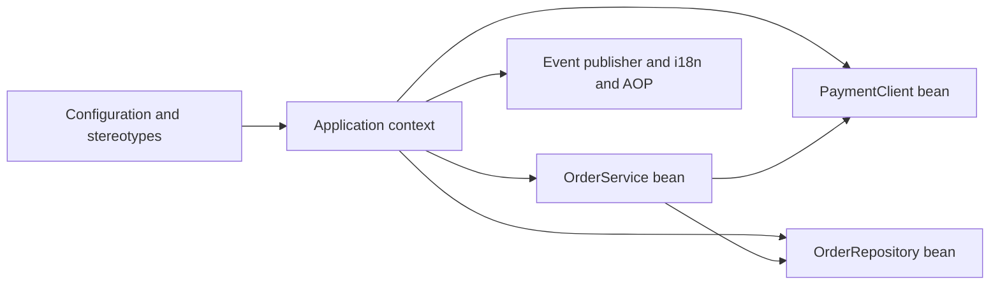
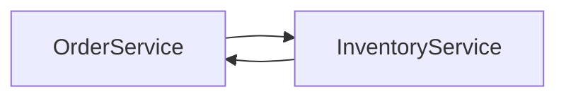

Inversion of Control (IoC) is the idea that you do not create and wire your own objects — the framework does it for you and calls your code at the right moment. Dependency Injection (DI) is the concrete technique Spring uses to deliver that: it constructs your objects, supplies their collaborators, and hands you a ready-to-use graph. This page is the foundation for everything else in Spring.

## Inversion of Control means the framework calls you

In a normal program *you* call libraries. Under IoC that relationship flips: you write components, register them, and the container decides when to instantiate them and what to pass in. This is sometimes called the *Hollywood Principle* — "don't call us, we'll call you". The practical payoff is that classes stop knowing how to build their own dependencies, so they become smaller, decoupled and testable.

Concretely, without IoC a class writes `this.repository = new JdbcOrderRepository(dataSource)`, hard-wiring a specific implementation and its transitive dependencies. With IoC the class simply declares "I need an `OrderRepository`" and the container supplies whichever implementation is configured — a real one in production, a stub in tests. The dependency graph is described declaratively (annotations, `@Bean` methods) and assembled by the framework, so swapping an implementation is a configuration change, not a code change scattered across dozens of call sites.

The object doing the wiring is the **Spring container**, represented by two interfaces:

| Interface | Role | What it gives you |
|---|---|---|
| `BeanFactory` | The bare container: lazy bean instantiation and DI | Minimal footprint, rarely used directly |
| `ApplicationContext` | Superset of `BeanFactory` | Events, i18n messages, resource loading, AOP, auto-configuration, eager singleton creation |

In Spring Boot you almost always work with an `ApplicationContext`. It adds the enterprise features on top of `BeanFactory`: publishing and listening to application **events**, internationalised **messages**, **AOP** proxy support, environment/property resolution and Spring Boot **auto-configuration**.



## Three ways to inject a dependency

Spring can inject through a constructor, a setter, or straight onto a field. They are not equal.

```java
@Service
public class OrderService {
    private final PaymentClient payments;      // immutable, always set
    private final OrderRepository repository;

    // Single constructor: @Autowired is optional since Spring 4.3
    public OrderService(PaymentClient payments, OrderRepository repository) {
        this.payments = payments;
        this.repository = repository;
    }
}
```

**Constructor injection is the recommended style.** It gives you `final` fields (immutable, thread-safe), it *fails fast* — the context refuses to start if a required dependency is missing rather than throwing a `NullPointerException` later — and it makes the class trivially unit-testable: you just call `new OrderService(mockPayments, mockRepo)` with no Spring at all. Since Spring 4.3, if a class has exactly one constructor you can omit `@Autowired` entirely.

**Setter injection** suits genuinely *optional* dependencies that have a sensible default and may be reconfigured after construction.

**Field injection** puts `@Autowired` directly on a field. It looks concise but teams ban it for concrete reasons.

```java
@Service
public class BadService {
    @Autowired private PaymentClient payments;   // hidden dependency, cannot be final
}
```

> [!DANGER]
> Field injection hides a class's dependencies (they are invisible in the constructor signature), it cannot produce a `final` field, and it forces you to use reflection or a running Spring context to set the field in a test. A class with ten `@Autowired` fields is telling you it does too much — but field injection hides that smell.

### Optional and nullable dependencies

Sometimes a collaborator legitimately may be absent — an optional metrics client, a feature that ships in only some deployments. Spring gives you several ways to express "inject it if it exists, otherwise don't fail":

```java
@Service
public class MetricsService {
    private final Optional<Tracer> tracer;                 // empty if no Tracer bean
    public MetricsService(Optional<Tracer> tracer) { this.tracer = tracer; }
}
```

You can also mark a parameter `@Autowired(required = false)` or `@Nullable`, but wrapping in `Optional<T>` (or injecting an `ObjectProvider<T>`) is clearer because the absence is visible in the type. Use these sparingly — most dependencies are genuinely required, and a required dependency should fail fast, not be quietly null.

## Registering beans: stereotypes versus `@Bean`

There are two ways to tell Spring about a bean.

**Stereotype scanning** — annotate your own class and let component scanning find it:

| Annotation | Intended for | Extra behaviour |
|---|---|---|
| `@Component` | Any Spring-managed bean | None (the generic base) |
| `@Service` | Business/service layer | Semantic only |
| `@Repository` | Persistence layer | Adds **exception translation** to `DataAccessException` |
| `@Controller` | Web layer | Enables request mapping |

**Explicit `@Bean` methods** inside a `@Configuration` class — you construct the object yourself:

```java
@Configuration
public class ClientConfig {
    @Bean
    public RestClient paymentRestClient() {        // third-party type you cannot annotate
        return RestClient.builder().baseUrl("https://pay.internal").build();
    }
}
```

The rule of thumb: use stereotypes for *your own* classes; use `@Bean` when you need a **third-party class** you cannot annotate (a `RestClient`, a `DataSource`, an SDK client) or when construction needs custom logic.

By default a `@Bean` method's bean name is the method name, and calling one `@Bean` method from another within the same `@Configuration` class returns the *same* singleton instance rather than a new object — because Spring proxies the configuration class (so-called "full" `@Configuration` mode). That is why you can wire beans together by plain method calls inside a configuration class and still get singleton semantics. Both stereotype-scanned beans and `@Bean`-defined beans go through the identical lifecycle and can be injected, advised and scoped in exactly the same way; the only difference is who constructs them.

## Component scanning and the classic package bug

`@SpringBootApplication` is a meta-annotation that includes `@ComponentScan`. Scanning starts at the **package of the main class and descends into sub-packages only**.

```java
package com.acme.shop;                 // components must live at or below here

@SpringBootApplication
public class ShopApplication {
    public static void main(String[] args) { SpringApplication.run(ShopApplication.class, args); }
}
```

> [!WARNING]
> If your main class sits in `com.acme.shop.boot` but your services live in `com.acme.services`, scanning never reaches them and you get baffling "no qualifying bean" errors. Keep the main class in a **root package above** everything else, or add an explicit `@ComponentScan(basePackages = ...)`.

## Resolving ambiguity when several beans match

When more than one bean matches an injection point by type, Spring cannot decide and throws `NoUniqueBeanDefinitionException`. You have several tools:

```java
public interface Notifier { void send(String msg); }

@Component @Primary class EmailNotifier implements Notifier { /* default choice */ }
@Component("sms") class SmsNotifier implements Notifier { }

@Service
public class AlertService {
    // Ask for a specific one by name
    public AlertService(@Qualifier("sms") Notifier notifier) { }
}
```

| Tool | Use it when |
|---|---|
| `@Primary` | One bean is the obvious default among several |
| `@Qualifier("name")` | You need a specific named bean at an injection point |
| `@Order` | You care about the ordering inside an injected collection |
| `List<T>` / `Map<String,T>` | You want *all* implementations — a clean strategy pattern |

Injecting every implementation is a genuinely useful trick:

```java
@Service
public class PaymentRouter {
    private final Map<String, PaymentHandler> handlers;   // key = bean name
    public PaymentRouter(Map<String, PaymentHandler> handlers) { this.handlers = handlers; }
    void pay(String type) { handlers.get(type).handle(); }
}
```

For dependencies that are **optional or created late**, use `ObjectProvider` (which lets you check existence, provide a default, or defer) or `@Lazy` (which injects a proxy and defers real creation until first use). `ObjectProvider` is also the safest way to pull an on-demand instance without forcing the whole graph to be built eagerly at construction time.

```java
@Service
public class ReportService {
    private final ObjectProvider<Cache> cache;
    public ReportService(ObjectProvider<Cache> cache) { this.cache = cache; }
    void run() { cache.ifAvailable(Cache::warm); }   // no crash if no Cache bean exists
}
```

## Circular dependencies

A circular dependency is `A` needing `B` while `B` needs `A`. With constructor injection Spring cannot build either first, so it fails.



Since **Spring Boot 2.6 this fails at startup by default** — and that is a feature, because a cycle usually signals a design problem. The real fixes are structural, not tricks:

| Approach | Type | Verdict |
|---|---|---|
| Extract a third collaborator both depend on | Redesign | ✅ Best fix |
| Use `ApplicationEvent` to decouple the call | Redesign | ✅ Good |
| `@Lazy` on one dependency | Escape hatch | ⚠️ Hides the smell |
| `spring.main.allow-circular-references=true` | Escape hatch | ❌ Last resort |

> [!TIP]
> In an interview, name the redesign first — "I'd extract the shared logic into a third bean or fire an event" — and only then mention `@Lazy`. Reaching straight for `allow-circular-references` signals you paper over design issues.

## `@Repository` versus plain `@Component`

`@Repository` is a `@Component` plus automatic translation of vendor-specific persistence exceptions into Spring's `DataAccessException` hierarchy — that single line is the difference worth stating out loud. In everyday code the annotations are semantically interchangeable for scanning purposes, but choosing the precise stereotype documents each class's layer and, in the repository case, buys you the exception translation for free.

## Cheat sheet

- IoC = the framework instantiates and calls your objects; DI is how it supplies collaborators.
- `ApplicationContext` = `BeanFactory` + events + i18n + AOP + auto-configuration + eager singletons.
- Prefer **constructor injection**: `final` fields, fail-fast, testable without Spring.
- Single constructor ⇒ `@Autowired` is optional (Spring 4.3+).
- Field injection hides dependencies and blocks `final` — avoid it.
- Stereotypes for your classes; `@Bean` in `@Configuration` for third-party types.
- Scanning starts at the main class package and goes *downwards* only.
- Disambiguate with `@Primary`, `@Qualifier`, `@Order`, or inject `List`/`Map` of all beans.
- `ObjectProvider` and `@Lazy` handle optional or late dependencies.
- Circular deps fail by default since Boot 2.6 — fix the design, do not flip the flag.

## Common mistakes

| Mistake | Fix |
|---|---|
| Field injection everywhere | Switch to constructor injection with `final` fields |
| Main class in a sibling package | Move it to the root package or set `@ComponentScan` |
| `@Bean` for a class you own | Use a stereotype and let scanning register it |
| `NoUniqueBeanDefinitionException` ignored | Add `@Primary` or `@Qualifier` at the injection point |
| Enabling `allow-circular-references` | Break the cycle with a third bean or an event |
| Annotating a third-party class | You cannot — register it with an `@Bean` method |

## Summary

Inversion of Control hands object creation and wiring to the Spring container so your classes stay focused and decoupled. The `ApplicationContext` is the container you use in Boot, adding events, i18n, AOP and auto-configuration over the bare `BeanFactory`. Constructor injection is the default choice because it yields immutable, fail-fast, testable classes, while field injection hides dependencies and should be avoided. Register your own classes with stereotypes and third-party ones with `@Bean`, disambiguate with qualifiers or collections, and treat a circular dependency as a design signal rather than something to silence.

## Top Interview Questions

### Q1. What is Inversion of Control and how does dependency injection relate to it?

Inversion of Control means the framework, not your code, owns the flow of object creation and invocation — "don't call us, we'll call you". Instead of a class instantiating its own collaborators, the container builds them and passes them in. Dependency Injection is the specific mechanism Spring uses to achieve IoC: it resolves each bean's required types, constructs the dependency graph, and supplies collaborators through constructors, setters or fields. The benefit is decoupling — a class declares *what* it needs, not *how* to build it — which makes code smaller, swappable and unit-testable. In short, IoC is the principle; DI is the implementation Spring provides.

### Q2. What does ApplicationContext add over BeanFactory?

`BeanFactory` is the minimal container: it holds bean definitions and performs lazy instantiation and dependency injection. `ApplicationContext` is a superset that adds the features real applications need: publishing and listening to **application events**, **internationalisation** of messages, unified **resource loading**, **AOP** proxy support, environment and property resolution, and — in Spring Boot — **auto-configuration**. It also eagerly instantiates singletons at startup so failures surface at boot rather than on first request. You would only drop to a raw `BeanFactory` in extremely memory-constrained scenarios; in practice every Spring Boot application runs on an `ApplicationContext`.

### Q3. Why is constructor injection preferred over field injection?

Constructor injection lets you declare dependencies as `final`, so they are immutable and guaranteed set — the object is never in a half-built state. It **fails fast**: if a required bean is missing the context refuses to start, instead of a `NullPointerException` at runtime. It makes the class testable with plain `new`, passing mocks directly with no Spring context or reflection. And the constructor signature documents every dependency, so a bloated constructor visibly signals a class doing too much. Field injection loses all of this: fields cannot be `final`, dependencies are hidden, and tests need reflection or a running container. That is why most teams standardise on constructor injection.

### Q4. When should you use a @Bean method instead of a stereotype annotation?

Use a stereotype (`@Component`, `@Service`, `@Repository`, `@Controller`) when the class is **yours** — you can annotate it and let component scanning register it automatically. Use an `@Bean` method inside a `@Configuration` class when you cannot annotate the class: a **third-party type** like a `DataSource`, an SDK client or a `RestClient`, or when construction requires custom logic, builders or conditional wiring. `@Bean` gives you full control over how the instance is built and lets you register several beans of the same type with different configurations. The rule: stereotypes for your code, `@Bean` for everything you do not own.

### Q5. A colleague reports "no qualifying bean of type X" even though the class has @Service. What do you check?

First check **package placement**: component scanning starts at the `@SpringBootApplication` class's package and only descends into sub-packages. If the service lives in a package that is not below the main class, it is never scanned. The fix is to move the main class to a root package or add `@ComponentScan(basePackages=...)`. Next, verify the annotation is a Spring stereotype and not a same-named annotation from another library, and that the class is not excluded by a filter or a failing `@Conditional`. Finally, confirm the module is on the classpath. In most real cases it is the package-hierarchy bug.

### Q6. How do you resolve an injection point when multiple beans match the same type?

If several beans satisfy a type, Spring throws `NoUniqueBeanDefinitionException`. Options: mark the default with `@Primary`; select a specific one with `@Qualifier("name")` at the injection point; control ordering within a collection using `@Order`; or, if you actually want *all* implementations, inject a `List<T>` or `Map<String,T>` where the map key is the bean name. The collection approach is a clean strategy pattern — for example a `Map<String, PaymentHandler>` lets you dispatch by key without a switch statement. Choose `@Primary` for a single obvious default and `@Qualifier` when the caller must pick explicitly.

### Q7. What is a circular dependency, why does Spring Boot fail it now, and how do you fix it?

A circular dependency is when bean A requires B and B requires A. With constructor injection neither can be built first, so creation deadlocks. Since **Spring Boot 2.6** this fails at startup by default, which is deliberate — a cycle usually reveals muddled responsibilities. The correct fixes are structural: extract the shared behaviour into a third collaborator both depend on, or decouple the interaction with an application event so one side no longer holds a direct reference. Escape hatches exist — `@Lazy` on one dependency injects a proxy and defers resolution, and `spring.main.allow-circular-references=true` restores the old behaviour — but they hide the design problem rather than solving it.

### Q8. How do @Lazy and ObjectProvider help, and when would you reach for them?

`@Lazy` injects a proxy instead of the real bean and defers actual creation until the dependency is first used. It is handy for expensive beans you may never touch, or as a targeted way to break a construction cycle. `ObjectProvider<T>` gives you programmatic, null-safe access: you can call `getIfAvailable`, supply a default, iterate over all matches, or defer lookup entirely — useful when a dependency is **optional** (`ifAvailable`) or when you need a fresh instance on demand (for example pulling a prototype into a singleton). Reach for `ObjectProvider` when presence is uncertain; reach for `@Lazy` when the dependency exists but you want to postpone building it.

### Q9. What extra behaviour does @Repository provide over @Component?

`@Repository` is a specialised `@Component`, so it is still detected by scanning and still a Spring bean. Its distinctive feature is **persistence exception translation**: when combined with a `PersistenceExceptionTranslationPostProcessor` (auto-configured in Boot), Spring catches vendor-specific or JPA exceptions thrown by the bean and rethrows them as its consistent, unchecked `DataAccessException` hierarchy. That lets your service layer handle one exception family regardless of whether the backend is JPA, JDBC or another provider, keeping database-specific error types from leaking upward. Semantically it also documents the class as the persistence layer, but the exception translation is the concrete, testable difference.

### Q10. In production, how do you keep your bean wiring maintainable as the codebase grows?

Standardise on constructor injection so dependencies are explicit and classes stay small — a growing constructor is an early warning to split responsibilities. Keep the main class in a clean root package so scanning is predictable, and prefer stereotypes over scattered `@Bean` methods for your own code. Use `@Qualifier` and typed collections rather than fragile ordering assumptions, and treat any circular dependency as a refactor task, not a config flag. Group third-party `@Bean` definitions into focused `@Configuration` classes. Finally, lean on fail-fast startup: eager singletons and constructor validation mean a misconfigured graph breaks the build or boot, not a 3 a.m. request.
