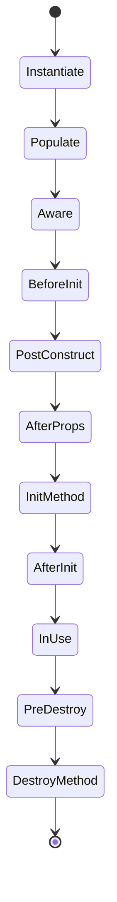
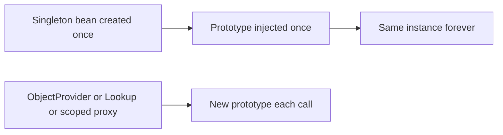

A Spring bean is not just `new`-ed and forgotten. The container walks it through a precise sequence of callbacks — awareness, post-processing, initialisation, use, and destruction — and the point where AOP proxies appear is inside that sequence. Understanding the lifecycle and the scope rules explains a whole category of subtle production bugs.

## The full bean lifecycle

When the container creates a bean it runs these steps in order. The single most important detail for interviews is that the **AOP proxy is created during `postProcessAfterInitialization`** — the object you inject is often a proxy, not the raw instance.



| Phase | Trigger | Typical use |
|---|---|---|
| Instantiate | Constructor called | Object exists, no deps yet |
| Populate | Dependencies injected | Fields set |
| Aware | `BeanNameAware`, `BeanFactoryAware`, `ApplicationContextAware` | Grab container hooks |
| Before init | `BeanPostProcessor.postProcessBeforeInitialization` | Pre-init tweaks |
| `@PostConstruct` | Annotation | Preferred init hook |
| After props | `InitializingBean.afterPropertiesSet` | Framework-style init |
| Init method | Custom `initMethod` | Config-driven init |
| After init | `BeanPostProcessor.postProcessAfterInitialization` | **AOP proxy created here** |
| Pre destroy | `@PreDestroy` | Preferred cleanup hook |
| Destroy | `DisposableBean.destroy`, custom `destroyMethod` | Framework/config cleanup |

```java
@Service
public class ConnectionPool {
    @PostConstruct
    void warmUp() { /* open connections once the bean is fully wired */ }

    @PreDestroy
    void drain() { /* release resources on shutdown */ }
}
```

> [!TIP]
> Prefer `@PostConstruct` and `@PreDestroy` over implementing `InitializingBean` and `DisposableBean`. The annotations (from `jakarta.annotation`) keep your class free of Spring interfaces, so it stays framework-agnostic and easier to test. Reserve the interfaces for infrastructure code that genuinely needs them.

## Bean scopes

A scope controls how many instances the container creates and how long they live.

The default is `singleton`, and it is the right choice for the overwhelming majority of beans — stateless services, repositories, controllers and configuration holders. You reach for other scopes deliberately: `prototype` when each caller needs its own fresh, throwaway instance, and the web scopes when a bean's lifetime should track an HTTP request, a user session, or the servlet context. Choosing the wrong scope is a common source of both memory leaks (holding request state too long) and concurrency bugs (sharing state that should not be shared).

| Scope | Instances | Destroy callbacks | Notes |
|---|---|---|---|
| `singleton` (default) | One **per container** | ✅ | Not one per JVM — one per `ApplicationContext` |
| `prototype` | New on every lookup | ❌ Spring does not call destroy | Caller owns cleanup |
| `request` | One per HTTP request | ✅ | Web only, needs a proxy in singletons |
| `session` | One per HTTP session | ✅ | Web only |
| `application` | One per `ServletContext` | ✅ | Web only |

> [!WARNING]
> "Singleton" in Spring means one instance **per application context**, not the classic one-per-JVM Singleton pattern. If you run two contexts (common in tests or modular apps) you get two instances. And Spring does **not** invoke destroy callbacks on `prototype` beans — the container hands the instance over and forgets it, so you must clean prototypes up yourself.

## Injecting a prototype into a singleton

This is the classic trap. A singleton is created once, so its dependencies are injected **once** — a prototype injected normally is captured a single time and never refreshed. If you want a fresh prototype on each use, you need one of three fixes.



| Fix | How it works |
|---|---|
| `ObjectProvider` / `ObjectFactory` | Call `getObject()` each time you need a new instance |
| `@Lookup` method injection | Spring overrides an abstract/overridable method to return a fresh bean |
| Scoped proxy (`proxyMode = TARGET_CLASS`) | Inject a proxy that resolves a new target per call |

```java
@Service
public class ReportRunner {
    private final ObjectProvider<ReportJob> jobs;   // prototype factory
    public ReportRunner(ObjectProvider<ReportJob> jobs) { this.jobs = jobs; }

    void run() {
        ReportJob job = jobs.getObject();           // a fresh prototype each call
        job.execute();
    }
}
```

Likewise, a `@Scope("request")` bean cannot be injected straight into a singleton — there is no request when the singleton is built — so it must be a **scoped proxy** that resolves the current request's instance on each method call.

## Stateless singletons and the mutable-field bug

Because a singleton is shared across all threads, it must be **stateless or thread-safe**. The most common Spring concurrency bug is a mutable instance field on a `@Service`.

```java
@Service
public class InvoiceService {
    private BigDecimal runningTotal;   // DANGER: shared mutable state across threads
}
```

> [!DANGER]
> A mutable field on a singleton bean is shared by every concurrent request. Two users hitting the endpoint at once will corrupt each other's `runningTotal`. Keep singletons stateless — pass state through method parameters, or use local variables — and only store immutable configuration in fields.

The same rule catches subtler cases: a shared non-thread-safe helper such as `SimpleDateFormat` or a reused `StringBuilder` stored as a field will interleave across threads and produce garbage under load. If a bean genuinely needs per-invocation state, keep that state in local variables inside the method, or hold the unsafe helper in a `ThreadLocal`, so nothing mutable is shared across the threads that call the singleton.

## Eager versus lazy singletons

By default the container instantiates singletons **eagerly at startup**. Marking a bean `@Lazy` defers creation until first use.

```java
@Service
@Lazy                                  // built on first use, not at startup
public class ExpensiveReportEngine { }
```

> [!KEY]
> Eager creation is a **feature**, not overhead: a broken bean fails the boot immediately, in your face, rather than at 3 a.m. when the first user hits it. Use `@Lazy` only for genuinely expensive beans that are rarely used — and accept you have moved the failure to runtime.

You can also make an entire application lazy with `spring.main.lazy-initialization=true`, which speeds up startup dramatically in large apps but trades away that fail-fast guarantee everywhere. A common compromise is to keep the global default eager and mark only a handful of heavy, seldom-used beans `@Lazy`, so startup stays fast without hiding wiring errors in the critical path.

## BeanPostProcessor versus BeanFactoryPostProcessor

Both are extension points but they run at different times on different things.

| Aspect | `BeanFactoryPostProcessor` | `BeanPostProcessor` |
|---|---|---|
| Operates on | Bean **definitions** (metadata) | Bean **instances** |
| Runs | Earlier, before any bean is instantiated | Around each bean's initialisation |
| Example | `@Value` resolution, `@ConfigurationProperties` binding | AOP proxying, `@PostConstruct` handling |

Because a `BeanFactoryPostProcessor` edits definitions before beans exist, it is where property placeholders (`@Value`) and `@ConfigurationProperties` binding happen. A `BeanPostProcessor` wraps instances — which is exactly how AOP proxies are added.

A subtle but frequently-asked consequence: a `BeanPostProcessor` cannot itself be advised by AOP. It is instantiated very early to process *other* beans, before the AOP infrastructure that would proxy it is ready — so annotations like `@Transactional` on a `BeanPostProcessor` silently do nothing. The same caution applies to any bean a `BeanPostProcessor` depends on, which can be forced into early initialisation and miss proxying.

## Startup and shutdown hooks

Spring offers several ways to run code at the right moment.

| Hook | Fires when | Good for |
|---|---|---|
| `SmartInitializingSingleton` | After **all** singletons are initialised | Cross-bean setup |
| `ApplicationRunner` / `CommandLineRunner` | Just after context refresh, before serving | One-off startup tasks |
| `@EventListener(ApplicationReadyEvent.class)` | App fully started and ready | Warm caches, register health |
| `@PreDestroy` | Graceful shutdown | Drain thread pools, close resources |

```java
@Component
public class Warmup implements ApplicationRunner {
    @Override public void run(ApplicationArguments args) {
        // executed once at startup, before the app takes traffic
    }
}
```

For clean shutdown, close resources in `@PreDestroy`. A thread pool must be told to stop accepting work and to wait for in-flight tasks:

```java
@PreDestroy
void shutdown() {
    executor.shutdown();                       // stop accepting new tasks
    executor.awaitTermination(30, SECONDS);    // let running tasks finish
}
```

Finally, `@DependsOn("flyway")` forces one bean to be initialised after another when there is an ordering requirement not expressed through direct injection.

### Aware interfaces and events

The awareness callbacks let a bean grab a handle to the container itself. `BeanNameAware` hands the bean its own registered name, `BeanFactoryAware` and `ApplicationContextAware` inject the factory or context so the bean can look up others or publish events. Use them only in infrastructure code — depending on the container from ordinary business beans couples you to Spring and is usually a sign the wiring should be expressed as a normal dependency instead.

Events are the loosely-coupled alternative. A bean publishes an `ApplicationEvent` (or any object in Boot 3) through `ApplicationEventPublisher`, and any number of `@EventListener` methods react without the publisher knowing who is listening. This is the idiomatic way to break a would-be circular dependency: instead of A calling B directly, A fires an event and B listens. Listeners run synchronously by default on the publishing thread, so add `@Async` if a listener does slow work you do not want to block the caller.

## Cheat sheet

- Order: instantiate → populate → aware → before-init → `@PostConstruct` → `afterPropertiesSet` → init-method → after-init → in use → `@PreDestroy` → destroy.
- The **AOP proxy** is created in `postProcessAfterInitialization`.
- Prefer `@PostConstruct`/`@PreDestroy` over `InitializingBean`/`DisposableBean`.
- `singleton` = one per **context**, not per JVM; `prototype` gets **no** destroy callback.
- Web scopes: `request`, `session`, `application` — inject into singletons via a scoped proxy.
- Prototype-into-singleton: use `ObjectProvider`, `@Lookup`, or `proxyMode = TARGET_CLASS`.
- Singletons must be stateless or thread-safe — never mutable instance fields.
- Eager singletons fail at boot; `@Lazy` moves failure to first use.
- `BeanFactoryPostProcessor` edits definitions early; `BeanPostProcessor` wraps instances.
- Startup work: `ApplicationRunner`, `CommandLineRunner`, `ApplicationReadyEvent`.

## Common mistakes

| Mistake | Fix |
|---|---|
| Mutable field on a singleton `@Service` | Keep it stateless; pass state as parameters |
| Prototype injected once and reused | Use `ObjectProvider`, `@Lookup`, or a scoped proxy |
| Injecting a `request` bean directly | Make it a scoped proxy with `TARGET_CLASS` |
| Expecting destroy on a prototype | Clean it up yourself; Spring will not |
| `@Transactional` on a `BeanPostProcessor` | It cannot be advised — move logic elsewhere |
| Thread pool not drained on shutdown | `shutdown()` then `awaitTermination` in `@PreDestroy` |

## Summary

The Spring container runs each bean through a fixed lifecycle: instantiation, population, awareness callbacks, post-processing, initialisation, use and destruction — and the AOP proxy is woven in during the after-initialisation step. Scope determines identity: singletons are one-per-context and must be thread-safe, while prototypes are fresh per lookup and get no destroy callback. Injecting a prototype or a web-scoped bean into a singleton needs a provider or scoped proxy to avoid capturing a stale instance. Prefer the annotation hooks over Spring interfaces, keep singletons stateless, and lean on eager startup so misconfiguration fails at boot rather than in production.

## Top Interview Questions

### Q1. Walk through the Spring bean lifecycle from creation to destruction.

The container instantiates the bean via its constructor, injects dependencies (populate), then runs awareness callbacks (`BeanNameAware`, `BeanFactoryAware`, `ApplicationContextAware`). Next `BeanPostProcessor.postProcessBeforeInitialization` runs, then the initialisation callbacks in order: `@PostConstruct`, `InitializingBean.afterPropertiesSet`, and any custom `initMethod`. Then `BeanPostProcessor.postProcessAfterInitialization` runs — this is where AOP proxies are created. The bean is now in use. On shutdown, `@PreDestroy` runs, then `DisposableBean.destroy`, then any custom `destroyMethod`. Knowing the after-initialisation step is where proxying happens explains why the injected object is often a proxy wrapping your instance.

### Q2. Where in the lifecycle is the AOP proxy created, and why does it matter?

The proxy is created by a `BeanPostProcessor` during `postProcessAfterInitialization`, after your bean is fully initialised. It matters because the object other beans receive is the proxy, not your raw instance — that is what makes `@Transactional`, `@Cacheable` and `@Async` work. It also explains the self-invocation problem: calling `this.method()` inside the bean bypasses the proxy, since `this` is the raw target, not the wrapper. And because proxying happens so late, infrastructure beans that run earlier (like a `BeanPostProcessor` itself) cannot be advised.

### Q3. What does "singleton scope" actually mean in Spring?

It means **one instance per Spring `ApplicationContext`**, not the classic one-instance-per-JVM Singleton pattern. If an application starts two contexts — common in integration tests, or in modular or hierarchical setups — each context has its own singleton instance. The container caches the single instance and injects it everywhere the type is required. The practical consequence is that singleton beans are shared across all threads in that context, so they must be stateless or thread-safe. Candidates who say "one per JVM" get corrected on the follow-up.

### Q4. How do you correctly inject a prototype bean into a singleton?

Injecting it normally captures one instance at singleton construction and reuses it forever, defeating the prototype scope. Three correct fixes: inject an `ObjectProvider<T>` (or `ObjectFactory<T>`) and call `getObject()` each time you need a fresh instance; use `@Lookup` method injection, where Spring overrides a method to return a new bean per call; or declare the prototype with a scoped proxy (`proxyMode = TARGET_CLASS`) so the injected proxy resolves a new target on each invocation. `ObjectProvider` is usually the clearest and most testable. The key insight is that the singleton is built once, so its dependencies are resolved only once unless you defer the lookup.

### Q5. A service works fine in tests but corrupts data under load in production. What is your first hypothesis?

Shared mutable state on a singleton bean. Because a `@Service` is a singleton shared by every concurrent request thread, a mutable instance field — a running total, a reusable buffer, a non-thread-safe `SimpleDateFormat` — gets stamped on by multiple threads at once, producing interleaved or corrupted results that never appear in a single-threaded test. The fix is to make the bean stateless: hold only immutable configuration in fields and pass per-request state through method parameters or local variables. If shared state is unavoidable, guard it with proper synchronisation or use a thread-safe or scoped alternative. This is one of the most common Spring concurrency bugs.

### Q6. Why prefer @PostConstruct and @PreDestroy over InitializingBean and DisposableBean?

The annotations come from `jakarta.annotation`, a standard package, so your class does not depend on Spring interfaces. That keeps the bean framework-agnostic, easier to move or reuse, and simpler to unit-test because you can call the init/destroy methods directly without pulling in Spring types. `InitializingBean.afterPropertiesSet` and `DisposableBean.destroy` couple the class to the container and add no functionality the annotations lack. Reserve the interfaces for genuine infrastructure code, or when you need to guarantee ordering relative to other framework callbacks. For everyday beans, the annotations are cleaner and equally powerful.

### Q7. What is the difference between BeanPostProcessor and BeanFactoryPostProcessor?

`BeanFactoryPostProcessor` runs **earlier** and operates on bean **definitions** — the metadata — before any bean is instantiated. That is where property placeholder resolution (`@Value`) and `@ConfigurationProperties` binding occur, because those must modify definitions before objects are built. `BeanPostProcessor` runs later and operates on bean **instances**, wrapping each one around its initialisation; this is how AOP proxies and `@PostConstruct` handling are applied. A subtle consequence: a `BeanPostProcessor` is created very early to process other beans, before the AOP infrastructure is ready, so it cannot itself be advised — annotations like `@Transactional` on it silently do nothing.

### Q8. Should singletons be created eagerly or lazily, and what is the trade-off?

By default singletons are created **eagerly** at startup. The advantage is fail-fast: a misconfigured or broken bean stops the application from booting, so you find the problem during deployment rather than when the first user hits the endpoint at 3 a.m. Marking a bean `@Lazy` defers creation to first use, which speeds up startup and avoids building beans you may never need — but it moves any failure to runtime and adds latency to the first request. Use lazy initialisation selectively for genuinely expensive, rarely used beans; keep the fail-fast default for everything critical.

### Q9. How do you run code at startup, and how do you shut a bean down cleanly?

For startup, use `ApplicationRunner` or `CommandLineRunner` to run one-off tasks right after the context refreshes but before traffic; use `SmartInitializingSingleton` when you need to act after all singletons are initialised; or listen for `ApplicationReadyEvent` to warm caches once the app is fully ready. For shutdown, put cleanup in `@PreDestroy`. With a thread pool, call `shutdown()` to stop accepting new tasks, then `awaitTermination(timeout)` to let in-flight work finish before the JVM exits — otherwise you drop running jobs. This gives graceful startup and shutdown around the bean lifecycle.

### Q10. What happens to destroy callbacks for prototype-scoped beans?

Spring does **not** call them. For a prototype, the container creates and fully initialises the instance, injects it or hands it to the caller, and then forgets it — the container does not keep a reference, so it cannot invoke `@PreDestroy`, `DisposableBean.destroy` or a custom `destroyMethod`. Responsibility for cleanup shifts entirely to the code that obtained the prototype. If a prototype holds resources like connections or file handles, you must release them yourself, or use a `try`/finally block or an explicit lifecycle call. This asymmetry with singletons (which do get destroy callbacks) is a common interview gotcha.
