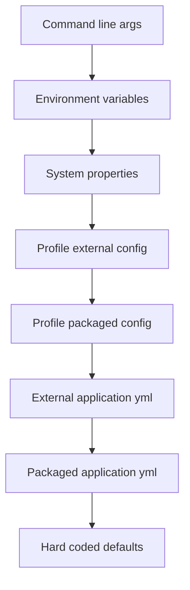
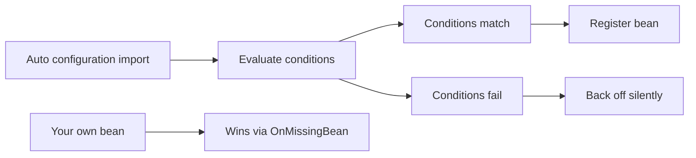

Externalised configuration is what lets one build run in dev, staging and production without recompiling. Spring Boot layers many property sources, binds them to type-safe objects, and switches beans on and off by profile. Getting the precedence order and the binding model right is the difference between a clean deploy and a 2 a.m. "why is it reading the wrong database URL" incident.

## Properties versus YAML

Spring Boot reads configuration from `application.properties` or `application.yml`. YAML expresses nested and list structures naturally, which is why most teams prefer it — but it is whitespace-sensitive and does not support multiple profiles in a single `@PropertySource`.

The two formats are interchangeable in capability; the choice is stylistic. Properties files are flat `key=value` lines that never surprise you with indentation, which some teams prefer for small configs and for values injected by tooling. YAML shines once you have nested structures, lists and maps, because the hierarchy is visible rather than encoded in dotted keys. A common pitfall with YAML is accidentally using tabs (only spaces are allowed) or misaligning a nested block, which silently changes the meaning; a properties file has no such trap.

```yaml
my:
  app:
    timeout: 5s
    retries: 3
    endpoints:
      - https://a.internal
      - https://b.internal
```

```properties
my.app.timeout=5s
my.app.retries=3
```

## Property source precedence

The single most-asked configuration interview question is *"how do I override a property in production without rebuilding?"* The answer is the precedence order: sources higher in the list win. Command-line arguments and environment variables sit near the top, so you override packaged defaults **externally** at deploy time.

| Rank | Source | Typical use |
|---|---|---|
| 1 | Command-line arguments (`--my.app.timeout=10s`) | Ad-hoc overrides |
| 2 | `SPRING_APPLICATION_JSON` | Inline JSON config |
| 3 | OS environment variables | Containers, Kubernetes |
| 4 | Java system properties (`-D`) | JVM-level overrides |
| 5 | Profile-specific external config | Per-env external files |
| 6 | Profile-specific packaged config | `application-prod.yml` in the jar |
| 7 | External `application.yml` | Config beside the jar |
| 8 | Packaged `application.yml` | Baked-in defaults |
| 9 | `@PropertySource` | Extra explicit files |
| 10 | Defaults (`@Value` fallbacks) | Last resort |



> [!KEY]
> To change a value in production you do **not** rebuild. You set an environment variable or pass a command-line arg, both of which outrank the packaged file. This is why the same immutable jar or container image ships to every environment.

### Relaxed binding

Spring Boot maps property names flexibly. An environment variable `MY_APP_TIMEOUT` binds to the property `my.app.timeout`. This "relaxed binding" lets you use uppercase, underscore-delimited names that shells and orchestrators prefer, while your code and YAML use dotted, kebab or camel case.

| Property in code | Valid external forms |
|---|---|
| `my.app.timeout` | `MY_APP_TIMEOUT`, `my.app.timeout`, `my.app.time-out` |

## @Value versus @ConfigurationProperties

`@Value` injects a single property with SpEL support and inline defaults:

```java
@Value("${my.app.timeout:5s}")     // :5s is the fallback if unset
private Duration timeout;
```

It is fine for one or two simple values, but it does not scale. For anything non-trivial, **`@ConfigurationProperties`** wins — it is type-safe, binds to a record or class, supports nesting, lists and maps, integrates JSR-380 validation, and generates IDE metadata for autocompletion.

```java
@ConfigurationProperties(prefix = "my.app")
@Validated
public record AppProps(
    @NotNull Duration timeout,
    @Min(1) int retries,
    List<String> endpoints) {}     // constructor binding on an immutable record
```

```java
@Configuration
@EnableConfigurationProperties(AppProps.class)
public class AppConfig {}
```

Register the properties class with `@EnableConfigurationProperties` (or scan it with `@ConfigurationPropertiesScan`). Constructor binding on a `record` gives you immutable configuration validated at startup.

> [!TIP]
> When an interviewer asks "`@Value` or `@ConfigurationProperties`?", the senior answer is: `@Value` for a one-off SpEL expression, `@ConfigurationProperties` for anything structured — because it is type-safe, validatable, and fails fast at boot with a clear message instead of a runtime `ClassCastException`.

## Profiles

A profile is a named group of beans and config that is active only in certain environments.

```java
@Configuration
@Profile("prod")                   // only registered when prod is active
public class ProdDataSourceConfig { }
```

Activate profiles with `spring.profiles.active=prod`, an environment variable, or a command-line arg. Profile **groups** let one logical profile activate several:

```yaml
spring:
  profiles:
    group:
      prod: [prod-db, prod-cache, metrics]
```

Profile-specific files (`application-prod.yml`) load automatically when their profile is active. In Boot 3 the old nested `spring.profiles.include` is gone in favour of `spring.config.activate.on-profile` inside a document, which controls when that document applies.

> [!WARNING]
> Profile-per-environment (`dev`, `staging`, `prod`) is convenient and common. Profile-per-**feature** (`with-cache`, `no-cache`, `fast-json`) scales badly — the combinations multiply and it becomes impossible to reason about which beans are live. Prefer feature flags or `@ConditionalOnProperty` for feature toggles.

## Externalised config and secrets

In containers you inject configuration through environment variables, Kubernetes **ConfigMaps** for non-secret values, and **Secrets** for sensitive ones. The immutable image never changes; only the environment does.

```yaml
spring:
  datasource:
    url: ${DB_URL}               # supplied by the platform, not baked in
    username: ${DB_USER}
    password: ${DB_PASSWORD}     # from a Secret, never in the repo
```

> [!DANGER]
> Secrets never belong in the repository — not in `application.yml`, not in a committed `.env`, not in a properties file. Once a secret is committed it lives in git history forever. Use a secret manager: HashiCorp **Vault**, **AWS Secrets Manager**, **Azure Key Vault**, Kubernetes **secrets**, or centralised `spring-cloud-config`.

The pattern is always the same: the platform makes the secret available at runtime — as an environment variable, a mounted file, or a value fetched from the manager at startup — and Spring's normal property resolution picks it up through a `${...}` placeholder. Your code never references the secret manager directly, which keeps the application portable across environments and keeps credentials out of both source control and container images. Rotation then becomes an operations concern: update the secret in the manager and restart or refresh, with no code change.

## Conditional beans and auto-configuration

Spring Boot's magic is **conditional bean registration**. Auto-configuration classes ask "is this class on the classpath? is this property set? has the user already defined this bean?" and back off gracefully.

| Condition | Registers the bean when |
|---|---|
| `@ConditionalOnClass` | A given class is on the classpath |
| `@ConditionalOnMissingBean` | You have not already defined one |
| `@ConditionalOnProperty` | A property has a given value |
| `@ConditionalOnBean` | Another bean already exists |

```java
@AutoConfiguration
public class CacheAutoConfiguration {
    @Bean
    @ConditionalOnMissingBean          // yields to a user-defined CacheManager
    @ConditionalOnProperty(name = "app.cache.enabled", havingValue = "true")
    CacheManager cacheManager() { return new CaffeineCacheManager(); }
}
```

In **Spring Boot 3**, auto-configuration classes are no longer listed in `spring.factories`. They live in `META-INF/spring/org.springframework.boot.autoconfigure.AutoConfiguration.imports` and are annotated `@AutoConfiguration`, which also controls ordering. Run the app with `--debug` to print the **conditions report** showing which auto-configurations matched and why. Disable one with `spring.autoconfigure.exclude` or the `exclude` attribute of `@SpringBootApplication`.



### Writing your own starter

A custom starter bundles an `@AutoConfiguration` class listed in the `.imports` file, guarded by `@ConditionalOnClass`/`@ConditionalOnProperty`, plus a `-spring-boot-starter` dependency module that pulls it in. That is how you share cross-cutting configuration (a metrics client, a tenant resolver) across many services without copy-paste.

## Runtime refresh and its limits

`spring-cloud-config` plus `@RefreshScope` can re-read certain properties at runtime without a restart. But it is limited: only `@RefreshScope` beans are rebuilt, already-injected `@Value` primitives do not change, and things bound at startup — connection pools, listeners — usually need a restart. Treat dynamic refresh as suitable for tunables (log levels, feature flags), not for wholesale reconfiguration.

A refresh is triggered by hitting the `/actuator/refresh` endpoint or by a message on a `spring-cloud-bus`, which re-binds the environment and re-creates the `@RefreshScope` beans lazily on their next use. Because those beans are proxied and rebuilt, any state they held is discarded — so a bean that opened resources in `@PostConstruct` will re-run that logic, which can be surprising. The safe mental model is: dynamic refresh is for small, stateless tunables; anything structural or resource-bound should be changed with a rolling restart that brings up new instances with the new configuration and drains the old ones.

## Cheat sheet

- Higher-precedence sources win: CLI args > env vars > system props > profile files > packaged files > defaults.
- Override in production with an **env var or CLI arg** — never rebuild the image.
- Relaxed binding: `MY_APP_TIMEOUT` binds to `my.app.timeout`.
- `@Value` for one-off SpEL and defaults (`${x:default}`); `@ConfigurationProperties` for structured config.
- `@ConfigurationProperties` supports records, nesting, lists/maps, `@Validated`, IDE metadata.
- Register props with `@EnableConfigurationProperties` or `@ConfigurationPropertiesScan`.
- Profiles switch beans per environment; profile-per-feature scales badly.
- Secrets go in Vault, AWS/Azure managers or Kubernetes secrets — never the repo.
- Auto-config is conditional: `@ConditionalOnClass`, `@ConditionalOnMissingBean`, `@ConditionalOnProperty`.
- Boot 3 uses `AutoConfiguration.imports`, not `spring.factories`; `--debug` prints the conditions report.

## Common mistakes

| Mistake | Fix |
|---|---|
| Hardcoding secrets in `application.yml` | Inject from Vault, a secret manager or K8s secrets |
| Rebuilding the jar to change a prod value | Override with an env var or command-line arg |
| Scattering dozens of `@Value` fields | Group them in a `@ConfigurationProperties` record |
| Profile-per-feature explosion | Use `@ConditionalOnProperty` or feature flags |
| Using `spring.factories` in Boot 3 | Use `AutoConfiguration.imports` and `@AutoConfiguration` |
| Expecting `@Value` to update on refresh | Use `@RefreshScope` beans or restart |

## Summary

Spring Boot resolves configuration from a ranked list of sources so an immutable artifact behaves differently per environment: command-line args and environment variables outrank packaged files, which is exactly how you override a production value without rebuilding. Prefer `@ConfigurationProperties` over `@Value` for anything structured because it is type-safe, validatable and binds cleanly to immutable records. Profiles switch beans per environment, but reserve them for environments and use conditions or flags for features. Keep secrets in a proper manager, and understand auto-configuration as conditional bean registration that backs off when you supply your own beans.

## Top Interview Questions

### Q1. How do you override a configuration value in production without rebuilding the artifact?

You rely on the property source precedence order. Packaged `application.yml` sits near the bottom, while command-line arguments, `SPRING_APPLICATION_JSON`, OS environment variables and JVM system properties all rank higher and are applied externally at deploy time. So you ship one immutable jar or container image to every environment and change behaviour by setting, say, `DB_URL` as an environment variable or passing `--server.port=9090` on the command line. This keeps builds reproducible and avoids environment-specific artifacts. In Kubernetes this is exactly what ConfigMaps and Secrets do — they surface as environment variables that outrank the baked-in defaults.

### Q2. When should you use @ConfigurationProperties instead of @Value?

Use `@Value` only for a single, simple property, especially when you need a SpEL expression or an inline default like `${x:5s}`. For anything structured, prefer `@ConfigurationProperties`: it binds a whole prefix to a type-safe class or record, supports nested objects, lists and maps, integrates JSR-380 validation via `@Validated`, and produces IDE metadata for autocompletion. Crucially it fails fast at startup with a clear binding error rather than throwing a runtime cast exception later. A class with a dozen `@Value` fields is a smell — consolidate them into one immutable `@ConfigurationProperties` record and register it with `@EnableConfigurationProperties`.

### Q3. Explain relaxed binding with an example.

Relaxed binding lets a single property be expressed in several external formats, so operational tooling and code can each use their natural convention. The canonical example: the property `my.app.timeout` can be supplied as the environment variable `MY_APP_TIMEOUT` — uppercase with underscores, which is the only form many shells and container platforms accept. Spring also accepts kebab-case (`my.app.time-out`) and camelCase. This matters because you configure containers through uppercase environment variables while your YAML and `@ConfigurationProperties` classes use dotted or kebab names, and Spring reconciles them automatically without you maintaining two spellings.

### Q4. How does Spring Boot auto-configuration actually work?

Auto-configuration is conditional bean registration. Spring Boot ships classes annotated `@AutoConfiguration` that declare beans guarded by conditions: `@ConditionalOnClass` (a library is on the classpath), `@ConditionalOnProperty` (a flag is set), `@ConditionalOnMissingBean` (you have not defined your own), and so on. At startup Spring evaluates these and registers only the beans whose conditions match, backing off silently otherwise — and yielding to any bean you define yourself. In Boot 3 these classes are listed in `META-INF/spring/org.springframework.boot.autoconfigure.AutoConfiguration.imports`, replacing the old `spring.factories` entry. Running with `--debug` prints a conditions report explaining every match and non-match.

### Q5. How are profiles used, and when do they become an anti-pattern?

A profile is a named set of beans and config activated per environment via `spring.profiles.active`. Beans marked `@Profile("prod")` register only when that profile is active, and files like `application-prod.yml` load automatically. Profile groups let one profile activate several. Profiles work well for environments — `dev`, `staging`, `prod`. They become an anti-pattern when used per feature (`with-cache`, `no-cache`), because the combinations multiply and it becomes impossible to reason about which beans are actually live in a given run. For feature toggles use `@ConditionalOnProperty` or a feature-flag system instead, keeping profiles purely environmental.

### Q6. Where should application secrets live, and why not in the repository?

Never in the repository. A committed secret — in `application.yml`, a properties file or a checked-in `.env` — persists in git history forever, so even deleting it later does not remove it, and anyone with repo access or a leaked clone has it. Instead use a dedicated secret manager: HashiCorp Vault, AWS Secrets Manager, Azure Key Vault, Kubernetes secrets, or centralised `spring-cloud-config` with encryption. These provide access control, rotation and auditing. At runtime the platform injects secrets as environment variables or mounted files, which Spring reads through normal property resolution — so the code is unchanged and the image stays free of credentials.

### Q7. What is the property source precedence order, from highest to lowest?

Roughly, highest first: command-line arguments; `SPRING_APPLICATION_JSON` inline JSON; OS environment variables; Java system properties (`-D`); profile-specific external config; profile-specific packaged config; external `application.yml` beside the jar; packaged `application.yml` inside the jar; `@PropertySource` files; and finally hardcoded defaults such as `@Value` fallbacks. The principle to state is that **external, deploy-time sources outrank baked-in ones**, which is what makes a single immutable artifact configurable per environment. You do not need to recite all ten exactly, but you must be able to say env vars and CLI args win over the packaged file.

### Q8. How do you disable or override a specific auto-configuration?

Two levers. To disable one entirely, use `spring.autoconfigure.exclude=com.example.SomeAutoConfiguration` in properties, or the `exclude`/`excludeName` attribute of `@SpringBootApplication`. To override rather than disable, simply define your own bean of the same type: most auto-config beans are guarded by `@ConditionalOnMissingBean`, so yours takes precedence and the framework backs off. To diagnose which auto-configurations are active and why, run with `--debug` to print the conditions report, which lists positive and negative matches. This is the standard way to replace Spring Boot's default `DataSource`, `ObjectMapper` or `CacheManager` with a custom one.

### Q9. What are the limits of refreshing configuration at runtime?

With `spring-cloud-config` and `@RefreshScope`, some beans can re-read properties on a refresh event without a restart, which suits tunables like log levels or feature flags. But it is not universal: only `@RefreshScope`-annotated beans are rebuilt; a plain `@Value` primitive injected at startup keeps its old value; and resources bound at startup — connection pools, Kafka listeners, embedded servers — generally require a restart to pick up changes. So treat runtime refresh as a way to adjust a small set of safe, stateless tunables, not as a mechanism for wholesale reconfiguration. For anything structural, a rolling restart with new environment values is safer and clearer.

### Q10. What changed about auto-configuration registration between Spring Boot 2 and 3?

In Boot 2, auto-configuration classes were listed under the `org.springframework.boot.autoconfigure.EnableAutoConfiguration` key in `META-INF/spring.factories`. Boot 3 moved them to a dedicated file, `META-INF/spring/org.springframework.boot.autoconfigure.AutoConfiguration.imports`, one class per line, and introduced the `@AutoConfiguration` annotation which replaces `@Configuration` for these classes and carries ordering metadata (`before`, `after`). The condition annotations and the back-off behaviour are unchanged. If you are writing a custom starter for Boot 3, you must use the new `.imports` file and `@AutoConfiguration`; the old `spring.factories` entry is deprecated and no longer picked up for auto-configuration.
