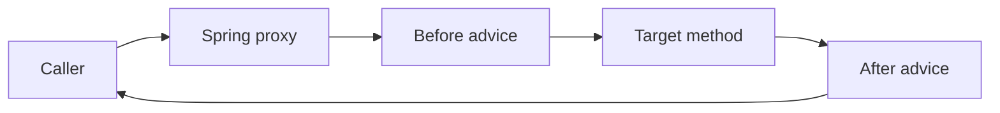
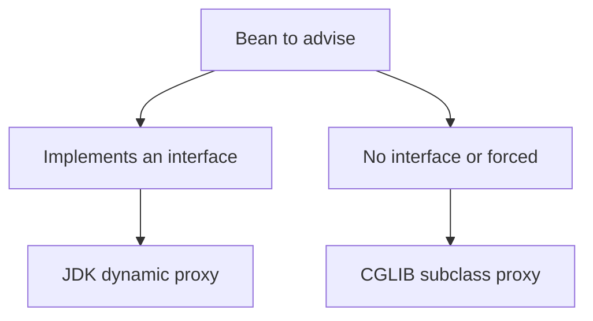

Aspect-Oriented Programming (AOP) lets you factor out cross-cutting concerns — transactions, caching, security, retries, metrics — so they are declared once and applied automatically, rather than copy-pasted into every method. Spring implements AOP with runtime proxies, and understanding that mechanism explains a whole family of "why did my annotation do nothing" bugs that senior interviews love.

## The vocabulary

| Term | Meaning |
|---|---|
| Aspect | A module bundling a cross-cutting concern (e.g. logging) |
| Join point | A point in execution where advice can run — in Spring, a method call |
| Pointcut | An expression selecting which join points match |
| Advice | The code that runs at a matched join point |
| Weaving | Linking aspects to target objects — in Spring, at runtime |
| Target | The real object being advised |
| Introduction | Adding new interfaces/methods to a bean |

A call to an advised bean does not hit the target directly. It passes through a **proxy** that runs the advice around the real method.

The mental model that unlocks everything else is this: Spring does not modify your class. It creates a *second* object — the proxy — that has the same type, wraps your real instance, and intercepts calls. Every injection point receives the proxy, not the raw bean. The proxy consults a chain of matching advice for each method, runs the "before" parts, delegates to your code, then runs the "after" parts. Once you internalise that the proxy is a separate wrapper sitting between caller and target, the self-invocation bug and the visibility limitations below stop being mysterious and become obvious consequences.



## The five advice types

```java
@Aspect
@Component
public class TimingAspect {
    @Around("@annotation(Timed)")           // wraps the call — can measure and rethrow
    public Object time(ProceedingJoinPoint pjp) throws Throwable {
        long start = System.nanoTime();
        try {
            return pjp.proceed();            // invoke the real method
        } finally {
            record(System.nanoTime() - start);
        }
    }
}
```

| Advice | Runs | Can change outcome |
|---|---|---|
| `@Before` | Before the method | No (can throw to abort) |
| `@After` | After, always (finally) | No |
| `@AfterReturning` | After a normal return | Reads the return value |
| `@AfterThrowing` | After an exception | Observes the exception |
| `@Around` | Wraps the call | ✅ Full control |

Use `@Around` when you must control invocation itself — timing, retries, caching, short-circuiting, or altering arguments/return values. It is the only advice that can decide whether and when `proceed()` runs.

## Pointcut expressions

| Designator | Selects |
|---|---|
| `execution(* com.acme.svc.*.*(..))` | Methods matching a signature |
| `within(com.acme.svc..*)` | Any join point inside a package |
| `@annotation(Timed)` | Methods carrying an annotation |
| `bean(orderService)` | Join points on a named bean |

The cleanest real-world pattern is an **annotation-driven aspect**: define a custom annotation, then a pointcut on `@annotation(...)`. It keeps the "where" declarative and readable at the call site.

```java
@Retention(RUNTIME)
@Target(METHOD)
public @interface Timed {}
```

## How Spring actually implements AOP

Spring uses **runtime proxies**, not compile-time weaving. When it creates an advised bean it wraps it in a proxy of one of two kinds:

| Proxy | Used when | How it works |
|---|---|---|
| JDK dynamic proxy | The bean implements an interface | A proxy class implementing that interface |
| CGLIB proxy | No interface (or forced) | A runtime subclass of the target |

Spring Boot **forces CGLIB by default** (`spring.aop.proxy-target-class=true`) so proxies behave consistently whether or not the bean has an interface.



> [!NOTE]
> Because proxies are created at runtime during bean post-processing, AOP only applies to Spring-managed beans. An object you `new` yourself is never advised — its annotations are inert.

## The self-invocation problem

This is the number-one AOP bug. Advice lives on the **proxy**. When a method inside a bean calls another method on the same bean via `this`, the call goes straight to the target and **bypasses the proxy** — so `@Transactional`, `@Cacheable`, `@Async` and `@Retryable` on the inner method silently do nothing.

```java
@Service
public class OrderService {
    public void placeOrder() {
        this.charge();                 // DANGER: bypasses the proxy — no transaction
    }

    @Transactional
    public void charge() { /* expected to run in a transaction, but does not */ }
}
```


> [!DANGER]
> `@Transactional`, `@Cacheable`, `@Async` and `@Retryable` on a method called via `this.method()` from the same class do **nothing**. There is no error — the behaviour just silently vanishes, which makes it a brutal production bug.

Fixes, worst to best:

| Fix | Verdict |
|---|---|
| Inject the bean into itself (`@Lazy` self-reference) | Works, awkward |
| `AopContext.currentProxy()` | Works, couples code to AOP |
| **Extract the advised method to a second bean** | ✅ The right answer |

Extracting `charge()` into its own `@Service` means the call crosses a real bean boundary, so it goes through that bean's proxy and the advice fires.

## What cannot be advised

| Limitation | Why |
|---|---|
| `private` methods | Not visible to a subclass proxy |
| `static` methods | Not bound to an instance the proxy wraps |
| `final` methods | CGLIB cannot override them |
| `final` classes | CGLIB cannot subclass them |

> [!WARNING]
> A `final` class breaks CGLIB proxying because CGLIB works by generating a subclass. If you annotate a method on a `final` class with `@Transactional` and there is no interface, proxy creation fails or the advice is skipped. Keep advised beans non-final with non-final, non-private, non-static advised methods.

There is also an ordering subtlety: `@PostConstruct` runs on the target during initialisation, and the proxy is created just afterward in `postProcessAfterInitialization` — so advice does not apply to code running *inside* `@PostConstruct`.

## Cost and what AOP is for

Each advised call adds a proxy hop and, for `@Around`, a `ProceedingJoinPoint`. The cost is a small, roughly constant per-call overhead — negligible for I/O-bound service methods, but worth noticing on a hot method called millions of times in a tight loop.

In practice the proxy overhead is dwarfed by any database round-trip, network call or disk read, so for the service-layer methods where AOP is normally applied it is effectively free. The time to be careful is when you are tempted to advise a tiny, CPU-bound method invoked in a hot loop — there the fixed per-call cost can dominate. The pragmatic guidance is to apply aspects at coarse boundaries (a request handler, a transactional unit of work) rather than on the innermost arithmetic helpers.

| Good uses | Poor uses |
|---|---|
| Transactions, caching, security | Core business logic |
| Retries, metrics, audit logging | Control flow the reader must follow |
| Tenant/context propagation | Anything that surprises the maintainer |

> [!TIP]
> The senior line: "AOP is for cross-cutting infrastructure, not business logic. If a reader has to know an aspect exists to understand what a method does, the logic is hidden in the wrong place."

## `@Async` and its pitfalls

`@Async` is AOP too — it proxies the method to run on a separate thread — and it has sharp edges.

```java
@Configuration
@EnableAsync                                   // required, or @Async is ignored
public class AsyncConfig {
    @Bean
    public Executor taskExecutor() {           // supply your own pool
        var ex = new ThreadPoolTaskExecutor();
        ex.setCorePoolSize(8);
        ex.setQueueCapacity(100);
        ex.initialize();
        return ex;
    }
}
```

- It needs `@EnableAsync`, or the annotation does nothing.
- The method must return `void` or `CompletableFuture<T>` — a plain value is computed synchronously.
- A `void` async method's exception vanishes unless you register an `AsyncUncaughtExceptionHandler`.
- Provide your own `Executor`; the default `SimpleAsyncTaskExecutor` creates a **new thread per call** and does not pool, which will exhaust the machine under load.
- Spring Boot 3.2+ can back `@Async` with **virtual threads**, giving cheap per-task threads on Java 21.

## Transactions as the canonical example

`@Transactional` is the textbook AOP use: the proxy opens a transaction before the method, commits on success, rolls back on a runtime exception, and — subject to self-invocation and visibility rules — this is all done by advice. The mechanics of propagation and isolation are a separate topic; here it simply illustrates how declarative advice replaces boilerplate.

## AspectJ weaving as the alternative

AspectJ can weave aspects at **compile time** or **load time** instead of using runtime proxies. Because it modifies the bytecode directly, it can advise `private`, `static` and `final` methods and self-invocations that Spring proxies cannot. The cost is a more complex build (a weaver or agent) and less transparency. It is worth it only when you genuinely need to advise things proxies cannot reach — otherwise Spring's proxy AOP is simpler and sufficient.

## Cheat sheet

- Aspect, join point, pointcut, advice, weaving, target — learn the vocabulary cold.
- Spring AOP uses **runtime proxies**: JDK dynamic (interface) or CGLIB (subclass).
- Spring Boot forces CGLIB by default (`proxy-target-class=true`).
- `@Around` is the only advice that controls whether `proceed()` runs.
- Self-invocation via `this.method()` bypasses the proxy — advice silently does nothing.
- The right fix for self-invocation is to **extract the method to another bean**.
- `private`, `static`, `final` methods and `final` classes cannot be proxied.
- Only Spring-managed beans are advised; `new` objects are not.
- Annotation-driven pointcuts (`@annotation`) are the cleanest real pattern.
- `@Async` needs `@EnableAsync`, a real `Executor`, and an exception handler.

## Common mistakes

| Mistake | Fix |
|---|---|
| `@Transactional` on a `this.method()` call | Extract the method to a separate bean |
| `@Async` without `@EnableAsync` | Add `@EnableAsync` to a config class |
| Relying on the default async executor | Configure a `ThreadPoolTaskExecutor` |
| `@Cacheable` on a `private` method | Make it `public` on a proxied bean |
| Annotating a method on a `final` class | Remove `final` so CGLIB can subclass |
| Swallowed async exceptions | Register an `AsyncUncaughtExceptionHandler` |

## Summary

Spring AOP applies cross-cutting concerns by wrapping beans in runtime proxies — JDK dynamic proxies for interfaces, CGLIB subclasses otherwise, with CGLIB forced by default in Spring Boot. Advice runs on the proxy, which is why a self-invocation through `this` bypasses it and silently disables `@Transactional`, `@Cacheable`, `@Async` and `@Retryable`; the correct fix is to move the advised method into a separate bean. Proxies cannot advise `private`, `static` or `final` methods, and a `final` class breaks CGLIB. Use AOP for infrastructure — transactions, caching, security, retries, metrics — never for business logic, and reach for AspectJ weaving only when you must advise what proxies cannot.

## Top Interview Questions

### Q1. How does Spring implement AOP under the hood?

Spring uses **runtime proxies**, not compile-time or load-time weaving. When it creates an advised bean, a `BeanPostProcessor` wraps it in a proxy during initialisation. If the bean implements an interface, Spring can create a JDK dynamic proxy implementing that interface; otherwise, or when forced, it creates a CGLIB proxy that subclasses the target. Spring Boot sets `spring.aop.proxy-target-class=true`, forcing CGLIB by default for consistent behaviour. The proxy intercepts each method call, runs the matching advice around it, and delegates to the real target. The key consequence is that only Spring-managed beans are advised, and calls that do not go through the proxy are not intercepted.

### Q2. What is the self-invocation problem and how do you fix it?

Advice lives on the proxy, not the target object. When one method in a bean calls another method on the same bean via `this`, the call goes directly to the raw target and skips the proxy — so annotations like `@Transactional`, `@Cacheable`, `@Async` or `@Retryable` on the inner method do nothing, with no error. The clean fix is to **extract the advised method into a separate bean** so the call crosses a real bean boundary and passes through that bean's proxy. Alternatives — injecting the bean into itself or using `AopContext.currentProxy()` — work but couple code to AOP and are considered inferior. This is one of the most common Spring production bugs.

### Q3. When must you use @Around rather than the other advice types?

Use `@Around` whenever you need to control the invocation itself. It is the only advice that receives a `ProceedingJoinPoint` and decides whether, when and how many times to call `proceed()`, and it can modify arguments, replace the return value, or swallow and translate exceptions. That makes it mandatory for caching (return a cached value without invoking the method), retries (call `proceed()` again on failure), timing that must wrap the whole call, and circuit-breaking. The simpler advices — `@Before`, `@After`, `@AfterReturning`, `@AfterThrowing` — can only observe or react around a call they cannot control, so they suit logging or metrics where you do not need to alter execution.

### Q4. What kinds of methods and classes cannot be advised by Spring AOP, and why?

Because Spring proxies work by implementing an interface or subclassing the target, certain members are unreachable. `private` methods cannot be advised — a subclass proxy cannot see or override them. `static` methods are not bound to the proxied instance. `final` methods cannot be overridden by CGLIB, and a `final` class cannot be subclassed at all, so CGLIB proxying fails. Methods called via self-invocation also escape advice. The practical rule: make advised beans non-final, and advised methods `public` (or at least non-private), non-static and non-final. If you genuinely must advise such members, you need AspectJ weaving instead of Spring proxies.

### Q5. JDK dynamic proxies versus CGLIB — what is the difference and which does Spring Boot use?

A JDK dynamic proxy is a runtime class that implements the target's **interfaces**; the injected type must be the interface, and only interface methods are advised. A CGLIB proxy is a runtime **subclass** of the target class, so it works without any interface and can proxy the concrete type — but it cannot override `final` methods or subclass `final` classes, and it invokes the target through the generated subclass. Spring Boot forces CGLIB by default (`proxy-target-class=true`) so proxy behaviour is uniform whether or not a bean has an interface, avoiding surprises where injecting by concrete class fails under JDK proxies. You can switch back to interface-based proxies if required.

### Q6. What is @Async actually doing, and what are its main pitfalls?

`@Async` is AOP: the proxy submits the method to an `Executor` so it runs on another thread and returns immediately. Pitfalls: it requires `@EnableAsync` or it is ignored; the method must return `void` or `CompletableFuture<T>`, otherwise the caller blocks synchronously; exceptions from a `void` async method are lost unless you register an `AsyncUncaughtExceptionHandler`; and it is subject to the self-invocation rule. Critically, the default `SimpleAsyncTaskExecutor` spawns a new thread per call with no pooling, which exhausts resources under load — always configure a `ThreadPoolTaskExecutor`. On Java 21 with Spring Boot 3.2+, you can back it with virtual threads for cheap per-task concurrency.

### Q7. What should and should not be implemented with AOP?

AOP is for **cross-cutting infrastructure** that is orthogonal to business meaning: declarative transactions, caching, method-level security, retries, metrics and timing, audit logging, and propagating tenant or trace context. These benefit from being declared once and applied consistently. AOP should **not** hide business logic or control flow — if understanding what a method does requires knowing an invisible aspect exists, the logic is in the wrong place and the code becomes hard to read and debug. The senior framing is that aspects should be things a reader can safely ignore when reasoning about correctness of the business rule; anything essential to the outcome belongs in explicit code.

### Q8. A developer added @Cacheable but the method still runs every time. How do you debug it?

Work through the proxy assumptions. First, is the call coming from outside the bean, or is it a self-invocation via `this.method()`? If internal, the proxy is bypassed — extract the method to another bean. Second, is the method `public`? Proxy-based caching ignores `private` and `static` methods. Third, is the class or method `final`, breaking CGLIB? Fourth, is caching actually enabled (`@EnableCaching`) and is a `CacheManager` configured? Fifth, is the object a Spring bean at all, or was it created with `new`? Finally, check the key — different arguments produce different keys, so it may be caching correctly but never hitting. Most real cases are self-invocation or a missing `@EnableCaching`.

### Q9. When is AspectJ weaving worth the extra complexity over Spring proxies?

Spring's proxy AOP is simpler and covers the common cases, but it cannot advise `private`, `static` or `final` methods, cannot advise `final` classes, and misses self-invocations. AspectJ weaves aspects directly into bytecode at compile time or load time, so it can intercept all of those and does not depend on beans going through a proxy. It is worth adopting when you genuinely need that reach — for example, deep instrumentation, domain objects that are not Spring beans, or advising internal calls. The cost is a more complex build: a compile-time weaver or a load-time weaving agent, plus reduced transparency. If proxy AOP meets your needs, stay with it; escalate to AspectJ only for the cases it cannot handle.

### Q10. Why does the injected object's type sometimes matter, and how does the proxy relate to bean lifecycle?

The object other beans receive is usually the **proxy**, created by a `BeanPostProcessor` during `postProcessAfterInitialization` — after the target's `@PostConstruct` has already run on the raw instance. That timing means advice does not wrap code executed inside `@PostConstruct`. It also means that under JDK dynamic proxies you must inject by interface, because the proxy is not an instance of the concrete class; CGLIB avoids this by subclassing, which is one reason Spring Boot forces it. Understanding that the proxy is a distinct object woven in late explains both the self-invocation bug and why casting a proxy to its concrete implementation can fail.
