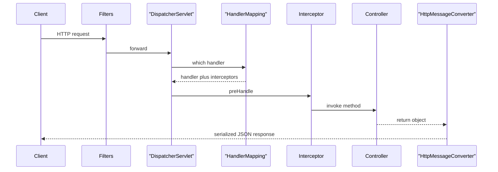

Spring MVC is the servlet-based web framework underneath every `@RestController` you write. Interviewers probe whether you understand the request lifecycle, why you return DTOs instead of entities, which status code to use, and how the thread model behaves under load. This page covers all of that for Spring Boot 3.x on Java 17+ with the `jakarta.*` namespace.

## The request lifecycle

Every HTTP request hits the embedded Tomcat servlet container, passes through any servlet **filters**, then reaches the `DispatcherServlet` — the single *front controller* that orchestrates everything. It asks a `HandlerMapping` which controller method handles the URL, wraps it in a `HandlerAdapter`, runs the `HandlerInterceptor` chain, invokes your method, and converts the return value to the response body with an `HttpMessageConverter`.



Filters wrap the entire dispatch and see raw requests even for unmapped URLs; interceptors run *inside* the dispatch and only for mapped handlers. That distinction is a common interview question — put cross-cutting servlet concerns like security and request logging in a filter, and handler-aware logic like tenant resolution in an interceptor. A `HandlerInterceptor` also has three hooks: `preHandle` runs before the controller, `postHandle` after it but before rendering, and `afterCompletion` after the response is written, which is where you stop a timer or clean up thread-bound state. Knowing that the interceptor chain short-circuits when any `preHandle` returns `false` is a detail that shows you have actually used them.

## Controllers and mapping annotations

`@Controller` returns view names by default; `@RestController` is `@Controller` plus `@ResponseBody`, so every method return value is serialized straight to the response body. For APIs, always use `@RestController`.

```java
@RestController
@RequestMapping("/api/orders")
class OrderController {

  @GetMapping(value = "/{id}", produces = MediaType.APPLICATION_JSON_VALUE)
  OrderDto get(@PathVariable long id) {
    return service.find(id);
  }

  @PostMapping(consumes = MediaType.APPLICATION_JSON_VALUE)
  ResponseEntity<OrderDto> create(@RequestBody @Valid CreateOrder cmd) {
    OrderDto saved = service.create(cmd);
    URI location = URI.create("/api/orders/" + saved.id()); // used for 201 Location header
    return ResponseEntity.created(location).body(saved);
  }
}
```

`@GetMapping`, `@PostMapping`, `@PutMapping`, `@DeleteMapping` and `@PatchMapping` are shortcuts for `@RequestMapping(method = ...)`. `produces` restricts which `Accept` values match; `consumes` restricts which `Content-Type` the method accepts. `@Valid` triggers request-body validation — covered in depth on the validation page, so treat it as a pointer here.

## Binding annotations

Spring resolves method arguments from different parts of the request. Know the defaults cold.

| Annotation | Source | Required by default | Default value support |
|---|---|---|---|
| `@PathVariable` | URI template segment | Yes | `required = false` allowed |
| `@RequestParam` | query string or form field | Yes | `defaultValue` supported |
| `@RequestBody` | request body via converter | Yes | one per method |
| `@RequestHeader` | HTTP header | Yes | `defaultValue` supported |
| `@CookieValue` | cookie | Yes | `defaultValue` supported |
| `@ModelAttribute` | form or query bound to object | No | binds field by field |
| `@RequestPart` | one part of a multipart request | Yes | pairs with file upload |

> [!WARNING]
> `@RequestParam` and `@PathVariable` are `required = true` by default, so a missing value returns 400, not `null`. Wrap optional params in `Optional<T>`, set `required = false`, or give a `defaultValue`.

## Content negotiation and Jackson

Spring picks a converter using the `Accept` header. For JSON that is `MappingJackson2HttpMessageConverter` backed by Jackson. Boot auto-registers the `JavaTimeModule` so `java.time` types serialize as ISO-8601 strings instead of numeric timestamps.

```java
public record OrderDto(
    long id,
    @JsonProperty("customer") String customerName,   // rename the JSON field
    @JsonInclude(JsonInclude.Include.NON_NULL) String note,  // drop when null
    @JsonIgnore String internalRef,                  // never serialize
    OffsetDateTime createdAt) {}
```

Return a **DTO or record, never a JPA entity**. Serializing an entity walks lazy associations, which either throws a `LazyInitializationException` or triggers surprise N+1 queries; it also over-exposes internal columns and couples your API contract to your database schema. A record DTO gives you a stable, intentional contract. Records are especially good fits here because they are immutable, generate `equals`/`hashCode` and a compact constructor, and Jackson deserializes them through that canonical constructor — so a request DTO can be a one-line record with validation annotations on its components. Map between entity and DTO explicitly, either by hand for a small surface or with a mapper like MapStruct when the object graph is large.

## ResponseEntity and correct status codes

`ResponseEntity` gives explicit control over status, headers and body. REST reviewers care that you pick the right code.

| Situation | Status | Notes |
|---|---|---|
| Created a resource | `201 Created` | include a `Location` header |
| Success with no body | `204 No Content` | deletes, some updates |
| Malformed or unparseable input | `400 Bad Request` | syntax level |
| Well-formed but semantically invalid | `422 Unprocessable Entity` | failed business rules |
| Resource does not exist | `404 Not Found` | |
| State conflict such as duplicate | `409 Conflict` | optimistic-lock clashes |
| Client exceeded rate limit | `429 Too Many Requests` | add `Retry-After` |

> [!TIP]
> Naming the 400-versus-422 split — 400 for "I cannot parse this" and 422 for "I parsed it but it breaks a rule" — is a small detail that signals API maturity.

## Filters, interceptors and controller advice

Three extension points, three jobs. Choose deliberately.

| Mechanism | Runs where | Use for |
|---|---|---|
| Servlet `Filter` | outside dispatch, all requests | auth, CORS, gzip, MDC correlation id |
| `HandlerInterceptor` | inside dispatch, mapped handlers | tenant resolution, per-handler timing |
| `@ControllerAdvice` | during handler invocation | global exception handling, model binding |

CORS can be enabled per method with `@CrossOrigin` or globally with a `WebMvcConfigurer`.

```java
@Configuration
class CorsConfig implements WebMvcConfigurer {
  @Override public void addCorsMappings(CorsRegistry registry) {
    registry.addMapping("/api/**")
        .allowedOrigins("https://app.example.com")
        .allowedMethods("GET", "POST", "PUT", "DELETE");
  }
}
```

## Outbound calls

For calling other services, Spring Boot 3.2 introduced the synchronous `RestClient` with a fluent API. `WebClient` is the reactive, non-blocking client. `RestTemplate` still works but is in **maintenance mode** — no new features — so choose `RestClient` for new blocking code.

```java
RestClient client = RestClient.create();
OrderDto order = client.get()
    .uri("https://svc/orders/{id}", id)
    .retrieve()
    .body(OrderDto.class);
```

## The thread model and virtual threads

Spring MVC on Tomcat is **thread-per-request**: each request occupies one platform thread for its whole lifetime, including time spent blocked on I/O. The pool is capped by `server.tomcat.threads.max` (default 200). When every thread is busy, new connections queue in the accept queue and latency spikes; if the queue fills, clients get connection failures. A service that mostly waits on slow downstreams is thread-bound long before it is CPU-bound.

```yaml
server:
  tomcat:
    threads:
      max: 200          # platform threads cap on classic MVC
spring:
  threads:
    virtual:
      enabled: true     # Boot 3.2+ runs each request on a virtual thread
```

> [!KEY]
> With `spring.threads.virtual.enabled=true` on Java 21, each request runs on a cheap virtual thread that unmounts from its carrier while blocked. A blocking call no longer pins a scarce platform thread, so the `threads.max` sizing conversation largely disappears for I/O-bound work.

## Async and streaming returns

To free the container thread before the response is ready, return an async type. `Callable<T>` runs the body on a task executor; `DeferredResult<T>` lets another thread complete it later; `SseEmitter` streams server-sent events; `StreamingResponseBody` streams raw bytes.

```java
@GetMapping("/stream")
SseEmitter stream() {
  SseEmitter emitter = new SseEmitter();
  executor.execute(() -> pushEvents(emitter)); // container thread is released immediately
  return emitter;
}
```

File upload uses `MultipartFile` with `@RequestPart` or `@RequestParam`. For API versioning, common options are a URI prefix (`/api/v1`), a custom header, or an `Accept` media-type parameter; pick one and apply it consistently. URI versioning is the most visible and cache-friendly and is the usual default; media-type versioning is the most RESTful but harder for clients to use. Whatever you choose, version the *contract*, not every internal change — additive, backward-compatible fields should not force a new version, and a senior answer stresses that the cheapest version bump is the one you avoid by designing tolerant clients.

## Cheat sheet

- `DispatcherServlet` is the front controller; `HandlerMapping` selects, `HandlerAdapter` invokes, `HttpMessageConverter` serializes.
- Filters wrap the whole dispatch; interceptors run only for mapped handlers.
- `@RestController` = `@Controller` + `@ResponseBody`.
- Return DTOs or records, never JPA entities, to avoid lazy-loading blowups and over-exposure.
- `@PathVariable` and `@RequestParam` are required by default.
- Use `201 + Location` for creates, `204` for empty success, `422` for valid-but-rejected input.
- `RestClient` for new blocking calls; `RestTemplate` is maintenance-only.
- MVC is thread-per-request; `spring.threads.virtual.enabled=true` changes the sizing math.

## Common mistakes

| Mistake | Fix |
|---|---|
| Returning JPA entities from controllers | Map to a DTO or record with an explicit contract |
| Using `200` for every response | Use `201`, `204`, `404`, `409` as appropriate |
| Assuming `@RequestParam` is optional | Set `required = false`, `defaultValue`, or use `Optional` |
| Putting handler-aware logic in a filter | Use a `HandlerInterceptor` instead |
| New code on `RestTemplate` | Prefer `RestClient` or `WebClient` |
| Serializing `java.time` as numbers | Keep the auto-registered `JavaTimeModule` for ISO strings |

## Summary

Spring MVC routes every request through `DispatcherServlet`, which delegates to a handler, runs interceptors, and serializes the result with a message converter, while filters wrap the whole thing. For clean REST APIs you return DTOs or records, choose precise status codes, and use `ResponseEntity` when you need explicit control. The classic model is thread-per-request on Tomcat, but Boot 3.2 virtual threads remove most of the pool-sizing pain for I/O-bound services. Knowing where filters, interceptors and controller advice each belong is what separates a rote answer from a senior one.

## Top Interview Questions

### Q1. What does DispatcherServlet actually do?

It is the front controller for Spring MVC — a single servlet that receives every mapped request and orchestrates the rest. It consults a `HandlerMapping` to find the controller method for the URL, wraps it in a `HandlerAdapter` to invoke it, runs the `HandlerInterceptor` chain around the call, resolves method arguments and validates them, then takes the return value and uses an `HttpMessageConverter` to serialize it into the response. It also delegates exceptions to `HandlerExceptionResolver` chains. In short, it turns the raw servlet request into a controller invocation and turns the controller result back into an HTTP response, centralizing concerns that would otherwise be scattered across every endpoint.

### Q2. What is the difference between a filter and a HandlerInterceptor?

A servlet `Filter` is part of the servlet spec and runs *outside* the `DispatcherServlet`, so it sees every request including ones that never match a handler, and it can wrap or replace the request and response streams. A `HandlerInterceptor` is a Spring concept that runs *inside* the dispatch, only for requests that resolve to a handler, and it has access to the chosen handler object. Use a filter for low-level cross-cutting concerns like authentication, CORS, compression or setting an MDC correlation id. Use an interceptor when you need the resolved handler, such as per-handler timing or tenant resolution. Filters run first and last around the entire dispatch.

### Q3. Why should you return a DTO or record instead of a JPA entity?

Three reasons. First, serializing an entity walks its lazy associations; outside a transaction this throws `LazyInitializationException`, and inside one it silently fires N+1 queries. Second, an entity exposes every column, including internal fields you never meant to publish, which is an over-exposure risk. Third, returning entities couples your public API contract to your database schema, so a column rename becomes a breaking API change. A record DTO gives an explicit, stable contract, lets you rename or hide fields with Jackson annotations, and keeps persistence and presentation concerns separate. It is a near-universal recommendation in senior code review.

### Q4. When do you return 400 versus 422?

Use `400 Bad Request` when the request is malformed at the syntax level — unparseable JSON, a wrong content type, or a missing required parameter. Use `422 Unprocessable Entity` when the request is syntactically valid and you understood it, but it violates a business or semantic rule, for example an end date before a start date or an amount that exceeds a limit. The distinction says "I could not read it" versus "I read it and it breaks a rule." Some teams collapse everything into 400 for simplicity, which is defensible, but being able to articulate the 422 case shows API maturity.

### Q5. How does content negotiation work in Spring MVC?

Spring inspects the request's `Accept` header (and optionally a path extension or a `format` query parameter, though extensions are discouraged now) and matches it against the `produces` clauses of candidate handler methods and the registered `HttpMessageConverter` list. For `Accept: application/json` it selects the Jackson converter to serialize the return value. `consumes` does the mirror image for the request body based on `Content-Type`. Boot auto-configures converters, including registering the `JavaTimeModule` so `java.time` values serialize as ISO-8601. If no converter can satisfy the `Accept` header, the client gets `406 Not Acceptable`.

### Q6. Your endpoint throws LazyInitializationException only in production. Why?

The controller is returning a JPA entity that has a lazily loaded association. Serialization happens after the transaction and its persistence context have closed, so when Jackson touches the lazy field there is no open session to load it and it throws. It may not reproduce locally if you run with an open-session-in-view filter or eager fetching in tests. The correct fix is to map the entity to a DTO inside the transaction, fetching exactly the data you need, and serialize the DTO. Relying on open-session-in-view masks the problem and reintroduces N+1 queries during serialization, so avoid it in favor of explicit DTO projection.

### Q7. What happens when the Tomcat thread pool is exhausted?

In classic thread-per-request MVC, each in-flight request holds one platform thread until it completes, including time blocked on I/O. Once all `server.tomcat.threads.max` threads (default 200) are busy, new connections wait in Tomcat's accept queue rather than being processed. Latency climbs as the queue grows, and if the queue's capacity is exceeded, clients receive connection resets or timeouts. The service is effectively throughput-capped by the pool even though CPU may be nearly idle, because the bottleneck is threads blocked on downstreams. Remedies are a larger pool, faster downstreams, async returns, or enabling virtual threads.

### Q8. How do virtual threads change the picture for Spring MVC?

Setting `spring.threads.virtual.enabled=true` on Java 21 with Boot 3.2+ runs each request on a virtual thread instead of a pooled platform thread. A virtual thread costs kilobytes and unmounts from its carrier platform thread whenever it blocks on I/O, so blocking a virtual thread no longer consumes a scarce OS thread. This means you can have hundreds of thousands of concurrent in-flight requests waiting on slow downstreams without exhausting a 200-thread pool, largely eliminating the pool-sizing exercise for I/O-bound work. The programming model stays the simple blocking style. The main caveat is avoiding `synchronized` blocks around blocking calls, which can pin the carrier thread.

### Q9. When would you use ResponseEntity instead of returning the body directly?

Return the body directly when the default `200 OK` and content negotiation are exactly what you want — it is cleaner. Reach for `ResponseEntity` when you need explicit control: setting `201 Created` with a `Location` header after a create, returning `204 No Content` with no body, adding a `Retry-After` header for `429`, conditionally returning `304 Not Modified` with `ETag`, or choosing the status at runtime. `ResponseEntity.created(uri).body(dto)` is the idiomatic create response. It keeps the status, headers and body decisions in one expressive, testable place instead of relying on annotations plus side effects.

### Q10. How do async controller return types help throughput?

Returning `Callable`, `DeferredResult`, `SseEmitter` or `StreamingResponseBody` releases the container thread as soon as the method returns, before the response is ready. With `Callable`, Spring runs your logic on a separate task executor and the servlet container thread goes back to serving other requests. `DeferredResult` lets an entirely different thread — say a message listener or a future's callback — complete the response later. `SseEmitter` and `StreamingResponseBody` stream data incrementally. This decouples the number of in-flight requests from the size of the container thread pool, which matters most on the classic platform-thread model; with virtual threads the benefit is smaller but streaming types are still the right tool for server-sent events and large downloads.
