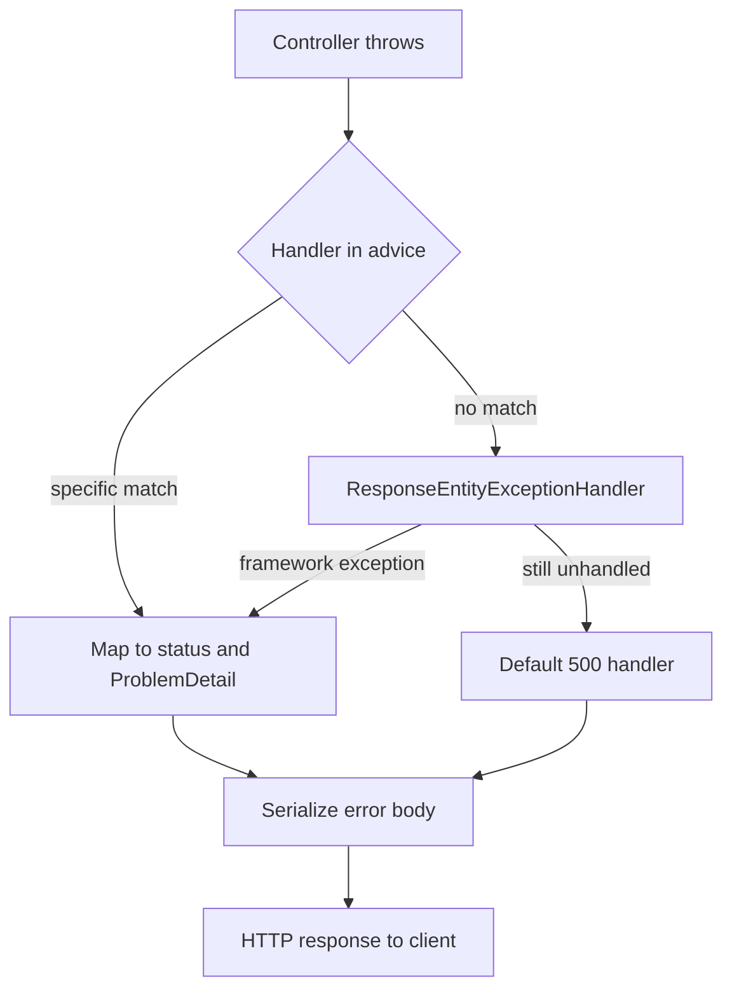

Validation and error handling are where APIs either look professional or leak internals. Interviewers ask about the difference between `@Valid` and `@Validated`, how to centralize error mapping, and how to return a consistent, machine-readable error body. This page targets Jakarta Bean Validation and Spring Boot 3.x, where RFC 7807 `ProblemDetail` is first-class. The recurring theme is *push validation to the edge and mapping to one place*: validate input as it arrives, translate every failure into one predictable contract, and never let an internal exception escape unshaped.

## Jakarta Bean Validation basics

Bean Validation is a declarative standard: you annotate fields with constraints and a `Validator` checks them, so the rules live next to the data instead of scattered across `if` statements. Spring Boot pulls in the Hibernate Validator implementation through `spring-boot-starter-validation`. Constraints live in `jakarta.validation.constraints` — note the `jakarta` namespace, since Boot 3 migrated off `javax`. Put them on DTO fields or records and Spring enforces them when you annotate the argument.

```java
public record CreateUser(
    @NotBlank String name,               // not null and not only whitespace
    @Email String email,
    @Size(min = 8, max = 64) String password,
    @Min(18) @Max(120) int age,
    @Positive BigDecimal creditLimit,
    @Pattern(regexp = "\\+?[0-9]{7,15}") String phone,
    @Past LocalDate birthDate,
    @Future LocalDate expiresOn,
    @Valid Address address) {}           // cascade into the nested object
```

The three "emptiness" constraints trip up candidates, so state the difference precisely.

| Constraint | Applies to | Rejects null | Rejects empty | Rejects blank |
|---|---|---|---|---|
| `@NotNull` | any type | ✅ | ❌ | ❌ |
| `@NotEmpty` | String, Collection, Map, array | ✅ | ✅ | ❌ |
| `@NotBlank` | String only | ✅ | ✅ | ✅ (whitespace-only) |

`@Valid` **cascades**: annotate a nested object or a collection element type and its constraints are validated too. Without the cascade, nested constraints are silently ignored. Constraint messages support interpolation with `{}` placeholders and can be externalized to a `ValidationMessages.properties` bundle, which is how you localize error text and keep wording consistent across endpoints rather than hard-coding a string on every annotation.

## @Valid versus @Validated

This is the distinction interviewers love. They trigger different code paths and different exceptions, and mishandling the split is the single most common validation bug in Spring apps. `@Valid` is the standard annotation that Spring's argument resolver honors when binding a `@RequestBody`; `@Validated` is Spring's own annotation for validation groups and, on service classes, method-level validation through a proxy. In modern Spring MVC (Framework 6.1+), controller method-parameter validation is handled by MVC itself and raises `HandlerMethodValidationException`; service-layer method validation still typically raises `ConstraintViolationException`.

| Aspect | `@Valid` on `@RequestBody` | `@Validated` on the class + params |
|---|---|---|
| Source | `jakarta.validation` | Spring's `@Validated` |
| Triggers | body binding validation | method-level validation via proxy |
| Exception | `MethodArgumentNotValidException` | `HandlerMethodValidationException` for MVC controllers; `ConstraintViolationException` for proxied service methods |
| Supports groups | no | yes |
| Typical use | request DTOs | `@RequestParam`/`@PathVariable`, service methods |

```java
@RestController
@Validated                                  // enables method-level validation
class UserController {
  @PostMapping("/users")
  UserDto create(@RequestBody @Valid CreateUser cmd) { ... }   // MethodArgumentNotValidException

  @GetMapping("/users")
  List<UserDto> list(@RequestParam @Min(1) int page) { ... }   // parameter-validation exception
}
```

> [!WARNING]
> `@Valid` on a `@RequestBody` gives `MethodArgumentNotValidException` with `BindingResult` field errors. Constraints on controller method parameters give `HandlerMethodValidationException` on Spring MVC 6.1+ (older or proxied method-validation paths may give `ConstraintViolationException`). Your global handler must cover all of these or one class of validation errors will fall through as a raw 500.

## Validation groups and custom validators

Groups let one DTO enforce different rules for create versus update. Define marker interfaces and select them with `@Validated`.

```java
interface OnCreate {}
interface OnUpdate {}

public record SaveUser(
    @Null(groups = OnCreate.class) @NotNull(groups = OnUpdate.class) Long id,
    @NotBlank String name) {}

@PostMapping("/users")
UserDto create(@RequestBody @Validated(OnCreate.class) SaveUser cmd) { ... }
```

A custom constraint pairs an annotation with a `ConstraintValidator`. Use one when a rule cannot be expressed with the built-in constraints — a checksum, a cross-field invariant, or a lookup against an enum of allowed values. The annotation carries the standard `message`, `groups` and `payload` members that Bean Validation requires; the validator holds the logic. You can even inject Spring beans into a `ConstraintValidator`, because Hibernate Validator resolves it through the Spring context, which lets a validator call a repository — though do that sparingly, since hitting the database during binding couples validation to I/O.

```java
@Constraint(validatedBy = SkuValidator.class)
@Target(ElementType.FIELD) @Retention(RetentionPolicy.RUNTIME)
public @interface ValidSku {
  String message() default "invalid SKU";
  Class<?>[] groups() default {};
  Class<? extends Payload>[] payload() default {};
}

class SkuValidator implements ConstraintValidator<ValidSku, String> {
  public boolean isValid(String value, ConstraintValidatorContext ctx) {
    return value != null && value.matches("[A-Z]{3}-[0-9]{4}");
  }
}
```

## Global exception handling

Do not scatter try/catch across controllers. Centralize in one `@RestControllerAdvice` with `@ExceptionHandler` methods. Spring resolves the *most specific* handler for the thrown type by walking the exception's class hierarchy, so a handler for `OrderNotFound` wins over one for `RuntimeException`; when two handlers are equally specific the result is undefined, so avoid overlapping mappings. Extending `ResponseEntityExceptionHandler` lets you override how Spring's own exceptions — like `MethodArgumentNotValidException`, `HttpMessageNotReadableException` for unparseable JSON, or `HttpMediaTypeNotSupportedException` — are rendered, so even framework-level failures match your contract instead of the default Boot error page.



```java
@RestControllerAdvice
class ApiExceptionHandler extends ResponseEntityExceptionHandler {

  @ExceptionHandler(OrderNotFound.class)
  ProblemDetail notFound(OrderNotFound ex) {
    ProblemDetail pd = ProblemDetail.forStatusAndDetail(HttpStatus.NOT_FOUND, ex.getMessage());
    pd.setProperty("code", "ORDER_NOT_FOUND");            // machine-readable code
    pd.setProperty("correlationId", MDC.get("correlationId"));
    return pd;
  }
}
```

## RFC 7807 ProblemDetail

Spring 6 / Boot 3 ship `ProblemDetail`, the RFC 7807 `application/problem+json` model with `type`, `title`, `status`, `detail` and `instance` fields plus arbitrary extensions. Enable auto-conversion of built-in exceptions with `spring.mvc.problemdetails.enabled=true`.

```yaml
spring:
  mvc:
    problemdetails:
      enabled: true          # framework exceptions become ProblemDetail automatically
server:
  error:
    include-stacktrace: never  # never leak stack traces to clients
    include-message: on_param
```

A good error contract is consistent across every endpoint: a machine-readable `code`, a human-readable `detail`, a field-level error list for validation failures, and a `correlationId` the client can quote in a support ticket. The `code` is the field clients actually branch on, so keep it a stable enum-like string that never changes meaning; the `detail` is for humans and may be localized or reworded freely. Returning `application/problem+json` as the content type signals the format explicitly so clients and gateways can treat errors uniformly.

```java
@Override
protected ResponseEntity<Object> handleMethodArgumentNotValid(
    MethodArgumentNotValidException ex, HttpHeaders headers,
    HttpStatusCode status, WebRequest request) {
  var errors = ex.getBindingResult().getFieldErrors().stream()
      .map(f -> Map.of("field", f.getField(), "message", f.getDefaultMessage()))
      .toList();
  ProblemDetail pd = ProblemDetail.forStatus(HttpStatus.BAD_REQUEST);
  pd.setProperty("code", "VALIDATION_FAILED");
  pd.setProperty("errors", errors);                      // per-field failures
  return ResponseEntity.badRequest().body(pd);
}
```

> [!DANGER]
> Never let stack traces, SQL, or exception class names reach the client. They leak your stack and schema and hand an attacker a map. Log the detail server-side with the correlation id; return only a code and a safe message.

## Mapping domain exceptions in one place

Keep the exception-to-status mapping in a single advice class so it cannot drift. Domain code should throw meaningful, technology-agnostic exceptions — `OrderNotFound`, `InsufficientFunds`, `DuplicateEmail` — and the advice is the one place that decides each maps to `404`, `422` and `409`. This keeps the domain free of HTTP concepts and gives you a single table to audit when someone asks "what status does this return?" `@ResponseStatus` on an exception is a shortcut for simple cases but hides the mapping on the exception type, which is harder to audit than one central advice, and it cannot set headers or a body, so prefer explicit handlers for anything non-trivial.

```java
@ResponseStatus(HttpStatus.CONFLICT)          // quick mapping, but decentralized
class DuplicateEmail extends RuntimeException {}
```

## Validating configuration at startup

Annotate `@ConfigurationProperties` classes with `@Validated` so bad configuration fails at boot rather than on the first request. A misconfigured environment then never starts, which is far safer than serving broken behavior.

```java
@ConfigurationProperties("billing")
@Validated
record BillingProps(@NotNull @Positive Integer retries, @NotBlank String apiKey) {}
```

## Idempotency, logging and testing

Duplicate submits happen on flaky networks and impatient users. Accept a client-supplied `Idempotency-Key` header, store the first result keyed by it, and return the same response for repeats instead of creating a second resource; guard the store with a unique constraint so two concurrent duplicates cannot both proceed. For logging, **log once, at the boundary**, with the correlation id — do not log-and-rethrow at every layer, which floods logs with duplicate stack traces and makes the real cause hard to find. Distinguish expected domain exceptions, which you might log at `WARN` or not at all, from unexpected failures, which deserve a full `ERROR` with the stack trace.

Test error responses with `MockMvc` so the contract is pinned.

```java
mockMvc.perform(post("/users").contentType(APPLICATION_JSON).content("{}"))
    .andExpect(status().isBadRequest())
    .andExpect(jsonPath("$.code").value("VALIDATION_FAILED"))
    .andExpect(jsonPath("$.errors[0].field").value("name"));
```

## Cheat sheet

- `@NotNull` allows empty; `@NotEmpty` also rejects empty; `@NotBlank` also rejects whitespace-only strings.
- `@Valid` cascades into nested objects and collection elements.
- `@Valid` on a body throws `MethodArgumentNotValidException`; method params throw `HandlerMethodValidationException` in modern MVC or `ConstraintViolationException` through AOP validation.
- Groups let one DTO enforce create-versus-update rules.
- Centralize handling in one `@RestControllerAdvice`; extend `ResponseEntityExceptionHandler` for framework exceptions.
- Use RFC 7807 `ProblemDetail`; enable `spring.mvc.problemdetails.enabled=true`.
- Never leak stack traces or SQL; set `server.error.include-stacktrace=never`.
- Validate `@ConfigurationProperties` with `@Validated` so bad config fails at boot.
- Log once at the boundary with a correlation id; do not log-and-rethrow.

## Common mistakes

| Mistake | Fix |
|---|---|
| Handling only `MethodArgumentNotValidException` | Also handle `HandlerMethodValidationException` and `ConstraintViolationException` |
| Forgetting `@Valid` on nested objects | Add `@Valid` to cascade into them |
| Returning raw exception messages to clients | Return a code plus a safe, generic message |
| `@Validated` missing at class level | Add it so `@RequestParam`/path constraints fire |
| Scattering exception mapping across controllers | Centralize in one `@RestControllerAdvice` |
| Log-and-rethrow at every layer | Log once at the boundary with the correlation id |

## Summary

Jakarta Bean Validation declares constraints on DTOs, and `@Valid` cascades them into nested structures. The subtle exam question is the split between body validation producing `MethodArgumentNotValidException` and method-parameter validation producing `HandlerMethodValidationException` in modern MVC or `ConstraintViolationException` in proxied service validation — a good handler covers all of them. Centralize error mapping in one `@RestControllerAdvice`, return RFC 7807 `ProblemDetail` with a machine-readable code, field errors and a correlation id, and never leak stack traces or SQL. Validate configuration at startup, handle idempotency explicitly, and log once at the boundary. That combination gives a clean, consistent, auditable error contract.

## Top Interview Questions

### Q1. What is the difference between @NotNull, @NotEmpty and @NotBlank?

`@NotNull` only checks the value is not null; an empty string or empty list passes. `@NotEmpty` applies to strings, collections, maps and arrays and additionally requires size greater than zero, so `""` or `[]` fails but a whitespace string like `" "` passes. `@NotBlank` applies only to strings and additionally trims, so `""` and `"   "` both fail — the value must contain non-whitespace text. Rule of thumb: use `@NotBlank` for required text fields, `@NotEmpty` for required collections, and `@NotNull` for required non-string, non-collection values like numbers or nested objects.

### Q2. What is the difference between @Valid and @Validated?

`@Valid` is standard Jakarta Bean Validation. On a `@RequestBody` parameter it triggers validation during data binding and, on failure, throws `MethodArgumentNotValidException` carrying a `BindingResult` of field errors. `@Validated` is Spring's variant for validation groups and method validation. Placed on a service class, it enables method-level validation through an AOP proxy and failures usually surface as `ConstraintViolationException`; in Spring MVC 6.1+ controller method-parameter constraints are handled by MVC and surface as `HandlerMethodValidationException`. In practice you use `@Valid` for request bodies, `@Validated(SomeGroup.class)` when you need groups, and handlers for all relevant validation exception types.

### Q3. How do you validate nested objects and collections?

Bean Validation does not descend into nested objects automatically. You must annotate the nested field or the collection element type with `@Valid` to cascade. For example `@Valid Address address` validates the address's own constraints, and `List<@Valid OrderLine> lines` validates each element. Without the `@Valid` cascade, the inner constraints are silently ignored, which is a common source of "validation isn't firing" bugs. The cascade works recursively, so annotating each level validates the whole object graph. This is worth stating explicitly because candidates often assume nesting is automatic.

### Q4. How does global exception handling work in Spring Boot?

You declare a class annotated `@RestControllerAdvice` containing `@ExceptionHandler` methods, each mapped to an exception type. When a controller throws, Spring searches these handlers and picks the most specific match by type hierarchy, so a handler for a concrete exception beats one for its superclass. The handler returns a `ResponseEntity` or `ProblemDetail` and sets the status. Extending `ResponseEntityExceptionHandler` lets you override how Spring's own exceptions, such as `MethodArgumentNotValidException` or `HttpMessageNotReadableException`, are rendered so they match your error contract. This centralizes all mapping in one place, keeping controllers free of try/catch and ensuring every endpoint returns a consistent body.

### Q5. What is RFC 7807 ProblemDetail and why use it?

RFC 7807 defines a standard `application/problem+json` error format with fields `type`, `title`, `status`, `detail` and `instance`, plus room for custom extensions. Spring 6 and Boot 3 model it directly as the `ProblemDetail` class, and `spring.mvc.problemdetails.enabled=true` makes the framework render its built-in exceptions in that format automatically. Using it means clients get a predictable, self-describing error shape across all your services instead of ad-hoc JSON that differs per endpoint. You add extensions like a machine-readable `code`, a per-field `errors` list and a `correlationId`, giving both humans and code enough to act on the failure without you inventing a bespoke schema.

### Q6. A client sends an invalid query parameter but gets a 500 instead of 400. Why?

Almost certainly the constraint is on a `@RequestParam` or `@PathVariable`, not on the request body. Body validation failures are `MethodArgumentNotValidException`, while method-parameter validation failures are `HandlerMethodValidationException` in modern Spring MVC or `ConstraintViolationException` on older/proxied paths. If your `@RestControllerAdvice` only handles `MethodArgumentNotValidException`, the parameter-validation exception can fall through as a `500`. Fix it by enabling parameter validation where needed and by adding handlers for `HandlerMethodValidationException` and `ConstraintViolationException` that map to `400` and extract violations into your standard error body. This mismatch is one of the most common validation bugs in Spring apps.

### Q7. How do you stop stack traces and SQL from leaking to clients?

Never build the response body from the raw exception. Set `server.error.include-stacktrace=never` so the default error attributes omit the trace, catch persistence exceptions in the advice and translate them to a generic message plus a code, and never put `ex.toString()` or the SQL statement into the response `detail`. Log the full detail server-side with the correlation id so support can trace it, but return only a safe, generic message to the client. Leaking traces exposes your framework versions, class structure and schema, which helps an attacker; leaking SQL can reveal table names and even hint at injection points. Treat the client error body as untrusted output.

### Q8. Why validate @ConfigurationProperties, and how?

Configuration errors — a missing API key, a negative timeout, a malformed URL — should stop the application from starting rather than surfacing as a confusing runtime failure on the first request. Annotate the `@ConfigurationProperties` class with `@Validated` and put Jakarta constraints on its fields, such as `@NotBlank` on the API key and `@Positive` on the retry count. Spring validates the bound properties during startup and throws, failing the boot with a clear message naming the bad property. This "fail fast at boot" behavior means a mis-deployed environment never serves traffic in a broken state, which is far safer and easier to diagnose than a `NullPointerException` deep in a request three hours later.

### Q9. How would you make a POST endpoint idempotent?

Have the client send a unique `Idempotency-Key` header per logical operation. On the server, before processing, check a store keyed by that value: if a result already exists, return the stored response instead of executing again; otherwise process, persist the result under the key, and return it. Wrap the check-and-store so concurrent duplicates cannot both proceed, for example with a unique constraint on the key or a short-lived lock. This makes retries after a timeout safe — the client can resend without risking a second charge or duplicate order. It is the standard pattern payment APIs use, and naming it signals you have built resilient write endpoints.

### Q10. What is your logging strategy for exceptions?

Log once, at the boundary where the exception is finally handled — typically the `@RestControllerAdvice` — including the correlation id, the mapped status, and the full stack trace at the appropriate level. Do not log-and-rethrow at every layer; that produces several stack traces for one failure, inflates log volume, and makes it hard to tell how many distinct errors occurred. Lower layers should add context by wrapping the exception, not by logging it. Use the correlation id, propagated via MDC and returned to the client, to stitch together all log lines for a single request. Distinguish expected domain exceptions (log at WARN or not at all) from unexpected failures (log at ERROR).

### Q11. How do you test error responses?

Use `MockMvc` to drive the controller through the full Spring MVC stack including your `@RestControllerAdvice`, then assert on status and the JSON body. Send a request that triggers each failure — an empty body for validation, a nonexistent id for not-found, a conflicting write for `409` — and assert the status code plus the stable parts of the contract like `$.code` and the `$.errors` array for field failures. This pins the error contract so a refactor cannot silently change status codes or body shape. For pure constraint logic you can also unit-test a `Validator` directly, but `MockMvc` is what verifies the end-to-end mapping clients actually see.
