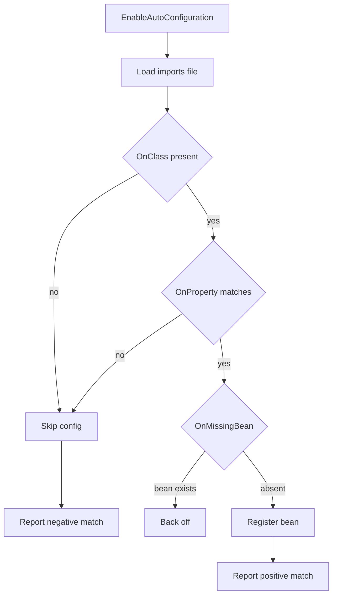

Auto-configuration is the feature that makes Spring Boot feel like magic and the topic interviewers use to check whether you actually understand that magic. The senior answer explains what Boot adds, how conditions decide which beans appear, why "define your own and Boot backs off" works, and how to write your own starter. This page targets Boot 3.x on Java 17+.

## What Spring Boot adds — and does not

Spring Boot sits *on top of* the Spring Framework. It contributes opinionated defaults, starter dependencies, an embedded server, production tooling via Actuator, and an executable jar. It is **not** a new programming model — you still write the same beans, `@Component`s and `@Configuration` you would in plain Spring.

| Spring Boot adds | Spring Boot does not |
|---|---|
| Opinionated auto-configuration | Replace the core Spring container |
| Starter dependencies with aligned versions | Introduce a new DI or MVC model |
| Embedded Tomcat, Jetty or Undertow | Force a specific server — it is swappable |
| Actuator health, metrics, info | Change how `@Bean` or `@Autowired` work |
| Executable fat jar and layered jars | Hide Spring — you can override everything |

> [!KEY]
> Say this out loud: "Boot is opinionated configuration and packaging on top of Spring, not a different framework. Every default it provides can be overridden, and it steps aside the moment I define my own bean."

## @SpringBootApplication decomposed

The one annotation on your main class is a meta-annotation combining three.

```java
@SpringBootConfiguration    // a @Configuration specialization
@EnableAutoConfiguration    // turn on the auto-config machinery
@ComponentScan              // scan this package and below for components
public @interface SpringBootApplication {}
```

`@SpringBootConfiguration` marks the class as configuration, `@ComponentScan` discovers your beans starting from the annotated class's package, and `@EnableAutoConfiguration` is what pulls in all the conditional configuration classes described below.

## How auto-configuration is discovered

In Boot 3, auto-configuration classes are listed in `META-INF/spring/org.springframework.boot.autoconfigure.AutoConfiguration.imports` — one fully-qualified class name per line. This **replaces** the old `spring.factories` mechanism used through Boot 2.x. Each class is annotated `@AutoConfiguration`, which supports `before` and `after` attributes to order relative to other auto-configurations.

```
com.example.metrics.MetricsAutoConfiguration
com.example.cache.CacheAutoConfiguration
```

```java
@AutoConfiguration(after = DataSourceAutoConfiguration.class)  // run after the DataSource is defined
@ConditionalOnClass(JdbcTemplate.class)
class JdbcExtrasAutoConfiguration { ... }
```

## The @Conditional family

Auto-configuration is only useful because each class applies **conditionally**. The `@Conditional*` annotations gate whether a configuration or bean is created.

| Condition | Applies the config when |
|---|---|
| `@ConditionalOnClass` | a class is on the classpath |
| `@ConditionalOnMissingClass` | a class is absent |
| `@ConditionalOnBean` | a matching bean already exists |
| `@ConditionalOnMissingBean` | no such bean exists yet — the backoff key |
| `@ConditionalOnProperty` | a property has a given value |
| `@ConditionalOnResource` | a resource file is present |
| `@ConditionalOnWebApplication` | running as a web app |
| `@ConditionalOnExpression` | a SpEL expression is true |

`@ConditionalOnMissingBean` is the mechanism behind "define your own and Boot backs off." Boot's auto-config declares a bean *only if you have not*, so supplying your own `DataSource` or `ObjectMapper` automatically disables Boot's default. Most conditions combine: a typical auto-configuration is gated by `@ConditionalOnClass` so it only activates when the relevant library is present, then guards each bean with `@ConditionalOnMissingBean` so you can still override. A subtlety worth naming is that `@ConditionalOnBean` and `@ConditionalOnMissingBean` reason about beans *known at the time the condition is evaluated*, which is why they are reliable inside auto-configuration but fragile if you put them on your own regular `@Configuration`, where bean-definition order is not guaranteed.

```java
@Bean
@ConditionalOnMissingBean          // yours wins if you declare one
ObjectMapper objectMapper() {
  return new ObjectMapper().findAndRegisterModules();
}
```

> [!WARNING]
> `@ConditionalOnMissingBean` is evaluated against the beans registered *so far*. That is why auto-configuration always runs **last**, after your own `@Configuration`. If Boot ran first, its default bean would already exist and your override would be the one that backs off. Ordering is the whole reason the backoff works.

## Debugging "why is this bean not there"

When a bean you expected is missing, or one you did not expect appears, read the **condition evaluation report**. Run with `--debug` or hit the Actuator `conditions` endpoint. It lists every auto-configuration under "positive matches" and "negative matches" with the exact condition that passed or failed.



You can exclude an auto-configuration you do not want:

```java
@SpringBootApplication(exclude = DataSourceAutoConfiguration.class)
class App {}
```

```yaml
spring:
  autoconfigure:
    exclude: org.springframework.boot.autoconfigure.jdbc.DataSourceAutoConfiguration
```

## Writing your own starter

A starter is two modules. The `-autoconfigure` module holds the `@AutoConfiguration` classes, `@ConfigurationProperties` and conditions. The starter module is a thin POM that depends on the autoconfigure module plus the libraries a user needs, so adding one dependency wires everything up. Convention: name third-party starters `xxx-spring-boot-starter`, reserving `spring-boot-starter-*` for Boot itself.

```java
@AutoConfiguration
@EnableConfigurationProperties(GreeterProps.class)
@ConditionalOnClass(Greeter.class)
class GreeterAutoConfiguration {

  @Bean
  @ConditionalOnMissingBean          // let users override the default
  Greeter greeter(GreeterProps props) {
    return new Greeter(props.prefix());
  }
}

@ConfigurationProperties("greeter")
record GreeterProps(String prefix) {}  // sensible default supplied by the app config
```

List the class in `META-INF/spring/org.springframework.boot.autoconfigure.AutoConfiguration.imports`, ship sensible defaults, and guard every bean with `@ConditionalOnMissingBean` so consumers can override.

## Dependency management and the BOM

Starters work partly because of **dependency management**. Inheriting from `spring-boot-starter-parent`, or importing `spring-boot-dependencies` as a BOM, pins a consistent, tested set of versions. You then declare starters without version numbers and Boot resolves aligned versions, avoiding the classic mismatch where two libraries pull in incompatible transitive dependencies. The parent POM also configures plugin defaults and resource filtering, whereas importing the BOM under `dependencyManagement` gives you the version alignment without inheriting a parent — the right choice when your organization already mandates its own parent POM. Either way you can override a managed version by setting the corresponding property, such as `<jackson.version>`, but do so knowingly, because you are stepping outside the tested combination.

```xml
<dependency>
  <groupId>org.springframework.boot</groupId>
  <artifactId>spring-boot-starter-web</artifactId>
</dependency>            <!-- version comes from the parent or BOM -->
```

## The executable jar

Boot's fat jar nests dependency jars under `BOOT-INF/lib` and your classes under `BOOT-INF/classes`. A `JarLauncher` reads `Main-Class` from the manifest — that launcher — and `Start-Class`, which is *your* `main`. A special nested-jar class loader reads classes straight out of jars-within-a-jar without unpacking, which plain Java cannot do.

| Manifest attribute | Points to |
|---|---|
| `Main-Class` | `org.springframework.boot.loader.launch.JarLauncher` |
| `Start-Class` | your `@SpringBootApplication` main class |

**Layered jars** split content into layers — dependencies, snapshot dependencies, resources, application code — so Docker caches the slow-changing dependency layer and only rebuilds the thin application layer on each code change. Cloud-native buildpacks (`mvn spring-boot:build-image`) use this to produce efficient OCI images without a Dockerfile.

## Startup, native image and devtools

For faster startup, `spring.main.lazy-initialization=true` defers bean creation until first use, and CDS/AppCDS shares a class archive across the JVM. GraalVM native image compiles ahead-of-time to a small, fast-starting binary, but its **caveat** is that reflection, proxies and resources must be declared as hints — Spring's AOT engine generates most of them, but dynamic reflection that Boot cannot see at build time will fail at runtime.

> [!TIP]
> `spring-boot-devtools` adds automatic restart on classpath changes and LiveReload for a faster local loop — development only, never a production dependency.

## Cheat sheet

- Boot is opinionated config and packaging on Spring, not a new programming model.
- `@SpringBootApplication` = `@SpringBootConfiguration` + `@EnableAutoConfiguration` + `@ComponentScan`.
- Boot 3 discovers auto-config via `AutoConfiguration.imports`, replacing `spring.factories`.
- `@ConditionalOnMissingBean` is why defining your own bean makes Boot back off.
- Auto-config runs last so your beans are registered first.
- Use `--debug` or the `conditions` endpoint to see positive and negative matches.
- A starter is an `autoconfigure` module plus a thin dependency module.
- Inherit the parent or import the BOM for aligned dependency versions.
- Fat jar uses `Main-Class` = launcher, `Start-Class` = your main; layered jars help Docker caching.

## Common mistakes

| Mistake | Fix |
|---|---|
| Thinking Boot replaces Spring | It is config plus packaging on top of Spring |
| Using `spring.factories` in Boot 3 | Use `AutoConfiguration.imports` |
| Wondering why an override is ignored | Guard defaults with `@ConditionalOnMissingBean` |
| Guessing why a bean is missing | Read the condition report via `--debug` |
| Pinning starter versions manually | Let the parent or BOM manage versions |
| Shipping devtools to production | Keep it as a development-only dependency |

## Summary

Auto-configuration is opinionated `@Configuration` that Spring Boot applies conditionally on top of the plain Spring container. `@SpringBootApplication` bundles configuration, component scanning and `@EnableAutoConfiguration`, which loads classes from `AutoConfiguration.imports`. The `@Conditional` family decides which beans appear, and `@ConditionalOnMissingBean` — evaluated after your beans because auto-config runs last — is what lets you override any default. When a bean is missing, the condition evaluation report tells you exactly why. Writing a starter is just an autoconfigure module plus a thin dependency module with sensible defaults and backoff conditions, and the executable jar plus layered jars and native image round out the packaging story.

## Top Interview Questions

### Q1. What does Spring Boot add on top of the Spring Framework?

Spring Boot layers opinionated defaults and packaging over Spring. Concretely: auto-configuration that wires common beans based on the classpath and properties; starter dependencies that bundle and version-align related libraries; an embedded server so you run a jar instead of deploying a WAR; Actuator for health, metrics and info endpoints; and an executable fat jar with a `main` method. What it does not do is change the programming model — you still write the same `@Component`, `@Configuration` and `@Bean` code, still use the same DI container, and can override every default. The one-line senior framing is "opinionated configuration and packaging on top of Spring, not a new framework."

### Q2. What are the three annotations inside @SpringBootApplication?

`@SpringBootApplication` is a meta-annotation for `@SpringBootConfiguration`, `@EnableAutoConfiguration` and `@ComponentScan`. `@SpringBootConfiguration` is a specialization of `@Configuration` that marks the class as a source of bean definitions and lets tests find it. `@ComponentScan` scans the annotated class's package and everything below it for `@Component`, `@Service`, `@Repository` and `@Controller`. `@EnableAutoConfiguration` activates the auto-configuration machinery, loading the conditional configuration classes listed in `AutoConfiguration.imports`. Because `@ComponentScan` starts from the main class's package, that class's position determines what gets scanned, which is why it usually sits at the root package.

### Q3. How does Spring Boot 3 discover auto-configuration classes?

It reads `META-INF/spring/org.springframework.boot.autoconfigure.AutoConfiguration.imports`, a plain text file with one fully qualified auto-configuration class name per line, contributed by Boot and any starters on the classpath. This replaced the Boot 2.x approach of listing them under the `EnableAutoConfiguration` key in `META-INF/spring.factories`. Each listed class is annotated `@AutoConfiguration`, which is a `@Configuration` variant that also accepts `before` and `after` attributes to order relative to other auto-configurations. `@EnableAutoConfiguration` loads these class names, then evaluates each one's `@Conditional` annotations to decide whether to apply it. If you are writing a starter for Boot 3, you must use the new imports file.

### Q4. Explain @ConditionalOnMissingBean and why it enables overriding.

`@ConditionalOnMissingBean` applies a bean definition only if no bean of that type is already registered in the context. Auto-configuration guards its default beans with it, so if you declare, say, your own `ObjectMapper`, Boot's default definition sees that a matching bean exists and backs off, leaving yours in place. This is the entire "define your own and Boot steps aside" contract. It works only because auto-configuration is evaluated *last*, after your `@Configuration` classes have registered their beans — so at the time Boot checks, your bean already exists. If the ordering were reversed, Boot's default would win. That ordering plus this condition is what makes Boot both convenient and fully overridable.

### Q5. A bean you expected from a starter is not being created. How do you diagnose it?

Run the app with `--debug`, or query the Actuator `conditions` endpoint, to get the condition evaluation report. It lists every auto-configuration split into positive matches, negative matches, and exclusions, each with the specific condition that decided it — for example "did not match: `@ConditionalOnClass` did not find `X`" or "`@ConditionalOnProperty` `feature.enabled` was false." That tells you exactly which condition failed: a missing dependency on the classpath, a property not set, or a bean you already defined causing a backoff. From there you add the dependency, set the property, or remove the conflicting bean. Guessing is unnecessary because Boot records the reasoning for every decision.

### Q6. Why does auto-configuration run after your own configuration?

Because many auto-configuration beans are guarded by `@ConditionalOnMissingBean`, and that condition checks the beans registered so far. To honor "your bean wins," Boot must evaluate your `@Configuration` and component-scanned beans first, then run auto-configuration, so that when its `@ConditionalOnMissingBean` checks fire, your beans are already present and the defaults back off. If auto-configuration ran first, its default beans would be registered before yours, and depending on definition rules either your bean would be rejected as a duplicate or the default would remain. Running auto-config last is therefore a deliberate design choice that makes the override mechanism reliable, and it is why auto-config classes are treated as low priority.

### Q7. How do you write your own Spring Boot starter?

Create two modules. The `-autoconfigure` module contains the `@AutoConfiguration` classes, `@ConfigurationProperties` for tunables, and `@Conditional` guards; it lists its config classes in `AutoConfiguration.imports`. The starter module is a thin POM with no code that depends on the autoconfigure module plus the third-party libraries the feature needs, so a consumer adds one dependency and gets everything. Guard each bean with `@ConditionalOnMissingBean` so users can override, gate on `@ConditionalOnClass` so it only activates when the relevant library is present, and ship sensible property defaults. Name it `feature-spring-boot-starter`, not `spring-boot-starter-feature`, which is reserved for Boot itself. Add `@EnableConfigurationProperties` to bind the properties class.

### Q8. What is inside a Spring Boot executable jar and how does it run?

It is a nested jar: your compiled classes go under `BOOT-INF/classes`, dependency jars under `BOOT-INF/lib`, and Boot's loader classes at the root. The manifest sets `Main-Class` to Boot's `JarLauncher` and `Start-Class` to your `@SpringBootApplication` class. When you run `java -jar app.jar`, the JVM invokes `JarLauncher`, which installs a special class loader that can read classes directly from jars nested inside the outer jar — something the standard Java class loader cannot do — then calls your `Start-Class` main. This packaging makes the app self-contained and runnable anywhere a JVM exists, without unpacking dependencies or needing an external servlet container.

### Q9. What are layered jars and why do they matter for Docker?

A layered jar organizes the fat jar's contents into layers ordered by how often they change: external dependencies, snapshot dependencies, project resources, and application classes. Because dependencies change far less often than your code, a Docker build can copy each layer into its own image layer, so a code-only change invalidates just the small application layer and reuses the cached dependency layers. That makes image rebuilds and pushes dramatically faster and smaller in CI. Cloud-native buildpacks, invoked with `mvn spring-boot:build-image`, use layering automatically to produce optimized OCI images without you writing a Dockerfile. Naming layered jars and buildpacks signals you have thought about container build efficiency, not just running the app.

### Q10. What is the reflection caveat with GraalVM native image?

GraalVM native image compiles ahead of time under a closed-world assumption: everything reachable must be known at build time. Reflection, dynamic proxies, resource loading and serialization that the compiler cannot see statically will fail at runtime unless declared as *hints* in reachability metadata. Spring's AOT processing generates most of these hints for framework and auto-configuration code during the build, which is why Boot 3 native images largely work out of the box. But application code that reflects on types Spring cannot discover — for example loading a class by a name computed at runtime — needs explicit `@RegisterReflectionForBinding` or hint registration, or it throws in the native binary while working fine on the JVM. That gap between JVM and native behavior is the classic trap.
