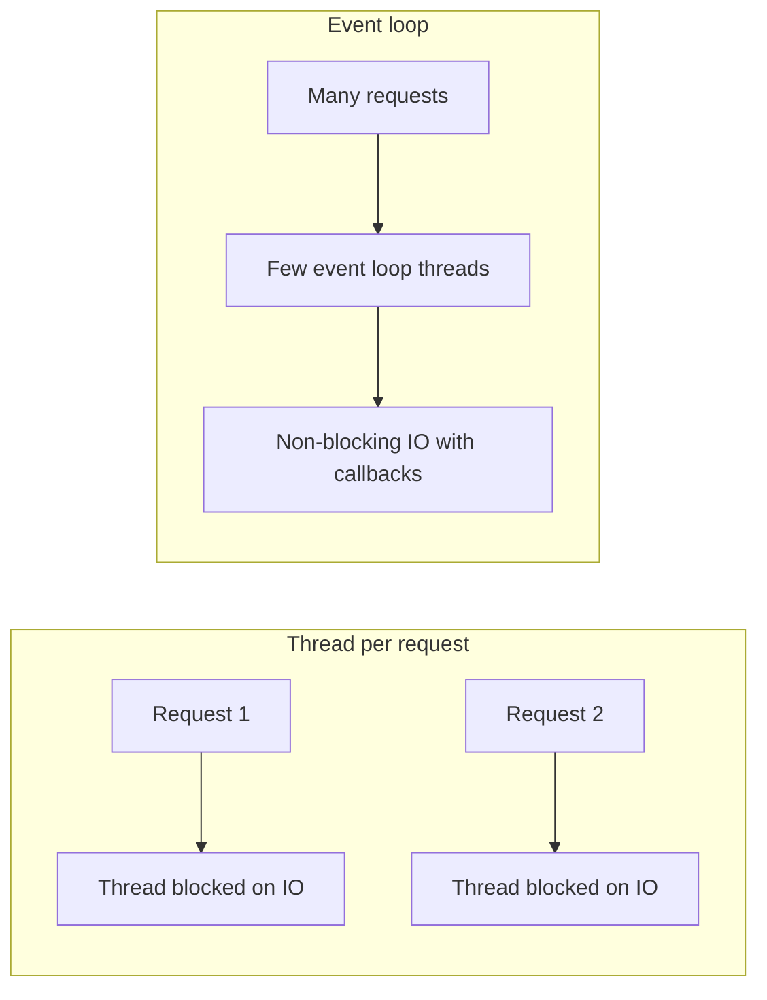
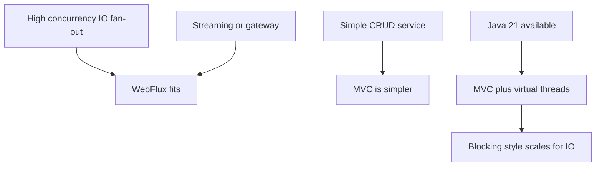

WebFlux is Spring's non-blocking, reactive web stack built on Project Reactor and Netty. Interviewers use it to test depth: do you understand backpressure, the cardinal rule against blocking the event loop, `map` versus `flatMap`, and — the senior differentiator — when virtual threads make WebFlux the wrong tool. This page covers all of that for Spring Boot 3.x on Java 17+.

## The problem reactive solves

Classic Spring MVC is thread-per-request: one platform thread is pinned to a request for its entire life, including time spent blocked waiting on a slow database or downstream API. A service that fans out to several slow downstreams runs out of threads long before it runs out of CPU. With a 200-thread pool, 200 requests each waiting 500 ms on a downstream cap you at roughly 400 requests per second even though the CPU is idle.



## The reactive model

WebFlux runs on a small pool of event-loop threads — roughly one per CPU core on Netty — and never blocks them. Instead of waiting, an operation registers a callback and the thread moves on to other work; when the I/O completes, the pipeline resumes. **Backpressure** via the Reactive Streams contract lets a slow consumer signal how many items it can accept, so a fast producer cannot overwhelm it. The four Reactive Streams interfaces are `Publisher`, `Subscriber`, `Subscription` and `Processor`.

`Mono<T>` is a publisher of zero or one item; `Flux<T>` is a publisher of zero to many. The defining property: **nothing happens until you subscribe.** Building a pipeline only describes work; the terminal `subscribe` — which in a controller Spring calls for you — sets it running.

```java
Mono<User> user = userRepo.findById(id)          // no query runs yet
    .map(User::normalize)                        // just describes a transform
    .switchIfEmpty(Mono.error(new UserNotFound(id)));
// the database call fires only when something subscribes
```

## Core operators

You compose pipelines from operators. Know the shape of each and, above all, `map` versus `flatMap`.

| Operator | Purpose |
|---|---|
| `map` | synchronous one-to-one transform |
| `flatMap` | async transform returning a publisher, flattened, order not guaranteed |
| `concatMap` | like `flatMap` but preserves order, sequential |
| `flatMapSequential` | runs concurrently but emits in source order |
| `filter` | drop elements failing a predicate |
| `zip` | combine several publishers element-wise |
| `merge` | interleave multiple publishers as they emit |
| `switchIfEmpty` / `defaultIfEmpty` | supply a fallback when empty |
| `onErrorResume` / `onErrorReturn` | recover from an error |
| `retryWhen` / `timeout` | resilience controls |
| `cache` | share and replay a result to subscribers |

> [!KEY]
> `map` transforms a value synchronously and returns a plain value. `flatMap` takes a value, calls something that returns another `Mono` or `Flux` — an async call — and flattens the result. Using `map` where the transform itself returns a publisher gives you a `Mono<Mono<T>>` nested type. If a step does I/O, it is `flatMap`.

## Never block the event loop

This is the rule that fails candidates who claim reactive experience. There are only a handful of event-loop threads. A single `Thread.sleep`, a blocking JDBC call, or `.block()` on one of them stalls **every** request currently multiplexed on that thread, collapsing throughput for the whole service, not just the one request.

> [!DANGER]
> One blocking call on an event-loop thread does not slow one request — it freezes every request sharing that thread. A stray JDBC driver or `.block()` in a WebFlux handler can take the whole service to its knees under load while CPU sits near zero.

`BlockHound` is a test-time agent that instruments the JVM and throws the instant blocking code executes on a non-blocking thread, catching these mistakes before production.

### subscribeOn versus publishOn

When you genuinely cannot avoid a blocking call — a legacy JDBC library, an SDK with no async API — move it off the event loop onto the **bounded elastic** scheduler, which is designed to host blocking work.

```java
Mono.fromCallable(() -> legacyJdbc.query(sql))   // blocking call
    .subscribeOn(Schedulers.boundedElastic())    // run it on a blocking-safe pool
    .timeout(Duration.ofSeconds(2));
```

`subscribeOn` sets the scheduler for the *subscription and everything upstream*, regardless of where in the chain it appears. `publishOn` switches the thread for operators *downstream* of it. Use `subscribeOn` to control where a blocking source runs; use `publishOn` to hand later processing to a different scheduler.

## Controllers: annotated versus functional

You can write reactive endpoints two ways. Annotated controllers look like MVC but return `Mono` or `Flux`. The functional style uses `RouterFunction` and `HandlerFunction` to define routes as code.

```java
@RestController
class UserController {
  @GetMapping("/users/{id}")
  Mono<UserDto> get(@PathVariable String id) {    // Spring subscribes for you
    return service.find(id);
  }
}

@Bean
RouterFunction<ServerResponse> routes(UserHandler h) {
  return route(GET("/users/{id}"), h::get);       // functional routing
}
```

## WebClient, streaming and R2DBC

`WebClient` is the non-blocking HTTP client. Its `retrieve()` API is the concise happy-path form; `exchangeToMono()` gives full control over the response including status handling. Configure connection pooling and per-request timeouts on the underlying connector.

```java
Mono<Quote> quote = webClient.get()
    .uri("/quote/{sym}", sym)
    .retrieve()
    .bodyToMono(Quote.class)
    .timeout(Duration.ofMillis(800))             // fail fast on a slow downstream
    .retryWhen(Retry.backoff(3, Duration.ofMillis(100)));
```

Server-sent events stream with `Flux<ServerSentEvent<T>>`, pushing items as they arrive. For the database, **R2DBC** is the reactive driver spec — a reactive web stack in front of a *blocking* JDBC call is pointless, because that JDBC call blocks the event loop and undoes everything. The trade-off is maturity: JPA is richer and more familiar, while R2DBC is lower-level with no lazy loading or full ORM.

## Debugging, context and errors

A reactive stack trace is often useless because the failure surfaces on a different thread from where the pipeline was assembled. Add `checkpoint()` at key points, or enable `Hooks.onOperatorDebug()` in development, to reconstruct the assembly path — at a performance cost, so never leave the global hook on in production.

`ThreadLocal` and MDC do **not** work reactively, because a pipeline hops threads between operators. Propagate request-scoped data through the Reactor `Context` and use Micrometer context propagation to bridge MDC for logging.

```java
return service.find(id)
    .contextWrite(Context.of("tenant", tenantId))  // travels with the pipeline, not the thread
    .onErrorResume(UserNotFound.class, e -> Mono.empty());
```

## Testing

Test pipelines with `StepVerifier`, which subscribes and asserts the exact sequence of signals. Test endpoints end-to-end with `WebTestClient`.

```java
StepVerifier.create(service.find("42"))
    .expectNextMatches(u -> u.id().equals("42"))
    .verifyComplete();                             // asserts onComplete with no error
```

## The honest verdict



WebFlux is the right answer for very high-concurrency I/O fan-out, streaming, and gateway or edge services where holding thousands of connections cheaply matters. But it comes with a hard cost: a reactive programming model that is harder to write, read, debug and onboard. Since Java 21, **virtual threads plus Spring MVC** let you write ordinary blocking code that scales for I/O-bound work by unmounting a virtual thread while it waits, solving a large slice of the same problem without the operators-and-schedulers overhead. Saying this trade-off out loud — WebFlux for streaming and extreme fan-out, virtual-thread MVC for most I/O-bound services — is what a senior answer sounds like.

| Model | Programming style | Scales I/O by | Best for |
|---|---|---|---|
| MVC | blocking, imperative | large thread pool | typical CRUD services |
| MVC + virtual threads | blocking, imperative | cheap unmounting threads | most I/O-bound services on Java 21 |
| WebFlux | reactive, declarative | event loop plus backpressure | streaming, gateways, extreme fan-out |

## Cheat sheet

- WebFlux runs on a few Netty event-loop threads with non-blocking I/O and backpressure.
- `Mono` is 0..1, `Flux` is 0..N; nothing runs until something subscribes.
- `map` is a synchronous value transform; `flatMap` handles an async step returning a publisher.
- Never block an event-loop thread — one blocking call stalls every request on it.
- Wrap unavoidable blocking calls with `subscribeOn(Schedulers.boundedElastic())`.
- `ThreadLocal`/MDC do not work; use the Reactor `Context` and Micrometer propagation.
- R2DBC, not JDBC — a reactive stack over a blocking driver is pointless.
- Test with `StepVerifier` and `WebTestClient`; catch blocking with `BlockHound`.
- Java 21 virtual threads plus MVC replace WebFlux for many I/O-bound services.

## Common mistakes

| Mistake | Fix |
|---|---|
| Calling `.block()` inside a handler | Compose with operators; return the `Mono`/`Flux` |
| Using `map` for an async call | Use `flatMap` so the inner publisher is flattened |
| Blocking JDBC on the event loop | Use R2DBC or offload to `boundedElastic` |
| Relying on `ThreadLocal`/MDC | Propagate via Reactor `Context` |
| Expecting work without subscribing | Ensure a terminal subscribe; Spring does it for endpoints |
| Choosing WebFlux for simple CRUD | Use MVC, or MVC with virtual threads on Java 21 |

## Summary

WebFlux replaces thread-per-request with a small event-loop pool doing non-blocking I/O plus backpressure, so it holds huge numbers of I/O-bound connections cheaply. You compose `Mono` and `Flux` with operators, remembering that `map` is synchronous and `flatMap` handles async steps, and that nothing runs until subscription. The non-negotiable rule is never to block the event loop; unavoidable blocking goes on `boundedElastic`. Debugging needs `checkpoint`, context flows through the Reactor `Context`, and you test with `StepVerifier`. The senior close is honest: WebFlux wins for streaming and extreme fan-out, but Java 21 virtual threads with plain MVC now cover most I/O-bound cases with a far simpler model.

## Top Interview Questions

### Q1. What problem does reactive programming solve that thread-per-request does not?

Thread-per-request pins one platform thread to a request for its whole life, including idle time spent blocked on I/O. A service that fans out to slow downstreams becomes thread-bound long before it is CPU-bound: with a 200-thread pool and 500 ms downstream waits, you cap around 400 requests per second while the CPU sits nearly idle, because threads are the scarce resource. Reactive replaces this with a few event-loop threads that never block — they register callbacks and move on — so a handful of threads can multiplex tens of thousands of in-flight requests waiting on I/O. It trades a simple blocking model for far higher concurrency per thread on I/O-bound workloads.

### Q2. What is the difference between map and flatMap?

`map` applies a synchronous, one-to-one function to each element and returns a plain value, so `Flux<String>` mapped with `String::length` gives `Flux<Integer>`. `flatMap` applies a function that itself returns a `Mono` or `Flux` — typically an asynchronous call like a database lookup or HTTP request — and flattens the resulting inner publishers into the outer stream. If you use `map` with a function that returns a publisher, you get a nested `Flux<Mono<T>>` that never resolves. The rule: if the transform performs I/O or returns a reactive type, use `flatMap`. Note `flatMap` interleaves results and does not preserve order; use `concatMap` or `flatMapSequential` when order matters.

### Q3. What does "nothing happens until you subscribe" mean?

`Mono` and `Flux` are lazy descriptions of work, not the work itself. Chaining operators only builds a blueprint of what should happen; no database query, HTTP call or computation runs until a `Subscriber` subscribes, which triggers the pipeline from the source down. In a WebFlux controller, Spring performs that subscription when it processes the returned publisher, which is why you must *return* the `Mono`/`Flux` rather than call `.block()` or discard it. A common bug is building a pipeline with side effects and never subscribing, so nothing executes. Understanding this laziness explains why you compose and return publishers instead of imperatively invoking them.

### Q4. Why must you never block the event loop, and how do you catch it?

WebFlux uses only a few event-loop threads, each multiplexing many requests. If one request executes a blocking call — `Thread.sleep`, blocking JDBC, or `.block()` — that thread cannot service any of the other requests assigned to it, so throughput collapses for the whole service under load even though CPU is idle. It is not a per-request slowdown; it freezes everyone sharing that thread. To catch it, use `BlockHound`, a JVM agent enabled in tests that instruments blocking methods and throws immediately if any runs on a non-blocking thread. That converts a subtle production degradation into a loud, early test failure. Unavoidable blocking must be offloaded to a bounded-elastic scheduler.

### Q5. What is the difference between subscribeOn and publishOn?

Both change which scheduler threads run parts of the pipeline, but differently. `subscribeOn` affects the subscription signal and therefore the *source and everything upstream*, no matter where you place it in the chain — it decides which thread the data emission starts on, which is how you push a blocking source onto `boundedElastic`. `publishOn` switches threads for the operators *downstream* of its position, so everything after it runs on the specified scheduler while everything before it is unaffected. Rule of thumb: `subscribeOn` to control where a blocking source executes, `publishOn` to move subsequent processing — for example CPU-bound mapping — onto a different pool. You can use both in one chain.

### Q6. How do you integrate an unavoidable blocking call into a reactive pipeline?

Wrap it so it does not run on an event-loop thread. Put the blocking call inside `Mono.fromCallable(...)` and add `.subscribeOn(Schedulers.boundedElastic())`, which runs it on a scheduler purpose-built to host blocking work with a bounded, elastic thread pool. Add a `.timeout(...)` so a stuck call cannot hold a thread forever. This keeps the event loop free while the blocking call runs elsewhere, and the result flows back into the reactive pipeline when it completes. It is the correct pattern for legacy JDBC, a synchronous SDK, or file I/O with no async API. It is a compromise, though — if most of your work is blocking, a reactive stack buys you little and MVC would be simpler.

### Q7. Why is R2DBC needed instead of JDBC in a reactive app?

JDBC is a blocking API: every query holds the calling thread until the database responds. In WebFlux that thread is an event-loop thread, so a JDBC call blocks the loop and destroys the concurrency the reactive stack exists to provide — a reactive web layer over blocking JDBC is pointless. R2DBC is the Reactive Relational Database Connectivity spec, providing non-blocking drivers that return `Mono`/`Flux` and honor backpressure, so database access stays off the event loop without offloading. The trade-off is maturity: JPA and JDBC are richer, more familiar and support lazy loading and a full ORM, whereas R2DBC is lower-level with a smaller ecosystem. If you must use JDBC, offload it to `boundedElastic` rather than pretending it is non-blocking.

### Q8. Your WebFlux service is slow under load but CPU is low. How do you debug it?

Low CPU with poor throughput on WebFlux almost always means something is blocking the event loop. First, add `BlockHound` in a load test to pinpoint any blocking call executing on a non-blocking thread — the usual culprits are a JDBC driver, a synchronous HTTP client, `Thread.sleep`, or a stray `.block()`. Check downstream timeouts too, since a slow downstream without a `timeout` operator holds pipeline resources. Use `checkpoint()` or `Hooks.onOperatorDebug()` to trace where in the pipeline latency accrues. Confirm you are using `WebClient` and R2DBC rather than blocking clients. The fix is to remove the blocking call, switch to a non-blocking client, or offload the unavoidable blocking to `boundedElastic` with a timeout.

### Q9. Why do ThreadLocal and MDC break in reactive code, and what replaces them?

A reactive pipeline is not tied to one thread — operators can run on different scheduler threads, and execution hops between them as work is scheduled. `ThreadLocal`, and MDC which is built on it, store data on a specific thread, so a value set before an async boundary is not visible after it, breaking request-scoped context and log correlation. The reactive replacement is the Reactor `Context`, an immutable key-value store that travels with the subscription through the whole pipeline regardless of thread, written with `contextWrite` and read with `deferContextual`. To keep MDC-based logging working, use Micrometer context propagation, which bridges the Reactor `Context` into thread-local MDC around each operator so log statements still carry the correlation id.

### Q10. When would you choose WebFlux over MVC with virtual threads?

Choose WebFlux when you need genuine streaming — server-sent events or large backpressured data flows — or when you are building a gateway or edge service that must hold tens of thousands of mostly-idle connections cheaply and fan out to many downstreams. Its backpressure and event-loop model are purpose-built for that. For most ordinary I/O-bound services, however, Java 21 virtual threads with plain Spring MVC now deliver similar scalability: a virtual thread unmounts from its carrier while blocked, so blocking code no longer ties up a scarce OS thread, and you keep the simple imperative model that is far easier to write, debug and staff. The senior answer names the trade-off explicitly rather than defaulting to reactive everywhere.

### Q11. What is backpressure and how does Reactive Streams provide it?

Backpressure is the ability of a slow consumer to limit how fast a producer sends data, preventing unbounded buffering or out-of-memory failures when a fast source outpaces a slow sink. Reactive Streams encodes it in the `Subscription`: after subscribing, the `Subscriber` calls `request(n)` to demand at most `n` elements, and the `Publisher` must not emit more than has been requested. As the consumer processes items it requests more, so flow is pull-driven under the hood even though it looks push-based. Reactor implements this across its operators, and clients like `WebClient` and drivers like R2DBC honor it end to end. Operators such as `onBackpressureBuffer` or `limitRate` let you tune behavior when demand and supply diverge.

### Q12. How do you test reactive code?

Use `StepVerifier` for pipeline logic: it subscribes to your `Mono` or `Flux` and lets you assert the exact sequence of signals — `expectNext`, `expectNextMatches`, `expectError`, and terminal `verifyComplete` or `verifyError`. It can also drive virtual time with `withVirtualTime` to test `delay` or `timeout` operators without real waiting. For endpoints, use `WebTestClient`, the reactive analogue of `MockMvc`, which exercises the full WebFlux stack and asserts status and body without a running server. Together they let you verify both the stream semantics and the HTTP contract. Add `BlockHound` in tests so a blocking call sneaking into a non-blocking path fails the build rather than surfacing as a production incident.
