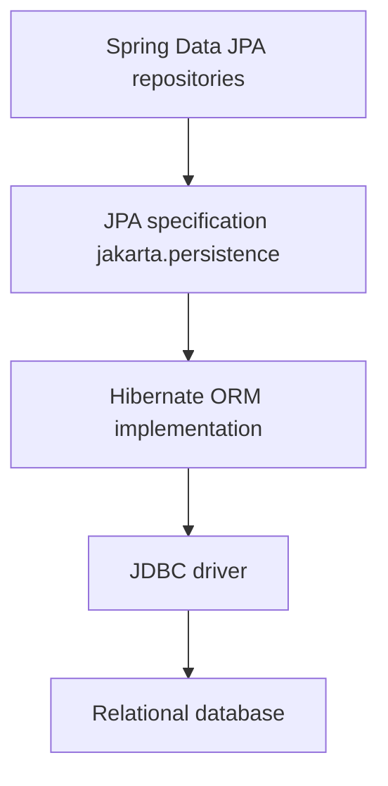
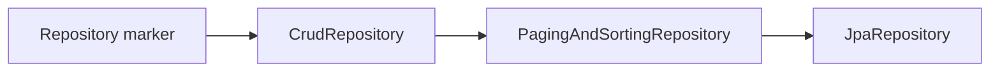

Spring Data JPA is the repository layer most Spring Boot services use to talk to a relational database. Interviewers probe whether you understand the stack beneath it — because JPA hides a lot, and the leaks are where production incidents live.

## The layers and who owns what

The single most useful mental model is a stack. Each layer solves one problem and delegates the rest downward.



| Layer | Owns | Does not own |
|---|---|---|
| Spring Data JPA | Repository interfaces, derived queries, paging | The SQL dialect or flush timing |
| JPA (`jakarta.persistence`) | Annotations, `EntityManager`, JPQL contract | Any actual database work |
| Hibernate 6 | Persistence context, dirty checking, SQL generation | The wire protocol |
| JDBC | Connections, statements, result sets | Object mapping |

In an interview, say it crisply: **JPA is the specification, Hibernate is the implementation, Spring Data JPA is the convenience layer on top.** Being able to name which layer owns flush timing (Hibernate) versus repository naming (Spring Data) signals real depth.

## Entity mapping essentials

An entity is a class mapped to a table. The annotations are small but every one carries a trap.

```java
@Entity
@Table(name = "app_user")
public class User {
    @Id
    @GeneratedValue(strategy = GenerationType.SEQUENCE, generator = "user_seq")
    @SequenceGenerator(name = "user_seq", sequenceName = "user_seq", allocationSize = 50)
    private Long id;

    @Column(nullable = false, length = 120)
    private String email;

    @Enumerated(EnumType.STRING) // never ORDINAL: reordering the enum corrupts data
    private Status status;

    @Version
    private long version; // optimistic locking token

    protected User() { } // JPA needs a no-arg constructor
}
```

### Identifier generation

`@GeneratedValue` picks how the primary key is produced, and the choice affects performance directly.

| Strategy | Behaviour | Notes |
|---|---|---|
| `IDENTITY` | Auto-increment column | Disables JDBC batch inserts — Hibernate needs the id back per row |
| `SEQUENCE` | Database sequence with `allocationSize` | Recommended default; pre-allocates ids so inserts batch |
| `TABLE` | A separate table as a counter | Portable but slow; avoid |
| `AUTO` | Provider picks per dialect | Surprising on some databases; be explicit instead |

> [!DANGER]
> `GenerationType.IDENTITY` silently disables JDBC batching. If you insert thousands of rows and wonder why it is slow, this is often why. Prefer `SEQUENCE` with a sensible `allocationSize`.

### Value types and equality

`@Embeddable` and `@Embedded` let you fold a value object (an `Address`, a `Money`) into the owning table without a join. `@Enumerated(EnumType.STRING)` stores the enum name; `ORDINAL` stores the position, so inserting a new enum constant in the middle rewrites the meaning of existing rows — a genuine production landmine.

Every entity needs a no-arg constructor (the provider instantiates it by reflection) and sane `equals`/`hashCode`. Base equality on a **business key** (email, order number), not the generated id — the id is null before persist, so an id-based `hashCode` changes when the entity moves into a `HashSet`, breaking the set.

> [!KEY]
> `@Version` gives you optimistic locking for free. On update, Hibernate adds `WHERE version = ?`; if the row moved, it throws `OptimisticLockException` instead of silently overwriting a concurrent change.

## Relationship mapping

Associations are where over-fetching and N+1 problems begin. Know the owning side rule cold.

```java
@Entity
public class Order {
    @ManyToOne(fetch = FetchType.LAZY) // owning side holds the FK column
    @JoinColumn(name = "customer_id")
    private Customer customer;

    @OneToMany(mappedBy = "order", cascade = CascadeType.ALL, orphanRemoval = true)
    private List<OrderLine> lines = new ArrayList<>();
}
```

The **owning side** has the foreign key and no `mappedBy`; the inverse side uses `mappedBy` to point at the owner. Only changes to the owning side are persisted.

| Relationship | Advice |
|---|---|
| `@ManyToOne` | Prefer this; it maps a plain FK and is easy to make lazy |
| `@OneToMany` | Model as the inverse of a `@ManyToOne`; watch fetch type |
| `@OneToOne` | Fine, but a lazy `@OneToOne` on the inverse side is tricky |
| `@ManyToMany` | Avoid; replace with an explicit join entity holding two `@ManyToOne` |

Prefer `@ManyToOne` and avoid `@ManyToMany`: a join table you cannot add columns to becomes a wall the moment you need a `created_at` or a quantity. Model it as its own entity from the start. `cascade` propagates operations (persist, merge, remove) to children, and `orphanRemoval = true` deletes a child once it is removed from the collection.

## The repository hierarchy

Spring Data builds repositories from marker interfaces. Each level adds capability.



- `Repository` — empty marker, no methods.
- `CrudRepository` — `save`, `findById`, `delete`, `count`.
- `PagingAndSortingRepository` — adds `findAll(Pageable)` and `findAll(Sort)`.
- `JpaRepository` — adds JPA extras like `flush`, `saveAllAndFlush`, `getReferenceById`, and batch deletes.

Most services extend `JpaRepository<User, Long>`.

### Query methods, @Query and projections

Derived queries parse the method name into a query. The grammar is `find...By` plus property paths joined by `And`, `Or`, `LessThan`, `Containing`, `OrderBy`.

```java
List<User> findByStatusAndEmailContainingIgnoreCase(Status status, String part);

@Query("select u from User u where u.status = :status")
List<User> active(@Param("status") Status status);

@Modifying(clearAutomatically = true) // evict stale entities after a bulk update
@Query("update User u set u.status = :s where u.lastLogin < :cutoff")
int deactivateStale(@Param("s") Status s, @Param("cutoff") Instant cutoff);
```

`@Query` takes JPQL by default or native SQL with `nativeQuery = true`. `@Modifying` marks update/delete queries; `clearAutomatically = true` clears the persistence context so it does not serve stale cached entities afterward.

**Projections** answer the rule "do not select 16 columns to show 2":

```java
interface NameView { String getEmail(); Status getStatus(); }        // interface-based
record NameDto(String email, Status status) { }                       // DTO constructor
<T> List<T> findByStatus(Status status, Class<T> type);               // dynamic projection
```

An interface projection returns only the getters you declare; a DTO constructor expression (`select new com.app.NameDto(u.email, u.status)`) builds objects directly; a dynamic `Class<T>` argument lets one method return different shapes.

### Paging: Page, Slice and keyset

`Pageable` carries page number, size and sort. `Page` runs an **extra count query** to report total pages; `Slice` skips the count and only knows whether a next page exists — cheaper when you just need infinite scroll.

```java
Page<User> findByStatus(Status status, Pageable page);   // count query included
Slice<User> findByEmailContaining(String q, Pageable p); // no count query
```

> [!WARNING]
> Deep offset pagination (`OFFSET 100000`) forces the database to scan and discard every skipped row. For large data prefer **keyset pagination** — `where id > :lastSeenId order by id limit 20` — which stays fast at any depth.

## Dynamic queries, auditing and migrations

For filters built at runtime, use `Specification` (JPA Criteria under the hood) or Querydsl.

```java
Specification<User> byStatus(Status s) {
    return (root, query, cb) -> cb.equal(root.get("status"), s);
}
```

`Specification` composes with `and`/`or`; Querydsl offers a type-safe fluent DSL for the same job in one line of setup per query.

Auditing fills timestamps automatically:

```java
@EnableJpaAuditing // on a @Configuration class
@EntityListeners(AuditingEntityListener.class)
class Base {
    @CreatedDate Instant createdAt;
    @LastModifiedDate Instant updatedAt;
}
```

Soft deletes keep the row and hide it: `@SQLRestriction("deleted = false")` (Hibernate 6, replacing the old `@Where`) filters every query for that entity, while a delete sets the flag.

Schema changes belong in **Flyway** or **Liquibase** versioned migrations, not in Hibernate.

```yaml
spring:
  jpa:
    hibernate:
      ddl-auto: validate   # validate only; never update in production
  flyway:
    enabled: true
```

> [!DANGER]
> `spring.jpa.hibernate.ddl-auto=update` in production can silently add columns, miss renames, and never drops anything — your schema drifts from your migrations. Use `validate` and let Flyway own changes.

## When not to use JPA

JPA shines for transactional, entity-centric work. It fights you on:

- **Reporting and analytics** — wide aggregations and window functions.
- **Bulk jobs** — updating millions of rows through managed entities wastes memory.
- **Complex read models** — hand-tuned SQL is clearer than a tangle of joins.

For those, reach for `JdbcTemplate` or the newer `JdbcClient`, or a mapper like MyBatis. Mixing JPA for writes and plain SQL for heavy reads in the same service is a mature, defensible choice — say so out loud.

## Cheat sheet

- JPA is the spec, Hibernate the implementation, Spring Data the repository layer.
- Default to `SEQUENCE` ids with an `allocationSize`; `IDENTITY` kills batching.
- Always `@Enumerated(EnumType.STRING)`; `ORDINAL` corrupts data on reorder.
- `equals`/`hashCode` on a business key, never the generated id.
- Make `@ManyToOne` lazy; avoid `@ManyToMany`, use a join entity.
- Owning side holds the FK; the inverse side uses `mappedBy`.
- Use projections to select only needed columns; use keyset paging for deep pages.
- `ddl-auto: validate` in production; let Flyway or Liquibase own schema.
- For reporting and bulk work, drop to `JdbcClient` or SQL.

## Common mistakes

| Mistake | Fix |
|---|---|
| `GenerationType.IDENTITY` on a batch-insert path | Switch to `SEQUENCE` with `allocationSize` |
| `@Enumerated(EnumType.ORDINAL)` | Use `EnumType.STRING` |
| `equals`/`hashCode` based on the id | Base them on a stable business key |
| Using `@ManyToMany` for an evolving link | Model an explicit join entity |
| Selecting whole entities for a two-field view | Use an interface or DTO projection |
| `Page` when you only need next-page info | Use `Slice` to skip the count query |
| Deep `OFFSET` pagination | Switch to keyset pagination |
| `ddl-auto: update` in production | Use `validate` plus Flyway migrations |

## Summary

Spring Data JPA removes boilerplate but sits on top of Hibernate and JDBC, and the abstractions leak exactly where interviews focus: id generation and batching, enum storage, fetch types, and pagination cost. Map entities with lazy `@ManyToOne`, business-key equality, `STRING` enums and versioning, and prefer explicit join entities over `@ManyToMany`. Use projections and keyset paging to keep queries lean, let Flyway own the schema, and drop to plain SQL for reporting and bulk work. Knowing which layer owns which concern is what separates a user of the framework from an engineer who can debug it.

## Top Interview Questions

### Q1. What is the difference between JPA, Hibernate and Spring Data JPA?

JPA is a specification in the `jakarta.persistence` namespace — a set of interfaces and annotations (`@Entity`, `EntityManager`, JPQL) with no runtime behaviour of its own. Hibernate is the most common implementation of that specification; it owns the persistence context, dirty checking, SQL generation and flush timing. Spring Data JPA sits one level higher: it generates repository implementations from interfaces, parses derived query method names, and adds paging, sorting and auditing. A useful test of understanding is naming which layer owns a concern — flush timing is Hibernate, `@Query` parsing is Spring Data, the `@Entity` annotation contract is JPA. All three ultimately run through the JDBC driver to the database.

### Q2. Which @GeneratedValue strategy should you default to and why?

`GenerationType.SEQUENCE` with an explicit `allocationSize` on a `@SequenceGenerator`. A sequence lets Hibernate pre-allocate a block of ids without a round trip per row, so multiple inserts can be batched into one JDBC batch. `IDENTITY` maps to an auto-increment column and forces Hibernate to execute each insert immediately to read the generated key back, which disables batch inserts entirely — a real performance cliff on bulk writes. `TABLE` uses a separate counter table with row locking and is slow. `AUTO` lets the provider choose per dialect, which is unpredictable. So the senior answer is: default to `SEQUENCE`, tune `allocationSize` (for example 50), and only accept `IDENTITY` when the database offers nothing better.

### Q3. Why must you never use @Enumerated(EnumType.ORDINAL)?

`ORDINAL` persists an enum by its position — `0`, `1`, `2`. That value is meaningless if anyone reorders the enum or inserts a new constant in the middle, because existing rows now decode to a different constant, silently corrupting data with no error. `EnumType.STRING` persists the constant name, which is stable across reordering and readable in the database. The only cost is a few extra bytes per row, which is almost always worth it. In an interview, state it as an absolute: always `STRING` unless you have a measured, locked-down reason otherwise, and even then a lookup table is usually a better design.

### Q4. Why base equals and hashCode on a business key instead of the generated id?

A generated id is null until the entity is persisted. If `hashCode` depends on the id, an entity's hash changes the moment it is saved, so if you added it to a `HashSet` while transient, the set can no longer find it — the object is lost in its own bucket. Basing equality on a stable business key (email, order number, ISBN) keeps the hash constant across the entity lifecycle. If there is genuinely no natural key, a common alternative is a UUID assigned in the constructor before persist, so the identity is stable from creation. The anti-pattern to call out is a naive IDE-generated `equals`/`hashCode` over the id field.

### Q5. Explain the owning side of a relationship and the role of mappedBy.

In a bidirectional association, exactly one side owns the foreign key — that is the **owning side**, and it has no `mappedBy`. The other side is the inverse and declares `mappedBy = "fieldName"` pointing at the owning field. Hibernate only inspects the owning side when deciding what SQL to run; changes made only to the inverse collection are ignored on flush. The classic bug is adding a child to a parent's `@OneToMany` collection but never setting the child's `@ManyToOne` back-reference — nothing persists because the owning side never changed. A helper method on the parent that sets both sides at once avoids this.

### Q6. When would you use a projection, and what kinds exist?

Use a projection whenever a query needs fewer columns than the full entity — the rule "do not select 16 columns to show 2." Loading full entities also attaches them to the persistence context and enables dirty checking you do not want on a read path. Spring Data offers three kinds: interface-based projections, where you declare getters and Spring builds a proxy selecting only those columns; DTO/class-based projections via a JPQL constructor expression `select new com.app.Dto(...)`; and dynamic projections, where the repository method takes a `Class<T>` argument and returns whichever shape you pass. Interface projections are the least ceremony; DTO records are the clearest for a fixed read model. All three reduce data transfer and skip managed-entity overhead.

### Q7. What is the difference between Page and Slice, and when does it matter?

Both carry a window of results plus paging metadata, but `Page` also runs a second **count query** to compute the total number of elements and pages, while `Slice` does not — it only knows whether a next page exists by fetching one extra row. The count query can be expensive on large or heavily filtered tables. So use `Page` when the UI genuinely needs "page 7 of 214" style totals, and `Slice` for infinite scroll or "load more" where you only need to know if there is a next page. A follow-up is deep pagination: even with `Slice`, a large `OFFSET` is slow because the database scans and discards skipped rows, so switch to keyset pagination for that.

### Q8. Why should ddl-auto never be set to update in production?

`ddl-auto=update` asks Hibernate to diff the entity model against the live schema and apply additive changes at startup. It never drops or renames anything, cannot express data migrations, applies changes in an order you do not control, and behaves differently across dialects — so your real schema quietly drifts away from what any migration file says. It is also a startup-time schema mutation, which is dangerous under rolling deploys. The correct approach is `ddl-auto=validate`, which fails fast if the entities and schema disagree, combined with Flyway or Liquibase versioned migrations that are reviewed, ordered and repeatable. Migrations are code; `update` is guessing.

### Q9. You add a field to an entity and production writes start failing. How do you debug and prevent this class of bug?

First reproduce with SQL logging on to see the exact failing statement and whether the column exists. The usual cause is a schema/entity mismatch: the entity has a `NOT NULL` column the table lacks, or a length constraint the data violates. With `ddl-auto=validate`, this fails loudly at startup instead of at first write, which is what you want. The prevention is process, not code: every schema change ships as a Flyway migration reviewed alongside the entity change, deployed before or with the code that needs it, and validated in a staging environment. Backfilling and making new non-null columns nullable-then-tightened is the standard safe rollout for a running system.

### Q10. When would you deliberately not use JPA, and what would you use instead?

JPA is optimised for transactional, entity-by-entity work where dirty checking and the persistence context pull their weight. It is a poor fit for reporting and analytics (wide aggregations, window functions), for bulk jobs that would load millions of managed entities into memory, and for complex read models where hand-written SQL is simply clearer. For those I reach for `JdbcClient` or `JdbcTemplate`, or a mapper such as MyBatis, and I am comfortable mixing them: JPA for the write model and plain SQL for heavy reads in the same service. Calling that out — rather than forcing everything through JPA — is a sign of production experience, because the failure mode of "everything is an entity" is memory pressure and unreadable queries.

### Q11. What does @Modifying with clearAutomatically do, and why is it needed?

`@Modifying` tells Spring Data that a `@Query` is an `UPDATE` or `DELETE`, not a `SELECT`, so it calls `executeUpdate` and returns an affected-row count. The catch is that a bulk JPQL update runs directly in the database and bypasses the persistence context, so any entity already loaded in the current session still holds its old in-memory values. If you read those entities again in the same transaction, you get stale data. Setting `clearAutomatically = true` clears the persistence context after the update so subsequent reads reload fresh state from the database. A related flag, `flushAutomatically`, flushes pending changes before the bulk statement so it does not overwrite unsaved work. Both matter when a bulk operation shares a transaction with entity reads.

### Q12. How do soft deletes and auditing work in Hibernate 6 and Spring Data?

Auditing is enabled with `@EnableJpaAuditing` plus `AuditingEntityListener`; fields annotated `@CreatedDate`, `@LastModifiedDate`, `@CreatedBy` and `@LastModifiedBy` are populated automatically on persist and update, with the "by" fields sourced from an `AuditorAware` bean tied to the security context. Soft deletes keep the row and hide it instead of issuing a physical `DELETE`. In Hibernate 6 you annotate the entity with `@SQLRestriction("deleted = false")` — the replacement for the deprecated `@Where` — so every generated query filters out soft-deleted rows, and you map the delete to set the flag (often via `@SQLDelete`). The trade-off to name is that soft-deleted rows still occupy space and can slip into aggregate queries that bypass the entity, so unique constraints and reporting need to account for the flag.
