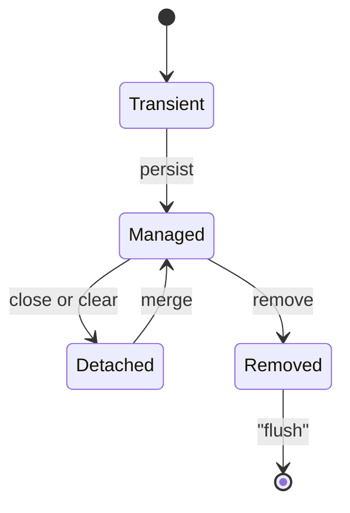
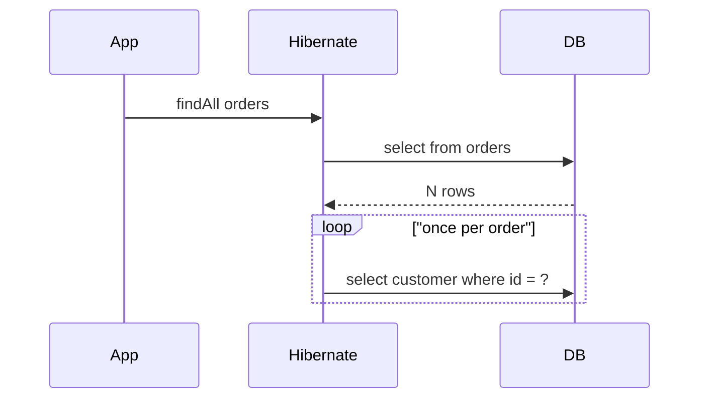

Hibernate performance is the highest-signal topic in a data-access interview because almost every real incident — slow endpoints, connection exhaustion, memory blowups — traces back to how Hibernate manages the persistence context and generates SQL. This page is the toolkit.

## The persistence context and entity states

The persistence context is a first-level cache and a unit of work scoped to a transaction. It tracks every managed entity, guarantees one object per row (identity), and batches SQL until flush.



- **Transient** — a new object the context does not know about.
- **Managed** — attached; changes are tracked and flushed.
- **Detached** — was managed, but the context closed.
- **Removed** — scheduled for `DELETE` at flush.

### Dirty checking

Because managed entities are tracked, changing a field issues an `UPDATE` at flush with **no `save` call**. Hibernate snapshots each entity on load and compares at flush.

```java
@Transactional
void rename(Long id, String name) {
    User u = repo.findById(id).orElseThrow();
    u.setName(name); // no save() needed; dirty checking emits UPDATE at commit
}
```

Flush happens before the transaction commits and, under `FlushModeType.AUTO`, before a query whose results your pending changes could affect. This is why an unexpected `UPDATE` can appear right before a `SELECT`.

> [!KEY]
> Say this out loud: "Hibernate flushes automatically before a conflicting query and at commit — I never call `save` to update a managed entity." It shows you understand the unit of work, not just the API.

## The N+1 problem

This is the single most-asked Hibernate question. You run one query for a list of parents, then Hibernate runs one more query per parent to load a lazy association — 1 + N queries.

```java
List<Order> orders = orderRepo.findAll();      // 1 query
for (Order o : orders) {
    o.getCustomer().getName();                 // N more queries, one per order
}
```

It also happens with `FetchType.EAGER` on a `@ManyToOne` combined with a list query: each row triggers a follow-up select.



You detect it with SQL logging, `spring.jpa.properties.hibernate.generate_statistics=true`, a datasource-proxy that counts queries, or Hypersistence Utils assertions in tests.

### The fix list

```java
@Query("select o from Order o join fetch o.customer")   // JOIN FETCH
List<Order> withCustomers();

@EntityGraph(attributePaths = "customer")               // declarative fetch
List<Order> findAll();
```

| Fix | Best when | Cost |
|---|---|---|
| `JOIN FETCH` | One or two associations, need them always | Cartesian blow-up if you fetch two collections |
| `@EntityGraph` | Same as fetch join but declarative and reusable | Same cartesian risk |
| `@BatchSize(size = n)` | Many parents, load children in `IN` batches | Still more than one query |
| Subselect fetching | Collection loaded for a whole result set | One extra query for all parents |
| DTO projection | Read-only screen needing few columns | No managed entities |
| Two queries and a map | Complex shapes, full control | Manual assembly code |

> [!DANGER]
> Never `JOIN FETCH` two collections in one query. The result is a cartesian product — `n * m` rows — and Hibernate cannot even paginate it in the database. Fetch one collection, batch the other.

### Why EAGER is almost always wrong

`FetchType.EAGER` loads the association every single time the entity is read, including on queries where you never touch it, and you **cannot un-eager it at query time** — the mapping wins. `LAZY` is the sane default; fetch eagerly per query with `JOIN FETCH` or `@EntityGraph` only where you need it. `@ManyToOne` and `@OneToOne` default to EAGER, so set them `LAZY` explicitly.

### LazyInitializationException and open-in-view

If you access a lazy association after the persistence context closed, you get `LazyInitializationException`. Spring Boot's default `spring.jpa.open-in-view=true` keeps the context — and a database connection — open for the whole HTTP request, hiding the exception.

> [!WARNING]
> `open-in-view=true` holds a connection from the pool for the entire request, including view rendering and slow serialization. Under load this exhausts the pool. A defensible senior opinion: turn it off, and fetch what each endpoint needs explicitly with fetch joins or DTOs.

## Second-level cache

The persistence context is per-transaction. The **second-level cache** (Ehcache, Hazelcast, Infinispan) is shared across transactions and sessions, with an optional **query cache** for query result ids. It helps for read-mostly reference data with high reuse. The invalidation risk is real: in a multi-node deployment each node has its own cache, so a write on node A leaves node B stale unless the cache is distributed or invalidation is broadcast. Reach for it deliberately, not by default.

## Batching and dynamic update

Hibernate can group inserts and updates into JDBC batches, cutting round trips.

```yaml
spring:
  jpa:
    properties:
      hibernate:
        jdbc:
          batch_size: 50
        order_inserts: true   # group same-type inserts so they batch
        order_updates: true
```

Batching needs the id up front, so `GenerationType.IDENTITY` silently disables it — use `SEQUENCE`. `@DynamicUpdate` makes Hibernate generate an `UPDATE` touching only changed columns instead of all of them, useful for wide tables with cheap partial writes (at the cost of not caching one static statement).

### Bulk operations and stateless batch loops

A bulk JPQL update runs in the database and bypasses the persistence context, so entities in memory go stale — pair it with `clearAutomatically`.

```java
@Modifying(clearAutomatically = true)
@Query("update Order o set o.status = 'CLOSED' where o.createdAt < :cutoff")
int closeOld(@Param("cutoff") Instant cutoff);
```

When looping over a large dataset to insert or update, flush and clear periodically so the persistence context does not grow until it triggers an `OutOfMemoryError`. A `StatelessSession` skips the context entirely for pure ETL.

```java
for (int i = 0; i < rows.size(); i++) {
    em.persist(rows.get(i));
    if (i % 50 == 0) { em.flush(); em.clear(); } // release tracked entities
}
```

## Locking

Concurrency control comes in two flavours.

| Aspect | Optimistic | Pessimistic |
|---|---|---|
| Mechanism | `@Version` column, check on write | Database row lock via `SELECT ... FOR UPDATE` |
| Failure | `OptimisticLockException` at commit | Blocks until the lock frees, or times out |
| Best for | Low contention, mostly reads | Hot rows, high contention |
| Cost | Cheap; retry on conflict | Holds a lock; risk of deadlock |

```java
@Lock(LockModeType.PESSIMISTIC_WRITE)
@Query("select a from Account a where a.id = :id")
Account lockForUpdate(@Param("id") Long id);
```

Default to optimistic locking with `@Version`; switch to `PESSIMISTIC_WRITE` only for genuinely contended rows like an inventory counter, and keep the locked transaction short.

## Connection pooling with HikariCP

HikariCP is the Boot default pool. Pool sizing is counter-intuitive: a **huge pool is slower**, because the database has a limited number of cores and disks, and excess connections just add context-switching and lock contention. Little's law gives a starting point — concurrency equals throughput times latency — and a common formula is roughly `cores * 2 + effective spindles`, often a pool of 10–20, not 200.

```yaml
spring:
  datasource:
    hikari:
      maximum-pool-size: 15
      connection-timeout: 3000    # fail fast rather than queue forever
      max-lifetime: 1700000       # shorter than the DB idle timeout
      leak-detection-threshold: 20000
```

Set `maxLifetime` shorter than the database's idle-connection timeout so the pool retires connections before the server kills them. `connectionTimeout` should fail fast. Leak detection logs a connection held too long.

> [!NOTE]
> A pool-exhaustion incident is almost always a **long-running transaction holding a connection**, not a pool that is too small. Look for a slow query, an external call inside a transaction, or `open-in-view` before you raise `maximum-pool-size`.

## Indexing and execution plans

Most "Hibernate is slow" tickets are missing indexes. Index the columns in `WHERE`, `JOIN` and `ORDER BY`; a composite index's column order matters (leftmost prefix). Read a plan with `EXPLAIN ANALYZE`: a sequential scan on a large table where you expected an index scan, a high estimated-versus-actual row gap, or a nested loop over millions of rows are the red flags. The query Hibernate generates is only as fast as the schema underneath it.

## Cheat sheet

- The persistence context is a first-level cache and unit of work; dirty checking emits `UPDATE` with no `save`.
- N+1 is the top question — detect with SQL logging or `generate_statistics`.
- Fix N+1 with `JOIN FETCH`, `@EntityGraph`, `@BatchSize`, subselect, or a DTO.
- Never fetch two collections in one join; you get a cartesian product.
- Make `@ManyToOne` and `@OneToOne` `LAZY`; you cannot un-eager at query time.
- `open-in-view=true` holds a connection for the whole request — turn it off.
- Batching needs `SEQUENCE` ids; `IDENTITY` disables it.
- Bulk JPQL bypasses the context — use `clearAutomatically`.
- Flush and clear in long loops to avoid `OutOfMemoryError`.
- Size Hikari small; pool exhaustion usually means a long transaction.

## Common mistakes

| Mistake | Fix |
|---|---|
| Accessing a lazy association in a loop | Fetch with `JOIN FETCH`, `@EntityGraph` or `@BatchSize` |
| `FetchType.EAGER` on associations | Make them `LAZY`; fetch per query |
| Relying on `open-in-view` to avoid lazy errors | Disable it; load what the endpoint needs |
| `JOIN FETCH` on two collections | Fetch one, batch the other |
| Batch inserts with `IDENTITY` ids | Use `SEQUENCE` so batching works |
| Bulk update without clearing the context | Add `clearAutomatically = true` |
| Loading millions of entities in one loop | `flush()` + `clear()` per batch or use `StatelessSession` |
| Raising the pool size to fix exhaustion | Find the long-held connection first |

## Summary

Hibernate performance comes down to understanding the persistence context: it caches, tracks and batches, and dirty checking means updates happen without a `save`. The N+1 problem dominates interviews — know how it arises from lazy loops and eager mappings, how to detect it, and the full fix list with trade-offs. Keep associations lazy, disable open-in-view, batch inserts with sequence ids, and clear the context in long loops. Choose optimistic locking by default, size HikariCP small, and remember that pool exhaustion usually signals a long transaction. Underneath it all, the right indexes and a readable execution plan decide whether any of this is fast.

## Top Interview Questions

### Q1. What is the persistence context and why does it matter for performance?

The persistence context is a first-level cache and unit of work bound to a transaction (or an `EntityManager`). It holds every managed entity, guarantees a single instance per database row within the transaction (identity guarantee), tracks changes for dirty checking, and batches SQL until flush. For performance this matters three ways: repeated `findById` for the same id in one transaction hits the cache and skips the database; changes accumulate and flush together rather than one statement at a time; and, dangerously, it grows as you load entities, so a loop over millions of rows without clearing it will run out of memory. Understanding that it is transaction-scoped — not shared across requests — is the key insight, and it is what distinguishes it from the second-level cache.

### Q2. Explain dirty checking and when the UPDATE actually fires.

When Hibernate loads an entity into the persistence context it takes a snapshot of its state. At flush time it compares each managed entity against its snapshot and generates an `UPDATE` for any that changed — with no explicit `save` call. The `UPDATE` fires at flush, which happens at transaction commit and, under the default `FlushModeType.AUTO`, before executing a query whose results your pending change could affect (so Hibernate does not return stale data). This is why you sometimes see an `UPDATE` immediately before a `SELECT` in the logs. The practical consequence: mutating a managed entity inside a `@Transactional` method persists automatically, and forgetting that a fetched entity is still managed is a common source of surprising writes.

### Q3. Walk me through the N+1 problem and how you detect it.

N+1 happens when you run one query to fetch a list of parents and then, for each of the N parents, Hibernate runs an additional query to load a lazy association — 1 + N queries where you wanted one or two. It also arises from `FetchType.EAGER` on a `@ManyToOne` combined with a list query, because each returned row triggers a follow-up select. You detect it by enabling SQL logging and watching the same statement repeat with different ids, by turning on `hibernate.generate_statistics` and reading the query count, by wrapping the datasource with datasource-proxy to assert a query budget, or by using Hypersistence Utils to fail a test when the count exceeds a threshold. The tell is a query count that scales with the size of your result set.

### Q4. Give me the full list of ways to fix N+1 and when each is right.

`JOIN FETCH` in JPQL loads the association in the same query — best for one or two associations you always need, but it cannot fetch two collections without a cartesian product. `@EntityGraph` is the declarative, reusable version of the same fetch join. `@BatchSize` loads lazy children in `IN`-clause batches, turning N queries into N/size — good when you have many parents. Subselect fetching loads a collection for the entire parent result set in one extra query. A DTO projection sidesteps the issue by selecting only the columns you need with no managed entities. Finally, two queries and an in-memory map give full control for complex shapes. The trade-off axis is: how many associations, do you always need them, and do you need managed entities or just data.

### Q5. Why is FetchType.EAGER almost always wrong?

EAGER loads the association every time the entity is read, even in queries and code paths that never touch it, so you pay for data you do not use — and it is a frequent hidden cause of N+1 on list queries. Worse, it is a mapping-level decision you cannot override at query time: there is no reliable way to make an EAGER association lazy for a specific query, whereas the reverse is easy. So the correct design is LAZY everywhere and fetch eagerly per query with `JOIN FETCH` or `@EntityGraph` exactly where a given use case needs the data. Since `@ManyToOne` and `@OneToOne` default to EAGER, you must set them LAZY explicitly. The one-liner: LAZY is a default you can always tighten; EAGER is a decision you cannot loosen.

### Q6. What is open-in-view, why is it on by default, and what is your opinion of it?

`spring.jpa.open-in-view=true` is a Boot default that keeps the persistence context open for the entire HTTP request, so lazy associations accessed during view rendering or serialization do not throw `LazyInitializationException`. It exists to make simple apps "just work." My opinion, which I would defend, is to turn it off: keeping the context open means holding a database connection from the pool for the whole request — including slow JSON serialization and view rendering — which under load exhausts the pool and couples connection lifetime to request latency. It also hides fetching problems by lazily loading whatever the view touches. With it off, each endpoint must fetch what it needs explicitly via fetch joins, entity graphs or DTOs, which surfaces N+1 during development instead of in production.

### Q7. A production endpoint intermittently exhausts the connection pool. How do you investigate?

I resist the urge to raise `maximum-pool-size` first, because exhaustion almost always means connections are held too long, not that the pool is too small. I enable HikariCP leak detection (`leak-detection-threshold`) to log stack traces of connections held beyond a threshold, and I check for the usual culprits: a long-running transaction, an external HTTP or messaging call made inside a `@Transactional` boundary, `open-in-view` holding a connection across slow serialization, or a slow query with a missing index. I also look at active-versus-idle connection metrics and transaction durations. Sizing follows Little's law — a small pool (often 10–20) plus fast transactions beats a huge pool. Only after confirming transactions are short and correctly scoped would I consider the pool size itself.

### Q8. How does JDBC batching work in Hibernate and what silently disables it?

With `hibernate.jdbc.batch_size` set, Hibernate groups multiple inserts or updates of the same type into a single JDBC batch, drastically cutting round trips; `order_inserts` and `order_updates` reorder statements so more of them are the same type and therefore batchable. The catch is that batching an insert requires knowing the primary key before execution, and `GenerationType.IDENTITY` only yields the key after the row is inserted — so Hibernate must execute each insert immediately and batching is silently disabled. The fix is `GenerationType.SEQUENCE` with a sensible `allocationSize`, which pre-allocates keys so a block of inserts can batch. So the combination to remember: to get batching you need sequence-based ids, batch size configured, and ordered statements.

### Q9. You must update ten million rows in a nightly job without running out of memory. How?

I would not load ten million managed entities into a single persistence context — that grows unbounded and triggers `OutOfMemoryError`. If the update is expressible as a set-based statement, a single bulk JPQL or native `UPDATE` (via `@Modifying`) does it in the database with `clearAutomatically` to evict any stale entities. If it requires per-row logic, I process in pages and, inside the loop, call `flush()` then `clear()` every N rows (matching the batch size) to send pending changes and detach processed entities so they can be garbage-collected. For pure ETL with no need for dirty checking, a `StatelessSession` skips the persistence context entirely. I also make the job restartable and chunked so a failure does not force reprocessing everything.

### Q10. Compare optimistic and pessimistic locking and how you choose.

Optimistic locking adds a `@Version` column; on update Hibernate appends `WHERE version = ?` and, if the row changed under you, throws `OptimisticLockException` so you retry — no locks are held during the read, so it scales well under low contention. Pessimistic locking takes a real database lock with `SELECT ... FOR UPDATE` (`PESSIMISTIC_WRITE`), blocking other writers until you commit — correct for hot, highly contended rows but it serializes access and risks deadlocks. I default to optimistic because most workloads are read-heavy with rare conflicts and retries are cheap. I switch to pessimistic only for genuinely contended resources like a shared counter or inventory decrement, and then I keep the locked transaction as short as possible and always order lock acquisition consistently to avoid deadlocks.

### Q11. How should you size a HikariCP pool, and why is bigger not better?

Bigger is not better because the database can only truly execute as many statements in parallel as it has cores and I/O channels; beyond that, extra connections just add context-switching, lock contention and memory overhead, so latency gets worse. Little's law gives the reasoning — required concurrency equals arrival rate times service time — and a well-known heuristic starts around `cores * 2 + effective spindles`, which for many services lands at a pool of 10–20, not hundreds. I also set `connectionTimeout` low to fail fast instead of queuing forever, `maxLifetime` shorter than the database's idle timeout so connections are retired before the server kills them, and leak detection to catch held connections. The mindset is to make transactions short so a small pool suffices.

### Q12. When is the second-level cache worth it, and what is the risk in a multi-node deployment?

The second-level cache (Ehcache, Hazelcast, Infinispan) is shared across transactions and sessions, so it pays off for read-mostly reference data with high reuse and low churn — currency lists, configuration, catalog metadata — where you avoid repeated database hits. It is not worth it for write-heavy or rarely-reused data, where invalidation cost outweighs the benefit. The main risk is staleness in a multi-node deployment: each application node has its own cache, so a write on node A leaves the cached copy on node B out of date unless you use a distributed cache or broadcast invalidation. The query cache adds further fragility because it must be invalidated whenever any table it touches changes. So enable it deliberately, measure the hit ratio, and be honest that it introduces a distributed consistency problem.
