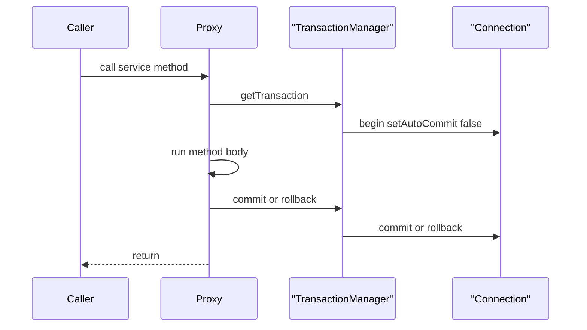
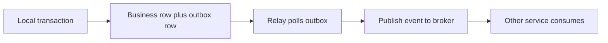

Transactions are where Spring's proxy magic meets database semantics, and interviewers love the topic because so much of it is counter-intuitive. This page covers how `@Transactional` actually works and the handful of traps that get asked in almost every senior Spring interview.

## ACID and how @Transactional works

ACID in three lines: **Atomicity** — all statements commit or none do; **Consistency** — constraints hold across the transaction; **Isolation** — concurrent transactions do not corrupt each other; **Durability** — a commit survives a crash.

`@Transactional` is not database magic; it is a Spring AOP proxy. When you call an annotated method, the proxy opens a transaction through a `PlatformTransactionManager`, binds a database connection to the current thread, runs your method, then commits or rolls back.



> [!KEY]
> The transaction lives in the proxy, not your code. That single fact explains the self-invocation trap, the rollback rule and why boundaries belong in the service layer.

## The self-invocation trap

Because the advice lives in the proxy, a call that does not go through the proxy is not advised.

```java
@Service
class OrderService {
    public void process() {
        this.save(); // self-call: bypasses the proxy, @Transactional ignored
    }
    @Transactional
    public void save() { /* runs with NO transaction */ }
}
```

An internal `this.save()` reaches the target object directly, so the annotation does nothing. The same applies to `private`, `final` and `static` methods — the proxy cannot advise them (a CGLIB proxy subclasses your bean, so it cannot override `final` or `private`). Fixes: move the transactional method to another bean and inject it, self-inject the proxy, or use `TransactionTemplate` programmatically.

> [!DANGER]
> A `@Transactional` method called from within the same class does nothing at all — no error, no transaction. This is the most common "why didn't it roll back" bug in Spring.

## Rollback rules

By default Spring rolls back only on `RuntimeException` and `Error`, **not** on checked exceptions. This surprises everyone the first time.

```java
@Transactional(rollbackFor = Exception.class) // roll back on checked exceptions too
public void transfer() throws IOException { /* ... */ }
```

The historical reason: checked exceptions are treated as recoverable business outcomes, unchecked as programming errors. If a checked exception should abort the transaction, add `rollbackFor = Exception.class`; to *not* roll back on a specific runtime exception, use `noRollbackFor`.

### The swallowed exception trap

If code inside a transactional method throws and you catch it but the transaction is already marked rollback-only, commit fails with `UnexpectedRollbackException`.

```java
@Transactional
public void outer() {
    try {
        inner.doWork(); // @Transactional(REQUIRES_NEW or same) throws
    } catch (Exception e) {
        log.warn("ignored", e); // swallowed, but tx is now rollback-only
    }
    // commit here -> UnexpectedRollbackException
}
```

A participating inner transaction that fails marks the *shared* transaction rollback-only; swallowing the exception does not un-mark it, so the outer commit still fails.

## Propagation

Propagation decides what happens when a transactional method calls another. Seven modes:

| Mode | If a transaction exists | If none exists |
|---|---|---|
| `REQUIRED` (default) | Join it | Start a new one |
| `REQUIRES_NEW` | Suspend it, start a new one | Start a new one |
| `NESTED` | Savepoint inside it | Start a new one |
| `SUPPORTS` | Join it | Run non-transactionally |
| `NOT_SUPPORTED` | Suspend it, run non-transactionally | Run non-transactionally |
| `MANDATORY` | Join it | Throw an exception |
| `NEVER` | Throw an exception | Run non-transactionally |

`REQUIRES_NEW` opens a **separate physical connection** and commits independently — great for "log the failure even though the business transaction rolls back," but risky because it holds two connections at once and an outer-then-inner lock ordering can deadlock. `NESTED` uses a savepoint: the inner work can roll back to the savepoint without killing the outer transaction, but it needs JDBC savepoint support.

```java
@Transactional(propagation = Propagation.REQUIRES_NEW)
public void auditFailure(String reason) {
    auditRepo.save(new Audit(reason)); // commits even if the caller rolls back
}
```

## Isolation levels

Isolation trades consistency against concurrency. Each level prevents specific anomalies.

| Level | Dirty read | Non-repeatable read | Phantom read |
|---|---|---|---|
| `READ_UNCOMMITTED` | ✅ possible | ✅ possible | ✅ possible |
| `READ_COMMITTED` | ❌ prevented | ✅ possible | ✅ possible |
| `REPEATABLE_READ` | ❌ prevented | ❌ prevented | ✅ possible |
| `SERIALIZABLE` | ❌ prevented | ❌ prevented | ❌ prevented |

A **dirty read** sees another transaction's uncommitted change; a **non-repeatable read** gets different values for the same row read twice; a **phantom read** gets different rows for the same query because another transaction inserted. Real defaults differ: **PostgreSQL** uses `READ COMMITTED`, **MySQL InnoDB** uses `REPEATABLE READ`. Both implement reads with **MVCC** — multi-version concurrency control keeps prior row versions so readers never block writers, which is why `READ COMMITTED` in PostgreSQL is cheap.

```java
@Transactional(isolation = Isolation.REPEATABLE_READ)
public Report build() { /* two reads of the same row are consistent */ }
```

## readOnly, timeout and boundaries

`@Transactional(readOnly = true)` is more than a hint: for Hibernate it sets `FlushMode.MANUAL`, so there is no dirty checking and no flush, saving work on read paths, and it lets a routing datasource send the query to a **read replica**.

```java
@Transactional(readOnly = true, timeout = 5) // abort if it runs over 5 seconds
public List<Order> recent() { return repo.findTop50ByOrderByCreatedAtDesc(); }
```

Transaction boundaries belong in the **service layer** — not the controller (it has no business unit of work) and not the repository (too fine-grained). Keep them short: never hold a transaction open across an HTTP call to another service, because that pins a connection while you wait on the network.

> [!WARNING]
> Do not make a remote HTTP or messaging call inside a transaction. The connection stays checked out for the whole round trip; a slow dependency then drains the pool.

### Programmatic control and safe side effects

For fine control, `TransactionTemplate` runs a block transactionally without annotations.

```java
txTemplate.execute(status -> {
    repo.save(order);
    return null;
});
```

To publish a side effect only after the data is durably committed, use `@TransactionalEventListener(phase = AFTER_COMMIT)`. This avoids sending an event (an email, a Kafka message) that references data a later rollback erased.

## Distributed transactions

Across microservices you cannot wrap two databases in one transaction cheaply. **Two-phase commit (2PC)** exists but is avoided: it is slow, blocks on the coordinator, and scales badly. The real answers are the **outbox pattern** — write the business change and an event row in the same local transaction, then a relay publishes the event — and the **saga** — a sequence of local transactions with compensating actions to undo earlier steps if a later one fails.



## Testing pitfall

`@Transactional` on a test rolls back after each test so the database stays clean. That convenience can **hide bugs**: constraint violations that only fire on real commit, and flush-timing issues, never surface. For integration tests that exercise commit behaviour, disable the rollback or use `@Commit`.

## Cheat sheet

- `@Transactional` is an AOP proxy; the transaction lives in the proxy, not your code.
- Self-invocation (`this.method()`) bypasses the proxy — the annotation does nothing.
- `private`, `final` and `static` methods are not advised.
- Default rollback is only on `RuntimeException` and `Error`; add `rollbackFor = Exception.class` for checked ones.
- Swallowing an inner exception leaves the tx rollback-only — `UnexpectedRollbackException` at commit.
- `REQUIRES_NEW` uses a separate connection; use it to log despite a rollback.
- `NESTED` uses savepoints; `MANDATORY`/`NEVER` assert on an existing transaction.
- PostgreSQL defaults to `READ COMMITTED`, MySQL InnoDB to `REPEATABLE READ`; both use MVCC.
- `readOnly = true` disables Hibernate flush and can route to a replica.
- Put boundaries in the service layer, keep them short, no remote calls inside.
- Prefer outbox and saga over two-phase commit across services.

## Common mistakes

| Mistake | Fix |
|---|---|
| Calling a `@Transactional` method from the same class | Move it to another bean or self-inject the proxy |
| Expecting rollback on a checked exception | Add `rollbackFor = Exception.class` |
| Catching and swallowing an inner transactional failure | Let it propagate, or use `REQUIRES_NEW` for the inner work |
| `@Transactional` on a `private` or `final` method | Make it public and proxyable |
| Remote HTTP call inside a transaction | Move the call outside the transactional boundary |
| Transaction boundaries in the controller | Put them in the service layer |
| Publishing an event before commit | Use `@TransactionalEventListener(AFTER_COMMIT)` |
| Relying on test rollback for all coverage | Add tests that actually commit |

## Summary

`@Transactional` is a proxy that opens a transaction, binds a connection to the thread, and commits or rolls back — so self-invocation, checked-exception rollback rules, and boundary placement all follow from how proxies work. Master the propagation table (especially `REQUIRES_NEW` and `NESTED`) and the isolation table against the three read anomalies, and know the real database defaults and MVCC. Keep transactions short and in the service layer, never wrap a remote call, and use `readOnly` and `AFTER_COMMIT` events deliberately. Across services, drop two-phase commit in favour of the outbox pattern and sagas. These are among the most reliably asked questions in a Spring interview.

## Top Interview Questions

### Q1. How does @Transactional actually work under the hood?

Spring wraps the bean in an AOP proxy (a CGLIB subclass or a JDK dynamic proxy). When you call an annotated method through that proxy, a transaction interceptor asks the configured `PlatformTransactionManager` to start a transaction, which begins a database transaction and binds the connection to the current thread via a thread-local so that the same connection is reused for every query in the method. The proxy then runs your method body; on normal return it tells the manager to commit, and on a matching exception it tells it to roll back. The crucial consequence is that the transactional behaviour is entirely in the proxy layer, which is why a call that does not pass through the proxy — a self-invocation — gets no transaction at all. Understanding the proxy is understanding almost every transaction gotcha.

### Q2. Why does @Transactional not roll back on a checked exception?

By default Spring rolls back only on unchecked exceptions — `RuntimeException` and `Error` — and commits on checked exceptions. The design rationale, inherited from EJB conventions, is that checked exceptions represent anticipated, potentially recoverable business conditions, while unchecked exceptions represent programming errors that should abort the unit of work. In practice this trips people up constantly: you throw a checked `IOException` or a custom checked business exception expecting a rollback, and the transaction commits your partial work. The fix is explicit: `@Transactional(rollbackFor = Exception.class)` makes it roll back on checked exceptions too, and `noRollbackFor` does the reverse for a specific runtime exception you want to tolerate. This is one of the highest-frequency Spring interview questions, so state the default and the override clearly.

### Q3. Explain the self-invocation problem and how to fix it.

Because `@Transactional` is applied by a proxy, only calls that arrive through the proxy are intercepted. When a method inside a bean calls another method of the same bean with `this.method()`, that call goes straight to the target object and bypasses the proxy entirely, so the annotation on the called method is silently ignored — no transaction is started, and there is no warning. The same limitation blocks `private`, `final` and `static` methods, which a CGLIB proxy cannot override. Fixes: extract the transactional method into a separate bean and inject it (the cleanest), inject the bean into itself so you can call `self.method()` through the proxy, or use `TransactionTemplate` to run the logic programmatically. In interviews, naming this as "the number-one reason a transaction silently doesn't apply" scores well.

### Q4. What is UnexpectedRollbackException and how does it happen?

It is thrown at commit time when the transaction has already been marked rollback-only but the code tried to commit anyway. The classic path: an outer `@Transactional` method calls an inner transactional method that participates in the same physical transaction (propagation `REQUIRED`). The inner method throws, which marks the shared transaction rollback-only. The outer method catches and swallows that exception — thinking it recovered — and proceeds to return normally, so Spring attempts to commit. Since the transaction is rollback-only, the manager refuses and throws `UnexpectedRollbackException`. The lesson is that once a participating transaction is marked for rollback, no amount of catching in the caller can un-mark it. The fixes are to let the exception propagate, or to run the inner work in a `REQUIRES_NEW` transaction so its failure does not taint the outer one.

### Q5. Compare REQUIRED, REQUIRES_NEW and NESTED with a scenario for each.

`REQUIRED` (the default) joins an existing transaction or starts one — use it for normal service methods that should share one unit of work, like debiting one account and crediting another so both commit together. `REQUIRES_NEW` suspends any current transaction and runs in a brand-new one on a separate connection that commits independently — the canonical use is writing an audit or failure log that must persist even if the business transaction rolls back. `NESTED` creates a savepoint inside the current transaction; the nested work can roll back to the savepoint without aborting the outer transaction, useful when you want to attempt an optional step and continue if it fails. The trade-offs: `REQUIRES_NEW` holds two connections simultaneously and can deadlock if lock ordering conflicts, and `NESTED` needs JDBC savepoint support and only works within a single resource.

### Q6. Walk through the isolation levels and the anomalies they prevent.

There are four standard levels defending against three anomalies. `READ_UNCOMMITTED` allows dirty reads — seeing another transaction's uncommitted data. `READ_COMMITTED` prevents dirty reads but allows non-repeatable reads, where reading the same row twice yields different committed values. `REPEATABLE_READ` also prevents non-repeatable reads but can still allow phantom reads, where a range query returns new rows inserted by another transaction. `SERIALIZABLE` prevents all three by making transactions behave as if run one at a time. The real-world defaults matter: PostgreSQL defaults to `READ COMMITTED` and MySQL's InnoDB to `REPEATABLE READ`, and both use MVCC so readers see a consistent snapshot without blocking writers. Higher isolation costs concurrency, so pick the lowest level that prevents the anomaly your business logic actually cares about.

### Q7. What does readOnly = true really do?

It is more than documentation. For a JPA/Hibernate transaction, `readOnly = true` sets the Hibernate `FlushMode` to `MANUAL`, which disables automatic dirty checking and flushing — Hibernate will not scan managed entities for changes or emit `UPDATE` statements, saving CPU on read-heavy paths and preventing accidental writes. At the JDBC level Spring can mark the connection read-only, which some drivers and databases optimise. And in a setup with a routing datasource (for example `AbstractRoutingDataSource` keyed on the read-only flag), it routes the query to a read replica, offloading the primary. So the honest answer is: it optimises Hibernate flushing, signals intent, and enables replica routing — but it is not a hard guarantee against writes at the database level unless the connection itself is set read-only.

### Q8. Where should transaction boundaries live and how long should they be?

Boundaries belong in the service layer, because that is where a business unit of work is defined — the method that must succeed or fail as a whole. The controller is the wrong place (it deals with HTTP, not a business transaction, and often orchestrates multiple services) and the repository is too fine-grained (each method would be its own transaction, defeating atomicity across operations). Transactions should also be as short as possible: every open transaction holds a database connection from the pool, so a long transaction reduces available concurrency. In particular, never perform a remote HTTP or messaging call inside a transaction — the connection stays checked out for the whole network round trip, and a slow dependency can drain the pool. Do the remote work before or after the transactional block, or use an after-commit event.

### Q9. How do you publish an event or send a message only after a transaction commits?

Use `@TransactionalEventListener` with `phase = TransactionPhase.AFTER_COMMIT`. If you publish a side effect — an email, a Kafka message, a webhook — inside the transaction and the transaction later rolls back, the side effect has already escaped and now references data that no longer exists, an inconsistency you cannot undo. An after-commit listener defers the handler until the transaction has durably committed, so the event only fires when the data is real. The subtlety to mention is that the event is published within the transaction but the listener runs after commit, and by default a new transaction is not started for the listener, so if it needs to write to the database you configure it to run in its own transaction. For cross-service delivery guarantees, combine this with the outbox pattern rather than relying on the listener alone.

### Q10. How do you handle a transaction that must span two microservices?

You avoid a true distributed transaction. Two-phase commit can technically coordinate two resource managers, but it is slow, holds locks across the prepare-commit window, blocks if the coordinator fails, and scales poorly, so it is avoided in modern microservices. The practical patterns are the outbox and the saga. With the outbox, each service writes its business change and an event record in the same local database transaction, guaranteeing atomicity locally; a relay process then reads the outbox and publishes the event to a broker with at-least-once delivery. A saga models the overall workflow as a sequence of local transactions, each with a compensating action, so if step three fails, the sagas runs compensations to undo steps two and one. Both trade strict ACID for eventual consistency, which is the accepted design for distributed systems.

### Q11. A colleague reports that a @Transactional method is not rolling back. How do you debug it?

I work through a short checklist. First, is the method called from within the same class? Self-invocation bypasses the proxy, so the annotation never applies — this is the most common cause. Second, is the method `public`? Proxies cannot advise `private`, `final` or `static` methods. Third, what exception is thrown? If it is a checked exception, the default rules commit rather than roll back unless `rollbackFor` is set. Fourth, is the exception being caught and swallowed somewhere inside, so the transaction manager never sees it? Fifth, is there actually a transaction manager configured for the resource in play, and is the bean a Spring-managed proxy at all (not a `new` instance)? Enabling transaction debug logging shows whether a transaction is created and what triggers the commit-versus-rollback decision, which usually pinpoints the cause quickly.

### Q12. Why can testing with @Transactional hide bugs, and what would you do about it?

The Spring Test framework rolls back the transaction after each test by default so the database is left clean and tests do not interfere. The problem is that many failures only occur at real commit time: deferred constraint checks, database triggers, unique-constraint violations that fire on flush/commit, and flush-ordering issues can all pass in a rolled-back test and then fail in production. Because commit never happens, that whole class of bugs is invisible. To address it, I add a subset of integration tests that actually commit — using `@Commit` or disabling the rollback — ideally against a real database engine via Testcontainers rather than an in-memory substitute whose SQL dialect differs. I also test that the transactional boundaries and rollback rules behave as intended, since those are exactly the behaviours the default rollback masks.
