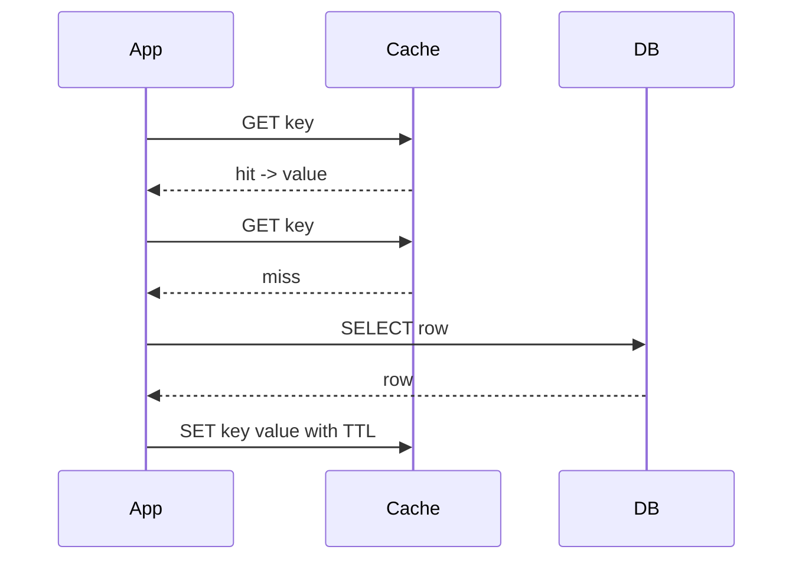
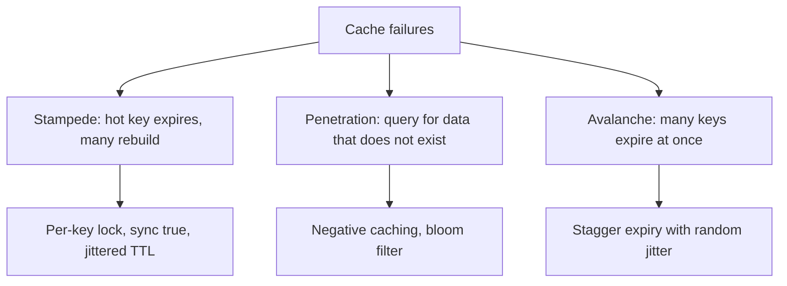

Caching turns an expensive lookup into a cheap one, and Spring makes it a few annotations. The senior skill is knowing the honest costs — staleness, invalidation, memory, an extra failure mode — and choosing the right provider, pattern and invalidation strategy for a multi-instance deployment.

## Why cache and what it costs

You cache to cut latency and load: a value that is expensive to compute or fetch, read far more often than it changes, is a cache candidate. But every cache adds problems.

| Benefit | Cost |
|---|---|
| Lower latency on reads | Staleness — the cache can lag the source of truth |
| Less load on the database | Invalidation is genuinely hard to get right |
| Higher throughput | Extra memory and a new component that can fail |

> [!KEY]
> There are only two hard problems in caching: invalidation and knowing when the win is worth the added complexity. Name the cost, not just the benefit, in an interview.

## The Spring Cache abstraction

`@EnableCaching` turns on a proxy that intercepts annotated methods. The abstraction is provider-agnostic — the same annotations work over an in-memory map, Caffeine or Redis.

```java
@Service
@CacheConfig(cacheNames = "products")
class ProductService {

    @Cacheable(key = "#id", unless = "#result == null", sync = true)
    public Product find(Long id) { return repo.findById(id).orElse(null); }

    @CachePut(key = "#p.id")            // always runs, updates the cache
    public Product save(Product p) { return repo.save(p); }

    @CacheEvict(key = "#id")            // remove one entry
    public void delete(Long id) { repo.deleteById(id); }

    @CacheEvict(allEntries = true)     // clear the whole cache region
    public void reloadAll() { /* ... */ }
}
```

- `@Cacheable` — return the cached value if present, otherwise run the method and store the result.
- `@CachePut` — always run the method and update the cache (for writes).
- `@CacheEvict` — remove an entry, or `allEntries = true` to clear the region.
- `@Caching` — combine several cache operations on one method.
- `@CacheConfig` — share cache names across a class.

The `key` is a SpEL expression; without one Spring derives a key from the method arguments. `condition` decides whether to cache *before* the call; `unless` decides *after*, seeing `#result`. `sync = true` makes concurrent callers for the same key wait for one computation instead of stampeding.

> [!DANGER]
> The cache abstraction is proxy-based, exactly like `@Transactional`. A `@Cacheable` method called from within the same class bypasses the proxy and is never cached. Move it to another bean or self-inject.

## Providers behind the abstraction

The same annotations sit over very different engines. The critical axis is local versus distributed.

| Provider | Scope | Use when |
|---|---|---|
| `ConcurrentMapCacheManager` | Local, unbounded | Default; dev and tests only — no eviction |
| Caffeine | Local, in-process | Fast per-instance cache with size and TTL eviction |
| Redis | Distributed, shared | Many instances must see the same cached data |

```yaml
spring:
  cache:
    type: caffeine
    caffeine:
      spec: maximumSize=10000,expireAfterWrite=5m
```

A **local** cache (Caffeine) lives in one JVM; in a deployment with ten instances you get ten independent caches, so an evict on instance A leaves instance B stale. A **distributed** cache (Redis) is shared, so every instance reads and invalidates the same data — at the cost of a network hop per access. Many systems run both: Caffeine as a near cache in front of Redis.

## Configuring Redis

`spring-boot-starter-data-redis` uses **Lettuce** (Netty-based, thread-safe) by default; Jedis is the alternative. For caching, configure `RedisCacheManager` with per-cache TTL and a JSON serialiser — never the default JDK serialisation, which is slow, fragile across class changes, and unreadable in `redis-cli`.

```java
@Bean
RedisCacheManager cacheManager(RedisConnectionFactory cf) {
    var json = new GenericJackson2JsonRedisSerializer();
    var base = RedisCacheConfiguration.defaultCacheConfig()
        .serializeValuesWith(SerializationPair.fromSerializer(json))
        .entryTtl(Duration.ofMinutes(10));
    return RedisCacheManager.builder(cf)
        .cacheDefaults(base)
        .withCacheConfiguration("products", base.entryTtl(Duration.ofHours(1)))
        .build();
}
```

For direct access, `RedisTemplate` (or `StringRedisTemplate` for string keys and values) gives you the full command set, and `ReactiveRedisTemplate` does the same on a reactive stack. Spring Data Redis repositories map objects to hashes for simple CRUD.

## Redis data structures

Redis is not just a string store. Knowing which structure fits which problem is a common question.

| Type | Good for |
|---|---|
| String | Cached values, counters (`INCR`), flags |
| Hash | An object's fields without serialising the whole thing |
| List | Queues and recent-activity feeds |
| Set | Membership and de-duplication |
| Sorted set | Leaderboards and sliding-window rate limiting (score = timestamp) |
| Stream | An append-only log with consumer groups |

Every key can have a **TTL**. When memory hits `maxmemory`, the **eviction policy** decides what goes:

- `allkeys-lru` — evict least-recently-used across all keys (good general cache).
- `volatile-ttl` — evict keys with a TTL, shortest first.
- `noeviction` — reject writes when full (safe for a datastore, dangerous for a cache).

```yaml
spring:
  data:
    redis:
      host: cache.internal
      port: 6379
      lettuce:
        pool:
          max-active: 16
```

## Caching patterns

How reads and writes flow through the cache defines the pattern.

| Pattern | How it works | Trade-off |
|---|---|---|
| Cache-aside | App reads cache, on miss loads DB and populates | Simple, default; brief staleness window |
| Read-through | Cache library loads from DB on miss | Cleaner code; needs provider support |
| Write-through | Write goes to cache then DB synchronously | Consistent; slower writes |
| Write-behind | Write to cache, flush to DB async | Fast writes; risk of data loss on crash |

**Cache-aside** is the default and what `@Cacheable` implements: on a miss you compute and store, on a write you evict. Write-behind is fastest but loses data if the process dies before the flush, so reserve it for tolerant workloads like metrics.



## The three classic failures

These come up in almost every caching interview. Know the name, the cause and the fix.



- **Cache stampede / thundering herd** — a popular key expires and thousands of concurrent requests all miss and rebuild it at once, hammering the database. Fix with per-key locking, `sync = true`, request coalescing, or jittered TTLs so keys do not expire together.
- **Cache penetration** — requests for keys that do not exist (often malicious) always miss and always hit the database. Fix by negative-caching the "not found" result with a short TTL, or a bloom filter to reject unknown keys cheaply.
- **Cache avalanche** — a large set of keys created together expire together, dumping load on the database in a spike. Fix by staggering expiry with a random jitter added to each TTL.

> [!WARNING]
> Setting the same TTL on a batch of keys loaded together causes an avalanche when they all expire in the same second. Add jitter — for example `ttl + random(0, 60s)`.

## Invalidation, locks and rate limiting

Invalidation strategy is where caches go wrong. The pragmatic rule: **TTL plus explicit eviction beats cleverness.** Let a modest TTL bound staleness, and evict explicitly on writes you know about; do not try to keep the cache perfectly in sync with elaborate event pipelines unless correctness truly demands it.

Redis can back a **distributed lock**, but be honest about the caveat: `SET key value NX EX 30` (SETNX with a TTL) gives mutual exclusion most of the time, but it is not a correctness guarantee — clock skew, a paused process, or a lock expiring mid-work can let two holders run. Redisson implements the more careful Redlock approach and lock renewal, but for true correctness use a database or a consensus system, and treat the Redis lock as best-effort.

Redis is also ideal for **idempotency keys** (store the key with a TTL; reject a duplicate request) and **rate limiting** (a sorted set or an `INCR` with an expiring window). Monitor the **hit ratio** — hits over total lookups; a persistently low ratio means the TTL is too short, the key space is too sparse, or the data simply is not reused enough to cache.

## Cheat sheet

- Cache read-heavy, rarely-changing, expensive-to-produce data; name the staleness cost.
- `@EnableCaching` is proxy-based — a self-invoked `@Cacheable` method is not cached.
- `condition` filters before the call; `unless` filters after, seeing `#result`.
- Use `sync = true` to stop a stampede on one key.
- Caffeine is local per-instance; Redis is shared across instances.
- Configure Redis with a JSON serialiser and per-cache TTL, not JDK serialisation.
- Lettuce is the default Redis client; Jedis is the alternative.
- Pick the right structure: sorted set for leaderboards and rate limiting.
- Cache-aside is the default pattern; write-behind risks data loss.
- Jitter TTLs to avoid avalanche; negative-cache to avoid penetration.
- A Redis `SETNX` lock is best-effort, not a correctness guarantee.

## Common mistakes

| Mistake | Fix |
|---|---|
| `@Cacheable` method called from the same class | Move it to another bean or self-inject the proxy |
| Using the default `ConcurrentMapCacheManager` in production | Use Caffeine or Redis with eviction |
| Local Caffeine cache in a multi-instance deployment | Use Redis so all instances share state |
| JDK serialisation of Redis values | Configure a JSON serialiser |
| Same TTL on a batch of keys | Add random jitter to avoid an avalanche |
| Repeated misses for non-existent keys | Negative-cache the miss or add a bloom filter |
| One hot key rebuilt by a thousand callers | `sync = true` or per-key locking |
| Trusting a Redis lock for correctness | Treat it as best-effort; use a DB for real guarantees |

## Summary

Spring's cache abstraction gives you `@Cacheable`, `@CachePut` and `@CacheEvict` over any provider, but it is proxy-based, so self-invocation defeats it just like `@Transactional`. The provider choice is the real decision: Caffeine for a fast local cache, Redis for a shared distributed one, and often both. Configure Redis with a JSON serialiser and per-cache TTL, pick data structures that fit the job, and default to the cache-aside pattern. Above all, plan for the three failures — stampede, penetration, avalanche — with `sync`, negative caching and jittered TTLs, keep invalidation simple with TTL plus explicit eviction, and stay honest that a Redis lock is best-effort.

## Top Interview Questions

### Q1. What does the Spring Cache abstraction give you, and what is the catch?

`@EnableCaching` activates a proxy that intercepts methods annotated with `@Cacheable`, `@CachePut` and `@CacheEvict`, and delegates to a pluggable `CacheManager`, so the same annotations work over an in-memory map, Caffeine or Redis without changing your code. `@Cacheable` returns a stored value or runs the method and caches the result; `@CachePut` always runs and updates the cache; `@CacheEvict` removes entries. Keys come from a SpEL `key` expression or are derived from the arguments, and `condition`/`unless` gate caching before and after the call. The catch is that it is proxy-based exactly like `@Transactional`: a `@Cacheable` method invoked from within the same class bypasses the proxy and is never cached. So the abstraction is convenient but you must respect the proxy boundary and, more importantly, still own the invalidation and provider decisions yourself.

### Q2. Explain condition versus unless, and when you would use sync = true.

`condition` is evaluated before the method runs and decides whether caching applies at all — for example `condition = "#id > 0"` skips caching for invalid ids without ever consulting or populating the cache. `unless` is evaluated after the method returns and can see the result via `#result`, so `unless = "#result == null"` stores everything except nulls, avoiding caching a "not found." The difference matters because `condition` cannot reference the result and `unless` can. `sync = true` addresses a concurrency problem: without it, many threads missing on the same key all execute the method simultaneously (a local stampede); with it, Spring ensures only one thread computes the value while the others wait and then share it. Use `sync` for expensive computations behind a hot key, keeping in mind it is a per-instance guarantee, not a cluster-wide one.

### Q3. What is the difference between a local and a distributed cache, and why does it matter?

A local cache such as Caffeine lives inside a single JVM's heap, so access is a fast in-process lookup with no network hop. A distributed cache such as Redis is a separate shared service that every application instance reads from and writes to over the network. The difference becomes critical in a multi-instance deployment: with a local cache, each of your ten instances has its own independent copy, so a write or eviction on one instance does not reach the others and they serve stale data until their own entries expire. A distributed cache gives every instance a single shared view, so invalidation is consistent, at the cost of a network round trip and a new dependency. A common hybrid is a small Caffeine near-cache in front of Redis to get local speed with shared correctness, accepting a short local staleness window.

### Q4. How would you configure Redis as a cache in Spring Boot, and what serialiser would you use?

I add `spring-boot-starter-data-redis`, which uses the Lettuce client by default, and define a `RedisCacheManager` bean. On it I set sensible per-cache TTLs — a default of, say, ten minutes and longer or shorter overrides per cache region — because unbounded cache entries are a memory and staleness risk. Critically I configure a JSON serialiser such as `GenericJackson2JsonRedisSerializer` for values rather than the default JDK serialisation. JDK serialisation is slow, breaks when the class shape changes (serialVersionUID mismatches), and stores opaque bytes you cannot inspect with `redis-cli`; JSON is portable, debuggable and version-tolerant. I would also set the connection pool sizing on Lettuce and ensure keys are namespaced per cache. For direct programmatic access beyond the abstraction, I use `RedisTemplate` or `StringRedisTemplate`.

### Q5. Which Redis data structures would you use for a leaderboard and for rate limiting?

Both map naturally to the **sorted set**, which stores members ordered by a numeric score. For a leaderboard the score is the player's points; `ZADD` updates a score, `ZREVRANGE` returns the top N in order, and `ZREVRANK` gives a player's rank — all efficiently, without re-sorting. For sliding-window rate limiting, I use a sorted set per user where the score is the request timestamp: on each request I add the current timestamp, remove entries older than the window with `ZREMRANGEBYSCORE`, and count the remaining members with `ZCARD` to decide whether the limit is exceeded, setting a TTL so the key self-cleans. A simpler fixed-window limiter can use a plain string counter with `INCR` and an `EXPIRE`. Choosing the sorted set shows you understand that Redis structures encode the algorithm, not just the storage.

### Q6. Describe cache-aside and how it differs from write-through and write-behind.

In cache-aside the application owns the cache: on a read it checks the cache, and on a miss it loads from the database and populates the cache; on a write it updates the database and evicts (or updates) the cache entry. This is what Spring's `@Cacheable`/`@CacheEvict` implement and is the sensible default, with a brief staleness window between a database write and the cache eviction propagating. Write-through routes writes through the cache, which synchronously persists to the database, keeping the two consistent at the cost of slower writes. Write-behind (write-back) writes only to the cache and flushes to the database asynchronously in the background, giving very fast writes but risking data loss if the process crashes before the flush and adding ordering complexity. I default to cache-aside and only reach for write-behind on loss-tolerant, high-write workloads like metrics or counters.

### Q7. What is a cache stampede and how do you prevent it?

A cache stampede, or thundering herd, happens when a popular key expires and a large number of concurrent requests all miss at the same instant and simultaneously rebuild the same value, overwhelming the database with duplicate expensive work exactly when the cache was supposed to protect it. There are several complementary fixes. Per-key locking or request coalescing lets one caller rebuild the value while the rest wait for it, which Spring exposes as `sync = true` at the instance level and Redisson or a Redis lock can do cluster-wide. Serving a slightly stale value while one background task refreshes it (early recomputation before expiry) avoids the cliff entirely. And jittering the TTL so hot keys do not all expire on the same schedule spreads the rebuild load. The goal is to ensure a miss triggers one rebuild, not thousands.

### Q8. What are cache penetration and cache avalanche, and how do they differ from a stampede?

They are three distinct failures. A **stampede** is many requests rebuilding one hot key that just expired. **Penetration** is requests for keys that do not exist in the cache or the database at all — often malicious traffic probing random ids — so every request misses and falls through to the database, which also finds nothing; the cache never helps. You fix penetration by negative-caching the not-found result with a short TTL so repeated probes hit the cache, and/or a bloom filter that cheaply rejects ids known not to exist. **Avalanche** is a large set of keys, typically loaded together, all expiring at nearly the same time, causing a sudden spike of misses and database load. You fix avalanche by staggering expiry — adding a random jitter to each key's TTL so they expire spread out over time. The distinction (one hot key, non-existent keys, many keys at once) is exactly what interviewers want you to separate.

### Q9. Why should you not rely on a Redis SETNX lock for correctness?

`SET key value NX EX 30` acquires a lock only if the key is absent and auto-expires after the TTL, which provides mutual exclusion under normal conditions and is fine for best-effort coordination like preventing duplicate scheduled jobs most of the time. It is not a correctness guarantee because of several race conditions: if the lock holder pauses (GC, a slow syscall) longer than the TTL, the lock expires and a second process acquires it while the first still believes it holds it, so two run concurrently; clock skew and network delays widen this window; and a naive release can delete another holder's lock unless you check a unique token. Redisson's Redlock and lock-renewal (watchdog) mitigate this but remain debated. For operations that must never double-execute, use a database transaction, a unique constraint, or a real consensus system, and treat the Redis lock as an optimisation, not a guarantee.

### Q10. Your cache hit ratio is 40% in production. What does that tell you and what would you check?

A hit ratio of 40% means most lookups still reach the database, so the cache is adding a network hop and complexity for little benefit — worth investigating before it is worth keeping. I would check several things. Is the TTL too short, so entries expire before they are reused? Is the key space too sparse or high-cardinality, so each key is rarely requested twice (caching per-request unique keys never helps)? Is the working set larger than `maxmemory`, so LRU eviction is discarding entries before reuse — visible in eviction metrics? Is invalidation too aggressive, evicting entries that are still hot? Is the access pattern actually cacheable at all, or is it mostly unique reads? Depending on the answer I would lengthen the TTL, raise memory, cache at a coarser granularity, or conclude that this data is not a good caching candidate and remove the cache to shed complexity.

### Q11. How do you keep a cache consistent with the database, and what is your default strategy?

I start from the position that perfect consistency between a cache and the source of truth is expensive and often unnecessary, so I choose a strategy proportional to how much staleness the feature can tolerate. My default is TTL plus explicit eviction: a modest TTL bounds the worst-case staleness automatically even if I miss an invalidation, and I evict or update the entry on the writes I control (via `@CacheEvict`/`@CachePut`). I deliberately avoid elaborate schemes — database change-data-capture feeding cache invalidation, distributed pub/sub of every change — unless the correctness requirement truly justifies the operational cost, because those pipelines add failure modes of their own. When strong consistency is required, I lean on write-through or read the source of truth directly for that path. The interview-worthy line is that TTL plus explicit eviction beats cleverness for the vast majority of caches.

### Q12. How would you implement idempotency and rate limiting for an API using Redis?

For idempotency, the client sends an idempotency key with each mutating request; on arrival I attempt `SET idem:{key} inProgress NX EX 86400`. If the set succeeds this is the first time, so I process the request and store the response under the key; if it fails the request is a duplicate and I return the stored result instead of re-executing, which protects against retries and double-submits. The TTL bounds how long duplicates are recognised. For rate limiting, a fixed-window limiter uses `INCR` on a per-user key with `EXPIRE` set to the window length, rejecting when the count exceeds the limit; a smoother sliding-window limiter uses a sorted set of request timestamps, trimming old entries with `ZREMRANGEBYSCORE` and counting with `ZCARD`. Redis is ideal for both because the operations are atomic, fast, and shared across all application instances, which a local cache could never provide.
