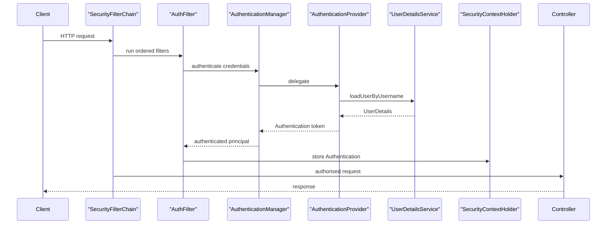

Spring Security is a chain of servlet filters that runs before your controller. Almost every interview question reduces to one mental model: a request walks the filter chain, gets authenticated, gets authorised, and only then reaches your code. Hold that model and the rest follows.

## The Filter Chain Mental Model

The `SecurityFilterChain` is an ordered list of filters. One filter extracts credentials (a form login, a session cookie, or a `Bearer` token), hands them to the `AuthenticationManager`, which delegates to an `AuthenticationProvider`, which loads the user via `UserDetailsService` and verifies the password. On success the resulting `Authentication` is stored in the `SecurityContextHolder` for the rest of the request. Authorisation filters then check whether that principal may reach the endpoint.



**Authentication** answers "who are you"; **authorisation** answers "are you allowed". They are separate stages and interviewers love candidates who never blur them.

## Spring Security 6 Configuration Style

In Spring Security 6 the `WebSecurityConfigurerAdapter` base class is gone. You now declare a `SecurityFilterChain` bean and use the lambda DSL. Rules are expressed with `authorizeHttpRequests`, matched by `requestMatchers`, and gated with `permitAll`, `authenticated`, `hasRole` or `hasAuthority`.

```java
@Bean
SecurityFilterChain filterChain(HttpSecurity http) throws Exception {
    http
        .authorizeHttpRequests(auth -> auth
            .requestMatchers("/public/**").permitAll()
            .requestMatchers("/admin/**").hasRole("ADMIN")     // implies ROLE_ADMIN
            .anyRequest().authenticated())
        .oauth2ResourceServer(oauth -> oauth.jwt(Customizer.withDefaults()))
        .sessionManagement(s -> s.sessionCreationPolicy(SessionCreationPolicy.STATELESS))
        .csrf(csrf -> csrf.disable());                          // safe only for token APIs
    return http.build();
}
```

> [!WARNING]
> Rule order matters. `requestMatchers` are evaluated top to bottom, so a broad `anyRequest().authenticated()` placed above a specific `permitAll()` will shadow it and lock people out.

## Passwords Are Never Stored Raw

Store a one-way hash, never the password itself, and never log it. Use `BCryptPasswordEncoder` or Argon2. A `DelegatingPasswordEncoder` stores an algorithm prefix such as `{bcrypt}` in the hash so you can migrate algorithms without a big-bang re-hash.

```java
@Bean
PasswordEncoder passwordEncoder() {
    // {bcrypt}, {argon2}, {noop} prefixes let old and new hashes coexist
    return PasswordEncoderFactories.createDelegatingPasswordEncoder();
}
```

## Stateless JWT Authentication

A JSON Web Token has three base64url parts: a header (algorithm), a payload (claims like `sub`, `iss`, `aud`, `exp`), and a signature. Signing with **HMAC** (`HS256`) uses one shared secret; **RS256** signs with a private key and lets any service verify with the public key, which scales better across services. A resource server must validate signature, issuer, audience and expiry — not just decode the token.

```yaml
spring:
  security:
    oauth2:
      resourceserver:
        jwt:
          issuer-uri: https://auth.example.com/   # exposes JWKS for key rotation
          audiences: [orders-api]
```

> [!DANGER]
> You cannot revoke a stateless JWT before it expires — the server keeps no record of it. Use short expiry (5–15 min) plus refresh tokens, or a denylist keyed by token id, if instant revocation is a requirement.

### When Sessions Are Still Better

A server-side session with a cookie is simpler, revocable instantly, and ideal for a classic server-rendered app or a single-domain SPA behind the same origin. Keep session-fixation protection on (Spring rotates the session id at login by default) for cookie flows. For token APIs set `SessionCreationPolicy.STATELESS` so no `HttpSession` is created.

## OAuth2 and OpenID Connect

OAuth2 defines four roles: the **resource owner** (the user), the **client** (your app), the **authorisation server** (issues tokens), and the **resource server** (your API). OpenID Connect adds an `id_token` for authentication on top. For a browser or mobile client use the **authorization code flow with PKCE**; for machine-to-machine use **client credentials**.

| Flow | Use when | Credential |
|---|---|---|
| Authorization code + PKCE | User-facing web or mobile app | User login at auth server |
| Client credentials | Service-to-service, no user | Client id and secret |
| Refresh token | Silently renew an expired access token | Long-lived refresh token |

## Method Security

Class and method level rules complement URL rules. Enable them with `@EnableMethodSecurity`, then annotate with `@PreAuthorize`, `@PostAuthorize` or the older `@Secured`. `@PreAuthorize` runs before the method using SpEL; `@PostAuthorize` runs after and can inspect the return value.

```java
@EnableMethodSecurity
@Configuration
class MethodSecurityConfig {}

@PreAuthorize("hasRole('MANAGER') and #order.ownerId == authentication.name")
public void approve(Order order) { /* ... */ }   // checks role AND ownership
```

> [!KEY]
> A role is just an authority with a `ROLE_` prefix. `hasRole('ADMIN')` matches the authority `ROLE_ADMIN`. Store authorities without the prefix or you get the confusing `ROLE_ROLE_ADMIN`.

## CSRF, CORS and OWASP Traps

CSRF protection defends **cookie-based** sessions, because a browser sends cookies automatically on a forged cross-site request. A stateless token API reads the token from an `Authorization` header the browser will not attach automatically, so CSRF is normally disabled there — but be ready to explain *why*, not just that you disabled it. Configure **CORS** inside Spring Security so preflight requests pass the chain, not only on the controller. Register a `CorsConfigurationSource` bean and enable it with `http.cors()` so the policy applies before authorisation runs and an `OPTIONS` preflight is not rejected as unauthenticated. Restrict allowed origins to an explicit list — a wildcard combined with credentials is both insecure and rejected by browsers.

The OWASP issues that actually appear in Spring interviews:

- **Injection** — string-concatenated JPQL or native SQL. Use bound parameters.
- **Broken access control** — checking the role but not resource ownership, so any manager edits any order.
- **Mass assignment** — binding a request body straight onto a JPA entity lets a caller set `role` or `isAdmin`. Bind to a DTO.
- **Sensitive data exposure** — tokens, passwords or PII in logs.

## Testing Security

Use `@WithMockUser` to run a test as a given principal, and `SecurityMockMvcRequestPostProcessors` (`jwt()`, `csrf()`, `user()`) to shape the request.

```java
@Test
@WithMockUser(roles = "ADMIN")
void adminCanReachDashboard() throws Exception {
    mockMvc.perform(get("/admin/dashboard"))
        .andExpect(status().isOk());
}
```

## Multiple Chains and Context Propagation

Real applications often need more than one `SecurityFilterChain` — a stateless JWT chain for `/api/**` and a session chain for a server-rendered admin UI. Register several beans, each with a `securityMatcher` limiting which requests it handles, and order them with `@Order`; the first chain whose matcher matches wins, so put the most specific first.

```java
@Bean
@Order(1)
SecurityFilterChain api(HttpSecurity http) throws Exception {
    http.securityMatcher("/api/**")                 // this chain only handles /api/**
        .authorizeHttpRequests(a -> a.anyRequest().authenticated())
        .oauth2ResourceServer(o -> o.jwt(Customizer.withDefaults()));
    return http.build();
}
```

The `SecurityContextHolder` stores the authentication in a thread-local by default, so it does **not** automatically propagate to threads you spawn — an `@Async` method or a manually created thread sees no authentication. To carry it across, wrap the task with `DelegatingSecurityContextRunnable` or `Callable`, use Spring's `DelegatingSecurityContextExecutor`, or switch the strategy to `MODE_INHERITABLETHREADLOCAL`. Forgetting this is a common cause of "works in the controller, null in the background job" bugs. The same care applies to reactive flows, where the context lives in the Reactor context rather than a thread-local.

## Cheat sheet

- The filter chain authenticates, then authorises, then calls your controller — in that order.
- Spring Security 6: declare a `SecurityFilterChain` bean; `WebSecurityConfigurerAdapter` is removed.
- `hasRole('X')` maps to authority `ROLE_X`; store authorities without the prefix.
- Hash passwords with BCrypt or Argon2 via `DelegatingPasswordEncoder`; never store or log raw ones.
- Validate JWT signature, `iss`, `aud` and `exp`; you cannot revoke one, so keep expiry short.
- RS256 for cross-service verification, HMAC for a single shared secret.
- Disable CSRF only for stateless token APIs and know the reason; keep it for cookie sessions.
- Check ownership, not just role, to avoid broken access control.

## Common mistakes

| Mistake | Fix |
|---|---|
| Ordering `anyRequest()` above specific matchers | Put specific `requestMatchers` first, broad rules last |
| Storing or logging raw passwords | Hash with BCrypt/Argon2, never log the credential |
| Assuming a JWT can be revoked | Short expiry plus refresh token or a denylist |
| Checking role but not resource ownership | Add `#resource.ownerId == authentication.name` in SpEL |
| Binding request bodies onto entities | Bind to a DTO and map explicitly |
| Disabling CSRF without understanding why | Disable only for token APIs; keep it for cookie sessions |
| Configuring CORS only on the controller | Configure CORS in the security filter chain |

## Summary

Spring Security is a filter chain that authenticates a request, stores the principal in the `SecurityContextHolder`, and then authorises access before your controller runs. In Spring Security 6 you configure it with a `SecurityFilterChain` bean and the lambda DSL, hash passwords with a delegating encoder, and choose between stateless JWT and revocable server sessions based on your revocation and scaling needs. Method security, OAuth2 flows, CSRF and CORS handling round out the picture. The senior signal is naming trade-offs — JWT revocation, RS256 versus HMAC, ownership versus role checks — rather than reciting configuration.

## Top Interview Questions

### Q1. Walk me through what happens when a request hits a secured Spring endpoint.

The request enters the `SecurityFilterChain`, an ordered list of servlet filters. An authentication filter extracts credentials — a form parameter, a session cookie, or a `Bearer` token — and passes them to the `AuthenticationManager`, which delegates to an `AuthenticationProvider`. The provider loads the user through `UserDetailsService` and verifies the password with the `PasswordEncoder`. On success the `Authentication` is placed in the `SecurityContextHolder`, scoped to the current thread. Authorisation filters then evaluate `authorizeHttpRequests` rules and method-security annotations against that principal. Only if both authentication and authorisation pass does the request reach the controller. That two-stage split — who are you, then are you allowed — is the whole model.

### Q2. Why was WebSecurityConfigurerAdapter removed and what replaced it?

`WebSecurityConfigurerAdapter` encouraged overriding methods and inheritance, which made composing multiple chains awkward and hid the actual bean graph. Spring Security 6 removed it in favour of a component-based style: you declare a `SecurityFilterChain` bean that takes `HttpSecurity` and returns `http.build()`. This makes each chain an explicit, independent bean, so you can register several chains with different `securityMatcher`s and clear ordering. Configuration uses the lambda DSL — `authorizeHttpRequests(auth -> ...)` — which reads clearly and is null-safe. The practical upshot: no base class, no overrides, just beans, which is easier to test and reason about.

### Q3. How does JWT authentication differ from session-based authentication, and when do you pick each?

A session stores state server-side and hands the client an opaque cookie id; the server can revoke it instantly and it is simple for same-origin apps. A JWT is self-contained and stateless — the server validates the signature and claims without a lookup, which scales horizontally with no shared session store. The cost is revocation: a JWT is valid until it expires, so you cannot cancel it directly. Pick sessions for classic server-rendered apps or when instant revocation matters; pick JWTs for stateless APIs, multiple services, or mobile clients. A common hybrid is short-lived JWTs plus a refresh token stored securely.

### Q4. You use stateless JWTs but security needs to force-logout a compromised account immediately. What do you do?

Stateless JWTs cannot be revoked before expiry, so I would combine two things. First, keep access-token expiry short — five to fifteen minutes — so the exposure window is small. Second, introduce a server-side denylist or token-version check for immediate revocation: store each token's `jti` (id) or a per-user token version, and reject tokens whose id is denylisted or whose version is stale. Refresh tokens live server-side and are revoked on logout, so once the short-lived access token expires the account is locked out. This reintroduces a small amount of state, which is the honest trade-off — pure statelessness and instant revocation are in tension.

### Q5. What is the difference between a role and an authority in Spring Security?

They are the same mechanism with a naming convention. An authority is any granted permission string; a role is an authority conventionally prefixed with `ROLE_`. `hasRole('ADMIN')` is sugar that checks for the authority `ROLE_ADMIN`, while `hasAuthority('ORDERS_READ')` checks the literal string. The trap is double-prefixing: if you store `ROLE_ADMIN` and also call `hasRole('ROLE_ADMIN')`, Spring looks for `ROLE_ROLE_ADMIN` and denies access. Store authorities without the prefix and let `hasRole` add it. Roles are coarse buckets; fine-grained authorities scale better for real permission systems.

### Q6. Why is CSRF protection disabled for a typical REST API but enabled for a browser session app?

CSRF exploits the browser automatically attaching cookies to any request to your domain, including one forged by a malicious site. If authentication relies on a session cookie, an attacker can trigger state-changing requests without the token, so CSRF protection — a synchronizer token the attacker cannot read — is essential. A stateless REST API authenticates with a token in the `Authorization` header, which the browser does not attach automatically to cross-site requests, so the CSRF attack vector does not apply and protection is safely disabled. The senior point is that "disable CSRF" is only correct once you have confirmed the API never authenticates via cookies.

### Q7. How would you prevent mass assignment when creating a user via a REST endpoint?

Never bind the request body directly to the JPA entity. If the controller accepts the entity, a caller can send extra fields like `role` or `enabled` and the binder will happily set them, granting themselves privileges. Instead bind to a request DTO that contains only the fields a client may set — username, email, password — and map explicitly to the entity, setting `role` server-side. This whitelists inputs by construction. The same discipline applies on updates: use a dedicated update DTO so a caller cannot flip `isAdmin` through an ordinary profile edit.

### Q8. How do you enforce that a manager can only approve their own team's orders, not any order?

URL rules and `hasRole` only check identity and coarse permission, not the relationship between the principal and the specific resource — checking the role but not ownership is textbook broken access control. I enforce ownership at the method layer with `@PreAuthorize` and SpEL, for example `@PreAuthorize("hasRole('MANAGER') and #order.teamId == authentication.principal.teamId")`, or implement a custom `PermissionEvaluator` and use `hasPermission(#order, 'approve')`. The rule must reference the actual resource, so it runs per request against real data. Combining a role check with an ownership check closes the gap that a role-only rule leaves open.

### Q9. Explain HMAC versus RS256 signing for JWTs and why key choice matters.

HMAC (`HS256`) uses a single shared secret to both sign and verify. It is simple but every service that verifies tokens must hold the secret, and any of them could also mint tokens — a blast-radius problem. RS256 uses asymmetric keys: the authorisation server signs with a private key it alone holds, and resource servers verify with the public key, distributed via a JWKS endpoint. Only the auth server can issue tokens, verifiers cannot forge them, and key rotation is handled by publishing new public keys. For anything beyond a single trusted service, RS256 is the safer default despite the slightly heavier verification cost.

### Q10. How do you test a secured endpoint without a real login?

Spring Security provides test support. `@WithMockUser(roles = "ADMIN")` runs the test method with a synthetic authenticated principal, so authorisation rules execute as if a real admin called. For finer control, `SecurityMockMvcRequestPostProcessors` inject security into a `MockMvc` request: `.with(csrf())` supplies a CSRF token, `.with(user("bob").roles("USER"))` sets the principal, and `.with(jwt().jwt(...))` mocks a decoded resource-server token. This exercises the real authorisation logic and method-security annotations without standing up an identity provider, so tests stay fast and deterministic while still proving the rules deny and allow correctly.

### Q11. A penetration test reports users can read other users' data by changing an id in the URL. How do you fix it in Spring?

That is an insecure direct object reference, a form of broken access control. The endpoint authenticates the caller but never checks the returned resource belongs to them. I fix it by adding an ownership check where the data is fetched: scope the query to the principal (`findByIdAndOwner(id, currentUser)`) so a foreign id simply returns nothing, or add `@PostAuthorize("returnObject.ownerId == authentication.name")` to reject a mismatched result. I would audit every id-parameterised read and write for the same flaw, add a test that a second user gets 403 or 404, and prefer query-level scoping because it fails safe by returning no rows.

### Q12. What are the security risks of putting sensitive data in logs, and how do you prevent it?

Logs are widely readable — aggregated, shipped to third-party systems, and retained long-term — so a token, password, or PII in a log line becomes a durable leak far from the original request. Risks include credential theft, replay of leaked tokens, and privacy or compliance violations. Prevention: never log the `Authorization` header, request bodies with credentials, or full JWTs; mask PII with a logging filter or custom converter; keep passwords out of exception messages; and review new log statements in code review. Use structured logging with an allowlist of fields rather than dumping whole objects whose `toString` might expose secrets.
