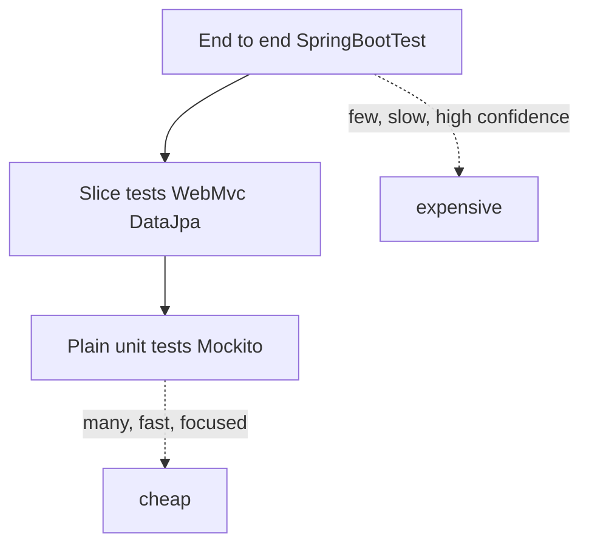

Good Spring testing is mostly about picking the cheapest test that still proves the behaviour. Interviewers probe whether you reach for a full `@SpringBootTest` reflexively or know when a plain unit test, a slice, or a container-backed test is the right tool.

## The Test Pyramid for a Spring Service

Most of your tests should be fast, isolated unit tests. Fewer should be slice tests that load part of the Spring context. Fewest should be full end-to-end tests that boot the whole application. Cost and confidence pull in opposite directions.



| Layer | Speed | Confidence | What it proves |
|---|---|---|---|
| Unit (no Spring) | Milliseconds | Logic only | Business rules in isolation |
| Slice | ~1 second | One layer wired | Controller mapping, JPA queries |
| Full `@SpringBootTest` | Seconds | Whole app | Real end-to-end path |

## Plain Unit Tests With No Spring Context

The tests you should have the most of load no context at all. Use constructor injection so you can build the class with plain `new`, pass in Mockito mocks, and assert with AssertJ. A `@SpringBootTest` to test one pure service method is a design smell — it is a thousand times slower and proves nothing extra.

```java
@ExtendWith(MockitoExtension.class)
class PricingServiceTest {
    @Mock DiscountRepository discounts;
    @InjectMocks PricingService service;

    @Test
    void appliesLoyaltyDiscount() {
        when(discounts.findFor("gold")).thenReturn(Optional.of(new Discount(10)));
        var captor = ArgumentCaptor.forClass(Audit.class);

        assertThat(service.price(100, "gold")).isEqualTo(90);
        verify(discounts).recordAudit(captor.capture());   // capture to assert the argument
    }
}
```

> [!KEY]
> If a class needs Spring to be testable, that is a design signal. Constructor injection plus a small surface makes most logic testable with `new` and mocks — no context, no annotations.

## The Test Slices

A slice loads only the beans one layer needs, so it starts far faster than the whole application. Each slice auto-configures a focused environment and lets you mock the collaborators with `@MockBean`.

| Slice | Loads | Typical use |
|---|---|---|
| `@WebMvcTest` | One controller, MVC infrastructure | `MockMvc` request/response, validation, status codes |
| `@DataJpaTest` | JPA, repositories, embedded DB | Query methods, mappings, rolls back each test |
| `@JsonTest` | Jackson serialisation | Serialise/deserialise DTOs |
| `@RestClientTest` | `RestClient`/`RestTemplate` | Outbound HTTP client behaviour |
| `@DataRedisTest` | Redis repositories/templates | Redis access code |

```java
@WebMvcTest(OrderController.class)
class OrderControllerTest {
    @Autowired MockMvc mvc;
    @MockBean OrderService service;                 // collaborator replaced by a mock

    @Test
    void returns404ForMissingOrder() throws Exception {
        when(service.find(9L)).thenReturn(Optional.empty());
        mvc.perform(get("/orders/9")).andExpect(status().isNotFound());
    }
}
```

`@DataJpaTest` rolls back after each test and swaps in an embedded database by default. To test against the real engine add `@AutoConfigureTestDatabase(replace = Replace.NONE)` and point it at a real or containerised database.

## Full Context Tests

When you genuinely need the whole path — filters, real serialisation, the actual port — use `@SpringBootTest(webEnvironment = RANDOM_PORT)` with `TestRestTemplate` or `WebTestClient`.

```java
@SpringBootTest(webEnvironment = WebEnvironment.RANDOM_PORT)
class CheckoutE2ETest {
    @Autowired TestRestTemplate rest;

    @Test
    void checkoutReturnsReceipt() {
        var response = rest.postForEntity("/checkout", new Cart("sku-1"), Receipt.class);
        assertThat(response.getStatusCode()).isEqualTo(HttpStatus.OK);
    }
}
```

## The Context Cache and Why Your Suite Is Slow

Spring caches the application context and reuses it across test classes with the same configuration — building it once is the expensive part. Anything that changes the configuration forces a **new** context: a different `@MockBean` set, `@DirtiesContext`, or a different property set via `@TestPropertySource`. Each distinct configuration is a separate cached context, and a suite with twenty variations pays the startup cost twenty times.

> [!DANGER]
> Scattering `@DirtiesContext` and ad-hoc `@MockBean`/`@TestPropertySource` combinations across classes fragments the context cache. The suite that "just got slow" usually has dozens of unique contexts. Standardise configuration and reset mocks instead.

Keep the number of distinct configurations small: share a base test configuration, reset mocks with `Mockito.reset` or `@BeforeEach` instead of `@DirtiesContext`, and group tests that need the same properties.

## Test-Only Beans and Profiles

Use `@TestConfiguration` plus `@Import` to add beans that exist only in tests, and `@ActiveProfiles("test")` to select profile-specific config. Inject dynamic values — like a container's port — with `@DynamicPropertySource`, and static overrides with `@TestPropertySource`.

## Testcontainers

For real infrastructure, Testcontainers runs a throwaway PostgreSQL, Redis or Kafka in Docker for the test. Boot 3.1's `@ServiceConnection` wires the container's connection details into Spring automatically, removing the old `@DynamicPropertySource` boilerplate.

```java
@SpringBootTest
@Testcontainers
class OrderRepositoryIT {
    @Container
    @ServiceConnection                                      // auto-wires datasource URL, user, password
    static PostgreSQLContainer<?> db = new PostgreSQLContainer<>("postgres:16");

    @Autowired OrderRepository repo;

    @Test
    void persistsAndReads() {
        repo.save(new Order("sku-1"));
        assertThat(repo.count()).isEqualTo(1);
    }
}
```

Keep it fast with a **singleton container** started once and reused across classes, or Testcontainers **reuse** mode, so you do not pay container startup per class.

> [!TIP]
> For stubbing outbound HTTP, WireMock stands up a fake server that returns canned responses and lets you verify the requests you made. For provider/consumer agreement, contract testing with Spring Cloud Contract or Pact generates tests from a shared contract so both sides break loudly when the contract changes.

## Transactions, Async and Flakiness

A `@Transactional` test rolls back by default, which is fast but can hide bugs that only appear on commit — a deferred constraint, a flush ordering issue, or a trigger. When commit behaviour matters, test without rollback. For async or scheduled code, poll with **Awaitility** rather than `Thread.sleep`. Kill nondeterminism by injecting a fixed `Clock` and using deterministic test data.

```java
await().atMost(Duration.ofSeconds(2))
       .untilAsserted(() -> assertThat(inbox.size()).isEqualTo(1));
```

Flaky tests erode trust in the entire suite — one intermittent failure and people start ignoring red builds — so quarantine and fix them promptly rather than re-running until green. The usual root causes are shared mutable state, real time or randomness, and order dependence between tests, all of which the discipline above removes.

Treat coverage as a signal, not a target: 90% coverage of trivial getters proves little, while a well-chosen integration test on the risky path is worth more than the number suggests. Mutation testing with a tool like PITest goes a step further than line coverage — it injects small faults and checks whether a test fails, so it measures whether your assertions actually catch bugs rather than just executing lines.

## Arranging a Readable Test

Structure every test as Arrange-Act-Assert (or Given-When-Then): set up inputs and stubs, invoke the one behaviour under test, then assert on the outcome. One logical assertion per test keeps failures diagnostic — when it goes red you know exactly what broke. Name tests by behaviour, not method, so `returns404ForMissingOrder` reads as a specification rather than `testFindOrder`.

Seed database state declaratively with `@Sql` scripts instead of hand-writing inserts in Java, and keep fixtures minimal — only the columns the test needs — so a schema change does not break unrelated tests.

```java
@Test
@Sql("/seed-orders.sql")                 // load a known dataset before the test runs
void findsOpenOrdersForCustomer() {
    var orders = repo.findByCustomer("c-1");
    assertThat(orders).hasSize(2)
        .extracting(Order::status).containsOnly(Status.OPEN);
}
```

Prefer AssertJ's fluent chains over multiple JUnit assertions — `assertThat(list).extracting(...).contains(...)` reads clearly and produces a far better failure message than a bare `assertEquals`. Assert on the meaningful fields, not object identity, so a refactor that adds a field does not needlessly break tests. Finally, isolate tests from each other: never let one test depend on data another test left behind, because ordering-dependent tests fail mysteriously in parallel or when the suite is reordered.

## Cheat sheet

- Prefer plain unit tests with `new` plus Mockito; a `@SpringBootTest` for a pure method is a smell.
- Use slices (`@WebMvcTest`, `@DataJpaTest`) to load one layer fast instead of the whole app.
- `@DataJpaTest` rolls back and uses an embedded DB; add `@AutoConfigureTestDatabase(replace = NONE)` for the real engine.
- Full path: `@SpringBootTest(webEnvironment = RANDOM_PORT)` with `TestRestTemplate`/`WebTestClient`.
- The context cache reuses contexts; `@MockBean`, `@DirtiesContext` and property changes fragment it.
- Testcontainers plus `@ServiceConnection` gives real infra with no `@DynamicPropertySource` boilerplate.
- Use Awaitility for async, a fixed `Clock` for time, WireMock for outbound HTTP.
- Coverage is a signal, not a goal.

## Common mistakes

| Mistake | Fix |
|---|---|
| `@SpringBootTest` for a pure service method | Plain unit test with Mockito and `new` |
| `@DirtiesContext` everywhere | Reset mocks per test; keep contexts shared |
| Many unique `@MockBean`/property combos | Standardise config to reuse the cached context |
| Trusting a rollback-only test for commit behaviour | Add a no-rollback test where commit matters |
| `Thread.sleep` for async assertions | Poll with Awaitility until the condition holds |
| Testing queries only on an embedded DB | Use Testcontainers for the real database engine |
| Chasing a coverage percentage | Target risky paths, treat coverage as a signal |

## Summary

Effective Spring testing is a pyramid: many plain unit tests with Mockito and constructor injection, fewer slice tests that load one layer quickly, and few full `@SpringBootTest` end-to-end tests. Reaching for the full context to test pure logic is a design smell and a speed killer. Understanding the context cache — and how `@MockBean`, `@DirtiesContext` and property sets fragment it — is the senior signal that separates a fast suite from a slow one. Testcontainers with `@ServiceConnection` gives realistic infrastructure, while Awaitility, fixed clocks and WireMock keep tests deterministic.

## Top Interview Questions

### Q1. What is the test pyramid and how does it map onto a Spring Boot service?

The pyramid says have many cheap, fast tests at the bottom and few expensive ones at the top. In Spring that means the bulk are plain unit tests — no context, constructor injection, Mockito mocks — proving business logic in milliseconds. The middle is slice tests like `@WebMvcTest` and `@DataJpaTest` that load one layer, verifying controller mappings or JPA queries in about a second. The top is a small number of `@SpringBootTest` end-to-end tests that boot the whole app on a random port and exercise the real path. The shape matters because inverting it — mostly full-context tests — gives a slow, brittle suite that developers stop running.

### Q2. When is using @SpringBootTest a design smell?

When you use it to test logic that has no Spring dependency. If a service method just transforms inputs and calls collaborators, you can construct it with `new`, pass mocks, and assert directly — that runs in milliseconds and needs no context. Booting the full application to test it is a thousand times slower and proves nothing extra. The smell is often deeper: if a class *cannot* be tested without Spring, it is probably doing too much or reaching for beans it should receive by constructor injection. The fix is to push logic into plain, injectable classes and reserve `@SpringBootTest` for genuine end-to-end wiring.

### Q3. Explain the Spring test context cache and why it makes suites slow.

Building the application context is the expensive part of a Spring test, so Spring caches contexts and reuses one across every test class that shares the same configuration. The problem is that many things change the configuration and force a brand-new context: a different combination of `@MockBean`, a `@TestPropertySource` override, `@ActiveProfiles`, or `@DirtiesContext`. Each unique configuration becomes its own cached context with its own startup cost. A suite that sprinkles these annotations ends up with dozens of contexts and pays startup dozens of times. The fix is to standardise configuration so classes share a handful of contexts, and reset mocks instead of dirtying the context.

### Q4. What does @DataJpaTest give you, and how do you test against a real database?

`@DataJpaTest` loads only the JPA layer — entities, repositories, an `EntityManager` — not your web or service beans, so it starts fast. It wraps each test in a transaction that rolls back afterwards, keeping tests isolated, and by default replaces your datasource with an in-memory embedded database. That embedded default is convenient but risky: H2 does not behave identically to PostgreSQL for native queries, JSON columns, or specific constraints. To test against the real engine, add `@AutoConfigureTestDatabase(replace = Replace.NONE)` and point the test at a real or Testcontainers-managed database, so your query methods run on the same engine as production.

### Q5. How do you write a controller test without loading the whole application?

Use `@WebMvcTest(MyController.class)`, which loads only that controller plus the MVC infrastructure — argument resolvers, validation, exception handlers, Jackson — and nothing else. You inject `MockMvc` to perform requests and assert on status, headers, and JSON, and you replace service collaborators with `@MockBean` so no real business logic or database runs. This proves the web layer contract — routing, validation, serialization, status codes — in about a second. Because it does not load the service or persistence layers, it stays fast and focused; the actual service logic is covered separately by plain unit tests.

### Q6. What problem does Testcontainers solve and how has Boot 3.1 improved it?

Testcontainers solves the fidelity gap between an embedded database and production. Instead of testing JPA against H2, it spins up a real PostgreSQL, Redis, or Kafka in a Docker container for the test, so behaviour matches production. Historically you wired the container's dynamic host and port into Spring with `@DynamicPropertySource`, which was boilerplate. Boot 3.1 added `@ServiceConnection`: annotate the container field and Spring reads its connection details automatically, wiring the datasource URL, username, and password with no manual property plumbing. To keep it fast, use a singleton container started once for the whole suite or enable Testcontainers reuse, so you do not pay container startup per test class.

### Q7. Why can a test that passes with transactional rollback still hide a real bug?

A `@Transactional` test rolls the transaction back at the end, which keeps tests isolated but means the transaction never commits. Some failures only surface on commit: deferred or foreign-key constraints checked at commit time, a flush that reorders and violates a unique index, database triggers, or an `@Transactional(propagation = REQUIRES_NEW)` boundary that behaves differently under a real commit. A rollback-only test can therefore pass while production fails on the same data. When commit behaviour is part of what you are verifying, run the test without automatic rollback — for example against a Testcontainers database — so the code path actually commits and any commit-time failure shows up.

### Q8. How do you test asynchronous or scheduled code reliably?

The naive approach — call the async method then `Thread.sleep(500)` and assert — is flaky because you are guessing at timing, and it slows the suite. Instead use Awaitility to poll the condition: `await().atMost(2, SECONDS).untilAsserted(() -> assertThat(...))` repeatedly checks until the assertion passes or a timeout fires, so it returns as soon as the work completes and fails fast if it never does. For scheduled tasks, trigger the method directly rather than waiting for the scheduler. Combine this with an injected fixed `Clock` and deterministic data so timing-dependent logic is reproducible rather than clock-dependent.

### Q9. How do you keep tests deterministic when code depends on the current time?

Never call `Instant.now()` or `LocalDateTime.now()` directly in code under test — that makes the result depend on the wall clock and produces flaky, unrepeatable assertions. Inject a `java.time.Clock` as a dependency and read time through it. In production wire `Clock.systemUTC()`; in tests wire `Clock.fixed(knownInstant, UTC)` so the code sees a constant, known time. Now you can assert exact timestamps, test boundary conditions like expiry at midnight, and reproduce failures. The same discipline applies to randomness and generated ids: inject the source so the test controls it. Deterministic inputs are what turn a flaky test into a reliable one.

### Q10. How should you think about code coverage as a senior engineer?

Coverage measures which lines executed during tests, not whether the behaviour is correct — you can hit 90% by exercising trivial getters while leaving the risky branch untested. So I treat coverage as a signal, not a target. A sudden drop flags an untested new feature; a persistently low module flags risk. But I would not chase a fixed percentage, because gaming it produces assertion-free tests that run code without checking outcomes. I focus tests on the paths where a bug is costly — money calculations, authorization, concurrency — and accept lower coverage on boilerplate. The question I ask is "would a test have caught this class of bug", not "what is the number".

### Q11. When would you use @MockBean versus a plain Mockito @Mock?

Use a plain `@Mock` in a pure unit test where there is no Spring context — you construct the class yourself and pass the mock in, which is the fast, common case. Use `@MockBean` only inside a test that loads a context, like `@WebMvcTest` or `@SpringBootTest`, when you need to replace a real bean in that context with a mock so the wired graph uses your stub. The caveat is that each distinct set of `@MockBean` definitions produces a different context configuration and can fragment the context cache, slowing the suite. So prefer `@Mock` for logic and reserve `@MockBean` for genuinely context-dependent tests.

### Q12. Your integration test suite takes 15 minutes and blocks CI. How do you diagnose and speed it up?

First I would measure: enable context-cache statistics and per-test timing to see how many distinct application contexts are created and where the time goes. Usually the culprit is context fragmentation — scattered `@DirtiesContext`, and inconsistent `@MockBean` and `@TestPropertySource` combinations creating dozens of contexts. I would consolidate configuration so classes share a few contexts, remove `@DirtiesContext` in favour of resetting mocks, and standardise properties. Next, push logic down into plain unit tests so fewer cases need a context at all. For Testcontainers, switch to a singleton or reuse container so startup happens once. Finally, parallelise across independent classes. These usually cut the suite dramatically without losing coverage.
