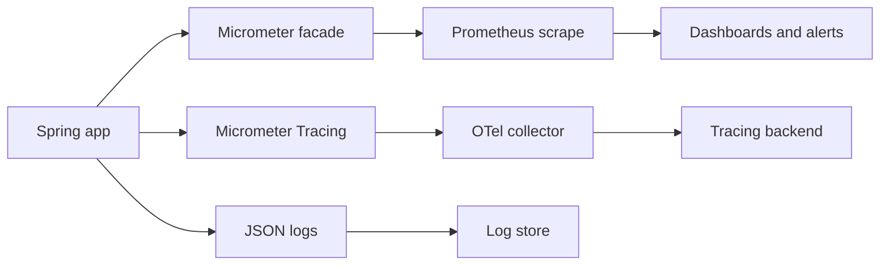

Observability is the ability to answer "what is my running service doing" from the outside. Spring Boot gives you three pillars — metrics, traces and logs — plus Actuator endpoints to expose them. Senior interviews test whether you know which signal answers which question, and the traps that make each one dangerous.

## The Three Pillars

**Metrics** are cheap aggregate numbers over time (request rate, error rate, latency percentiles) — good for dashboards and alerts. **Traces** follow one request across services to show where time went. **Logs** are detailed per-event records for root cause. You alert on metrics, find the slow hop with a trace, then read logs for the specific failing request.



## Spring Boot Actuator

Actuator exposes operational endpoints over HTTP under `/actuator`. Expose only what you need with `management.endpoints.web.exposure.include`.

| Endpoint | Shows | Sensitive |
|---|---|---|
| `health` | Up/down and component health | Low |
| `info` | Build and app metadata | Low |
| `metrics` | Individual metric values | Low |
| `prometheus` | Metrics in scrape format | Low |
| `env` | Environment and properties | High — leaks secrets |
| `configprops` | Bound configuration | High — leaks secrets |
| `beans` | Bean graph | Medium |
| `mappings` | Request mappings | Medium |
| `loggers` | Log levels, changeable at runtime | Medium |
| `threaddump` | Thread dump | Medium |
| `heapdump` | Full heap download | High — leaks data |
| `httpexchanges` | Recent HTTP calls | Medium |
| `conditions` | Auto-config report | Low |
| `scheduledtasks` | Scheduled jobs | Low |
| `caches` | Cache state | Low |
| `shutdown` | Stops the app | High |

```yaml
management:
  endpoints:
    web:
      exposure:
        include: [health, info, prometheus]   # allowlist, never expose "*" publicly
  server:
    port: 8081                                # separate port, firewalled from the internet
```

> [!DANGER]
> `env`, `configprops` and `heapdump` leak secrets and user data. Never expose the actuator port to the public internet. Run it on a separate port, restrict it to the internal network, and secure it with authentication.

## Health Indicators, Liveness and Readiness

Actuator aggregates `HealthIndicator` beans — built-ins cover `DiskSpace`, `DataSource` and `Redis`. You can write a custom one, and you must distinguish two Kubernetes probes:

- **Liveness** — "is the process broken; restart me". Should check only in-process health.
- **Readiness** — "can I serve traffic right now; stop routing to me if not". May check dependencies.

```java
@Component
class QueueHealthIndicator implements HealthIndicator {
    public Health health() {
        return queue.isConnected() ? Health.up().build()
                                   : Health.down().withDetail("queue", "unreachable").build();
    }
}
```

Enable the probes with `management.endpoint.health.probes.enabled=true`, which exposes `/actuator/health/liveness` and `/readiness`.

> [!WARNING]
> The classic outage: a liveness probe that checks the database. The database blips, every pod's liveness fails at once, Kubernetes restarts them all, and the restart storm turns a five-second glitch into a full outage. Put dependency checks in readiness, never liveness.

## Micrometer Metrics

Micrometer is the metrics facade — a vendor-neutral SLF4J for metrics that exports to Prometheus, Datadog and others. The instruments:

- **Counter** — monotonic count (requests, errors).
- **Gauge** — a value that goes up and down (queue depth, active connections).
- **Timer** — count plus latency distribution; `@Timed` wraps a method.
- **DistributionSummary** — distribution of non-time values (payload sizes).

```java
Timer.builder("orders.checkout")
     .tag("result", "success")           // low-cardinality tag only
     .publishPercentileHistogram()       // emit buckets so p99 is computed server-side
     .register(registry);
```

> [!DANGER]
> Never tag a metric with a user id, order id, or raw URL. Each distinct tag value creates a new time series; high-cardinality tags cause a cardinality explosion that can bankrupt your metrics backend and crash the collector. Tag with bounded values like status code or route template.

You get JVM, HikariCP, and Tomcat metrics for free. For deciding what to watch, two frameworks help: **RED** (Rate, Errors, Duration) for request-driven services, and **USE** (Utilisation, Saturation, Errors) for resources. Compute percentiles like p99 server-side from histogram buckets — you cannot average pre-aggregated averages and get a correct percentile.

| Framework | Signals | Best for |
|---|---|---|
| RED | Rate, Errors, Duration | Request-serving services |
| USE | Utilisation, Saturation, Errors | Resources like pools, CPU, disk |

## Distributed Tracing

Micrometer Tracing replaced Spring Cloud Sleuth in Boot 3. It bridges to OpenTelemetry or Brave, assigns a **trace id** to a whole request and a **span id** to each hop, and propagates context across services using the W3C `traceparent` header — automatically over `RestClient`, `WebClient` and Kafka. Sampling controls cost: tracing every request is expensive, so you sample a percentage.

```yaml
management:
  tracing:
    sampling:
      probability: 0.1     # sample 10% of requests to bound cost
```

The subtle part is context propagation across `@Async` and reactive boundaries — the trace context lives in a thread-local or Reactor context, so async work needs the context wrapped or it loses the trace. Micrometer's context propagation library handles most of this when configured. Two sampling strategies exist: head-based sampling decides at the start of a request, which is cheap but may discard the rare slow trace you most want to see, while tail-based sampling buffers spans in a collector and keeps the interesting ones like errors and outliers, at higher memory cost.

## Structured Logging and Correlation

Log as JSON so a log store can index fields, and put the correlation id (the trace id) into the **MDC** so every line of a request is searchable together. Micrometer Tracing populates the MDC automatically. Change log levels at runtime with a POST to the `loggers` endpoint — no redeploy.

```bash
curl -X POST localhost:8081/actuator/loggers/com.acme.orders \
  -H 'Content-Type: application/json' \
  -d '{"configuredLevel":"DEBUG"}'   # turn on debug logging live, then revert
```

> [!KEY]
> Alert on symptoms and SLOs — "checkout error rate above 1%" or "p99 latency over 500 ms" — not on causes like "CPU is high". Cause-based alerts fire constantly without a user impact and train people to ignore the pager.

Never log PII, passwords or tokens. Redact sensitive fields before they reach the log store.

## Custom Metrics and Exemplars

Beyond the free metrics, instrument the numbers that describe your domain — orders placed, payments declined, cache hit ratio. Register them through the injected `MeterRegistry` so they inherit common tags and the configured exporter. Use a `Counter` for events and a `Timer` for operations you want latency on; reach for a `Gauge` only for a value you can sample on demand, like queue depth, and make sure the object it references is not garbage-collected or the gauge reports `NaN`.

```java
Counter declined = Counter.builder("payments.declined")
    .tag("reason", "insufficient_funds")   // small, bounded set of reasons only
    .register(registry);
declined.increment();
```

`@Timed` on a controller or service method is the low-effort way to add a timer without touching the body. Two senior touches: attach **exemplars** so a spike on a latency histogram links directly to an example trace, closing the loop between metrics and tracing; and enrich the `info` endpoint with build and git metadata via the build-info and git-commit contributors, so a dashboard shows exactly which version is running when an alert fires. Keep every tag low-cardinality — that rule never changes, no matter how tempting a per-user counter looks during debugging.

## Cheat sheet

- Metrics for alerting, traces for locating the slow hop, logs for root cause.
- Expose only `health`, `info`, `prometheus`; put actuator on a separate, firewalled port.
- `env`, `configprops`, `heapdump` leak secrets — never public.
- Liveness = restart me; readiness = stop routing to me. Dependencies belong in readiness only.
- Micrometer instruments: counter, gauge, timer, distribution summary.
- Never tag metrics with unbounded values — cardinality explosion is the classic disaster.
- Compute p99 server-side from histograms; you cannot average averages.
- Micrometer Tracing (not Sleuth) propagates `traceparent`; sample to bound cost.
- Put the trace id in the MDC and log structured JSON; alert on SLOs, not causes.

## Common mistakes

| Mistake | Fix |
|---|---|
| Exposing all actuator endpoints publicly | Allowlist a few; separate, firewalled port with auth |
| Liveness probe checking the database | Move dependency checks to readiness only |
| Tagging metrics with user id or raw URL | Use bounded tags like status code or route template |
| Averaging percentiles across instances | Aggregate histogram buckets and compute p99 server-side |
| Still adding Spring Cloud Sleuth in Boot 3 | Use Micrometer Tracing with OTel or Brave |
| Sampling 100% of traces in production | Sample a percentage to bound cost |
| Alerting on CPU or memory directly | Alert on symptoms and SLOs users feel |
| Logging tokens or PII | Redact before logging; keep secrets out |

## Summary

Observability rests on three pillars: metrics for cheap aggregate alerting, traces for following one request across services, and logs for per-event root cause. Actuator exposes these over HTTP, but endpoints like `env`, `configprops` and `heapdump` leak secrets, so you allowlist a few and run them on a separate, secured port. The liveness-versus-readiness distinction prevents restart storms, Micrometer standardises metrics while cardinality discipline keeps the backend affordable, and Micrometer Tracing propagates context across services. Structured JSON logs with a trace id in the MDC tie it all together, and you alert on user-facing SLOs rather than raw causes.

## Top Interview Questions

### Q1. What are the three pillars of observability and which question does each answer?

Metrics, traces, and logs. Metrics are cheap numeric aggregates over time — request rate, error rate, latency percentiles — and answer "is something wrong right now", so they drive dashboards and alerts. Traces follow a single request across services and spans, answering "where did the time go" or "which hop failed". Logs are detailed per-event records answering "why did this specific request fail". The workflow ties them together: a metric alert tells you error rate spiked, a trace shows which downstream call is slow, and logs for that trace id reveal the exact exception. Using the right pillar for the question is what makes debugging fast instead of guesswork.

### Q2. What is the difference between a liveness and a readiness probe?

Liveness answers "is this process irrecoverably broken" — if it fails, Kubernetes restarts the pod. Readiness answers "can this instance serve traffic right now" — if it fails, Kubernetes stops routing requests to it but does not restart it. The key rule is that liveness should check only in-process health, never external dependencies, because a shared dependency failing would make every pod's liveness fail and trigger a mass restart. Readiness is where dependency checks belong: if the database is unreachable, the pod goes not-ready and drains traffic, then recovers when the dependency returns. Spring exposes both at `/actuator/health/liveness` and `/readiness` when probes are enabled.

### Q3. Why must you secure the actuator endpoints, and how?

Several endpoints expose sensitive data: `env` and `configprops` reveal configuration including secrets, `heapdump` downloads the entire heap with in-memory user data and credentials, and `shutdown` can stop the app. Exposing these publicly is a serious vulnerability. I secure them by exposing only a minimal allowlist — typically `health`, `info`, and `prometheus` — via `management.endpoints.web.exposure.include`, running the management server on a separate port that is firewalled to the internal network only, and requiring authentication on that port. That way monitoring systems inside the network can scrape metrics while the sensitive endpoints are never reachable from the internet.

### Q4. What is a cardinality explosion in metrics and how do you avoid it?

Every unique combination of tag values on a metric creates a separate time series that the backend must store and index. If you tag a metric with an unbounded value — a user id, an order id, a raw URL with ids in the path — you generate a new series per distinct value, so millions of users produce millions of series. This explodes memory and storage in the metrics backend, can crash the collector, and drives cost up sharply. Avoid it by tagging only with low-cardinality, bounded values: HTTP status code, the route template like `/orders/{id}` rather than the concrete URL, or a small enum of outcomes. Put high-cardinality identifiers in traces and logs, not metric tags.

### Q5. How do you correctly compute p99 latency across multiple instances?

You cannot average percentiles. If each instance reports its own p99, taking the mean of those numbers is mathematically wrong and can be off by a lot, because a percentile is not additive. The correct approach is to have each instance publish a latency **histogram** — counts per latency bucket — using Micrometer's `publishPercentileHistogram`. The monitoring backend aggregates the raw bucket counts across all instances into one global distribution and computes p99 from that combined histogram. This gives an accurate service-wide percentile. The general rule: aggregate the underlying distribution server-side, never average pre-computed summary statistics like averages or percentiles.

### Q6. What replaced Spring Cloud Sleuth in Boot 3, and how does trace propagation work?

Spring Cloud Sleuth is not supported in Boot 3; Micrometer Tracing replaced it. It is a facade that bridges to a tracer implementation — OpenTelemetry or Brave. It assigns a trace id to the whole request and a span id per operation, and propagates context between services using the W3C `traceparent` header. Boot auto-instruments outbound clients like `RestClient`, `WebClient`, and messaging such as Kafka, so the header is attached and read automatically, stitching spans into one trace across services. The tricky part is async and reactive code, where the context lives in a thread-local or Reactor context and must be propagated explicitly; Micrometer's context-propagation support handles this when wired up.

### Q7. Your service degrades after adding tracing. What happened and what do you check?

Almost certainly sampling and export overhead. If sampling probability is set to 1.0, you trace and export every request, which adds CPU for span creation, memory for buffering, and network for export — under load that overhead becomes significant, and a slow or backpressured collector can stall request threads. I would check the configured sampling probability and lower it to something like 0.1, verify spans are exported asynchronously with a bounded queue that drops rather than blocks when full, and confirm the collector itself is healthy and not applying backpressure. I would also look for excessive manual spans on hot paths. Tracing should be near-free per request; if it is not, sampling or the export pipeline is misconfigured.

### Q8. Why should you alert on symptoms and SLOs rather than on causes like high CPU?

Cause-based alerts like "CPU above 80%" fire whether or not users are affected — an efficient service can run hot with perfect latency, and a broken one can be idle. They generate noise, cause alert fatigue, and train responders to ignore the pager. Symptom and SLO alerts fire on what users actually experience: error rate above one percent, p99 latency over the objective, or a burn-rate on an error budget. These correlate directly with user pain, so every page is meaningful and actionable. Causes still matter for diagnosis once you are investigating, but they belong on dashboards, not on the pager. Alert on the promise you made to users.

### Q9. How do you change log levels in production without redeploying, and why is that useful?

Actuator's `loggers` endpoint lets you read and change log levels at runtime. You POST the target level to `/actuator/loggers/{logger-name}` — for example set `com.acme.orders` to `DEBUG` — and it takes effect immediately, then you set it back to `INFO` when done. This is invaluable during an incident: you can turn on debug logging for the one suspect package to capture detail on a live problem, without a redeploy that would disturb the running state you are trying to diagnose and might even make the bug disappear. The caveat is to scope it narrowly and revert quickly, because verbose logging under load adds cost and can itself degrade performance.

### Q10. What metrics do you get for free from Spring Boot, and which frameworks help you pick what to watch?

With Actuator and Micrometer on the classpath you automatically get JVM metrics (heap, garbage collection, threads, class loading), HikariCP connection-pool metrics (active, idle, pending, timeouts), Tomcat thread-pool metrics, HTTP server request timers with status and route tags, and logback event counts. To decide what to actually watch, two frameworks help. RED — Rate, Errors, Duration — fits request-serving services and maps directly to the HTTP metrics. USE — Utilisation, Saturation, Errors — fits resources like the connection pool, CPU, and disk, telling you when a resource is running out of headroom. Together they cover both the request view and the resource view.

### Q11. A custom HealthIndicator is making your service flap between up and down. What is likely wrong and how do you fix it?

A health indicator that calls a flaky or slow dependency will report the service unhealthy whenever that dependency hiccups, and if it is wired into liveness it can trigger restarts. Common causes: no timeout on the dependency check so it hangs, treating a transient blip as fatal, or checking a non-critical dependency at all. I would add a short timeout to the check, decide whether the dependency is essential — if the service can still serve some traffic without it, it should degrade rather than report down — and ensure this indicator only influences readiness, not liveness. For non-critical dependencies I might report them as separate details without failing overall health, so a blip drains traffic gracefully instead of flapping.

### Q12. How do you keep sensitive data out of your telemetry?

Telemetry spreads data widely — metrics backends, trace stores, and log aggregators — often third-party and long-retained, so a secret or PII that lands there is a durable leak. For logs, redact or mask sensitive fields before they are written, never log tokens, passwords, or full request bodies, and avoid dumping whole objects whose `toString` might expose fields. For traces, do not put PII in span tags or names. For metrics, never use PII as a tag value — that both leaks data and explodes cardinality. I also lock down Actuator so `env`, `configprops`, and `heapdump` are not exposed, since a heap dump contains everything in memory. Redaction at the point of emission is the reliable control.
