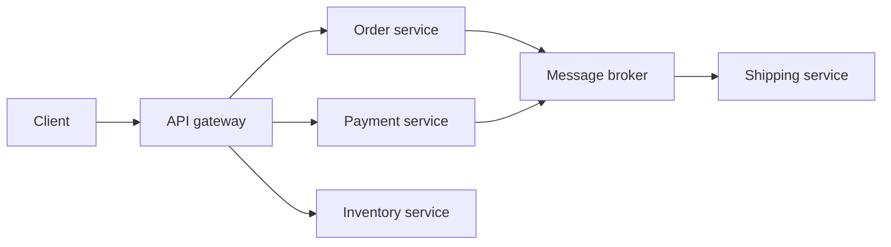
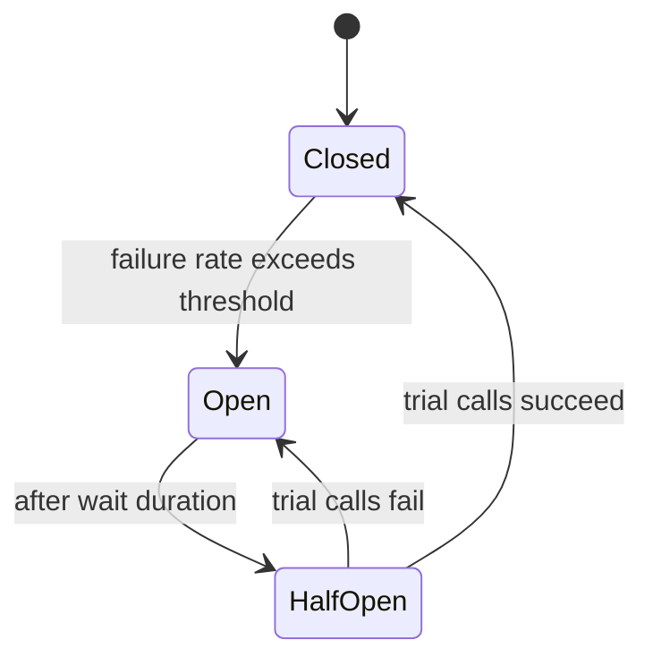
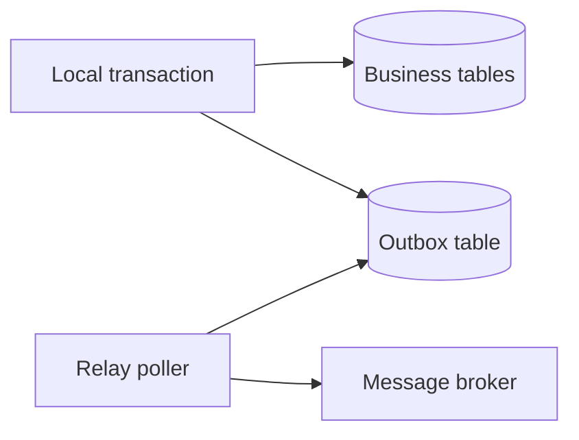

Microservices trade in-process simplicity for independent deployability, at the cost of network failure, distributed data, and operational overhead. The senior skill is knowing when that trade is worth it, and how to keep the resulting system reliable. Many teams should stay a modular monolith.

## When to Split, and When Not To

Split when teams need to deploy independently, parts of the system scale very differently, or you need fault isolation. Do **not** split just to use the pattern. A **modular monolith** — one deployable with strict internal module boundaries — gives most of the design benefits with none of the distributed-systems tax, and is often the better senior answer for a small team. Draw boundaries from **business capabilities** (orders, payments, inventory), and apply the **database-per-service** rule: no service reaches into another's tables.

| Force | Favours microservices | Favours modular monolith |
|---|---|---|
| Team size | Many teams | One or two teams |
| Scaling | Very uneven per component | Uniform |
| Deploy cadence | Independent per service | Whole app together |
| Operational maturity | Strong (tracing, CI/CD, on-call) | Growing |

## Synchronous Communication

Services call each other over HTTP with `RestClient`, `WebClient` or Feign. They find each other via **service discovery** — Eureka, or Kubernetes DNS — and spread load with **client-side load balancing** (Spring Cloud LoadBalancer). An **API gateway** (Spring Cloud Gateway) fronts the system for routing, authentication, rate limiting, and request aggregation.



## Resilience With Resilience4j

Every network call can fail or hang. Resilience4j provides composable decorators. The **circuit breaker** stops calling a failing dependency, giving it time to recover.



- **Retry** — re-attempt with exponential backoff plus jitter, but only for **idempotent** operations.
- **Bulkhead** — cap concurrent calls to one dependency so it cannot exhaust all threads.
- **Rate limiter** — cap call rate.
- **Time limiter** — bound how long you wait.

Ordering of decorators matters. A sensible order from outside in is: retry wraps circuit breaker wraps rate limiter wraps time limiter wraps bulkhead — so retries see the breaker state and each attempt is individually time-limited.

```java
@Retry(name = "inventory")            // retry only because reads are idempotent
@CircuitBreaker(name = "inventory", fallbackMethod = "fromCache")
public Stock check(String sku) { return client.getStock(sku); }

private Stock fromCache(String sku, Throwable t) { return cache.get(sku); }
```

> [!DANGER]
> A retry storm turns a slow dependency into an outage. When a service slows, every caller retries, multiplying load two or three times exactly when the dependency is weakest, driving it fully down. Retry only idempotent calls, cap attempts, add jitter, and pair retries with a circuit breaker.

## Timeouts Everywhere

Every outbound call needs a timeout — a call with no timeout waits forever and holds a thread. Set a **timeout budget** across a chain: if the gateway allows 2 seconds end-to-end, an inner call cannot be given 5. Budget shrinks as you go deeper so the outermost caller can still respond.

## Asynchronous Communication

Decouple services with **Spring Kafka** or RabbitMQ. Distinguish **events** ("OrderPlaced happened") from **commands** ("ReserveStock, please do this"). Messaging is usually **at-least-once**, so consumers must be **idempotent** — processing the same message twice must be safe, typically via a dedup key. Order is only guaranteed within a Kafka **partition**, so key by entity id when order matters. Route poison messages to a **dead-letter topic** instead of blocking the partition.

| Aspect | Synchronous (HTTP) | Asynchronous (messaging) |
|---|---|---|
| Coupling | Temporal — both must be up | Decoupled — broker buffers |
| Latency | Immediate response | Eventual |
| Failure mode | Caller sees the error | Retried from the broker |
| Best for | Queries needing an answer now | Events, workflows, load spikes |

## Data Across Services

Two services must not share a transaction. The **transactional outbox** solves the dual-write problem — writing to your database and publishing an event atomically. Instead of publishing directly, write the event to an `outbox` table in the same local transaction, then a relay publishes it to the broker.



For a business transaction spanning services, use a **saga**: a sequence of local transactions where each step publishes an event triggering the next, and failures trigger **compensating** actions (refund, release stock) rather than a rollback. Two-phase commit is avoided because it locks resources across services, does not scale, and one coordinator failure blocks everyone.

> [!WARNING]
> Distributed tracing is not optional here. Once a request fans out across services and a broker, a stack trace shows one service only. A trace id stitched across every hop is the sole practical way to debug where an order got stuck.

## Configuration, Contracts and Deploys

Externalise configuration with Spring Cloud Config or Kubernetes ConfigMaps and Secrets. Keep contracts **backwards compatible** — add fields, never repurpose or remove them without versioning — so a consumer on the old contract keeps working during a rolling deploy. Support **graceful shutdown** and **readiness gating** so a pod drains in-flight work and stops receiving traffic before it dies, enabling **zero-downtime rolling deploys**.

> [!KEY]
> The worst outcome is a **distributed monolith**: services that must be deployed together, share a database, and call each other synchronously in lockstep. You pay the full distributed tax and get none of the independence. If services cannot deploy independently, you built the wrong thing.

## The Gateway in Depth

The API gateway is where cross-cutting concerns live so each service does not reimplement them. Spring Cloud Gateway routes by path or header, authenticates once at the edge by validating the JWT before requests fan in, enforces per-client rate limits, and can aggregate several backend calls into one response for a mobile client. Keep it thin — routing and policy, not business logic — or it becomes a shared bottleneck every team must coordinate on.

```yaml
spring:
  cloud:
    gateway:
      routes:
        - id: orders
          uri: lb://order-service        # lb: client-side load balancing via discovery
          predicates: [Path=/orders/**]
```

Discovery choice depends on platform. On Kubernetes, DNS-based discovery and a `Service` object usually replace Eureka entirely — the platform already load-balances — so adding Eureka duplicates infrastructure. On a non-Kubernetes deployment, Eureka plus Spring Cloud LoadBalancer gives client-side balancing without a central proxy. Whichever you pick, health-check integration matters: an instance that fails readiness must be pulled from the pool quickly, or the gateway keeps routing to a dead pod. Version routes explicitly, such as `/v1/orders`, or by header, so you can run two versions side by side during a migration and move consumers over gradually rather than in a risky big-bang cutover.

## Cheat sheet

- Prefer a modular monolith until team size, scaling, or deploy independence justify a split.
- Boundaries follow business capabilities; database-per-service is non-negotiable.
- Gateway handles routing, auth, rate limiting, aggregation; discovery via Eureka or K8s DNS.
- Circuit breaker: closed → open → half-open; retry only idempotent calls with backoff and jitter.
- Order decorators: retry outside circuit breaker outside rate/time limiter outside bulkhead.
- Timeouts on every call; enforce a shrinking timeout budget down the chain.
- Messaging is at-least-once, so consumers must be idempotent; order holds only per partition.
- Outbox solves dual-write; sagas with compensation replace two-phase commit.
- Distributed tracing is the only practical cross-service debugger.

## Common mistakes

| Mistake | Fix |
|---|---|
| Splitting into microservices too early | Start with a modular monolith, split on real need |
| Sharing a database between services | One database per service, integrate via APIs or events |
| Retrying non-idempotent calls | Retry only idempotent operations; cap and add jitter |
| Retries without a circuit breaker | Combine retry with a breaker to stop retry storms |
| Any outbound call with no timeout | Set connect and read timeouts and a chain budget |
| Publishing an event then committing separately | Use the transactional outbox for atomicity |
| Assuming exactly-once messaging | Design idempotent consumers with a dedup key |
| Services that deploy in lockstep | Break the coupling or you have a distributed monolith |

## Summary

Microservices buy independent deployability and fault isolation at the price of network failure and distributed data, so many teams are better served by a modular monolith until scale demands the split. When you do split, draw boundaries from business capabilities, give each service its own database, and front the system with a gateway. Reliability comes from Resilience4j — circuit breakers, bounded retries on idempotent calls, bulkheads, and timeouts with a budget — while data consistency comes from the outbox pattern and sagas rather than two-phase commit. Above all, avoid the distributed monolith, and instrument everything with distributed tracing because it is the only way to debug the result.

## Top Interview Questions

### Q1. When would you choose a modular monolith over microservices?

I default to a modular monolith unless a concrete force justifies splitting. Microservices deliver independent deployability, per-component scaling, and fault isolation, but they cost you network failures, distributed transactions, and heavy operational tooling — tracing, CI/CD per service, on-call maturity. A modular monolith gives you clean internal boundaries and separation of concerns in a single deployable, so a small team ships fast without the distributed tax. I split when multiple teams need to deploy on their own cadence, when one component scales wildly differently from the rest, or when fault isolation is genuinely required. Splitting purely to follow fashion produces a distributed monolith that is strictly worse than the monolith it replaced.

### Q2. Why is database-per-service a core rule, and what breaks if you violate it?

Each service owning its data is what makes it independently deployable and evolvable. If two services share a database, they are coupled through the schema: one cannot change a table without risking the other, deployments must coordinate, and you have hidden temporal coupling. It also breaks encapsulation — the other team can bypass your API and read your tables, so your internal model becomes a public contract you can never change. Violating it produces a distributed monolith with all the network overhead and none of the independence. Services should integrate only through published APIs or events, and each keeps its own store, even if that means duplicating some data and reconciling it asynchronously.

### Q3. Explain the circuit breaker states and why the half-open state exists.

A circuit breaker has three states. Closed is normal: calls pass through and failures are counted. When the failure rate crosses a threshold, it trips to Open, and calls fail fast — returning immediately or a fallback — instead of piling onto a struggling dependency and holding threads. After a wait duration it moves to Half-Open, where it allows a limited number of trial calls through. If those succeed, it assumes the dependency recovered and returns to Closed; if they fail, it snaps back to Open and waits again. Half-open exists to probe recovery safely — without it you would either stay open forever or flood the dependency the instant the timer expires.

### Q4. What is a retry storm and how do you prevent it?

A retry storm is a feedback loop that turns a slowdown into an outage. When a dependency slows, every caller's request takes longer, times out, and retries; those retries multiply the request rate two or three times exactly when the dependency is weakest, pushing it from slow to fully down, which makes callers retry even harder. I prevent it several ways: retry only idempotent operations, cap the number of attempts to something small, use exponential backoff with jitter so retries spread out instead of synchronising, and pair retries with a circuit breaker so once the dependency is clearly failing the breaker opens and stops the retries entirely. Retries without these controls make outages worse, not better.

### Q5. Which operations are safe to retry, and why does idempotency matter?

Only idempotent operations are safe to retry — those where doing them twice has the same effect as once. A GET or a PUT that sets an absolute value is naturally idempotent; a naive POST that creates a resource or a "charge card" call is not, because a retry after a timeout might duplicate the charge if the first call actually succeeded but the response was lost. Idempotency matters because at-least-once semantics — from retries or from messaging — guarantee duplicates will happen. To retry non-idempotent operations safely, make them idempotent: attach an idempotency key the server deduplicates on, or use conditional writes. Without that, a retry can double-charge a customer or create duplicate orders.

### Q6. How does the transactional outbox pattern solve the dual-write problem?

The dual-write problem is that you cannot atomically update your database and publish an event to a broker — they are two systems, so a crash between them leaves you with a saved order but no event, or vice versa. The outbox pattern makes it atomic by writing the event into an `outbox` table in the *same local database transaction* as the business change. Since it is one transaction, either both commit or neither does. A separate relay process — polling the table or tailing the database log via change data capture — reads unpublished outbox rows and publishes them to the broker, marking them sent. Consumers must still be idempotent because the relay guarantees at-least-once delivery, but you never lose or fabricate an event.

### Q7. What is a saga and when do you use one instead of a distributed transaction?

A saga models a business transaction that spans services as a sequence of local transactions, each committing in its own service and publishing an event that triggers the next step. If a later step fails, instead of rolling back — impossible across independent databases — you run compensating transactions that semantically undo the completed steps: refund the payment, release the reserved stock. You use a saga because a true distributed transaction with two-phase commit locks resources across services for the duration, does not scale, and blocks everyone if the coordinator dies. The trade-off is that a saga gives eventual consistency, not atomic isolation, so there is a window where the system is partially updated, and you must design compensations for every step.

### Q8. Why is two-phase commit avoided in microservices?

Two-phase commit uses a coordinator that asks all participants to prepare, then tells them all to commit, giving atomicity across resources. The problems are severe at scale. Participants hold locks from prepare until commit, so a slow participant stalls everyone and throughput collapses. It is a blocking protocol: if the coordinator crashes after prepare, participants are stuck holding locks with no safe way to proceed, so one failure can freeze the system. It also requires every service and its database to support the distributed transaction protocol, coupling them tightly. Microservices favour availability and independence, so they replace 2PC with eventually-consistent patterns — sagas with compensation and the outbox — that never hold cross-service locks.

### Q9. How do you guarantee ordering and avoid duplicate processing with Kafka?

Kafka guarantees order only within a partition, not across a topic. So if events for one entity must be processed in order — say all events for order 42 — you set the message key to the entity id, which hashes all of that entity's events to the same partition, preserving their order while different entities still parallelise across partitions. For duplicates, Kafka delivery is at-least-once, so a consumer will occasionally see the same message twice after a rebalance or redelivery. I make consumers idempotent: derive a dedup key from the message, record processed keys, and skip anything already handled, or use conditional upserts so reprocessing is a no-op. Ordering by key plus idempotent consumers gives correct results under realistic delivery guarantees.

### Q10. How would you debug a request that is slow across five services?

A single stack trace only covers one service, so I rely on distributed tracing. With Micrometer Tracing propagating a trace id across every hop via the `traceparent` header, I open the trace for a slow request and look at the span waterfall — it shows exactly which service and which call consumed the time, whether it was a database query, a downstream HTTP call, or time spent queued. That points me at the culprit service, where I drill into its metrics (RED signals, connection pool saturation) and its logs filtered by that same trace id for the specific error. Without tracing this is guesswork across five log streams; with it, the slow hop is visible in seconds. This is why tracing is mandatory, not optional, in a microservice system.

### Q11. What is a distributed monolith and how do you recognise you have built one?

A distributed monolith is a system that has all the costs of microservices and none of the benefits. The tells: services must be deployed together in lockstep because their contracts changed together; they share a database or reach into each other's tables; they call each other synchronously in long chains so one slow service stalls the whole request; and a change in one forces coordinated releases of others. You get the network latency, partial failures, and operational overhead of distribution, but cannot deploy, scale, or evolve any service independently — which was the entire point. I recognise it by asking "can I deploy this service alone, right now, without coordinating"; if the answer is no, the boundaries are wrong and I would either fix the coupling or collapse them back into a monolith.

### Q12. How do you achieve zero-downtime deployments in a Spring Boot microservice?

Several pieces combine. First, graceful shutdown: enable `server.shutdown=graceful` so on SIGTERM the app stops accepting new requests but finishes in-flight ones within a timeout, and it deregisters from discovery so no new traffic is routed to it. Second, readiness gating: the new pod reports not-ready until it is fully started and its dependencies are reachable, so the load balancer only sends traffic once it can serve, and rolling deploys never route to a half-started instance. Third, backwards-compatible contracts and database migrations using expand-and-contract, so old and new versions run side by side during the rollout without breaking each other. Together these let Kubernetes replace pods one at a time with no dropped requests.
