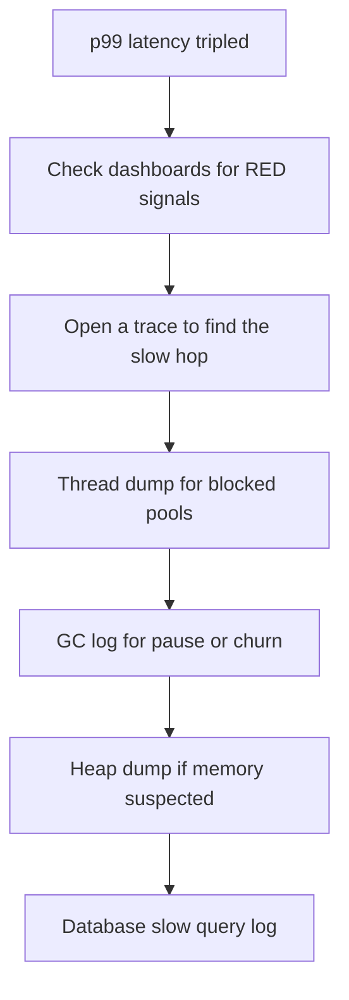

Production readiness is everything between "it works on my machine" and "I can be paged at 3 a.m. and stay calm". This page is a checklist for the questions a senior interviewer asks to see whether you have actually operated a Spring Boot service, not just written one.

## Startup and Shutdown

A pod gets a SIGTERM before it dies. Handle it or you drop in-flight requests on every deploy. Enable graceful shutdown so the server stops accepting new work but drains what is running, and give it a timeout.

```yaml
server:
  shutdown: graceful
spring:
  lifecycle:
    timeout-per-shutdown-phase: 30s   # drain window before forced termination
```

On shutdown, deregister from service discovery so no new traffic arrives, and close your own resources — thread pools, clients — in `@PreDestroy`.

```java
@PreDestroy
void close() {
    executor.shutdown();                          // stop accepting new tasks
    executor.awaitTermination(10, TimeUnit.SECONDS);  // let running tasks finish
}
```

## The JVM in a Container

The JVM sizing rules change inside a container. Set the heap as a **percentage** of the container limit with `-XX:MaxRAMPercentage`, not a fixed `-Xmx`, so it tracks the limit. Container-aware CPU detection affects `Runtime.availableProcessors()`, which sizes the common `ForkJoinPool`, `parallelStream`, and many pool defaults — get the CPU limit wrong and these are misconfigured everywhere.

> [!DANGER]
> The container memory limit must be **larger** than the heap. The JVM also uses metaspace, code cache, thread stacks, direct byte buffers, and GC structures — all off-heap. Set `-Xmx` (or `MaxRAMPercentage`) to the full limit and the process is OOM-killed by the kernel, not by a clean Java `OutOfMemoryError`.

```dockerfile
FROM eclipse-temurin:17-jre        # JRE only, smaller and less attack surface
RUN useradd -r app                 # never run as root
USER app
COPY --chown=app app.jar /app/app.jar
ENV JAVA_OPTS="-XX:MaxRAMPercentage=70.0"
ENTRYPOINT ["sh","-c","java $JAVA_OPTS -jar /app/app.jar"]
```

Prefer layered jars or Cloud Native Buildpacks so dependency layers cache and rebuilds are fast.

## Sizing the Pools That Cause Incidents

Most production incidents trace back to an exhausted pool. Size them deliberately.

| Pool | Property | Rule of thumb |
|---|---|---|
| Tomcat threads | `server.tomcat.threads.max` | Bounds concurrent requests; default 200 |
| HikariCP | `spring.datasource.hikari.maximum-pool-size` | Usually the real concurrency limit |
| HTTP client pool | client connection pool | Cap and set timeouts, or it starves |
| `@Async` executor | custom `ThreadPoolTaskExecutor` | Bound the queue, set a rejection policy |

> [!WARNING]
> The database connection pool is usually the true concurrency ceiling, not the Tomcat thread pool. If 200 request threads all wait on 10 connections, 190 block. Size Hikari to what the database can actually handle and match the rest to it — a bigger thread pool just moves the queue.

## Timeouts and Retries on Every Outbound Call

Distinguish the three timeouts: **connect** (time to establish the socket), **read** (time waiting for data on an established connection), and the overall **request** timeout. A missing read timeout is the classic hang — a thread waits forever for a reply that never comes.

```java
RestClient client = RestClient.builder()
    .requestFactory(new SimpleClientHttpRequestFactory() {{
        setConnectTimeout(2000);   // fail fast if the host is unreachable
        setReadTimeout(3000);      // never wait forever for a slow reply
    }}).build();
```

## Performance Levers

| Lever | What it buys | Cost |
|---|---|---|
| Lazy initialisation | Faster startup | First request slower |
| CDS / AppCDS | Faster class loading | Build step to create the archive |
| GraalVM native image | Fast startup, low memory | Reflection hints, longer builds, no JIT peak |
| Virtual threads | High concurrency for blocking I/O | Java 21+, pitfalls with pinning |

Enable virtual threads with `spring.threads.virtual.enabled=true` on Java 21 to serve many blocking calls cheaply. GraalVM native images start in milliseconds and use little memory, but need reflection and resource hints and give up JIT peak throughput — a genuine trade-off, not a free win.

## Rollout Safety

Ship changes so a bad one is survivable. Use health probes for readiness gating, roll out with **canary** or **blue-green**, guard risky code with **feature flags**, and make database migrations backwards compatible with **expand-and-contract**: add the new column, deploy code that writes both, backfill, then remove the old — over multiple releases.

> [!KEY]
> Never deploy a schema change and a code change that depend on each other in the same release. During a rolling deploy old and new code run at the same time against one schema, so each must work with the other's expectations. Expand-and-contract is how you make that safe.

## Security Hardening

Scan dependencies for known CVEs in CI. The Log4Shell and Spring4Shell incidents were both remotely exploitable flaws in ubiquitous libraries — the lesson is that a fast patch path and a dependency inventory are operational necessities, not paperwork. Keep secrets in a manager, terminate TLS, and never expose sensitive Actuator endpoints publicly.

## Cost, Capacity and Incident Triage

Load test with Gatling or k6 to find your **saturation point** — the load where latency knees upward — so you know your real capacity, then autoscale on a meaningful signal (latency or queue depth), not just CPU. When paged, follow a fixed triage path.



> [!TIP]
> "p99 latency just tripled, what do you do?" Say the tools in order: dashboards for the RED signals and which endpoint, a trace to find the slow hop, a thread dump to spot pool exhaustion or lock contention, the GC log for long pauses, a heap dump if memory looks wrong, and the database slow-query log. Naming the sequence is the senior signal.

## Right-Sizing Memory and GC

Pick a garbage collector for the workload: G1 (the default) suits most services; a latency-sensitive service on a large heap may benefit from ZGC or Shenandoah, which keep pauses low at some throughput cost. Whatever you choose, enable GC logging in production so a latency incident can be checked against pause times immediately, not reconstructed after the fact.

Right-size from evidence, not guesses. Watch the heap-used-after-GC trend: if it climbs steadily and never drops, you have a leak; if it sits high and stable, the working set is genuinely large and you need more heap or less retention. Set `-XX:+HeapDumpOnOutOfMemoryError` so the one OOM you do get leaves a heap dump to analyse instead of just dying.

```bash
java -XX:MaxRAMPercentage=70 -XX:+UseG1GC \
     -Xlog:gc*:file=/var/log/gc.log:time,uptime:filecount=5,filesize=10m \
     -XX:+HeapDumpOnOutOfMemoryError -jar app.jar   # keep a dump when memory runs out
```

Metaspace deserves its own watch — a classloader leak, common with repeated redeploys or heavy dynamic proxying, grows metaspace until the pod is killed, and it is invisible if you only look at the heap. Track both heap and non-heap memory in your dashboards so you can tell a heap leak apart from a metaspace leak before either causes an incident.

## Cheat sheet

- Enable `server.shutdown=graceful` and a shutdown timeout; close pools in `@PreDestroy`.
- Size heap with `-XX:MaxRAMPercentage`; the container limit must exceed the heap for off-heap memory.
- Container CPU limit drives `availableProcessors`, so it sizes `ForkJoinPool` and default pools.
- The database connection pool is usually the real concurrency ceiling — size others to match.
- Set connect and read timeouts on every outbound call; a missing read timeout is the classic hang.
- Virtual threads for blocking I/O on Java 21; GraalVM native for fast startup with reflection-hint cost.
- Backwards-compatible migrations with expand-and-contract; never couple schema and code in one release.
- Scan dependencies; Log4Shell and Spring4Shell prove a fast patch path is operational, not optional.
- Load test to find saturation; triage in order — dashboards, trace, thread dump, GC log, heap dump, slow-query log.

## Common mistakes

| Mistake | Fix |
|---|---|
| No graceful shutdown | Enable it and drain in-flight requests on SIGTERM |
| Fixed `-Xmx` equal to the container limit | Use `MaxRAMPercentage` and leave headroom for off-heap |
| Ignoring container CPU limits | Set them right; they drive `availableProcessors` and pools |
| Huge thread pool, tiny DB pool | Size Hikari first; match threads to real DB capacity |
| Outbound calls with no read timeout | Set connect and read timeouts everywhere |
| Coupled schema and code in one deploy | Use expand-and-contract across releases |
| Running the container as root | Add a non-root user in the Dockerfile |
| Autoscaling on CPU only | Scale on a meaningful signal like latency or queue depth |

## Summary

A production-ready Spring Boot service shuts down gracefully, sizes the JVM to its container with headroom for off-heap memory, and bounds every pool — remembering the database connection pool is usually the true concurrency limit. Every outbound call carries connect and read timeouts, rollouts are made survivable with readiness gating, canaries, feature flags, and expand-and-contract migrations, and dependencies are scanned so a Log4Shell-class flaw can be patched fast. Performance levers like virtual threads and native image are trade-offs to choose deliberately. When something breaks, a rehearsed triage order — dashboards, trace, thread dump, GC log, heap dump, slow-query log — turns a 3 a.m. page into a methodical investigation.

## Top Interview Questions

### Q1. What does graceful shutdown do and why does it matter for deployments?

When a pod is replaced, the orchestrator sends SIGTERM and then, after a grace period, SIGKILL. Without graceful shutdown the JVM stops immediately and every in-flight request is dropped, so users see errors on every single deploy. With `server.shutdown=graceful` and a timeout, the server stops accepting new connections but lets in-flight requests finish within the window, and the app deregisters from service discovery so the load balancer stops routing to it. You also close your own resources — thread pools, message consumers, HTTP clients — in `@PreDestroy` so background work finishes cleanly. This is what makes rolling deployments zero-downtime instead of a burst of 5xx errors every release.

### Q2. Why can't you set -Xmx equal to the container's memory limit?

Because the heap is not the only memory the JVM uses. On top of `-Xmx` the process needs metaspace for class metadata, the JIT code cache, a stack per thread, direct byte buffers used by NIO and many libraries, and GC bookkeeping — all off-heap. If you set the heap to the whole container limit, the total process footprint exceeds the limit, and the kernel's OOM killer terminates the container abruptly. That is worse than a Java `OutOfMemoryError` because there is no stack trace, no graceful handling, just a killed process. The fix is to size the heap to a percentage of the limit — `-XX:MaxRAMPercentage=70` is a common start — leaving headroom for everything off-heap, then tune based on observed usage.

### Q3. How does running in a container affect thread pool sizing?

The JVM sizes several defaults from `Runtime.availableProcessors()` — the common `ForkJoinPool` used by parallel streams, and various library thread pool defaults. Modern JVMs are container-aware and read the CPU limit (cgroup quota) rather than the host's core count, but if the limit is unset or misread, `availableProcessors` returns the host's full core count. Then a pod limited to 2 CPUs sizes its pools as if it had 32, oversubscribing the scheduler and causing context-switch thrash and latency. So set explicit, correct CPU limits, verify `availableProcessors` reports what you expect, and for critical pools set sizes explicitly rather than relying on the derived default. CPU limit correctness quietly determines concurrency behaviour everywhere.

### Q4. Why is the database connection pool usually the real concurrency limit?

A request that touches the database must hold a connection while it queries. If Tomcat allows 200 concurrent request threads but Hikari has 10 connections, then at most 10 requests make database progress at once and the other 190 block waiting for a connection — the thread pool size is irrelevant, the connection pool is the ceiling. Making the thread pool bigger just lengthens the queue of blocked threads and hides the bottleneck. The database itself can only handle so many concurrent connections before its own CPU and locks degrade, so you size Hikari to what the database can actually sustain, then size upstream pools to match. Recognising that the DB pool, not the web tier, gates throughput is a common senior differentiator.

### Q5. Explain connect, read, and request timeouts and which one causes the classic hang.

Connect timeout bounds how long you wait to establish the TCP connection — it fires when the remote host is down or unreachable. Read timeout (socket timeout) bounds how long you wait for data after the connection is established and the request is sent — it fires when the server accepted the request but is slow or hung replying. The overall request timeout bounds the whole operation end to end. The classic production hang is a missing read timeout: the connection succeeds, the request is sent, the server never responds, and the calling thread waits indefinitely, holding a thread and a connection. Under load these accumulate until the pool is exhausted and the whole service stalls. Always set both connect and read timeouts on every outbound call.

### Q6. What are the trade-offs of a GraalVM native image?

A native image compiles the application ahead of time into a standalone binary. The wins are dramatic startup — milliseconds instead of seconds — and much lower memory footprint, which is excellent for serverless, scale-to-zero, and dense deployments. The costs are real. Everything dynamic — reflection, proxies, resource loading — must be known at build time, so you provide reachability hints or the code fails at runtime; Spring Boot's AOT support generates many automatically, but third-party libraries can still break. Builds are much slower and memory-hungry. And because there is no JIT, you lose the peak throughput a long-running JVM reaches after warm-up, so for a steady high-throughput service the JVM may actually be faster. It is a deliberate trade, not a universal upgrade.

### Q7. How do virtual threads change how you build a Spring service?

Virtual threads, from Java 21 and enabled with `spring.threads.virtual.enabled=true`, are lightweight threads the JVM multiplexes onto a few OS threads. For blocking I/O — a service that mostly waits on databases and downstream HTTP calls — they let you keep the simple thread-per-request programming model while handling far more concurrency, because a blocked virtual thread costs almost nothing instead of pinning a scarce OS thread. This can remove the pressure that pushed teams toward reactive code purely for scalability. The pitfalls: a virtual thread pinned inside a `synchronized` block or a native call holds its carrier thread and negates the benefit, so you replace such locks with `ReentrantLock`, and your downstream pools and the database still have their own limits, so virtual threads raise the ceiling but do not remove those bottlenecks.

### Q8. What is expand-and-contract and why does it matter during a rolling deploy?

Expand-and-contract is how you evolve a database schema without downtime when old and new code run simultaneously during a rolling deploy. Instead of renaming a column in one step — which instantly breaks whichever version does not expect it — you expand: add the new column, deploy code that writes both old and new and reads whichever exists, backfill existing rows. Once every instance is on the new code, you contract in a later release: stop writing the old column and drop it. Each intermediate state is compatible with both the previous and next code version. It matters because during the rollout both versions hit the same single database, so a schema and the code that depends on it can never change together atomically; sequencing them across releases is the only safe way.

### Q9. Walk me through your response to "p99 latency just tripled."

I follow a fixed order so I do not thrash. First, dashboards: check the RED signals to confirm the spike, see which endpoint and which instances are affected, and whether error rate or throughput moved with it. Second, open a distributed trace for a slow request to find which hop consumed the added time — a downstream call, a database query, or queueing. Third, take a thread dump on an affected instance to spot pool exhaustion, lock contention, or threads all blocked on one resource. Fourth, check the GC log for long pauses or allocation churn. Fifth, if memory looks wrong, a heap dump to find a leak or bloat. Sixth, the database slow-query log if the trace pointed at the DB. Naming the tools in sequence, and stopping when the trace localises the problem, is the disciplined answer.

### Q10. What operational lesson do Log4Shell and Spring4Shell teach?

Both were critical, remotely exploitable vulnerabilities in extremely widely used libraries — Log4j and Spring — that turned a normal dependency into a live remote-code-execution risk overnight. The lesson is not about those specific bugs; it is that you cannot predict which dependency will be the next emergency, so operational readiness means two things. First, a dependency inventory and scanning in CI, so when a CVE drops you can instantly answer "are we affected and where". Second, a fast patch-and-deploy path, so you can ship the fixed version in hours, not weeks. Teams that had neither spent the incident manually grepping build files and hand-patching production. Dependency scanning and a quick release pipeline are operational safety equipment, not compliance paperwork.

### Q11. How do you find your service's capacity and autoscale on the right signal?

I load test with a tool like Gatling or k6, ramping traffic while watching latency and error rate to find the saturation point — the load where latency stops being flat and knees sharply upward, which is the real usable capacity, not the theoretical maximum. That number tells me how many instances I need for expected peak plus headroom. For autoscaling I avoid scaling purely on CPU, because a service bottlenecked on the database or on I/O can be at high latency while CPU is low, so CPU-based scaling never triggers. Instead I scale on a signal that tracks user pain and correlates with saturation — request latency, in-flight request count, or queue depth — so the system adds capacity when it is actually saturating, not when an unrelated metric happens to move.

### Q12. What belongs on a production-readiness checklist before a service goes live?

I cover a few categories. Lifecycle: graceful shutdown, readiness and liveness probes wired correctly, resources closed in `@PreDestroy`. Resources: heap sized as a percentage of a container limit that leaves off-heap headroom, correct CPU limits, and every pool — Tomcat, Hikari, HTTP clients, async executors — bounded and sized to the database's real capacity. Resilience: connect and read timeouts on every outbound call, retries only on idempotent operations, circuit breakers on flaky dependencies. Observability: metrics, tracing, structured logs, and SLO-based alerts. Security: dependency scanning, secrets in a manager, TLS, and Actuator locked down. Rollout: canary or blue-green, feature flags, and expand-and-contract migrations. Finally, a load test proving capacity and a rehearsed incident-triage runbook. If all of those are green, I am comfortable being on call for it.
